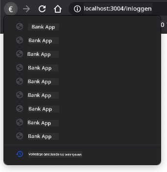

<!--
CO_OP_TRANSLATOR_METADATA:
{
  "original_hash": "8da1b5e2c63f749808858c53f37b8ce7",
  "translation_date": "2025-08-27T21:01:52+00:00",
  "source_file": "7-bank-project/1-template-route/README.md",
  "language_code": "nl"
}
-->
# Bouw een Bankapp Deel 1: HTML-sjablonen en Routes in een Webapp

## Pre-Lecture Quiz

[Pre-lecture quiz](https://ff-quizzes.netlify.app/web/quiz/41)

### Introductie

Sinds de komst van JavaScript in browsers worden websites interactiever en complexer dan ooit. Webtechnologieën worden nu vaak gebruikt om volledig functionele applicaties te maken die direct in een browser draaien, wat we [webapplicaties](https://en.wikipedia.org/wiki/Web_application) noemen. Omdat webapps zeer interactief zijn, willen gebruikers niet wachten op een volledige paginavernieuwing elke keer dat een actie wordt uitgevoerd. Daarom wordt JavaScript gebruikt om de HTML direct bij te werken via de DOM, om een soepelere gebruikerservaring te bieden.

In deze les leggen we de basis om een bankwebapp te maken, waarbij we HTML-sjablonen gebruiken om meerdere schermen te creëren die kunnen worden weergegeven en bijgewerkt zonder de hele HTML-pagina te herladen.

### Vereisten

Je hebt een lokale webserver nodig om de webapp te testen die we in deze les gaan bouwen. Als je er geen hebt, kun je [Node.js](https://nodejs.org) installeren en het commando `npx lite-server` gebruiken vanuit je projectmap. Dit maakt een lokale webserver aan en opent je app in een browser.

### Voorbereiding

Maak op je computer een map genaamd `bank` met daarin een bestand genaamd `index.html`. We beginnen met deze HTML [boilerplate](https://en.wikipedia.org/wiki/Boilerplate_code):

```html
<!DOCTYPE html>
<html lang="en">
  <head>
    <meta charset="UTF-8">
    <meta name="viewport" content="width=device-width, initial-scale=1.0">
    <title>Bank App</title>
  </head>
  <body>
    <!-- This is where you'll work -->
  </body>
</html>
```

---

## HTML-sjablonen

Als je meerdere schermen voor een webpagina wilt maken, zou een oplossing zijn om een apart HTML-bestand te maken voor elk scherm dat je wilt weergeven. Deze aanpak heeft echter enkele nadelen:

- Je moet de hele HTML herladen bij het wisselen van scherm, wat traag kan zijn.
- Het is moeilijk om gegevens te delen tussen de verschillende schermen.

Een andere aanpak is om slechts één HTML-bestand te hebben en meerdere [HTML-sjablonen](https://developer.mozilla.org/docs/Web/HTML/Element/template) te definiëren met behulp van het `<template>`-element. Een sjabloon is een herbruikbaar HTML-blok dat niet door de browser wordt weergegeven en dat tijdens runtime met JavaScript moet worden geïnstantieerd.

### Taak

We maken een bankapp met twee schermen: de inlogpagina en het dashboard. Laten we eerst in de HTML-body een tijdelijke aanduidingselement toevoegen dat we zullen gebruiken om de verschillende schermen van onze app te instantiëren:

```html
<div id="app">Loading...</div>
```

We geven het een `id` om het later gemakkelijker met JavaScript te kunnen vinden.

> Tip: omdat de inhoud van dit element wordt vervangen, kunnen we een laadbericht of indicator toevoegen die wordt weergegeven terwijl de app wordt geladen.

Vervolgens voegen we onderaan de HTML-sjabloon voor de inlogpagina toe. Voor nu plaatsen we daar alleen een titel en een sectie met een link die we zullen gebruiken voor de navigatie.

```html
<template id="login">
  <h1>Bank App</h1>
  <section>
    <a href="/dashboard">Login</a>
  </section>
</template>
```

Daarna voegen we een andere HTML-sjabloon toe voor de dashboardpagina. Deze pagina bevat verschillende secties:

- Een header met een titel en een uitloglink
- Het huidige saldo van de bankrekening
- Een lijst met transacties, weergegeven in een tabel

```html
<template id="dashboard">
  <header>
    <h1>Bank App</h1>
    <a href="/login">Logout</a>
  </header>
  <section>
    Balance: 100$
  </section>
  <section>
    <h2>Transactions</h2>
    <table>
      <thead>
        <tr>
          <th>Date</th>
          <th>Object</th>
          <th>Amount</th>
        </tr>
      </thead>
      <tbody></tbody>
    </table>
  </section>
</template>
```

> Tip: bij het maken van HTML-sjablonen, als je wilt zien hoe het eruit zal zien, kun je de `<template>`- en `</template>`-regels uitcommentariëren door ze te omringen met `<!-- -->`.

✅ Waarom denk je dat we `id`-attributen gebruiken op de sjablonen? Kunnen we iets anders gebruiken, zoals klassen?

## Sjablonen weergeven met JavaScript

Als je je huidige HTML-bestand in een browser probeert, zie je dat het blijft hangen op `Loading...`. Dat komt omdat we wat JavaScript-code moeten toevoegen om de HTML-sjablonen te instantiëren en weer te geven.

Het instantiëren van een sjabloon gebeurt meestal in 3 stappen:

1. Haal het sjabloonelement op in de DOM, bijvoorbeeld met [`document.getElementById`](https://developer.mozilla.org/docs/Web/API/Document/getElementById).
2. Kopieer het sjabloonelement met [`cloneNode`](https://developer.mozilla.org/docs/Web/API/Node/cloneNode).
3. Voeg het toe aan de DOM onder een zichtbaar element, bijvoorbeeld met [`appendChild`](https://developer.mozilla.org/docs/Web/API/Node/appendChild).

✅ Waarom moeten we het sjabloon klonen voordat we het aan de DOM toevoegen? Wat denk je dat er zou gebeuren als we deze stap overslaan?

### Taak

Maak een nieuw bestand genaamd `app.js` in je projectmap en importeer dat bestand in de `<head>`-sectie van je HTML:

```html
<script src="app.js" defer></script>
```

Nu maken we in `app.js` een nieuwe functie genaamd `updateRoute`:

```js
function updateRoute(templateId) {
  const template = document.getElementById(templateId);
  const view = template.content.cloneNode(true);
  const app = document.getElementById('app');
  app.innerHTML = '';
  app.appendChild(view);
}
```

Wat we hier doen, zijn precies de 3 hierboven beschreven stappen. We instantiëren het sjabloon met de id `templateId` en plaatsen de gekloonde inhoud binnen onze app-tijdelijke aanduiding. Merk op dat we `cloneNode(true)` moeten gebruiken om de hele substructuur van het sjabloon te kopiëren.

Roep nu deze functie aan met een van de sjablonen en bekijk het resultaat.

```js
updateRoute('login');
```

✅ Wat is het doel van deze code `app.innerHTML = '';`? Wat gebeurt er zonder?

## Routes maken

Bij een webapp noemen we *Routing* het proces waarbij **URL's** worden gekoppeld aan specifieke schermen die moeten worden weergegeven. Op een website met meerdere HTML-bestanden gebeurt dit automatisch omdat de bestandsstructuur wordt weerspiegeld in de URL. Bijvoorbeeld, met deze bestanden in je projectmap:

```
mywebsite/index.html
mywebsite/login.html
mywebsite/admin/index.html
```

Als je een webserver maakt met `mywebsite` als root, zal de URL-mapping zijn:

```
https://site.com            --> mywebsite/index.html
https://site.com/login.html --> mywebsite/login.html
https://site.com/admin/     --> mywebsite/admin/index.html
```

Voor onze webapp gebruiken we echter een enkel HTML-bestand dat alle schermen bevat, dus dit standaardgedrag helpt ons niet. We moeten deze mapping handmatig maken en het weergegeven sjabloon bijwerken met JavaScript.

### Taak

We gebruiken een eenvoudig object om een [map](https://en.wikipedia.org/wiki/Associative_array) te implementeren tussen URL-paden en onze sjablonen. Voeg dit object toe bovenaan je `app.js`-bestand.

```js
const routes = {
  '/login': { templateId: 'login' },
  '/dashboard': { templateId: 'dashboard' },
};
```

Laten we nu de `updateRoute`-functie een beetje aanpassen. In plaats van direct de `templateId` als argument door te geven, willen we deze ophalen door eerst naar de huidige URL te kijken en vervolgens onze map te gebruiken om de bijbehorende template-ID-waarde te krijgen. We kunnen [`window.location.pathname`](https://developer.mozilla.org/docs/Web/API/Location/pathname) gebruiken om alleen het padgedeelte van de URL te krijgen.

```js
function updateRoute() {
  const path = window.location.pathname;
  const route = routes[path];

  const template = document.getElementById(route.templateId);
  const view = template.content.cloneNode(true);
  const app = document.getElementById('app');
  app.innerHTML = '';
  app.appendChild(view);
}
```

Hier hebben we de routes die we hebben gedeclareerd gekoppeld aan het bijbehorende sjabloon. Je kunt testen of het correct werkt door de URL handmatig in je browser te wijzigen.

✅ Wat gebeurt er als je een onbekend pad invoert in de URL? Hoe zouden we dit kunnen oplossen?

## Navigatie toevoegen

De volgende stap voor onze app is om de mogelijkheid toe te voegen om tussen pagina's te navigeren zonder de URL handmatig te hoeven wijzigen. Dit houdt twee dingen in:

1. De huidige URL bijwerken
2. Het weergegeven sjabloon bijwerken op basis van de nieuwe URL

We hebben het tweede deel al afgehandeld met de `updateRoute`-functie, dus we moeten uitzoeken hoe we de huidige URL kunnen bijwerken.

We zullen JavaScript moeten gebruiken, en meer specifiek [`history.pushState`](https://developer.mozilla.org/docs/Web/API/History/pushState), waarmee we de URL kunnen bijwerken en een nieuwe invoer in de browsegeschiedenis kunnen maken zonder de HTML te herladen.

> Opmerking: Hoewel het HTML-anker-element [`<a href>`](https://developer.mozilla.org/docs/Web/HTML/Element/a) op zichzelf kan worden gebruikt om hyperlinks naar verschillende URL's te maken, zal het standaard de HTML herladen. Het is noodzakelijk om dit gedrag te voorkomen bij het afhandelen van routing met aangepaste JavaScript, door de functie `preventDefault()` te gebruiken op het klikgebeurtenis.

### Taak

Laten we een nieuwe functie maken die we kunnen gebruiken om in onze app te navigeren:

```js
function navigate(path) {
  window.history.pushState({}, path, path);
  updateRoute();
}
```

Deze methode werkt eerst de huidige URL bij op basis van het opgegeven pad en werkt vervolgens het sjabloon bij. De eigenschap `window.location.origin` retourneert de root-URL, zodat we een volledige URL kunnen reconstrueren vanuit een opgegeven pad.

Nu we deze functie hebben, kunnen we het probleem aanpakken dat we hebben als een pad niet overeenkomt met een gedefinieerde route. We passen de `updateRoute`-functie aan door een fallback toe te voegen naar een van de bestaande routes als we geen overeenkomst kunnen vinden.

```js
function updateRoute() {
  const path = window.location.pathname;
  const route = routes[path];

  if (!route) {
    return navigate('/login');
  }

  ...
```

Als een route niet kan worden gevonden, worden we nu doorgestuurd naar de `login`-pagina.

Laten we nu een functie maken om de URL te krijgen wanneer op een link wordt geklikt en om het standaardgedrag van de browserlink te voorkomen:

```js
function onLinkClick(event) {
  event.preventDefault();
  navigate(event.target.href);
}
```

Laten we het navigatiesysteem voltooien door bindings toe te voegen aan onze *Login*- en *Logout*-links in de HTML.

```html
<a href="/dashboard" onclick="onLinkClick(event)">Login</a>
...
<a href="/login" onclick="onLinkClick(event)">Logout</a>
```

Het `event`-object hierboven legt het `click`-gebeurtenis vast en geeft het door aan onze `onLinkClick`-functie.

Met behulp van het [`onclick`](https://developer.mozilla.org/docs/Web/API/GlobalEventHandlers/onclick)-attribuut binden we het `click`-gebeurtenis aan JavaScript-code, hier de aanroep van de `navigate()`-functie.

Probeer op deze links te klikken. Je zou nu tussen de verschillende schermen van je app moeten kunnen navigeren.

✅ De `history.pushState`-methode maakt deel uit van de HTML5-standaard en is geïmplementeerd in [alle moderne browsers](https://caniuse.com/?search=pushState). Als je een webapp bouwt voor oudere browsers, is er een truc die je kunt gebruiken in plaats van deze API: door een [hash (`#`)](https://en.wikipedia.org/wiki/URI_fragment) voor het pad te gebruiken, kun je routing implementeren die werkt met reguliere anker-navigatie en de pagina niet herlaadt, omdat het bedoeld was om interne links binnen een pagina te maken.

## Omgaan met de terug- en vooruitknoppen van de browser

Het gebruik van `history.pushState` maakt nieuwe invoeren in de navigatiegeschiedenis van de browser. Je kunt dat controleren door de *terugknop* van je browser ingedrukt te houden. Het zou iets moeten weergeven zoals dit:



Als je een paar keer op de terugknop klikt, zie je dat de huidige URL verandert en de geschiedenis wordt bijgewerkt, maar hetzelfde sjabloon blijft weergegeven.

Dat komt omdat de applicatie niet weet dat we `updateRoute()` moeten aanroepen elke keer dat de geschiedenis verandert. Als je kijkt naar de [`history.pushState`-documentatie](https://developer.mozilla.org/docs/Web/API/History/pushState), zie je dat als de status verandert - wat betekent dat we naar een andere URL zijn gegaan - het [`popstate`](https://developer.mozilla.org/docs/Web/API/Window/popstate_event)-gebeurtenis wordt geactiveerd. We zullen dat gebruiken om dit probleem op te lossen.

### Taak

Om ervoor te zorgen dat het weergegeven sjabloon wordt bijgewerkt wanneer de browsegeschiedenis verandert, voegen we een nieuwe functie toe die `updateRoute()` aanroept. We doen dat onderaan ons `app.js`-bestand:

```js
window.onpopstate = () => updateRoute();
updateRoute();
```

> Opmerking: we hebben hier een [pijlfunctie](https://developer.mozilla.org/docs/Web/JavaScript/Reference/Functions/Arrow_functions) gebruikt om onze `popstate`-eventhandler te declareren voor beknoptheid, maar een reguliere functie zou hetzelfde werken.

Hier is een opfrisvideo over pijlfuncties:

[](https://youtube.com/watch?v=OP6eEbOj2sc "Pijlfuncties")

> 🎥 Klik op de afbeelding hierboven voor een video over pijlfuncties.

Probeer nu de terug- en vooruitknoppen van je browser te gebruiken en controleer of de weergegeven route deze keer correct wordt bijgewerkt.

---

## 🚀 Uitdaging

Voeg een nieuw sjabloon en een route toe voor een derde pagina die de credits voor deze app toont.

## Post-Lecture Quiz

[Post-lecture quiz](https://ff-quizzes.netlify.app/web/quiz/42)

## Review & Zelfstudie

Routing is een van de verrassend lastige onderdelen van webontwikkeling, vooral nu het web verschuift van paginavernieuwingen naar Single Page Application-paginavernieuwingen. Lees wat meer over [hoe de Azure Static Web App-service](https://docs.microsoft.com/azure/static-web-apps/routes/?WT.mc_id=academic-77807-sagibbon) omgaat met routing. Kun je uitleggen waarom sommige van de beslissingen die in dat document worden beschreven noodzakelijk zijn?

## Opdracht

[Verbeter de routing](assignment.md)

---

**Disclaimer**:  
Dit document is vertaald met behulp van de AI-vertalingsservice [Co-op Translator](https://github.com/Azure/co-op-translator). Hoewel we streven naar nauwkeurigheid, dient u zich ervan bewust te zijn dat geautomatiseerde vertalingen fouten of onnauwkeurigheden kunnen bevatten. Het originele document in zijn oorspronkelijke taal moet worden beschouwd als de gezaghebbende bron. Voor cruciale informatie wordt professionele menselijke vertaling aanbevolen. Wij zijn niet aansprakelijk voor eventuele misverstanden of verkeerde interpretaties die voortvloeien uit het gebruik van deze vertaling.