<!--
CO_OP_TRANSLATOR_METADATA:
{
  "original_hash": "351678bece18f07d9daa987a881fb062",
  "translation_date": "2025-11-04T02:01:18+00:00",
  "source_file": "7-bank-project/1-template-route/README.md",
  "language_code": "nl"
}
-->
# Bouw een Bankapp Deel 1: HTML-sjablonen en Routes in een Webapp


Toen de Apollo 11-geleidingscomputer in 1969 naar de maan navigeerde, moest deze schakelen tussen verschillende programma's zonder het hele systeem opnieuw op te starten. Moderne webapplicaties werken op een vergelijkbare manier – ze veranderen wat je ziet zonder alles opnieuw te laden. Dit zorgt voor de soepele, responsieve ervaring die gebruikers tegenwoordig verwachten.

In tegenstelling tot traditionele websites die hele pagina's opnieuw laden bij elke interactie, werken moderne webapps alleen de delen bij die moeten veranderen. Deze aanpak, vergelijkbaar met hoe de missiecontrole schakelt tussen verschillende schermen terwijl constante communicatie behouden blijft, creëert die vloeiende ervaring waar we aan gewend zijn geraakt.

Dit maakt het verschil zo opvallend:

| Traditionele Multi-Page Apps | Moderne Single-Page Apps |
|-----------------------------|--------------------------|
| **Navigatie** | Volledige paginareload voor elk scherm | Directe inhoudswisseling |
| **Prestaties** | Langzamer door volledige HTML-downloads | Sneller met gedeeltelijke updates |
| **Gebruikerservaring** | Schokkerige paginawisselingen | Soepele, app-achtige overgangen |
| **Gegevensdeling** | Moeilijk tussen pagina's | Eenvoudig beheer van de status |
| **Ontwikkeling** | Meerdere HTML-bestanden om te onderhouden | Eén HTML met dynamische sjablonen |

**Begrijp de evolutie:**
- **Traditionele apps** vereisen serververzoeken voor elke navigatieactie
- **Moderne SPAs** laden één keer en werken inhoud dynamisch bij met JavaScript
- **Gebruikersverwachtingen** geven nu de voorkeur aan directe, naadloze interacties
- **Prestatievoordelen** omvatten verminderde bandbreedte en snellere reacties

In deze les bouwen we een bankapp met meerdere schermen die naadloos in elkaar overlopen. Net zoals wetenschappers modulaire instrumenten gebruiken die kunnen worden geconfigureerd voor verschillende experimenten, gebruiken wij HTML-sjablonen als herbruikbare componenten die naar behoefte kunnen worden weergegeven.

Je werkt met HTML-sjablonen (herbruikbare blauwdrukken voor verschillende schermen), JavaScript-routing (het systeem dat schakelt tussen schermen) en de geschiedenis-API van de browser (die ervoor zorgt dat de terugknop naar verwachting werkt). Dit zijn dezelfde fundamentele technieken die worden gebruikt door frameworks zoals React, Vue en Angular.

Aan het einde heb je een werkende bankapp die professionele principes van single-page applicaties demonstreert.


## Pre-Lecture Quiz

[Pre-lecture quiz](https://ff-quizzes.netlify.app/web/quiz/41)

### Wat Heb Je Nodig

We hebben een lokale webserver nodig om onze bankapp te testen – maak je geen zorgen, het is eenvoudiger dan het klinkt! Als je er nog geen hebt ingesteld, installeer dan gewoon [Node.js](https://nodejs.org) en voer `npx lite-server` uit vanuit je projectmap. Deze handige opdracht start een lokale server en opent je app automatisch in de browser.

### Voorbereiding

Maak op je computer een map genaamd `bank` met daarin een bestand genaamd `index.html`. We beginnen met deze HTML [boilerplate](https://en.wikipedia.org/wiki/Boilerplate_code):

```html
<!DOCTYPE html>
<html lang="en">
  <head>
    <meta charset="UTF-8">
    <meta name="viewport" content="width=device-width, initial-scale=1.0">
    <title>Bank App</title>
  </head>
  <body>
    <!-- This is where you'll work -->
  </body>
</html>
```

**Wat deze boilerplate biedt:**
- **Stelt** de HTML5-documentstructuur in met de juiste DOCTYPE-verklaring
- **Configureert** tekencodering als UTF-8 voor internationale tekstondersteuning
- **Maakt** responsief ontwerp mogelijk met de viewport meta tag voor mobiele compatibiliteit
- **Stelt** een beschrijvende titel in die in het browsertabblad verschijnt
- **Creëert** een schone body-sectie waar we onze applicatie gaan bouwen

> 📁 **Projectstructuur Voorbeeld**
> 
> **Aan het einde van deze les bevat je project:**
> ```
> bank/
> ├── index.html      <!-- Main HTML with templates -->
> ├── app.js          <!-- Routing and navigation logic -->
> └── style.css       <!-- (Optional for future lessons) -->
> ```
> 
> **Bestandsverantwoordelijkheden:**
> - **index.html**: Bevat alle sjablonen en biedt de appstructuur
> - **app.js**: Behandelt routing, navigatie en sjabloonbeheer
> - **Sjablonen**: Definieert de UI voor inloggen, dashboard en andere schermen

---

## HTML-sjablonen

Sjablonen lossen een fundamenteel probleem in webontwikkeling op. Toen Gutenberg in de jaren 1440 de boekdrukkunst met losse letters uitvond, realiseerde hij zich dat hij in plaats van hele pagina's te snijden, herbruikbare letterblokken kon maken en ze naar behoefte kon rangschikken. HTML-sjablonen werken volgens hetzelfde principe – in plaats van aparte HTML-bestanden voor elk scherm te maken, definieer je herbruikbare structuren die kunnen worden weergegeven wanneer dat nodig is.

```mermaid
flowchart TD
    A["📋 Template Definition"] --> B["💬 Hidden in DOM"]
    B --> C["🔍 JavaScript Finds Template"]
    C --> D["📋 Clone Template Content"]
    D --> E["🔗 Attach to Visible DOM"]
    E --> F["👁️ User Sees Content"]
    
    G["Login Template"] --> A
    H["Dashboard Template"] --> A
    I["Future Templates"] --> A
    
    style A fill:#e3f2fd
    style D fill:#e8f5e8
    style F fill:#fff3e0
    style B fill:#f3e5f5
```



Zie sjablonen als blauwdrukken voor verschillende delen van je app. Net zoals een architect één blauwdruk maakt en deze meerdere keren gebruikt in plaats van identieke kamers opnieuw te tekenen, maken wij sjablonen één keer en gebruiken we ze wanneer nodig. De browser houdt deze sjablonen verborgen totdat JavaScript ze activeert.

Als je meerdere schermen voor een webpagina wilt maken, zou je één HTML-bestand kunnen maken voor elk scherm dat je wilt weergeven. Deze oplossing brengt echter enkele ongemakken met zich mee:

- Je moet de hele HTML opnieuw laden bij het wisselen van scherm, wat traag kan zijn.
- Het is moeilijk om gegevens te delen tussen de verschillende schermen.

Een andere aanpak is om slechts één HTML-bestand te hebben en meerdere [HTML-sjablonen](https://developer.mozilla.org/docs/Web/HTML/Element/template) te definiëren met behulp van het `<template>`-element. Een sjabloon is een herbruikbaar HTML-blok dat niet door de browser wordt weergegeven en dat bij runtime moet worden geïnstantieerd met JavaScript.

### Laten We Het Bouwen

We gaan een bankapp maken met twee hoofdschermen: een inlogpagina en een dashboard. Laten we eerst een tijdelijke aanduidingselement toevoegen aan de HTML-body – hier verschijnen al onze verschillende schermen:

```html
<div id="app">Loading...</div>
```

**Begrijp deze tijdelijke aanduiding:**
- **Creëert** een container met de ID "app" waar alle schermen worden weergegeven
- **Toont** een laadbericht totdat de JavaScript het eerste scherm initialiseert
- **Biedt** een enkel montagepunt voor onze dynamische inhoud
- **Maakt** eenvoudig richten vanuit JavaScript mogelijk met `document.getElementById()`

> 💡 **Handige Tip**: Omdat de inhoud van dit element wordt vervangen, kunnen we een laadbericht of indicator plaatsen die wordt weergegeven terwijl de app wordt geladen.

Vervolgens voegen we hieronder de HTML-sjabloon toe voor de inlogpagina. Voor nu plaatsen we daar alleen een titel en een sectie met een link die we gebruiken om de navigatie uit te voeren.

```html
<template id="login">
  <h1>Bank App</h1>
  <section>
    <a href="/dashboard">Login</a>
  </section>
</template>
```

**Uitleg over deze inlogsjabloon:**
- **Definieert** een sjabloon met de unieke identificatie "login" voor JavaScript-doelgerichtheid
- **Bevat** een hoofdkop die de branding van de app vastlegt
- **Bevat** een semantisch `<section>`-element om gerelateerde inhoud te groeperen
- **Biedt** een navigatielink die gebruikers naar het dashboard leidt

Daarna voegen we een andere HTML-sjabloon toe voor de dashboardpagina. Deze pagina bevat verschillende secties:

- Een header met een titel en een uitloglink
- Het huidige saldo van de bankrekening
- Een lijst met transacties, weergegeven in een tabel

```html
<template id="dashboard">
  <header>
    <h1>Bank App</h1>
    <a href="/login">Logout</a>
  </header>
  <section>
    Balance: 100$
  </section>
  <section>
    <h2>Transactions</h2>
    <table>
      <thead>
        <tr>
          <th>Date</th>
          <th>Object</th>
          <th>Amount</th>
        </tr>
      </thead>
      <tbody></tbody>
    </table>
  </section>
</template>
```

**Laten we elk deel van dit dashboard begrijpen:**
- **Structureert** de pagina met een semantisch `<header>`-element dat navigatie bevat
- **Toont** de app-titel consistent op alle schermen voor branding
- **Biedt** een uitloglink die teruggaat naar het inlogscherm
- **Toont** het huidige rekeningsaldo in een speciale sectie
- **Organiseert** transactiegegevens met een goed gestructureerde HTML-tabel
- **Definieert** tabelkoppen voor de kolommen Datum, Object en Bedrag
- **Laat** de tabelbody leeg voor dynamische inhoudsinjectie later

> 💡 **Handige Tip**: Bij het maken van HTML-sjablonen, als je wilt zien hoe het eruit zal zien, kun je de `<template>` en `</template>`-regels uitcommentariëren door ze te omringen met `<!-- -->`.

### 🔄 **Pedagogische Check-in**
**Begrip van het sjabloonsysteem**: Zorg ervoor dat je begrijpt:
- ✅ Hoe sjablonen verschillen van gewone HTML-elementen
- ✅ Waarom sjablonen verborgen blijven totdat ze door JavaScript worden geactiveerd
- ✅ Het belang van semantische HTML-structuur in sjablonen
- ✅ Hoe sjablonen herbruikbare UI-componenten mogelijk maken

**Snelle Zelftest**: Wat gebeurt er als je de `<template>`-tags verwijdert rond je HTML?
*Antwoord: De inhoud wordt onmiddellijk zichtbaar en verliest zijn sjabloonfunctionaliteit*

**Architectuurvoordelen**: Sjablonen bieden:
- **Herbruikbaarheid**: Eén definitie, meerdere instanties
- **Prestaties**: Geen overbodige HTML-parsing
- **Onderhoudbaarheid**: Gecentraliseerde UI-structuur
- **Flexibiliteit**: Dynamische inhoudswisseling

✅ Waarom denk je dat we `id`-attributen gebruiken op de sjablonen? Kunnen we iets anders gebruiken, zoals klassen?

## Sjablonen Tot Leven Brengen met JavaScript

Nu moeten we onze sjablonen functioneel maken. Net zoals een 3D-printer een digitale blauwdruk neemt en een fysiek object creëert, neemt JavaScript onze verborgen sjablonen en maakt zichtbare, interactieve elementen die gebruikers kunnen zien en gebruiken.

Het proces volgt drie consistente stappen die de basis vormen van moderne webontwikkeling. Zodra je dit patroon begrijpt, herken je het in veel frameworks en bibliotheken.

Als je je huidige HTML-bestand in een browser probeert, zie je dat het blijft steken op `Loading...`. Dat komt omdat we wat JavaScript-code moeten toevoegen om de HTML-sjablonen te instantiëren en weer te geven.

Het instantiëren van een sjabloon gebeurt meestal in 3 stappen:

1. Haal het sjabloonelement op in de DOM, bijvoorbeeld met [`document.getElementById`](https://developer.mozilla.org/docs/Web/API/Document/getElementById).
2. Cloneer het sjabloonelement met [`cloneNode`](https://developer.mozilla.org/docs/Web/API/Node/cloneNode).
3. Voeg het toe aan de DOM onder een zichtbaar element, bijvoorbeeld met [`appendChild`](https://developer.mozilla.org/docs/Web/API/Node/appendChild).

```mermaid
flowchart TD
    A[🔍 Step 1: Find Template] --> B[📋 Step 2: Clone Template]
    B --> C[🔗 Step 3: Attach to DOM]
    
    A1["document.getElementById('login')"] --> A
    B1["template.content.cloneNode(true)"] --> B  
    C1["app.appendChild(view)"] --> C
    
    C --> D[👁️ Template Visible to User]
    
    style A fill:#e1f5fe
    style B fill:#f3e5f5
    style C fill:#e8f5e8
    style D fill:#fff3e0
```



**Visuele uitleg van het proces:**
- **Stap 1** lokaliseert het verborgen sjabloon in de DOM-structuur
- **Stap 2** maakt een werkende kopie die veilig kan worden aangepast
- **Stap 3** voegt de kopie toe aan het zichtbare paginagebied
- **Resultaat** is een functioneel scherm waarmee gebruikers kunnen interageren

✅ Waarom moeten we het sjabloon klonen voordat we het aan de DOM toevoegen? Wat denk je dat er zou gebeuren als we deze stap overslaan?

### Taak

Maak een nieuw bestand genaamd `app.js` in je projectmap en importeer dat bestand in de `<head>`-sectie van je HTML:

```html
<script src="app.js" defer></script>
```

**Begrijp deze scriptimport:**
- **Linkt** het JavaScript-bestand aan ons HTML-document
- **Gebruikt** het `defer`-attribuut om ervoor te zorgen dat het script wordt uitgevoerd nadat het HTML-parsen is voltooid
- **Maakt** toegang tot alle DOM-elementen mogelijk omdat ze volledig zijn geladen voordat het script wordt uitgevoerd
- **Volgt** moderne best practices voor scriptladen en prestaties

Nu, in `app.js`, maken we een nieuwe functie `updateRoute`:

```js
function updateRoute(templateId) {
  const template = document.getElementById(templateId);
  const view = template.content.cloneNode(true);
  const app = document.getElementById('app');
  app.innerHTML = '';
  app.appendChild(view);
}
```

**Stap voor stap, wat er gebeurt:**
- **Lokaliseert** het sjabloonelement met behulp van zijn unieke ID
- **Creëert** een diepe kopie van de inhoud van het sjabloon met `cloneNode(true)`
- **Vindt** de app-container waar de inhoud wordt weergegeven
- **Leegt** eventuele bestaande inhoud uit de app-container
- **Voegt** de gekloonde sjablooninhoud toe aan de zichtbare DOM

Roep nu deze functie aan met een van de sjablonen en bekijk het resultaat.

```js
updateRoute('login');
```

**Wat deze functieaanroep bereikt:**
- **Activeert** het inlogsjabloon door de ID ervan als parameter door te geven
- **Toont** hoe je programmeerbaar kunt schakelen tussen verschillende app-schermen
- **Toont** het inlogscherm in plaats van het "Loading..."-bericht

✅ Wat is het doel van deze code `app.innerHTML = '';`? Wat gebeurt er zonder?

## Routes Maken

Routing gaat in wezen over het verbinden van URL's met de juiste inhoud. Denk aan hoe vroege telefonisten schakelborden gebruikten om oproepen door te verbinden – ze namen een inkomend verzoek en stuurden het naar de juiste bestemming. Webrouting werkt op een vergelijkbare manier, waarbij een URL-verzoek wordt genomen en wordt bepaald welke inhoud moet worden weergegeven.

```mermaid
flowchart LR
    A["🌐 URL Path<br/>/dashboard"] --> B["🗺️ Routes Object<br/>Lookup"]
    B --> C["🎯 Template ID<br/>'dashboard'"]
    C --> D["📌 Find Template<br/>getElementById"]
    D --> E["👁️ Display Screen<br/>Clone & Append"]
    
    F["📍 /login"] --> G["🎯 'login'"]
    H["📍 /unknown"] --> I["❌ Not Found"]
    I --> J["🔄 Redirect to /login"]
    
    style B fill:#e3f2fd
    style E fill:#e8f5e8
    style I fill:#ffebee
    style J fill:#fff3e0
```



Traditioneel behandelden webservers dit door verschillende HTML-bestanden te serveren voor verschillende URL's. Omdat we een single-page app bouwen, moeten we deze routing zelf afhandelen met JavaScript. Deze aanpak geeft ons meer controle over de gebruikerservaring en prestaties.

```mermaid
flowchart LR
    A["🌐 URL Path<br/>/dashboard"] --> B["🗺️ Routes Object<br/>Lookup"]
    B --> C["🎯 Template ID<br/>'dashboard'"]
    C --> D["📄 Find Template<br/>getElementById"]
    D --> E["👁️ Display Screen<br/>Clone & Append"]
    
    F["📍 /login"] --> G["🎯 'login'"]
    H["📍 /unknown"] --> I["❌ Not Found"]
    I --> J["🔄 Redirect to /login"]
    
    style B fill:#e3f2fd
    style E fill:#e8f5e8
    style I fill:#ffebee
    style J fill:#fff3e0
```



**Begrijp de routingstroom:**
- **URL-wijzigingen** activeren een zoekopdracht in onze routesconfiguratie
- **Geldige routes** worden gekoppeld aan specifieke sjabloon-ID's voor weergave
- **Ongeldige routes** activeren een fallback-gedrag om gebroken toestanden te voorkomen
- **Sjabloonweergave** volgt het eerder geleerde driestappenproces

Bij een webapp noemen we *Routing* de intentie om **URL's** te koppelen aan specifieke schermen die moeten worden weergegeven. Op een website met meerdere HTML-bestanden gebeurt dit automatisch omdat de bestandspaden worden weerspiegeld in de URL. Bijvoorbeeld, met deze bestanden in je projectmap:

```
mywebsite/index.html
mywebsite/login.html
mywebsite/admin/index.html
```

Als je een webserver maakt met `mywebsite` als root, zal de URL-mapping zijn:

```
https://site.com            --> mywebsite/index.html
https://site.com/login.html --> mywebsite/login.html
https://site.com/admin/     --> mywebsite/admin/index.html
```

Echter, voor onze webapp gebruiken we één HTML-bestand dat alle schermen bevat, dus dit standaardgedrag zal ons niet helpen. We moeten deze map handmatig maken en de weergegeven sjabloon bijwerken met JavaScript.

### Taak

We gebruiken een eenvoudig object om een [map](https://en.wikipedia.org/wiki/Associative_array) te implementeren tussen URL-paden en onze sjablonen. Voeg dit object toe bovenaan je `app.js`-bestand.

```js
const routes = {
  '/login': { templateId: 'login' },
  '/dashboard': { templateId: 'dashboard' },
};
```

**Begrijp deze routesconfiguratie:**
- **Definieert** een mapping tussen URL-paden en sjabloonidentificaties
- **Gebruikt** objectsyntaxis waarbij sleutels URL-paden zijn en waarden sjablooninformatie bevatten
- **Maakt** eenvoudige opzoeking mogelijk van welke sjabloon moet worden weergegeven voor een bepaalde URL
- **Biedt** een schaalbare structuur voor het toevoegen van nieuwe routes in de toekomst
Laten we de `updateRoute` functie een beetje aanpassen. In plaats van direct de `templateId` als argument door te geven, willen we deze ophalen door eerst naar de huidige URL te kijken en vervolgens onze map te gebruiken om de bijbehorende template-ID waarde te vinden. We kunnen [`window.location.pathname`](https://developer.mozilla.org/docs/Web/API/Location/pathname) gebruiken om alleen het padgedeelte van de URL te verkrijgen.

```js
function updateRoute() {
  const path = window.location.pathname;
  const route = routes[path];

  const template = document.getElementById(route.templateId);
  const view = template.content.cloneNode(true);
  const app = document.getElementById('app');
  app.innerHTML = '';
  app.appendChild(view);
}
```

**Wat gebeurt hier precies:**
- **Haalt** het huidige pad uit de URL van de browser met `window.location.pathname`
- **Zoekt** de bijbehorende routeconfiguratie in ons routes-object
- **Haalt** de template-ID op uit de routeconfiguratie
- **Volgt** hetzelfde proces voor het renderen van templates als eerder
- **Creëert** een dynamisch systeem dat reageert op URL-wijzigingen

Hier hebben we de routes die we hebben gedeclareerd gekoppeld aan de bijbehorende template. Je kunt testen of dit correct werkt door de URL handmatig in je browser te wijzigen.

✅ Wat gebeurt er als je een onbekend pad invoert in de URL? Hoe zouden we dit kunnen oplossen?

## Navigatie toevoegen

Nu de routing is ingesteld, hebben gebruikers een manier nodig om door de app te navigeren. Traditionele websites laden hele pagina's opnieuw bij het klikken op links, maar wij willen zowel de URL als de inhoud bijwerken zonder dat de pagina opnieuw wordt geladen. Dit zorgt voor een soepelere ervaring, vergelijkbaar met hoe desktopapplicaties tussen verschillende weergaven schakelen.

We moeten twee dingen coördineren: het bijwerken van de URL van de browser zodat gebruikers pagina's kunnen bookmarken en links kunnen delen, en het weergeven van de juiste inhoud. Wanneer dit correct wordt geïmplementeerd, creëert dit de naadloze navigatie die gebruikers verwachten van moderne applicaties.


### 🔄 **Pedagogische Check-in**
**Single-Page Application Architectuur**: Controleer je begrip van het complete systeem:
- ✅ Hoe verschilt client-side routing van traditionele server-side routing?
- ✅ Waarom is de History API essentieel voor correcte SPA-navigatie?
- ✅ Hoe zorgen templates voor dynamische inhoud zonder pagina-herlaad?
- ✅ Welke rol speelt event handling bij het onderscheppen van navigatie?

**Systeemintegratie**: Jouw SPA demonstreert:
- **Templatebeheer**: Herbruikbare UI-componenten met dynamische inhoud
- **Client-side Routing**: URL-beheer zonder serververzoeken
- **Event-driven Architectuur**: Responsieve navigatie en gebruikersinteracties
- **Browserintegratie**: Correcte ondersteuning voor geschiedenis en terug/vooruit-knoppen
- **Prestatieoptimalisatie**: Snelle overgangen en verminderde serverbelasting

**Professionele Patronen**: Je hebt geïmplementeerd:
- **Model-View Scheiding**: Templates gescheiden van applicatielogica
- **State Management**: URL-status gesynchroniseerd met weergegeven inhoud
- **Progressieve Verbetering**: JavaScript verbetert basis HTML-functionaliteit
- **Gebruikerservaring**: Soepele, app-achtige navigatie zonder pagina-herlaad

> � **Architectuur Inzicht**: Navigatiesysteemcomponenten
>
> **Wat je bouwt:**
> - **🔄 URL-beheer**: Update de adresbalk van de browser zonder pagina-herlaad
> - **📋 Templatesysteem**: Wisselt inhoud dynamisch op basis van de huidige route  
> - **📚 Geschiedenisintegratie**: Ondersteunt terug/vooruit-knoppen van de browser
> - **🛡️ Foutafhandeling**: Elegante oplossingen voor ongeldige of ontbrekende routes
>
> **Hoe componenten samenwerken:**
> - **Luistert** naar navigatiegebeurtenissen (klikken, geschiedeniswijzigingen)
> - **Update** de URL met behulp van de History API
> - **Rendert** de juiste template voor de nieuwe route
> - **Behoudt** een naadloze gebruikerservaring

De volgende stap voor onze app is om de mogelijkheid toe te voegen om tussen pagina's te navigeren zonder de URL handmatig te hoeven wijzigen. Dit impliceert twee dingen:

  1. Het bijwerken van de huidige URL
  2. Het bijwerken van de weergegeven template op basis van de nieuwe URL

We hebben het tweede deel al geregeld met de `updateRoute` functie, dus we moeten uitzoeken hoe we de huidige URL kunnen bijwerken.

We zullen JavaScript moeten gebruiken, en meer specifiek [`history.pushState`](https://developer.mozilla.org/docs/Web/API/History/pushState), waarmee je de URL kunt bijwerken en een nieuwe invoer in de browsegeschiedenis kunt maken, zonder de HTML opnieuw te laden.

> ⚠️ **Belangrijke Opmerking**: Hoewel het HTML anker-element [`<a href>`](https://developer.mozilla.org/docs/Web/HTML/Element/a) op zichzelf kan worden gebruikt om hyperlinks naar verschillende URL's te maken, zal het standaard de HTML opnieuw laden. Het is noodzakelijk om dit gedrag te voorkomen bij het afhandelen van routing met aangepaste JavaScript, door de preventDefault() functie te gebruiken op het klikgebeurtenis.

### Taak

Laten we een nieuwe functie maken die we kunnen gebruiken om in onze app te navigeren:

```js
function navigate(path) {
  window.history.pushState({}, path, path);
  updateRoute();
}
```

**Begrijpen van deze navigatiefunctie:**
- **Update** de URL van de browser naar het nieuwe pad met `history.pushState`
- **Voegt** een nieuwe invoer toe aan de geschiedenisstack van de browser voor correcte ondersteuning van terug/vooruit-knoppen
- **Activeert** de `updateRoute()` functie om de bijbehorende template weer te geven
- **Behoudt** de single-page app ervaring zonder pagina-herlaad

Deze methode werkt eerst de huidige URL bij op basis van het opgegeven pad en werkt vervolgens de template bij. De eigenschap `window.location.origin` retourneert de URL-root, waardoor we een volledige URL kunnen reconstrueren vanuit een gegeven pad.

Nu we deze functie hebben, kunnen we het probleem aanpakken dat we hebben als een pad niet overeenkomt met een gedefinieerde route. We zullen de `updateRoute` functie aanpassen door een fallback toe te voegen naar een van de bestaande routes als we geen match kunnen vinden.

```js
function updateRoute() {
  const path = window.location.pathname;
  const route = routes[path];

  if (!route) {
    return navigate('/login');
  }

  const template = document.getElementById(route.templateId);
  const view = template.content.cloneNode(true);
  const app = document.getElementById('app');
  app.innerHTML = '';
  app.appendChild(view);
}
```

**Belangrijke punten om te onthouden:**
- **Controleert** of er een route bestaat voor het huidige pad
- **Verwijst** door naar de inlogpagina wanneer een ongeldige route wordt geopend
- **Biedt** een fallback-mechanisme dat gebroken navigatie voorkomt
- **Zorgt ervoor** dat gebruikers altijd een geldige scherm zien, zelfs met onjuiste URL's

Als er geen route kan worden gevonden, verwijzen we nu door naar de `login` pagina.

Laten we nu een functie maken om de URL te verkrijgen wanneer op een link wordt geklikt, en om het standaard linkgedrag van de browser te voorkomen:

```js
function onLinkClick(event) {
  event.preventDefault();
  navigate(event.target.href);
}
```

**Uitleg van deze klikhandler:**
- **Voorkomt** het standaard linkgedrag van de browser met `preventDefault()`
- **Haalt** de bestemmings-URL op uit het aangeklikte linkelement
- **Roep** onze aangepaste navigatiefunctie aan in plaats van de pagina opnieuw te laden
- **Behoudt** de soepele single-page applicatie ervaring

```html
<a href="/dashboard" onclick="onLinkClick(event)">Login</a>
...
<a href="/login" onclick="onLinkClick(event)">Logout</a>
```

**Wat deze onclick-binding bereikt:**
- **Verbindt** elke link met ons aangepaste navigatiesysteem
- **Geeft** het klikgebeurtenis door aan onze `onLinkClick` functie voor verwerking
- **Maakt** soepele navigatie mogelijk zonder pagina-herlaad
- **Behoudt** een correcte URL-structuur die gebruikers kunnen bookmarken of delen

Het [`onclick`](https://developer.mozilla.org/docs/Web/API/GlobalEventHandlers/onclick) attribuut koppelt het `click`-gebeurtenis aan JavaScript-code, hier de aanroep van de `navigate()` functie.

Probeer op deze links te klikken, je zou nu in staat moeten zijn om tussen de verschillende schermen van je app te navigeren.

✅ De `history.pushState` methode maakt deel uit van de HTML5-standaard en is geïmplementeerd in [alle moderne browsers](https://caniuse.com/?search=pushState). Als je een webapp bouwt voor oudere browsers, is er een truc die je kunt gebruiken in plaats van deze API: door een [hash (`#`)](https://en.wikipedia.org/wiki/URI_fragment) te gebruiken vóór het pad kun je routing implementeren die werkt met reguliere anker-navigatie en de pagina niet opnieuw laadt, omdat het bedoeld was om interne links binnen een pagina te maken.

## De Terug- en Vooruitknoppen laten werken

De terug- en vooruitknoppen zijn fundamenteel voor het browsen op het web, net zoals NASA-missiecontrollers eerdere systeemstatussen kunnen bekijken tijdens ruimtemissies. Gebruikers verwachten dat deze knoppen werken, en wanneer dat niet het geval is, breekt het de verwachte browse-ervaring.

Onze single-page app heeft extra configuratie nodig om dit te ondersteunen. De browser onderhoudt een geschiedenisstack (waar we aan hebben toegevoegd met `history.pushState`), maar wanneer gebruikers door deze geschiedenis navigeren, moet onze app reageren door de weergegeven inhoud dienovereenkomstig bij te werken.


**Belangrijke interactiepunten:**
- **Gebruikersacties** activeren navigatie via klikken of browserknoppen
- **App onderschept** linkklikken om pagina-herlaad te voorkomen
- **History API** beheert URL-wijzigingen en de geschiedenisstack van de browser
- **Templates** bieden de inhoudsstructuur voor elk scherm
- **Event listeners** zorgen ervoor dat de app reageert op alle soorten navigatie

Het gebruik van `history.pushState` creëert nieuwe invoeren in de navigatiegeschiedenis van de browser. Je kunt dat controleren door de *terugknop* van je browser ingedrukt te houden, het zou er ongeveer zo uit moeten zien:


Als je een paar keer op de terugknop klikt, zie je dat de huidige URL verandert en de geschiedenis wordt bijgewerkt, maar dezelfde template blijft worden weergegeven.

Dat komt omdat de applicatie niet weet dat we `updateRoute()` moeten aanroepen telkens wanneer de geschiedenis verandert. Als je kijkt naar de [`history.pushState` documentatie](https://developer.mozilla.org/docs/Web/API/History/pushState), kun je zien dat als de status verandert - wat betekent dat we naar een andere URL zijn gegaan - het [`popstate`](https://developer.mozilla.org/docs/Web/API/Window/popstate_event) evenement wordt geactiveerd. We zullen dat gebruiken om dat probleem op te lossen.

### Taak

Om ervoor te zorgen dat de weergegeven template wordt bijgewerkt wanneer de browsergeschiedenis verandert, zullen we een nieuwe functie koppelen die `updateRoute()` aanroept. We doen dat onderaan ons `app.js` bestand:

```js
window.onpopstate = () => updateRoute();
updateRoute();
```

**Begrijpen van deze geschiedenisintegratie:**
- **Luistert** naar `popstate` evenementen die optreden wanneer gebruikers navigeren met browserknoppen
- **Gebruikt** een arrow function voor beknopte event handler-syntaxis
- **Roep** `updateRoute()` automatisch aan telkens wanneer de geschiedenisstatus verandert
- **Initialiseert** de app door `updateRoute()` aan te roepen wanneer de pagina voor het eerst wordt geladen
- **Zorgt ervoor** dat de juiste template wordt weergegeven, ongeacht hoe gebruikers navigeren

> 💡 **Pro Tip**: We hebben hier een [arrow function](https://developer.mozilla.org/docs/Web/JavaScript/Reference/Functions/Arrow_functions) gebruikt om onze `popstate` event handler te declareren voor beknoptheid, maar een reguliere functie zou hetzelfde werken.

Hier is een opfrisvideo over arrow functions:

[](https://youtube.com/watch?v=OP6eEbOj2sc "Arrow Functions")

> 🎥 Klik op de afbeelding hierboven voor een video over arrow functions.

Probeer nu de terug- en vooruitknoppen van je browser te gebruiken en controleer of de weergegeven route deze keer correct wordt bijgewerkt.

### ⚡ **Wat Je Binnen 5 Minuten Kunt Doen**
- [ ] Test de navigatie van je bankapp met de terug/vooruit-knoppen van de browser
- [ ] Probeer handmatig verschillende URL's in de adresbalk in te voeren om de routing te testen
- [ ] Open de browser DevTools en inspecteer hoe templates in de DOM worden gekopieerd
- [ ] Experimenteer met het toevoegen van console.log statements om de routingflow te volgen

### 🎯 **Wat Je Binnen Een Uur Kunt Bereiken**
- [ ] Maak de quiz na de les en begrijp SPA-architectuurconcepten
- [ ] Voeg CSS-styling toe om de templates van je bankapp er professioneel uit te laten zien
- [ ] Implementeer de 404-foutpagina-uitdaging met correcte foutafhandeling
- [ ] Maak de credits-pagina-uitdaging met extra routingfunctionaliteit
- [ ] Voeg laadstatussen en overgangen toe tussen templatewisselingen

### 📅 **Je Week-Lange SPA Ontwikkelingsreis**
- [ ] Voltooi de volledige bankapp met formulieren, gegevensbeheer en persistentie
- [ ] Voeg geavanceerde routingfuncties toe zoals routeparameters en geneste routes
- [ ] Implementeer navigatiebeveiligingen en authenticatie-gebaseerde routing
- [ ] Maak herbruikbare templatecomponenten en een componentbibliotheek
- [ ] Voeg animaties en overgangen toe voor een soepelere gebruikerservaring
- [ ] Publiceer je SPA op een hostingplatform en configureer routing correct

### 🌟 **Je Maand-Lange Frontend Architectuur Meesterschap**
- [ ] Bouw complexe SPA's met moderne frameworks zoals React, Vue of Angular
- [ ] Leer geavanceerde state management patronen en bibliotheken
- [ ] Beheers buildtools en ontwikkelworkflows voor SPA-ontwikkeling
- [ ] Implementeer Progressive Web App functies en offline functionaliteit
- [ ] Bestudeer prestatieoptimalisatietechnieken voor grootschalige SPA's
- [ ] Draag bij aan open source SPA-projecten en deel je kennis

## 🎯 Jouw Single-Page Application Meesterschap Tijdlijn


### 🛠️ Samenvatting van Jouw SPA Ontwikkeling Toolkit

Na het voltooien van deze les, heb je nu beheerst:
- **Template Architectuur**: Herbruikbare HTML-componenten met dynamische inhoudsweergave
- **Client-side Routing**: URL-beheer en navigatie zonder pagina-herlaad
- **Browserintegratie**: Gebruik van de History API en ondersteuning voor terug/vooruit-knoppen
- **Event-driven Systemen**: Navigatieafhandeling en gebruikersinteractiebeheer
- **DOM Manipulatie**: Template kopiëren, inhoud wisselen en elementbeheer
- **Foutafhandeling**: Elegante oplossingen voor ongeldige routes en ontbrekende inhoud
- **Prestatiepatronen**: Efficiënte inhoudslading en renderstrategieën

**Toepassingen in de echte wereld**: Jouw SPA ontwikkelingsvaardigheden zijn direct toepasbaar op:
- **Moderne Webapplicaties**: Ontwikkeling met React, Vue, Angular en andere frameworks
- **Progressieve Webapps**: Offline-capabele applicaties met app-achtige ervaringen
- **Enterprise Dashboards**: Complexe zakelijke applicaties met meerdere weergaven
- **E-commerce Platforms**: Productcatalogi, winkelwagens en afrekenprocessen
- **Contentbeheer**: Dynamische inhoudcreatie en bewerkingsinterfaces
- **Mobiele Ontwikkeling**: Hybride apps met webtechnologieën

**Professionele Vaardigheden Verworven**: Je kunt nu:
- **Architect** single-page applicaties met een goede scheiding van verantwoordelijkheden
- **Implementeer** client-side routersystemen die schaalbaar zijn met de complexiteit van de applicatie
- **Debug** complexe navigatiestromen met behulp van ontwikkelaarstools in de browser
- **Optimaliseer** de prestaties van de applicatie door efficiënt sjabloonbeheer
- **Ontwerp** gebruikerservaringen die natuurlijk en responsief aanvoelen

**Frontend Development Concepten Beheerst**:
- **Component Architectuur**: Herbruikbare UI-patronen en sjabloonsystemen
- **State Synchronisatie**: URL-statusbeheer en browsergeschiedenis
- **Event-driven Programming**: Gebruikersinteractie en navigatie afhandelen
- **Prestatieoptimalisatie**: Efficiënte DOM-manipulatie en contentladen
- **Gebruikerservaring Ontwerp**: Vloeiende overgangen en intuïtieve navigatie

**Volgende Stap**: Je bent klaar om moderne frontend frameworks te verkennen, geavanceerd state management te leren, of complexe zakelijke applicaties te bouwen!

🌟 **Prestatie Ontgrendeld**: Je hebt een professionele basis gelegd voor single-page applicaties met moderne webarchitectuurpatronen!

---

## GitHub Copilot Agent Uitdaging 🚀

Gebruik de Agent-modus om de volgende uitdaging te voltooien:

**Beschrijving:** Verbeter de bankapp door foutafhandeling en een 404-pagina sjabloon voor ongeldige routes te implementeren, zodat de gebruikerservaring wordt verbeterd bij navigatie naar niet-bestaande pagina's.

**Prompt:** Maak een nieuw HTML-sjabloon met id "not-found" dat een gebruiksvriendelijke 404-foutpagina weergeeft met styling. Pas vervolgens de JavaScript-routeringslogica aan om dit sjabloon te tonen wanneer gebruikers naar ongeldige URL's navigeren, en voeg een "Ga naar Home"-knop toe die teruggaat naar de inlogpagina.

Meer informatie over [agent mode](https://code.visualstudio.com/blogs/2025/02/24/introducing-copilot-agent-mode) vind je hier.

## 🚀 Uitdaging

Voeg een nieuw sjabloon en route toe voor een derde pagina die de credits van deze app toont.

**Doelen van de uitdaging:**
- **Maak** een nieuw HTML-sjabloon met een geschikte contentstructuur
- **Voeg** de nieuwe route toe aan je routesconfiguratie-object
- **Inclusief** navigatielinks naar en van de creditspagina
- **Test** of alle navigatie correct werkt met de browsergeschiedenis

## Post-Lecture Quiz

[Post-lecture quiz](https://ff-quizzes.netlify.app/web/quiz/42)

## Review & Zelfstudie

Routing is een van de verrassend lastige onderdelen van webontwikkeling, vooral nu het web verschuift van pagina-verversingsgedrag naar Single Page Application pagina-verversingen. Lees meer over [hoe de Azure Static Web App service](https://docs.microsoft.com/azure/static-web-apps/routes/?WT.mc_id=academic-77807-sagibbon) routing afhandelt. Kun je uitleggen waarom sommige van de beslissingen die in dat document worden beschreven noodzakelijk zijn?

**Aanvullende leermiddelen:**
- **Verken** hoe populaire frameworks zoals React Router en Vue Router client-side routing implementeren
- **Onderzoek** de verschillen tussen hash-gebaseerde routing en history API routing
- **Leer** over server-side rendering (SSR) en hoe dit routingstrategieën beïnvloedt
- **Onderzoek** hoe Progressive Web Apps (PWA's) routing en navigatie afhandelen

## Opdracht

[Verbeter de routing](assignment.md)

---

**Disclaimer**:  
Dit document is vertaald met behulp van de AI-vertalingsservice [Co-op Translator](https://github.com/Azure/co-op-translator). Hoewel we streven naar nauwkeurigheid, dient u zich ervan bewust te zijn dat geautomatiseerde vertalingen fouten of onnauwkeurigheden kunnen bevatten. Het originele document in de oorspronkelijke taal moet worden beschouwd als de gezaghebbende bron. Voor kritieke informatie wordt professionele menselijke vertaling aanbevolen. Wij zijn niet aansprakelijk voor eventuele misverstanden of verkeerde interpretaties die voortvloeien uit het gebruik van deze vertaling.