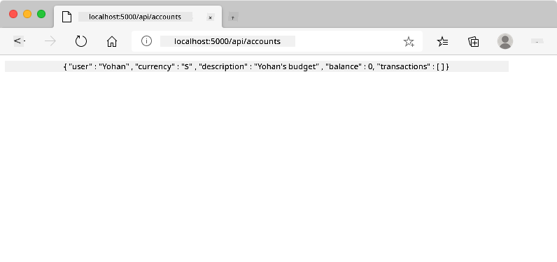
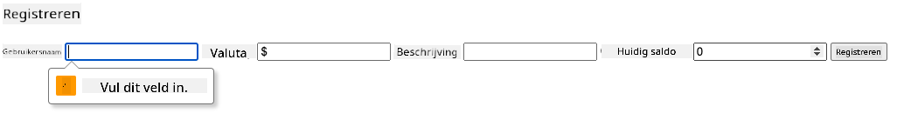
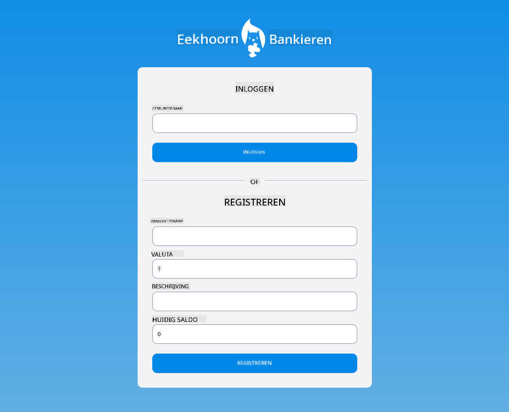

<!--
CO_OP_TRANSLATOR_METADATA:
{
  "original_hash": "b667b7d601e2ee19acb5aa9d102dc9f3",
  "translation_date": "2025-08-27T20:56:29+00:00",
  "source_file": "7-bank-project/2-forms/README.md",
  "language_code": "nl"
}
-->
# Bouw een Bankapp Deel 2: Maak een Login- en Registratieformulier

## Quiz voorafgaand aan de les

[Quiz voorafgaand aan de les](https://ashy-river-0debb7803.1.azurestaticapps.net/quiz/43)

### Introductie

In bijna alle moderne webapps kun je een account aanmaken om je eigen privéruimte te hebben. Omdat meerdere gebruikers tegelijkertijd toegang kunnen hebben tot een webapp, heb je een mechanisme nodig om de persoonlijke gegevens van elke gebruiker afzonderlijk op te slaan en te bepalen welke informatie wordt weergegeven. We zullen niet behandelen hoe je [gebruikersidentiteit veilig beheert](https://en.wikipedia.org/wiki/Authentication), omdat dit een uitgebreid onderwerp op zich is, maar we zorgen ervoor dat elke gebruiker één (of meer) bankrekeningen kan aanmaken in onze app.

In dit deel gebruiken we HTML-formulieren om login en registratie toe te voegen aan onze webapp. We zullen zien hoe we gegevens programmatisch naar een server-API kunnen sturen en uiteindelijk hoe we basisvalidatieregels voor gebruikersinvoer kunnen definiëren.

### Vereisten

Je moet het onderdeel [HTML-sjablonen en routing](../1-template-route/README.md) van de webapp hebben voltooid voor deze les. Je moet ook [Node.js](https://nodejs.org) installeren en de [server-API](../api/README.md) lokaal uitvoeren, zodat je gegevens kunt verzenden om accounts aan te maken.

**Let op**
Je hebt twee terminals nodig die tegelijkertijd draaien, zoals hieronder vermeld:
1. Voor de hoofd-bankapp die we hebben gebouwd in de les [HTML-sjablonen en routing](../1-template-route/README.md)
2. Voor de [Bankapp-server-API](../api/README.md) die we zojuist hebben opgezet.

Je moet beide servers draaiende hebben om de rest van de les te kunnen volgen. Ze luisteren op verschillende poorten (poort `3000` en poort `5000`), dus alles zou goed moeten werken.

Je kunt testen of de server correct draait door dit commando in een terminal uit te voeren:

```sh
curl http://localhost:5000/api
# -> should return "Bank API v1.0.0" as a result
```

---

## Formulier en besturingselementen

Het `<form>`-element omvat een sectie van een HTML-document waarin de gebruiker gegevens kan invoeren en indienen met interactieve besturingselementen. Er zijn allerlei soorten gebruikersinterface (UI)-besturingselementen die binnen een formulier kunnen worden gebruikt, waarvan de meest voorkomende de `<input>`- en `<button>`-elementen zijn.

Er zijn veel verschillende [typen](https://developer.mozilla.org/docs/Web/HTML/Element/input) `<input>`. Om bijvoorbeeld een veld te maken waarin de gebruiker zijn gebruikersnaam kan invoeren, kun je dit gebruiken:

```html
<input id="username" name="username" type="text">
```

Het `name`-attribuut wordt gebruikt als de eigenschapsnaam wanneer de formuliergegevens worden verzonden. Het `id`-attribuut wordt gebruikt om een `<label>` te koppelen aan het formulierbesturingselement.

> Bekijk de volledige lijst van [`<input>`-typen](https://developer.mozilla.org/docs/Web/HTML/Element/input) en [andere formulierbesturingselementen](https://developer.mozilla.org/docs/Learn/Forms/Other_form_controls) om een idee te krijgen van alle native UI-elementen die je kunt gebruiken bij het bouwen van je UI.

✅ Merk op dat `<input>` een [leeg element](https://developer.mozilla.org/docs/Glossary/Empty_element) is waarop je *geen* bijbehorend sluitend tag moet toevoegen. Je kunt echter de zelfsluitende `<input/>`-notatie gebruiken, maar dit is niet verplicht.

Het `<button>`-element binnen een formulier is een beetje speciaal. Als je het `type`-attribuut niet specificeert, zal het automatisch de formuliergegevens naar de server verzenden wanneer erop wordt gedrukt. Hier zijn de mogelijke `type`-waarden:

- `submit`: De standaardwaarde binnen een `<form>`, de knop activeert de formulierverzendactie.
- `reset`: De knop reset alle formulierbesturingselementen naar hun oorspronkelijke waarden.
- `button`: Wijs geen standaardgedrag toe wanneer op de knop wordt gedrukt. Je kunt er vervolgens aangepaste acties aan toewijzen met JavaScript.

### Taak

Laten we beginnen met het toevoegen van een formulier aan de `login`-sjabloon. We hebben een veld voor *gebruikersnaam* en een *Login*-knop nodig.

```html
<template id="login">
  <h1>Bank App</h1>
  <section>
    <h2>Login</h2>
    <form id="loginForm">
      <label for="username">Username</label>
      <input id="username" name="user" type="text">
      <button>Login</button>
    </form>
  </section>
</template>
```

Als je goed kijkt, zie je dat we hier ook een `<label>`-element hebben toegevoegd. `<label>`-elementen worden gebruikt om een naam toe te voegen aan UI-besturingselementen, zoals ons gebruikersnaamveld. Labels zijn belangrijk voor de leesbaarheid van je formulieren, maar bieden ook extra voordelen:

- Door een label te koppelen aan een formulierbesturingselement, helpt het gebruikers die gebruik maken van hulpmiddelen (zoals een schermlezer) te begrijpen welke gegevens ze moeten invoeren.
- Je kunt op het label klikken om direct de focus op het gekoppelde invoerveld te plaatsen, wat het gemakkelijker maakt om te gebruiken op apparaten met een touchscreen.

> [Toegankelijkheid](https://developer.mozilla.org/docs/Learn/Accessibility/What_is_accessibility) op het web is een zeer belangrijk onderwerp dat vaak over het hoofd wordt gezien. Dankzij [semantische HTML-elementen](https://developer.mozilla.org/docs/Learn/Accessibility/HTML) is het niet moeilijk om toegankelijke inhoud te maken als je ze correct gebruikt. Je kunt [meer lezen over toegankelijkheid](https://developer.mozilla.org/docs/Web/Accessibility) om veelgemaakte fouten te vermijden en een verantwoordelijke ontwikkelaar te worden.

Nu voegen we een tweede formulier toe voor de registratie, direct onder het vorige:

```html
<hr/>
<h2>Register</h2>
<form id="registerForm">
  <label for="user">Username</label>
  <input id="user" name="user" type="text">
  <label for="currency">Currency</label>
  <input id="currency" name="currency" type="text" value="$">
  <label for="description">Description</label>
  <input id="description" name="description" type="text">
  <label for="balance">Current balance</label>
  <input id="balance" name="balance" type="number" value="0">
  <button>Register</button>
</form>
```

Met het `value`-attribuut kunnen we een standaardwaarde definiëren voor een bepaald invoerveld. Merk ook op dat het invoerveld voor `balance` het type `number` heeft. Ziet het er anders uit dan de andere invoervelden? Probeer ermee te werken.

✅ Kun je navigeren en werken met de formulieren met alleen een toetsenbord? Hoe zou je dat doen?

## Gegevens naar de server verzenden

Nu we een functionele UI hebben, is de volgende stap om de gegevens naar onze server te sturen. Laten we een snelle test doen met onze huidige code: wat gebeurt er als je op de *Login*- of *Register*-knop klikt?

Merkte je de verandering in de URL-sectie van je browser op?


De standaardactie voor een `<form>` is om het formulier naar de huidige server-URL te verzenden met behulp van de [GET-methode](https://www.w3.org/Protocols/rfc2616/rfc2616-sec9.html#sec9.3), waarbij de formuliergegevens direct aan de URL worden toegevoegd. Deze methode heeft echter enkele nadelen:

- De verzonden gegevens zijn zeer beperkt in grootte (ongeveer 2000 tekens).
- De gegevens zijn direct zichtbaar in de URL (niet ideaal voor wachtwoorden).
- Het werkt niet met het uploaden van bestanden.

Daarom kun je het wijzigen om de [POST-methode](https://www.w3.org/Protocols/rfc2616/rfc2616-sec9.html#sec9.5) te gebruiken, die de formuliergegevens naar de server verzendt in de body van het HTTP-verzoek, zonder de eerder genoemde beperkingen.

> Hoewel POST de meest gebruikte methode is om gegevens te verzenden, is het [in sommige specifieke scenario's](https://www.w3.org/2001/tag/doc/whenToUseGet.html) beter om de GET-methode te gebruiken, bijvoorbeeld bij het implementeren van een zoekveld.

### Taak

Voeg `action`- en `method`-eigenschappen toe aan het registratieformulier:

```html
<form id="registerForm" action="//localhost:5000/api/accounts" method="POST">
```

Probeer nu een nieuw account te registreren met je naam. Na het klikken op de *Register*-knop zou je iets als dit moeten zien:



Als alles goed gaat, zou de server je verzoek moeten beantwoorden met een [JSON](https://www.json.org/json-en.html)-antwoord dat de aangemaakte accountgegevens bevat.

✅ Probeer opnieuw te registreren met dezelfde naam. Wat gebeurt er?

## Gegevens verzenden zonder de pagina te herladen

Zoals je waarschijnlijk hebt gemerkt, is er een klein probleem met de aanpak die we zojuist hebben gebruikt: bij het indienen van het formulier verlaten we onze app en wordt de browser doorgestuurd naar de server-URL. We proberen alle paginareloads te vermijden met onze webapp, omdat we een [Single-page application (SPA)](https://en.wikipedia.org/wiki/Single-page_application) maken.

Om de formuliergegevens naar de server te sturen zonder een paginareload af te dwingen, moeten we JavaScript gebruiken. In plaats van een URL in de `action`-eigenschap van een `<form>`-element te plaatsen, kun je elke JavaScript-code gebruiken voorafgegaan door de string `javascript:` om een aangepaste actie uit te voeren. Dit betekent ook dat je enkele taken moet implementeren die eerder automatisch door de browser werden uitgevoerd:

- De formuliergegevens ophalen.
- De formuliergegevens converteren en coderen naar een geschikt formaat.
- Het HTTP-verzoek maken en naar de server sturen.

### Taak

Vervang de `action` van het registratieformulier door:

```html
<form id="registerForm" action="javascript:register()">
```

Open `app.js` en voeg een nieuwe functie toe genaamd `register`:

```js
function register() {
  const registerForm = document.getElementById('registerForm');
  const formData = new FormData(registerForm);
  const data = Object.fromEntries(formData);
  const jsonData = JSON.stringify(data);
}
```

Hier halen we het formulier-element op met behulp van `getElementById()` en gebruiken we de [`FormData`](https://developer.mozilla.org/docs/Web/API/FormData)-helper om de waarden uit formulierbesturingselementen te halen als een set sleutel/waarde-paren. Vervolgens converteren we de gegevens naar een regulier object met [`Object.fromEntries()`](https://developer.mozilla.org/docs/Web/JavaScript/Reference/Global_Objects/Object/fromEntries) en serialiseren we de gegevens uiteindelijk naar [JSON](https://www.json.org/json-en.html), een formaat dat vaak wordt gebruikt voor gegevensuitwisseling op het web.

De gegevens zijn nu klaar om naar de server te worden verzonden. Maak een nieuwe functie genaamd `createAccount`:

```js
async function createAccount(account) {
  try {
    const response = await fetch('//localhost:5000/api/accounts', {
      method: 'POST',
      headers: { 'Content-Type': 'application/json' },
      body: account
    });
    return await response.json();
  } catch (error) {
    return { error: error.message || 'Unknown error' };
  }
}
```

Wat doet deze functie? Merk eerst het `async`-trefwoord op. Dit betekent dat de functie code bevat die [**asynchroon**](https://developer.mozilla.org/docs/Web/JavaScript/Reference/Statements/async_function) wordt uitgevoerd. Wanneer het samen met het `await`-trefwoord wordt gebruikt, kun je wachten tot asynchrone code wordt uitgevoerd - zoals wachten op de serverreactie hier - voordat je verdergaat.

Hier is een korte video over het gebruik van `async/await`:

[](https://youtube.com/watch?v=YwmlRkrxvkk "Async en Await voor het beheren van promises")

> 🎥 Klik op de afbeelding hierboven voor een video over async/await.

We gebruiken de `fetch()`-API om JSON-gegevens naar de server te sturen. Deze methode neemt 2 parameters:

- De URL van de server, dus we plaatsen hier `//localhost:5000/api/accounts`.
- De instellingen van het verzoek. Hier stellen we de methode in op `POST` en geven we de `body` van het verzoek op. Omdat we JSON-gegevens naar de server sturen, moeten we ook de `Content-Type`-header instellen op `application/json`, zodat de server weet hoe de inhoud moet worden geïnterpreteerd.

Omdat de server zal reageren op het verzoek met JSON, kunnen we `await response.json()` gebruiken om de JSON-inhoud te parseren en het resulterende object terug te geven. Merk op dat deze methode asynchroon is, dus we gebruiken hier het `await`-trefwoord voordat we verdergaan om ervoor te zorgen dat eventuele fouten tijdens het parseren ook worden opgevangen.

Voeg nu wat code toe aan de `register`-functie om `createAccount()` aan te roepen:

```js
const result = await createAccount(jsonData);
```

Omdat we hier het `await`-trefwoord gebruiken, moeten we het `async`-trefwoord toevoegen vóór de registerfunctie:

```js
async function register() {
```

Tot slot voegen we wat logs toe om het resultaat te controleren. De uiteindelijke functie zou er zo uit moeten zien:

```js
async function register() {
  const registerForm = document.getElementById('registerForm');
  const formData = new FormData(registerForm);
  const jsonData = JSON.stringify(Object.fromEntries(formData));
  const result = await createAccount(jsonData);

  if (result.error) {
    return console.log('An error occurred:', result.error);
  }

  console.log('Account created!', result);
}
```

Dat was een beetje lang, maar we zijn er! Als je de [ontwikkelaarstools van je browser](https://developer.mozilla.org/docs/Learn/Common_questions/What_are_browser_developer_tools) opent en probeert een nieuw account te registreren, zou je geen verandering op de webpagina moeten zien, maar er verschijnt een bericht in de console dat bevestigt dat alles werkt.


✅ Denk je dat de gegevens veilig naar de server worden verzonden? Wat als iemand het verzoek zou kunnen onderscheppen? Je kunt meer lezen over [HTTPS](https://en.wikipedia.org/wiki/HTTPS) om meer te weten te komen over veilige gegevenscommunicatie.

## Gegevensvalidatie

Als je probeert een nieuw account te registreren zonder eerst een gebruikersnaam in te stellen, zie je dat de server een fout retourneert met statuscode [400 (Bad Request)](https://developer.mozilla.org/docs/Web/HTTP/Status/400#:~:text=The%20HyperText%20Transfer%20Protocol%20(HTTP,%2C%20or%20deceptive%20request%20routing).).

Voordat je gegevens naar een server stuurt, is het een goede gewoonte om [de formuliergegevens te valideren](https://developer.mozilla.org/docs/Learn/Forms/Form_validation) wanneer mogelijk, om ervoor te zorgen dat je een geldig verzoek verzendt. HTML5-formulierbesturingselementen bieden ingebouwde validatie met behulp van verschillende attributen:

- `required`: het veld moet worden ingevuld, anders kan het formulier niet worden verzonden.
- `minlength` en `maxlength`: definieert het minimum- en maximumaantal tekens in tekstvelden.
- `min` en `max`: definieert de minimum- en maximumwaarde van een numeriek veld.
- `type`: definieert het soort gegevens dat wordt verwacht, zoals `number`, `email`, `file` of [andere ingebouwde typen](https://developer.mozilla.org/docs/Web/HTML/Element/input). Dit attribuut kan ook de visuele weergave van het formulierbesturingselement veranderen.
- `pattern`: stelt je in staat om een [regular expression](https://developer.mozilla.org/docs/Web/JavaScript/Guide/Regular_Expressions)-patroon te definiëren om te testen of de ingevoerde gegevens geldig zijn of niet.
> Tip: je kunt de uitstraling van je formulierbesturingselementen aanpassen afhankelijk van of ze geldig of ongeldig zijn door gebruik te maken van de CSS-pseudoklassen `:valid` en `:invalid`.
### Taak

Er zijn 2 verplichte velden nodig om een geldig nieuw account aan te maken: de gebruikersnaam en valuta. De andere velden zijn optioneel. Werk de HTML van het formulier bij door zowel het `required` attribuut als tekst in het label van het veld toe te voegen zodat:

```html
<label for="user">Username (required)</label>
<input id="user" name="user" type="text" required>
...
<label for="currency">Currency (required)</label>
<input id="currency" name="currency" type="text" value="$" required>
```

Hoewel deze specifieke serverimplementatie geen specifieke limieten afdwingt op de maximale lengte van de velden, is het altijd een goede gewoonte om redelijke limieten te definiëren voor tekstinvoer door gebruikers.

Voeg een `maxlength` attribuut toe aan de tekstvelden:

```html
<input id="user" name="user" type="text" maxlength="20" required>
...
<input id="currency" name="currency" type="text" value="$" maxlength="5" required>
...
<input id="description" name="description" type="text" maxlength="100">
```

Als je nu op de knop *Registreren* drukt en een veld voldoet niet aan een validatieregel die we hebben gedefinieerd, zou je iets zoals dit moeten zien:



Validatie zoals deze, die wordt uitgevoerd *voordat* gegevens naar de server worden verzonden, wordt **client-side** validatie genoemd. Maar let op dat het niet altijd mogelijk is om alle controles uit te voeren zonder de gegevens te verzenden. Bijvoorbeeld, we kunnen hier niet controleren of er al een account bestaat met dezelfde gebruikersnaam zonder een verzoek naar de server te sturen. Extra validatie die op de server wordt uitgevoerd, wordt **server-side** validatie genoemd.

Meestal moeten beide worden geïmplementeerd, en hoewel het gebruik van client-side validatie de gebruikerservaring verbetert door directe feedback te geven, is server-side validatie cruciaal om ervoor te zorgen dat de gebruikersgegevens die je verwerkt betrouwbaar en veilig zijn.

---

## 🚀 Uitdaging

Toon een foutmelding in de HTML als de gebruiker al bestaat.

Hier is een voorbeeld van hoe de uiteindelijke inlogpagina eruit kan zien na wat styling:



## Quiz na de les

[Quiz na de les](https://ashy-river-0debb7803.1.azurestaticapps.net/quiz/44)

## Review & Zelfstudie

Ontwikkelaars zijn erg creatief geworden in hun inspanningen om formulieren te bouwen, vooral wat betreft validatiestrategieën. Leer meer over verschillende formulierstromen door te kijken op [CodePen](https://codepen.com); kun je interessante en inspirerende formulieren vinden?

## Opdracht

[Style je bankapp](assignment.md)

---

**Disclaimer**:  
Dit document is vertaald met behulp van de AI-vertalingsservice [Co-op Translator](https://github.com/Azure/co-op-translator). Hoewel we ons best doen voor nauwkeurigheid, dient u zich ervan bewust te zijn dat geautomatiseerde vertalingen fouten of onnauwkeurigheden kunnen bevatten. Het originele document in zijn oorspronkelijke taal moet worden beschouwd als de gezaghebbende bron. Voor cruciale informatie wordt professionele menselijke vertaling aanbevolen. Wij zijn niet aansprakelijk voor misverstanden of verkeerde interpretaties die voortvloeien uit het gebruik van deze vertaling.