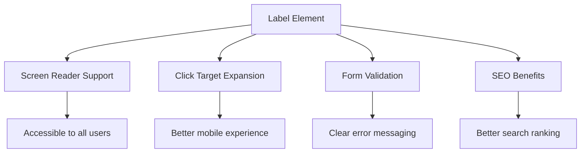
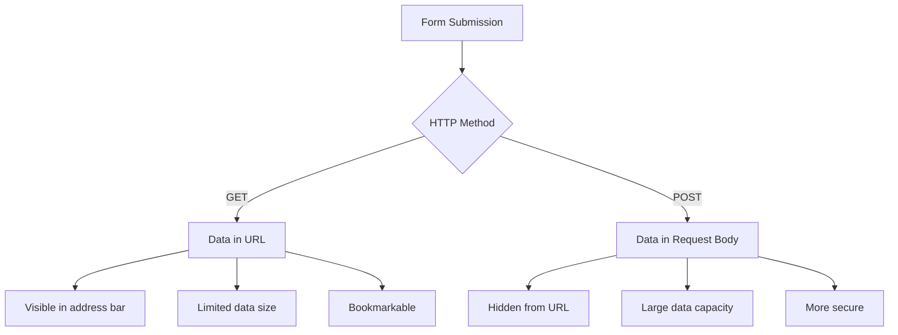
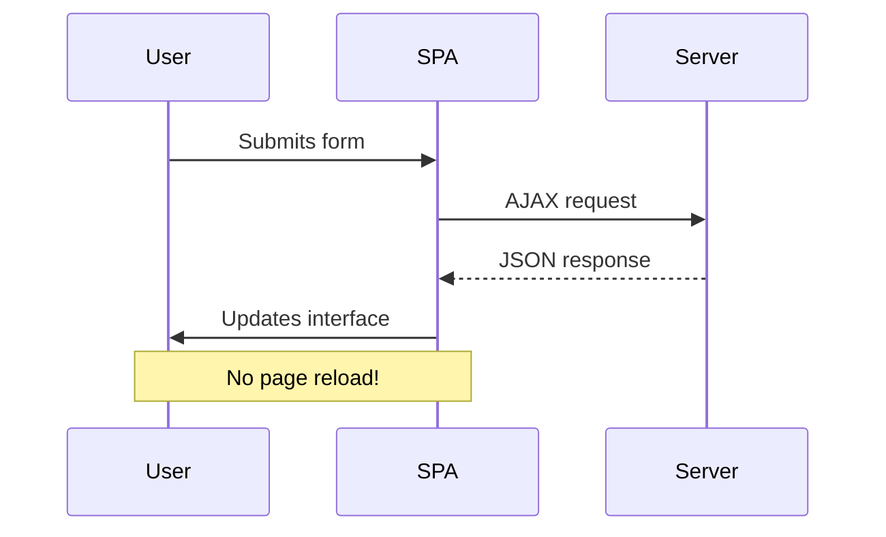
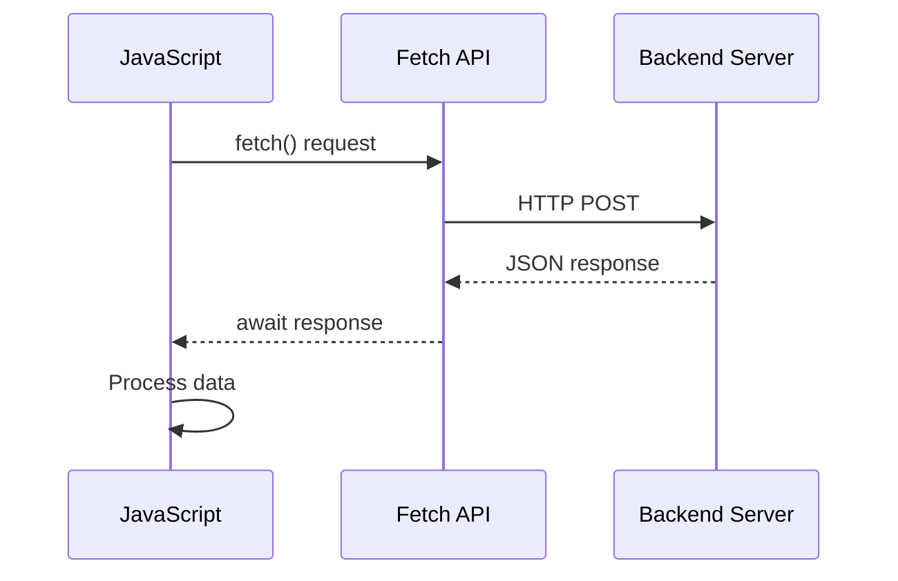
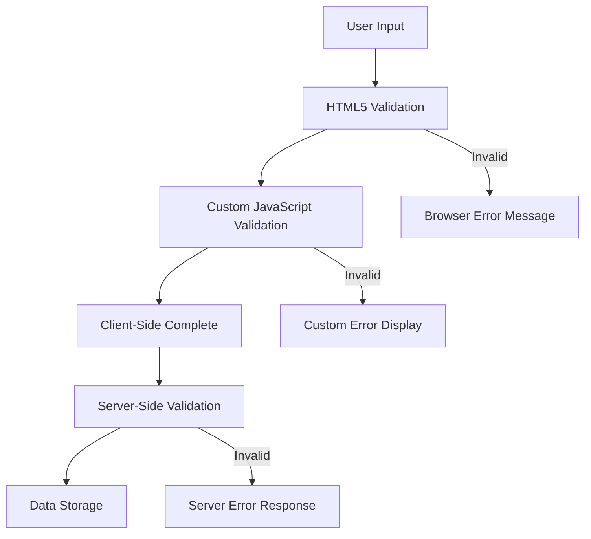
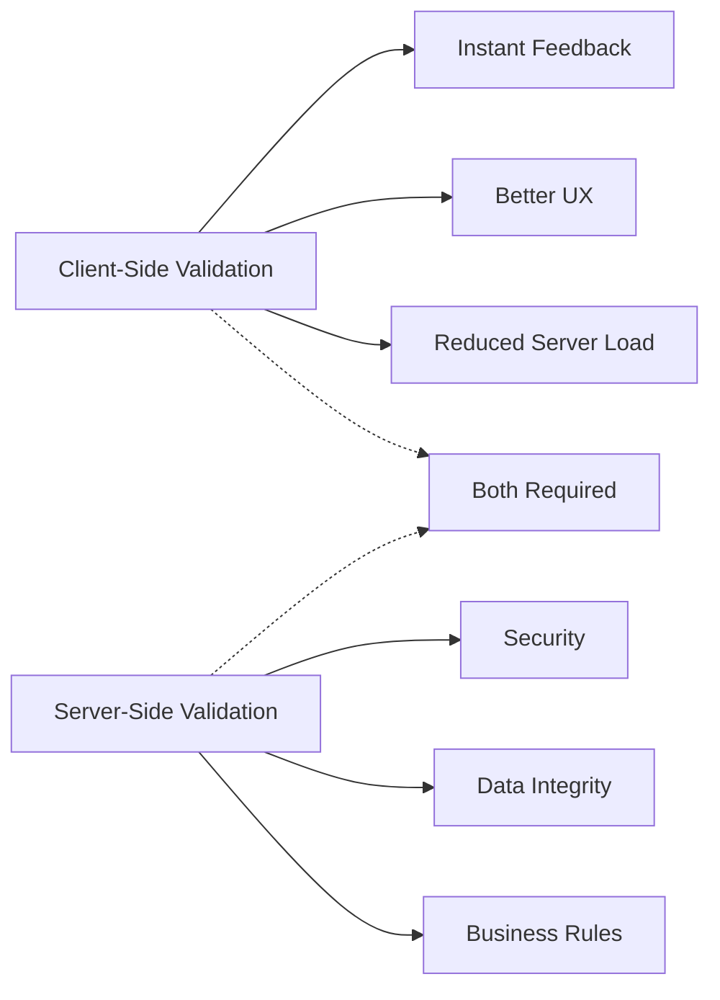

<!--
CO_OP_TRANSLATOR_METADATA:
{
  "original_hash": "b24f28fc46dd473aa9080f174182adde",
  "translation_date": "2025-10-23T01:01:47+00:00",
  "source_file": "7-bank-project/2-forms/README.md",
  "language_code": "nl"
}
-->
# Bouw een Bankapp Deel 2: Maak een Login- en Registratieformulier

## Pre-Lecture Quiz

[Pre-lecture quiz](https://ff-quizzes.netlify.app/web/quiz/43)

Heb je ooit een online formulier ingevuld dat je e-mailformaat afwees? Of al je informatie verloren toen je op verzenden klikte? We hebben allemaal wel eens zulke frustrerende ervaringen gehad.

Formulieren vormen de brug tussen je gebruikers en de functionaliteit van je applicatie. Net zoals luchtverkeersleiders zorgvuldig protocollen gebruiken om vliegtuigen veilig naar hun bestemming te begeleiden, bieden goed ontworpen formulieren duidelijke feedback en voorkomen ze kostbare fouten. Slechte formulieren daarentegen kunnen gebruikers sneller wegjagen dan een miscommunicatie op een druk vliegveld.

In deze les transformeren we je statische bankapp naar een interactieve applicatie. Je leert formulieren bouwen die gebruikersinvoer valideren, communiceren met servers en nuttige feedback geven. Zie het als het bouwen van een bedieningsinterface waarmee gebruikers door de functies van je applicatie kunnen navigeren.

Aan het einde heb je een compleet login- en registratiesysteem met validatie dat gebruikers begeleidt naar succes in plaats van frustratie.

## Vereisten

Voordat we beginnen met het bouwen van formulieren, zorgen we ervoor dat alles correct is ingesteld. Deze les gaat verder waar we de vorige hebben achtergelaten, dus als je vooruit hebt gespoeld, wil je misschien teruggaan en eerst de basis in orde maken.

### Vereiste Setup

| Component | Status | Beschrijving |
|-----------|--------|-------------|
| [HTML Templates](../1-template-route/README.md) | ✅ Vereist | De basisstructuur van je bankapp |
| [Node.js](https://nodejs.org) | ✅ Vereist | JavaScript runtime voor de server |
| [Bank API Server](../api/README.md) | ✅ Vereist | Backend service voor gegevensopslag |

> 💡 **Ontwikkeltip**: Je zult twee aparte servers tegelijkertijd draaien – één voor je frontend bankapp en een andere voor de backend API. Deze setup weerspiegelt de echte wereld waarin frontend- en backendservices onafhankelijk van elkaar werken.

### Serverconfiguratie

**Je ontwikkelomgeving zal bestaan uit:**
- **Frontend server**: Bedient je bankapp (meestal poort `3000`)
- **Backend API server**: Behandelt gegevensopslag en -opvraging (poort `5000`)
- **Beide servers** kunnen tegelijkertijd draaien zonder conflicten

**Test je API-verbinding:**
```bash
curl http://localhost:5000/api
# Expected response: "Bank API v1.0.0"
```

**Als je de API-versie ziet, kun je verder gaan!**

---

## Begrip van HTML-formulieren en -besturingselementen

HTML-formulieren zijn hoe gebruikers communiceren met je webapplicatie. Zie ze als het telegraafsysteem dat in de 19e eeuw verre plaatsen met elkaar verbond – ze vormen het communicatieprotocol tussen gebruikersintentie en applicatierespons. Wanneer ze zorgvuldig zijn ontworpen, vangen ze fouten op, begeleiden ze invoerformaten en bieden ze nuttige suggesties.

Moderne formulieren zijn aanzienlijk geavanceerder dan eenvoudige tekstinvoervelden. HTML5 introduceerde gespecialiseerde invoertypes die automatisch e-mailvalidatie, nummerformattering en datumselectie afhandelen. Deze verbeteringen komen zowel de toegankelijkheid als de mobiele gebruikerservaring ten goede.

### Essentiële Formulierelementen

**Bouwstenen die elk formulier nodig heeft:**

```html
<!-- Basic form structure -->
<form id="userForm" method="POST">
  <label for="username">Username</label>
  <input id="username" name="username" type="text" required>
  
  <button type="submit">Submit</button>
</form>
```

**Wat deze code doet:**
- **Creëert** een formuliercontainer met een unieke identificatie
- **Specificeert** de HTTP-methode voor gegevensverzending
- **Associeert** labels met invoervelden voor toegankelijkheid
- **Definieert** een verzendknop om het formulier te verwerken

### Moderne Invoertypes en Attributen

| Invoertype | Doel | Voorbeeldgebruik |
|------------|------|------------------|
| `text` | Algemene tekstinvoer | `<input type="text" name="username">` |
| `email` | E-mailvalidatie | `<input type="email" name="email">` |
| `password` | Verborgen tekstinvoer | `<input type="password" name="password">` |
| `number` | Numerieke invoer | `<input type="number" name="balance" min="0">` |
| `tel` | Telefoonnummers | `<input type="tel" name="phone">` |

> 💡 **Voordeel van moderne HTML5**: Het gebruik van specifieke invoertypes biedt automatische validatie, geschikte mobiele toetsenborden en betere ondersteuning voor toegankelijkheid zonder extra JavaScript!

### Knoptypes en Gedrag

```html
<!-- Different button behaviors -->
<button type="submit">Save Data</button>     <!-- Submits the form -->
<button type="reset">Clear Form</button>    <!-- Resets all fields -->
<button type="button">Custom Action</button> <!-- No default behavior -->
```

**Wat elk knoptype doet:**
- **Verzendknoppen**: Activeren formulierverzending en sturen gegevens naar het opgegeven eindpunt
- **Resetknoppen**: Herstellen alle formuliervelden naar hun oorspronkelijke staat
- **Normale knoppen**: Hebben geen standaardgedrag en vereisen aangepaste JavaScript voor functionaliteit

> ⚠️ **Belangrijke Opmerking**: Het `<input>`-element is zelfsluitend en heeft geen sluitingstag nodig. Moderne best practice is om `<input>` zonder schuine streep te schrijven.

### Je Loginformulier Bouwen

Laten we nu een praktisch loginformulier maken dat moderne HTML-formulierpraktijken demonstreert. We beginnen met een basisstructuur en verbeteren deze geleidelijk met toegankelijkheidsfuncties en validatie.

```html
<template id="login">
  <h1>Bank App</h1>
  <section>
    <h2>Login</h2>
    <form id="loginForm" novalidate>
      <div class="form-group">
        <label for="username">Username</label>
        <input id="username" name="user" type="text" required 
               autocomplete="username" placeholder="Enter your username">
      </div>
      <button type="submit">Login</button>
    </form>
  </section>
</template>
```

**Wat hier gebeurt:**
- **Structureert** het formulier met semantische HTML5-elementen
- **Groepeert** gerelateerde elementen met `div`-containers en betekenisvolle klassen
- **Associeert** labels met invoervelden via de attributen `for` en `id`
- **Voegt** moderne attributen toe zoals `autocomplete` en `placeholder` voor betere gebruikerservaring
- **Voegt** `novalidate` toe om validatie met JavaScript te verwerken in plaats van standaard browserinstellingen

### Het Belang van Goede Labels

**Waarom labels belangrijk zijn voor moderne webontwikkeling:**



**Wat goede labels bereiken:**
- **Maakt** het mogelijk voor schermlezers om formuliervelden duidelijk aan te kondigen
- **Vergroot** het klikbare gebied (door op het label te klikken wordt het invoerveld gefocust)
- **Verbetert** de mobiele bruikbaarheid met grotere aanraakdoelen
- **Ondersteunt** formuliervalidatie met betekenisvolle foutmeldingen
- **Verbetert** SEO door semantische betekenis aan formulierelementen te geven

> 🎯 **Toegankelijkheidsdoel**: Elk formulierinvoerveld moet een bijbehorend label hebben. Deze eenvoudige praktijk maakt je formulieren bruikbaar voor iedereen, inclusief gebruikers met een beperking, en verbetert de ervaring voor alle gebruikers.

### Het Registratieformulier Maken

Het registratieformulier vereist meer gedetailleerde informatie om een volledig gebruikersaccount te maken. Laten we het bouwen met moderne HTML5-functies en verbeterde toegankelijkheid.

```html
<hr/>
<h2>Register</h2>
<form id="registerForm" novalidate>
  <div class="form-group">
    <label for="user">Username</label>
    <input id="user" name="user" type="text" required 
           autocomplete="username" placeholder="Choose a username">
  </div>
  
  <div class="form-group">
    <label for="currency">Currency</label>
    <input id="currency" name="currency" type="text" value="$" 
           required maxlength="3" placeholder="USD, EUR, etc.">
  </div>
  
  <div class="form-group">
    <label for="description">Account Description</label>
    <input id="description" name="description" type="text" 
           maxlength="100" placeholder="Personal savings, checking, etc.">
  </div>
  
  <div class="form-group">
    <label for="balance">Starting Balance</label>
    <input id="balance" name="balance" type="number" value="0" 
           min="0" step="0.01" placeholder="0.00">
  </div>
  
  <button type="submit">Create Account</button>
</form>
```

**In het bovenstaande hebben we:**
- **Georganiseerd** elk veld in container-divs voor betere styling en lay-out
- **Toegevoegd** geschikte `autocomplete`-attributen voor browser-autovulondersteuning
- **Inbegrepen** nuttige placeholder-tekst om gebruikersinvoer te begeleiden
- **Ingesteld** verstandige standaardwaarden met het `value`-attribuut
- **Toegepast** validatieattributen zoals `required`, `maxlength` en `min`
- **Gebruikt** `type="number"` voor het veld saldo met ondersteuning voor decimalen

### Verkenning van Invoertypes en Gedrag

**Moderne invoertypes bieden verbeterde functionaliteit:**

| Functie | Voordeel | Voorbeeld |
|---------|----------|-----------|
| `type="number"` | Numeriek toetsenbord op mobiel | Makkelijker saldo invoeren |
| `step="0.01"` | Controle over decimale precisie | Staat centen toe in valuta |
| `autocomplete` | Browser-autovul | Snellere formulierinvulling |
| `placeholder` | Contextuele hints | Begeleidt gebruikersverwachtingen |

> 🎯 **Toegankelijkheidsuitdaging**: Probeer de formulieren alleen met je toetsenbord te navigeren! Gebruik `Tab` om tussen velden te bewegen, `Spatie` om vakjes aan te vinken en `Enter` om te verzenden. Deze ervaring helpt je begrijpen hoe gebruikers van schermlezers met je formulieren omgaan.

## Begrip van Formulierverzendmethoden

Wanneer iemand je formulier invult en op verzenden klikt, moet die gegevens ergens naartoe – meestal naar een server die ze kan opslaan. Er zijn een paar verschillende manieren waarop dit kan gebeuren, en weten welke je moet gebruiken kan je later veel hoofdpijn besparen.

Laten we eens kijken wat er precies gebeurt wanneer iemand op die verzendknop klikt.

### Standaard Formuliergedrag

Laten we eerst observeren wat er gebeurt bij een basisformulierverzending:

**Test je huidige formulieren:**
1. Klik op de *Registreren*-knop in je formulier
2. Observeer de veranderingen in de adresbalk van je browser
3. Merk op hoe de pagina opnieuw laadt en gegevens in de URL verschijnen


### Vergelijking van HTTP-methoden



**Begrip van de verschillen:**

| Methode | Gebruikssituatie | Locatie gegevens | Beveiligingsniveau | Groottebeperking |
|---------|------------------|------------------|--------------------|------------------|
| `GET` | Zoekopdrachten, filters | URL-parameters | Laag (zichtbaar) | ~2000 tekens |
| `POST` | Gebruikersaccounts, gevoelige gegevens | Verzoekbody | Hoger (verborgen) | Geen praktische limiet |

**Begrip van de fundamentele verschillen:**
- **GET**: Voegt formuliergegevens toe aan de URL als queryparameters (geschikt voor zoekopdrachten)
- **POST**: Bevat gegevens in de verzoekbody (essentieel voor gevoelige informatie)
- **GET-beperkingen**: Groottebeperkingen, zichtbare gegevens, blijvende browsergeschiedenis
- **POST-voordelen**: Grote gegevenscapaciteit, privacybescherming, ondersteuning voor bestanduploads

> 💡 **Best Practice**: Gebruik `GET` voor zoekformulieren en filters (gegevensopvraging), gebruik `POST` voor gebruikersregistratie, login en gegevenscreatie.

### Configureren van Formulierverzending

Laten we je registratieformulier configureren om correct te communiceren met de backend API via de POST-methode:

```html
<form id="registerForm" action="//localhost:5000/api/accounts" 
      method="POST" novalidate>
```

**Wat deze configuratie doet:**
- **Stuurt** formulierverzending naar je API-eindpunt
- **Gebruikt** de POST-methode voor veilige gegevensoverdracht
- **Voegt** `novalidate` toe om validatie met JavaScript te verwerken

### Testen van Formulierverzending

**Volg deze stappen om je formulier te testen:**
1. **Vul** het registratieformulier in met je gegevens
2. **Klik** op de knop "Account aanmaken"
3. **Observeer** de serverrespons in je browser


**Wat je zou moeten zien:**
- **Browser wordt omgeleid** naar de URL van het API-eindpunt
- **JSON-respons** met je nieuw aangemaakte accountgegevens
- **Serverbevestiging** dat het account succesvol is aangemaakt

> 🧪 **Probeer het uit**: Probeer opnieuw te registreren met dezelfde gebruikersnaam. Welke respons krijg je? Dit helpt je te begrijpen hoe de server omgaat met dubbele gegevens en foutomstandigheden.

### Begrip van JSON-responsen

**Wanneer de server je formulier succesvol verwerkt:**
```json
{
  "user": "john_doe",
  "currency": "$",
  "description": "Personal savings",
  "balance": 100,
  "id": "unique_account_id"
}
```

**Deze respons bevestigt:**
- **Maakt** een nieuw account aan met je opgegeven gegevens
- **Kent** een unieke identificatie toe voor toekomstige referentie
- **Geeft** alle accountinformatie terug ter verificatie
- **Geeft aan** dat de gegevens succesvol zijn opgeslagen in de database

## Moderne Formulierverwerking met JavaScript

Traditionele formulierverzendingen veroorzaken volledige paginareloads, vergelijkbaar met hoe vroege ruimtemissies volledige systeemresets vereisten voor koerscorrecties. Deze aanpak verstoort de gebruikerservaring en verliest de applicatiestatus.

Formulierverwerking met JavaScript werkt als de continue geleidingssystemen die door moderne ruimtevaartuigen worden gebruikt – realtime aanpassingen maken zonder de navigatiecontext te verliezen. We kunnen formulierverzendingen onderscheppen, directe feedback geven, fouten soepel afhandelen en de interface bijwerken op basis van serverresponsen terwijl de gebruiker binnen de applicatie blijft.

### Waarom Paginareloads Vermijden?



**Voordelen van formulierverwerking met JavaScript:**
- **Behoudt** applicatiestatus en gebruikerscontext
- **Biedt** directe feedback en laadindicatoren
- **Maakt** dynamische foutafhandeling en validatie mogelijk
- **Creëert** vloeiende, app-achtige gebruikerservaringen
- **Maakt** voorwaardelijke logica op basis van serverresponsen mogelijk

### Overgang van Traditionele naar Moderne Formulieren

**Uitdagingen van de traditionele aanpak:**
- **Leidt** gebruikers weg van je applicatie
- **Verliest** huidige applicatiestatus en context
- **Vereist** volledige paginareloads voor eenvoudige bewerkingen
- **Biedt** beperkte controle over gebruikersfeedback

**Voordelen van de moderne JavaScript-aanpak:**
- **Houdt** gebruikers binnen je applicatie
- **Behoudt** alle applicatiestatus en gegevens
- **Maakt** realtime validatie en feedback mogelijk
- **Ondersteunt** progressieve verbetering en toegankelijkheid

### Implementeren van JavaScript Formulierverwerking

Laten we de traditionele formulierverzending vervangen door moderne JavaScript-eventverwerking:

```html
<!-- Remove the action attribute and add event handling -->
<form id="registerForm" method="POST" novalidate>
```

**Voeg de registratielogica toe aan je `app.js`-bestand:**

```javascript
// Modern event-driven form handling
function register() {
  const registerForm = document.getElementById('registerForm');
  const formData = new FormData(registerForm);
  const data = Object.fromEntries(formData);
  const jsonData = JSON.stringify(data);
  
  console.log('Form data prepared:', data);
}

// Attach event listener when the page loads
document.addEventListener('DOMContentLoaded', () => {
  const registerForm = document.getElementById('registerForm');
  registerForm.addEventListener('submit', (event) => {
    event.preventDefault(); // Prevent default form submission
    register();
  });
});
```

**Wat hier gebeurt:**
- **Voorkomt** standaard formulierverzending met `event.preventDefault()`
- **Haalt** het formulier op met moderne DOM-selectie
- **Extraheert** formuliergegevens met de krachtige `FormData` API
- **Converteert** FormData naar een eenvoudig object met `Object.fromEntries()`
- **Serialiseert** de gegevens naar JSON-formaat voor servercommunicatie
- **Logt** de verwerkte gegevens voor debugging en verificatie

### Begrip van de FormData API

**De FormData API biedt krachtige formulierverwerking:**

```javascript
// Example of what FormData captures
const formData = new FormData(registerForm);

// FormData automatically captures:
// {
//   "user": "john_doe",
//   "currency": "$", 
//   "description": "Personal account",
//   "balance": "100"
// }
```

**Voordelen van de FormData API:**
- **Uitgebreide verzameling**: Vangt alle formulierelementen, inclusief tekst, bestanden en complexe invoer
- **Typebewustzijn**: Behandelt automatisch verschillende invoertypes zonder aangepaste codering
- **Efficiëntie**: Elimineert handmatige veldverzameling met één API-aanroep
- **Aanpasbaarheid**: Behoudt functionaliteit terwijl de formulierstructuur evolueert

### De Servercommunicatiefunctie Maken

Laten we nu een robuuste functie bouwen om te communiceren met je API-server met moderne JavaScript-patronen:

```javascript
async function createAccount(account) {
  try {
    const response = await fetch('//localhost:5000/api/accounts', {
      method: 'POST',
      headers: { 
        'Content-Type': 'application/json',
        'Accept': 'application/json'
      },
      body: account
    });
    
    // Check if the response was successful
    if (!response.ok) {
      throw new Error(`HTTP error! status: ${response.status}`);
    }
    
    return await response.json();
  } catch (error) {
    console.error('Account creation failed:', error);
    return { error: error.message || 'Network error occurred' };
  }
}
```

**Begrip van asynchrone JavaScript:**



**Wat deze moderne implementatie bereikt:**
- **Gebruikt** `async/await` voor leesbare asynchrone code
- **Bevat** correcte foutafhandeling met try/catch-blokken
- **Controleert** de responsstatus voordat gegevens worden verwerkt
- **Stelt** geschikte headers in voor JSON-communicatie
- **Biedt** gedetailleerde foutmeldingen voor debugging  
- **Geeft** consistente datastructuren terug voor succes- en foutgevallen  

### De kracht van de moderne Fetch API  

**Voordelen van de Fetch API ten opzichte van oudere methoden:**  

| Functie | Voordeel | Implementatie |  
|---------|----------|---------------|  
| Promise-gebaseerd | Schone asynchrone code | `await fetch()` |  
| Aanpassing van verzoeken | Volledige HTTP-controle | Headers, methoden, body |  
| Responsverwerking | Flexibele gegevensparsing | `.json()`, `.text()`, `.blob()` |  
| Foutafhandeling | Uitgebreide foutdetectie | Try/catch-blokken |  

> 🎥 **Meer leren**: [Async/Await Tutorial](https://youtube.com/watch?v=YwmlRkrxvkk) - Begrijp asynchrone JavaScript-patronen voor moderne webontwikkeling.  

**Belangrijke concepten voor servercommunicatie:**  
- **Asynchrone functies** maken het mogelijk om de uitvoering te pauzeren en te wachten op serverreacties  
- **Await keyword** zorgt ervoor dat asynchrone code leest als synchrone code  
- **Fetch API** biedt moderne, promise-gebaseerde HTTP-verzoeken  
- **Foutafhandeling** zorgt ervoor dat je app gracieus reageert op netwerkproblemen  

### De registratiefunctie voltooien  

Laten we alles samenbrengen met een complete, productieklare registratiefunctie:  

```javascript
async function register() {
  const registerForm = document.getElementById('registerForm');
  const submitButton = registerForm.querySelector('button[type="submit"]');
  
  try {
    // Show loading state
    submitButton.disabled = true;
    submitButton.textContent = 'Creating Account...';
    
    // Process form data
    const formData = new FormData(registerForm);
    const jsonData = JSON.stringify(Object.fromEntries(formData));
    
    // Send to server
    const result = await createAccount(jsonData);
    
    if (result.error) {
      console.error('Registration failed:', result.error);
      alert(`Registration failed: ${result.error}`);
      return;
    }
    
    console.log('Account created successfully!', result);
    alert(`Welcome, ${result.user}! Your account has been created.`);
    
    // Reset form after successful registration
    registerForm.reset();
    
  } catch (error) {
    console.error('Unexpected error:', error);
    alert('An unexpected error occurred. Please try again.');
  } finally {
    // Restore button state
    submitButton.disabled = false;
    submitButton.textContent = 'Create Account';
  }
}
```
  
**Deze verbeterde implementatie bevat:**  
- **Biedt** visuele feedback tijdens het indienen van het formulier  
- **Schakelt uit** de verzendknop om dubbele inzendingen te voorkomen  
- **Behandelt** zowel verwachte als onverwachte fouten op een elegante manier  
- **Toont** gebruiksvriendelijke succes- en foutmeldingen  
- **Reset** het formulier na succesvolle registratie  
- **Herstelt** de UI-status ongeacht de uitkomst  

### Testen van je implementatie  

**Open de ontwikkelaarstools van je browser en test de registratie:**  

1. **Open** de browserconsole (F12 → tabblad Console)  
2. **Vul** het registratieformulier in  
3. **Klik** op "Account aanmaken"  
4. **Observeer** de consoleberichten en gebruikersfeedback  

  

**Wat je zou moeten zien:**  
- **Laadstatus** verschijnt op de verzendknop  
- **Console logs** tonen gedetailleerde informatie over het proces  
- **Succesbericht** verschijnt wanneer het aanmaken van een account slaagt  
- **Formulier wordt automatisch gereset** na succesvolle inzending  

> 🔒 **Beveiligingsoverweging**: Momenteel worden gegevens verzonden via HTTP, wat niet veilig is voor productie. Gebruik in echte applicaties altijd HTTPS om gegevensoverdracht te versleutelen. Lees meer over [HTTPS-beveiliging](https://en.wikipedia.org/wiki/HTTPS) en waarom het essentieel is voor het beschermen van gebruikersgegevens.  

## Uitgebreide formuliervalidatie  

Formuliervalidatie voorkomt de frustrerende ervaring van het ontdekken van fouten pas na het indienen. Net zoals de meerdere redundante systemen op het internationale ruimtestation, maakt effectieve validatie gebruik van meerdere lagen van veiligheidscontroles.  

De optimale aanpak combineert validatie op browserniveau voor directe feedback, JavaScript-validatie voor een verbeterde gebruikerservaring en server-side validatie voor beveiliging en gegevensintegriteit. Deze redundantie zorgt voor zowel gebruikerstevredenheid als systeembeveiliging.  

### Begrip van validatielagen  


  
**Strategie voor validatie met meerdere lagen:**  
- **HTML5-validatie**: Directe controles door de browser  
- **JavaScript-validatie**: Aangepaste logica en gebruikerservaring  
- **Servervalidatie**: Definitieve beveiligings- en gegevensintegriteitscontroles  
- **Progressieve verbetering**: Werkt zelfs als JavaScript is uitgeschakeld  

### HTML5-validatieattributen  

**Moderne validatietools tot je beschikking:**  

| Attribuut | Doel | Voorbeeldgebruik | Browsergedrag |  
|-----------|------|------------------|---------------|  
| `required` | Verplichte velden | `<input required>` | Voorkomt lege inzending |  
| `minlength`/`maxlength` | Tekstlengte limieten | `<input maxlength="20">` | Handhaaft tekenlimieten |  
| `min`/`max` | Numerieke bereiken | `<input min="0" max="1000">` | Valideert numerieke grenzen |  
| `pattern` | Aangepaste regex-regels | `<input pattern="[A-Za-z]+">` | Komt overeen met specifieke formaten |  
| `type` | Validatie van gegevenstype | `<input type="email">` | Validatie op basis van formaat |  

### CSS-validatiestijlen  

**Creëer visuele feedback voor validatiestatussen:**  

```css
/* Valid input styling */
input:valid {
  border-color: #28a745;
  background-color: #f8fff9;
}

/* Invalid input styling */
input:invalid {
  border-color: #dc3545;
  background-color: #fff5f5;
}

/* Focus states for better accessibility */
input:focus:valid {
  box-shadow: 0 0 0 0.2rem rgba(40, 167, 69, 0.25);
}

input:focus:invalid {
  box-shadow: 0 0 0 0.2rem rgba(220, 53, 69, 0.25);
}
```
  
**Wat deze visuele aanwijzingen bereiken:**  
- **Groene randen**: Geven succesvolle validatie aan, zoals groene lichten in de controlekamer  
- **Rode randen**: Signaleren validatiefouten die aandacht vereisen  
- **Focus highlights**: Bieden duidelijke visuele context voor de huidige invoerlocatie  
- **Consistente styling**: Creëert voorspelbare interfacepatronen die gebruikers kunnen leren  

> 💡 **Handige tip**: Gebruik de CSS-pseudoklassen `:valid` en `:invalid` om directe visuele feedback te geven terwijl gebruikers typen, en zo een responsieve en behulpzame interface te creëren.  

### Implementeren van uitgebreide validatie  

Laten we je registratieformulier verbeteren met robuuste validatie die een uitstekende gebruikerservaring en gegevenskwaliteit biedt:  

```html
<form id="registerForm" method="POST" novalidate>
  <div class="form-group">
    <label for="user">Username <span class="required">*</span></label>
    <input id="user" name="user" type="text" required 
           minlength="3" maxlength="20" 
           pattern="[a-zA-Z0-9_]+" 
           autocomplete="username"
           title="Username must be 3-20 characters, letters, numbers, and underscores only">
    <small class="form-text">Choose a unique username (3-20 characters)</small>
  </div>
  
  <div class="form-group">
    <label for="currency">Currency <span class="required">*</span></label>
    <input id="currency" name="currency" type="text" required 
           value="$" maxlength="3" 
           pattern="[A-Z$€£¥₹]+" 
           title="Enter a valid currency symbol or code">
    <small class="form-text">Currency symbol (e.g., $, €, £)</small>
  </div>
  
  <div class="form-group">
    <label for="description">Account Description</label>
    <input id="description" name="description" type="text" 
           maxlength="100" 
           placeholder="Personal savings, checking, etc.">
    <small class="form-text">Optional description (up to 100 characters)</small>
  </div>
  
  <div class="form-group">
    <label for="balance">Starting Balance</label>
    <input id="balance" name="balance" type="number" 
           value="0" min="0" step="0.01" 
           title="Enter a positive number for your starting balance">
    <small class="form-text">Initial account balance (minimum $0.00)</small>
  </div>
  
  <button type="submit">Create Account</button>
</form>
```
  
**Begrip van de verbeterde validatie:**  
- **Combineert** verplichte veldindicatoren met behulpzame beschrijvingen  
- **Bevat** `pattern`-attributen voor formaatvalidatie  
- **Biedt** `title`-attributen voor toegankelijkheid en tooltips  
- **Voegt** hulptekst toe om gebruikersinvoer te begeleiden  
- **Gebruikt** semantische HTML-structuur voor betere toegankelijkheid  

### Geavanceerde validatieregels  

**Wat elke validatieregel bereikt:**  

| Veld | Validatieregels | Voordeel voor gebruiker |  
|------|-----------------|-------------------------|  
| Gebruikersnaam | `required`, `minlength="3"`, `maxlength="20"`, `pattern="[a-zA-Z0-9_]+"` | Zorgt voor geldige, unieke identificatoren |  
| Valuta | `required`, `maxlength="3"`, `pattern="[A-Z$€£¥₹]+"` | Accepteert gangbare valutatekens |  
| Saldo | `min="0"`, `step="0.01"`, `type="number"` | Voorkomt negatieve saldi |  
| Beschrijving | `maxlength="100"` | Redelijke lengtebeperkingen |  

### Testen van validatiegedrag  

**Probeer deze validatiescenario's:**  
1. **Dien** het formulier in met lege verplichte velden  
2. **Voer** een gebruikersnaam in die korter is dan 3 tekens  
3. **Probeer** speciale tekens in het gebruikersnaamveld  
4. **Voer** een negatief saldo in  

  

**Wat je zult zien:**  
- **Browser toont** native validatiemeldingen  
- **Stijlwijzigingen** op basis van `:valid` en `:invalid` statussen  
- **Formulierinzending** wordt voorkomen totdat alle validaties slagen  
- **Focus verplaatst automatisch** naar het eerste ongeldige veld  

### Client-side versus server-side validatie  


  
**Waarom je beide lagen nodig hebt:**  
- **Client-side validatie**: Biedt directe feedback en verbetert de gebruikerservaring  
- **Server-side validatie**: Zorgt voor beveiliging en behandelt complexe bedrijfsregels  
- **Gecombineerde aanpak**: Creëert robuuste, gebruiksvriendelijke en veilige applicaties  
- **Progressieve verbetering**: Werkt zelfs als JavaScript is uitgeschakeld  

> 🛡️ **Beveiligingsherinnering**: Vertrouw nooit alleen op client-side validatie! Kwaadwillende gebruikers kunnen client-side controles omzeilen, dus server-side validatie is essentieel voor beveiliging en gegevensintegriteit.  

---

---

## GitHub Copilot Agent Challenge 🚀  

Gebruik de Agent-modus om de volgende uitdaging te voltooien:  

**Beschrijving:** Verbeter het registratieformulier met uitgebreide client-side validatie en gebruikersfeedback. Deze uitdaging helpt je om formuliervalidatie, foutafhandeling en het verbeteren van de gebruikerservaring met interactieve feedback te oefenen.  

**Opdracht:** Maak een compleet formuliervalidatiesysteem voor het registratieformulier dat het volgende bevat: 1) Real-time validatiefeedback voor elk veld terwijl de gebruiker typt, 2) Aangepaste validatiemeldingen die onder elk invoerveld verschijnen, 3) Een wachtwoordbevestigingsveld met overeenkomende validatie, 4) Visuele indicatoren (zoals groene vinkjes voor geldige velden en rode waarschuwingen voor ongeldige velden), 5) Een verzendknop die alleen wordt ingeschakeld wanneer alle validaties slagen. Gebruik HTML5-validatieattributen, CSS voor het stylen van de validatiestatussen en JavaScript voor het interactieve gedrag.  

Lees meer over [agent mode](https://code.visualstudio.com/blogs/2025/02/24/introducing-copilot-agent-mode) hier.  

## 🚀 Uitdaging  

Toon een foutmelding in de HTML als de gebruiker al bestaat.  

Hier is een voorbeeld van hoe de uiteindelijke inlogpagina eruit kan zien na wat styling:  

  

## Quiz na de les  

[Quiz na de les](https://ff-quizzes.netlify.app/web/quiz/44)  

## Review & Zelfstudie  

Ontwikkelaars zijn erg creatief geworden in hun inspanningen om formulieren te bouwen, vooral wat betreft validatiestrategieën. Leer over verschillende formulierstromen door te kijken op [CodePen](https://codepen.com); kun je enkele interessante en inspirerende formulieren vinden?  

## Opdracht  

[Style je bankapp](assignment.md)  

---

**Disclaimer**:  
Dit document is vertaald met behulp van de AI-vertalingsservice [Co-op Translator](https://github.com/Azure/co-op-translator). Hoewel we streven naar nauwkeurigheid, dient u zich ervan bewust te zijn dat geautomatiseerde vertalingen fouten of onnauwkeurigheden kunnen bevatten. Het originele document in de oorspronkelijke taal moet worden beschouwd als de gezaghebbende bron. Voor kritieke informatie wordt professionele menselijke vertaling aanbevolen. Wij zijn niet aansprakelijk voor eventuele misverstanden of verkeerde interpretaties die voortvloeien uit het gebruik van deze vertaling.