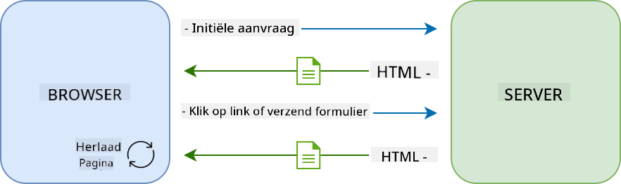
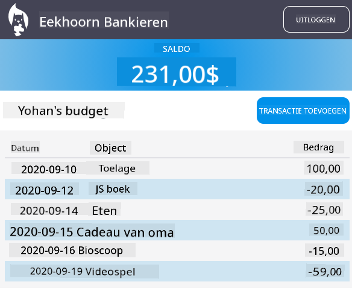

<!--
CO_OP_TRANSLATOR_METADATA:
{
  "original_hash": "f587e913e3f7c0b1c549a05dd74ee8e5",
  "translation_date": "2025-08-27T20:59:09+00:00",
  "source_file": "7-bank-project/3-data/README.md",
  "language_code": "nl"
}
-->
# Bouw een Bankapp Deel 3: Methoden voor het Ophalen en Gebruiken van Gegevens

## Pre-Les Quiz

[Pre-les quiz](https://ashy-river-0debb7803.1.azurestaticapps.net/quiz/45)

### Introductie

Aan de kern van elke webapplicatie staat *data*. Data kan vele vormen aannemen, maar het hoofddoel is altijd om informatie aan de gebruiker te tonen. Met webapps die steeds interactiever en complexer worden, is hoe de gebruiker toegang krijgt tot en interactie heeft met informatie een belangrijk onderdeel van webontwikkeling.

In deze les gaan we bekijken hoe we gegevens asynchroon van een server kunnen ophalen en deze gegevens kunnen gebruiken om informatie op een webpagina weer te geven zonder de HTML opnieuw te laden.

### Vereisten

Je moet het [Login- en Registratieformulier](../2-forms/README.md) van de webapp hebben gebouwd voor deze les. Je moet ook [Node.js](https://nodejs.org) installeren en [de server-API](../api/README.md) lokaal uitvoeren om toegang te krijgen tot accountgegevens.

Je kunt testen of de server correct werkt door dit commando in een terminal uit te voeren:

```sh
curl http://localhost:5000/api
# -> should return "Bank API v1.0.0" as a result
```

---

## AJAX en gegevens ophalen

Traditionele websites werken de weergegeven inhoud bij wanneer de gebruiker een link selecteert of gegevens indient via een formulier, door de volledige HTML-pagina opnieuw te laden. Elke keer dat nieuwe gegevens moeten worden geladen, retourneert de webserver een volledig nieuwe HTML-pagina die door de browser moet worden verwerkt, wat de huidige gebruikersactie onderbreekt en interacties tijdens het herladen beperkt. Deze workflow wordt ook wel een *Multi-Page Application* of *MPA* genoemd.



Toen webapplicaties complexer en interactiever begonnen te worden, ontstond een nieuwe techniek genaamd [AJAX (Asynchronous JavaScript and XML)](https://en.wikipedia.org/wiki/Ajax_(programming)). Deze techniek stelt webapps in staat om gegevens asynchroon van een server te verzenden en op te halen met JavaScript, zonder de HTML-pagina opnieuw te laden, wat resulteert in snellere updates en soepelere gebruikersinteracties. Wanneer nieuwe gegevens van de server worden ontvangen, kan de huidige HTML-pagina ook worden bijgewerkt met JavaScript via de [DOM](https://developer.mozilla.org/docs/Web/API/Document_Object_Model) API. In de loop van de tijd is deze aanpak geëvolueerd tot wat nu een [*Single-Page Application* of *SPA*](https://en.wikipedia.org/wiki/Single-page_application) wordt genoemd.


Toen AJAX voor het eerst werd geïntroduceerd, was de enige beschikbare API om gegevens asynchroon op te halen [`XMLHttpRequest`](https://developer.mozilla.org/docs/Web/API/XMLHttpRequest/Using_XMLHttpRequest). Maar moderne browsers implementeren nu ook de meer handige en krachtige [`Fetch` API](https://developer.mozilla.org/docs/Web/API/Fetch_API), die gebruikmaakt van promises en beter geschikt is voor het manipuleren van JSON-gegevens.

> Hoewel alle moderne browsers de `Fetch API` ondersteunen, is het altijd een goed idee om de [compatibiliteitstabel op caniuse.com](https://caniuse.com/fetch) te controleren als je wilt dat je webapplicatie werkt op oudere browsers.

### Taak

In [de vorige les](../2-forms/README.md) hebben we het registratieformulier geïmplementeerd om een account aan te maken. We gaan nu code toevoegen om in te loggen met een bestaand account en de gegevens op te halen. Open het bestand `app.js` en voeg een nieuwe `login`-functie toe:

```js
async function login() {
  const loginForm = document.getElementById('loginForm')
  const user = loginForm.user.value;
}
```

Hier beginnen we met het ophalen van het formulier-element met `getElementById()`, en vervolgens halen we de gebruikersnaam op uit de invoer met `loginForm.user.value`. Elk formuliercontrole-element kan worden benaderd via zijn naam (ingesteld in de HTML met het `name`-attribuut) als een eigenschap van het formulier.

Net zoals we deden voor de registratie, maken we een andere functie om een serververzoek uit te voeren, maar deze keer om de accountgegevens op te halen:

```js
async function getAccount(user) {
  try {
    const response = await fetch('//localhost:5000/api/accounts/' + encodeURIComponent(user));
    return await response.json();
  } catch (error) {
    return { error: error.message || 'Unknown error' };
  }
}
```

We gebruiken de `fetch` API om de gegevens asynchroon van de server op te halen, maar deze keer hebben we geen extra parameters nodig behalve de URL die we willen aanroepen, omdat we alleen gegevens opvragen. Standaard maakt `fetch` een [`GET`](https://developer.mozilla.org/docs/Web/HTTP/Methods/GET) HTTP-verzoek, wat precies is wat we hier nodig hebben.

✅ `encodeURIComponent()` is een functie die speciale tekens voor een URL ontsnapt. Welke problemen zouden we kunnen tegenkomen als we deze functie niet aanroepen en de `user`-waarde direct in de URL gebruiken?

Laten we nu onze `login`-functie bijwerken om `getAccount` te gebruiken:

```js
async function login() {
  const loginForm = document.getElementById('loginForm')
  const user = loginForm.user.value;
  const data = await getAccount(user);

  if (data.error) {
    return console.log('loginError', data.error);
  }

  account = data;
  navigate('/dashboard');
}
```

Omdat `getAccount` een asynchrone functie is, moeten we deze combineren met het `await`-keyword om te wachten op het serverresultaat. Zoals bij elk serververzoek, moeten we ook omgaan met foutgevallen. Voor nu voegen we alleen een logbericht toe om de fout weer te geven en komen we hier later op terug.

Vervolgens moeten we de gegevens ergens opslaan zodat we ze later kunnen gebruiken om de dashboardinformatie weer te geven. Omdat de `account`-variabele nog niet bestaat, maken we een globale variabele bovenaan ons bestand:

```js
let account = null;
```

Nadat de gebruikersgegevens in een variabele zijn opgeslagen, kunnen we van de *login*-pagina naar het *dashboard* navigeren met behulp van de `navigate()`-functie die we al hebben.

Ten slotte moeten we onze `login`-functie aanroepen wanneer het loginformulier wordt ingediend, door de HTML te wijzigen:

```html
<form id="loginForm" action="javascript:login()">
```

Test of alles correct werkt door een nieuw account te registreren en te proberen in te loggen met hetzelfde account.

Voordat we verder gaan met het volgende deel, kunnen we ook de `register`-functie voltooien door dit aan het einde van de functie toe te voegen:

```js
account = result;
navigate('/dashboard');
```

✅ Wist je dat je standaard alleen server-API's kunt aanroepen vanaf hetzelfde domein en dezelfde poort als de webpagina die je bekijkt? Dit is een beveiligingsmechanisme dat door browsers wordt afgedwongen. Maar wacht, onze webapp draait op `localhost:3000` terwijl de server-API draait op `localhost:5000`, waarom werkt het dan? Door gebruik te maken van een techniek genaamd [Cross-Origin Resource Sharing (CORS)](https://developer.mozilla.org/docs/Web/HTTP/CORS), is het mogelijk om cross-origin HTTP-verzoeken uit te voeren als de server speciale headers toevoegt aan de respons, waardoor uitzonderingen voor specifieke domeinen worden toegestaan.

> Leer meer over API's door deze [les](https://docs.microsoft.com/learn/modules/use-apis-discover-museum-art/?WT.mc_id=academic-77807-sagibbon) te volgen.

## HTML bijwerken om gegevens weer te geven

Nu we de gebruikersgegevens hebben, moeten we de bestaande HTML bijwerken om deze weer te geven. We weten al hoe we een element uit de DOM kunnen ophalen, bijvoorbeeld met `document.getElementById()`. Nadat je een basiselement hebt, zijn hier enkele API's die je kunt gebruiken om het te wijzigen of kindelementen toe te voegen:

- Met de [`textContent`](https://developer.mozilla.org/docs/Web/API/Node/textContent)-eigenschap kun je de tekst van een element wijzigen. Merk op dat het wijzigen van deze waarde alle kinderen van het element (indien aanwezig) verwijdert en vervangt door de opgegeven tekst. Het is dus ook een efficiënte methode om alle kinderen van een gegeven element te verwijderen door een lege string `''` toe te wijzen.

- Met [`document.createElement()`](https://developer.mozilla.org/docs/Web/API/Document/createElement) in combinatie met de [`append()`](https://developer.mozilla.org/docs/Web/API/ParentNode/append)-methode kun je een of meer nieuwe kindelementen maken en toevoegen.

✅ Met de [`innerHTML`](https://developer.mozilla.org/docs/Web/API/Element/innerHTML)-eigenschap van een element is het ook mogelijk om de HTML-inhoud te wijzigen, maar deze moet worden vermeden omdat het kwetsbaar is voor [cross-site scripting (XSS)](https://developer.mozilla.org/docs/Glossary/Cross-site_scripting)-aanvallen.

### Taak

Voordat we verder gaan met het dashboard-scherm, moeten we nog iets doen op de *login*-pagina. Momenteel, als je probeert in te loggen met een gebruikersnaam die niet bestaat, wordt er een bericht weergegeven in de console, maar voor een normale gebruiker verandert er niets en weet je niet wat er aan de hand is.

Laten we een placeholder-element toevoegen in het loginformulier waar we indien nodig een foutmelding kunnen weergeven. Een goede plek zou net voor de login-`<button>` zijn:

```html
...
<div id="loginError"></div>
<button>Login</button>
...
```

Dit `<div>`-element is leeg, wat betekent dat er niets op het scherm wordt weergegeven totdat we er inhoud aan toevoegen. We geven het ook een `id` zodat we het gemakkelijk kunnen ophalen met JavaScript.

Ga terug naar het bestand `app.js` en maak een nieuwe hulpfunctie `updateElement`:

```js
function updateElement(id, text) {
  const element = document.getElementById(id);
  element.textContent = text;
}
```

Deze functie is vrij eenvoudig: gegeven een element-*id* en *tekst*, zal het de tekstinhoud van het DOM-element met de bijbehorende `id` bijwerken. Laten we deze methode gebruiken in plaats van het vorige foutbericht in de `login`-functie:

```js
if (data.error) {
  return updateElement('loginError', data.error);
}
```

Nu, als je probeert in te loggen met een ongeldig account, zou je iets moeten zien zoals dit:


Nu hebben we fouttekst die visueel wordt weergegeven, maar als je het probeert met een schermlezer, zul je merken dat er niets wordt aangekondigd. Om ervoor te zorgen dat tekst die dynamisch aan een pagina wordt toegevoegd wordt aangekondigd door schermlezers, moet het gebruik maken van iets dat een [Live Region](https://developer.mozilla.org/docs/Web/Accessibility/ARIA/ARIA_Live_Regions) wordt genoemd. Hier gaan we een specifiek type live region gebruiken, genaamd een alert:

```html
<div id="loginError" role="alert"></div>
```

Implementeer hetzelfde gedrag voor de fouten in de `register`-functie (vergeet niet de HTML bij te werken).

## Informatie weergeven op het dashboard

Met dezelfde technieken die we zojuist hebben gezien, gaan we ook de accountinformatie weergeven op de dashboardpagina.

Dit is hoe een accountobject dat van de server wordt ontvangen eruitziet:

```json
{
  "user": "test",
  "currency": "$",
  "description": "Test account",
  "balance": 75,
  "transactions": [
    { "id": "1", "date": "2020-10-01", "object": "Pocket money", "amount": 50 },
    { "id": "2", "date": "2020-10-03", "object": "Book", "amount": -10 },
    { "id": "3", "date": "2020-10-04", "object": "Sandwich", "amount": -5 }
  ],
}
```

> Opmerking: om het je gemakkelijker te maken, kun je het vooraf bestaande `test`-account gebruiken dat al is gevuld met gegevens.

### Taak

Laten we beginnen met het vervangen van de "Balance"-sectie in de HTML om placeholder-elementen toe te voegen:

```html
<section>
  Balance: <span id="balance"></span><span id="currency"></span>
</section>
```

We voegen ook een nieuwe sectie toe net eronder om de accountbeschrijving weer te geven:

```html
<h2 id="description"></h2>
```

✅ Omdat de accountbeschrijving functioneert als een titel voor de inhoud eronder, is deze semantisch gemarkeerd als een heading. Leer meer over hoe [heading-structuur](https://www.nomensa.com/blog/2017/how-structure-headings-web-accessibility) belangrijk is voor toegankelijkheid, en bekijk de pagina kritisch om te bepalen wat nog meer een heading zou kunnen zijn.

Vervolgens maken we een nieuwe functie in `app.js` om de placeholder in te vullen:

```js
function updateDashboard() {
  if (!account) {
    return navigate('/login');
  }

  updateElement('description', account.description);
  updateElement('balance', account.balance.toFixed(2));
  updateElement('currency', account.currency);
}
```

Eerst controleren we of we de benodigde accountgegevens hebben voordat we verder gaan. Vervolgens gebruiken we de `updateElement()`-functie die we eerder hebben gemaakt om de HTML bij te werken.

> Om de balansweergave mooier te maken, gebruiken we de methode [`toFixed(2)`](https://developer.mozilla.org/docs/Web/JavaScript/Reference/Global_Objects/Number/toFixed) om de waarde met 2 cijfers na de komma weer te geven.

Nu moeten we onze `updateDashboard()`-functie aanroepen elke keer dat het dashboard wordt geladen. Als je de [les 1 opdracht](../1-template-route/assignment.md) al hebt voltooid, zou dit eenvoudig moeten zijn, anders kun je de volgende implementatie gebruiken.

Voeg deze code toe aan het einde van de `updateRoute()`-functie:

```js
if (typeof route.init === 'function') {
  route.init();
}
```

En werk de route-definitie bij met:

```js
const routes = {
  '/login': { templateId: 'login' },
  '/dashboard': { templateId: 'dashboard', init: updateDashboard }
};
```

Met deze wijziging wordt de functie `updateDashboard()` elke keer dat de dashboardpagina wordt weergegeven, aangeroepen. Na een login zou je dan de accountbalans, valuta en beschrijving moeten kunnen zien.

## Tabelrijen dynamisch maken met HTML-sjablonen

In de [eerste les](../1-template-route/README.md) hebben we HTML-sjablonen gebruikt in combinatie met de [`appendChild()`](https://developer.mozilla.org/docs/Web/API/Node/appendChild)-methode om de navigatie in onze app te implementeren. Sjablonen kunnen ook kleiner zijn en worden gebruikt om herhalende delen van een pagina dynamisch in te vullen.

We gaan een vergelijkbare aanpak gebruiken om de lijst met transacties in de HTML-tabel weer te geven.

### Taak

Voeg een nieuwe sjabloon toe in de HTML `<body>`:

```html
<template id="transaction">
  <tr>
    <td></td>
    <td></td>
    <td></td>
  </tr>
</template>
```

Deze sjabloon vertegenwoordigt een enkele tabelrij, met de 3 kolommen die we willen invullen: *datum*, *object* en *bedrag* van een transactie.

Voeg vervolgens deze `id`-eigenschap toe aan het `<tbody>`-element van de tabel binnen de dashboard-sjabloon om het gemakkelijker te vinden met JavaScript:

```html
<tbody id="transactions"></tbody>
```

Onze HTML is klaar, laten we overschakelen naar JavaScript-code en een nieuwe functie `createTransactionRow` maken:

```js
function createTransactionRow(transaction) {
  const template = document.getElementById('transaction');
  const transactionRow = template.content.cloneNode(true);
  const tr = transactionRow.querySelector('tr');
  tr.children[0].textContent = transaction.date;
  tr.children[1].textContent = transaction.object;
  tr.children[2].textContent = transaction.amount.toFixed(2);
  return transactionRow;
}
```

Deze functie doet precies wat de naam impliceert: met behulp van de sjabloon die we eerder hebben gemaakt, maakt het een nieuwe tabelrij en vult het de inhoud in met transactiegegevens. We gaan dit gebruiken in onze `updateDashboard()`-functie om de tabel in te vullen:

```js
const transactionsRows = document.createDocumentFragment();
for (const transaction of account.transactions) {
  const transactionRow = createTransactionRow(transaction);
  transactionsRows.appendChild(transactionRow);
}
updateElement('transactions', transactionsRows);
```

Hier gebruiken we de methode [`document.createDocumentFragment()`](https://developer.mozilla.org/docs/Web/API/Document/createDocumentFragment) die een nieuw DOM-fragment maakt waarop we kunnen werken, voordat we het uiteindelijk aan onze HTML-tabel koppelen.

Er is nog één ding dat we moeten doen voordat deze code kan werken, aangezien onze `updateElement()`-functie momenteel alleen tekstinhoud ondersteunt. Laten we de code een beetje aanpassen:

```js
function updateElement(id, textOrNode) {
  const element = document.getElementById(id);
  element.textContent = ''; // Removes all children
  element.append(textOrNode);
}
```

We gebruiken de [`append()`](https://developer.mozilla.org/docs/Web/API/ParentNode/append)-methode omdat deze het mogelijk maakt om zowel tekst als [DOM Nodes](https://developer.mozilla.org/docs/Web/API/Node) aan een ouderelement toe te voegen, wat perfect is voor al onze gebruiksscenario's.
Als je probeert in te loggen met het `test` account, zou je nu een transactielijst op het dashboard moeten zien 🎉.

---

## 🚀 Uitdaging

Werk samen om de dashboardpagina eruit te laten zien als een echte bankapp. Als je je app al hebt gestyled, probeer dan [media queries](https://developer.mozilla.org/docs/Web/CSS/Media_Queries) te gebruiken om een [responsief ontwerp](https://developer.mozilla.org/docs/Web/Progressive_web_apps/Responsive/responsive_design_building_blocks) te maken dat goed werkt op zowel desktop- als mobiele apparaten.

Hier is een voorbeeld van een gestylede dashboardpagina:



## Quiz na de les

[Quiz na de les](https://ashy-river-0debb7803.1.azurestaticapps.net/quiz/46)

## Opdracht

[Refactor en voorzie je code van commentaar](assignment.md)

---

**Disclaimer**:  
Dit document is vertaald met behulp van de AI-vertalingsservice [Co-op Translator](https://github.com/Azure/co-op-translator). Hoewel we streven naar nauwkeurigheid, dient u zich ervan bewust te zijn dat geautomatiseerde vertalingen fouten of onnauwkeurigheden kunnen bevatten. Het originele document in zijn oorspronkelijke taal moet worden beschouwd als de gezaghebbende bron. Voor cruciale informatie wordt professionele menselijke vertaling aanbevolen. Wij zijn niet aansprakelijk voor eventuele misverstanden of verkeerde interpretaties die voortvloeien uit het gebruik van deze vertaling.