<!--
CO_OP_TRANSLATOR_METADATA:
{
  "original_hash": "86ee5069f27ea3151389d8687c95fac9",
  "translation_date": "2025-11-04T02:00:17+00:00",
  "source_file": "7-bank-project/3-data/README.md",
  "language_code": "nl"
}
-->
# Een Banking App Bouwen Deel 3: Methoden voor het Ophalen en Gebruiken van Gegevens

Denk aan de computer van de Enterprise in Star Trek - wanneer kapitein Picard vraagt om de status van het schip, verschijnt de informatie direct zonder dat de hele interface opnieuw moet worden opgebouwd. Die naadloze stroom van informatie is precies wat we hier bouwen met dynamisch gegevens ophalen.

Op dit moment is jouw banking app als een gedrukt dagblad - informatief maar statisch. We gaan het transformeren naar iets dat meer lijkt op de missiecontrole van NASA, waar gegevens continu stromen en in real-time worden bijgewerkt zonder de workflow van de gebruiker te onderbreken.

Je leert hoe je asynchroon met servers communiceert, gegevens verwerkt die op verschillende momenten binnenkomen, en ruwe informatie omzet in iets betekenisvols voor je gebruikers. Dit is het verschil tussen een demo en software die klaar is voor productie.

## ⚡ Wat Je Binnen 5 Minuten Kunt Doen

**Snelle Start voor Drukke Ontwikkelaars**

```mermaid
flowchart LR
    A[⚡ 5 minutes] --> B[Set up API server]
    B --> C[Test fetch with curl]
    C --> D[Create login function]
    D --> E[See data in action]
```



- **Minuut 1-2**: Start je API-server (`cd api && npm start`) en test de verbinding
- **Minuut 3**: Maak een eenvoudige `getAccount()`-functie met fetch
- **Minuut 4**: Verbind het inlogformulier met `action="javascript:login()"`
- **Minuut 5**: Test de login en bekijk hoe accountgegevens in de console verschijnen

**Snelle Testcommando's**:
```bash
# Verify API is running
curl http://localhost:5000/api

# Test account data fetch
curl http://localhost:5000/api/accounts/test
```

**Waarom Dit Belangrijk Is**: Binnen 5 minuten zie je de magie van asynchroon gegevens ophalen die elke moderne webapplicatie aandrijft. Dit is de basis die apps responsief en levendig maakt.

## 🗺️ Jouw Leertraject Door Data-Driven Webapplicaties


**Jouw Bestemming**: Aan het einde van deze les begrijp je hoe moderne webapplicaties gegevens dynamisch ophalen, verwerken en weergeven, waardoor de naadloze gebruikerservaringen ontstaan die we van professionele applicaties verwachten.

## Pre-Lecture Quiz

[Pre-lecture quiz](https://ff-quizzes.netlify.app/web/quiz/45)

### Vereisten

Voordat je begint met gegevens ophalen, zorg ervoor dat je deze onderdelen klaar hebt:

- **Vorige Les**: Voltooi het [Login- en Registratieformulier](../2-forms/README.md) - we bouwen hierop voort
- **Lokale Server**: Installeer [Node.js](https://nodejs.org) en [start de server API](../api/README.md) om accountgegevens te leveren
- **API-verbinding**: Test je serververbinding met dit commando:

```bash
curl http://localhost:5000/api
# Expected response: "Bank API v1.0.0"
```

Deze snelle test zorgt ervoor dat alle componenten correct communiceren:
- Verifieert dat Node.js correct werkt op je systeem
- Bevestigt dat je API-server actief is en reageert
- Valideert dat je app de server kan bereiken (zoals het controleren van radiocontact voor een missie)

## 🧠 Overzicht van het Data Management Ecosysteem


**Kernprincipe**: Moderne webapplicaties zijn data-orkestratiesystemen - ze coördineren tussen gebruikersinterfaces, server-API's en browserbeveiligingsmodellen om naadloze, responsieve ervaringen te creëren.

---

## Begrijpen van Gegevens Ophalen in Moderne Webapps

De manier waarop webapplicaties gegevens verwerken is de afgelopen twee decennia drastisch geëvolueerd. Het begrijpen van deze evolutie helpt je te waarderen waarom moderne technieken zoals AJAX en de Fetch API zo krachtig zijn en waarom ze essentiële tools zijn voor webontwikkelaars.

Laten we eens kijken hoe traditionele websites werkten in vergelijking met de dynamische, responsieve applicaties die we vandaag bouwen.

### Traditionele Multi-Page Applicaties (MPA)

In de vroege dagen van het web was elke klik alsof je van kanaal wisselde op een oude televisie - het scherm werd zwart en stemde zich langzaam af op de nieuwe inhoud. Dit was de realiteit van vroege webapplicaties, waar elke interactie betekende dat de hele pagina opnieuw moest worden opgebouwd.


**Waarom deze aanpak onhandig aanvoelde:**
- Elke klik betekende dat de hele pagina opnieuw moest worden opgebouwd
- Gebruikers werden midden in hun gedachten onderbroken door die vervelende paginaflitsen
- Je internetverbinding werkte overuren door steeds dezelfde header en footer te downloaden
- Apps voelden meer als bladeren door een archiefkast dan als het gebruik van software

### Moderne Single-Page Applicaties (SPA)

AJAX (Asynchronous JavaScript and XML) veranderde dit paradigma volledig. Net als het modulaire ontwerp van het internationale ruimtestation, waar astronauten individuele componenten kunnen vervangen zonder de hele structuur opnieuw op te bouwen, stelt AJAX ons in staat om specifieke delen van een webpagina bij te werken zonder alles opnieuw te laden. Hoewel de naam XML noemt, gebruiken we tegenwoordig meestal JSON, maar het kernprincipe blijft: alleen bijwerken wat moet veranderen.


**Waarom SPA's zoveel beter aanvoelen:**
- Alleen de delen die daadwerkelijk zijn veranderd worden bijgewerkt (slim, toch?)
- Geen schokkende onderbrekingen meer - je gebruikers blijven in hun flow
- Minder gegevens die over de lijn reizen betekent snellere laadtijden
- Alles voelt snel en responsief, zoals de apps op je telefoon

### De Evolutie naar de Moderne Fetch API

Moderne browsers bieden de [`Fetch` API](https://developer.mozilla.org/docs/Web/API/Fetch_API), die de oudere [`XMLHttpRequest`](https://developer.mozilla.org/docs/Web/API/XMLHttpRequest/Using_XMLHttpRequest) vervangt. Net als het verschil tussen het bedienen van een telegraaf en het gebruik van e-mail, gebruikt de Fetch API promises voor schonere asynchrone code en verwerkt JSON van nature.

| Functie | XMLHttpRequest | Fetch API |
|---------|----------------|----------|
| **Syntax** | Complex, op callbacks gebaseerd | Schoon, op promises gebaseerd |
| **JSON-verwerking** | Handmatige parsing vereist | Ingebouwde `.json()`-methode |
| **Foutafhandeling** | Beperkte foutinformatie | Uitgebreide foutdetails |
| **Moderne Ondersteuning** | Compatibiliteit met legacy | ES6+ promises en async/await |

> 💡 **Browsercompatibiliteit**: Goed nieuws - de Fetch API werkt in alle moderne browsers! Als je nieuwsgierig bent naar specifieke versies, [caniuse.com](https://caniuse.com/fetch) heeft het volledige compatibiliteitsverhaal.
> 
**Kort samengevat:**
- Werkt uitstekend in Chrome, Firefox, Safari en Edge (praktisch overal waar je gebruikers zijn)
- Alleen Internet Explorer heeft extra hulp nodig (en eerlijk gezegd, het is tijd om IE los te laten)
- Bereidt je perfect voor op de elegante async/await-patronen die we later zullen gebruiken

### Implementeren van Gebruikerslogin en Gegevensophalen

Laten we nu het loginsysteem implementeren dat jouw banking app transformeert van een statische weergave naar een functionele applicatie. Net als de authenticatieprotocollen die worden gebruikt in beveiligde militaire faciliteiten, verifiëren we gebruikersgegevens en bieden we vervolgens toegang tot hun specifieke gegevens.

We bouwen dit stapsgewijs op, te beginnen met basisauthenticatie en vervolgens het toevoegen van de mogelijkheden voor gegevensophalen.

#### Stap 1: Maak de Basis van de Loginfunctie

Open je `app.js`-bestand en voeg een nieuwe `login`-functie toe. Deze zal het authenticatieproces van de gebruiker afhandelen:

```javascript
async function login() {
  const loginForm = document.getElementById('loginForm');
  const user = loginForm.user.value;
}
```

**Laten we dit opsplitsen:**
- Dat `async`-trefwoord? Het vertelt JavaScript "hé, deze functie moet misschien even wachten"
- We halen ons formulier van de pagina (niet ingewikkeld, gewoon vinden via de ID)
- Vervolgens halen we op wat de gebruiker heeft ingevoerd als gebruikersnaam
- Hier is een handige truc: je kunt elk formulierveld benaderen via het `name`-attribuut - geen extra getElementById-aanroepen nodig!

> 💡 **Formulier Toegangspatroon**: Elk formuliercontrole-element kan worden benaderd via zijn naam (ingesteld in de HTML met het `name`-attribuut) als een eigenschap van het formelement. Dit biedt een schone, leesbare manier om formuliergegevens te verkrijgen.

#### Stap 2: Maak de Functie voor Gegevensophalen van Accounts

Vervolgens maken we een speciale functie om accountgegevens van de server op te halen. Dit volgt hetzelfde patroon als je registratiefunctie, maar richt zich op gegevensophalen:

```javascript
async function getAccount(user) {
  try {
    const response = await fetch('//localhost:5000/api/accounts/' + encodeURIComponent(user));
    return await response.json();
  } catch (error) {
    return { error: error.message || 'Unknown error' };
  }
}
```

**Wat deze code doet:**
- **Gebruikt** de moderne `fetch` API om gegevens asynchroon op te vragen
- **Stelt** een GET-verzoek-URL samen met de gebruikersnaamparameter
- **Past** `encodeURIComponent()` toe om speciale tekens in URL's veilig te verwerken
- **Converteert** de respons naar JSON-formaat voor eenvoudige gegevensmanipulatie
- **Handelt** fouten netjes af door een foutobject te retourneren in plaats van te crashen

> ⚠️ **Beveiligingsopmerking**: De functie `encodeURIComponent()` verwerkt speciale tekens in URL's. Net als de coderingssystemen die worden gebruikt in maritieme communicatie, zorgt het ervoor dat je bericht precies aankomt zoals bedoeld, en voorkomt dat tekens zoals "#" of "&" verkeerd worden geïnterpreteerd.
> 
**Waarom dit belangrijk is:**
- Voorkomt dat speciale tekens URL's breken
- Beschermt tegen URL-manipulatie-aanvallen
- Zorgt ervoor dat je server de bedoelde gegevens ontvangt
- Volgt veilige coderingspraktijken

#### Begrijpen van HTTP GET-verzoeken

Hier is iets dat je misschien verrast: wanneer je `fetch` gebruikt zonder extra opties, maakt het automatisch een [`GET`](https://developer.mozilla.org/docs/Web/HTTP/Methods/GET)-verzoek. Dit is perfect voor wat we doen - de server vragen "hé, mag ik de accountgegevens van deze gebruiker zien?"

Denk aan GET-verzoeken als beleefd vragen om een boek te lenen uit de bibliotheek - je vraagt om iets te zien dat al bestaat. POST-verzoeken (die we gebruikten voor registratie) zijn meer zoals het indienen van een nieuw boek om aan de collectie toe te voegen.

| GET-verzoek | POST-verzoek |
|-------------|-------------|
| **Doel** | Bestaande gegevens ophalen | Nieuwe gegevens naar de server sturen |
| **Parameters** | In URL-pad/querystring | In de request body |
| **Caching** | Kan worden gecached door browsers | Wordt meestal niet gecached |
| **Beveiliging** | Zichtbaar in URL/logs | Verborgen in de request body |


#### Stap 3: Alles Samenbrengen

Nu komt het bevredigende deel - laten we je functie voor het ophalen van accountgegevens verbinden met het loginproces. Hier komt alles samen:

```javascript
async function login() {
  const loginForm = document.getElementById('loginForm');
  const user = loginForm.user.value;
  const data = await getAccount(user);

  if (data.error) {
    return console.log('loginError', data.error);
  }

  account = data;
  navigate('/dashboard');
}
```

Deze functie volgt een duidelijke volgorde:
- Haal de gebruikersnaam uit de formulierinvoer
- Vraag de accountgegevens van de gebruiker op bij de server
- Handel eventuele fouten af die tijdens het proces optreden
- Sla de accountgegevens op en ga naar het dashboard bij succes

> 🎯 **Async/Await-patroon**: Omdat `getAccount` een asynchrone functie is, gebruiken we het `await`-trefwoord om de uitvoering te pauzeren totdat de server reageert. Dit voorkomt dat de code doorgaat met ongedefinieerde gegevens.

#### Stap 4: Een Plek Creëren voor Je Gegevens

Je app heeft een plek nodig om de accountinformatie te onthouden zodra deze is geladen. Denk hieraan als het kortetermijngeheugen van je app - een plek om de gegevens van de huidige gebruiker bij de hand te houden. Voeg deze regel toe bovenaan je `app.js`-bestand:

```javascript
// This holds the current user's account data
let account = null;
```

**Waarom we dit nodig hebben:**
- Houdt de accountgegevens toegankelijk vanuit elke plek in je app
- Beginnen met `null` betekent "niemand is nog ingelogd"
- Wordt bijgewerkt wanneer iemand succesvol inlogt of registreert
- Werkt als een enkele bron van waarheid - geen verwarring over wie is ingelogd

#### Stap 5: Verbind Je Formulier

Laten we nu je gloednieuwe loginfunctie verbinden met je HTML-formulier. Werk je form-tag bij zoals dit:

```html
<form id="loginForm" action="javascript:login()">
  <!-- Your existing form inputs -->
</form>
```

**Wat deze kleine verandering doet:**
- Voorkomt dat het formulier zijn standaard "herlaad de hele pagina"-gedrag uitvoert
- Roept je aangepaste JavaScript-functie aan
- Houdt alles soepel en single-page-app-achtig
- Geeft je volledige controle over wat er gebeurt wanneer gebruikers op "Login" klikken

#### Stap 6: Verbeter Je Registratiefunctie

Voor consistentie, werk je `register`-functie bij om ook accountgegevens op te slaan en naar het dashboard te navigeren:

```javascript
// Add these lines at the end of your register function
account = result;
navigate('/dashboard');
```

**Deze verbetering biedt:**
- **Naadloze** overgang van registratie naar dashboard
- **Consistente** gebruikerservaring tussen login- en registratieflows
- **Directe** toegang tot accountgegevens na succesvolle registratie

#### Testen van Je Implementatie


**Tijd om het uit te proberen:**
1. Maak een nieuw account om te controleren of alles werkt
2. Probeer in te loggen met dezelfde gegevens
3. Kijk in de console van je browser (F12) als er iets niet klopt
4. Zorg ervoor dat je op het dashboard terechtkomt na een succesvolle login

Als iets niet werkt, geen paniek! De meeste problemen zijn eenvoudige oplossingen zoals typfouten of vergeten de API-server te starten.

#### Een Kort Woord Over Cross-Origin Magie

Je vraagt je misschien af: "Hoe communiceert mijn webapp met deze API-server terwijl ze op verschillende poorten draaien?" Goede vraag! Dit raakt iets waar elke webontwikkelaar uiteindelijk mee te maken krijgt.

> 🔒 **Cross-Origin Beveiliging**: Browsers handhaven een "same-origin policy" om ongeautoriseerde communicatie tussen verschillende domeinen te voorkomen. Net als het controlesysteem bij het Pentagon, verifiëren ze dat communicatie is geautoriseerd voordat gegevensoverdracht wordt toegestaan.
> 
**In onze setup:**
- Je webapp draait op `localhost:3000` (ontwikkelserver)
- Je API-server draait op `localhost:5000` (backendserver)
- De API-server bevat [CORS-headers](https://developer.mozilla.org/docs/Web/HTTP/CORS) die expliciet communicatie van je webapp autoriseren

Deze configuratie weerspiegelt de echte wereld, waar frontend- en backendapplicaties meestal op afzonderlijke servers draaien.

> 📚 **Meer Leren**: Duik dieper in API's en gegevensophalen met deze uitgebreide [Microsoft Learn module over API's](https://docs.microsoft.com/learn/modules/use-apis-discover-museum-art/?WT.mc_id=academic-77807-sagibbon).

## Je Gegevens Tot Leven Brengen in HTML

Nu gaan we de opgehaalde gegevens zichtbaar maken voor gebruikers via DOM-manipulatie. Net als het proces van het ontwikkelen van foto's in een donkere kamer, nemen we onzichtbare gegevens en renderen we ze tot iets dat gebruikers kunnen zien en gebruiken.
DOM-manipulatie is de techniek die statische webpagina's transformeert in dynamische applicaties die hun inhoud bijwerken op basis van gebruikersinteracties en serverreacties.

### Het juiste gereedschap kiezen voor de taak

Bij het bijwerken van je HTML met JavaScript heb je verschillende opties. Zie het als verschillende gereedschappen in een gereedschapskist - elk perfect voor specifieke taken:

| Methode | Waar het goed voor is | Wanneer te gebruiken | Veiligheidsniveau |
|--------|-----------------------|----------------------|-------------------|
| `textContent` | Veilig weergeven van gebruikersgegevens | Altijd wanneer je tekst toont | ✅ Zeer betrouwbaar |
| `createElement()` + `append()` | Complexe lay-outs bouwen | Nieuwe secties/lijsten maken | ✅ Zeer veilig |
| `innerHTML` | HTML-inhoud instellen | ⚠️ Probeer deze te vermijden | ❌ Risicovol |

#### De veilige manier om tekst weer te geven: textContent

De [`textContent`](https://developer.mozilla.org/docs/Web/API/Node/textContent)-eigenschap is je beste vriend bij het weergeven van gebruikersgegevens. Het is alsof je een portier hebt voor je webpagina - niets schadelijk komt erdoor:

```javascript
// The safe, reliable way to update text
const balanceElement = document.getElementById('balance');
balanceElement.textContent = account.balance;
```

**Voordelen van textContent:**
- Behandelt alles als platte tekst (voorkomt scriptuitvoering)
- Leegt automatisch bestaande inhoud
- Efficiënt voor eenvoudige tekstupdates
- Biedt ingebouwde beveiliging tegen schadelijke inhoud

#### Dynamische HTML-elementen maken

Voor complexere inhoud kun je [`document.createElement()`](https://developer.mozilla.org/docs/Web/API/Document/createElement) combineren met de [`append()`](https://developer.mozilla.org/docs/Web/API/ParentNode/append)-methode:

```javascript
// Safe way to create new elements
const transactionItem = document.createElement('div');
transactionItem.className = 'transaction-item';
transactionItem.textContent = `${transaction.date}: ${transaction.description}`;
container.append(transactionItem);
```

**Wat je moet begrijpen over deze aanpak:**
- **Maakt** nieuwe DOM-elementen programmeerbaar
- **Behoudt** volledige controle over elementattributen en inhoud
- **Maakt** complexe, geneste elementstructuren mogelijk
- **Waarborgt** veiligheid door structuur en inhoud te scheiden

> ⚠️ **Beveiligingsoverweging**: Hoewel [`innerHTML`](https://developer.mozilla.org/docs/Web/API/Element/innerHTML) vaak voorkomt in tutorials, kan het ingesloten scripts uitvoeren. Net zoals de beveiligingsprotocollen bij CERN ongeautoriseerde code-uitvoering voorkomen, bieden `textContent` en `createElement` veiligere alternatieven.
> 
**Risico's van innerHTML:**
- Voert eventuele `<script>`-tags in gebruikersgegevens uit
- Kwetsbaar voor code-injectie-aanvallen
- Creëert potentiële beveiligingsrisico's
- De veiligere alternatieven die we gebruiken bieden gelijkwaardige functionaliteit

### Fouten gebruiksvriendelijk maken

Op dit moment verschijnen inlogfouten alleen in de browserconsole, wat onzichtbaar is voor gebruikers. Net zoals het verschil tussen interne diagnostiek van een piloot en het informatiesysteem voor passagiers, moeten we belangrijke informatie via het juiste kanaal communiceren.

Het implementeren van zichtbare foutmeldingen geeft gebruikers directe feedback over wat er misging en hoe ze verder kunnen.

#### Stap 1: Voeg een plek toe voor foutmeldingen

Laten we eerst een plek maken voor foutmeldingen in je HTML. Voeg dit toe vlak voor je inlogknop zodat gebruikers het vanzelf zien:

```html
<!-- This is where error messages will appear -->
<div id="loginError" role="alert"></div>
<button>Login</button>
```

**Wat hier gebeurt:**
- We maken een lege container die onzichtbaar blijft totdat deze nodig is
- Het wordt geplaatst waar gebruikers van nature kijken na het klikken op "Inloggen"
- Die `role="alert"` is een mooie toevoeging voor schermlezers - het vertelt ondersteunende technologie "hé, dit is belangrijk!"
- De unieke `id` geeft onze JavaScript een eenvoudig doelwit

#### Stap 2: Maak een handige hulpfunctie

Laten we een kleine hulpfunctie maken die de tekst van elk element kan bijwerken. Dit is een van die "één keer schrijven, overal gebruiken"-functies die je tijd besparen:

```javascript
function updateElement(id, text) {
  const element = document.getElementById(id);
  element.textContent = text;
}
```

**Voordelen van de functie:**
- Eenvoudige interface die alleen een element-ID en tekstinhoud vereist
- Vindt en werkt DOM-elementen veilig bij
- Herbruikbaar patroon dat code duplicatie vermindert
- Zorgt voor consistente updategedrag in de hele applicatie

#### Stap 3: Toon fouten waar gebruikers ze kunnen zien

Laten we nu dat verborgen consolebericht vervangen door iets dat gebruikers daadwerkelijk kunnen zien. Werk je inlogfunctie bij:

```javascript
// Instead of just logging to console, show the user what's wrong
if (data.error) {
  return updateElement('loginError', data.error);
}
```

**Deze kleine verandering maakt een groot verschil:**
- Foutmeldingen verschijnen precies waar gebruikers kijken
- Geen mysterieuze stille fouten meer
- Gebruikers krijgen directe, bruikbare feedback
- Je app voelt professioneel en doordacht aan

Nu, wanneer je test met een ongeldig account, zie je een nuttige foutmelding direct op de pagina!


#### Stap 4: Inclusief zijn met toegankelijkheid

Hier is iets cools over die `role="alert"` die we eerder hebben toegevoegd - het is niet alleen decoratie! Dit kleine attribuut creëert wat een [Live Region](https://developer.mozilla.org/docs/Web/Accessibility/ARIA/ARIA_Live_Regions) wordt genoemd, die wijzigingen onmiddellijk aankondigt aan schermlezers:

```html
<div id="loginError" role="alert"></div>
```

**Waarom dit belangrijk is:**
- Gebruikers van schermlezers horen de foutmelding zodra deze verschijnt
- Iedereen krijgt dezelfde belangrijke informatie, ongeacht hoe ze navigeren
- Het is een eenvoudige manier om je app toegankelijker te maken
- Laat zien dat je geeft om het creëren van inclusieve ervaringen

Kleine details zoals deze onderscheiden goede ontwikkelaars van geweldige!

### 🎯 Pedagogische Check-in: Authenticatiepatronen

**Pauzeer en reflecteer**: Je hebt zojuist een complete authenticatiestroom geïmplementeerd. Dit is een fundamenteel patroon in webontwikkeling.

**Snelle zelfevaluatie**:
- Kun je uitleggen waarom we async/await gebruiken voor API-aanroepen?
- Wat zou er gebeuren als we de functie `encodeURIComponent()` vergeten?
- Hoe verbetert onze foutafhandeling de gebruikerservaring?

**Connectie met de echte wereld**: De patronen die je hier hebt geleerd (asynchrone gegevens ophalen, foutafhandeling, gebruikersfeedback) worden gebruikt in elke grote webapplicatie, van sociale mediaplatforms tot e-commerce sites. Je bouwt vaardigheden op van productieniveau!

**Uitdaging**: Hoe zou je dit authenticatiesysteem aanpassen om meerdere gebruikersrollen (klant, beheerder, kassier) te ondersteunen? Denk na over de benodigde datastructuur en UI-wijzigingen.

#### Stap 5: Pas hetzelfde patroon toe op registratie

Voor consistentie implementeer je identieke foutafhandeling in je registratieformulier:

1. **Voeg** een foutweergave-element toe aan je registratie-HTML:
```html
<div id="registerError" role="alert"></div>
```

2. **Werk** je registratiefunctie bij om hetzelfde foutweergavepatroon te gebruiken:
```javascript
if (data.error) {
  return updateElement('registerError', data.error);
}
```

**Voordelen van consistente foutafhandeling:**
- **Biedt** een uniforme gebruikerservaring in alle formulieren
- **Vermindert** cognitieve belasting door vertrouwde patronen te gebruiken
- **Vereenvoudigt** onderhoud met herbruikbare code
- **Zorgt** ervoor dat toegankelijkheidsnormen overal in de app worden nageleefd

## Je dynamische dashboard maken

Nu gaan we je statische dashboard transformeren in een dynamische interface die actuele accountgegevens weergeeft. Net zoals het verschil tussen een geprinte vluchtplanning en de live vertrekborden op luchthavens, gaan we van statische informatie naar realtime, responsieve weergaven.

Met behulp van de technieken voor DOM-manipulatie die je hebt geleerd, maken we een dashboard dat automatisch wordt bijgewerkt met actuele accountinformatie.

### Je gegevens leren kennen

Voordat we beginnen met bouwen, laten we eens kijken naar wat voor soort gegevens je server terugstuurt. Wanneer iemand succesvol inlogt, krijg je deze schat aan informatie:

```json
{
  "user": "test",
  "currency": "$",
  "description": "Test account",
  "balance": 75,
  "transactions": [
    { "id": "1", "date": "2020-10-01", "object": "Pocket money", "amount": 50 },
    { "id": "2", "date": "2020-10-03", "object": "Book", "amount": -10 },
    { "id": "3", "date": "2020-10-04", "object": "Sandwich", "amount": -5 }
  ]
}
```

**Deze datastructuur biedt:**
- **`user`**: Perfect om de ervaring te personaliseren ("Welkom terug, Sarah!")
- **`currency`**: Zorgt ervoor dat we geldbedragen correct weergeven
- **`description`**: Een vriendelijke naam voor het account
- **`balance`**: Het uiterst belangrijke huidige saldo
- **`transactions`**: De volledige transactiegeschiedenis met alle details

Alles wat je nodig hebt om een professioneel ogend bankdashboard te bouwen!


> 💡 **Handige tip**: Wil je je dashboard meteen in actie zien? Gebruik de gebruikersnaam `test` bij het inloggen - deze is vooraf geladen met voorbeeldgegevens zodat je alles kunt zien werken zonder eerst transacties te hoeven maken.
> 
**Waarom het testaccount handig is:**
- Wordt geleverd met realistische voorbeeldgegevens die al zijn geladen
- Perfect om te zien hoe transacties worden weergegeven
- Geweldig om je dashboardfuncties te testen
- Bespaart je de moeite om handmatig testgegevens te maken

### De dashboardweergevenselementen maken

Laten we je dashboardinterface stap voor stap bouwen, te beginnen met de samenvattingsinformatie van het account en vervolgens verder met meer complexe functies zoals transactielijsten.

#### Stap 1: Werk je HTML-structuur bij

Vervang eerst de statische "Saldo"-sectie door dynamische plaatsingselementen die je JavaScript kan invullen:

```html
<section>
  Balance: <span id="balance"></span><span id="currency"></span>
</section>
```

Voeg vervolgens een sectie toe voor de accountbeschrijving. Omdat dit fungeert als een titel voor de dashboardinhoud, gebruik je semantische HTML:

```html
<h2 id="description"></h2>
```

**Begrip van de HTML-structuur:**
- **Gebruikt** afzonderlijke `<span>`-elementen voor saldo en valuta voor individuele controle
- **Past** unieke ID's toe op elk element voor JavaScript-targeting
- **Volgt** semantische HTML door `<h2>` te gebruiken voor de accountbeschrijving
- **Creëert** een logische hiërarchie voor schermlezers en SEO

> ✅ **Inzicht in toegankelijkheid**: De accountbeschrijving fungeert als een titel voor de dashboardinhoud, dus deze is semantisch gemarkeerd als een kop. Lees meer over hoe [kopstructuur](https://www.nomensa.com/blog/2017/how-structure-headings-web-accessibility) de toegankelijkheid beïnvloedt. Kun je andere elementen op je pagina identificeren die baat zouden hebben bij koptekens?

#### Stap 2: Maak de dashboardupdatefunctie

Maak nu een functie die je dashboard vult met echte accountgegevens:

```javascript
function updateDashboard() {
  if (!account) {
    return navigate('/login');
  }

  updateElement('description', account.description);
  updateElement('balance', account.balance.toFixed(2));
  updateElement('currency', account.currency);
}
```

**Stap voor stap, dit doet de functie:**
- **Valideert** dat accountgegevens bestaan voordat verder wordt gegaan
- **Redirect** niet-geauthenticeerde gebruikers terug naar de inlogpagina
- **Update** de accountbeschrijving met behulp van de herbruikbare `updateElement`-functie
- **Formatteert** het saldo om altijd twee decimalen te tonen
- **Toont** het juiste valutasymbool

> 💰 **Geldformattering**: Die [`toFixed(2)`](https://developer.mozilla.org/docs/Web/JavaScript/Reference/Global_Objects/Number/toFixed)-methode is een redder in nood! Het zorgt ervoor dat je saldo er altijd uitziet als echt geld - "75,00" in plaats van alleen "75". Je gebruikers zullen het waarderen om vertrouwde valutaformattering te zien.

#### Stap 3: Zorg ervoor dat je dashboard wordt bijgewerkt

Om ervoor te zorgen dat je dashboard wordt vernieuwd met actuele gegevens telkens wanneer iemand het bezoekt, moeten we aansluiten op je navigatiesysteem. Als je de [les 1 opdracht](../1-template-route/assignment.md) hebt voltooid, zou dit bekend moeten aanvoelen. Zo niet, maak je geen zorgen - hier is wat je nodig hebt:

Voeg dit toe aan het einde van je `updateRoute()`-functie:

```javascript
if (typeof route.init === 'function') {
  route.init();
}
```

Werk vervolgens je routes bij om de dashboardinitialisatie op te nemen:

```javascript
const routes = {
  '/login': { templateId: 'login' },
  '/dashboard': { templateId: 'dashboard', init: updateDashboard }
};
```

**Wat deze slimme setup doet:**
- Controleert of een route speciale initialisatiecode heeft
- Voert die code automatisch uit wanneer de route wordt geladen
- Zorgt ervoor dat je dashboard altijd verse, actuele gegevens toont
- Houdt je routeringslogica schoon en georganiseerd

#### Testen van je dashboard

Na het implementeren van deze wijzigingen, test je je dashboard:

1. **Log in** met een testaccount
2. **Controleer** of je wordt doorgestuurd naar het dashboard
3. **Controleer** of de accountbeschrijving, het saldo en de valuta correct worden weergegeven
4. **Probeer uitloggen en opnieuw inloggen** om te controleren of gegevens correct worden vernieuwd

Je dashboard zou nu dynamische accountinformatie moeten weergeven die wordt bijgewerkt op basis van de gegevens van de ingelogde gebruiker!

## Slimme transactielijsten maken met sjablonen

In plaats van handmatig HTML te maken voor elke transactie, gebruiken we sjablonen om automatisch consistente opmaak te genereren. Net zoals gestandaardiseerde componenten in de ruimtevaartindustrie, zorgen sjablonen ervoor dat elke transactieregel dezelfde structuur en uitstraling heeft.

Deze techniek schaalt efficiënt van enkele transacties tot duizenden, terwijl consistente prestaties en presentatie behouden blijven.


### Stap 1: Maak de transactiesjabloon

Voeg eerst een herbruikbare sjabloon voor transactieregels toe aan je HTML `<body>`:

```html
<template id="transaction">
  <tr>
    <td></td>
    <td></td>
    <td></td>
  </tr>
</template>
```

**Begrip van HTML-sjablonen:**
- **Definieert** de structuur voor een enkele tabelrij
- **Blijft** onzichtbaar totdat deze wordt gekopieerd en gevuld met JavaScript
- **Bevat** drie cellen voor datum, beschrijving en bedrag
- **Biedt** een herbruikbaar patroon voor consistente opmaak

### Stap 2: Bereid je tabel voor op dynamische inhoud

Voeg vervolgens een `id` toe aan je tabelbody zodat JavaScript deze eenvoudig kan targeten:

```html
<tbody id="transactions"></tbody>
```

**Wat dit bereikt:**
- **Creëert** een duidelijk doelwit voor het invoegen van transactieregels
- **Scheidt** de tabelstructuur van de dynamische inhoud
- **Maakt** eenvoudig wissen en opnieuw vullen van transactiegegevens mogelijk

### Stap 3: Bouw de transactieregel-fabrieksfunctie

Maak nu een functie die transactiegegevens omzet in HTML-elementen:

```javascript
function createTransactionRow(transaction) {
  const template = document.getElementById('transaction');
  const transactionRow = template.content.cloneNode(true);
  const tr = transactionRow.querySelector('tr');
  tr.children[0].textContent = transaction.date;
  tr.children[1].textContent = transaction.object;
  tr.children[2].textContent = transaction.amount.toFixed(2);
  return transactionRow;
}
```

**Uitleg van deze fabrieksfunctie:**
- **Haalt** het sjabloonelement op via zijn ID
- **Kopieert** de sjablooninhoud voor veilige manipulatie
- **Selecteert** de tabelrij binnen de gekopieerde inhoud
- **Vult** elke cel met transactiegegevens
- **Formatteert** het bedrag om de juiste decimalen weer te geven
- **Geeft** de voltooide rij terug, klaar voor invoeging

### Stap 4: Genereer meerdere transactieregels efficiënt

Voeg deze code toe aan je `updateDashboard()`-functie om alle transacties weer te geven:

```javascript
const transactionsRows = document.createDocumentFragment();
for (const transaction of account.transactions) {
  const transactionRow = createTransactionRow(transaction);
  transactionsRows.appendChild(transactionRow);
}
updateElement('transactions', transactionsRows);
```

**Begrip van deze efficiënte aanpak:**
- **Maakt** een documentfragment om DOM-bewerkingen te groeperen
- **Itereert** door alle transacties in de accountgegevens
- **Genereert** een rij voor elke transactie met behulp van de fabrieksfunctie
- **Verzamelt** alle rijen in het fragment voordat ze aan de DOM worden toegevoegd
- **Voert** een enkele DOM-update uit in plaats van meerdere individuele invoegingen
> ⚡ **Prestatieoptimalisatie**: [`document.createDocumentFragment()`](https://developer.mozilla.org/docs/Web/API/Document/createDocumentFragment) werkt als het assemblageproces bij Boeing - onderdelen worden buiten de hoofdproductielijn voorbereid en vervolgens als een complete eenheid geïnstalleerd. Deze batchbenadering minimaliseert DOM-herberekeningen door één enkele invoeging uit te voeren in plaats van meerdere afzonderlijke operaties.

### Stap 5: Verbeter de Update-functie voor gemengde inhoud

Je `updateElement()`-functie verwerkt momenteel alleen tekstinhoud. Werk deze bij zodat hij zowel tekst als DOM-knooppunten kan verwerken:

```javascript
function updateElement(id, textOrNode) {
  const element = document.getElementById(id);
  element.textContent = ''; // Removes all children
  element.append(textOrNode);
}
```

**Belangrijke verbeteringen in deze update:**
- **Leegt** bestaande inhoud voordat nieuwe inhoud wordt toegevoegd
- **Accepteert** zowel tekststrings als DOM-knooppunten als parameters
- **Gebruikt** de [`append()`](https://developer.mozilla.org/docs/Web/API/ParentNode/append)-methode voor flexibiliteit
- **Behoudt** achterwaartse compatibiliteit met bestaande tekstgebaseerde toepassingen

### Je dashboard uitproberen

Het moment van de waarheid is aangebroken! Laten we je dynamische dashboard in actie zien:

1. Log in met het `test`-account (er is voorbeelddata beschikbaar)
2. Navigeer naar je dashboard
3. Controleer of de transactieregels correct worden weergegeven
4. Zorg ervoor dat datums, beschrijvingen en bedragen er goed uitzien

Als alles werkt, zou je een volledig functionele transactielijst op je dashboard moeten zien! 🎉

**Wat je hebt bereikt:**
- Een dashboard gebouwd dat schaalbaar is met elke hoeveelheid data
- Herbruikbare sjablonen gemaakt voor consistente opmaak
- Efficiënte DOM-manipulatietechnieken geïmplementeerd
- Functionaliteit ontwikkeld die vergelijkbaar is met productie-bankingapplicaties

Je hebt een statische webpagina succesvol omgevormd tot een dynamische webapplicatie.

### 🎯 Educatieve Check-in: Dynamische Inhoud Generatie

**Architectuurbegrip**: Je hebt een geavanceerde data-naar-UI-pijplijn geïmplementeerd die patronen weerspiegelt die worden gebruikt in frameworks zoals React, Vue en Angular.

**Belangrijke concepten beheerst**:
- **Sjabloongebaseerde rendering**: Het maken van herbruikbare UI-componenten
- **Documentfragmenten**: Optimaliseren van DOM-prestaties
- **Veilige DOM-manipulatie**: Voorkomen van beveiligingsrisico's
- **Datatransformatie**: Serverdata omzetten naar gebruikersinterfaces

**Industrieconnectie**: Deze technieken vormen de basis van moderne frontend-frameworks. Het virtuele DOM van React, het sjablonensysteem van Vue en de componentarchitectuur van Angular bouwen allemaal voort op deze kernconcepten.

**Reflectievraag**: Hoe zou je dit systeem uitbreiden om realtime updates te verwerken (zoals nieuwe transacties die automatisch verschijnen)? Denk aan WebSockets of Server-Sent Events.

---

## 📈 Jouw Tijdlijn voor Data Management Meesterschap


**🎓 Afstudeermijlpaal**: Je hebt succesvol een complete data-gedreven webapplicatie gebouwd met moderne JavaScript-patronen. Deze vaardigheden zijn direct toepasbaar bij het werken met frameworks zoals React, Vue of Angular.

**🔄 Volgende niveau mogelijkheden**:
- Klaar om frontend-frameworks te verkennen die voortbouwen op deze concepten
- Bereid om realtime functies te implementeren met WebSockets
- In staat om Progressive Web Apps te bouwen met offline mogelijkheden
- Basis gelegd voor het leren van geavanceerde state management-patronen

## GitHub Copilot Agent Uitdaging 🚀

Gebruik de Agent-modus om de volgende uitdaging te voltooien:

**Beschrijving:** Verbeter de bankingapp door een zoek- en filterfunctie voor transacties te implementeren waarmee gebruikers specifieke transacties kunnen vinden op basis van datumbereik, bedrag of beschrijvingswoorden.

**Prompt:** Maak een zoekfunctionaliteit voor de bankingapp die omvat: 1) Een zoekformulier met invoervelden voor datumbereik (van/tot), minimum/maximum bedrag en trefwoorden in de transactieomschrijving, 2) Een `filterTransactions()`-functie die de account.transactions-array filtert op basis van de zoekcriteria, 3) Werk de `updateDashboard()`-functie bij om gefilterde resultaten weer te geven, en 4) Voeg een "Filters wissen"-knop toe om de weergave te resetten. Gebruik moderne JavaScript-arraymethoden zoals `filter()` en behandel randgevallen voor lege zoekcriteria.

Meer informatie over [agent mode](https://code.visualstudio.com/blogs/2025/02/24/introducing-copilot-agent-mode) vind je hier.

## 🚀 Uitdaging

Klaar om je bankingapp naar een hoger niveau te tillen? Laten we ervoor zorgen dat het er goed uitziet en prettig aanvoelt. Hier zijn enkele ideeën om je creativiteit te stimuleren:

**Maak het mooi**: Voeg CSS-styling toe om je functionele dashboard om te toveren tot iets visueel aantrekkelijk. Denk aan strakke lijnen, goede spacing en misschien zelfs subtiele animaties.

**Maak het responsief**: Probeer [media queries](https://developer.mozilla.org/docs/Web/CSS/Media_Queries) te gebruiken om een [responsief ontwerp](https://developer.mozilla.org/docs/Web/Progressive_web_apps/Responsive/responsive_design_building_blocks) te maken dat goed werkt op telefoons, tablets en desktops. Je gebruikers zullen je dankbaar zijn!

**Voeg wat flair toe**: Overweeg om transacties kleurcodes te geven (groen voor inkomsten, rood voor uitgaven), iconen toe te voegen of hover-effecten te creëren die de interface interactief laten aanvoelen.

Hier is hoe een gepolijst dashboard eruit zou kunnen zien:


Voel je niet verplicht om dit precies na te maken - gebruik het als inspiratie en maak er je eigen versie van!

## Quiz na de les

[Quiz na de les](https://ff-quizzes.netlify.app/web/quiz/46)

## Opdracht

[Refactor en geef commentaar op je code](assignment.md)

---

**Disclaimer**:  
Dit document is vertaald met behulp van de AI-vertalingsservice [Co-op Translator](https://github.com/Azure/co-op-translator). Hoewel we streven naar nauwkeurigheid, dient u zich ervan bewust te zijn dat geautomatiseerde vertalingen fouten of onnauwkeurigheden kunnen bevatten. Het originele document in de oorspronkelijke taal moet worden beschouwd als de gezaghebbende bron. Voor kritieke informatie wordt professionele menselijke vertaling aanbevolen. Wij zijn niet aansprakelijk voor eventuele misverstanden of verkeerde interpretaties die voortvloeien uit het gebruik van deze vertaling.