<!--
CO_OP_TRANSLATOR_METADATA:
{
  "original_hash": "b807b09df716dc48a2b750835bf8e933",
  "translation_date": "2025-11-04T01:59:30+00:00",
  "source_file": "7-bank-project/4-state-management/README.md",
  "language_code": "nl"
}
-->
# Bouw een Bankapp Deel 4: Concepten van State Management

## ⚡ Wat Je Binnen 5 Minuten Kunt Doen

**Snelle Start voor Drukke Ontwikkelaars**

```mermaid
flowchart LR
    A[⚡ 5 minutes] --> B[Diagnose state issues]
    B --> C[Create central state object]
    C --> D[Add updateState function]
    D --> E[See immediate improvements]
```



- **Minuut 1**: Test het huidige state-probleem - log in, ververs de pagina, observeer uitloggen
- **Minuut 2**: Vervang `let account = null` door `let state = { account: null }`
- **Minuut 3**: Maak een eenvoudige `updateState()`-functie voor gecontroleerde updates
- **Minuut 4**: Update één functie om het nieuwe patroon te gebruiken
- **Minuut 5**: Test de verbeterde voorspelbaarheid en debugmogelijkheden

**Snelle Diagnosetest**:
```javascript
// Before: Scattered state
let account = null; // Lost on refresh!

// After: Centralized state
let state = Object.freeze({ account: null }); // Controlled and trackable!
```

**Waarom Dit Belangrijk Is**: Binnen 5 minuten ervaar je de transformatie van chaotisch state management naar voorspelbare, debugbare patronen. Dit is de basis die complexe applicaties onderhoudbaar maakt.

## 🗺️ Jouw Leertraject naar Meesterschap in State Management


**Jouw Bestemming**: Aan het einde van deze les heb je een professioneel state management systeem gebouwd dat zorgt voor persistentie, actuele data en voorspelbare updates - dezelfde patronen die worden gebruikt in productieapplicaties.

## Pre-Lecture Quiz

[Pre-lecture quiz](https://ff-quizzes.netlify.app/web/quiz/47)

## Introductie

State management is als het navigatiesysteem op het Voyager-ruimteschip – wanneer alles soepel werkt, merk je nauwelijks dat het er is. Maar als er iets misgaat, maakt het het verschil tussen het bereiken van de interstellaire ruimte en verloren ronddrijven in de kosmische leegte. In webontwikkeling vertegenwoordigt state alles wat je applicatie moet onthouden: gebruikersloginstatus, formulierdata, navigatiegeschiedenis en tijdelijke interface-states.

Naarmate je bankapp is geëvolueerd van een eenvoudige loginformulier naar een meer geavanceerde applicatie, ben je waarschijnlijk enkele veelvoorkomende uitdagingen tegengekomen. Ververs de pagina en gebruikers worden onverwacht uitgelogd. Sluit de browser en alle voortgang verdwijnt. Debug een probleem en je zoekt door meerdere functies die allemaal dezelfde data op verschillende manieren wijzigen.

Dit zijn geen tekenen van slechte code – het zijn de natuurlijke groeipijnen die optreden wanneer applicaties een bepaalde complexiteitsdrempel bereiken. Elke ontwikkelaar wordt met deze uitdagingen geconfronteerd wanneer hun apps overgaan van "proof of concept" naar "productieklaar."

In deze les implementeren we een gecentraliseerd state management systeem dat je bankapp transformeert in een betrouwbare, professionele applicatie. Je leert datastromen voorspelbaar te beheren, gebruikerssessies op de juiste manier te behouden en een soepele gebruikerservaring te creëren die moderne webapplicaties vereisen.

## Vereisten

Voordat je je verdiept in de concepten van state management, moet je ontwikkelomgeving goed zijn ingesteld en moet de basis van je bankapp gereed zijn. Deze les bouwt direct voort op de concepten en code uit eerdere delen van deze serie.

Zorg ervoor dat je de volgende componenten klaar hebt voordat je verder gaat:

**Benodigdheden:**
- Voltooi de [data ophalen les](../3-data/README.md) - je app moet succesvol accountgegevens laden en weergeven
- Installeer [Node.js](https://nodejs.org) op je systeem om de backend-API te draaien
- Start de [server API](../api/README.md) lokaal om accountgegevens te verwerken

**Test Je Omgeving:**

Controleer of je API-server correct werkt door dit commando in een terminal uit te voeren:

```sh
curl http://localhost:5000/api
# -> should return "Bank API v1.0.0" as a result
```

**Wat dit commando doet:**
- **Stuurt** een GET-verzoek naar je lokale API-server
- **Test** de verbinding en controleert of de server reageert
- **Geeft** de API-versie-informatie terug als alles correct werkt

## 🧠 Overzicht van State Management Architectuur


**Kernprincipe**: Professioneel state management balanceert voorspelbaarheid, persistentie en prestaties om betrouwbare gebruikerservaringen te creëren die schaalbaar zijn van eenvoudige interacties tot complexe applicatieworkflows.

---

## Diagnostiseren van de Huidige State Problemen

Net als Sherlock Holmes die een plaats delict onderzoekt, moeten we precies begrijpen wat er gebeurt in onze huidige implementatie voordat we het mysterie van verdwijnende gebruikerssessies kunnen oplossen.

Laten we een eenvoudig experiment uitvoeren dat de onderliggende problemen met state management onthult:

**🧪 Probeer Deze Diagnosetest:**
1. Log in op je bankapp en navigeer naar het dashboard
2. Ververs de browserpagina
3. Observeer wat er gebeurt met je loginstatus

Als je wordt teruggestuurd naar het inlogscherm, heb je het klassieke probleem van state-persistentie ontdekt. Dit gedrag treedt op omdat onze huidige implementatie gebruikersgegevens opslaat in JavaScript-variabelen die worden gereset bij elke paginalading.

**Huidige Implementatieproblemen:**

De eenvoudige `account`-variabele uit onze [vorige les](../3-data/README.md) veroorzaakt drie belangrijke problemen die zowel de gebruikerservaring als de onderhoudbaarheid van de code beïnvloeden:

| Probleem | Technische Oorzaak | Impact op Gebruiker |
|----------|--------------------|---------------------|
| **Sessieverlies** | Pagina verversen wist JavaScript-variabelen | Gebruikers moeten vaak opnieuw inloggen |
| **Verspreide Updates** | Meerdere functies wijzigen state direct | Debuggen wordt steeds moeilijker |
| **Onvolledige Opschoning** | Uitloggen wist niet alle state-referenties | Mogelijke beveiligings- en privacyproblemen |

**De Architecturale Uitdaging:**

Net als het compartimentontwerp van de Titanic dat robuust leek totdat meerdere compartimenten tegelijkertijd overstroomden, zal het afzonderlijk oplossen van deze problemen de onderliggende architecturale kwestie niet aanpakken. We hebben een uitgebreide state management oplossing nodig.

> 💡 **Wat proberen we hier eigenlijk te bereiken?**

[State management](https://en.wikipedia.org/wiki/State_management) draait echt om het oplossen van twee fundamentele puzzels:

1. **Waar is Mijn Data?**: Bijhouden welke informatie we hebben en waar het vandaan komt
2. **Is Iedereen op de Hoogte?**: Zorgen dat wat gebruikers zien overeenkomt met wat er daadwerkelijk gebeurt

**Ons Plan:**

In plaats van achter de feiten aan te lopen, gaan we een **gecentraliseerd state management** systeem creëren. Denk eraan als één echt georganiseerd persoon die verantwoordelijk is voor alle belangrijke zaken:


**Begrijpen van deze datastroom:**
- **Centraliseert** alle applicatiestate op één locatie
- **Leidt** alle state-wijzigingen via gecontroleerde functies
- **Zorgt ervoor** dat de UI gesynchroniseerd blijft met de huidige state
- **Biedt** een duidelijk, voorspelbaar patroon voor databeheer

> 💡 **Professioneel Inzicht**: Deze les richt zich op fundamentele concepten. Voor complexe applicaties bieden bibliotheken zoals [Redux](https://redux.js.org) meer geavanceerde state management functies. Het begrijpen van deze kernprincipes helpt je om elke state management bibliotheek te beheersen.

> ⚠️ **Geavanceerd Onderwerp**: We behandelen geen automatische UI-updates die worden geactiveerd door state-wijzigingen, omdat dit [Reactive Programming](https://en.wikipedia.org/wiki/Reactive_programming)-concepten omvat. Beschouw dit als een uitstekende volgende stap in je leertraject!

### Taak: Centraliseer State Structuur

Laten we beginnen met het transformeren van ons verspreide state management naar een gecentraliseerd systeem. Deze eerste stap legt de basis voor alle verbeteringen die volgen.

**Stap 1: Maak een Gecentraliseerd State Object**

Vervang de eenvoudige `account`-verklaring:

```js
let account = null;
```

Door een gestructureerd state-object:

```js
let state = {
  account: null
};
```

**Waarom deze verandering belangrijk is:**
- **Centraliseert** alle applicatiedata op één locatie
- **Bereidt** de structuur voor op het later toevoegen van meer state-eigenschappen
- **Creëert** een duidelijke scheiding tussen state en andere variabelen
- **Legt** een patroon vast dat schaalbaar is naarmate je app groeit

**Stap 2: Update State Toegangspatronen**

Update je functies om de nieuwe state-structuur te gebruiken:

**In de `register()` en `login()` functies**, vervang:
```js
account = ...
```

Door:
```js
state.account = ...
```

**In de `updateDashboard()` functie**, voeg deze regel toe bovenaan:
```js
const account = state.account;
```

**Wat deze updates bereiken:**
- **Behoudt** bestaande functionaliteit terwijl de structuur wordt verbeterd
- **Bereidt** je code voor op meer geavanceerd state management
- **Creëert** consistente patronen voor toegang tot state-data
- **Legt** de basis voor gecentraliseerde state-updates

> 💡 **Opmerking**: Deze refactoring lost onze problemen niet onmiddellijk op, maar creëert de essentiële basis voor de krachtige verbeteringen die komen!

### 🎯 Pedagogische Check-in: Centralisatieprincipes

**Pauzeer en Reflecteer**: Je hebt zojuist de basis van gecentraliseerd state management geïmplementeerd. Dit is een cruciale architecturale beslissing.

**Snelle Zelfbeoordeling**:
- Kun je uitleggen waarom het centraliseren van state in één object beter is dan verspreide variabelen?
- Wat zou er gebeuren als je vergat een functie te updaten om `state.account` te gebruiken?
- Hoe bereidt dit patroon je code voor op meer geavanceerde functies?

**Connectie met de Praktijk**: Het centralisatiepatroon dat je hebt geleerd, vormt de basis van moderne frameworks zoals Redux, Vuex en React Context. Je bouwt dezelfde architecturale denkwijze die wordt gebruikt in grote applicaties.

**Uitdaging Vraag**: Als je gebruikersvoorkeuren (thema, taal) aan je app moest toevoegen, waar zou je ze toevoegen in de state-structuur? Hoe zou dit schaalbaar zijn?

## Gecontroleerde State Updates Implementeren

Met onze state gecentraliseerd, is de volgende stap het opzetten van gecontroleerde mechanismen voor datamodificaties. Deze aanpak zorgt voor voorspelbare state-wijzigingen en gemakkelijker debuggen.

Het kernprincipe lijkt op luchtverkeersleiding: in plaats van meerdere functies toe te staan om state onafhankelijk te wijzigen, leiden we alle wijzigingen via één gecontroleerde functie. Dit patroon biedt duidelijk toezicht op wanneer en hoe data verandert.

**Immutable State Management:**

We behandelen ons `state`-object als [*immutable*](https://en.wikipedia.org/wiki/Immutable_object), wat betekent dat we het nooit direct wijzigen. In plaats daarvan creëert elke wijziging een nieuw state-object met de bijgewerkte data.

Hoewel deze aanpak in eerste instantie inefficiënt lijkt in vergelijking met directe wijzigingen, biedt het aanzienlijke voordelen voor debuggen, testen en het behouden van voorspelbaarheid van de applicatie.

**Voordelen van immutable state management:**

| Voordeel | Beschrijving | Impact |
|----------|--------------|--------|
| **Voorspelbaarheid** | Wijzigingen gebeuren alleen via gecontroleerde functies | Makkelijker te debuggen en testen |
| **Geschiedenis Bijhouden** | Elke state-wijziging creëert een nieuw object | Maakt undo/redo-functionaliteit mogelijk |
| **Voorkomen van Bijwerkingen** | Geen onbedoelde wijzigingen | Voorkomt mysterieuze bugs |
| **Prestatieoptimalisatie** | Makkelijk te detecteren wanneer state daadwerkelijk is veranderd | Maakt efficiënte UI-updates mogelijk |

**JavaScript Immutability met `Object.freeze()`:**

JavaScript biedt [`Object.freeze()`](https://developer.mozilla.org/docs/Web/JavaScript/Reference/Global_Objects/Object/freeze) om objectmodificaties te voorkomen:

```js
const immutableState = Object.freeze({ account: userData });
// Any attempt to modify immutableState will throw an error
```

**Wat hier gebeurt:**
- **Voorkomt** directe toewijzingen of verwijderingen van eigenschappen
- **Geeft** uitzonderingen als er pogingen tot wijzigingen worden gedaan
- **Zorgt ervoor** dat state-wijzigingen via gecontroleerde functies moeten gaan
- **Creëert** een duidelijke afspraak over hoe state kan worden bijgewerkt

> 💡 **Verdiepingsonderwerp**: Lees meer over het verschil tussen *shallow* en *deep* immutable objecten in de [MDN-documentatie](https://developer.mozilla.org/docs/Web/JavaScript/Reference/Global_Objects/Object/freeze#What_is_shallow_freeze). Het begrijpen van dit onderscheid is cruciaal voor complexe state-structuren.


### Taak

Laten we een nieuwe `updateState()`-functie maken:

```js
function updateState(property, newData) {
  state = Object.freeze({
    ...state,
    [property]: newData
  });
}
```

In deze functie maken we een nieuw state-object en kopiëren data van de vorige state met behulp van de [*spread (`...`) operator*](https://developer.mozilla.org/docs/Web/JavaScript/Reference/Operators/Spread_syntax#Spread_in_object_literals). Vervolgens overschrijven we een specifieke eigenschap van het state-object met de nieuwe data met behulp van de [bracket notatie](https://developer.mozilla.org/docs/Web/JavaScript/Guide/Working_with_Objects#Objects_and_properties) `[property]` voor toewijzing. Ten slotte vergrendelen we het object om wijzigingen te voorkomen met `Object.freeze()`. Voor nu hebben we alleen de `account`-eigenschap opgeslagen in de state, maar met deze aanpak kun je zoveel eigenschappen toevoegen als je nodig hebt in de state.

We zullen ook de `state`-initialisatie bijwerken om ervoor te zorgen dat de initiële state ook bevroren is:

```js
let state = Object.freeze({
  account: null
});
```

Daarna, update de `register`-functie door de toewijzing `state.account = result;` te vervangen door:

```js
updateState('account', result);
```

Doe hetzelfde met de `login`-functie, vervang `state.account = data;` door:

```js
updateState('account', data);
```

We nemen nu de kans om het probleem op te lossen waarbij accountgegevens niet worden gewist wanneer de gebruiker op *Logout* klikt.

Maak een nieuwe functie `logout()`:

```js
function logout() {
  updateState('account', null);
  navigate('/login');
}
```

In `updateDashboard()`, vervang de redirect `return navigate('/login');` door `return logout();`;

Probeer een nieuw account te registreren, uit te loggen en opnieuw in te loggen om te controleren of alles nog steeds correct werkt.

> Tip: je kunt alle state-wijzigingen bekijken door `console.log(state)` onderaan `updateState()` toe te voegen en de console in de ontwikkeltools van je browser te openen.

## Data Persistentie Implementeren

Het sessieverliesprobleem dat we eerder hebben geïdentificeerd, vereist een persistentieoplossing die gebruikersstate behoudt over browsersessies. Dit transformeert onze applicatie van een tijdelijke ervaring naar een betrouwbare, professionele tool.

Denk aan hoe atoomklokken nauwkeurige tijd behouden, zelfs tijdens stroomstoringen, door kritieke state op te slaan in niet-vluchtig geheugen. Op dezelfde manier hebben webapplicaties persistente opslagmechanismen nodig om essentiële gebruikersdata te behouden over browsersessies en paginaverversingen.

**Strategische Vragen voor Data Persistentie:**

Voordat je persistentie implementeert, overweeg deze kritieke factoren:

| Vraag | Context van Bankapp | Invloed op Beslissing |
|-------|---------------------|-----------------------|
| **Hoe lang moet het blijven bestaan?** | Inlogstatus vs. tijdelijke UI-voorkeuren | Kies een geschikte opslagduur |
| **Heeft de server het nodig?** | Authenticatietokens vs. UI-instellingen | Bepaal de vereisten voor delen |

**Browseropslagopties:**

Moderne browsers bieden verschillende opslagmechanismen, elk ontworpen voor specifieke gebruikssituaties:

**Primaire opslag-API's:**

1. **[`localStorage`](https://developer.mozilla.org/docs/Web/API/Window/localStorage)**: Persistente [Key/Value-opslag](https://en.wikipedia.org/wiki/Key%E2%80%93value_database)
   - **Blijft** bestaan over browsersessies heen, onbeperkt
   - **Overleeft** browserherstarts en computerreboots
   - **Gebonden** aan het specifieke website-domein
   - **Perfect** voor gebruikersvoorkeuren en inlogstatussen

2. **[`sessionStorage`](https://developer.mozilla.org/docs/Web/API/Window/sessionStorage)**: Tijdelijke sessieopslag
   - **Werkt** identiek aan localStorage tijdens actieve sessies
   - **Wordt gewist** zodra het browsertabblad wordt gesloten
   - **Ideaal** voor tijdelijke gegevens die niet bewaard hoeven te blijven

3. **[HTTP-cookies](https://developer.mozilla.org/docs/Web/HTTP/Cookies)**: Servergedeelde opslag
   - **Automatisch** verzonden bij elke serveraanvraag
   - **Perfect** voor [authenticatietokens](https://en.wikipedia.org/wiki/Authentication)
   - **Beperkt** in grootte en kan prestaties beïnvloeden

**Vereiste voor dataserialisatie:**

Zowel `localStorage` als `sessionStorage` slaan alleen [strings](https://developer.mozilla.org/docs/Web/JavaScript/Reference/Global_Objects/String) op:

```js
// Convert objects to JSON strings for storage
const accountData = { user: 'john', balance: 150 };
localStorage.setItem('account', JSON.stringify(accountData));

// Parse JSON strings back to objects when retrieving
const savedAccount = JSON.parse(localStorage.getItem('account'));
```

**Begrip van serialisatie:**
- **Converteert** JavaScript-objecten naar JSON-strings met [`JSON.stringify()`](https://developer.mozilla.org/docs/Web/JavaScript/Reference/Global_Objects/JSON/stringify)
- **Reconstrueert** objecten uit JSON met [`JSON.parse()`](https://developer.mozilla.org/docs/Web/JavaScript/Reference/Global_Objects/JSON/parse)
- **Behandelt** automatisch complexe geneste objecten en arrays
- **Faalt** bij functies, ongedefinieerde waarden en circulaire referenties

> 💡 **Geavanceerde optie**: Voor complexe offline applicaties met grote datasets, overweeg de [`IndexedDB` API](https://developer.mozilla.org/docs/Web/API/IndexedDB_API). Dit biedt een volledige client-side database, maar vereist een complexere implementatie.


### Taak: Implementeer localStorage-persistentie

Laten we persistente opslag implementeren zodat gebruikers ingelogd blijven totdat ze expliciet uitloggen. We gebruiken `localStorage` om accountgegevens op te slaan over browsersessies heen.

**Stap 1: Definieer opslagconfiguratie**

```js
const storageKey = 'savedAccount';
```

**Wat deze constante biedt:**
- **Creëert** een consistente identificator voor onze opgeslagen gegevens
- **Voorkomt** typefouten in opslagkeys
- **Maakt** het eenvoudig om de opslagkey te wijzigen indien nodig
- **Volgt** best practices voor onderhoudbare code

**Stap 2: Voeg automatische persistentie toe**

Voeg deze regel toe aan het einde van de `updateState()`-functie:

```js
localStorage.setItem(storageKey, JSON.stringify(state.account));
```

**Uitleg van wat hier gebeurt:**
- **Converteert** het accountobject naar een JSON-string voor opslag
- **Slaat** de gegevens op met onze consistente opslagkey
- **Voert** automatisch uit wanneer er statuswijzigingen plaatsvinden
- **Zorgt ervoor** dat opgeslagen gegevens altijd gesynchroniseerd zijn met de huidige status

> 💡 **Architectonisch voordeel**: Omdat we alle statusupdates hebben gecentraliseerd via `updateState()`, was het toevoegen van persistentie slechts één regel code. Dit toont de kracht van goede architectonische beslissingen!

**Stap 3: Herstel status bij het laden van de app**

Maak een initialisatiefunctie om opgeslagen gegevens te herstellen:

```js
function init() {
  const savedAccount = localStorage.getItem(storageKey);
  if (savedAccount) {
    updateState('account', JSON.parse(savedAccount));
  }

  // Our previous initialization code
  window.onpopstate = () => updateRoute();
  updateRoute();
}

init();
```

**Begrip van het initialisatieproces:**
- **Haalt** eerder opgeslagen accountgegevens op uit localStorage
- **Parst** de JSON-string terug naar een JavaScript-object
- **Werk** de status bij met behulp van onze gecontroleerde updatefunctie
- **Herstelt** automatisch de sessie van de gebruiker bij het laden van de pagina
- **Voert** uit vóór route-updates om ervoor te zorgen dat de status beschikbaar is

**Stap 4: Optimaliseer de standaardroute**

Werk de standaardroute bij om gebruik te maken van persistentie:

In `updateRoute()`, vervang:
```js
// Replace: return navigate('/login');
return navigate('/dashboard');
```

**Waarom deze wijziging logisch is:**
- **Benut** ons nieuwe persistentiesysteem effectief
- **Laat** het dashboard authenticatiecontroles uitvoeren
- **Leidt** automatisch door naar inloggen als er geen opgeslagen sessie is
- **Creëert** een meer naadloze gebruikerservaring

**Testen van uw implementatie:**

1. Log in op uw bankapp
2. Vernieuw de browserpagina
3. Controleer of u ingelogd blijft en op het dashboard bent
4. Sluit en open uw browser opnieuw
5. Ga terug naar uw app en controleer of u nog steeds ingelogd bent

🎉 **Prestatie behaald**: U heeft met succes een persistentiestatusbeheer geïmplementeerd! Uw app gedraagt zich nu als een professionele webapplicatie.

### 🎯 Pedagogische check-in: Persistentie-architectuur

**Begrip van architectuur**: U heeft een geavanceerde persistentielaag geïmplementeerd die de gebruikerservaring in balans brengt met de complexiteit van gegevensbeheer.

**Belangrijke concepten beheerst**:
- **JSON-serialisatie**: Complexe objecten omzetten in opslaanbare strings
- **Automatische synchronisatie**: Statuswijzigingen activeren persistente opslag
- **Herstel van sessies**: Apps kunnen gebruikerscontext herstellen na onderbrekingen
- **Gecentraliseerde persistentie**: Eén updatefunctie beheert alle opslag

**Industrieconnectie**: Dit persistentiepatroon is fundamenteel voor Progressive Web Apps (PWA's), offline-first applicaties en moderne mobiele webervaringen. U bouwt productieklare mogelijkheden.

**Reflectievraag**: Hoe zou u dit systeem aanpassen om meerdere gebruikersaccounts op hetzelfde apparaat te beheren? Overweeg de privacy- en beveiligingsimplicaties.

## Balans tussen persistentie en gegevensactualiteit

Ons persistentiesysteem behoudt met succes gebruikerssessies, maar introduceert een nieuwe uitdaging: verouderde gegevens. Wanneer meerdere gebruikers of applicaties dezelfde servergegevens wijzigen, worden lokaal gecachte gegevens verouderd.

Dit lijkt op Vikingnavigators die zowel opgeslagen sterrenkaarten als actuele waarnemingen gebruikten. De kaarten boden consistentie, maar navigators hadden verse waarnemingen nodig om rekening te houden met veranderende omstandigheden. Evenzo heeft onze applicatie zowel persistente gebruikersstatus als actuele servergegevens nodig.

**🧪 Het probleem van gegevensactualiteit ontdekken:**

1. Log in op het dashboard met het `test`-account
2. Voer dit commando uit in een terminal om een transactie van een andere bron te simuleren:

```sh
curl --request POST \
     --header "Content-Type: application/json" \
     --data "{ \"date\": \"2020-07-24\", \"object\": \"Bought book\", \"amount\": -20 }" \
     http://localhost:5000/api/accounts/test/transactions
```

3. Vernieuw uw dashboardpagina in de browser
4. Observeer of u de nieuwe transactie ziet

**Wat deze test aantoont:**
- **Toont** hoe localStorage "verouderd" kan raken
- **Simuleert** scenario's uit de echte wereld waarin gegevens buiten uw app worden gewijzigd
- **Onthult** de spanning tussen persistentie en gegevensactualiteit

**De uitdaging van verouderde gegevens:**

| Probleem | Oorzaak | Impact op gebruiker |
|----------|---------|---------------------|
| **Verouderde gegevens** | localStorage verloopt nooit automatisch | Gebruikers zien verouderde informatie |
| **Serverwijzigingen** | Andere apps/gebruikers wijzigen dezelfde gegevens | Inconsistente weergaven op verschillende platforms |
| **Cache vs. realiteit** | Lokale cache komt niet overeen met serverstatus | Slechte gebruikerservaring en verwarring |

**Oplossingsstrategie:**

We implementeren een "verversen bij laden"-patroon dat de voordelen van persistentie in balans brengt met de noodzaak van actuele gegevens. Deze aanpak behoudt de soepele gebruikerservaring en zorgt tegelijkertijd voor gegevensnauwkeurigheid.


### Taak: Implementeer een gegevensverversingssysteem

We maken een systeem dat automatisch actuele gegevens van de server ophaalt en tegelijkertijd de voordelen van ons persistentiesysteem behoudt.

**Stap 1: Maak een accountgegevens-updater**

```js
async function updateAccountData() {
  const account = state.account;
  if (!account) {
    return logout();
  }

  const data = await getAccount(account.user);
  if (data.error) {
    return logout();
  }

  updateState('account', data);
}
```

**Begrip van de logica van deze functie:**
- **Controleert** of een gebruiker momenteel is ingelogd (state.account bestaat)
- **Leidt** door naar uitloggen als er geen geldige sessie is
- **Haalt** actuele accountgegevens op van de server met de bestaande `getAccount()`-functie
- **Behandelt** serverfouten op een nette manier door ongeldige sessies uit te loggen
- **Werk** de status bij met actuele gegevens via ons gecontroleerde updatesysteem
- **Activeert** automatische localStorage-persistentie via de `updateState()`-functie

**Stap 2: Maak een dashboardverversingshandler**

```js
async function refresh() {
  await updateAccountData();
  updateDashboard();
}
```

**Wat deze verversingsfunctie doet:**
- **Coördineert** het gegevensverversings- en UI-updateproces
- **Wacht** tot actuele gegevens zijn geladen voordat de weergave wordt bijgewerkt
- **Zorgt ervoor** dat het dashboard de meest actuele informatie toont
- **Behoudt** een duidelijke scheiding tussen gegevensbeheer en UI-updates

**Stap 3: Integreer met het routesysteem**

Werk uw routeconfiguratie bij om automatisch te verversen:

```js
const routes = {
  '/login': { templateId: 'login' },
  '/dashboard': { templateId: 'dashboard', init: refresh }
};
```

**Hoe deze integratie werkt:**
- **Voert** de verversingsfunctie uit elke keer dat de dashboardroute wordt geladen
- **Zorgt ervoor** dat actuele gegevens altijd worden weergegeven wanneer gebruikers naar het dashboard navigeren
- **Behoudt** de bestaande routestructuur terwijl gegevensactualiteit wordt toegevoegd
- **Biedt** een consistent patroon voor route-specifieke initialisatie

**Testen van uw gegevensverversingssysteem:**

1. Log in op uw bankapp
2. Voer het eerder genoemde curl-commando uit om een nieuwe transactie te maken
3. Vernieuw uw dashboardpagina of navigeer weg en terug
4. Controleer of de nieuwe transactie onmiddellijk verschijnt

🎉 **Perfecte balans bereikt**: Uw app combineert nu de soepele ervaring van persistente status met de nauwkeurigheid van actuele servergegevens!

## 📈 Uw tijdlijn voor meesterschap in statusbeheer


**🎓 Afstudeermijlpaal**: U heeft met succes een compleet statusbeheersysteem gebouwd met dezelfde principes die Redux, Vuex en andere professionele statusbibliotheken aandrijven. Deze patronen schalen van eenvoudige apps tot bedrijfsapplicaties.

**🔄 Volgende niveau capaciteiten**:
- Klaar om statusbeheerkaders (Redux, Zustand, Pinia) te beheersen
- Voorbereid om realtime functies met WebSockets te implementeren
- In staat om offline-first Progressive Web Apps te bouwen
- Basis gelegd voor geavanceerde patronen zoals toestandsmachines en observers

## GitHub Copilot Agent-uitdaging 🚀

Gebruik de Agent-modus om de volgende uitdaging te voltooien:

**Beschrijving:** Implementeer een uitgebreid statusbeheersysteem met ongedaan maken/herhalen-functionaliteit voor de bankapp. Deze uitdaging helpt u geavanceerde statusbeheerconcepten te oefenen, waaronder het bijhouden van statusgeschiedenis, onveranderlijke updates en synchronisatie van de gebruikersinterface.

**Prompt:** Maak een verbeterd statusbeheersysteem dat omvat: 1) Een statusgeschiedenisarray die alle vorige statussen bijhoudt, 2) Ongedaan maken- en herhalenfuncties die kunnen terugkeren naar eerdere statussen, 3) UI-knoppen voor ongedaan maken/herhalen op het dashboard, 4) Een maximale geschiedenislengte van 10 statussen om geheugenproblemen te voorkomen, en 5) Correcte opschoning van geschiedenis wanneer de gebruiker uitlogt. Zorg ervoor dat de ongedaan maken/herhalen-functionaliteit werkt met wijzigingen in het accountsaldo en blijft bestaan over browserverversingen.

Meer informatie over [agent mode](https://code.visualstudio.com/blogs/2025/02/24/introducing-copilot-agent-mode) hier.

## 🚀 Uitdaging: Opslagoptimalisatie

Uw implementatie beheert nu gebruikerssessies, gegevensverversing en statusbeheer effectief. Overweeg echter of onze huidige aanpak opslag efficiënt in balans brengt met functionaliteit.

Net als schaakmeesters die onderscheid maken tussen essentiële stukken en inwisselbare pionnen, vereist effectief statusbeheer het identificeren van welke gegevens moeten blijven bestaan versus welke altijd vers van de server moeten komen.

**Optimalisatieanalyse:**

Evalueer uw huidige localStorage-implementatie en overweeg deze strategische vragen:
- Wat is de minimale informatie die nodig is om gebruikersauthenticatie te behouden?
- Welke gegevens veranderen zo vaak dat lokale caching weinig voordeel biedt?
- Hoe kan opslagoptimalisatie de prestaties verbeteren zonder de gebruikerservaring te verslechteren?

**Implementatiestrategie:**
- **Identificeer** de essentiële gegevens die moeten blijven bestaan (waarschijnlijk alleen gebruikersidentificatie)
- **Wijzig** uw localStorage-implementatie om alleen kritieke sessiegegevens op te slaan
- **Zorg ervoor** dat actuele gegevens altijd van de server worden geladen bij dashboardbezoeken
- **Test** of uw geoptimaliseerde aanpak dezelfde gebruikerservaring behoudt

**Geavanceerde overweging:**
- **Vergelijk** de afwegingen tussen het opslaan van volledige accountgegevens versus alleen authenticatietokens
- **Documenteer** uw beslissingen en redeneringen voor toekomstige teamleden

Deze uitdaging helpt u te denken als een professionele ontwikkelaar die zowel gebruikerservaring als applicatie-efficiëntie in overweging neemt. Neem de tijd om te experimenteren met verschillende benaderingen!

## Quiz na de les

[Quiz na de les](https://ff-quizzes.netlify.app/web/quiz/48)

## Opdracht

[Implementeer "Transactie toevoegen"-dialoogvenster](assignment.md)

Hier is een voorbeeldresultaat na het voltooien van de opdracht:


---

**Disclaimer**:  
Dit document is vertaald met behulp van de AI-vertalingsservice [Co-op Translator](https://github.com/Azure/co-op-translator). Hoewel we streven naar nauwkeurigheid, dient u zich ervan bewust te zijn dat geautomatiseerde vertalingen fouten of onnauwkeurigheden kunnen bevatten. Het originele document in de oorspronkelijke taal moet worden beschouwd als de gezaghebbende bron. Voor kritieke informatie wordt professionele menselijke vertaling aanbevolen. Wij zijn niet aansprakelijk voor eventuele misverstanden of verkeerde interpretaties die voortvloeien uit het gebruik van deze vertaling.