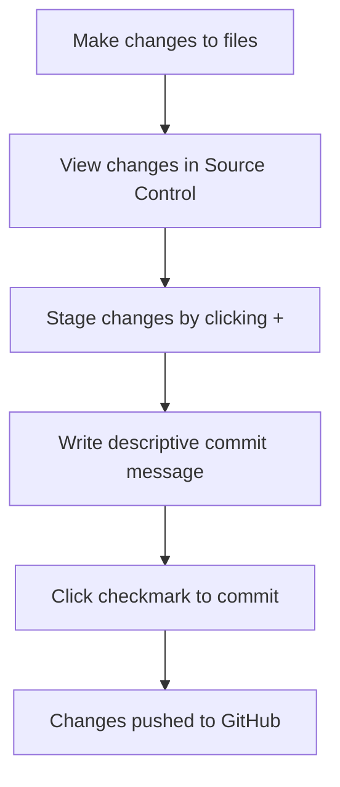

<!--
CO_OP_TRANSLATOR_METADATA:
{
  "original_hash": "cfd4a15974168ca426d50c67682ab9d4",
  "translation_date": "2025-10-23T00:49:14+00:00",
  "source_file": "8-code-editor/1-using-a-code-editor/README.md",
  "language_code": "nl"
}
-->
# Een Code Editor Gebruiken: Meesterschap in VSCode.dev

Weet je nog in *The Matrix* toen Neo zich moest aansluiten op een gigantische computerterminal om toegang te krijgen tot de digitale wereld? De webontwikkelingstools van vandaag vertellen een heel ander verhaal – ongelooflijk krachtige mogelijkheden die overal toegankelijk zijn. VSCode.dev is een browsergebaseerde code-editor die professionele ontwikkeltools naar elk apparaat met een internetverbinding brengt.

Net zoals de drukpers boeken toegankelijk maakte voor iedereen, en niet alleen voor monniken in kloosters, democratiseert VSCode.dev het coderen. Je kunt aan projecten werken vanaf een computer in de bibliotheek, een schoollokaal, of waar je ook maar toegang hebt tot een browser. Geen installaties, geen beperkingen zoals "ik heb mijn specifieke setup nodig".

Aan het einde van deze les begrijp je hoe je door VSCode.dev navigeert, GitHub-repositories direct in je browser opent en Git gebruikt voor versiebeheer – allemaal vaardigheden waar professionele ontwikkelaars dagelijks op vertrouwen.

## Wat Je Gaat Leren

Na deze walkthrough kun je:

- VSCode.dev navigeren alsof het je tweede thuis is – alles vinden wat je nodig hebt zonder te verdwalen
- Elke GitHub-repository direct in je browser openen en meteen beginnen met bewerken (dit is echt magisch!)
- Git gebruiken om je wijzigingen bij te houden en je voortgang als een professional op te slaan
- Je editor verbeteren met extensies die coderen sneller en leuker maken
- Projectbestanden maken en organiseren met vertrouwen

## Wat Je Nodig Hebt

De vereisten zijn eenvoudig:

- Een gratis [GitHub-account](https://github.com) (we begeleiden je bij het aanmaken indien nodig)
- Basiskennis van webbrowsers
- De les GitHub Basics biedt nuttige achtergrondinformatie, hoewel het niet essentieel is

> 💡 **Nieuw bij GitHub?** Een account aanmaken is gratis en kost slechts een paar minuten. Net zoals een bibliotheekkaart je toegang geeft tot boeken wereldwijd, opent een GitHub-account deuren naar code-repositories op het internet.

## Waarom Webgebaseerde Code Editors Belangrijk Zijn

Vóór het internet konden wetenschappers van verschillende universiteiten niet gemakkelijk onderzoek delen. Toen kwam ARPANET in de jaren '60, dat computers over afstanden met elkaar verbond. Webgebaseerde code-editors volgen hetzelfde principe – krachtige tools toegankelijk maken, ongeacht je fysieke locatie of apparaat.

Een code-editor is je ontwikkelwerkruimte, waar je codebestanden schrijft, bewerkt en organiseert. In tegenstelling tot eenvoudige teksteditors bieden professionele code-editors syntax highlighting, foutdetectie en projectbeheerfuncties.

VSCode.dev brengt deze mogelijkheden naar je browser:

**Voordelen van webgebaseerd bewerken:**

| Functie | Beschrijving | Praktisch Voordeel |
|---------|-------------|----------|
| **Platformonafhankelijkheid** | Werkt op elk apparaat met een browser | Naadloos werken vanaf verschillende computers |
| **Geen installatie nodig** | Toegang via een web-URL | Omzeil beperkingen van software-installatie |
| **Automatische updates** | Altijd de nieuwste versie | Nieuwe functies zonder handmatige updates |
| **Repository-integratie** | Directe verbinding met GitHub | Code bewerken zonder lokaal bestandbeheer |

**Praktische implicaties:**
- Continuïteit van werk in verschillende omgevingen
- Consistente interface, ongeacht het besturingssysteem
- Directe samenwerkingsmogelijkheden
- Verminderde lokale opslagvereisten

## VSCode.dev Verkennen

Net zoals het laboratorium van Marie Curie geavanceerde apparatuur bevatte in een relatief eenvoudige ruimte, biedt VSCode.dev professionele ontwikkeltools in een browserinterface. Deze webapplicatie biedt dezelfde kernfunctionaliteit als desktop-code-editors.

Begin door naar [vscode.dev](https://vscode.dev) te navigeren in je browser. De interface laadt zonder downloads of systeeminstallaties – een directe toepassing van cloud computing-principes.

### Je GitHub-account koppelen

Net zoals de telefoon van Alexander Graham Bell verre locaties met elkaar verbond, verbindt het koppelen van je GitHub-account VSCode.dev met je code-repositories. Wanneer je wordt gevraagd om in te loggen met GitHub, wordt aanbevolen om deze verbinding te accepteren.

**GitHub-integratie biedt:**
- Directe toegang tot je repositories binnen de editor
- Gesynchroniseerde instellingen en extensies op verschillende apparaten
- Gestroomlijnde workflow voor opslaan naar GitHub
- Gepersonaliseerde ontwikkelomgeving

### Je Nieuwe Werkruimte Leren Kennen

Zodra alles is geladen, zie je een prachtig schone werkruimte die is ontworpen om je te helpen focussen op wat belangrijk is – je code!

**Hier is je rondleiding door de buurt:**
- **Activiteitenbalk** (die strook aan de linkerkant): Je hoofdnavigatie met Explorer 📁, Zoeken 🔍, Versiebeheer 🌿, Extensies 🧩 en Instellingen ⚙️
- **Zijbalk** (het paneel ernaast): Verandert om je relevante informatie te tonen op basis van wat je hebt geselecteerd
- **Editorgebied** (de grote ruimte in het midden): Hier gebeurt de magie – je belangrijkste codeergebied

**Neem even de tijd om te verkennen:**
- Klik rond op die pictogrammen in de activiteitenbalk en kijk wat elk doet
- Merk op hoe de zijbalk wordt bijgewerkt om verschillende informatie te tonen – best handig, toch?
- De Explorer-weergave (📁) is waarschijnlijk waar je de meeste tijd zult doorbrengen, dus maak jezelf er vertrouwd mee

## GitHub Repositories Openen

Vóór het internet moesten onderzoekers fysiek naar bibliotheken reizen om toegang te krijgen tot documenten. GitHub-repositories werken op een vergelijkbare manier – het zijn verzamelingen van code die op afstand worden opgeslagen. VSCode.dev elimineert de traditionele stap van het downloaden van repositories naar je lokale machine voordat je ze bewerkt.

Deze mogelijkheid biedt directe toegang tot elke openbare repository voor bekijken, bewerken of bijdragen. Hier zijn twee methoden om repositories te openen:

### Methode 1: De Klik-en-Ga Manier

Dit is perfect als je net begint met VSCode.dev en een specifieke repository wilt openen. Het is eenvoudig en gebruiksvriendelijk:

**Zo doe je het:**

1. Ga naar [vscode.dev](https://vscode.dev) als je daar nog niet bent
2. Zoek de knop "Open Remote Repository" op het welkomstscherm en klik erop

   

3. Plak een GitHub-repository-URL (probeer deze: `https://github.com/microsoft/Web-Dev-For-Beginners`)
4. Druk op Enter en zie de magie gebeuren!

**Pro tip - De Command Palette sneltoets:**

Wil je je als een codeerwizard voelen? Probeer deze sneltoets: Ctrl+Shift+P (of Cmd+Shift+P op Mac) om de Command Palette te openen:

**De Command Palette is als een zoekmachine voor alles wat je kunt doen:**
- Typ "open remote" en het vindt de repository-opener voor je
- Het onthoudt repositories die je onlangs hebt geopend (super handig!)
- Zodra je eraan gewend bent, voelt het alsof je met lichtsnelheid codeert
- Het is eigenlijk VSCode.dev's versie van "Hey Siri, maar dan voor coderen"

### Methode 2: URL Wijzigingstechniek

Net zoals HTTP en HTTPS verschillende protocollen gebruiken terwijl ze dezelfde domeinstructuur behouden, gebruikt VSCode.dev een URL-patroon dat de adresseringsstructuur van GitHub weerspiegelt. Elke GitHub-repository-URL kan worden aangepast om direct in VSCode.dev te openen.

**URL-transformatiepatroon:**

| Repository Type | GitHub URL | VSCode.dev URL |
|----------------|---------------------|----------------|
| **Openbare Repository** | `github.com/microsoft/Web-Dev-For-Beginners` | `vscode.dev/github/microsoft/Web-Dev-For-Beginners` |
| **Persoonlijk Project** | `github.com/your-username/my-project` | `vscode.dev/github/your-username/my-project` |
| **Elke Toegankelijke Repo** | `github.com/their-username/awesome-repo` | `vscode.dev/github/their-username/awesome-repo` |

**Implementatie:**
- Vervang `github.com` door `vscode.dev/github`
- Behoud alle andere URL-componenten ongewijzigd
- Werkt met elke openbaar toegankelijke repository
- Biedt directe toegang tot bewerken

> 💡 **Levensveranderende tip**: Maak bladwijzers van de VSCode.dev-versies van je favoriete repositories. Ik heb bladwijzers zoals "Mijn Portfolio Bewerken" en "Documentatie Fixen" die me rechtstreeks naar de bewerkingsmodus brengen!

**Welke methode moet je gebruiken?**
- **De interface manier**: Geweldig als je aan het verkennen bent of exacte repository-namen niet kunt onthouden
- **De URL-truc**: Perfect voor razendsnelle toegang als je precies weet waar je naartoe wilt

## Werken met Bestanden en Projecten

Nu je een repository hebt geopend, laten we beginnen met bouwen! VSCode.dev geeft je alles wat je nodig hebt om je codebestanden te maken, bewerken en organiseren. Zie het als je digitale werkplaats – elk gereedschap is precies waar je het nodig hebt.

Laten we duiken in de dagelijkse taken die het grootste deel van je codeerworkflow zullen vormen.

### Nieuwe Bestanden Maken

Net zoals het organiseren van blauwdrukken in het kantoor van een architect, volgt het maken van bestanden in VSCode.dev een gestructureerde aanpak. Het systeem ondersteunt alle standaard bestandstypen voor webontwikkeling.

**Proces voor het maken van bestanden:**

1. Navigeer naar de doelmap in de Explorer-zijbalk
2. Beweeg je muis over de mapnaam om het pictogram "Nieuw Bestand" (📄+) te onthullen
3. Voer de bestandsnaam in, inclusief de juiste extensie (`style.css`, `script.js`, `index.html`)
4. Druk op Enter om het bestand te maken

**Naamgevingsconventies:**
- Gebruik beschrijvende namen die het doel van het bestand aangeven
- Voeg bestandsextensies toe voor correcte syntax highlighting
- Volg consistente naamgevingspatronen in projecten
- Gebruik kleine letters en koppeltekens in plaats van spaties

### Bestanden Bewerken en Opslaan

Hier begint het echte plezier! De editor van VSCode.dev zit boordevol handige functies die coderen soepel en intuïtief maken. Het is alsof je een hele slimme schrijfassistent hebt, maar dan voor code.

**Je bewerkingsworkflow:**

1. Klik op een bestand in de Explorer om het te openen in het hoofdgebied
2. Begin met typen en zie hoe VSCode.dev je helpt met kleuren, suggesties en foutdetectie
3. Sla je werk op met Ctrl+S (Windows/Linux) of Cmd+S (Mac) – hoewel het ook automatisch opslaat!

**De coole dingen die gebeuren terwijl je codeert:**
- Je code wordt prachtig ingekleurd, zodat het gemakkelijk te lezen is
- VSCode.dev suggereert aanvullingen terwijl je typt (zoals autocorrect, maar veel slimmer)
- Het vangt typfouten en fouten op voordat je zelfs maar opslaat
- Je kunt meerdere bestanden openen in tabbladen, net zoals in een browser
- Alles wordt automatisch opgeslagen op de achtergrond

> ⚠️ **Snelle tip**: Hoewel automatisch opslaan je rug dekt, is het nog steeds een goede gewoonte om op Ctrl+S of Cmd+S te drukken. Het slaat alles meteen op en activeert enkele extra handige functies zoals foutcontrole.

### Versiebeheer met Git

Net zoals archeologen gedetailleerde verslagen maken van opgravingslagen, houdt Git wijzigingen in je code in de loop van de tijd bij. Dit systeem bewaart de geschiedenis van het project en stelt je in staat om terug te keren naar eerdere versies indien nodig. VSCode.dev bevat geïntegreerde Git-functionaliteit.

**Source Control-interface:**

1. Ga naar het Source Control-paneel via het 🌿-pictogram in de activiteitenbalk
2. Gewijzigde bestanden verschijnen in de sectie "Changes"
3. Kleuraanduidingen geven wijzigingstypen aan: groen voor toevoegingen, rood voor verwijderingen

**Je werk opslaan (de commit-workflow):**

**Hier is je stapsgewijze proces:**
- Klik op het "+"-pictogram naast bestanden die je wilt opslaan (dit "staged" ze)
- Controleer dubbel of je tevreden bent met alle staged wijzigingen
- Schrijf een korte notitie waarin je uitlegt wat je hebt gedaan (dit is je "commit message")
- Klik op de vinkknop om alles op te slaan naar GitHub
- Als je van gedachten verandert over iets, kun je met het undo-pictogram wijzigingen verwijderen

**Goede commit-berichten schrijven (dit is makkelijker dan je denkt!):**
- Beschrijf gewoon wat je hebt gedaan, zoals "Contactformulier toevoegen" of "Kapotte navigatie repareren"
- Houd het kort en bondig – denk aan de lengte van een tweet, geen essay
- Begin met actiewoorden zoals "Toevoegen", "Repareren", "Bijwerken" of "Verwijderen"
- **Goede voorbeelden**: "Responsieve navigatiemenu toegevoegd", "Mobiele lay-outproblemen opgelost", "Kleuren bijgewerkt voor betere toegankelijkheid"

> 💡 **Snelle navigatietip**: Gebruik het hamburgermenu (☰) linksboven om terug te springen naar je GitHub-repository en je opgeslagen wijzigingen online te bekijken. Het is als een portaal tussen je bewerkingsomgeving en de thuisbasis van je project op GitHub!

## Functionaliteit Uitbreiden met Extensies

Net zoals de werkplaats van een ambachtsman gespecialiseerde gereedschappen bevat voor verschillende taken, kan VSCode.dev worden aangepast met extensies die specifieke mogelijkheden toevoegen. Deze door de gemeenschap ontwikkelde plug-ins bieden oplossingen voor veelvoorkomende ontwikkelingsbehoeften zoals code-opmaak, live preview en verbeterde Git-integratie.

De extensiemarkt biedt duizenden gratis tools die door ontwikkelaars wereldwijd zijn gemaakt. Elke extensie lost specifieke workflow-uitdagingen op, waardoor je een gepersonaliseerde ontwikkelomgeving kunt bouwen die is afgestemd op jouw specifieke behoeften en voorkeuren.

### Jouw Perfecte Extensies Vinden

De extensiemarkt is echt goed georganiseerd, dus je zult niet verdwalen terwijl je zoekt naar wat je nodig hebt. Het is ontworpen om je te helpen zowel specifieke tools als coole dingen te ontdekken waarvan je niet eens wist dat ze bestonden!

**Naar de extensiemarkt gaan:**

1. Klik op het Extensies-pictogram (🧩) in de activiteitenbalk
2. Blader rond of zoek naar iets specifieks
3. Klik op alles wat interessant lijkt om er meer over te leren

**Wat je daar zult zien:**

| Sectie | Wat zit erin | Waarom het handig is |
|----------|---------|----------|
| **Geïnstalleerd** | Extensies die je al hebt toegevoegd | Jouw persoonlijke codeertoolkit |
| **Populair** | De favorieten van de massa | Wat de meeste ontwikkelaars aanraden |
| **Aanbevolen** | Slimme suggesties voor jouw project | Handige aanbevelingen van VSCode.dev |

**Wat het bladeren gemakkelijk maakt:**
- Elke extensie toont beoordelingen, downloadcijfers en echte gebruikersreviews
- Je krijgt screenshots en duidelijke beschrijvingen van wat elke extensie doet
- Alles is duidelijk gemarkeerd met compatibiliteitsinformatie
- Vergelijkbare extensies worden voorgesteld zodat je opties kunt vergelijken

### Extensies installeren (super eenvoudig!)

Nieuwe functies toevoegen aan je editor is net zo simpel als op een knop klikken. Extensies worden binnen enkele seconden geïnstalleerd en werken meteen – geen herstarts, geen wachttijd.

**Dit is alles wat je hoeft te doen:**

1. Zoek naar wat je nodig hebt (probeer bijvoorbeeld "live server" of "prettier")
2. Klik op een extensie die je interessant lijkt om meer details te bekijken
3. Lees wat de extensie doet en bekijk de beoordelingen
4. Klik op de blauwe knop "Installeren" en je bent klaar!

**Wat er achter de schermen gebeurt:**
- De extensie wordt gedownload en automatisch ingesteld
- Nieuwe functies verschijnen direct in je interface
- Alles werkt meteen (echt waar, zo snel gaat het!)
- Als je bent ingelogd, wordt de extensie gesynchroniseerd met al je apparaten

**Enkele extensies die ik zou aanraden om mee te beginnen:**
- **Live Server**: Bekijk je website in real-time terwijl je codeert (echt magisch!)
- **Prettier**: Zorgt ervoor dat je code er automatisch netjes en professioneel uitziet
- **Auto Rename Tag**: Wijzig één HTML-tag en de bijbehorende tag wordt ook aangepast
- **Bracket Pair Colorizer**: Kleurt je haakjes zodat je nooit de weg kwijtraakt
- **GitLens**: Verbetert je Git-functionaliteiten met veel handige informatie

### Je extensies aanpassen

De meeste extensies hebben instellingen die je kunt aanpassen zodat ze precies werken zoals jij wilt. Zie het als het afstellen van je stoel en spiegels in een auto – iedereen heeft zijn eigen voorkeuren!

**Instellingen van extensies aanpassen:**

1. Zoek je geïnstalleerde extensie in het Extensiepaneel
2. Zoek naar het kleine tandwielicoon (⚙️) naast de naam en klik erop
3. Kies "Extensie-instellingen" in het dropdownmenu
4. Pas de instellingen aan totdat ze perfect aansluiten bij jouw workflow

**Veelvoorkomende dingen die je misschien wilt aanpassen:**
- Hoe je code wordt opgemaakt (tabs vs spaties, regellengte, etc.)
- Welke sneltoetsen verschillende acties activeren
- Voor welke bestandstypen de extensie moet werken
- Specifieke functies in- of uitschakelen om het overzicht te bewaren

### Je extensies georganiseerd houden

Naarmate je meer coole extensies ontdekt, wil je je verzameling overzichtelijk en soepel draaiend houden. VSCode.dev maakt het beheren hiervan heel eenvoudig.

**Je opties voor extensiebeheer:**

| Wat je kunt doen | Wanneer het handig is | Pro Tip |
|--------|---------|----------|
| **Uitschakelen** | Testen of een extensie problemen veroorzaakt | Beter dan verwijderen als je het later misschien weer wilt gebruiken |
| **Verwijderen** | Extensies die je niet nodig hebt volledig verwijderen | Houdt je omgeving schoon en snel |
| **Bijwerken** | De nieuwste functies en bugfixes krijgen | Gebeurt meestal automatisch, maar het is goed om dit te controleren |

**Hoe ik mijn extensies beheer:**
- Elke paar maanden bekijk ik wat ik heb geïnstalleerd en verwijder ik alles wat ik niet gebruik
- Ik houd mijn extensies up-to-date zodat ik de nieuwste verbeteringen en beveiligingsupdates krijg
- Als iets traag lijkt, schakel ik tijdelijk extensies uit om te zien of er een probleem is
- Ik lees de update-notities wanneer extensies grote updates krijgen – soms zijn er coole nieuwe functies!

> ⚠️ **Prestatie-tip**: Extensies zijn geweldig, maar te veel kunnen dingen vertragen. Focus op de extensies die je echt helpen en wees niet bang om de rest te verwijderen.

## GitHub Copilot Agent Challenge 🚀

Net zoals de gestructureerde aanpak die NASA gebruikt voor ruimtemissies, omvat deze uitdaging een systematische toepassing van VSCode.dev-vaardigheden in een complete workflow.

**Doel:** Toon je vaardigheid met VSCode.dev door een uitgebreide webontwikkelingsworkflow op te zetten.

**Projectvereisten:** Gebruik de hulp van Agent-modus om deze taken te voltooien:
1. Fork een bestaande repository of maak een nieuwe aan
2. Stel een functionele projectstructuur op met HTML-, CSS- en JavaScript-bestanden
3. Installeer en configureer drie extensies die je ontwikkeling verbeteren
4. Oefen versiebeheer met beschrijvende commitberichten
5. Experimenteer met het maken en wijzigen van feature branches
6. Documenteer het proces en je bevindingen in een README.md-bestand

Deze oefening combineert alle VSCode.dev-concepten in een praktische workflow die je kunt toepassen op toekomstige ontwikkelingsprojecten.

Meer informatie over [agent mode](https://code.visualstudio.com/blogs/2025/02/24/introducing-copilot-agent-mode) vind je hier.

## Opdracht

Tijd om deze vaardigheden echt in de praktijk te brengen! Ik heb een hands-on project waarmee je alles wat we hebben behandeld kunt oefenen: [Maak een cv-website met VSCode.dev](./assignment.md)

Deze opdracht begeleidt je bij het bouwen van een professionele cv-website volledig in je browser. Je gebruikt alle VSCode.dev-functies die we hebben besproken, en aan het einde heb je zowel een geweldig uitziende website als vertrouwen in je nieuwe workflow.

## Blijf ontdekken en je vaardigheden ontwikkelen

Je hebt nu een solide basis, maar er is nog zoveel meer te ontdekken! Hier zijn enkele bronnen en ideeën om je VSCode.dev-vaardigheden naar een hoger niveau te tillen:

**Officiële documentatie die de moeite waard is om te bewaren:**
- [VSCode Web Documentatie](https://code.visualstudio.com/docs/editor/vscode-web?WT.mc_id=academic-0000-alfredodeza) – De complete gids voor browsergebaseerd coderen
- [GitHub Codespaces](https://docs.github.com/en/codespaces) – Voor als je nog meer kracht in de cloud wilt

**Coole functies om verder mee te experimenteren:**
- **Sneltoetsen**: Leer de toetsencombinaties die je een echte code-ninja maken
- **Werkruimte-instellingen**: Stel verschillende omgevingen in voor verschillende soorten projecten
- **Multi-root werkruimtes**: Werk tegelijkertijd aan meerdere repositories (super handig!)
- **Terminalintegratie**: Gebruik command-line tools direct in je browser

**Ideeën om te oefenen:**
- Doe mee aan open-source projecten en draag bij met VSCode.dev – een geweldige manier om iets terug te geven!
- Probeer verschillende extensies uit om jouw perfecte setup te vinden
- Maak projecttemplates voor de soorten websites die je het vaakst bouwt
- Oefen Git-workflows zoals branches maken en samenvoegen – deze vaardigheden zijn goud waard in teamprojecten

---

**Je hebt browsergebaseerde ontwikkeling onder de knie!** 🎉 Net zoals de uitvinding van draagbare instrumenten wetenschappers in staat stelde om onderzoek te doen op afgelegen locaties, stelt VSCode.dev je in staat om professioneel te coderen vanaf elk apparaat met internettoegang.

Deze vaardigheden weerspiegelen de huidige praktijken in de industrie – veel professionele ontwikkelaars gebruiken cloudgebaseerde ontwikkelomgevingen vanwege hun flexibiliteit en toegankelijkheid. Je hebt een workflow geleerd die schaalbaar is van individuele projecten tot grote teamprojecten.

Pas deze technieken toe op je volgende ontwikkelingsproject! 🚀

---

**Disclaimer**:  
Dit document is vertaald met behulp van de AI-vertalingsservice [Co-op Translator](https://github.com/Azure/co-op-translator). Hoewel we streven naar nauwkeurigheid, dient u zich ervan bewust te zijn dat geautomatiseerde vertalingen fouten of onnauwkeurigheden kunnen bevatten. Het originele document in de oorspronkelijke taal moet worden beschouwd als de gezaghebbende bron. Voor kritieke informatie wordt professionele menselijke vertaling aanbevolen. Wij zijn niet aansprakelijk voor eventuele misverstanden of verkeerde interpretaties die voortvloeien uit het gebruik van deze vertaling.