<!--
CO_OP_TRANSLATOR_METADATA:
{
  "original_hash": "a9a3bcc037a447e2d8994d99e871cd9f",
  "translation_date": "2025-11-04T01:50:28+00:00",
  "source_file": "8-code-editor/1-using-a-code-editor/README.md",
  "language_code": "nl"
}
-->
# Een Code Editor Gebruiken: Meester worden in VSCode.dev

Herinner je je in *The Matrix* hoe Neo moest inpluggen op een gigantische computerterminal om toegang te krijgen tot de digitale wereld? De webontwikkelingstools van vandaag vertellen een ander verhaal – ongelooflijk krachtige mogelijkheden die overal toegankelijk zijn. VSCode.dev is een browsergebaseerde code-editor die professionele ontwikkeltools naar elk apparaat met een internetverbinding brengt.

Net zoals de drukpers boeken toegankelijk maakte voor iedereen, en niet alleen voor monniken in kloosters, democratiseert VSCode.dev coderen. Je kunt aan projecten werken vanaf een bibliotheekcomputer, een schoollokaal, of waar je ook maar toegang hebt tot een browser. Geen installaties, geen "ik heb mijn specifieke setup nodig"-beperkingen.

Aan het einde van deze les begrijp je hoe je door VSCode.dev navigeert, GitHub-repositories direct in je browser opent en Git gebruikt voor versiebeheer – allemaal vaardigheden waar professionele ontwikkelaars dagelijks op vertrouwen.

## ⚡ Wat Je Binnen 5 Minuten Kunt Doen

**Snelle Start voor Drukke Ontwikkelaars**


- **Minuut 1**: Ga naar [vscode.dev](https://vscode.dev) - geen installatie nodig
- **Minuut 2**: Log in met GitHub om je repositories te verbinden
- **Minuut 3**: Probeer de URL-truc: verander `github.com` naar `vscode.dev/github` in elke repo-URL
- **Minuut 4**: Maak een nieuw bestand en zie hoe syntax highlighting automatisch werkt
- **Minuut 5**: Maak een wijziging en commit deze via het Source Control-paneel

**Snelle Test-URL**:
```
# Transform this:
github.com/microsoft/Web-Dev-For-Beginners

# Into this:
vscode.dev/github/microsoft/Web-Dev-For-Beginners
```

**Waarom Dit Belangrijk Is**: Binnen 5 minuten ervaar je de vrijheid van coderen overal met professionele tools. Dit vertegenwoordigt de toekomst van ontwikkeling - toegankelijk, krachtig en direct.

## 🗺️ Jouw Leertraject Door Cloud-Based Ontwikkeling


**Jouw Bestemming**: Aan het einde van deze les heb je een professionele cloudontwikkelomgeving onder de knie die werkt vanaf elk apparaat, zodat je kunt coderen met dezelfde tools die worden gebruikt door ontwikkelaars bij grote technologiebedrijven.

## Wat Je Gaat Leren

Na deze walkthrough kun je:

- Door VSCode.dev navigeren alsof het je tweede thuis is – alles vinden wat je nodig hebt zonder te verdwalen
- Elke GitHub-repository in je browser openen en meteen beginnen met bewerken (dit is echt magisch!)
- Git gebruiken om je wijzigingen bij te houden en je voortgang als een professional op te slaan
- Je editor superchargen met extensies die coderen sneller en leuker maken
- Projectbestanden maken en organiseren met vertrouwen

## Wat Je Nodig Hebt

De vereisten zijn eenvoudig:

- Een gratis [GitHub-account](https://github.com) (we begeleiden je bij het aanmaken indien nodig)
- Basiskennis van webbrowsers
- De GitHub Basics-les biedt nuttige achtergrondinformatie, hoewel dit niet essentieel is

> 💡 **Nieuw bij GitHub?** Een account aanmaken is gratis en duurt slechts enkele minuten. Net zoals een bibliotheekkaart je toegang geeft tot boeken wereldwijd, opent een GitHub-account deuren naar coderepositories op het internet.

## 🧠 Overzicht van het Cloud Development Ecosysteem


**Kernprincipe**: Cloudgebaseerde ontwikkelomgevingen vertegenwoordigen de toekomst van coderen - met professionele tools die toegankelijk, collaboratief en platformonafhankelijk zijn.

## Waarom Web-Based Code Editors Belangrijk Zijn

Voor het internet konden wetenschappers aan verschillende universiteiten niet gemakkelijk onderzoek delen. Toen kwam ARPANET in de jaren '60, dat computers over afstanden verbond. Webgebaseerde code-editors volgen hetzelfde principe – krachtige tools toegankelijk maken, ongeacht je fysieke locatie of apparaat.

Een code-editor dient als je ontwikkelwerkruimte, waar je codebestanden schrijft, bewerkt en organiseert. In tegenstelling tot eenvoudige teksteditors bieden professionele code-editors syntax highlighting, foutdetectie en projectmanagementfuncties.

VSCode.dev brengt deze mogelijkheden naar je browser:

**Voordelen van webgebaseerd bewerken:**

| Functie | Beschrijving | Praktisch Voordeel |
|---------|-------------|----------|
| **Platformonafhankelijkheid** | Werkt op elk apparaat met een browser | Naadloos werken vanaf verschillende computers |
| **Geen Installatie Nodig** | Toegang via een web-URL | Omzeil beperkingen van software-installatie |
| **Automatische Updates** | Draait altijd de nieuwste versie | Nieuwe functies zonder handmatige updates |
| **Repository-integratie** | Directe verbinding met GitHub | Code bewerken zonder lokaal bestandsbeheer |

**Praktische implicaties:**
- Werkcontinuïteit in verschillende omgevingen
- Consistente interface ongeacht het besturingssysteem
- Directe samenwerkingsmogelijkheden
- Verminderde lokale opslagvereisten

## VSCode.dev Verkennen

Net zoals het laboratorium van Marie Curie geavanceerde apparatuur bevatte in een relatief eenvoudige ruimte, verpakt VSCode.dev professionele ontwikkeltools in een browserinterface. Deze webapplicatie biedt dezelfde kernfunctionaliteit als desktop-code-editors.

Begin door naar [vscode.dev](https://vscode.dev) te navigeren in je browser. De interface laadt zonder downloads of systeeminstallaties – een directe toepassing van cloud computing-principes.

### Je GitHub-account Verbinden

Net zoals de telefoon van Alexander Graham Bell verre locaties verbond, verbindt het koppelen van je GitHub-account VSCode.dev met je coderepositories. Wanneer je wordt gevraagd om in te loggen met GitHub, wordt aanbevolen om deze verbinding te accepteren.

**GitHub-integratie biedt:**
- Directe toegang tot je repositories binnen de editor
- Gesynchroniseerde instellingen en extensies op verschillende apparaten
- Gestroomlijnde workflow voor opslaan naar GitHub
- Gepersonaliseerde ontwikkelomgeving

### Je Nieuwe Werkruimte Leren Kennen

Zodra alles is geladen, zie je een prachtig schone werkruimte die is ontworpen om je gefocust te houden op wat belangrijk is – je code!


**Hier is je rondleiding door de buurt:**
- **Activiteitenbalk** (die strook links): Je hoofdnavigatie met Explorer 📁, Zoeken 🔍, Source Control 🌿, Extensies 🧩, en Instellingen ⚙️
- **Zijbalk** (het paneel ernaast): Verandert om je relevante info te tonen op basis van wat je hebt geselecteerd
- **Editorgebied** (de grote ruimte in het midden): Hier gebeurt de magie – je belangrijkste codeergebied

**Neem een moment om te verkennen:**
- Klik rond op die pictogrammen in de activiteitenbalk en zie wat elk doet
- Merk op hoe de zijbalk wordt bijgewerkt om verschillende informatie te tonen – best gaaf, toch?
- De Explorer-weergave (📁) is waarschijnlijk waar je de meeste tijd doorbrengt, dus maak jezelf er vertrouwd mee

```mermaid
flowchart TB
    subgraph "VSCode.dev Interface Architecture"
        A[Activity Bar] --> B[Explorer 📁]
        A --> C[Search 🔍]
        A --> D[Source Control 🌿]
        A --> E[Extensions 🧩]
        A --> F[Settings ⚙️]
        
        B --> G[File Tree]
        C --> H[Find & Replace]
        D --> I[Git Status]
        E --> J[Extension Marketplace]
        F --> K[Configuration]
        
        L[Sidebar] --> M[Context Panel]
        N[Editor Area] --> O[Code Files]
        P[Terminal/Output] --> Q[Command Line]
    end
```



## GitHub Repositories Openen

Voor het internet moesten onderzoekers fysiek naar bibliotheken reizen om documenten te raadplegen. GitHub-repositories werken vergelijkbaar – het zijn collecties van code die op afstand worden opgeslagen. VSCode.dev elimineert de traditionele stap van het downloaden van repositories naar je lokale machine voordat je ze bewerkt.

Deze mogelijkheid biedt directe toegang tot elke openbare repository voor bekijken, bewerken of bijdragen. Hier zijn twee methoden om repositories te openen:

### Methode 1: De Klik-en-Punt Manier

Dit is perfect wanneer je nieuw begint in VSCode.dev en een specifieke repository wilt openen. Het is eenvoudig en gebruiksvriendelijk:

**Zo doe je het:**

1. Ga naar [vscode.dev](https://vscode.dev) als je daar nog niet bent
2. Zoek de knop "Open Remote Repository" op het welkomstscherm en klik erop

   

3. Plak een GitHub-repository-URL (probeer deze: `https://github.com/microsoft/Web-Dev-For-Beginners`)
4. Druk op Enter en zie de magie gebeuren!

**Pro tip - De Command Palette sneltoets:**

Wil je je als een codeerwizard voelen? Probeer deze sneltoets: Ctrl+Shift+P (of Cmd+Shift+P op Mac) om de Command Palette te openen:


**De Command Palette is als een zoekmachine voor alles wat je kunt doen:**
- Typ "open remote" en het vindt de repository-opener voor je
- Het onthoudt repositories die je onlangs hebt geopend (superhandig!)
- Zodra je eraan gewend bent, voelt het alsof je met lichtsnelheid codeert
- Het is eigenlijk VSCode.dev's versie van "Hey Siri, maar dan voor coderen"

### Methode 2: URL Wijzigingstechniek

Net zoals HTTP en HTTPS verschillende protocollen gebruiken terwijl ze dezelfde domeinstructuur behouden, gebruikt VSCode.dev een URL-patroon dat het adresseringssysteem van GitHub weerspiegelt. Elke GitHub-repository-URL kan worden aangepast om direct in VSCode.dev te openen.

**URL-transformatiepatroon:**

| Type Repository | GitHub URL | VSCode.dev URL |
|----------------|---------------------|----------------|
| **Openbare Repository** | `github.com/microsoft/Web-Dev-For-Beginners` | `vscode.dev/github/microsoft/Web-Dev-For-Beginners` |
| **Persoonlijk Project** | `github.com/your-username/my-project` | `vscode.dev/github/your-username/my-project` |
| **Elke Toegankelijke Repo** | `github.com/their-username/awesome-repo` | `vscode.dev/github/their-username/awesome-repo` |

**Implementatie:**
- Vervang `github.com` door `vscode.dev/github`
- Laat alle andere URL-componenten ongewijzigd
- Werkt met elke openbaar toegankelijke repository
- Biedt directe toegang tot bewerken

> 💡 **Levensveranderende tip**: Maak bladwijzers van de VSCode.dev-versies van je favoriete repositories. Ik heb bladwijzers zoals "Mijn Portfolio Bewerken" en "Documentatie Fixen" die me rechtstreeks naar de bewerkingsmodus brengen!

**Welke methode moet je gebruiken?**
- **De interface-manier**: Geweldig als je aan het verkennen bent of je exacte repository-namen niet kunt herinneren
- **De URL-truc**: Perfect voor razendsnelle toegang als je precies weet waar je heen wilt

### 🎯 Pedagogische Check-in: Toegang tot Cloud Development

**Pauzeer en Reflecteer**: Je hebt zojuist twee methoden geleerd om toegang te krijgen tot coderepositories via een webbrowser. Dit vertegenwoordigt een fundamentele verschuiving in hoe ontwikkeling werkt.

**Snelle Zelfbeoordeling**:
- Kun je uitleggen waarom webgebaseerd bewerken traditionele "ontwikkelomgeving setup" elimineert?
- Welke voordelen biedt de URL-wijzigingstechniek ten opzichte van lokaal git-clonen?
- Hoe verandert deze aanpak de manier waarop je mogelijk bijdraagt aan open source-projecten?

**Connectie met de echte wereld**: Grote bedrijven zoals GitHub, GitLab en Replit hebben hun ontwikkelplatforms gebouwd rond deze cloud-first principes. Je leert dezelfde workflows die worden gebruikt door professionele ontwikkelteams wereldwijd.

**Uitdaging Vraag**: Hoe kan cloudgebaseerde ontwikkeling de manier veranderen waarop coderen op scholen wordt onderwezen? Denk aan apparaatvereisten, softwarebeheer en samenwerkingsmogelijkheden.

## Werken met Bestanden en Projecten

Nu je een repository hebt geopend, laten we beginnen met bouwen! VSCode.dev geeft je alles wat je nodig hebt om je codebestanden te maken, bewerken en organiseren. Zie het als je digitale werkplaats – elk gereedschap is precies waar je het nodig hebt.

Laten we duiken in de dagelijkse taken die het grootste deel van je codeerworkflow zullen vormen.

### Nieuwe Bestanden Maken

Net zoals het organiseren van blauwdrukken in het kantoor van een architect, volgt het maken van bestanden in VSCode.dev een gestructureerde aanpak. Het systeem ondersteunt alle standaard webontwikkelingsbestandstypen.

**Proces voor het maken van bestanden:**

1. Navigeer naar de doelmap in de Explorer-zijbalk
2. Beweeg over de mapnaam om het pictogram "Nieuw Bestand" (📄+) te onthullen
3. Voer de bestandsnaam in, inclusief de juiste extensie (`style.css`, `script.js`, `index.html`)
4. Druk op Enter om het bestand te maken


**Naamgevingsconventies:**
- Gebruik beschrijvende namen die het doel van het bestand aangeven
- Voeg bestandsextensies toe voor correcte syntax highlighting
- Volg consistente naamgevingspatronen in projecten
- Gebruik kleine letters en koppeltekens in plaats van spaties

### Bestanden Bewerken en Opslaan

Hier begint het echte plezier! De editor van VSCode.dev zit boordevol handige functies die coderen soepel en intuïtief maken. Het is alsof je een hele slimme schrijfassistent hebt, maar dan voor code.

**Je bewerkingsworkflow:**

1. Klik op een bestand in de Explorer om het in het hoofdgebied te openen
2. Begin met typen en zie hoe VSCode.dev je helpt met kleuren, suggesties en foutdetectie
3. Sla je werk op met Ctrl+S (Windows/Linux) of Cmd+S (Mac) – hoewel het ook automatisch opslaat!


**De coole dingen die gebeuren terwijl je codeert:**
- Je code wordt prachtig ingekleurd, zodat het gemakkelijk te lezen is
- VSCode.dev suggereert aanvullingen terwijl je typt (zoals autocorrect, maar veel slimmer)
- Het vangt typfouten en fouten op voordat je zelfs maar opslaat
- Je kunt meerdere bestanden openen in tabbladen, net zoals in een browser
- Alles wordt automatisch opgeslagen op de achtergrond

> ⚠️ **Snelle tip**: Hoewel automatisch opslaan je rug dekt, is het nog steeds een goede gewoonte om op Ctrl+S of Cmd+S te drukken. Het slaat alles meteen op en activeert enkele extra handige functies zoals foutcontrole.

### Versiebeheer met Git

Net zoals archeologen gedetailleerde verslagen maken van opgravingslagen, houdt Git wijzigingen in je code in de loop van de tijd bij. Dit systeem bewaart de geschiedenis van het project en stelt je in staat om terug te keren naar eerdere versies indien nodig. VSCode.dev bevat geïntegreerde Git-functionaliteit.

**Source Control-interface:**

1. Ga naar het Source Control-paneel via het 🌿-pictogram in de activiteitenbalk
2. Gewijzigde bestanden verschijnen in de sectie "Changes"
3. Kleuraanduidingen geven wijzigingstypen aan: groen voor toevoegingen, rood voor verwijderingen


**Je werk opslaan (de commit-workflow):**


**Hier is je stapsgewijze proces:**
- Klik op het "+"-pictogram naast bestanden die je wilt opslaan (dit "staged" ze)
- Controleer goed of je tevreden bent met alle wijzigingen die je hebt klaargezet  
- Schrijf een korte notitie waarin je uitlegt wat je hebt gedaan (dit is je "commit message")  
- Klik op de vink-knop om alles op te slaan in GitHub  
- Als je van gedachten verandert, kun je met het undo-icoon wijzigingen ongedaan maken  

**Goede commitberichten schrijven (makkelijker dan je denkt!):**  
- Beschrijf gewoon wat je hebt gedaan, zoals "Contactformulier toegevoegd" of "Navigatie gefixt"  
- Houd het kort en krachtig – denk aan de lengte van een tweet, niet een essay  
- Begin met actiegerichte woorden zoals "Toevoegen", "Fixen", "Updaten" of "Verwijderen"  
- **Goede voorbeelden**: "Responsieve navigatiemenu toegevoegd", "Problemen met mobiele layout opgelost", "Kleuren geüpdatet voor betere toegankelijkheid"  

> 💡 **Snelle navigatietip**: Gebruik het hamburgermenu (☰) linksboven om terug te springen naar je GitHub-repository en je opgeslagen wijzigingen online te bekijken. Het is als een portaal tussen je bewerkingsomgeving en de thuisbasis van je project op GitHub!  

## Functionaliteit verbeteren met extensies  

Net zoals een werkplaats van een vakman gespecialiseerde gereedschappen bevat voor verschillende taken, kan VSCode.dev worden aangepast met extensies die specifieke mogelijkheden toevoegen. Deze door de community ontwikkelde plugins bieden oplossingen voor veelvoorkomende ontwikkelingsbehoeften zoals codeformattering, live preview en verbeterde Git-integratie.  

De extensiemarkt biedt duizenden gratis tools die door ontwikkelaars wereldwijd zijn gemaakt. Elke extensie lost specifieke workflow-uitdagingen op, waardoor je een gepersonaliseerde ontwikkelomgeving kunt bouwen die aansluit bij jouw behoeften en voorkeuren.  


  
### De perfecte extensies vinden  

De extensiemarkt is heel overzichtelijk, dus je raakt niet verdwaald terwijl je zoekt naar wat je nodig hebt. Het is ontworpen om je te helpen zowel specifieke tools als leuke dingen te ontdekken waarvan je niet eens wist dat ze bestonden!  

**Zo kom je bij de markt:**  

1. Klik op het Extensies-icoon (🧩) in de Activiteitenbalk  
2. Blader rond of zoek naar iets specifieks  
3. Klik op iets interessants om er meer over te leren  

  

**Wat je daar zult zien:**  

| Sectie | Wat erin zit | Waarom het handig is |  
|----------|---------|----------|  
| **Geïnstalleerd** | Extensies die je al hebt toegevoegd | Jouw persoonlijke coderingsgereedschapskist |  
| **Populair** | De favorieten van de massa | Wat de meeste ontwikkelaars aanraden |  
| **Aanbevolen** | Slimme suggesties voor je project | VSCode.dev's behulpzame aanbevelingen |  

**Wat het bladeren makkelijk maakt:**  
- Elke extensie toont beoordelingen, downloadcijfers en echte gebruikersreviews  
- Je krijgt screenshots en duidelijke beschrijvingen van wat elke extensie doet  
- Alles is duidelijk gemarkeerd met compatibiliteitsinformatie  
- Vergelijkbare extensies worden voorgesteld zodat je opties kunt vergelijken  

### Extensies installeren (super eenvoudig!)  

Nieuwe functies toevoegen aan je editor is net zo simpel als op een knop klikken. Extensies installeren binnen enkele seconden en werken meteen – geen herstarts, geen wachttijd.  

**Zo doe je dat:**  

1. Zoek naar wat je wilt (probeer "live server" of "prettier")  
2. Klik op een interessante extensie om meer details te bekijken  
3. Lees wat het doet en bekijk de beoordelingen  
4. Klik op de blauwe "Installeren"-knop en klaar!  

  

**Wat er achter de schermen gebeurt:**  
- De extensie wordt gedownload en automatisch ingesteld  
- Nieuwe functies verschijnen direct in je interface  
- Alles werkt meteen (echt waar, zo snel gaat het!)  
- Als je bent ingelogd, synchroniseert de extensie met al je apparaten  

**Enkele extensies die ik zou aanraden om mee te beginnen:**  
- **Live Server**: Bekijk je website in real-time terwijl je codeert (magisch!)  
- **Prettier**: Zorgt ervoor dat je code er automatisch netjes en professioneel uitziet  
- **Auto Rename Tag**: Wijzig één HTML-tag en de bijbehorende tag wordt ook aangepast  
- **Bracket Pair Colorizer**: Kleurt je haakjes zodat je nooit de weg kwijtraakt  
- **GitLens**: Verbetert je Git-functies met veel nuttige informatie  

### Extensies aanpassen  

De meeste extensies hebben instellingen die je kunt aanpassen zodat ze precies werken zoals jij wilt. Denk aan het afstellen van de stoel en spiegels in een auto – iedereen heeft zijn eigen voorkeuren!  

**Instellingen van extensies aanpassen:**  

1. Zoek je geïnstalleerde extensie in het Extensies-paneel  
2. Zoek naar het kleine tandwielicoon (⚙️) naast de naam en klik erop  
3. Kies "Extensie-instellingen" in het dropdownmenu  
4. Pas dingen aan totdat ze perfect aansluiten bij jouw workflow  

  

**Veelvoorkomende dingen die je wilt aanpassen:**  
- Hoe je code wordt geformatteerd (tabs vs spaties, regellengte, etc.)  
- Welke sneltoetsen verschillende acties activeren  
- Voor welke bestandstypen de extensie moet werken  
- Specifieke functies in- of uitschakelen om het overzichtelijk te houden  

### Je extensies georganiseerd houden  

Als je meer leuke extensies ontdekt, wil je je verzameling netjes en soepel laten werken. VSCode.dev maakt het beheren hiervan heel eenvoudig.  

**Je opties voor extensiebeheer:**  

| Wat je kunt doen | Wanneer het handig is | Pro Tip |  
|--------|---------|----------|  
| **Uitschakelen** | Testen of een extensie problemen veroorzaakt | Beter dan verwijderen als je het misschien weer wilt gebruiken |  
| **Verwijderen** | Extensies volledig verwijderen die je niet nodig hebt | Houdt je omgeving schoon en snel |  
| **Updaten** | De nieuwste functies en bugfixes krijgen | Gebeurt meestal automatisch, maar het is goed om te controleren |  

**Hoe ik mijn extensies graag beheer:**  
- Elke paar maanden bekijk ik wat ik heb geïnstalleerd en verwijder ik wat ik niet gebruik  
- Ik houd extensies up-to-date zodat ik de nieuwste verbeteringen en beveiligingsupdates krijg  
- Als iets traag lijkt, schakel ik tijdelijk extensies uit om te zien of er een probleem is  
- Ik lees de update-notities wanneer extensies grote updates krijgen – soms zijn er coole nieuwe functies!  

> ⚠️ **Prestatie-tip**: Extensies zijn geweldig, maar te veel ervan kan dingen vertragen. Focus op de extensies die je echt helpen en wees niet bang om te verwijderen wat je nooit gebruikt.  

### 🎯 Pedagogische check-in: Ontwikkelomgeving aanpassen  

**Architectuurbegrip**: Je hebt geleerd hoe je een professionele ontwikkelomgeving kunt aanpassen met door de community gemaakte extensies. Dit weerspiegelt hoe ontwikkelteams in bedrijven gestandaardiseerde toolchains bouwen.  

**Belangrijke concepten beheerst**:  
- **Extensie-ontdekking**: Tools vinden die specifieke ontwikkelingsuitdagingen oplossen  
- **Omgevingsconfiguratie**: Tools aanpassen aan persoonlijke of teamvoorkeuren  
- **Prestatieoptimalisatie**: Functionaliteit in balans brengen met systeemprestaties  
- **Community-samenwerking**: Gebruik maken van tools die door de wereldwijde ontwikkelaarsgemeenschap zijn gemaakt  

**Industrieverbinding**: Extensie-ecosystemen ondersteunen grote ontwikkelplatforms zoals VS Code, Chrome DevTools en moderne IDE's. Begrijpen hoe je extensies evalueert, installeert en configureert is essentieel voor professionele ontwikkelworkflows.  

**Reflectievraag**: Hoe zou je een gestandaardiseerde ontwikkelomgeving opzetten voor een team van 10 ontwikkelaars? Denk aan consistentie, prestaties en individuele voorkeuren.  

## 📈 Jouw tijdlijn voor cloudontwikkelingsmeesterschap  


  
**🎓 Afstudeermijlpaal**: Je hebt succesvol cloudgebaseerde ontwikkeling onder de knie gekregen met dezelfde tools en workflows die professionele ontwikkelaars bij grote technologiebedrijven gebruiken. Deze vaardigheden vertegenwoordigen de toekomst van softwareontwikkeling.  

**🔄 Volgende niveau mogelijkheden**:  
- Klaar om geavanceerde cloudontwikkelingsplatforms te verkennen (Codespaces, GitPod)  
- Voorbereid om te werken in gedistribueerde ontwikkelteams  
- Klaar om wereldwijd bij te dragen aan open source-projecten  
- Basis gelegd voor moderne DevOps en continue integratiepraktijken  

## GitHub Copilot Agent Challenge 🚀  

Net zoals NASA een gestructureerde aanpak gebruikt voor ruimtemissies, omvat deze uitdaging een systematische toepassing van VSCode.dev-vaardigheden in een complete workflowscenario.  

**Doel:** Toon vaardigheid met VSCode.dev door een uitgebreide webontwikkelingsworkflow op te zetten.  

**Projectvereisten:** Gebruik Agent-modus assistentie om deze taken te voltooien:  
1. Fork een bestaande repository of maak een nieuwe  
2. Stel een functionele projectstructuur op met HTML-, CSS- en JavaScript-bestanden  
3. Installeer en configureer drie extensies die de ontwikkeling verbeteren  
4. Oefen versiebeheer met beschrijvende commitberichten  
5. Experimenteer met het maken en wijzigen van feature branches  
6. Documenteer het proces en de leerervaringen in een README.md-bestand  

Deze oefening consolideert alle VSCode.dev-concepten in een praktische workflow die kan worden toegepast op toekomstige ontwikkelingsprojecten.  

Meer leren over [agent mode](https://code.visualstudio.com/blogs/2025/02/24/introducing-copilot-agent-mode) hier.  

## Opdracht  

Tijd om deze vaardigheden echt uit te testen! Ik heb een praktische opdracht waarmee je alles wat we hebben behandeld kunt oefenen: [Maak een cv-website met VSCode.dev](./assignment.md)  

Deze opdracht begeleidt je bij het bouwen van een professionele cv-website volledig in je browser. Je gebruikt alle VSCode.dev-functies die we hebben verkend, en aan het einde heb je zowel een geweldige website als solide vertrouwen in je nieuwe workflow.  

## Blijf ontdekken en je vaardigheden ontwikkelen  

Je hebt nu een stevige basis, maar er is nog zoveel meer te ontdekken! Hier zijn enkele bronnen en ideeën om je VSCode.dev-vaardigheden naar een hoger niveau te tillen:  

**Officiële documentatie die het waard is om te bookmarken:**  
- [VSCode Web Documentatie](https://code.visualstudio.com/docs/editor/vscode-web?WT.mc_id=academic-0000-alfredodeza) – De complete gids voor browsergebaseerd bewerken  
- [GitHub Codespaces](https://docs.github.com/en/codespaces) – Voor als je nog meer kracht in de cloud wilt  

**Coole functies om verder mee te experimenteren:**  
- **Sneltoetsen**: Leer de toetsencombinaties die je een code-ninja maken  
- **Werkruimte-instellingen**: Stel verschillende omgevingen in voor verschillende soorten projecten  
- **Multi-root werkruimtes**: Werk tegelijkertijd aan meerdere repositories (super handig!)  
- **Terminalintegratie**: Toegang tot command-line tools direct in je browser  

**Ideeën om te oefenen:**  
- Doe mee aan open source-projecten en draag bij met VSCode.dev – een geweldige manier om iets terug te geven!  
- Probeer verschillende extensies uit om je perfecte setup te vinden  
- Maak projecttemplates voor de soorten sites die je het vaakst bouwt  
- Oefen Git-workflows zoals branching en merging – deze vaardigheden zijn goud waard in teamprojecten  

---  

**Je hebt browsergebaseerde ontwikkeling onder de knie!** 🎉 Net zoals de uitvinding van draagbare instrumenten wetenschappers in staat stelde onderzoek te doen op afgelegen locaties, stelt VSCode.dev je in staat om professioneel te coderen vanaf elk apparaat met internetverbinding.  

Deze vaardigheden weerspiegelen huidige industriepraktijken – veel professionele ontwikkelaars gebruiken cloudgebaseerde ontwikkelomgevingen vanwege hun flexibiliteit en toegankelijkheid. Je hebt een workflow geleerd die schaalbaar is van individuele projecten tot grote team-samenwerkingen.  

Pas deze technieken toe op je volgende ontwikkelingsproject! 🚀  

---

**Disclaimer**:  
Dit document is vertaald met behulp van de AI-vertalingsservice [Co-op Translator](https://github.com/Azure/co-op-translator). Hoewel we streven naar nauwkeurigheid, dient u zich ervan bewust te zijn dat geautomatiseerde vertalingen fouten of onnauwkeurigheden kunnen bevatten. Het originele document in de oorspronkelijke taal moet worden beschouwd als de gezaghebbende bron. Voor kritieke informatie wordt professionele menselijke vertaling aanbevolen. Wij zijn niet aansprakelijk voor eventuele misverstanden of verkeerde interpretaties die voortvloeien uit het gebruik van deze vertaling.