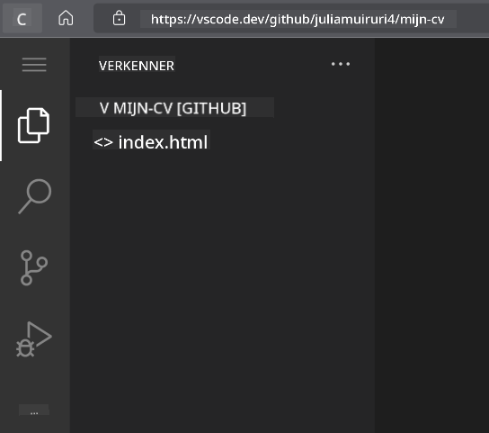
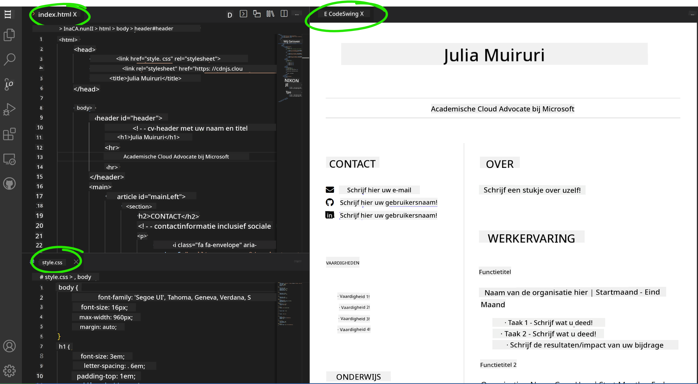

<!--
CO_OP_TRANSLATOR_METADATA:
{
  "original_hash": "effe56ba51c38d7bdfad1ea38288666b",
  "translation_date": "2025-10-23T00:49:50+00:00",
  "source_file": "8-code-editor/1-using-a-code-editor/assignment.md",
  "language_code": "nl"
}
-->
# Maak een CV-Website met VSCode.dev

Geef je carrière een boost door een professionele CV-website te bouwen die je vaardigheden en ervaring op een interactieve, moderne manier presenteert. In plaats van traditionele PDF's te versturen, kun je recruiters een strakke, responsieve website aanbieden die zowel je kwalificaties als je webontwikkelingsvaardigheden laat zien.

Deze praktische opdracht stelt je in staat om al je VSCode.dev-vaardigheden in de praktijk te brengen terwijl je iets creëert dat echt nuttig is voor je carrière. Je doorloopt het volledige webontwikkelingsproces – van het aanmaken van een repository tot het publiceren van je werk – allemaal vanuit je browser.

Na het voltooien van dit project heb je een professionele online aanwezigheid die je eenvoudig kunt delen met potentiële werkgevers, kunt bijwerken naarmate je vaardigheden groeien, en kunt aanpassen aan je persoonlijke merk. Dit is precies het soort praktisch project dat echte webontwikkelingsvaardigheden aantoont.

## Leerdoelen

Na het voltooien van deze opdracht kun je:

- **Een project maken** en beheren voor webontwikkeling met VSCode.dev
- **Een professionele website structureren** met semantische HTML-elementen
- **Responsieve lay-outs stylen** met moderne CSS-technieken
- **Interactieve functies implementeren** met basis webtechnologieën
- **Een live website publiceren** die toegankelijk is via een deelbare URL
- **Versiebeheer best practices demonstreren** gedurende het ontwikkelingsproces

## Vereisten

Voordat je aan deze opdracht begint, zorg ervoor dat je:

- Een GitHub-account hebt (maak er een aan op [github.com](https://github.com/) indien nodig)
- De VSCode.dev-les hebt voltooid over interface-navigatie en basisbewerkingen
- Basiskennis hebt van HTML-structuur en CSS-stylingconcepten

## Projectopzet en Repository-aanmaak

Laten we beginnen met het opzetten van de basis van je project. Dit proces weerspiegelt de werkelijke ontwikkelingsworkflows waarbij projecten beginnen met een goede initialisatie van de repository en het plannen van de structuur.

### Stap 1: Maak je GitHub-repository

Het opzetten van een toegewijde repository zorgt ervoor dat je project vanaf het begin goed georganiseerd en versiebeheer is.

1. **Ga naar** [GitHub.com](https://github.com) en log in op je account
2. **Klik op** de groene knop "New" of het "+"-icoon in de rechterbovenhoek
3. **Geef je repository een naam** zoals `mijn-cv` (of kies een persoonlijke naam zoals `jan-jansen-cv`)
4. **Voeg een korte beschrijving toe**: "Professionele CV-website gebouwd met HTML en CSS"
5. **Selecteer** "Public" om je CV toegankelijk te maken voor potentiële werkgevers
6. **Vink aan** "Add a README file" om een initiële projectbeschrijving te maken
7. **Klik op** "Create repository" om de setup te voltooien

> 💡 **Tip voor het benoemen van je repository**: Gebruik beschrijvende, professionele namen die duidelijk het doel van het project aangeven. Dit helpt bij het delen met werkgevers of tijdens portfolio-beoordelingen.

### Stap 2: Initialiseer de projectstructuur

Omdat VSCode.dev ten minste één bestand nodig heeft om een repository te openen, maken we ons hoofd-HTML-bestand direct op GitHub voordat we overschakelen naar de webeditor.

1. **Klik op** de link "creating a new file" in je nieuwe repository
2. **Typ** `index.html` als bestandsnaam
3. **Voeg** deze initiële HTML-structuur toe:

```html
<!DOCTYPE html>
<html lang="en">
<head>
    <meta charset="UTF-8">
    <meta name="viewport" content="width=device-width, initial-scale=1.0">
    <title>Your Name - Professional Resume</title>
</head>
<body>
    <h1>Your Name</h1>
    <p>Professional Resume Website</p>
</body>
</html>
```

4. **Schrijf** een commitbericht: "Voeg initiële HTML-structuur toe"
5. **Klik op** "Commit new file" om je wijzigingen op te slaan


**Wat deze initiële setup bereikt:**
- **Stelt** een correcte HTML5-documentstructuur in met semantische elementen
- **Bevat** een viewport meta-tag voor compatibiliteit met responsief ontwerp
- **Stelt** een beschrijvende paginatitel in die in browsertabbladen verschijnt
- **Creëert** de basis voor een professionele inhoudsorganisatie

## Werken in VSCode.dev

Nu de basis van je repository is opgezet, schakelen we over naar VSCode.dev voor het belangrijkste ontwikkelingswerk. Deze webgebaseerde editor biedt alle tools die nodig zijn voor professionele webontwikkeling.

### Stap 3: Open je project in VSCode.dev

1. **Ga naar** [vscode.dev](https://vscode.dev) in een nieuw browsertabblad
2. **Klik op** "Open Remote Repository" op het welkomstscherm
3. **Kopieer** de URL van je repository van GitHub en plak deze in het invoerveld

   Formaat: `https://github.com/jouw-gebruikersnaam/mijn-cv`
   
   *Vervang `jouw-gebruikersnaam` door je daadwerkelijke GitHub-gebruikersnaam*

4. **Druk op** Enter om je project te laden

✅ **Succesindicator**: Je zou je projectbestanden moeten zien in de Explorer-zijbalk en `index.html` beschikbaar voor bewerking in het hoofdeditorgebied.



**Wat je ziet in de interface:**
- **Explorer-zijbalk**: **Toont** je repository-bestanden en mapstructuur
- **Editorgebied**: **Laat** de inhoud van geselecteerde bestanden zien voor bewerking
- **Activiteitenbalk**: **Biedt** toegang tot functies zoals Source Control en Extensions
- **Statusbalk**: **Geeft** verbindingsstatus en informatie over de huidige branch weer

### Stap 4: Bouw je CV-inhoud

Vervang de tijdelijke inhoud in `index.html` door een uitgebreide CV-structuur. Deze HTML vormt de basis voor een professionele presentatie van je kwalificaties.

<details>
<summary><b>Volledige HTML CV-structuur</b></summary>

```html
<!DOCTYPE html>
<html lang="en">
<head>
    <meta charset="UTF-8">
    <meta name="viewport" content="width=device-width, initial-scale=1.0">
    <link href="style.css" rel="stylesheet">
    <link rel="stylesheet" href="https://cdnjs.cloudflare.com/ajax/libs/font-awesome/5.15.4/css/all.min.css">
    <title>Your Name - Professional Resume</title>
</head>
<body>
    <header id="header">
        <h1>Your Full Name</h1>
        <hr>
        <p class="role">Your Professional Title</p>
        <hr>
    </header>
    
    <main>
        <article id="mainLeft">
            <section>
                <h2>CONTACT</h2>
                <p>
                    <i class="fa fa-envelope" aria-hidden="true"></i>
                    <a href="mailto:your.email@domain.com">your.email@domain.com</a>
                </p>
                <p>
                    <i class="fab fa-github" aria-hidden="true"></i>
                    <a href="https://github.com/your-username">github.com/your-username</a>
                </p>
                <p>
                    <i class="fab fa-linkedin" aria-hidden="true"></i>
                    <a href="https://linkedin.com/in/your-profile">linkedin.com/in/your-profile</a>
                </p>
            </section>
            
            <section>
                <h2>SKILLS</h2>
                <ul>
                    <li>HTML5 & CSS3</li>
                    <li>JavaScript (ES6+)</li>
                    <li>Responsive Web Design</li>
                    <li>Version Control (Git)</li>
                    <li>Problem Solving</li>
                </ul>
            </section>
            
            <section>
                <h2>EDUCATION</h2>
                <h3>Your Degree or Certification</h3>
                <p>Institution Name</p>
                <p>Start Date - End Date</p>
            </section>
        </article>
        
        <article id="mainRight">
            <section>
                <h2>ABOUT</h2>
                <p>Write a compelling summary that highlights your passion for web development, key achievements, and career goals. This section should give employers insight into your personality and professional approach.</p>
            </section>
            
            <section>
                <h2>WORK EXPERIENCE</h2>
                <div class="job">
                    <h3>Job Title</h3>
                    <p class="company">Company Name | Start Date – End Date</p>
                    <ul>
                        <li>Describe a key accomplishment or responsibility</li>
                        <li>Highlight specific skills or technologies used</li>
                        <li>Quantify impact where possible (e.g., "Improved efficiency by 25%")</li>
                    </ul>
                </div>
                
                <div class="job">
                    <h3>Previous Job Title</h3>
                    <p class="company">Previous Company | Start Date – End Date</p>
                    <ul>
                        <li>Focus on transferable skills and achievements</li>
                        <li>Demonstrate growth and learning progression</li>
                        <li>Include any leadership or collaboration experiences</li>
                    </ul>
                </div>
            </section>
            
            <section>
                <h2>PROJECTS</h2>
                <div class="project">
                    <h3>Project Name</h3>
                    <p>Brief description of what the project accomplishes and technologies used.</p>
                    <a href="#" target="_blank">View Project</a>
                </div>
            </section>
        </article>
    </main>
</body>
</html>
```
</details>

**Richtlijnen voor aanpassing:**
- **Vervang** alle tijdelijke tekst door je eigen informatie
- **Pas** secties aan op basis van je ervaringsniveau en carrièrefocus
- **Voeg toe** of verwijder secties indien nodig (bijv. Certificeringen, Vrijwilligerswerk, Talen)
- **Voeg links toe** naar je eigen profielen en projecten

### Stap 5: Maak ondersteunende bestanden

Professionele websites vereisen georganiseerde bestandsstructuren. Maak het CSS-stylesheet en configuratiebestanden die nodig zijn voor een compleet project.

1. **Beweeg je muis** over de naam van je projectmap in de Explorer-zijbalk
2. **Klik op** het "Nieuw bestand"-icoon (📄+) dat verschijnt
3. **Maak** deze bestanden één voor één aan:
   - `style.css` (voor styling en lay-out)
   - `codeswing.json` (voor de configuratie van de preview-extensie)

**Het CSS-bestand maken (`style.css`):**

<details>
<summary><b>Professionele CSS-styling</b></summary>

```css
/* Modern Resume Styling */
body {
    font-family: 'Segoe UI', Tahoma, Geneva, Verdana, sans-serif;
    font-size: 16px;
    line-height: 1.6;
    max-width: 960px;
    margin: 0 auto;
    padding: 20px;
    color: #333;
    background-color: #f9f9f9;
}

/* Header Styling */
header {
    text-align: center;
    margin-bottom: 3em;
    padding: 2em;
    background: linear-gradient(135deg, #667eea 0%, #764ba2 100%);
    color: white;
    border-radius: 10px;
    box-shadow: 0 4px 6px rgba(0, 0, 0, 0.1);
}

h1 {
    font-size: 3em;
    letter-spacing: 0.1em;
    margin-bottom: 0.2em;
    font-weight: 300;
}

.role {
    font-size: 1.3em;
    font-weight: 300;
    margin: 1em 0;
}

/* Main Content Layout */
main {
    display: grid;
    grid-template-columns: 35% 65%;
    gap: 3em;
    margin-top: 3em;
    background: white;
    padding: 2em;
    border-radius: 10px;
    box-shadow: 0 2px 10px rgba(0, 0, 0, 0.1);
}

/* Typography */
h2 {
    font-size: 1.4em;
    font-weight: 600;
    margin-bottom: 1em;
    color: #667eea;
    border-bottom: 2px solid #667eea;
    padding-bottom: 0.3em;
}

h3 {
    font-size: 1.1em;
    font-weight: 600;
    margin-bottom: 0.5em;
    color: #444;
}

/* Section Styling */
section {
    margin-bottom: 2.5em;
}

#mainLeft {
    border-right: 1px solid #e0e0e0;
    padding-right: 2em;
}

/* Contact Links */
section a {
    color: #667eea;
    text-decoration: none;
    transition: color 0.3s ease;
}

section a:hover {
    color: #764ba2;
    text-decoration: underline;
}

/* Icons */
i {
    margin-right: 0.8em;
    width: 20px;
    text-align: center;
    color: #667eea;
}

/* Lists */
ul {
    list-style: none;
    padding-left: 0;
}

li {
    margin: 0.5em 0;
    padding: 0.3em 0;
    position: relative;
}

li:before {
    content: "▸";
    color: #667eea;
    margin-right: 0.5em;
}

/* Work Experience */
.job, .project {
    margin-bottom: 2em;
    padding-bottom: 1.5em;
    border-bottom: 1px solid #f0f0f0;
}

.company {
    font-style: italic;
    color: #666;
    margin-bottom: 0.5em;
}

/* Responsive Design */
@media (max-width: 768px) {
    main {
        grid-template-columns: 1fr;
        gap: 2em;
    }
    
    #mainLeft {
        border-right: none;
        border-bottom: 1px solid #e0e0e0;
        padding-right: 0;
        padding-bottom: 2em;
    }
    
    h1 {
        font-size: 2.2em;
    }
    
    body {
        padding: 10px;
    }
}

/* Print Styles */
@media print {
    body {
        background: white;
        color: black;
        font-size: 12pt;
    }
    
    header {
        background: none;
        color: black;
        box-shadow: none;
    }
    
    main {
        box-shadow: none;
    }
}
```
</details>

**Het configuratiebestand maken (`codeswing.json`):**

```json
{
    "scripts": [],
    "styles": []
}
```

**Begrip van de CSS-functies:**
- **Maakt gebruik van** CSS Grid voor een responsieve, professionele lay-outstructuur
- **Implementeert** moderne kleurenschema's met gradient headers
- **Bevat** hover-effecten en soepele overgangen voor interactiviteit
- **Biedt** een responsief ontwerp dat werkt op alle apparaatformaten
- **Voegt toe** printvriendelijke stijlen voor PDF-generatie

### Stap 6: Installeer en configureer extensies

Extensies verbeteren je ontwikkelervaring door live preview-mogelijkheden en verbeterde workflowtools te bieden. De CodeSwing-extensie is bijzonder handig voor webontwikkelingsprojecten.

**De CodeSwing-extensie installeren:**

1. **Klik op** het Extensies-icoon (🧩) in de activiteitenbalk
2. **Zoek** naar "CodeSwing" in het zoekvak van de marketplace
3. **Selecteer** de CodeSwing-extensie uit de zoekresultaten
4. **Klik op** de blauwe knop "Install"


**Wat CodeSwing biedt:**
- **Maakt** live preview van je website mogelijk terwijl je deze bewerkt
- **Toont** wijzigingen in real-time zonder handmatige verversing
- **Ondersteunt** meerdere bestandstypen, waaronder HTML, CSS en JavaScript
- **Biedt** een geïntegreerde ontwikkelomgeving

**Directe resultaten na installatie:**
Zodra CodeSwing is geïnstalleerd, zie je een live preview van je CV-website verschijnen in de editor. Hierdoor kun je precies zien hoe je site eruitziet terwijl je wijzigingen aanbrengt.



**Begrip van de verbeterde interface:**
- **Gesplitst scherm**: **Toont** je code aan de ene kant en een live preview aan de andere kant
- **Real-time updates**: **Geeft** wijzigingen direct weer terwijl je typt
- **Interactieve preview**: **Maakt** het mogelijk om links en interacties te testen
- **Mobiele simulatie**: **Biedt** testmogelijkheden voor responsief ontwerp

### Stap 7: Versiebeheer en publicatie

Nu je CV-website klaar is, gebruik je Git om je werk op te slaan en online beschikbaar te maken.

**Je wijzigingen committen:**

1. **Klik op** het Source Control-icoon (🌿) in de activiteitenbalk
2. **Bekijk** alle bestanden die je hebt gemaakt en gewijzigd in de sectie "Changes"
3. **Stage** je wijzigingen door op het "+"-icoon naast elk bestand te klikken
4. **Schrijf** een beschrijvend commitbericht, zoals:
   - "Voeg complete CV-website toe met responsief ontwerp"
   - "Implementeer professionele styling en inhoudsstructuur"
5. **Klik op** het vinkje (✓) om je wijzigingen te committen en te pushen

**Voorbeelden van effectieve commitberichten:**
- "Voeg professionele CV-inhoud en styling toe"
- "Implementeer responsief ontwerp voor mobiele compatibiliteit"
- "Update contactinformatie en projectlinks"

> 💡 **Professionele tip**: Goede commitberichten helpen bij het volgen van de evolutie van je project en tonen aandacht voor detail – kwaliteiten die werkgevers waarderen.

**Toegang tot je gepubliceerde site:**
Zodra je wijzigingen zijn gecommit, kun je terugkeren naar je GitHub-repository via het hamburgermenu (☰) in de linkerbovenhoek. Je CV-website is nu versiebeheer en klaar om te worden gepubliceerd of gedeeld.

## Resultaten en volgende stappen

**Gefeliciteerd! 🎉** Je hebt met succes een professionele CV-website gemaakt met VSCode.dev. Je project toont:
**Technische vaardigheden aangetoond:**
- **Repositorybeheer**: Een complete projectstructuur gemaakt en georganiseerd
- **Webontwikkeling**: Een responsieve website gebouwd met moderne HTML5 en CSS3
- **Versiebeheer**: Correcte Git-workflow geïmplementeerd met betekenisvolle commits
- **Toolvaardigheid**: Effectief gebruik gemaakt van de interface en extensies van VSCode.dev

**Professionele resultaten bereikt:**
- **Online aanwezigheid**: Een deelbare URL die je kwalificaties toont
- **Modern formaat**: Een interactieve alternatieve versie van traditionele PDF-CV's
- **Aantoonbare vaardigheden**: Concreet bewijs van je webontwikkelingsvaardigheden
- **Eenvoudige updates**: Een basis die je continu kunt verbeteren en aanpassen

### Publicatieopties

Om je CV toegankelijk te maken voor werkgevers, kun je deze hostingopties overwegen:

**GitHub Pages (Aanbevolen):**
1. Ga naar de instellingen van je repository op GitHub
2. Scroll naar de sectie "Pages"
3. Selecteer "Deploy from a branch" en kies "main"
4. Je site is beschikbaar op `https://jouw-gebruikersnaam.github.io/mijn-cv`

**Alternatieve platforms:**
- **Netlify**: Automatische publicatie met aangepaste domeinen
- **Vercel**: Snelle publicatie met moderne hostingfuncties
- **GitHub Codespaces**: Ontwikkelomgeving met ingebouwde preview

### Verbeteringssuggesties

Blijf je vaardigheden ontwikkelen door deze functies toe te voegen:

**Technische verbeteringen:**
- **JavaScript-interactiviteit**: Voeg vloeiende scroll-effecten of interactieve elementen toe
- **Donkere modus schakelaar**: Implementeer themawisseling voor gebruikersvoorkeur
- **Contactformulier**: Maak directe communicatie mogelijk met potentiële werkgevers
- **SEO-optimalisatie**: Voeg meta-tags en gestructureerde data toe voor betere zoekzichtbaarheid

**Inhoudelijke verbeteringen:**
- **Projectportfolio**: Link naar GitHub-repository's en live demonstraties
- **Visualisatie van vaardigheden**: Maak voortgangsbalken of vaardigheidsbeoordelingssystemen
- **Getuigenissen**: Voeg aanbevelingen van collega's of docenten toe
- **Blogintegratie**: Voeg een blogsectie toe om je leerproces te delen

## GitHub Copilot Agent Challenge 🚀

Gebruik de Agent-modus om de volgende uitdaging te voltooien:

**Beschrijving:** Verbeter je CV-website met geavanceerde functies die professionele webontwikkelingsvaardigheden en moderne ontwerpprincipes aantonen.

**Opdracht:** Bouw voort op je bestaande CV-website en implementeer deze geavanceerde functies:
1. Voeg een donkere/lichte thema-schakelaar toe met vloeiende overgangen
2. Maak een interactieve vaardighedensectie met geanimeerde voortgangsbalken
3. Implementeer een contactformulier met formuliervalidatie
4. Voeg een projectportfolio-sectie toe met hover-effecten en modale pop-ups
5. Voeg een blogsectie toe met minimaal 3 voorbeeldposts over je leerproces
6. Optimaliseer voor SEO met correcte meta-tags, gestructureerde data en prestaties
7. Publiceer de verbeterde site met GitHub Pages of Netlify
8. Documenteer alle nieuwe functies in je README.md met screenshots

Je verbeterde website moet blijk geven van meesterschap in moderne webontwikkelingspraktijken, waaronder responsief ontwerp, JavaScript-interactiviteit en professionele publicatieworkflows.

## Uitbreiding van de uitdaging

Klaar om je vaardigheden verder te ontwikkelen? Probeer deze geavanceerde uitdagingen:

**📱 Mobile-First Redesign:** Bouw je site volledig opnieuw met een mobile-first aanpak met CSS Grid en Flexbox

**🔍 SEO-optimalisatie:** Implementeer uitgebreide SEO, inclusief meta-tags, gestructureerde data en prestatieoptimalisatie

**🌐 Ondersteuning voor meerdere talen:** Voeg internationalisatiefuncties toe om meerdere talen te ondersteunen

**📊 Integratie van analytics:** Voeg Google Analytics toe om bezoekersbetrokkenheid te volgen en je inhoud te optimaliseren

**🚀 Prestatieoptimalisatie:** Behaal perfecte Lighthouse-scores in alle categorieën

## Review & Zelfstudie

Breid je kennis uit met deze bronnen:

**Geavanceerde VSCode.dev-functies:**
- [VSCode.dev Documentatie](https://code.visualstudio.com/docs/editor/vscode-web?WT.mc_id=academic-0000-alfredodeza) - Complete gids voor webgebaseerde bewerking
- [GitHub Codespaces](https://docs.github.com/en/codespaces) - Cloudontwikkelingsomgevingen

**Best practices voor webontwikkeling:**
- **Responsief ontwerp**: Bestudeer CSS Grid en Flexbox voor moderne lay-outs
- **Toegankelijkheid**: Leer de WCAG-richtlijnen voor inclusief webdesign  
- **Prestaties**: Ontdek tools zoals Lighthouse voor optimalisatie  
- **SEO**: Begrijp de basisprincipes van zoekmachineoptimalisatie  

**Professionele Ontwikkeling:**  
- **Portfolio opbouwen**: Maak extra projecten om diverse vaardigheden te tonen  
- **Open Source**: Draag bij aan bestaande projecten om ervaring op te doen met samenwerking  
- **Netwerken**: Deel je cv-website in ontwikkelaarsgemeenschappen voor feedback  
- **Continu leren**: Blijf op de hoogte van trends en technologieën in webontwikkeling  

---

**Je volgende stappen:** Deel je cv-website met vrienden, familie of mentoren voor feedback. Gebruik hun suggesties om je ontwerp te verbeteren. Onthoud, dit project is niet alleen een cv – het is een demonstratie van je groei als webontwikkelaar!

---

**Disclaimer**:  
Dit document is vertaald met behulp van de AI-vertalingsservice [Co-op Translator](https://github.com/Azure/co-op-translator). Hoewel we streven naar nauwkeurigheid, dient u zich ervan bewust te zijn dat geautomatiseerde vertalingen fouten of onnauwkeurigheden kunnen bevatten. Het originele document in de oorspronkelijke taal moet worden beschouwd als de gezaghebbende bron. Voor kritieke informatie wordt professionele menselijke vertaling aanbevolen. Wij zijn niet aansprakelijk voor eventuele misverstanden of verkeerde interpretaties die voortvloeien uit het gebruik van deze vertaling.