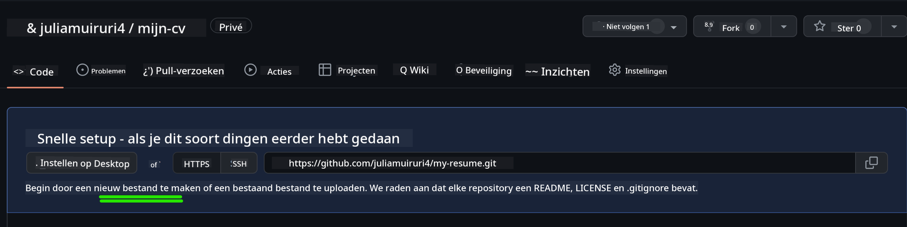

<!--
CO_OP_TRANSLATOR_METADATA:
{
  "original_hash": "2fcb983b8dbadadb1bc2e97f8c12dac5",
  "translation_date": "2025-08-27T20:41:38+00:00",
  "source_file": "8-code-editor/1-using-a-code-editor/assignment.md",
  "language_code": "nl"
}
-->
# Maak een cv-website met vscode.dev

_Hoe gaaf zou het zijn als een recruiter om je cv vraagt en je stuurt ze een url?_ 😎

<!----
TODO: voeg een optionele afbeelding toe

> Sketchnote door [Auteur naam](https://example.com)
---->

<!---
## Pre-Lecture Quiz
[Pre-lecture quiz](https://ashy-river-0debb7803.1.azurestaticapps.net/quiz/3)
---->

## Doelstellingen

Na deze opdracht leer je hoe je:

- Een website maakt om je cv te presenteren

### Vereisten

1. Een GitHub-account. Ga naar [GitHub](https://github.com/) en maak een account aan als je er nog geen hebt.

## Stappen

**Stap 1:** Maak een nieuwe GitHub-repository en geef deze de naam `my-resume`

**Stap 2** Maak een `index.html`-bestand in je repository. We voegen ten minste één bestand toe terwijl we nog op github.com zijn, omdat je geen lege repository kunt openen op vscode.dev.

Klik op de link `creating a new file`, typ de naam `index.html` en selecteer de knop `Commit new file`.



**Stap 3:** Open [VSCode.dev](https://vscode.dev) en selecteer de knop `Open Remote Repository`.

Kopieer de url van de repository die je zojuist hebt gemaakt voor je cv-website en plak deze in het invoerveld:

_Vervang `your-username` door je GitHub-gebruikersnaam_

```
https://github.com/your-username/my-resume
```

✅ Als het succesvol is, zie je je project en het index.html-bestand geopend in de teksteditor in de browser.


**Stap 4:** Open het `index.html`-bestand, plak de onderstaande code in je codegebied en sla op.

<details>
    <summary><b>HTML-code verantwoordelijk voor de inhoud van je cv-website.</b></summary>
    
        <html>

            <head>
                <link href="style.css" rel="stylesheet">
                <link rel="stylesheet" href="https://cdnjs.cloudflare.com/ajax/libs/font-awesome/5.15.4/css/all.min.css">
                <title>Jouw Naam Hier!</title>
            </head>
            <body>
                <header id="header">
                    <!-- cv-header met je naam en titel -->
                    <h1>Jouw Naam Hier!</h1>
                    <hr>
                    Jouw Rol!
                    <hr>
                </header>
                <main>
                    <article id="mainLeft">
                        <section>
                            <h2>CONTACT</h2>
                            <!-- contactinformatie inclusief sociale media -->
                            <p>
                                <i class="fa fa-envelope" aria-hidden="true"></i>
                                <a href="mailto:username@domain.top-level domain">Schrijf hier je e-mailadres</a>
                            </p>
                            <p>
                                <i class="fab fa-github" aria-hidden="true"></i>
                                <a href="github.com/yourGitHubUsername">Schrijf hier je gebruikersnaam!</a>
                            </p>
                            <p>
                                <i class="fab fa-linkedin" aria-hidden="true"></i>
                                <a href="linkedin.com/yourLinkedInUsername">Schrijf hier je gebruikersnaam!</a>
                            </p>
                        </section>
                        <section>
                            <h2>VAARDIGHEDEN</h2>
                            <!-- jouw vaardigheden -->
                            <ul>
                                <li>Vaardigheid 1!</li>
                                <li>Vaardigheid 2!</li>
                                <li>Vaardigheid 3!</li>
                                <li>Vaardigheid 4!</li>
                            </ul>
                        </section>
                        <section>
                            <h2>OPLEIDING</h2>
                            <!-- jouw opleiding -->
                            <h3>Schrijf hier je opleiding!</h3>
                            <p>
                                Schrijf hier je onderwijsinstelling!
                            </p>
                            <p>
                                Start - Einddatum
                            </p>
                        </section>            
                    </article>
                    <article id="mainRight">
                        <section>
                            <h2>OVER</h2>
                            <!-- over jou -->
                            <p>Schrijf een korte tekst over jezelf!</p>
                        </section>
                        <section>
                            <h2>WERKERVARING</h2>
                            <!-- jouw werkervaring -->
                            <h3>Functietitel</h3>
                            <p>
                                Naam van de organisatie | Startmaand – Eindmaand
                            </p>
                            <ul>
                                    <li>Taak 1 - Schrijf wat je hebt gedaan!</li>
                                    <li>Taak 2 - Schrijf wat je hebt gedaan!</li>
                                    <li>Schrijf de resultaten/impact van je bijdrage</li>
                                    
                            </ul>
                            <h3>Functietitel 2</h3>
                            <p>
                                Naam van de organisatie | Startmaand – Eindmaand
                            </p>
                            <ul>
                                    <li>Taak 1 - Schrijf wat je hebt gedaan!</li>
                                    <li>Taak 2 - Schrijf wat je hebt gedaan!</li>
                                    <li>Schrijf de resultaten/impact van je bijdrage</li>
                                    
                            </ul>
                        </section>
                    </article>
                </main>
            </body>
        </html>
</details>

Vervang de _placeholdertekst_ in de html-code door je cv-details.

**Stap 5:** Beweeg over de My-Resume-map, klik op het `New File ...`-icoon en maak 2 nieuwe bestanden in je project: `style.css` en `codeswing.json`.

**Stap 6:** Open het `style.css`-bestand, plak de onderstaande code en sla op.

<details>
        <summary><b>CSS-code om de lay-out van de site te formatteren.</b></summary>
            
            body {
                font-family: 'Segoe UI', Tahoma, Geneva, Verdana, sans-serif;
                font-size: 16px;
                max-width: 960px;
                margin: auto;
            }
            h1 {
                font-size: 3em;
                letter-spacing: .6em;
                padding-top: 1em;
                padding-bottom: 1em;
            }

            h2 {
                font-size: 1.5em;
                padding-bottom: 1em;
            }

            h3 {
                font-size: 1em;
                padding-bottom: 1em;
            }
            main { 
                display: grid;
                grid-template-columns: 40% 60%;
                margin-top: 3em;
            }
            header {
                text-align: center;
                margin: auto 2em;
            }

            section {
                margin: auto 1em 4em 2em;
            }

            i {
                margin-right: .5em;
            }

            p {
                margin: .2em auto
            }

            hr {
                border: none;
                background-color: lightgray;
                height: 1px;
            }

            h1, h2, h3 {
                font-weight: 100;
                margin-bottom: 0;
            }
            #mainLeft {
                border-right: 1px solid lightgray;
            }
            
</details>

**Stap 6:** Open het `codeswing.json`-bestand, plak de onderstaande code en sla op.

    {
    "scripts": [],
    "styles": []
    }

**Stap 7:** Installeer de `Codeswing-extensie` om de cv-website te visualiseren in het codegebied.

Klik op het _`Extensions`_-icoon in de activiteitenbalk en typ Codeswing. Klik op de _blauwe install-knop_ in de uitgebreide activiteitenbalk om te installeren of gebruik de install-knop die verschijnt in het codegebied zodra je de extensie selecteert om aanvullende informatie te laden. Direct na het installeren van de extensie zie je veranderingen in je project 😃


Dit is wat je ziet op je scherm nadat je de extensie hebt geïnstalleerd.


Als je tevreden bent met de veranderingen die je hebt aangebracht, beweeg over de `Changes`-map en klik op de `+`-knop om de veranderingen te stage-en.

Typ een commit-bericht _(Een beschrijving van de verandering die je hebt aangebracht in het project)_ en commit je veranderingen door op de `check` te klikken. Zodra je klaar bent met je project, selecteer je het hamburgermenu-icoon linksboven om terug te keren naar de repository op GitHub.

Gefeliciteerd 🎉 Je hebt zojuist je cv-website gemaakt met vscode.dev in een paar stappen.

## 🚀 Uitdaging

Open een remote repository waar je toestemming hebt om wijzigingen aan te brengen en werk enkele bestanden bij. Probeer vervolgens een nieuwe branch te maken met je wijzigingen en maak een Pull Request.

<!----
## Post-Lecture Quiz
[Post-lecture quiz](https://ashy-river-0debb7803.1.azurestaticapps.net/quiz/4)
---->

## Review & Zelfstudie

Lees meer over [VSCode.dev](https://code.visualstudio.com/docs/editor/vscode-web?WT.mc_id=academic-0000-alfredodeza) en enkele van de andere functies ervan.

---

**Disclaimer**:  
Dit document is vertaald met behulp van de AI-vertalingsservice [Co-op Translator](https://github.com/Azure/co-op-translator). Hoewel we streven naar nauwkeurigheid, dient u zich ervan bewust te zijn dat geautomatiseerde vertalingen fouten of onnauwkeurigheden kunnen bevatten. Het originele document in zijn oorspronkelijke taal moet worden beschouwd als de gezaghebbende bron. Voor cruciale informatie wordt professionele menselijke vertaling aanbevolen. Wij zijn niet aansprakelijk voor eventuele misverstanden of verkeerde interpretaties die voortvloeien uit het gebruik van deze vertaling.