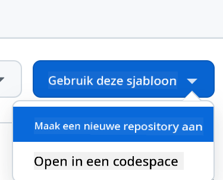

<!--
CO_OP_TRANSLATOR_METADATA:
{
  "original_hash": "002304ffe0059e55b33e2ee5283788ad",
  "translation_date": "2025-09-01T15:33:10+00:00",
  "source_file": "9-chat-project/README.md",
  "language_code": "nl"
}
-->
# Chatproject

Dit chatproject laat zien hoe je een Chat Assistent kunt bouwen met behulp van GitHub Models.

Hier is hoe het eindproject eruitziet:

<div>
  
</div>

Wat context: het bouwen van chatassistenten met generatieve AI is een geweldige manier om te beginnen met leren over AI. In deze les leer je hoe je generatieve AI integreert in een webapplicatie. Laten we beginnen.

## Verbinden met generatieve AI

Voor de backend gebruiken we GitHub Models. Dit is een geweldige dienst waarmee je gratis AI kunt gebruiken. Ga naar de playground en haal de code op die overeenkomt met de door jou gekozen backend-taal. Hier is hoe het eruitziet op [GitHub Models Playground](https://github.com/marketplace/models/azure-openai/gpt-4o-mini/playground)

<div>
  
</div>

Zoals gezegd, selecteer het tabblad "Code" en kies je runtime.

<div>
  
</div>

### Gebruik van Python

In dit geval kiezen we Python, wat betekent dat we deze code selecteren:

```python
"""Run this model in Python

> pip install openai
"""
import os
from openai import OpenAI

# To authenticate with the model you will need to generate a personal access token (PAT) in your GitHub settings. 
# Create your PAT token by following instructions here: https://docs.github.com/en/authentication/keeping-your-account-and-data-secure/managing-your-personal-access-tokens
client = OpenAI(
    base_url="https://models.github.ai/inference",
    api_key=os.environ["GITHUB_TOKEN"],
)

response = client.chat.completions.create(
    messages=[
        {
            "role": "system",
            "content": "",
        },
        {
            "role": "user",
            "content": "What is the capital of France?",
        }
    ],
    model="openai/gpt-4o-mini",
    temperature=1,
    max_tokens=4096,
    top_p=1
)

print(response.choices[0].message.content)
```

Laten we deze code een beetje opschonen zodat het herbruikbaar is:

```python
def call_llm(prompt: str, system_message: str):
    response = client.chat.completions.create(
        messages=[
            {
                "role": "system",
                "content": system_message,
            },
            {
                "role": "user",
                "content": prompt,
            }
        ],
        model="openai/gpt-4o-mini",
        temperature=1,
        max_tokens=4096,
        top_p=1
    )

    return response.choices[0].message.content
```

Met deze functie `call_llm` kunnen we nu een prompt en een systeemprompt doorgeven, en de functie retourneert het resultaat.

### AI Assistent aanpassen

Als je de AI-assistent wilt aanpassen, kun je specificeren hoe je wilt dat deze zich gedraagt door de systeemprompt als volgt in te vullen:

```python
call_llm("Tell me about you", "You're Albert Einstein, you only know of things in the time you were alive")
```

## Exposeer het via een Web API

Geweldig, we hebben het AI-gedeelte klaar. Laten we nu kijken hoe we dit kunnen integreren in een Web API. Voor de Web API kiezen we Flask, maar elk webframework zou geschikt moeten zijn. Hier is de code:

### Gebruik van Python

```python
# api.py
from flask import Flask, request, jsonify
from llm import call_llm
from flask_cors import CORS

app = Flask(__name__)
CORS(app)   # *   example.com

@app.route("/", methods=["GET"])
def index():
    return "Welcome to this API. Call POST /hello with 'message': 'my message' as JSON payload"


@app.route("/hello", methods=["POST"])
def hello():
    # get message from request body  { "message": "do this taks for me" }
    data = request.get_json()
    message = data.get("message", "")

    response = call_llm(message, "You are a helpful assistant.")
    return jsonify({
        "response": response
    })

if __name__ == "__main__":
    app.run(host="0.0.0.0", port=5000)
```

Hier maken we een Flask API en definiëren we een standaardroute "/" en "/chat". De laatste is bedoeld om door onze frontend te worden gebruikt om vragen door te geven.

Om *llm.py* te integreren, moeten we het volgende doen:

- Importeer de functie `call_llm`:

   ```python
   from llm import call_llm
   from flask import Flask, request
   ```

- Roep het aan vanuit de "/chat" route:

   ```python
   @app.route("/hello", methods=["POST"])
   def hello():
      # get message from request body  { "message": "do this taks for me" }
      data = request.get_json()
      message = data.get("message", "")

      response = call_llm(message, "You are a helpful assistant.")
      return jsonify({
         "response": response
      })
   ```

   Hier parseren we het binnenkomende verzoek om de eigenschap `message` uit de JSON-body te halen. Vervolgens roepen we de LLM aan met deze oproep:

   ```python
   response = call_llm(message, "You are a helpful assistant")

   # return the response as JSON
   return jsonify({
      "response": response 
   })
   ```

Geweldig, nu hebben we gedaan wat nodig is.

## Cors configureren

We moeten vermelden dat we iets als CORS hebben ingesteld, oftewel cross-origin resource sharing. Dit betekent dat, omdat onze backend en frontend op verschillende poorten draaien, we de frontend toegang moeten geven tot de backend.

### Gebruik van Python

Er is een stukje code in *api.py* dat dit instelt:

```python
from flask_cors import CORS

app = Flask(__name__)
CORS(app)   # *   example.com
```

Op dit moment is het ingesteld om "*" toe te staan, wat alle origins betekent, en dat is een beetje onveilig. We zouden dit moeten beperken zodra we naar productie gaan.

## Voer je project uit

Om je project uit te voeren, moet je eerst je backend starten en daarna je frontend.

### Gebruik van Python

Oké, we hebben *llm.py* en *api.py*. Hoe kunnen we dit laten werken met een backend? Er zijn twee dingen die we moeten doen:

- Installeer afhankelijkheden:

   ```sh
   cd backend
   python -m venv venv
   source ./venv/bin/activate

   pip install openai flask flask-cors openai
   ```

- Start de API

   ```sh
   python api.py
   ```

   Als je in Codespaces werkt, moet je naar Ports gaan in het onderste deel van de editor, er met de rechtermuisknop op klikken en "Port Visibility" selecteren en "Public" kiezen.

### Werk aan een frontend

Nu we een API hebben draaien, laten we een frontend maken. Een minimale frontend die we stap voor stap zullen verbeteren. Maak in een *frontend* map het volgende:

```text
backend/
frontend/
index.html
app.js
styles.css
```

Laten we beginnen met **index.html**:

```html
<html>
    <head>
        <link rel="stylesheet" href="styles.css">
    </head>
    <body>
      <form>
        <textarea id="messages"></textarea>
        <input id="input" type="text" />
        <button type="submit" id="sendBtn">Send</button>  
      </form>  
      <script src="app.js" />
    </body>
</html>    
```

Bovenstaande is het absolute minimum dat je nodig hebt om een chatvenster te ondersteunen. Het bestaat uit een tekstgebied waar berichten worden weergegeven, een invoerveld om berichten te typen en een knop om je bericht naar de backend te sturen. Laten we nu naar de JavaScript kijken in *app.js*.

**app.js**

```js
// app.js

(function(){
  // 1. set up elements  
  const messages = document.getElementById("messages");
  const form = document.getElementById("form");
  const input = document.getElementById("input");

  const BASE_URL = "change this";
  const API_ENDPOINT = `${BASE_URL}/hello`;

  // 2. create a function that talks to our backend
  async function callApi(text) {
    const response = await fetch(API_ENDPOINT, {
      method: "POST",
      headers: { "Content-Type": "application/json" },
      body: JSON.stringify({ message: text })
    });
    let json = await response.json();
    return json.response;
  }

  // 3. add response to our textarea
  function appendMessage(text, role) {
    const el = document.createElement("div");
    el.className = `message ${role}`;
    el.innerHTML = text;
    messages.appendChild(el);
  }

  // 4. listen to submit events
  form.addEventListener("submit", async(e) => {
    e.preventDefault();
   // someone clicked the button in the form
   
   // get input
   const text = input.value.trim();

   appendMessage(text, "user")

   // reset it
   input.value = '';

   const reply = await callApi(text);

   // add to messages
   appendMessage(reply, "assistant");

  })
})();
```

Laten we de code per sectie doornemen:

- 1) Hier halen we een referentie op naar alle elementen die we later in de code zullen gebruiken.
- 2) In deze sectie maken we een functie die de ingebouwde `fetch`-methode gebruikt om onze backend aan te roepen.
- 3) `appendMessage` helpt bij het toevoegen van reacties en wat jij als gebruiker typt.
- 4) Hier luisteren we naar het submit-event, lezen we het invoerveld, plaatsen we het bericht van de gebruiker in het tekstgebied, roepen we de API aan en renderen we de reactie in het tekstgebied.

Laten we nu naar de styling kijken. Hier kun je helemaal losgaan en het eruit laten zien zoals je wilt, maar hier zijn enkele suggesties:

**styles.css**

```
.message {
    background: #222;
    box-shadow: 0 0 0 10px orange;
    padding: 10px:
    margin: 5px;
}

.message.user {
    background: blue;
}

.message.assistant {
    background: grey;
} 
```

Met deze drie klassen kun je berichten verschillend stylen, afhankelijk van of ze van de assistent of van jou als gebruiker komen. Als je inspiratie wilt, bekijk dan de map `solution/frontend/styles.css`.

### Basis-URL wijzigen

Er is één ding dat we hier niet hebben ingesteld, en dat is `BASE_URL`. Dit is niet bekend totdat je backend is gestart. Om dit in te stellen:

- Als je de API lokaal uitvoert, moet het iets zijn als `http://localhost:5000`.
- Als je het in Codespaces uitvoert, zou het er ongeveer zo uitzien: "[naam]app.github.dev".

## Opdracht

Maak je eigen map *project* met inhoud zoals hieronder:

```text
project/
  frontend/
    index.html
    app.js
    styles.css
  backend/
    ...
```

Kopieer de inhoud van wat hierboven is uitgelegd, maar voel je vrij om het naar wens aan te passen.

## Oplossing

[Oplossing](./solution/README.md)

## Bonus

Probeer de persoonlijkheid van de AI-assistent te veranderen.

### Voor Python

Wanneer je `call_llm` aanroept in *api.py*, kun je het tweede argument wijzigen naar wat je wilt, bijvoorbeeld:

```python
call_llm(message, "You are Captain Picard")
```

### Frontend

Wijzig ook de CSS en tekst naar wens, dus breng wijzigingen aan in *index.html* en *styles.css*.

## Samenvatting

Geweldig, je hebt geleerd hoe je vanaf nul een persoonlijke assistent kunt maken met behulp van AI. We hebben dit gedaan met GitHub Models, een backend in Python en een frontend in HTML, CSS en JavaScript.

## Instellen met Codespaces

- Navigeer naar: [Web Dev For Beginners repo](https://github.com/microsoft/Web-Dev-For-Beginners)
- Maak een nieuwe repo van een template (zorg ervoor dat je bent ingelogd op GitHub) in de rechterbovenhoek:

    

- Zodra je in je repo bent, maak je een Codespace:

    

    Dit zou een omgeving moeten starten waarin je nu kunt werken.

---

**Disclaimer**:  
Dit document is vertaald met behulp van de AI-vertalingsservice [Co-op Translator](https://github.com/Azure/co-op-translator). Hoewel we streven naar nauwkeurigheid, dient u zich ervan bewust te zijn dat geautomatiseerde vertalingen fouten of onnauwkeurigheden kunnen bevatten. Het originele document in de oorspronkelijke taal moet worden beschouwd als de gezaghebbende bron. Voor cruciale informatie wordt professionele menselijke vertaling aanbevolen. Wij zijn niet aansprakelijk voor eventuele misverstanden of verkeerde interpretaties die voortvloeien uit het gebruik van deze vertaling.