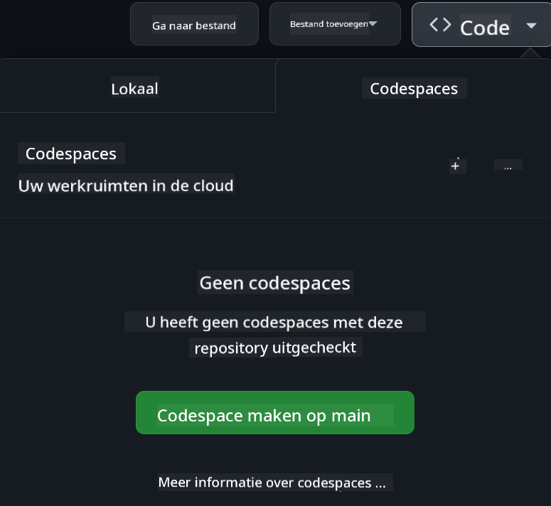

<!--
CO_OP_TRANSLATOR_METADATA:
{
  "original_hash": "3bea83a071750b68d3c8755f1155f805",
  "translation_date": "2025-10-03T10:07:05+00:00",
  "source_file": "README.md",
  "language_code": "nl"
}
-->
[](https://github.com/microsoft/Web-Dev-For-Beginners/blob/master/LICENSE)
[](https://GitHub.com/microsoft/Web-Dev-For-Beginners/graphs/contributors/)
[](https://GitHub.com/microsoft/Web-Dev-For-Beginners/issues/)
[](https://GitHub.com/microsoft/Web-Dev-For-Beginners/pulls/)
[](http://makeapullrequest.com)

[](https://GitHub.com/microsoft/Web-Dev-For-Beginners/watchers/)
[](https://GitHub.com/microsoft/Web-Dev-For-Beginners/network/)
[](https://GitHub.com/microsoft/Web-Dev-For-Beginners/stargazers/)

[](https://discord.gg/zxKYvhSnVp?WT.mc_id=academic-000002-leestott)

[](https://open.vscode.dev/microsoft/Web-Dev-For-Beginners)

[](https://discord.com/invite/ByRwuEEgH4)

Volg deze stappen om aan de slag te gaan met deze bronnen:
1. **Fork de repository**: Klik [](https://GitHub.com/microsoft/Web-Dev-For-Beginners/fork)
2. **Clone de repository**:   `git clone https://github.com/microsoft/Web-Dev-For-Beginners.git`
3. [**Word lid van de Azure AI Foundry Discord en ontmoet experts en mede-ontwikkelaars**](https://discord.com/invite/ByRwuEEgH4)

# Webontwikkeling voor beginners - Een curriculum

Leer de basisprincipes van webontwikkeling met onze uitgebreide 12-weekse cursus van Microsoft Cloud Advocates. Elke van de 24 lessen behandelt JavaScript, CSS en HTML via praktische projecten zoals terrariums, browserextensies en ruimtegames. Doe mee met quizzen, discussies en praktische opdrachten. Verhoog je vaardigheden en optimaliseer je kennisbehoud met onze effectieve projectgerichte aanpak. Begin vandaag nog met je codeerreis!

### 🌐 Ondersteuning voor meerdere talen

#### Ondersteund via GitHub Action (Automatisch & Altijd up-to-date)

[Frans](../fr/README.md) | [Spaans](../es/README.md) | [Duits](../de/README.md) | [Russisch](../ru/README.md) | [Arabisch](../ar/README.md) | [Perzisch (Farsi)](../fa/README.md) | [Urdu](../ur/README.md) | [Chinees (Vereenvoudigd)](../zh/README.md) | [Chinees (Traditioneel, Macau)](../mo/README.md) | [Chinees (Traditioneel, Hong Kong)](../hk/README.md) | [Chinees (Traditioneel, Taiwan)](../tw/README.md) | [Japans](../ja/README.md) | [Koreaans](../ko/README.md) | [Hindi](../hi/README.md) | [Bengaals](../bn/README.md) | [Marathi](../mr/README.md) | [Nepalees](../ne/README.md) | [Punjabi (Gurmukhi)](../pa/README.md) | [Portugees (Portugal)](../pt/README.md) | [Portugees (Brazilië)](../br/README.md) | [Italiaans](../it/README.md) | [Pools](../pl/README.md) | [Turks](../tr/README.md) | [Grieks](../el/README.md) | [Thais](../th/README.md) | [Zweeds](../sv/README.md) | [Deens](../da/README.md) | [Noors](../no/README.md) | [Fins](../fi/README.md) | [Nederlands](./README.md) | [Hebreeuws](../he/README.md) | [Vietnamees](../vi/README.md) | [Indonesisch](../id/README.md) | [Maleis](../ms/README.md) | [Tagalog (Filipino)](../tl/README.md) | [Swahili](../sw/README.md) | [Hongaars](../hu/README.md) | [Tsjechisch](../cs/README.md) | [Slowaaks](../sk/README.md) | [Roemeens](../ro/README.md) | [Bulgaars](../bg/README.md) | [Servisch (Cyrillisch)](../sr/README.md) | [Kroatisch](../hr/README.md) | [Sloveens](../sl/README.md) | [Oekraïens](../uk/README.md) | [Birmaans (Myanmar)](../my/README.md)

**Als je wilt dat er extra vertalingen worden ondersteund, staan de beschikbare talen [hier](https://github.com/Azure/co-op-translator/blob/main/getting_started/supported-languages.md)**

#### 🧑‍🎓 _Ben je een student?_

Bezoek [**Student Hub-pagina**](https://docs.microsoft.com/learn/student-hub/?WT.mc_id=academic-77807-sagibbon) waar je bronnen voor beginners, studentpakketten en zelfs manieren vindt om een gratis certificaatvoucher te krijgen. Dit is de pagina die je wilt bookmarken en af en toe wilt controleren, omdat we maandelijks inhoud wisselen.

### 📣 Aankondiging - _Nieuw project om te bouwen met Generatieve AI_

Nieuw AI-assistentproject net toegevoegd, bekijk het [project](./09-chat-project/README.md)

### 📣 Aankondiging - _Nieuw curriculum_ over Generatieve AI voor JavaScript is net uitgebracht

Mis ons nieuwe curriculum over Generatieve AI niet!

Bezoek [https://aka.ms/genai-js-course](https://aka.ms/genai-js-course) om aan de slag te gaan!


- Lessen die alles behandelen, van basisprincipes tot RAG.
- Interactie met historische personages met GenAI en onze begeleidende app.
- Leuk en boeiend verhaal, je zult tijdreizen!


Elke les bevat een opdracht om te voltooien, een kennischeck en een uitdaging om je te begeleiden bij het leren van onderwerpen zoals:
- Prompting en prompt engineering
- Tekst- en afbeeldingsapp-generatie
- Zoekapps

Bezoek [https://aka.ms/genai-js-course](../../[https:/aka.ms/genai-js-course) om aan de slag te gaan!


## 🌱 Aan de slag

> **Docenten**, we hebben [enkele suggesties opgenomen](for-teachers.md) over hoe je dit curriculum kunt gebruiken. We horen graag je feedback [in ons discussieforum](https://github.com/microsoft/Web-Dev-For-Beginners/discussions/categories/teacher-corner)!

**[Leerlingen](https://aka.ms/student-page/?WT.mc_id=academic-77807-sagibbon)**, begin voor elke les met een quiz voorafgaand aan de les en ga verder met het lezen van het lesmateriaal, het voltooien van de verschillende activiteiten en controleer je begrip met de quiz na de les.

Om je leerervaring te verbeteren, kun je samenwerken met je medestudenten aan de projecten! Discussies worden aangemoedigd in ons [discussieforum](https://github.com/microsoft/Web-Dev-For-Beginners/discussions) waar ons team van moderators beschikbaar zal zijn om je vragen te beantwoorden.

Om je opleiding verder te ontwikkelen, raden we aan om [Microsoft Learn](https://learn.microsoft.com/users/wirelesslife/collections/p1ddcy5jwy0jkm?WT.mc_id=academic-77807-sagibbon) te verkennen voor aanvullende studiematerialen.

### 📋 Je omgeving instellen

Dit curriculum heeft een ontwikkelomgeving die klaar is voor gebruik! Als je begint, kun je ervoor kiezen om het curriculum te draaien in een [Codespace](https://github.com/features/codespaces/) (_een browsergebaseerde omgeving zonder installatie_), of lokaal op je computer met een teksteditor zoals [Visual Studio Code](https://code.visualstudio.com/?WT.mc_id=academic-77807-sagibbon).

#### Maak je repository
Om je werk eenvoudig op te slaan, raden we aan om je eigen kopie van deze repository te maken. Dit kun je doen door op de knop **Use this template** bovenaan de pagina te klikken. Dit maakt een nieuwe repository in je GitHub-account met een kopie van het curriculum.

Volg deze stappen:
1. **Fork de repository**: Klik op de knop "Fork" rechtsboven op deze pagina.
2. **Clone de repository**:   `git clone https://github.com/microsoft/Web-Dev-For-Beginners.git`

#### Het curriculum draaien in een Codespace

In je kopie van deze repository die je hebt gemaakt, klik op de knop **Code** en selecteer **Open with Codespaces**. Dit maakt een nieuwe Codespace waarin je kunt werken.



#### Het curriculum lokaal draaien op je computer

Om dit curriculum lokaal op je computer te draaien, heb je een teksteditor, een browser en een commandoregeltool nodig. Onze eerste les, [Introductie tot programmeertalen en tools](../../1-getting-started-lessons/1-intro-to-programming-languages), begeleidt je door verschillende opties voor elk van deze tools zodat je kunt kiezen wat het beste bij je past.

Onze aanbeveling is om [Visual Studio Code](https://code.visualstudio.com/?WT.mc_id=academic-77807-sagibbon) te gebruiken als je editor, die ook een ingebouwde [Terminal](https://code.visualstudio.com/docs/terminal/basics/?WT.mc_id=academic-77807-sagibbon) heeft. Je kunt Visual Studio Code [hier downloaden](https://code.visualstudio.com/?WT.mc_id=academic-77807-sagibbon).

1. Clone je repository naar je computer. Dit kun je doen door op de knop **Code** te klikken en de URL te kopiëren:

    [CodeSpace](./images/createcodespace.png)

    Open vervolgens [Terminal](https://code.visualstudio.com/docs/terminal/basics/?WT.mc_id=academic-77807-sagibbon) binnen [Visual Studio Code](https://code.visualstudio.com/?WT.mc_id=academic-77807-sagibbon) en voer het volgende commando uit, waarbij je `<your-repository-url>` vervangt door de URL die je net hebt gekopieerd:

    ```bash 
    git clone <your-repository-url>
    ```

2. Open de map in Visual Studio Code. Dit kun je doen door te klikken op **File** > **Open Folder** en de map te selecteren die je net hebt gekloond.

>  Aanbevolen Visual Studio Code-extensies:
>
> * [Live Server](https://marketplace.visualstudio.com/items?itemName=ritwickdey.LiveServer&WT.mc_id=academic-77807-sagibbon) - om HTML-pagina's te bekijken binnen Visual Studio Code
> * [Copilot](https://marketplace.visualstudio.com/items?itemName=GitHub.copilot&WT.mc_id=academic-77807-sagibbon) - om je te helpen sneller code te schrijven

## 📂 Elke les bevat:

- optionele sketchnote
- optionele aanvullende video
- opwarmquiz voorafgaand aan de les
- geschreven les
- voor projectgerichte lessen, stapsgewijze handleidingen over hoe je het project bouwt
- kennischecks
- een uitdaging
- aanvullende lectuur
- opdracht
- [quiz na de les](https://ff-quizzes.netlify.app/web/)
> **Een opmerking over quizzen**: Alle quizzen bevinden zich in de Quiz-app map, in totaal 48 quizzen met elk drie vragen. Ze zijn beschikbaar [hier](https://ff-quizzes.netlify.app/web/). De quiz-app kan lokaal worden uitgevoerd of worden gedeployed naar Azure; volg de instructies in de `quiz-app` map.

## 🗃️ Lessen

|     |                       Projectnaam                       |                            Geleerde concepten                             | Leerdoelen                                                                                                                         |                                                         Gelinkte les                                                          |         Auteur          |
| :-: | :------------------------------------------------------: | :--------------------------------------------------------------------: | ----------------------------------------------------------------------------------------------------------------------------------- | :----------------------------------------------------------------------------------------------------------------------------: | :---------------------: |
| 01  |                     Aan de slag                      |           Introductie tot programmeren en tools van het vak           | Leer de basisprincipes achter de meeste programmeertalen en over software die professionele ontwikkelaars helpt bij hun werk        | [Introductie tot programmeertalen en tools van het vak](./1-getting-started-lessons/1-intro-to-programming-languages/README.md) |         Jasmine         |
| 02  |                     Aan de slag                      |             Basisprincipes van GitHub, inclusief werken in een team             | Hoe GitHub te gebruiken in je project, hoe samen te werken met anderen aan een codebase                                            |                            [Introductie tot GitHub](./1-getting-started-lessons/2-github-basics/README.md)                             |          Floor          |
| 03  |                     Aan de slag                      |                             Toegankelijkheid                              | Leer de basisprincipes van webtoegankelijkheid                                                                                     |                       [Basisprincipes van toegankelijkheid](./1-getting-started-lessons/3-accessibility/README.md)                       |       Christopher       |
| 04  |                        JS Basis                         |                         JavaScript Datatypes                          | De basisprincipes van JavaScript datatypes                                                                                         |                                       [Datatypes](./2-js-basics/1-data-types/README.md)                                        |         Jasmine         |
| 05  |                        JS Basis                         |                         Functies en Methoden                          | Leer over functies en methoden om de logische stroom van een applicatie te beheren                                                 |                              [Functies en Methoden](./2-js-basics/2-functions-methods/README.md)                               | Jasmine en Christopher |
| 06  |                        JS Basis                         |                        Beslissingen maken met JS                        | Leer hoe je voorwaarden in je code kunt maken met behulp van besluitvormingsmethoden                                               |                                 [Beslissingen maken](./2-js-basics/3-making-decisions/README.md)                                  |         Jasmine         |
| 07  |                        JS Basis                         |                            Arrays en Lussen                            | Werk met data met behulp van arrays en lussen in JavaScript                                                                        |                                   [Arrays en Lussen](./2-js-basics/4-arrays-loops/README.md)                                    |         Jasmine         |
| 08  |       [Terrarium](./3-terrarium/solution/README.md)       |                            HTML in de praktijk                            | Bouw de HTML om een online terrarium te maken, met de focus op het bouwen van een layout                                           |                                 [Introductie tot HTML](./3-terrarium/1-intro-to-html/README.md)                                 |           Jen           |
| 09  |       [Terrarium](./3-terrarium/solution/README.md)       |                            CSS in de praktijk                             | Bouw de CSS om het online terrarium te stylen, met de focus op de basisprincipes van CSS, inclusief het responsief maken van de pagina |                                  [Introductie tot CSS](./3-terrarium/2-intro-to-css/README.md)                                  |           Jen           |
| 10  |            [Terrarium](./3-terrarium/solution/README.md)            |                 JavaScript Closures, DOM-manipulatie                  | Bouw de JavaScript om het terrarium te laten functioneren als een drag/drop interface, met de focus op closures en DOM-manipulatie |                  [JavaScript Closures, DOM-manipulatie](./3-terrarium/3-intro-to-DOM-and-closures/README.md)                   |           Jen           |
| 11  |          [Typingspel](./4-typing-game/solution/README.md)          |                          Bouw een Typingspel                           | Leer hoe je toetsenbordgebeurtenissen kunt gebruiken om de logica van je JavaScript-app aan te sturen                              |                                [Event-Driven Programming](./4-typing-game/typing-game/README.md)                                |       Christopher       |
| 12  | [Groene Browserextensie](./5-browser-extension/solution/README.md) |                         Werken met Browsers                          | Leer hoe browsers werken, hun geschiedenis, en hoe je de eerste elementen van een browserextensie kunt opzetten                   |                               [Over Browsers](./5-browser-extension/1-about-browsers/README.md)                                |           Jen           |
| 13  | [Groene Browserextensie](./5-browser-extension/solution/README.md) | Bouw een formulier, roep een API aan en sla variabelen op in lokale opslag | Bouw de JavaScript-elementen van je browserextensie om een API aan te roepen met variabelen die zijn opgeslagen in lokale opslag   |                [API's, Formulieren, en Lokale Opslag](./5-browser-extension/2-forms-browsers-local-storage/README.md)                 |           Jen           |
| 14  | [Groene Browserextensie](./5-browser-extension/solution/README.md) |          Achtergrondprocessen in de browser, webprestaties          | Gebruik de achtergrondprocessen van de browser om het pictogram van de extensie te beheren; leer over webprestaties en enkele optimalisaties |             [Achtergrondtaken en Prestaties](./5-browser-extension/3-background-tasks-and-performance/README.md)              |           Jen           |
| 15  |           [Ruimtespel](./6-space-game/solution/README.md)           |             Meer Geavanceerde Spelontwikkeling met JavaScript             | Leer over Inheritance met zowel Classes als Composition en het Pub/Sub-patroon, ter voorbereiding op het bouwen van een spel       |                      [Introductie tot Geavanceerde Spelontwikkeling](./6-space-game/1-introduction/README.md)                       |          Chris          |
| 16  |           [Ruimtespel](./6-space-game/solution/README.md)           |                           Tekenen op canvas                            | Leer over de Canvas API, gebruikt om elementen op een scherm te tekenen                                                            |                                [Tekenen op Canvas](./6-space-game/2-drawing-to-canvas/README.md)                                |          Chris          |
| 17  |           [Ruimtespel](./6-space-game/solution/README.md)           |                   Elementen over het scherm bewegen                    | Ontdek hoe elementen beweging kunnen krijgen met behulp van cartesiaanse coördinaten en de Canvas API                              |                           [Elementen Bewegen](./6-space-game/3-moving-elements-around/README.md)                           |          Chris          |
| 18  |           [Ruimtespel](./6-space-game/solution/README.md)           |                          Botsingsdetectie                           | Laat elementen botsen en op elkaar reageren met behulp van toetsen en bied een cooldown-functie om de prestaties van het spel te waarborgen |                              [Botsingsdetectie](./6-space-game/4-collision-detection/README.md)                              |          Chris          |
| 19  |           [Ruimtespel](./6-space-game/solution/README.md)           |                             Score bijhouden                              | Voer wiskundige berekeningen uit op basis van de status en prestaties van het spel                                                 |                                    [Score Bijhouden](./6-space-game/5-keeping-score/README.md)                                    |          Chris          |
| 20  |           [Ruimtespel](./6-space-game/solution/README.md)           |                     Het spel beëindigen en opnieuw starten                     | Leer hoe je het spel kunt beëindigen en opnieuw starten, inclusief het opruimen van assets en het resetten van variabele waarden   |                                [De Eindconditie](./6-space-game/6-end-condition/README.md)                                 |          Chris          |
| 21  |         [Bankapp](./7-bank-project/solution/README.md)          |                 HTML Templates en Routes in een Webapp                 | Leer hoe je de structuur van een meerpagina-website kunt opzetten met routing en HTML-templates                                    |                            [HTML Templates en Routes](./7-bank-project/1-template-route/README.md)                             |          Yohan          |
| 22  |         [Bankapp](./7-bank-project/solution/README.md)          |                  Bouw een Login- en Registratieformulier                   | Leer hoe je formulieren bouwt en validatieroutines afhandelt                                                                       |                                           [Formulieren](./7-bank-project/2-forms/README.md)                                           |          Yohan          |
| 23  |         [Bankapp](./7-bank-project/solution/README.md)          |                   Methoden voor het ophalen en gebruiken van data                   | Hoe data in en uit je app stroomt, hoe je het ophaalt, opslaat en verwijdert                                                       |                                            [Data](./7-bank-project/3-data/README.md)                                            |          Yohan          |
| 24  |         [Bankapp](./7-bank-project/solution/README.md)          |                      Concepten van State Management                      | Leer hoe je app de staat behoudt en hoe je deze programmatisch kunt beheren                                                        |                                [State Management](./7-bank-project/4-state-management/README.md)                                |          Yohan          |
| 25 | [Browser/VScode Code](../../8-code-editor) | Werken met VScode | Leer hoe je een code-editor gebruikt | [Gebruik VScode Code Editor](./8-code-editor/1-using-a-code-editor/README.md) | Chris |
| 26 | [AI Assistenten](./9-chat-project/README.md) | Werken met AI | Leer hoe je je eigen AI-assistent bouwt | [AI Assistent Project](./9-chat-project/README.md) | Chris |

## 🏫 Pedagogiek

Ons curriculum is ontworpen met twee belangrijke pedagogische principes in gedachten:
* projectgebaseerd leren
* frequente quizzen

Het programma leert de basisprincipes van JavaScript, HTML en CSS, evenals de nieuwste tools en technieken die door moderne webontwikkelaars worden gebruikt. Studenten krijgen de kans om praktische ervaring op te doen door een typingspel, virtueel terrarium, milieuvriendelijke browserextensie, ruimte-invader-stijl spel en een bankapp voor bedrijven te bouwen. Aan het einde van de serie hebben studenten een solide begrip van webontwikkeling.

> 🎓 Je kunt de eerste paar lessen in dit curriculum volgen als een [Leerpad](https://docs.microsoft.com/learn/paths/web-development-101/?WT.mc_id=academic-77807-sagibbon) op Microsoft Learn!

Door ervoor te zorgen dat de inhoud aansluit bij projecten, wordt het proces boeiender voor studenten en wordt het begrip van concepten versterkt. We hebben ook enkele startlessen geschreven over de basisprincipes van JavaScript om concepten te introduceren, gecombineerd met een video uit de "[Beginners Series to: JavaScript](https://channel9.msdn.com/Series/Beginners-Series-to-JavaScript/?WT.mc_id=academic-77807-sagibbon)" collectie van videotutorials, waarvan sommige auteurs hebben bijgedragen aan dit curriculum.

Daarnaast zorgt een laagdrempelige quiz vóór een les ervoor dat de student zich richt op het leren van een onderwerp, terwijl een tweede quiz na de les verdere retentie garandeert. Dit curriculum is ontworpen om flexibel en leuk te zijn en kan in zijn geheel of gedeeltelijk worden gevolgd. De projecten beginnen klein en worden steeds complexer tegen het einde van de 12-weekse cyclus.

Hoewel we bewust hebben vermeden om JavaScript-frameworks te introduceren om ons te concentreren op de basisvaardigheden die nodig zijn als webontwikkelaar voordat een framework wordt aangenomen, zou een goede volgende stap na het voltooien van dit curriculum zijn om meer te leren over Node.js via een andere collectie video's: "[Beginner Series to: Node.js](https://channel9.msdn.com/Series/Beginners-Series-to-Nodejs/?WT.mc_id=academic-77807-sagibbon)".

> Bezoek onze [Gedragscode](CODE_OF_CONDUCT.md) en [Bijdragen](CONTRIBUTING.md) richtlijnen. We verwelkomen je constructieve feedback!


## 🧭 Offline toegang

Je kunt deze documentatie offline uitvoeren met behulp van [Docsify](https://docsify.js.org/#/). Fork deze repo, [installeer Docsify](https://docsify.js.org/#/quickstart) op je lokale machine, en typ vervolgens in de rootmap van deze repo `docsify serve`. De website wordt geserveerd op poort 3000 op je localhost: `localhost:3000`.

## 📘 PDF

Een PDF van alle lessen is te vinden [hier](https://microsoft.github.io/Web-Dev-For-Beginners/pdf/readme.pdf).


## 🎒 Andere cursussen

Ons team produceert andere cursussen! Bekijk:

- [Generatieve AI voor Beginners](https://aka.ms/genai-beginners)
- [Generatieve AI voor Beginners .NET](https://github.com/microsoft/Generative-AI-for-beginners-dotnet)
- [Generatieve AI met JavaScript](https://github.com/microsoft/generative-ai-with-javascript)
- [Generatieve AI met Java](https://github.com/microsoft/Generative-AI-for-beginners-java)
- [AI voor Beginners](https://aka.ms/ai-beginners)
- [Data Science voor Beginners](https://aka.ms/datascience-beginners)
- [ML voor Beginners](https://aka.ms/ml-beginners)
- [Cybersecurity voor Beginners](https://github.com/microsoft/Security-101)
- [Webontwikkeling voor Beginners](https://aka.ms/webdev-beginners)
- [IoT voor Beginners](https://aka.ms/iot-beginners)
- [XR Ontwikkeling voor Beginners](https://github.com/microsoft/xr-development-for-beginners)
- [Mastering GitHub Copilot voor Agentic gebruik](https://github.com/microsoft/Mastering-GitHub-Copilot-for-Paired-Programming)
- [Mastering GitHub Copilot voor C#/.NET Ontwikkelaars](https://github.com/microsoft/mastering-github-copilot-for-dotnet-csharp-developers)
- [Kies Je Eigen Copilot Avontuur](https://github.com/microsoft/CopilotAdventures)

## Hulp Krijgen

Als je vastloopt of vragen hebt over het bouwen van AI-apps, sluit je aan bij:

[](https://aka.ms/foundry/discord)

Als je feedback over het product hebt of fouten tegenkomt tijdens het bouwen, bezoek dan:

[](https://aka.ms/foundry/forum)

## Licentie

Deze repository valt onder de MIT-licentie. Zie het [LICENSE](../../LICENSE) bestand voor meer informatie.

---

**Disclaimer**:  
Dit document is vertaald met behulp van de AI-vertalingsservice [Co-op Translator](https://github.com/Azure/co-op-translator). Hoewel we streven naar nauwkeurigheid, dient u zich ervan bewust te zijn dat geautomatiseerde vertalingen fouten of onnauwkeurigheden kunnen bevatten. Het originele document in de oorspronkelijke taal moet worden beschouwd als de gezaghebbende bron. Voor cruciale informatie wordt professionele menselijke vertaling aanbevolen. Wij zijn niet aansprakelijk voor misverstanden of verkeerde interpretaties die voortvloeien uit het gebruik van deze vertaling.