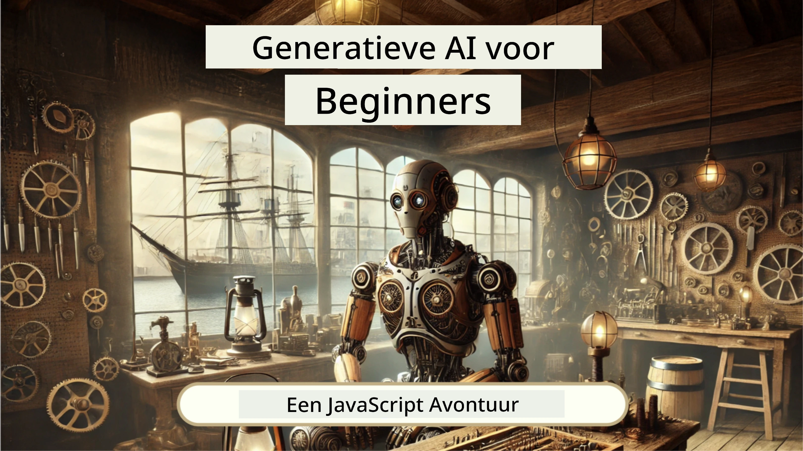
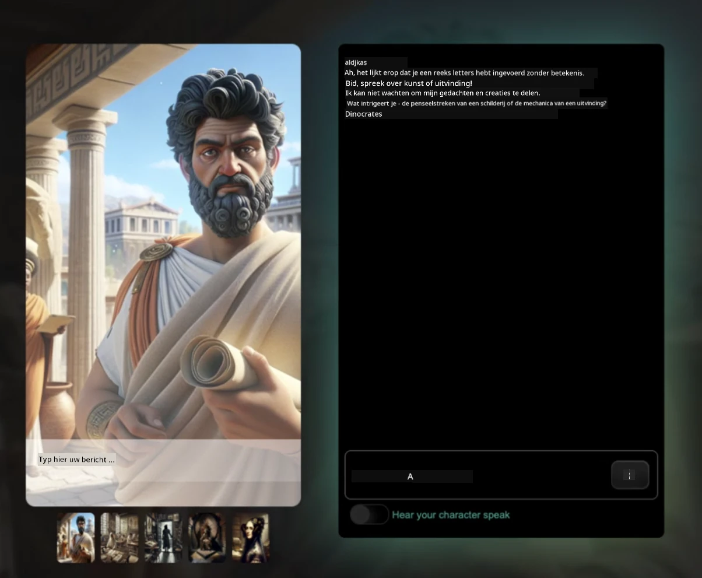
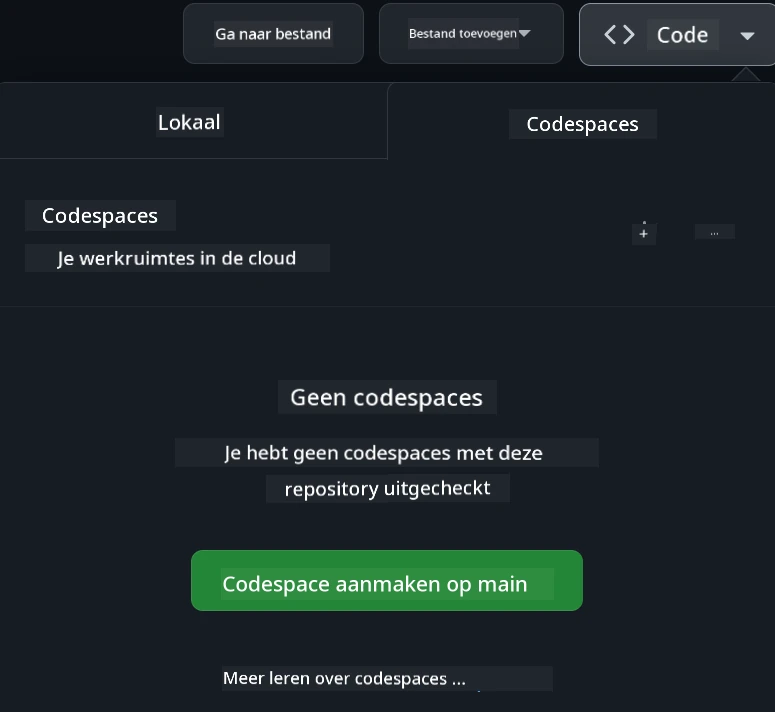

# Webontwikkeling voor Beginners - Een Curriculum

Leer de basisprincipes van webontwikkeling met onze 12-weekse uitgebreide cursus van Microsoft Cloud Advocates. Elk van de 24 lessen duikt in JavaScript, CSS en HTML door middel van praktijkprojecten zoals terraria, browserextensies en spacegames. Doe mee met quizzen, discussies en praktische opdrachten. Verhoog je vaardigheden en optimaliseer je kennisbehoud met onze effectieve project-gebaseerde leerwijze. Begin vandaag nog met coderen!

Word lid van de Azure AI Foundry Discord Community

Volg deze stappen om aan de slag te gaan met deze bronnen:
1. **Fork de repository**: Klik [](https://GitHub.com/microsoft/Web-Dev-For-Beginners/fork)
2. **Clone de repository**:   `git clone https://github.com/microsoft/Web-Dev-For-Beginners.git`
3. [**Word lid van de Azure AI Foundry Discord en ontmoet experts en mede-ontwikkelaars**](https://discord.com/invite/ByRwuEEgH4)

### 🌐 Meertalige Ondersteuning

#### Ondersteund via GitHub Action (geautomatiseerd & altijd up-to-date)

<!-- CO-OP TRANSLATOR LANGUAGES TABLE START -->
[Arabic](../ar/README.md) | [Bengali](../bn/README.md) | [Bulgarian](../bg/README.md) | [Burmese (Myanmar)](../my/README.md) | [Chinese (Simplified)](../zh-CN/README.md) | [Chinese (Traditional, Hong Kong)](../zh-HK/README.md) | [Chinese (Traditional, Macau)](../zh-MO/README.md) | [Chinese (Traditional, Taiwan)](../zh-TW/README.md) | [Croatian](../hr/README.md) | [Czech](../cs/README.md) | [Danish](../da/README.md) | [Dutch](./README.md) | [Estonian](../et/README.md) | [Finnish](../fi/README.md) | [French](../fr/README.md) | [German](../de/README.md) | [Greek](../el/README.md) | [Hebrew](../he/README.md) | [Hindi](../hi/README.md) | [Hungarian](../hu/README.md) | [Indonesian](../id/README.md) | [Italian](../it/README.md) | [Japanese](../ja/README.md) | [Kannada](../kn/README.md) | [Korean](../ko/README.md) | [Lithuanian](../lt/README.md) | [Malay](../ms/README.md) | [Malayalam](../ml/README.md) | [Marathi](../mr/README.md) | [Nepali](../ne/README.md) | [Nigerian Pidgin](../pcm/README.md) | [Norwegian](../no/README.md) | [Persian (Farsi)](../fa/README.md) | [Polish](../pl/README.md) | [Portuguese (Brazil)](../pt-BR/README.md) | [Portuguese (Portugal)](../pt-PT/README.md) | [Punjabi (Gurmukhi)](../pa/README.md) | [Romanian](../ro/README.md) | [Russian](../ru/README.md) | [Serbian (Cyrillic)](../sr/README.md) | [Slovak](../sk/README.md) | [Slovenian](../sl/README.md) | [Spanish](../es/README.md) | [Swahili](../sw/README.md) | [Swedish](../sv/README.md) | [Tagalog (Filipino)](../tl/README.md) | [Tamil](../ta/README.md) | [Telugu](../te/README.md) | [Thai](../th/README.md) | [Turkish](../tr/README.md) | [Ukrainian](../uk/README.md) | [Urdu](../ur/README.md) | [Vietnamese](../vi/README.md)

> **Lievere lokaal clonen?**

> Deze repository bevat meer dan 50 taalvertalingen die de downloadgrootte aanzienlijk vergroten. Om zonder vertalingen te clonen, gebruik sparse checkout:
> ```bash
> git clone --filter=blob:none --sparse https://github.com/microsoft/Web-Dev-For-Beginners.git
> cd Web-Dev-For-Beginners
> git sparse-checkout set --no-cone '/*' '!translations' '!translated_images'
> ```
> Dit geeft je alles wat je nodig hebt om de cursus te voltooien met een veel snellere download.
<!-- CO-OP TRANSLATOR LANGUAGES TABLE END -->

**Als je graag extra vertalingen wilt, staan de ondersteunde talen hier [hier](https://github.com/Azure/co-op-translator/blob/main/getting_started/supported-languages.md)**

#### 🧑‍🎓 _Ben je een student?_

Bezoek de [**Student Hub pagina**](https://docs.microsoft.com/learn/student-hub/?WT.mc_id=academic-77807-sagibbon) waar je beginnersbronnen, studentenpakketten en zelfs manieren vindt om een gratis certificaatvoucher te krijgen. Dit is de pagina die je wilt bookmarken en af en toe wilt checken omdat we maandelijks content wisselen.

### 📣 Aankondiging - Nieuwe GitHub Copilot Agent modus uitdagingen om te voltooien!

Nieuwe uitdaging toegevoegd, zoek naar "GitHub Copilot Agent Challenge 🚀" in de meeste hoofdstukken. Dat is een nieuwe uitdaging die je kunt voltooien met GitHub Copilot en Agent-modus. Als je Agent-modus nog niet hebt gebruikt: het kan niet alleen tekst genereren, maar ook bestanden maken en bewerken, opdrachten uitvoeren en meer.

### 📣 Aankondiging - _Nieuw project om te bouwen met Generatieve AI_

Nieuw AI Assistant project zojuist toegevoegd, bekijk het [project](./9-chat-project/README.md)

### 📣 Aankondiging - _Nieuw curriculum_ over Generatieve AI voor JavaScript is net uitgebracht

Mis ons nieuwe Generative AI curriculum niet!

Bezoek [https://aka.ms/genai-js-course](https://aka.ms/genai-js-course) om te beginnen!



- Lessen die alles behandelen, van basis tot RAG.
- Interacteer met historische personages met behulp van GenAI en onze begeleidende app.
- Leuke en boeiende verhaallijn, je reist door de tijd!




Elke les bevat een opdracht om te voltooien, een kenniscontrole en een uitdaging die je begeleidt bij het leren van onderwerpen zoals:
- Prompting en prompt engineering
- Tekst- en afbeeldingsapp-generatie
- Zoekapps

Bezoek [https://aka.ms/genai-js-course](../../[https:/aka.ms/genai-js-course) om te beginnen!


## 🌱 Aan de slag

> **Docenten**, we hebben [enkele suggesties opgenomen](for-teachers.md) over hoe dit curriculum te gebruiken. We horen graag jullie feedback [in ons discussieforum](https://github.com/microsoft/Web-Dev-For-Beginners/discussions/categories/teacher-corner)!

**[Leerlingen](https://aka.ms/student-page/?WT.mc_id=academic-77807-sagibbon)**, begin bij elke les met een pre-lecture quiz en volg deze met het lezen van het lesmateriaal, het voltooien van de verschillende activiteiten en controleer je begrip met de post-lecture quiz.

Om je leerervaring te verbeteren, maak verbinding met je medeleerlingen om samen aan de projecten te werken! Discussies worden aangemoedigd in ons [discussieforum](https://github.com/microsoft/Web-Dev-For-Beginners/discussions) waar ons team van moderators beschikbaar zal zijn om je vragen te beantwoorden.

Voor verdere scholing raden wij sterk aan om [Microsoft Learn](https://learn.microsoft.com/users/wirelesslife/collections/p1ddcy5jwy0jkm?WT.mc_id=academic-77807-sagibbon) te verkennen voor aanvullende studiematerialen.

### 📋 Je omgeving instellen

Dit curriculum heeft een ontwikkelomgeving klaar voor gebruik! Als je begint, kun je ervoor kiezen om het curriculum te draaien in een [Codespace](https://github.com/features/codespaces/) (_een browser-gebaseerde, geen installaties benodigde omgeving_), of lokaal op je computer met een teksteditor zoals [Visual Studio Code](https://code.visualstudio.com/?WT.mc_id=academic-77807-sagibbon).

#### Maak je repository aan
Om je werk gemakkelijk op te slaan, wordt aanbevolen om een eigen kopie van deze repository te maken. Dit kan je doen door op de knop **Use this template** bovenaan de pagina te klikken. Dit maakt een nieuwe repository aan in je GitHub-account met een kopie van het curriculum.

Volg deze stappen:
1. **Fork de repository**: Klik op de knop "Fork" rechtsboven op deze pagina.
2. **Clone de repository**:   `git clone https://github.com/microsoft/Web-Dev-For-Beginners.git`

#### Het curriculum draaien in een Codespace

In je eigen kopie van deze repository, klik op de **Code**-knop en selecteer **Open with Codespaces**. Dit maakt een nieuwe Codespace voor je aan om in te werken.



#### Het curriculum lokaal draaien op je computer

Om dit curriculum lokaal op je computer te draaien, heb je een teksteditor, een browser en een opdrachtregel-tool nodig. Onze eerste les, [Introductie tot programmeertalen en tools van het vak](../../1-getting-started-lessons/1-intro-to-programming-languages), leidt je door verschillende opties voor elk van deze tools, zodat je kunt kiezen wat het beste bij jou past.

Wij raden aan om [Visual Studio Code](https://code.visualstudio.com/?WT.mc_id=academic-77807-sagibbon) als editor te gebruiken, die ook een ingebouwde [Terminal](https://code.visualstudio.com/docs/terminal/basics/?WT.mc_id=academic-77807-sagibbon) heeft. Je kunt Visual Studio Code [hier downloaden](https://code.visualstudio.com/?WT.mc_id=academic-77807-sagibbon).

1. Clone je repository naar je computer. Dit kan je doen door op de knop **Code** te klikken en de URL te kopiëren:

    [CodeSpace](./images/createcodespace.png)
Open vervolgens [Terminal](https://code.visualstudio.com/docs/terminal/basics/?WT.mc_id=academic-77807-sagibbon) binnen [Visual Studio Code](https://code.visualstudio.com/?WT.mc_id=academic-77807-sagibbon) en voer het volgende commando uit, waarbij je `<your-repository-url>` vervangt door de URL die je zojuist hebt gekopieerd:

    ```bash 
    git clone <your-repository-url>
    ```

2. Open de map in Visual Studio Code. Dit kun je doen door te klikken op **Bestand** > **Map openen** en de zojuist gekloonde map te selecteren.


>  Aanbevolen extensies voor Visual Studio Code:
>
> * [Live Server](https://marketplace.visualstudio.com/items?itemName=ritwickdey.LiveServer&WT.mc_id=academic-77807-sagibbon) - om HTML-pagina's binnen Visual Studio Code te bekijken
> * [Copilot](https://marketplace.visualstudio.com/items?itemName=GitHub.copilot&WT.mc_id=academic-77807-sagibbon) - om je te helpen sneller code te schrijven

## 📂 Elke les bevat:

- optionele schetsnotitie
- optionele aanvullende video
- warming-up quiz voorafgaand aan de les
- schriftelijke les
- voor projectgebaseerde lessen, stapsgewijze handleidingen over hoe het project te bouwen
- kenniscontroles
- een uitdaging
- aanvullende lectuur
- een [quiz na de les](https://ff-quizzes.netlify.app/web/)

> **Een opmerking over quizzes**: Alle quizzes bevinden zich in de Quiz-app map, in totaal 48 quizzes van elk drie vragen. Ze zijn beschikbaar [hier](https://ff-quizzes.netlify.app/web/), de quiz-app kan lokaal worden uitgevoerd of op Azure worden gedeployed; volg de instructies in de `quiz-app` map.

## 🗃️ Lessen

|     |                       Projectnaam                        |                            Geleerde Concepten                            | Leerdoelen                                                                                                                         |                                                         Gelinkte Les                                                          |         Auteur          |
| :-: | :------------------------------------------------------: | :--------------------------------------------------------------------: | --------------------------------------------------------------------------------------------------------------------------------- | :----------------------------------------------------------------------------------------------------------------------------: | :---------------------: |
| 01  |                     Aan de slag                         |           Introductie tot programmeren en tools van het vak            | Leer de basisprincipes achter de meeste programmeertalen en software die professionele ontwikkelaars helpt hun werk te doen      | [Introductie tot programmeertalen en tools van het vak](./1-getting-started-lessons/1-intro-to-programming-languages/README.md) |         Jasmine         |
| 02  |                     Aan de slag                         |             Basiskennis van GitHub, inclusief samenwerken in een team   | Hoe je GitHub gebruikt in je project, hoe je met anderen samenwerkt aan een codebase                                              |                            [Introductie tot GitHub](./1-getting-started-lessons/2-github-basics/README.md)                             |          Floor          |
| 03  |                     Aan de slag                         |                             Toegankelijkheid                           | Leer de basis van webtoegankelijkheid                                                                                            |                       [Toegankelijkheidsfundamentals](./1-getting-started-lessons/3-accessibility/README.md)                       |       Christopher       |
| 04  |                        JS Basics                         |                         JavaScript-datatypes                            | De basis van JavaScript-datatypes                                                                                                |                                       [Datatypes](./2-js-basics/1-data-types/README.md)                                        |         Jasmine         |
| 05  |                        JS Basics                         |                         Functies en methoden                            | Leer over functies en methoden om de logica van een applicatie te beheren                                                        |                              [Functies en methoden](./2-js-basics/2-functions-methods/README.md)                               | Jasmine en Christopher |
| 06  |                        JS Basics                         |                        Beslissingen nemen met JS                        | Leer hoe je voorwaarden maakt in je code met besluitvormingsmethoden                                                            |                                 [Beslissingen maken](./2-js-basics/3-making-decisions/README.md)                                  |         Jasmine         |
| 07  |                        JS Basics                         |                            Arrays en lussen                             | Werk met data met arrays en lussen in JavaScript                                                                                  |                                   [Arrays en lussen](./2-js-basics/4-arrays-loops/README.md)                                    |         Jasmine         |
| 08  |       [Terrarium](./3-terrarium/solution/README.md)       |                            HTML in de praktijk                         | Bouw de HTML voor een online terrarium, met focus op het maken van een layout                                                   |                                 [Introductie tot HTML](./3-terrarium/1-intro-to-html/README.md)                                 |           Jen           |
| 09  |       [Terrarium](./3-terrarium/solution/README.md)       |                            CSS in de praktijk                          | Bouw de CSS voor de styling van het online terrarium, met de nadruk op basisbeginselen van CSS inclusief een responsive pagina |                                  [Introductie tot CSS](./3-terrarium/2-intro-to-css/README.md)                                  |           Jen           |
| 10  |            [Terrarium](./3-terrarium/solution/README.md)            |                 JavaScript Closures, DOM-manipulatie                  | Bouw de JavaScript om het terrarium functioneel te maken als een drag/drop interface, met focus op closures en DOM-manipulatie |                  [JavaScript Closures, DOM-manipulatie](./3-terrarium/3-intro-to-DOM-and-closures/README.md)                   |           Jen           |
| 11  |          [Typen Spel](./4-typing-game/solution/README.md)          |                          Bouw een Typen Spel                           | Leer hoe je toetsenbordgebeurtenissen gebruikt om de logica van je JavaScript-app aan te sturen                                   |                                [Event-Driven Programming](./4-typing-game/typing-game/README.md)                                |       Christopher       |
| 12  | [Groene Browser Extensie](./5-browser-extension/solution/README.md) |                         Werken met browsers                           | Leer hoe browsers werken, hun geschiedenis, en hoe je de eerste elementen van een browser extensie opzet                        |                               [Over browsers](./5-browser-extension/1-about-browsers/README.md)                                |           Jen           |
| 13  | [Groene Browser Extensie](./5-browser-extension/solution/README.md) | Formulieren bouwen, een API aanroepen en variabelen lokaal opslaan     | Bouw de JavaScript-elementen van je browser extensie om een API aan te roepen met variabelen die lokaal zijn opgeslagen         |                [API's, formulieren en lokale opslag](./5-browser-extension/2-forms-browsers-local-storage/README.md)                 |           Jen           |
| 14  | [Groene Browser Extensie](./5-browser-extension/solution/README.md) |          Achtergrondprocessen in de browser, webprestaties            | Gebruik de achtergrondprocessen van de browser om het icoon van de extensie te beheren; leer over webprestaties en optimalisaties |             [Achtergrondtaken en prestaties](./5-browser-extension/3-background-tasks-and-performance/README.md)              |           Jen           |
| 15  |           [Ruimte Spel](./6-space-game/solution/README.md)           |             Meer geavanceerde spelontwikkeling met JavaScript          | Leer over overerving met zowel klassen als compositie en het Pub/Sub-patroon, ter voorbereiding op het bouwen van een spel      |                      [Introductie tot geavanceerde spelontwikkeling](./6-space-game/1-introduction/README.md)                       |          Chris          |
| 16  |           [Ruimte Spel](./6-space-game/solution/README.md)           |                           Tekenen op canvas                          | Leer over de Canvas-API, gebruikt om elementen op een scherm te tekenen                                                        |                                [Tekenen op canvas](./6-space-game/2-drawing-to-canvas/README.md)                                |          Chris          |
| 17  |           [Ruimte Spel](./6-space-game/solution/README.md)           |                   Elementen bewegen op het scherm                      | Ontdek hoe elementen beweging krijgen met behulp van de cartesiaanse coördinaten en de Canvas-API                              |                           [Elementen bewegen](./6-space-game/3-moving-elements-around/README.md)                           |          Chris          |
| 18  |           [Ruimte Spel](./6-space-game/solution/README.md)           |                          Botsingdetectie                              | Laat elementen botsen en op elkaar reageren met keypresses en geef een cooldown-functie om de prestaties van het spel te waarborgen |                              [Botsingdetectie](./6-space-game/4-collision-detection/README.md)                              |          Chris          |
| 19  |           [Ruimte Spel](./6-space-game/solution/README.md)           |                             Score bijhouden                           | Voer wiskundige berekeningen uit op basis van de status en prestaties van het spel                                             |                                    [Score bijhouden](./6-space-game/5-keeping-score/README.md)                                    |          Chris          |
| 20  |           [Ruimte Spel](./6-space-game/solution/README.md)           |                     Het spel beëindigen en opnieuw starten             | Leer over het beëindigen en opnieuw starten van het spel, inclusief het opruimen van assets en het resetten van variabelen       |                                [De eindvoorwaarde](./6-space-game/6-end-condition/README.md)                                 |          Chris          |
| 21  |         [Bankieren App](./7-bank-project/solution/README.md)          |                 HTML-sjablonen en routes in een webapp                 | Leer hoe je de basisstructuur van een multipagina-website creëert met routing en HTML-sjablonen                                 |                            [HTML-Sjablonen en routes](./7-bank-project/1-template-route/README.md)                             |          Yohan          |
| 22  |         [Bankieren App](./7-bank-project/solution/README.md)          |                  Bouw een inlog- en registratieformulier                | Leer over het bouwen van formulieren en het afhandelen van validatieroutines                                                    |                                           [Formulieren](./7-bank-project/2-forms/README.md)                                           |          Yohan          |
| 23  |         [Bankieren App](./7-bank-project/solution/README.md)          |                   Methoden voor ophalen en gebruiken van data           | Hoe data in en uit je app stroomt, hoe je het ophaalt, opslaat en verwijdert                                                    |                                            [Data](./7-bank-project/3-data/README.md)                                            |          Yohan          |
| 24  |         [Bankieren App](./7-bank-project/solution/README.md)          |                      Concepten van state management                     | Leer hoe jouw app de status behoudt en hoe je die programmatisch beheert                                                       |                                [State management](./7-bank-project/4-state-management/README.md)                                |          Yohan          |
| 25 | [Browser/VScode Code](../../8-code-editor) | Werken met VScode | Leer hoe je een code-editor gebruikt | [Gebruik VScode Code Editor](./8-code-editor/1-using-a-code-editor/README.md) | Chris |
| 26 | [AI Assistenten](./9-chat-project/README.md) | Werken met AI | Leer hoe je je eigen AI-assistent bouwt | [AI Assistent project](./9-chat-project/README.md) | Chris |

## 🏫 Pedagogiek

Ons curriculum is ontworpen met twee belangrijke pedagogische principes in gedachten:
* leren door projecten
* frequente quizzes

Het programma leert de basisprincipes van JavaScript, HTML en CSS, evenals de nieuwste tools en technieken die tegenwoordig door webontwikkelaars worden gebruikt. Studenten krijgen de kans om praktische ervaring op te doen door het bouwen van een typenspel, een virtueel terrarium, een milieuvriendelijke browserextensie, een ruimte-invader-stijl spel en een bankapp voor bedrijven. Aan het einde van de serie zullen studenten een gedegen begrip van webontwikkeling hebben verworven.

> 🎓 Je kunt de eerste paar lessen in dit curriculum volgen als een [Leerpad](https://docs.microsoft.com/learn/paths/web-development-101/?WT.mc_id=academic-77807-sagibbon) op Microsoft Learn!

Door ervoor te zorgen dat de inhoud aansluit bij projecten, wordt het proces leerzamer en boeiender voor de studenten en wordt het onthouden van concepten versterkt. We hebben ook verschillende startlessen geschreven in de basis van JavaScript om concepten te introduceren, gecombineerd met een video uit de "[Beginners Series to: JavaScript](https://channel9.msdn.com/Series/Beginners-Series-to-JavaScript/?WT.mc_id=academic-77807-sagibbon)" collectie van videotutorials, waarvan sommige auteurs bijdroegen aan dit curriculum.

Daarnaast zet een quiz met lage druk voor een les de intentie van de student voor het leren van een onderwerp, terwijl een tweede quiz na de les verdere retentie verzekert. Dit curriculum is ontworpen om flexibel en leuk te zijn en kan geheel of gedeeltelijk worden gevolgd. De projecten beginnen klein en worden steeds complexer aan het einde van de 12-weekse cyclus.

Hoewel we er bewust voor hebben gekozen om geen JavaScript-frameworks te introduceren om ons te concentreren op de basisvaardigheden die je als webontwikkelaar nodig hebt voordat je een framework adopteert, is een goede volgende stap na dit curriculum het leren over Node.js via een andere collectie video’s: "[Beginner Series to: Node.js](https://channel9.msdn.com/Series/Beginners-Series-to-Nodejs/?WT.mc_id=academic-77807-sagibbon)".

> Bezoek onze [Gedragscode](CODE_OF_CONDUCT.md) en [Bijdragen](CONTRIBUTING.md) richtlijnen. We verwelkomen je constructieve feedback!


## 🧭 Offline toegang

Je kunt deze documentatie offline gebruiken door [Docsify](https://docsify.js.org/#/) te gebruiken. Fork deze repo, [installeer Docsify](https://docsify.js.org/#/quickstart) op je lokale machine en typ vervolgens in de hoofdmap van deze repo `docsify serve`. De website wordt dan bediend op poort 3000 op je localhost: `localhost:3000`.

## 📘 PDF

Een PDF van alle lessen is te vinden [hier](https://microsoft.github.io/Web-Dev-For-Beginners/pdf/readme.pdf).


## 🎒 Andere Cursussen
Ons team maakt ook andere cursussen! Bekijk:

<!-- CO-OP TRANSLATOR OTHER COURSES START -->
### LangChain
[](https://aka.ms/langchain4j-for-beginners)
[](https://aka.ms/langchainjs-for-beginners?WT.mc_id=m365-94501-dwahlin)

---

### Azure / Edge / MCP / Agents
[](https://github.com/microsoft/AZD-for-beginners?WT.mc_id=academic-105485-koreyst)
[](https://github.com/microsoft/edgeai-for-beginners?WT.mc_id=academic-105485-koreyst)
[](https://github.com/microsoft/mcp-for-beginners?WT.mc_id=academic-105485-koreyst)
[](https://github.com/microsoft/ai-agents-for-beginners?WT.mc_id=academic-105485-koreyst)

---
 
### Generatieve AI Serie
[](https://github.com/microsoft/generative-ai-for-beginners?WT.mc_id=academic-105485-koreyst)
[-9333EA?style=for-the-badge&labelColor=E5E7EB&color=9333EA)](https://github.com/microsoft/Generative-AI-for-beginners-dotnet?WT.mc_id=academic-105485-koreyst)
[-C084FC?style=for-the-badge&labelColor=E5E7EB&color=C084FC)](https://github.com/microsoft/generative-ai-for-beginners-java?WT.mc_id=academic-105485-koreyst)
[-E879F9?style=for-the-badge&labelColor=E5E7EB&color=E879F9)](https://github.com/microsoft/generative-ai-with-javascript?WT.mc_id=academic-105485-koreyst)

---
 
### Core Learning
[](https://aka.ms/ml-beginners?WT.mc_id=academic-105485-koreyst)
[](https://aka.ms/datascience-beginners?WT.mc_id=academic-105485-koreyst)
[](https://aka.ms/ai-beginners?WT.mc_id=academic-105485-koreyst)
[](https://github.com/microsoft/Security-101?WT.mc_id=academic-96948-sayoung)
[](https://aka.ms/webdev-beginners?WT.mc_id=academic-105485-koreyst)
[](https://aka.ms/iot-beginners?WT.mc_id=academic-105485-koreyst)
[](https://github.com/microsoft/xr-development-for-beginners?WT.mc_id=academic-105485-koreyst)

---
 
### Copilot Serie
[](https://aka.ms/GitHubCopilotAI?WT.mc_id=academic-105485-koreyst)
[](https://github.com/microsoft/mastering-github-copilot-for-dotnet-csharp-developers?WT.mc_id=academic-105485-koreyst)
[](https://github.com/microsoft/CopilotAdventures?WT.mc_id=academic-105485-koreyst)
<!-- CO-OP TRANSLATOR OTHER COURSES END -->

## Hulp krijgen

Als je vastloopt of vragen hebt over het bouwen van AI-apps. Doe mee met andere leerlingen en ervaren ontwikkelaars in discussies over MCP. Het is een ondersteunende gemeenschap waar vragen welkom zijn en kennis vrij gedeeld wordt.

[](https://discord.gg/nTYy5BXMWG)

Als je productfeedback hebt of fouten tegenkomt tijdens het bouwen, bezoek:

[](https://aka.ms/foundry/forum)

## Licentie

Deze repository is gelicentieerd onder de MIT-licentie. Zie het [LICENSE](../../LICENSE) bestand voor meer informatie.

---

<!-- CO-OP TRANSLATOR DISCLAIMER START -->
**Disclaimer**:
Dit document is vertaald met behulp van de AI-vertalingsdienst [Co-op Translator](https://github.com/Azure/co-op-translator). Hoewel wij streven naar nauwkeurigheid, dient u er rekening mee te houden dat geautomatiseerde vertalingen fouten of onnauwkeurigheden kunnen bevatten. Het originele document in de oorspronkelijke taal wordt beschouwd als de gezaghebbende bron. Voor cruciale informatie wordt professionele menselijke vertaling aanbevolen. Wij zijn niet aansprakelijk voor misverstanden of verkeerd geïnterpreteerde informatie voortkomend uit het gebruik van deze vertaling.
<!-- CO-OP TRANSLATOR DISCLAIMER END -->