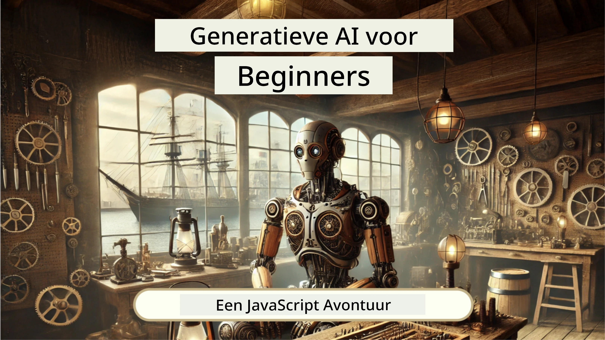
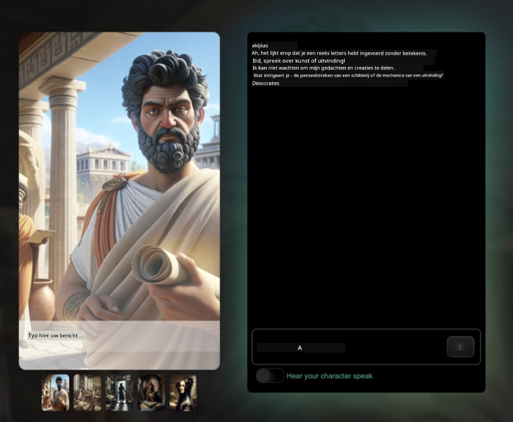
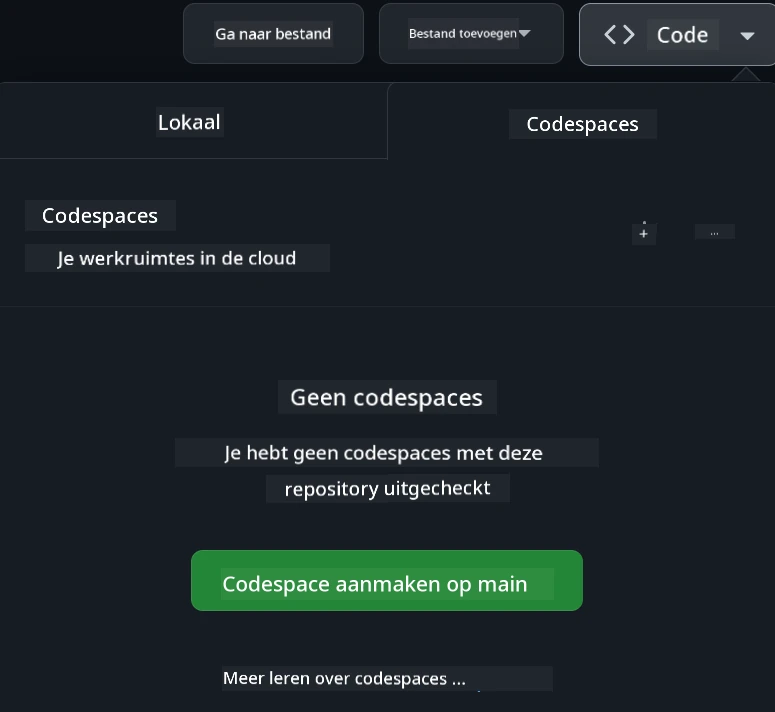

[](https://github.com/microsoft/Web-Dev-For-Beginners/blob/master/LICENSE)
[](https://GitHub.com/microsoft/Web-Dev-For-Beginners/graphs/contributors/)
[](https://GitHub.com/microsoft/Web-Dev-For-Beginners/issues/)
[](https://GitHub.com/microsoft/Web-Dev-For-Beginners/pulls/)
[](http://makeapullrequest.com) 

[](https://GitHub.com/microsoft/Web-Dev-For-Beginners/watchers/)
[](https://GitHub.com/microsoft/Web-Dev-For-Beginners/network/)
[](https://GitHub.com/microsoft/Web-Dev-For-Beginners/stargazers/)

[](https://discord.gg/nTYy5BXMWG)

# Webontwikkeling voor Beginners - Een Curriculum

Leer de basisprincipes van webontwikkeling met onze 12-weken durende uitgebreide cursus van Microsoft Cloud Advocates. Elk van de 24 lessen verdiept zich in JavaScript, CSS en HTML via hands-on projecten zoals terrariums, browserextensies en ruimtegames. Doe mee met quizzen, discussies en praktische opdrachten. Verbeter je vaardigheden en optimaliseer je kennisretentie met onze effectieve projectgebaseerde didactiek. Begin vandaag nog met coderen!

Word lid van de Azure AI Foundry Discord Community

[](https://discord.gg/nTYy5BXMWG)

Volg deze stappen om aan de slag te gaan met deze bronnen:
1. **Fork de repository**: Klik op [](https://GitHub.com/microsoft/Web-Dev-For-Beginners/fork)
2. **Clone de repository**:   `git clone https://github.com/microsoft/Web-Dev-For-Beginners.git`
3. [**Word lid van de Azure AI Foundry Discord en ontmoet experts en mede-ontwikkelaars**](https://discord.com/invite/ByRwuEEgH4)

### 🌐 Meertalige Ondersteuning

#### Ondersteund via GitHub Actie (Geautomatiseerd & Altijd Actueel)

<!-- CO-OP TRANSLATOR LANGUAGES TABLE START -->
[Arabic](../ar/README.md) | [Bengali](../bn/README.md) | [Bulgarian](../bg/README.md) | [Burmese (Myanmar)](../my/README.md) | [Chinese (Simplified)](../zh-CN/README.md) | [Chinese (Traditional, Hong Kong)](../zh-HK/README.md) | [Chinese (Traditional, Macau)](../zh-MO/README.md) | [Chinese (Traditional, Taiwan)](../zh-TW/README.md) | [Croatian](../hr/README.md) | [Czech](../cs/README.md) | [Danish](../da/README.md) | [Dutch](./README.md) | [Estonian](../et/README.md) | [Finnish](../fi/README.md) | [French](../fr/README.md) | [German](../de/README.md) | [Greek](../el/README.md) | [Hebrew](../he/README.md) | [Hindi](../hi/README.md) | [Hungarian](../hu/README.md) | [Indonesian](../id/README.md) | [Italian](../it/README.md) | [Japanese](../ja/README.md) | [Kannada](../kn/README.md) | [Korean](../ko/README.md) | [Lithuanian](../lt/README.md) | [Malay](../ms/README.md) | [Malayalam](../ml/README.md) | [Marathi](../mr/README.md) | [Nepali](../ne/README.md) | [Nigerian Pidgin](../pcm/README.md) | [Norwegian](../no/README.md) | [Persian (Farsi)](../fa/README.md) | [Polish](../pl/README.md) | [Portuguese (Brazil)](../pt-BR/README.md) | [Portuguese (Portugal)](../pt-PT/README.md) | [Punjabi (Gurmukhi)](../pa/README.md) | [Romanian](../ro/README.md) | [Russian](../ru/README.md) | [Serbian (Cyrillic)](../sr/README.md) | [Slovak](../sk/README.md) | [Slovenian](../sl/README.md) | [Spanish](../es/README.md) | [Swahili](../sw/README.md) | [Swedish](../sv/README.md) | [Tagalog (Filipino)](../tl/README.md) | [Tamil](../ta/README.md) | [Telugu](../te/README.md) | [Thai](../th/README.md) | [Turkish](../tr/README.md) | [Ukrainian](../uk/README.md) | [Urdu](../ur/README.md) | [Vietnamese](../vi/README.md)

> **Liever lokaal clonen?**
>
> Deze repository bevat meer dan 50 taalvertalingen, wat de downloadgrootte aanzienlijk vergroot. Om zonder vertalingen te clonen, gebruik sparse checkout:
>
> **Bash / macOS / Linux:**
> ```bash
> git clone --filter=blob:none --sparse https://github.com/microsoft/Web-Dev-For-Beginners.git
> cd Web-Dev-For-Beginners
> git sparse-checkout set --no-cone '/*' '!translations' '!translated_images'
> ```
>
> **CMD (Windows):**
> ```cmd
> git clone --filter=blob:none --sparse https://github.com/microsoft/Web-Dev-For-Beginners.git
> cd Web-Dev-For-Beginners
> git sparse-checkout set --no-cone "/*" "!translations" "!translated_images"
> ```
>
> Dit geeft je alles wat je nodig hebt om de cursus te voltooien met een veel snellere download.
<!-- CO-OP TRANSLATOR LANGUAGES TABLE END -->

**Als je wilt dat er extra vertaaltalen worden ondersteund, zijn die te vinden [hier](https://github.com/Azure/co-op-translator/blob/main/getting_started/supported-languages.md)**

[](https://open.vscode.dev/microsoft/Web-Dev-For-Beginners)

#### 🧑‍🎓 _Ben je een student?_

Bezoek de [**Student Hub-pagina**](https://docs.microsoft.com/learn/student-hub/?WT.mc_id=academic-77807-sagibbon) waar je beginnersmateriaal, studentenpakketten en zelfs manieren om een gratis certificaatvoucher te verkrijgen zult vinden. Dit is de pagina die je wilt bookmarken en van tijd tot tijd bekijken omdat we maandelijks de inhoud wisselen.

### 📣 Aankondiging - Nieuwe GitHub Copilot Agent modus uitdagingen om te voltooien!

Nieuwe uitdaging toegevoegd, zoek naar "GitHub Copilot Agent Challenge 🚀" in de meeste hoofdstukken. Dit is een nieuwe uitdaging voor jou om te voltooien met behulp van GitHub Copilot en Agent modus. Als je Agent modus nog niet hebt gebruikt, kan deze niet alleen tekst genereren, maar ook bestanden maken en bewerken, commando's uitvoeren en meer.

### 📣 Aankondiging - _Nieuw project om te bouwen met Generatieve AI_ 

Nieuw AI-assistent project zojuist toegevoegd, bekijk het [project](./9-chat-project/README.md)

### 📣 Aankondiging - _Nieuw curriculum_ over Generatieve AI voor JavaScript is zojuist uitgebracht

Mis ons nieuwe Generatieve AI curriculum niet!

Bezoek [https://aka.ms/genai-js-course](https://aka.ms/genai-js-course) om te beginnen!



- Lessen die alles behandelen van basisprincipes tot RAG.
- Interageer met historische figuren met GenAI en onze begeleidende app.
- Leuk en boeiend verhaal, je gaat tijdreizen!




Elke les bevat een opdracht om te voltooien, een kenniscontrole en een uitdaging om je te begeleiden bij het leren over onderwerpen zoals:
- Prompting en prompt engineering
- Generatie van tekst- en afbeeldingsapps
- Zoekapps

Bezoek [https://aka.ms/genai-js-course](https://aka.ms/genai-js-course) om te starten!


## 🌱 Aan de slag

> **Docenten**, we hebben [enkele suggesties opgenomen](for-teachers.md) over hoe je dit curriculum kunt gebruiken. We horen graag je feedback [in ons discussieforum](https://github.com/microsoft/Web-Dev-For-Beginners/discussions/categories/teacher-corner)!

**[Leerlingen](https://aka.ms/student-page/?WT.mc_id=academic-77807-sagibbon)**, begin bij elke les met een pre-lecture quiz en volg deze op door het leesmateriaal van de les door te nemen, de verschillende activiteiten te voltooien en je begrip te controleren met de post-lecture quiz.

Om je leerervaring te verbeteren, verbind je met je medeleerlingen om samen aan de projecten te werken! Discussies worden aangemoedigd in ons [discussieforum](https://github.com/microsoft/Web-Dev-For-Beginners/discussions) waar ons team van moderatoren beschikbaar is om je vragen te beantwoorden.

Om je opleiding verder te brengen, raden we sterk aan de [Microsoft Learn](https://learn.microsoft.com/users/wirelesslife/collections/p1ddcy5jwy0jkm?WT.mc_id=academic-77807-sagibbon) te verkennen voor aanvullende studiematerialen.

### 📋 Je omgeving instellen

Dit curriculum heeft een ontwikkelomgeving die klaar is om te gebruiken! Als je begint, kun je ervoor kiezen om het curriculum te draaien in een [Codespace](https://github.com/features/codespaces/) (_een browser gebaseerde omgeving zonder installatie nodig_), of lokaal op je computer met een teksteditor zoals [Visual Studio Code](https://code.visualstudio.com/?WT.mc_id=academic-77807-sagibbon).

#### Maak je repository aan
Om je werk gemakkelijk op te slaan, wordt aangeraden om je eigen kopie van deze repository te maken. Dit kun je doen door op de knop **Use this template** bovenaan de pagina te klikken. Dit maakt een nieuwe repository in je GitHub-account met een kopie van het curriculum.

Volg deze stappen:
1. **Fork de Repository**: Klik op de "Fork" knop rechtsboven op deze pagina.
2. **Clone de Repository**:   `git clone https://github.com/microsoft/Web-Dev-For-Beginners.git`

#### Het curriculum draaien in een Codespace

In je eigen kopie van deze repository die je hebt gemaakt, klik op de **Code** knop en selecteer **Open with Codespaces**. Dit maakt een nieuwe Codespace voor je aan om in te werken.



#### Het curriculum lokaal op je computer draaien

Om dit curriculum lokaal op je computer te draaien, heb je een teksteditor, een browser en een command line tool nodig. Onze eerste les, [Introductie tot Programmeertalen en Gereedschappen van het Vak](../../1-getting-started-lessons/1-intro-to-programming-languages), zal je door verschillende opties voor elk van deze tools leiden zodat je kunt kiezen wat het beste voor jou werkt.

Onze aanbeveling is om [Visual Studio Code](https://code.visualstudio.com/?WT.mc_id=academic-77807-sagibbon) als editor te gebruiken, die ook een ingebouwde [Terminal](https://code.visualstudio.com/docs/terminal/basics/?WT.mc_id=academic-77807-sagibbon) heeft. Je kunt Visual Studio Code [hier](https://code.visualstudio.com/?WT.mc_id=academic-77807-sagibbon) downloaden.
1. Clone je repository naar je computer. Dit kun je doen door op de **Code** knop te klikken en de URL te kopiëren:

    [CodeSpace](./images/createcodespace.png)

    Open vervolgens [Terminal](https://code.visualstudio.com/docs/terminal/basics/?WT.mc_id=academic-77807-sagibbon) binnen [Visual Studio Code](https://code.visualstudio.com/?WT.mc_id=academic-77807-sagibbon) en voer het volgende commando uit, waarbij je `<your-repository-url>` vervangt door de URL die je zojuist hebt gekopieerd:

    ```bash 
    git clone <your-repository-url>
    ```

2. Open de map in Visual Studio Code. Dit doe je door te klikken op **File** > **Open Folder** en de map te selecteren die je zojuist hebt gekloond.


>  Aanbevolen Visual Studio Code-extensies:
>
> * [Live Server](https://marketplace.visualstudio.com/items?itemName=ritwickdey.LiveServer&WT.mc_id=academic-77807-sagibbon) - om HTML-pagina's binnen Visual Studio Code te bekijken
> * [Copilot](https://marketplace.visualstudio.com/items?itemName=GitHub.copilot&WT.mc_id=academic-77807-sagibbon) - om je te helpen sneller code te schrijven

## 📂 Elke les bevat:

- optionele sketchnote
- optionele aanvullende video
- warming-up quiz vóór de les
- geschreven les
- voor projectgerichte lessen, stapsgewijze handleidingen om het project te bouwen
- kenniscontroles
- een uitdaging
- aanvullende lectuur
- opdracht
- [quiz na de les](https://ff-quizzes.netlify.app/web/)

> **Een opmerking over quizzen**: Alle quizzen bevinden zich in de Quiz-app map, in totaal 48 quizzen met elk drie vragen. Ze zijn beschikbaar [hier](https://ff-quizzes.netlify.app/web/). De quiz-app kan lokaal worden uitgevoerd of naar Azure worden gedeployed; volg de instructies in de `quiz-app` map.

## 🗃️ Lessen

|     |                       Projectnaam                       |                            Behandelde Concepten                             | Leerdoelen                                                                                                                |                                                         Gekoppelde Les                                                          |         Auteur          |
| :-: | :------------------------------------------------------: | :-------------------------------------------------------------------------: | ------------------------------------------------------------------------------------------------------------------------- | :------------------------------------------------------------------------------------------------------------------------------: | :---------------------: |
| 01  |                     Aan de slag                      |           Introductie tot programmeren en tools van het vak           | Leer de basisprincipes achter de meeste programmeertalen en over software die professionele ontwikkelaars helpt hun werk te doen | [Intro tot Programmeertalen en Tools van het Vak](./1-getting-started-lessons/1-intro-to-programming-languages/README.md) |         Jasmine         |
| 02  |                     Aan de slag                      |             Basisprincipes van GitHub, inclusief samenwerken in een team             | Hoe je GitHub gebruikt in je project, hoe je samenwerkt met anderen aan een codebase                                       |                            [Intro tot GitHub](./1-getting-started-lessons/2-github-basics/README.md)                             |          Floor          |
| 03  |                     Aan de slag                      |                             Toegankelijkheid                              | Leer de basis van webtoegankelijkheid                                                                                     |                       [Toegankelijkheidsfundamentals](./1-getting-started-lessons/3-accessibility/README.md)                     |       Christopher       |
| 04  |                        JS Basisprincipes                         |                         JavaScript Datatypes                          | De basis van JavaScript-datatypes                                                                                          |                                       [Datatypes](./2-js-basics/1-data-types/README.md)                                        |         Jasmine         |
| 05  |                        JS Basisprincipes                         |                         Functies en Methoden                          | Leer over functies en methoden om de logica van een applicatie te beheren                                                  |                              [Functies en Methoden](./2-js-basics/2-functions-methods/README.md)                               | Jasmine en Christopher |
| 06  |                        JS Basisprincipes                         |                        Beslissingen nemen met JS                        | Leer hoe je voorwaarden maakt in je code met behulp van besluitvormingsmethoden                                            |                                 [Beslissingen nemen](./2-js-basics/3-making-decisions/README.md)                                  |         Jasmine         |
| 07  |                        JS Basisprincipes                         |                            Arrays en Lussen                            | Werk met data met behulp van arrays en lussen in JavaScript                                                               |                                   [Arrays en Lussen](./2-js-basics/4-arrays-loops/README.md)                                    |         Jasmine         |
| 08  |       [Terrarium](./3-terrarium/solution/README.md)       |                            HTML in de praktijk                            | Bouw de HTML om een online terrarium te creëren, met focus op het maken van een lay-out                                     |                                 [Introductie tot HTML](./3-terrarium/1-intro-to-html/README.md)                                 |           Jen           |
| 09  |       [Terrarium](./3-terrarium/solution/README.md)       |                            CSS in de praktijk                             | Bouw de CSS om het online terrarium te stylen, met focus op de basis van CSS inclusief het responsief maken van de pagina  |                                  [Introductie tot CSS](./3-terrarium/2-intro-to-css/README.md)                                  |           Jen           |
| 10  |            [Terrarium](./3-terrarium/solution/README.md)            |                 JavaScript Closures, DOM-manipulatie                  | Bouw de JavaScript om het terrarium te laten functioneren als drag/drop-interface, met focus op closures en DOM-manipulatie |                  [JavaScript Closures, DOM-manipulatie](./3-terrarium/3-intro-to-DOM-and-closures/README.md)                   |           Jen           |
| 11  |          [Typen Spel](./4-typing-game/solution/README.md)          |                          Bouw een Typingspel                           | Leer hoe je toetsenbord-events gebruikt om de logica van je JavaScript-app aan te sturen                                   |                                [Event-Driven Programmeren](./4-typing-game/typing-game/README.md)                                |       Christopher       |
| 12  | [Groene Browser Extensie](./5-browser-extension/solution/README.md) |                         Werken met Browsers                          | Leer hoe browsers werken, hun geschiedenis en hoe je de eerste elementen van een browserextensie maakt                     |                               [Over Browsers](./5-browser-extension/1-about-browsers/README.md)                                |           Jen           |
| 13  | [Groene Browser Extensie](./5-browser-extension/solution/README.md) | Bouw een formulier, bellen van een API en opslaan van variabelen in lokale opslag | Bouw de JavaScript-elementen van je browserextensie om een API aan te roepen met variabelen die in lokale opslag zijn opgeslagen |                [APIs, Formulieren en Lokale Opslag](./5-browser-extension/2-forms-browsers-local-storage/README.md)                 |           Jen           |
| 14  | [Groene Browser Extensie](./5-browser-extension/solution/README.md) |          Achtergrondprocessen in de browser, webprestaties          | Gebruik de achtergrondprocessen van de browser om het pictogram van de extensie te beheren; leer over webprestaties en optimalisaties |             [Achtergrondtaken en Prestaties](./5-browser-extension/3-background-tasks-and-performance/README.md)              |           Jen           |
| 15  |           [Ruimte Spel](./6-space-game/solution/README.md)           |             Geavanceerdere spelontwikkeling met JavaScript             | Leer over overerving met behulp van klassen en compositie en het Pub/Sub-patroon, ter voorbereiding op het bouwen van een spel |                      [Introductie tot Geavanceerde Spelontwikkeling](./6-space-game/1-introduction/README.md)                       |          Chris          |
| 16  |           [Ruimte Spel](./6-space-game/solution/README.md)           |                           Tekenen op canvas                            | Leer over de Canvas API, gebruikt om elementen op een scherm te tekenen                                                      |                                [Tekenen op Canvas](./6-space-game/2-drawing-to-canvas/README.md)                                |          Chris          |
| 17  |           [Ruimte Spel](./6-space-game/solution/README.md)           |                   Elementen verplaatsen over het scherm                | Ontdek hoe elementen beweging krijgen met behulp van cartesiaanse coördinaten en de Canvas API                             |                           [Elementen Verplaatsen](./6-space-game/3-moving-elements-around/README.md)                           |          Chris          |
| 18  |           [Ruimte Spel](./6-space-game/solution/README.md)           |                          Botsingsdetectie                             | Laat elementen botsen en op elkaar reageren met toetsdrukken en voorzie in een afkoelfunctie om de prestaties van het spel te waarborgen |                              [Botsingsdetectie](./6-space-game/4-collision-detection/README.md)                              |          Chris          |
| 19  |           [Ruimte Spel](./6-space-game/solution/README.md)           |                             Puntentelling                             | Voer wiskundige berekeningen uit op basis van de status en prestaties van het spel                                          |                                    [Puntentelling](./6-space-game/5-keeping-score/README.md)                                    |          Chris          |
| 20  |           [Ruimte Spel](./6-space-game/solution/README.md)           |                     Het spel beëindigen en opnieuw starten             | Leer over het beëindigen en opnieuw starten van het spel, inclusief het opruimen van assets en het resetten van variabelen   |                                [De Eindvoorwaarde](./6-space-game/6-end-condition/README.md)                                 |          Chris          |
| 21  |         [Bankieren App](./7-bank-project/solution/README.md)          |                 HTML Templates en Routes in een Web App                 | Leer hoe je de opbouw van een multi-page website maakt met routing en HTML-templates                                       |                            [HTML Templates en Routes](./7-bank-project/1-template-route/README.md)                             |          Yohan          |
| 22  |         [Bankieren App](./7-bank-project/solution/README.md)          |                  Bouw een Login- en Registratieformulier               | Leer over het bouwen van formulieren en het afhandelen van validatieroutines                                                |                                           [Formulieren](./7-bank-project/2-forms/README.md)                                           |          Yohan          |
| 23  |         [Bankieren App](./7-bank-project/solution/README.md)          |                   Methoden om data op te halen en te gebruiken          | Hoe data in en uit je app stroomt, hoe je het ophaalt, opslaat en opruimt                                                   |                                            [Data](./7-bank-project/3-data/README.md)                                            |          Yohan          |
| 24  |         [Bankieren App](./7-bank-project/solution/README.md)          |                      Concepten van State Management                     | Leer hoe je app status behoudt en hoe je dat programmeerbaar beheert                                                       |                                [State Management](./7-bank-project/4-state-management/README.md)                                |          Yohan          |
| 25 | [Browser/VScode Code](../../8-code-editor) | Werken met VScode | Leer hoe je een code-editor gebruikt| [Gebruik VScode Code Editor](./8-code-editor/1-using-a-code-editor/README.md) | Chris |
| 26 | [AI Assistenten](./9-chat-project/README.md) | Werken met AI | Leer hoe je je eigen AI-assistent bouwt | [AI Assistent project](./9-chat-project/README.md) | Chris |

## 🏫 Pedagogiek

Onze curriculum is ontworpen met twee belangrijke pedagogische principes in gedachten:
* projectgebaseerd leren
* frequente quizzen

Het programma leert de basisprincipes van JavaScript, HTML en CSS, evenals de nieuwste tools en technieken die tegenwoordig door webontwikkelaars worden gebruikt. Studenten krijgen de kans om praktische ervaring op te doen door het bouwen van een typingspel, virtueel terrarium, milieuvriendelijke browserextensie, space-invader-stijl spel en een bankapp voor bedrijven. Aan het einde van de serie hebben studenten een solide begrip van webontwikkeling opgedaan.

> 🎓 Je kunt de eerste lessen van dit curriculum volgen als een [Leerroute](https://docs.microsoft.com/learn/paths/web-development-101/?WT.mc_id=academic-77807-sagibbon) op Microsoft Learn!

Door te zorgen dat de inhoud aansluit bij projecten wordt het leerproces boeiender voor studenten en wordt het vasthouden van concepten vergroot. We schreven ook enkele starterlessen in JavaScript-basisprincipes om concepten te introduceren, gecombineerd met een video uit de "[Beginners Series to: JavaScript](https://channel9.msdn.com/Series/Beginners-Series-to-JavaScript/?WT.mc_id=academic-77807-sagibbon)" collectie van videotutorials, waarvan enkele auteurs aan dit curriculum hebben bijgedragen.

Daarnaast zet een quiz met lage druk vóór de les de intentie van de student om een onderwerp te leren, terwijl een tweede quiz na de les verdere retentie waarborgt. Dit curriculum is ontworpen om flexibel en leuk te zijn en kan geheel of gedeeltelijk worden gevolgd. De projecten beginnen klein en worden steeds complexer aan het einde van de 12-weekse cyclus.

Hoewel we bewust hebben vermeden om JavaScript-frameworks te introduceren om ons te concentreren op de basisvaardigheden die nodig zijn als webontwikkelaar vóór het adopteren van een framework, zou een goede volgende stap na het voltooien van dit curriculum het leren over Node.js zijn via een andere collectie video's: "[Beginner Series to: Node.js](https://channel9.msdn.com/Series/Beginners-Series-to-Nodejs/?WT.mc_id=academic-77807-sagibbon)".

> Bezoek onze [Gedragscode](CODE_OF_CONDUCT.md) en [Bijdragen](CONTRIBUTING.md) richtlijnen. We stellen je constructieve feedback op prijs!


## 🧭 Offline toegang

Je kunt deze documentatie offline gebruiken door gebruik te maken van [Docsify](https://docsify.js.org/#/). Fork deze repo, [installeer Docsify](https://docsify.js.org/#/quickstart) op je lokale machine, en typ vervolgens in de root-map van deze repo `docsify serve`. De website zal worden geserveerd op poort 3000 op je localhost: `localhost:3000`.

## 📘 PDF
Een PDF van alle lessen is hier te vinden [here](https://microsoft.github.io/Web-Dev-For-Beginners/pdf/readme.pdf).


## 🎒 Andere Cursussen

Ons team produceert ook andere cursussen! Neem een kijkje bij:

<!-- CO-OP TRANSLATOR OTHER COURSES START -->
### LangChain
[](https://aka.ms/langchain4j-for-beginners)
[](https://aka.ms/langchainjs-for-beginners?WT.mc_id=m365-94501-dwahlin)
[](https://github.com/microsoft/langchain-for-beginners?WT.mc_id=m365-94501-dwahlin)
---

### Azure / Edge / MCP / Agents
[](https://github.com/microsoft/AZD-for-beginners?WT.mc_id=academic-105485-koreyst)
[](https://github.com/microsoft/edgeai-for-beginners?WT.mc_id=academic-105485-koreyst)
[](https://github.com/microsoft/mcp-for-beginners?WT.mc_id=academic-105485-koreyst)
[](https://github.com/microsoft/ai-agents-for-beginners?WT.mc_id=academic-105485-koreyst)

---
 
### Generatieve AI Serie
[](https://github.com/microsoft/generative-ai-for-beginners?WT.mc_id=academic-105485-koreyst)
[-9333EA?style=for-the-badge&labelColor=E5E7EB&color=9333EA)](https://github.com/microsoft/Generative-AI-for-beginners-dotnet?WT.mc_id=academic-105485-koreyst)
[-C084FC?style=for-the-badge&labelColor=E5E7EB&color=C084FC)](https://github.com/microsoft/generative-ai-for-beginners-java?WT.mc_id=academic-105485-koreyst)
[-E879F9?style=for-the-badge&labelColor=E5E7EB&color=E879F9)](https://github.com/microsoft/generative-ai-with-javascript?WT.mc_id=academic-105485-koreyst)

---
 
### Kernleren
[](https://aka.ms/ml-beginners?WT.mc_id=academic-105485-koreyst)
[](https://aka.ms/datascience-beginners?WT.mc_id=academic-105485-koreyst)
[](https://aka.ms/ai-beginners?WT.mc_id=academic-105485-koreyst)
[](https://github.com/microsoft/Security-101?WT.mc_id=academic-96948-sayoung)
[](https://aka.ms/webdev-beginners?WT.mc_id=academic-105485-koreyst)
[](https://aka.ms/iot-beginners?WT.mc_id=academic-105485-koreyst)
[](https://github.com/microsoft/xr-development-for-beginners?WT.mc_id=academic-105485-koreyst)

---
 
### Copilot Serie
[](https://aka.ms/GitHubCopilotAI?WT.mc_id=academic-105485-koreyst)
[](https://github.com/microsoft/mastering-github-copilot-for-dotnet-csharp-developers?WT.mc_id=academic-105485-koreyst)
[](https://github.com/microsoft/CopilotAdventures?WT.mc_id=academic-105485-koreyst)
<!-- CO-OP TRANSLATOR OTHER COURSES END -->

## Hulp Krijgen

Als je vastloopt of vragen hebt over het bouwen van AI-apps, doe mee met andere leerlingen en ervaren ontwikkelaars in discussies over MCP. Het is een ondersteunende gemeenschap waar vragen welkom zijn en kennis vrij wordt gedeeld.

[](https://discord.gg/nTYy5BXMWG)

Als je productfeedback hebt of fouten tegenkomt tijdens het bouwen, bezoek:

[](https://aka.ms/foundry/forum)

## Licentie

Deze repository is gelicentieerd onder de MIT-licentie. Zie het [LICENSE](../../LICENSE) bestand voor meer informatie.

---

<!-- CO-OP TRANSLATOR DISCLAIMER START -->
**Disclaimer**:
Dit document is vertaald met behulp van de AI-vertalingsservice [Co-op Translator](https://github.com/Azure/co-op-translator). Hoewel we streven naar nauwkeurigheid, dient u er rekening mee te houden dat geautomatiseerde vertalingen fouten of onnauwkeurigheden kunnen bevatten. Het originele document in de oorspronkelijke taal dient als gezaghebbende bron te worden beschouwd. Voor cruciale informatie wordt professionele menselijke vertaling aanbevolen. Wij zijn niet aansprakelijk voor eventuele misverstanden of verkeerde interpretaties die voortvloeien uit het gebruik van deze vertaling.
<!-- CO-OP TRANSLATOR DISCLAIMER END -->