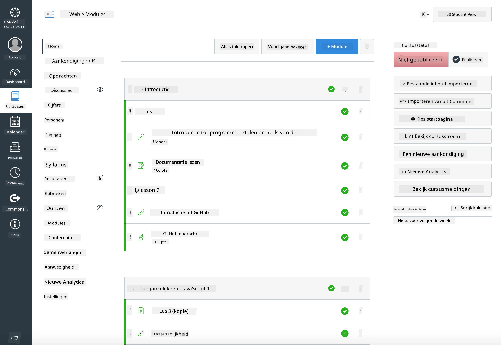

### Voor docenten

U bent van harte welkom om dit lesprogramma in uw klas te gebruiken. Het werkt naadloos met GitHub Classroom en toonaangevende LMS-platforms, en kan ook als een zelfstandige repository met uw studenten worden gebruikt.

### Gebruik met GitHub Classroom

Om lessen en opdrachten per cohort te beheren, maakt u één repository per les aan zodat GitHub Classroom elke opdracht onafhankelijk kan koppelen.

- Fork deze repository naar uw organisatie.
- Maak een aparte repository voor elke les door elke lesmap in een eigen repository te plaatsen.
  - Optie A: Maak lege repositories (één per les) en kopieer de inhoud van de lesmap naar elk.
  - Optie B: Gebruik een methode die de Git-geschiedenis behoudt (bijv. een map splitsen in een nieuwe repository) als u herkomst nodig heeft.
- Maak in GitHub Classroom een opdracht per les en wijs deze toe aan de bijbehorende lesrepository.
- Aanbevolen instellingen:
  - Repositoryzichtbaarheid: privé voor studentenwerk.
  - Gebruik startcode van de standaardbranch van de lesrepository.
  - Voeg issue- en pull request-sjablonen toe voor quizzen en inzendingen.
  - Configureer optioneel automatische beoordeling en tests als uw lessen deze bevatten.
- Handige conventies:
  - Repositorynamen zoals lesson-01-intro, lesson-02-html, enz.
  - Labels: quiz, opdracht, needs-review, late, resubmission.
  - Tags/releases per cohort (bijv. v2025-term1).

Tip: Vermijd het opslaan van repositories in gesynchroniseerde mappen (bijv. OneDrive/Google Drive) om Git-conflicten op Windows te voorkomen.

### Gebruik met Moodle, Canvas of Blackboard

Dit lesprogramma bevat importeerbare pakketten voor gangbare LMS-workflows.

- Moodle: Gebruik het Moodle-uploadbestand [Moodle upload file](../../../../../../../teaching-files/webdev-moodle.mbz) om de volledige cursus te laden.
- Common Cartridge: Gebruik het Common Cartridge-bestand [Common Cartridge file](../../../../../../../teaching-files/webdev-common-cartridge.imscc) voor bredere LMS-compatibiliteit.
- Opmerkingen:
  - Moodle Cloud heeft beperkte ondersteuning voor Common Cartridge. Geef de voorkeur aan het bovenstaande Moodle-bestand, dat ook in Canvas kan worden geüpload.
  - Controleer na import de modules, deadlines en quizinstellingen om aan te sluiten bij uw semesterschema.

> Het lesprogramma in een Moodle-klas

> Het lesprogramma in Canvas

### Gebruik de repository direct (zonder Classroom)

Als u liever geen gebruik maakt van GitHub Classroom, kunt u de cursus direct vanuit deze repository uitvoeren.

- Synchrone/online formats (Zoom/Teams):
  - Voer korte mentorgeleide opwarmers uit; gebruik breakout rooms voor quizzen.
  - Kondig een tijdsvenster aan voor quizzen; studenten dienen antwoorden in als GitHub Issues.
  - Voor samenwerkingsopdrachten werken studenten in openbare lesrepositories en openen pull requests.
- Privé/asynchrone formats:
  - Studenten forken elke les naar hun eigen **privé** repositories en voegen u toe als medewerker.
  - Ze dienen in via Issues (quizzen) en Pull Requests (opdrachten) op uw klasrepository of hun privéforks.

### Beste praktijken

- Geef een oriëntatieles over de basis van Git/GitHub, Issues en PRs.
- Gebruik checklists in Issues voor meerstapsquizzen/opdrachten.
- Voeg CONTRIBUTING.md en CODE_OF_CONDUCT.md toe om klasnormen vast te stellen.
- Voeg toegankelijkheidsnotities toe (alt-tekst, ondertitels) en bied printbare PDF's aan.
- Versieer uw inhoud per semester en bevries lesrepositories na publicatie.

### Feedback en ondersteuning

We willen dat dit lesprogramma werkt voor u en uw studenten. Open een nieuw Issue in deze repository voor bugs, verzoeken of verbeteringen, of start een discussie in de Teacher Corner.

---

**Disclaimer**:  
Dit document is vertaald met behulp van de AI-vertalingsservice [Co-op Translator](https://github.com/Azure/co-op-translator). Hoewel we streven naar nauwkeurigheid, dient u zich ervan bewust te zijn dat geautomatiseerde vertalingen fouten of onnauwkeurigheden kunnen bevatten. Het originele document in de oorspronkelijke taal moet worden beschouwd als de gezaghebbende bron. Voor kritieke informatie wordt professionele menselijke vertaling aanbevolen. Wij zijn niet aansprakelijk voor misverstanden of verkeerde interpretaties die voortvloeien uit het gebruik van deze vertaling.