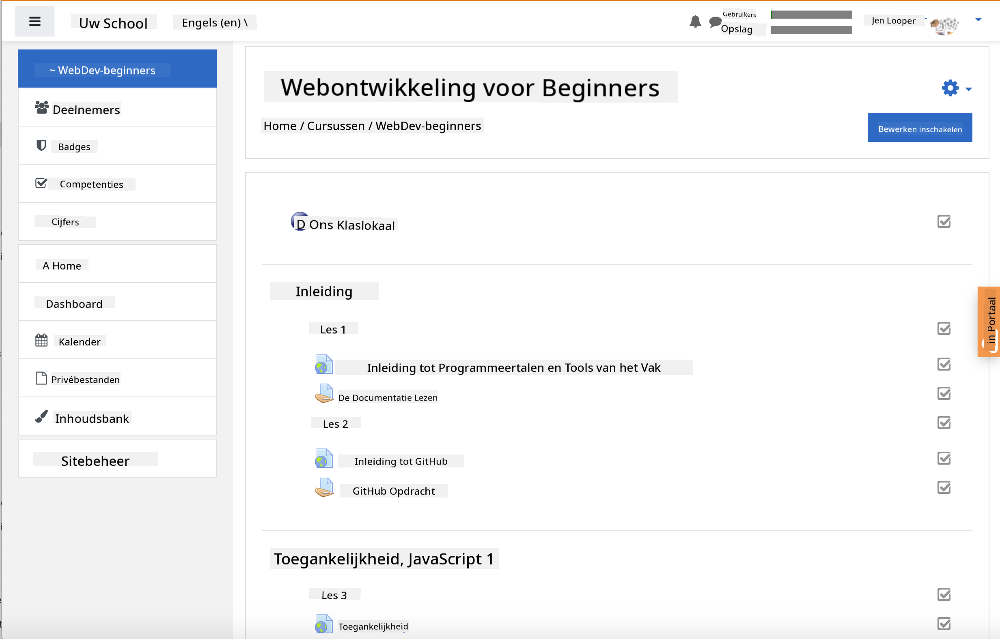
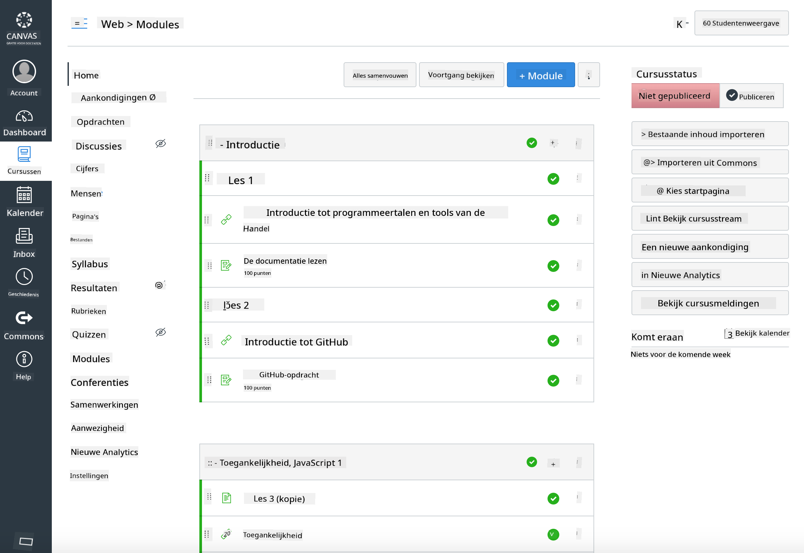

<!--
CO_OP_TRANSLATOR_METADATA:
{
  "original_hash": "75cb51f7ca9ea0b097ef4a1287e9290c",
  "translation_date": "2025-08-27T20:02:40+00:00",
  "source_file": "for-teachers.md",
  "language_code": "nl"
}
-->
## Voor Docenten

Wilt u dit lesprogramma in uw klas gebruiken? Voel u vrij om dat te doen!

U kunt het zelfs direct binnen GitHub gebruiken door gebruik te maken van GitHub Classroom.

Om dit te doen, fork deze repository. U zult een aparte repository moeten maken voor elke les, dus u moet elke map in een aparte repository plaatsen. Op die manier kan [GitHub Classroom](https://classroom.github.com/classrooms) elke les afzonderlijk oppakken.

Deze [volledige instructies](https://github.blog/2020-03-18-set-up-your-digital-classroom-with-github-classroom/) geven u een idee van hoe u uw klaslokaal kunt opzetten.

## Gebruik in Moodle, Canvas of Blackboard

Dit lesprogramma werkt goed in deze Learning Management Systems! Gebruik het [Moodle uploadbestand](../../../../../../../teaching-files/webdev-moodle.mbz) voor de volledige inhoud, of probeer het [Common Cartridge-bestand](../../../../../../../teaching-files/webdev-common-cartridge.imscc) dat een deel van de inhoud bevat. Moodle Cloud ondersteunt geen volledige Common Cartridge-exporten, dus het is beter om het Moodle-downloadbestand te gebruiken, dat kan worden geüpload in Canvas. Laat ons weten hoe we deze ervaring kunnen verbeteren.

> Het lesprogramma in een Moodle-klaslokaal

> Het lesprogramma in Canvas

## Gebruik van de repository zoals deze is

Als u deze repository wilt gebruiken zoals deze nu is, zonder gebruik te maken van GitHub Classroom, is dat ook mogelijk. U moet dan met uw studenten communiceren over welke les ze samen moeten doorlopen.

In een online format (Zoom, Teams of andere) kunt u breakout rooms maken voor de quizzen en studenten begeleiden om hen klaar te stomen om te leren. Nodig vervolgens studenten uit voor de quizzen en laat hen hun antwoorden indienen als 'issues' op een bepaald moment. U kunt hetzelfde doen met opdrachten als u wilt dat studenten openlijk samenwerken.

Als u de voorkeur geeft aan een meer privéformat, vraag uw studenten dan om het lesprogramma, les voor les, te forken naar hun eigen privé GitHub-repositories en geef u toegang. Vervolgens kunnen ze quizzen en opdrachten privé voltooien en deze via issues op uw klaslokaal-repository aan u indienen.

Er zijn veel manieren om dit te laten werken in een online klaslokaal. Laat ons weten wat voor u het beste werkt!

## Geef ons uw mening!

We willen dit lesprogramma laten werken voor u en uw studenten. Neem contact met ons op via de [Teacher corner](https://github.com/microsoft/Web-Dev-For-Beginners/discussions/categories/teacher-corner) en open een [**nieuw issue**](https://github.com/microsoft/Web-Dev-For-Beginners/issues/new/choose) voor verzoeken, bugs en feedback.

---

**Disclaimer**:  
Dit document is vertaald met behulp van de AI-vertalingsservice [Co-op Translator](https://github.com/Azure/co-op-translator). Hoewel we streven naar nauwkeurigheid, dient u zich ervan bewust te zijn dat geautomatiseerde vertalingen fouten of onnauwkeurigheden kunnen bevatten. Het originele document in zijn oorspronkelijke taal moet worden beschouwd als de gezaghebbende bron. Voor cruciale informatie wordt professionele menselijke vertaling aanbevolen. Wij zijn niet aansprakelijk voor eventuele misverstanden of verkeerde interpretaties die voortvloeien uit het gebruik van deze vertaling.