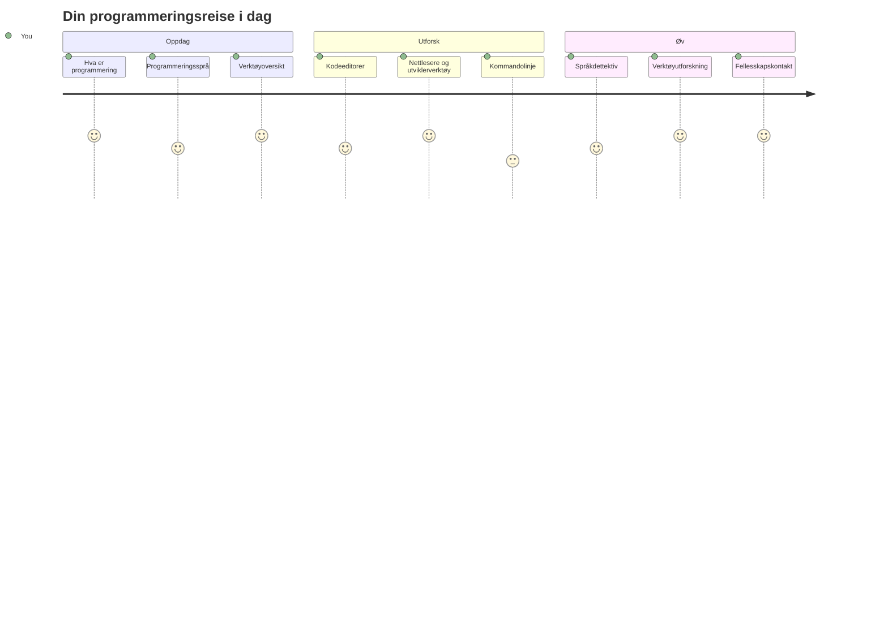
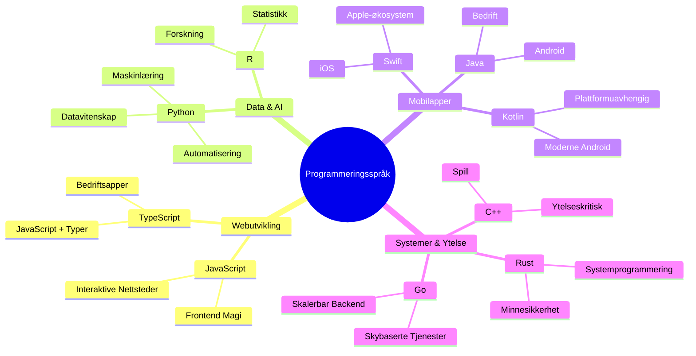
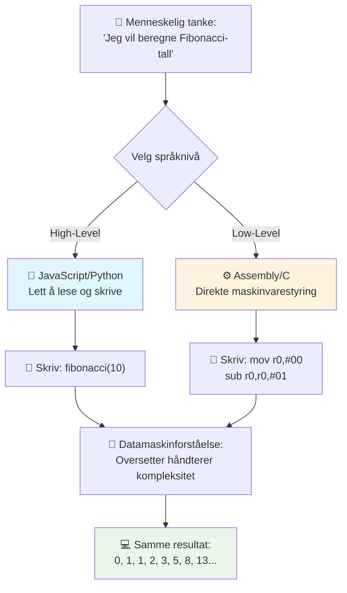
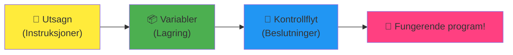
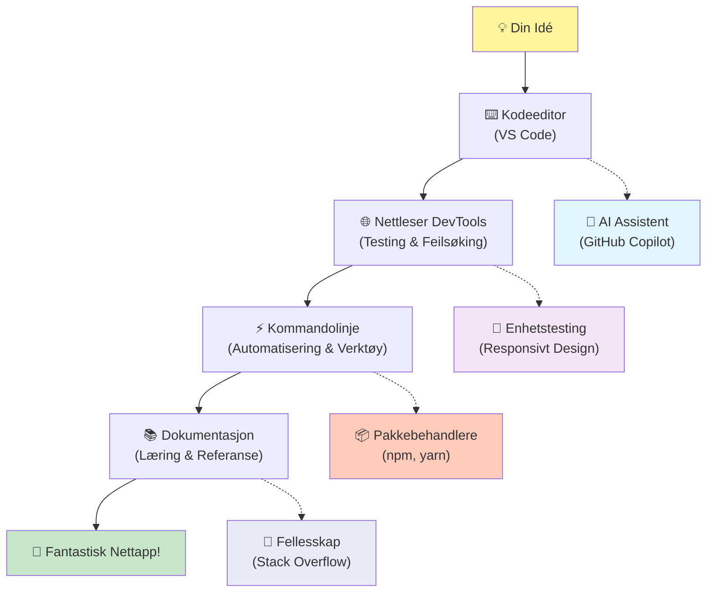
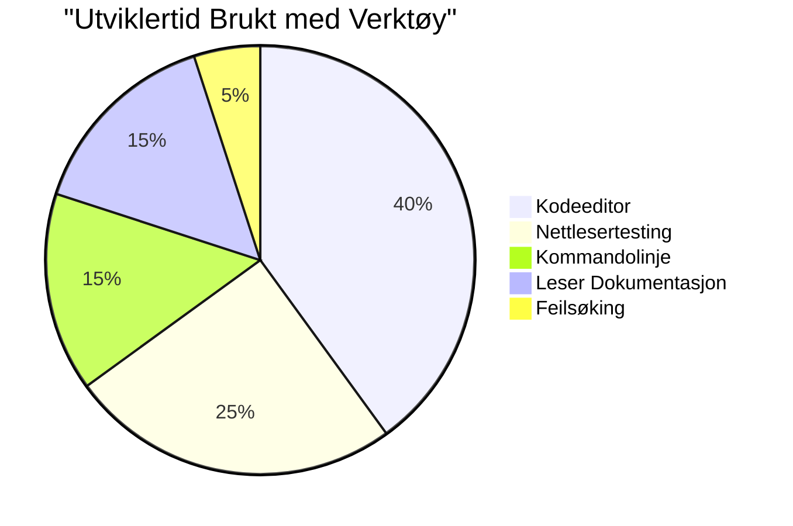
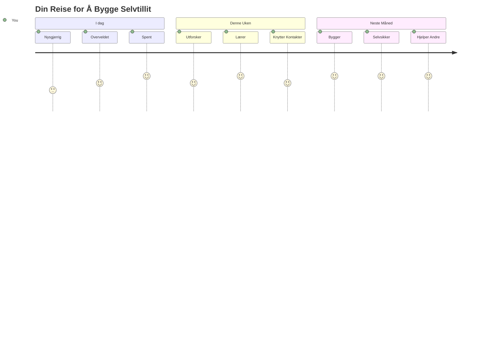

<!--
CO_OP_TRANSLATOR_METADATA:
{
  "original_hash": "d45ddcc54eb9232a76d08328b09d792e",
  "translation_date": "2026-01-07T00:56:37+00:00",
  "source_file": "1-getting-started-lessons/1-intro-to-programming-languages/README.md",
  "language_code": "no"
}
-->
# Introduksjon til programmeringsspråk og moderne utviklerverktøy

Hei der, fremtidige utvikler! 👋 Kan jeg fortelle deg noe som fortsatt gir meg gåsehud hver eneste dag? Du er i ferd med å oppdage at programmering ikke bare handler om datamaskiner – det handler om å ha ekte superkrefter til å bringe dine villeste ideer til live!

Du vet det øyeblikket når du bruker din favorittapp og alt bare klikker perfekt? Når du trykker på en knapp og noe helt magisk skjer som får deg til å si "wow, hvordan FIKK de til det?" Vel, noen akkurat som deg – sannsynligvis sittende på sin favorittkafé klokken 2 om natten med sin tredje espresso – skrev koden som skapte den magien. Og her er noe som kommer til å blåse deg av banen: innen slutten av denne leksjonen vil du ikke bare forstå hvordan de gjorde det, men du vil være ivrig etter å prøve det selv!

Se, jeg skjønner helt hvis programmering føles skremmende akkurat nå. Da jeg først begynte, trodde jeg ærlig talt at du måtte være en slags matematikkgeni eller ha programmert siden du var fem år gammel. Men her er det som helt endret perspektivet mitt: programmering er akkurat som å lære å ha samtaler på et nytt språk. Du begynner med "hei" og "takk," så jobber du deg opp til å bestille kaffe, og før du vet ordet av det, har du dype filosofiske diskusjoner! Bortsett fra at i dette tilfellet har du samtaler med datamaskiner, og ærlig talt? De er de mest tålmodige samtalepartnerne du noensinne vil ha – de dømmer aldri feilene dine og er alltid glade for å prøve igjen!

I dag skal vi utforske de utrolige verktøyene som gjør moderne webutvikling ikke bare mulig, men virkelig vanedannende. Jeg snakker om de samme redaktørene, nettleserne og arbeidsflytene som utviklere hos Netflix, Spotify og ditt favoritt indie app-studio bruker hver eneste dag. Og her er delen som får deg til å danse av glede: de fleste av disse profesjonelle, industristandard verktøyene er helt gratis!


> Sketchnote av [Tomomi Imura](https://twitter.com/girlie_mac)


## La oss se hva du allerede kan!

Før vi hopper inn i det morsomme, er jeg nysgjerrig – hva vet du allerede om denne programmeringsverdenen? Og hør her, hvis du ser på disse spørsmålene og tenker "jeg har bokstavelig talt null peiling på noe av dette," så er det ikke bare greit, det er perfekt! Det betyr at du er akkurat på rett sted. Se på denne quizen som å varme opp før trening – vi varmer bare opp de hjerne-musklene!

[Ta forprøve quizen](https://forms.office.com/r/dru4TE0U9n?origin=lprLink)


## Eventyret vi skal begi oss ut på sammen

Ok, jeg spretter virkelig av begeistring for hva vi skal utforske i dag! Ærlig, jeg skulle ønske jeg kunne se ansiktet ditt når noen av disse konseptene klikker. Her er den utrolige reisen vi skal ta sammen:

- **Hva programmering faktisk er (og hvorfor det er det kuleste som finnes!)** – Vi skal oppdage hvordan kode bokstavelig talt er den usynlige magien som driver alt rundt deg, fra den alarmen som på en eller annen måte vet at det er mandag morgen til algoritmen som perfekt kuraterer Netflix-anbefalingene dine
- **Programmeringsspråk og deres fantastiske personligheter** – Tenk deg å gå inn i en fest der hver person har helt forskjellige superkrefter og måter å løse problemer på. Det er akkurat slik programmeringsspråkverdenen er, og du kommer til å elske å møte dem!
- **De grunnleggende byggeklossene som skaper digital magi** – Tenk på disse som det ultimate kreative LEGO-settet. Når du forstår hvordan disse bitene passer sammen, vil du innse at du bokstavelig talt kan bygge hva som helst fantasien din drømmer om
- **Profesjonelle verktøy som får deg til å føle at du akkurat har fått tildelt en trollmanns stav** – Jeg overdriver ikke – disse verktøyene vil virkelig få deg til å føle at du har superkrefter, og det beste? Det er de samme proffene bruker!

> 💡 **Her er greia**: Ikke engang tenk på å prøve å huske alt i dag! Akkurat nå vil jeg bare at du skal kjenne på den gnisten av spenning over hva som er mulig. Detaljene vil feste seg naturlig når vi øver sammen – det er slik ekte læring skjer!

> Du kan ta denne leksjonen på [Microsoft Learn](https://docs.microsoft.com/learn/modules/web-development-101/introduction-programming/?WT.mc_id=academic-77807-sagibbon)!

## Så hva *er* egentlig programmering?

Alright, la oss ta for oss milliondollerspørsmålet: hva er programmering, egentlig?

Jeg skal gi deg en historie som helt endret hvordan jeg tenker om dette. Forrige uke prøvde jeg å forklare til mamma hvordan hun skal bruke den nye fjernkontrollen til smart-TV-en vår. Jeg fanget meg selv i å si ting som "Trykk på den røde knappen, men ikke den store røde knappen, den lille røde knappen til venstre... nei, din andre venstre... ok, hold den i to sekunder nå, ikke ett, ikke tre..." Kjenner du deg igjen? 😅

Det er programmering! Det er kunsten å gi utrolig detaljerte, trinnvise instruksjoner til noe som er veldig kraftfullt men som må ha alt forklart perfekt. Bortsett fra at i stedet for å forklare til mamma (som kan spørre "hvilken røde knapp?!"), forklarer du til en datamaskin (som bare gjør akkurat det du sier, selv om det du sa ikke helt var det du mente).

Her er noe som blåste meg av banen da jeg først lærte det: datamaskiner er faktisk ganske enkle innerst inne. De forstår bokstavelig talt kun to ting – 1 og 0, som egentlig bare betyr "ja" og "nei" eller "på" og "av." Det er det! Men her blir det magisk – vi trenger ikke snakke i 1-ere og 0-ere som i Matrix. Det er her **programmeringsspråk** kommer til unnsetning. De er som verdens beste oversetter som tar dine helt normale mennesketanker og oversetter dem til datamaskinens språk.

Og her er noe som fortsatt gir meg ekte gåsehud hver morgen jeg våkner: bokstavelig talt *alt* digitalt i livet ditt startet med noen akkurat som deg, sannsynligvis sittende i pysjen med en kopp kaffe, og skrev kode på sin bærbare PC. Den Instagram-filteret som får deg til å se feilfri ut? Noen programmerte det. Anbefalingen som førte deg til din nye favorittsang? En utvikler bygde den algoritmen. Appen som hjelper deg å dele regningen på middag med venner? Jep, noen tenkte "dette er irriterende, jeg tror jeg kan fikse det" og så... gjorde de det!

Når du lærer å programmere, plukker du ikke bare opp en ny ferdighet – du blir en del av dette utrolige fellesskapet av problemløsere som tilbringer dagene sine med å tenke, "Hva om jeg kunne lage noe som gjør noens dag bare litt bedre?" Ærlig talt, finnes det noe kulere enn det?

✅ **Morsom faktajakt**: Her er noe skikkelig kult å sjekke ut når du har et ledig øyeblikk – hvem tror du var verdens første dataprogrammerer? Jeg gir deg et hint: det er kanskje ikke den du forventer! Historien bak denne personen er helt fascinerende og viser at programmering alltid har handlet om kreativ problemløsning og å tenke utenfor boksen.

### 🧠 **Sjekk-inn tid: Hvordan har du det?**

**Ta et øyeblikk til å reflektere:**
- Gir ideen om "å gi instruksjoner til datamaskiner" mening for deg nå?
- Kan du tenke deg en daglig oppgave du gjerne vil automatisere med programmering?
- Hvilke spørsmål maler seg opp i hodet ditt om hele dette programmeringstemaet?

> **Husk**: Det er helt normalt om noen konsepter føles uklare akkurat nå. Å lære programmering er som å lære et nytt språk – det tar tid for hjernen å bygge de nevronale stiene. Du gjør det kjempebra!

## Programmeringsspråk er som forskjellige smaker av magi

Ok, dette kommer til å høres rart ut, men heng med – programmeringsspråk er mye som forskjellige musikksjangre. Tenk på det: du har jazz, som er smooth og improvisasjonspreget, rock som er kraftfull og rett fram, klassisk som er elegant og strukturert, og hip-hop som er kreativ og uttrykksfull. Hver stil har sin egen stemning, sitt eget fellesskap av lidenskapelige fans, og hver passer perfekt til forskjellige humør og anledninger.

Programmeringsspråk fungerer helt likt! Du ville ikke brukt det samme språket til å lage et morsomt mobilspill som du ville brukt til å analysere enorme mengder klimadata, akkurat som du ikke ville spilt death metal på en yogatime (vel, de fleste yogatimer iallfall! 😄).

Men her er noe som virkelig blåser meg av banen hver gang jeg tenker på det: disse språkene er som å ha verdens mest tålmodige, briljante tolk sittende rett ved siden av deg. Du kan uttrykke ideene dine på en måte som føles naturlig for din menneskehjerne, og de ordner alt det utrolig komplekse arbeidet med å oversette det til 1-ere og 0-ere som datamaskiner faktisk snakker. Det er som å ha en venn som er helt flytende i både "menneskelig kreativitet" og "datamaskinlogikk" – og som aldri blir trøtt, aldri trenger kaffepauser, og aldri dømmer deg for å stille samme spørsmål to ganger!

### Populære programmeringsspråk og deres bruksområder


| Språk | Best til | Hvorfor det er populært |
|----------|----------|------------------|
| **JavaScript** | Webutvikling, brukergrensesnitt | Kjører i nettlesere og driver interaktive nettsider |
| **Python** | Dataanalyse, automatisering, AI | Lett å lese og lære, kraftige biblioteker |
| **Java** | Enterprise-applikasjoner, Android-apper | Plattformuavhengig, robust for store systemer |
| **C#** | Windows-programmer, spillutvikling | Sterk støtte fra Microsoft-økosystemet |
| **Go** | Skytjenester, backendsystemer | Raskt, enkelt, designet for moderne databehandling |

### Høynivå- vs. lavnivåspråk

Ok, dette var ærlig talt konseptet som knuste hjernen min første gang jeg lærte det, så jeg deler analogien som endelig fikk det til å klikke for meg – og jeg håper virkelig den hjelper deg også!

Se for deg at du besøker et land hvor du ikke snakker språket, og du desperat trenger å finne nærmeste toalett (det har vi alle vært ute for, ikke sant? 😅):

- **Lavnivå-programmering** er som å lære lokal dialekt så godt at du kan prate med bestemoren som selger frukt i hjørnet, med kulturelle referanser, lokal slang, og interne vitser som bare noen oppvokst der forstår. Superimponerende og utrolig effektivt... hvis du tilfeldigvis er flytende! Men ganske overveldende når du bare prøver å finne et toalett.

- **Høynivå-programmering** er som å ha den fantastiske lokalvennen som bare forstår deg. Du kan si "Jeg trenger virkelig å finne et toalett" på vanlig engelsk, og de ordner all kulturell oversettelse og gir deg veibeskrivelse på en måte som gir perfekt mening for din ikke-lokale hjerne.

I programmering betyr det:
- **Lavnivåspråk** (som Assembly eller C) lar deg ha utrolig detaljerte samtaler med datamaskinens egentlige maskinvare, men du må tenke som en maskin, som er... la oss si det: en ganske stor mental omstilling!
- **Høynivåspråk** (som JavaScript, Python eller C#) lar deg tenke som et menneske mens de tar seg av maskinspråket i kulissene. I tillegg har de ekstremt inkluderende fellesskap fulle av folk som husker hvordan det var å være ny og som virkelig ønsker å hjelpe!

Gjett hvilke jeg anbefaler at du begynner med? 😉 Høynivåspråk er som å ha støttehjul som du aldri egentlig vil ta av fordi de gjør hele opplevelsen mye mer behagelig!


### La meg vise deg hvorfor høynivåspråk er så mye mer vennlige

Ok, jeg skal vise deg noe som perfekt demonstrerer hvorfor jeg forelsket meg i høynivåspråk, men først – jeg trenger at du lover meg noe. Når du ser det første kodeeksempelet, ikke få panikk! Det skal se skremmende ut. Det er poenget mitt!

Vi skal se på den samme oppgaven skrevet i to helt ulike stiler. Begge lager det som kalles Fibonacci-sekvensen – det er et vakkert matematisk mønster der hvert tall er summen av de to forrige: 0, 1, 1, 2, 3, 5, 8, 13... (Morsom fakta: du finner dette mønsteret bokstavelig talt overalt i naturen – solsikkefrøspiraler, konglestrukturer, til og med hvordan galakser dannes!)

Klar til å se forskjellen? La oss gå!

**Høynivåspråk (JavaScript) – Menneskevennlig:**

```javascript
// Trinn 1: Grunnleggende Fibonacci-oppsett
const fibonacciCount = 10;
let current = 0;
let next = 1;

console.log('Fibonacci sequence:');
```

**Dette gjør koden:**
- **Deklarerer** en konstant som spesifiserer hvor mange Fibonacci-tall vi vil generere
- **Initialiserer** to variabler som følger med det nåværende og neste tallet i sekvensen
- **Setter opp** startverdiene (0 og 1) som definerer Fibonacci-mønsteret
- **Viser** en overskrift for å identifisere vår utdata

```javascript
// Trinn 2: Generer sekvensen med en løkke
for (let i = 0; i < fibonacciCount; i++) {
  console.log(`Position ${i + 1}: ${current}`);
  
  // Beregn neste tall i sekvensen
  const sum = current + next;
  current = next;
  next = sum;
}
```

**Her bryter vi ned hva som skjer:**
- **Looper** gjennom hver posisjon i sekvensen ved hjelp av en `for`-løkke
- **Viser** hvert tall med sin posisjon ved hjelp av malstrengformattering
- **Beregner** neste Fibonacci-tall ved å legge sammen nåværende og neste verdi
- **Oppdaterer** våre sporingsvariabler for å gå videre til neste iterasjon

```javascript
// Trinn 3: Moderne funksjonell tilnærming
const generateFibonacci = (count) => {
  const sequence = [0, 1];
  
  for (let i = 2; i < count; i++) {
    sequence[i] = sequence[i - 1] + sequence[i - 2];
  }
  
  return sequence;
};

// Brukseksempel
const fibSequence = generateFibonacci(10);
console.log(fibSequence);
```

**I koden ovenfor har vi:**
- **Laget** en gjenbrukbar funksjon med moderne pilfunksjon-syntaks
- **Bygget** et array for å lagre hele sekvensen i stedet for å vise tallene ett og ett
- **Brukt** array-indeksering for å beregne hvert nytt tall fra tidligere verdier
- **Returnert** hele sekvensen for fleksibel bruk i andre deler av programmet vårt

**Lavnivåspråk (ARM Assembly) – Datamaskinvennlig:**

```assembly
 area ascen,code,readonly
 entry
 code32
 adr r0,thumb+1
 bx r0
 code16
thumb
 mov r0,#00
 sub r0,r0,#01
 mov r1,#01
 mov r4,#10
 ldr r2,=0x40000000
back add r0,r1
 str r0,[r2]
 add r2,#04
 mov r3,r0
 mov r0,r1
 mov r1,r3
 sub r4,#01
 cmp r4,#00
 bne back
 end
```

Legg merke til hvordan JavaScript-versjonen nesten leser som engelske instruksjoner, mens Assembly-versjonen bruker kryptiske kommandoer som direkte styrer datamaskinens prosessor. Begge gjør akkurat den samme oppgaven, men høynivåspråket er mye enklere for mennesker å forstå, skrive og vedlikeholde.

**Viktige forskjeller du vil legge merke til:**
- **Lesbarhet**: JavaScript bruker beskrivende navn som `fibonacciCount` mens Assembly bruker kryptiske etiketter som `r0`, `r1`
- **Kommentarer**: Høynivåspråk oppmuntrer til forklarende kommentarer som gjør koden selvforklarende
- **Struktur**: JavaScripts logiske flyt samsvarer med hvordan mennesker tenker på problemer steg for steg
- **Vedlikehold**: Oppdatering av JavaScript-versjonen for ulike krav er enkelt og tydelig

✅ **Om Fibonacci-sekvensen**: Dette absolutt praktfulle tallmønsteret (der hvert tall er summen av de to foregående: 0, 1, 1, 2, 3, 5, 8...) dukker bokstavelig talt opp *overalt* i naturen! Du finner det i solsikkespiraler, konglemønstre, måten nautilusskjell krummer seg på, og til og med i hvordan greiner på trær vokser. Det er ganske forbløffende hvordan matte og kode kan hjelpe oss å forstå og gjenskape mønstrene som naturen bruker for å skape skjønnhet!


## Byggeklossene som får magien til å skje

Ok, nå som du har sett hvordan programmeringsspråk ser ut i praksis, la oss bryte ned de grunnleggende delene som utgjør bokstavelig talt ethvert program som noen gang er skrevet. Tenk på disse som de essensielle ingrediensene i din favorittoppskrift – når du forstår hva hver enkelt gjør, kan du lese og skrive kode i stort sett ethvert språk!

Dette er litt som å lære programmeringens grammatikk. Husker du på skolen da du lærte om substantiv, verb, og hvordan du setter sammen setninger? Programmering har sin egen versjon av grammatikk, og ærlig talt er den mye mer logisk og tilgivende enn engelsk grammatikk noen gang var! 😄

### Setninger: Instruksjonene steg for steg

La oss starte med **setninger** – disse er som individuelle setninger i en samtale med datamaskinen din. Hver setning forteller datamaskinen å gjøre én bestemt ting, litt som å gi veibeskrivelser: "Ta til venstre her," "Stopp ved rødt lys," "Parker på den plassen."

Det jeg elsker med setninger, er hvor lesbare de vanligvis er. Se her:

```javascript
// Grunnleggende utsagn som utfører enkelt handlinger
const userName = "Alex";                    
console.log("Hello, world!");              
const sum = 5 + 3;                         
```

**Slik fungerer denne koden:**
- **Deklarer** en konstant variabel for å lagre en brukers navn
- **Viser** en hilsen i konsollutskriften
- **Beregner** og lagrer resultatet av en matematisk operasjon

```javascript
// Setninger som samhandler med nettsider
document.title = "My Awesome Website";      
document.body.style.backgroundColor = "lightblue";
```

**Steg for steg, slik skjer det:**
- **Endrer** nettsidens tittel som vises i nettleserfanen
- **Endrer** bakgrunnsfargen for hele sideskroppen

### Variabler: Programmets minnesystem

Ok, **variabler** er ærlig talt et av mine absolutte favorittkonsepter å lære bort fordi de er så mye som ting du allerede bruker hver eneste dag!

Tenk på kontaktlisten på telefonen din et øyeblikk. Du husker ikke folks telefonnumre – i stedet lagrer du "Mamma," "Bestevenn," eller "Pizza-stedet som leverer til klokka 2 om natta" og lar telefonen huske de faktiske numrene. Variabler fungerer på akkurat samme måte! De er som merkede beholdere hvor programmet ditt kan lagre informasjon og hente det igjen senere ved hjelp av et navn som faktisk gir mening.

Det som er skikkelig kult: variabler kan endre seg mens programmet kjører (derfor navnet "variabel" – ser du hva de gjorde der?). Akkurat som du kanskje oppdaterer kontakten til pizzastedet når du finner et enda bedre sted, kan variabler oppdateres når programmet lærer ny informasjon eller når situasjoner endrer seg!

La meg vise deg hvor vakkert enkelt dette kan være:

```javascript
// Trinn 1: Opprette grunnleggende variabler
const siteName = "Weather Dashboard";        
let currentWeather = "sunny";               
let temperature = 75;                       
let isRaining = false;                      
```

**Å forstå disse konseptene:**
- **Lagrer** uforanderlige verdier i `const`-variabler (som nettstedets navn)
- **Bruker** `let` for verdier som kan endre seg gjennom programmet
- **Tildeler** ulike datatyper: strenger (tekst), tall og booleans (sant/usant)
- **Velger** beskrivende navn som forklarer hva hver variabel inneholder

```javascript
// Trinn 2: Arbeide med objekter for å gruppere relatert data
const weatherData = {                       
  location: "San Francisco",
  humidity: 65,
  windSpeed: 12
};
```

**I eksempelet over har vi:**
- **Opprettet** et objekt for å gruppere relatert værinformasjon
- **Organisert** flere datadeler under ett variabelnavn
- **Brukt** nøkkel-verdi-par for tydelig å merke hver informasjon

```javascript
// Trinn 3: Bruke og oppdatere variabler
console.log(`${siteName}: Today is ${currentWeather} and ${temperature}°F`);
console.log(`Wind speed: ${weatherData.windSpeed} mph`);

// Oppdatere endringsbare variabler
currentWeather = "cloudy";                  
temperature = 68;                          
```

**La oss forstå hver del:**
- **Viser** informasjon ved hjelp av template-literals med `${}`-syntaks
- **Tilgang** til objektets egenskaper med punktnotation (`weatherData.windSpeed`)
- **Oppdaterer** variabler deklarert med `let` for å reflektere endrede forhold
- **Kombinerer** flere variabler for å lage meningsfulle meldinger

```javascript
// Trinn 4: Moderne destrukturering for renere kode
const { location, humidity } = weatherData; 
console.log(`${location} humidity: ${humidity}%`);
```

**Det du trenger å vite:**
- **Eksktrakter** spesifikke egenskaper fra objekter ved hjelp av destrukturering
- **Oppretter** nye variabler automatisk med samme navn som objektets nøkler
- **Forenkler** kode ved å unngå repeterende punktnotation

### Kontrollflyt: Lærer programmet ditt å tenke

Ok, nå blir programmering helt sinnssykt spennende! **Kontrollflyt** handler i bunn og grunn om å lære programmet ditt å ta smarte valg, akkurat som du gjør hver eneste dag uten å tenke på det.

Se for deg: i dag morges gikk du sikkert gjennom noe som "Hvis det regner, tar jeg med paraply. Hvis det er kaldt, tar jeg på jakke. Hvis jeg er sen, hopper jeg over frokost og tar kaffe på veien." Hjernen din følger naturlig denne hvis-så-logikken dusinvis av ganger hver dag!

Dette er det som gjør at programmer føles intelligente og levende i stedet for bare å følge et kjedelig, forutsigbart manus. De kan faktisk se på en situasjon, vurdere hva som skjer, og svare passende. Det er som å gi programmet ditt en hjerne som kan tilpasse seg og ta valg!

Vil du se hvor vakkert dette fungerer? La meg vise deg:

```javascript
// Trinn 1: Grunnleggende betingelseslogikk
const userAge = 17;

if (userAge >= 18) {
  console.log("You can vote!");
} else {
  const yearsToWait = 18 - userAge;
  console.log(`You'll be able to vote in ${yearsToWait} year(s).`);
}
```

**Dette gjør koden:**
- **Sjekker** om brukerens alder møter kravene for å stemme
- **Utfører** ulike kodeblokker basert på betingelsens resultat
- **Beregner** og viser hvor lenge det er til stemmeretten oppnås hvis under 18
- **Gir** spesifikk, hjelpsom tilbakemelding for hvert scenario

```javascript
// Trinn 2: Flere betingelser med logiske operatorer
const userAge = 17;
const hasPermission = true;

if (userAge >= 18 && hasPermission) {
  console.log("Access granted: You can enter the venue.");
} else if (userAge >= 16) {
  console.log("You need parent permission to enter.");
} else {
  console.log("Sorry, you must be at least 16 years old.");
}
```

**Bryter ned hva som skjer her:**
- **Kombinerer** flere betingelser med `&&` (og)-operatoren
- **Oppretter** et hierarki av betingelser med `else if` for flere scenarier
- **Håndterer** alle mulige tilfeller med en avsluttende `else`-setning
- **Gir** klare, handlingsorienterte tilbakemeldinger for hver ulik situasjon

```javascript
// Steg 3: Kortfattet betingelse med ternær operator
const votingStatus = userAge >= 18 ? "Can vote" : "Cannot vote yet";
console.log(`Status: ${votingStatus}`);
```

**Det du må huske:**
- **Bruker** ternæroperatoren (`? :`) for enkle to-vals-betingelser
- **Skriver** betingelsen først, så `?`, så sant-resultat, deretter `:`, og til slutt usant-resultat
- **Bruker** dette mønsteret når du trenger å tildele verdier basert på betingelser

```javascript
// Trinn 4: Håndtering av flere spesifikke tilfeller
const dayOfWeek = "Tuesday";

switch (dayOfWeek) {
  case "Monday":
  case "Tuesday":
  case "Wednesday":
  case "Thursday":
  case "Friday":
    console.log("It's a weekday - time to work!");
    break;
  case "Saturday":
  case "Sunday":
    console.log("It's the weekend - time to relax!");
    break;
  default:
    console.log("Invalid day of the week");
}
```

**Denne koden gjør følgende:**
- **Sammenligner** variabelverdien med flere spesifikke tilfeller
- **Grupperer** lignende tilfeller (ukedager vs. helger)
- **Utfører** riktig blokkkode når en samsvar finnes
- **Inkluderer** en `default`-case for uventede verdier
- **Bruker** `break` for å forhindre koden i å fortsette til neste case

> 💡 **Virkelighetsanalogien**: Tenk på kontrollflyt som å ha verdens mest tålmodige GPS som gir deg veibeskrivelser. Den kan si "Hvis det er trafikk i Main Street, ta motorveien i stedet. Hvis veiarbeid blokkerer motorveien, prøv den naturskjønne veien." Programmer bruker nøyaktig samme type betinget logikk for å svare intelligent på forskjellige situasjoner og alltid gi brukerne den beste mulige opplevelsen.

### 🎯 **Konsept-sjekk: Behersk byggeklossene**

**La oss se hvordan det går med det grunnleggende:**
- Kan du forklare forskjellen på en variabel og en setning med egne ord?
- Tenk på et virkelig scenario hvor du ville brukt en hvis-så-beslutning (som i vårt stemme-eksempel)
- Hva er én ting ved programmeringslogikk som overrasket deg?

**Rask selvtillits-boost:**

✅ **Hva som kommer nå**: Vi skal ha det utrolig gøy med å dykke dypere inn i disse konseptene mens vi fortsetter denne utrolige reisen sammen! Akkurat nå, fokuser bare på å kjenne på spenningen over alle de fantastiske mulighetene som ligger foran deg. De spesifikke ferdighetene og teknikkene vil naturlig feste seg når vi øver sammen – jeg lover dette kommer til å bli så mye morsommere enn du kanskje forventer!

## Verktøyene for jobben

Ok, her blir jeg faktisk så gira at jeg nesten ikke klarer å holde meg! 🚀 Vi skal snakke om de utrolige verktøyene som får deg til å føle at du akkurat har fått nøklene til et digitalt romskip.

Du vet hvordan en kokk har de perfekt balanserte knivene som føles som en forlengelse av hendene? Eller hvordan en musiker har den ene gitaren som nesten synger fra første berøring? Vel, utviklere har sin egen versjon av slike magiske verktøy, og her er det som virkelig kommer til å blåse deg av banen – de fleste av dem er helt gratis!

Jeg sitter nesten og hopper i stolen bare ved tanken på å dele disse med deg, fordi de har fullstendig revolusjonert hvordan vi bygger programvare. Vi snakker AI-drevne kodeassistenter som kan hjelpe deg å skrive koden (jeg tuller ikke engang!), skybaserte miljøer hvor du bokstavelig talt kan bygge hele applikasjoner hvor som helst med Wi-Fi, og feilsøkingsverktøy så avanserte at det er som å ha røntgensyn for programmene dine.

Og her er delen som fortsatt gir meg gåsehud: dette er ikke "begynnerverktøy" som du vil vokse fra. Dette er akkurat de samme profesjonelle verktøyene som utviklere hos Google, Netflix og indie-appstudioet du digger bruker akkurat nå. Du kommer til å føle deg som en proff når du bruker dem!


### Kodeeditorer og IDEer: Dine nye digitale bestevenner

La oss snakke om kodeeditorer – disse kommer seriøst til å bli dine nye favorittsteder å henge! Tenk på dem som ditt personlige kodefristed hvor du kommer til å tilbringe mesteparten av tiden din med å skape og perfeksjonere dine digitale kreasjoner.

Men det som er helt magisk med moderne editorer: de er ikke bare fancy tekstredigerere. Det er som å ha den mest briljante og støttende kode-mentoren sittende rett ved siden av deg 24/7. De fanger opp skrivefeil før du engang legger merke til dem, foreslår forbedringer som får deg til å se ut som et geni, hjelper deg å forstå hva hver bit av koden gjør, og noen av dem kan til og med forutsi hva du kommer til å skrive og tilby å fullføre tankene dine!

Jeg husker da jeg først oppdaget auto-fullføring – jeg følte bokstavelig talt at jeg levde i fremtiden. Du begynner å skrive noe, og redigereren sier, "Hei, tenkte du på denne funksjonen som gjør akkurat det du trenger?" Det er som å ha en tankeleser som kodekompis!

**Hva gjør disse editorene så utrolige?**

Moderne kodeeditorer tilbyr et imponerende sett med funksjoner designet for å øke produktiviteten din:

| Funksjon | Hva den gjør | Hvorfor det hjelper |
|----------|--------------|---------------------|
| **Syntax highlighting** | Farger ulike deler av koden din | Gjør koden enklere å lese og oppdage feil |
| **Autofullføring** | Foreslår kode mens du skriver | Farter opp koding og reduserer skrivefeil |
| **Feilsøkingsverktøy** | Hjelper deg å finne og fikse feil | Spar timer med feilsøking |
| **Utvidelser** | Legger til spesialfunksjoner | Tilpass editoren for hvilken som helst teknologi |
| **AI-assistenter** | Foreslår kode og forklaringer | Akselererer læring og produktivitet |

> 🎥 **Videoressurs**: Vil du se disse verktøyene i aksjon? Sjå denne [Tools of the Trade videoen](https://youtube.com/watch?v=69WJeXGBdxg) for en grundig oversikt.

#### Anbefalte editorer for webutvikling

**[Visual Studio Code](https://code.visualstudio.com/?WT.mc_id=academic-77807-sagibbon)** (Gratis)
- Mest populær blant webutviklere
- Fantastisk økosystem av utvidelser
- Innebygd terminal og Git-integrasjon
- **Må-ha-utvidelser**:
  - [GitHub Copilot](https://marketplace.visualstudio.com/items?itemName=GitHub.copilot) - AI-drevne kodeforslag
  - [Live Share](https://marketplace.visualstudio.com/items?itemName=MS-vsliveshare.vsliveshare) - Samarbeid i sanntid
  - [Prettier](https://marketplace.visualstudio.com/items?itemName=esbenp.prettier-vscode) - Automatisk kodeformatering
  - [Code Spell Checker](https://marketplace.visualstudio.com/items?itemName=streetsidesoftware.code-spell-checker) - Fanger skrivefeil i koden

**[JetBrains WebStorm](https://www.jetbrains.com/webstorm/)** (Betalt, gratis for studenter)
- Avanserte feilsøkings- og testverktøy
- Intelligent kodefullføring
- Innebygd versjonskontroll

**Skybaserte IDEer** (Ulike priser)
- [GitHub Codespaces](https://github.com/features/codespaces) - Full VS Code i nettleseren
- [Replit](https://replit.com/) - Flott for læring og deling av kode
- [StackBlitz](https://stackblitz.com/) - Umiddelbar full-stack webutvikling

> 💡 **Kom i gang-tipset**: Start med Visual Studio Code – det er gratis, mye brukt i bransjen, og har et enormt fellesskap som lager hjelpsomme tutorials og utvidelser.


### Nettlesere: Ditt hemmelige utviklingslaboratorium

Ok, gjør deg klar til å få helt hodet blåst av! Du vet hvordan du har brukt nettlesere til å scrolle gjennom sosiale medier og se videoer? Vel, det viser seg at de har gjemt på dette utrolige hemmelige utviklingslaboratoriet hele tiden, bare ventet på at du skulle oppdage det!

Hver gang du høyreklikker på en nettside og velger "Inspiser element," åpner du en skjult verden av utviklerverktøy som ærlig talt er kraftigere enn noen dyr programvare jeg pleide å betale hundrevis av dollar for. Det er som å oppdage at ditt vanlige kjøkken har gjemt et profesjonelt kokkelaboratorium bak en hemmelig luke!
Første gang noen viste meg nettleserens DevTools, brukte jeg omtrent tre timer bare på å klikke rundt og si "VENT, KAN DEN GJØRE DET OGSÅ?!" Du kan bokstavelig talt redigere hvilken som helst nettside i sanntid, se nøyaktig hvor raskt alt laster, teste hvordan siden din ser ut på forskjellige enheter, og til og med feilsøke JavaScript som en proff. Det er helt fantastisk!

**Her er hvorfor nettlesere er ditt hemmelige våpen:**

Når du lager en nettside eller webapplikasjon, må du se hvordan den ser ut og oppfører seg i den virkelige verden. Nettlesere viser ikke bare arbeidet ditt, men gir også detaljert tilbakemelding om ytelse, tilgjengelighet og potensielle problemer.

#### Nettleserens utviklerverktøy (DevTools)

Moderne nettlesere inkluderer omfattende utviklingspakker:

| Verktøykategori | Hva det gjør | Eksempelbruk |
|-----------------|--------------|--------------|
| **Elementinspektør** | Se og rediger HTML/CSS i sanntid | Juster styling for å se umiddelbare resultater |
| **Konsoll** | Se feilmeldinger og test JavaScript | Feilsøk problemer og eksperimenter med kode |
| **Nettverksovervåker** | Følg hvordan ressurser lastes | Optimaliser ytelse og lastetider |
| **Tilgjengelighetssjekker** | Test for inkluderende design | Sikre at siden din fungerer for alle brukere |
| **Enhetssimulator** | Forhåndsvis på forskjellige skjermstørrelser | Test responsivt design uten flere enheter |

#### Anbefalte nettlesere for utvikling

- **[Chrome](https://developers.google.com/web/tools/chrome-devtools/)** - Industriens standard DevTools med omfattende dokumentasjon
- **[Firefox](https://developer.mozilla.org/docs/Tools)** - Fremragende CSS Grid og tilgjengelighetsverktøy
- **[Edge](https://docs.microsoft.com/microsoft-edge/devtools-guide-chromium/?WT.mc_id=academic-77807-sagibbon)** - Bygget på Chromium med Microsofts utviklerressurser

> ⚠️ **Viktig testingstips**: Test alltid nettsidene dine i flere nettlesere! Det som fungerer perfekt i Chrome kan se annerledes ut i Safari eller Firefox. Profesjonelle utviklere tester på tvers av alle større nettlesere for å sikre konsistente brukeropplevelser.


### Kommandolinjeverktøy: Din inngangsport til utviklersuperkrefter

Ok, la oss ha et helt ærlig øyeblikk her om kommandolinjen, fordi jeg vil at du skal høre dette fra noen som virkelig forstår det. Da jeg først så den – bare denne skumle svarte skjermen med blinkende tekst – tenkte jeg bokstavelig talt, "Nei, absolutt ikke! Dette ser ut som noe fra en hackerfilm på 1980-tallet, og jeg er definitivt ikke smart nok for dette!" 😅

Men her er hva jeg skulle ønske noen hadde fortalt meg da, og hva jeg forteller deg akkurat nå: kommandolinjen er ikke skummel – det er faktisk som å ha en direkte samtale med datamaskinen din. Tenk på det som forskjellen mellom å bestille mat gjennom en fancy app med bilder og menyer (som er greit og enkelt) versus å gå inn i din favoritt lokale restaurant der kokken vet nøyaktig hva du liker og kan trylle fram noe perfekt bare ved at du sier "overrask meg med noe fantastisk."

Kommandolinjen er stedet hvor utviklere føler seg som ekte trollmenn. Du skriver noen tilsynelatende magiske ord (ok, det er bare kommandoer, men de føles magiske!), trykker enter, og BOOM – du har laget hele prosjektstrukturer, installert kraftige verktøy fra hele verden, eller rullet ut appen din på internett for millioner å se. Når du først kjenner på den kraften, er det faktisk ganske vanedannende!

**Hvorfor kommandolinjen blir ditt favorittverktøy:**

Mens grafiske grensesnitt er flotte for mange oppgaver, utmerker kommandolinjen seg på automatisering, presisjon og fart. Mange utviklingsverktøy fungerer primært gjennom kommandolinjegrensesnitt, og å lære å bruke dem effektivt kan forbedre produktiviteten din dramatisk.

```bash
# Trinn 1: Opprett og naviger til prosjektmappen
mkdir my-awesome-website
cd my-awesome-website
```

**Dette gjør koden:**
- **Oppretter** en ny katalog kalt "my-awesome-website" for prosjektet ditt
- **Går inn** i den nylig opprettede katalogen for å begynne å jobbe

```bash
# Trinn 2: Initialiser prosjektet med package.json
npm init -y

# Installer moderne utviklingsverktøy
npm install --save-dev vite prettier eslint
npm install --save-dev @eslint/js
```

**Steg for steg, dette skjer:**
- **Initierer** et nytt Node.js-prosjekt med standardinnstillinger via `npm init -y`
- **Installerer** Vite som et moderne byggeverktøy for rask utvikling og produksjonsbygging
- **Legger til** Prettier for automatisk kodeformatering og ESLint for kvalitetskontroll av kode
- **Bruker** flagget `--save-dev` for å markere dem som utviklingsavhengigheter

```bash
# Trinn 3: Opprett prosjektstruktur og filer
mkdir src assets
echo '<!DOCTYPE html><html><head><title>My Site</title></head><body><h1>Hello World</h1></body></html>' > index.html

# Start utviklingsserver
npx vite
```

**I det ovenfor har vi:**
- **Organisert** prosjektet ved å lage separate mapper for kildekode og ressurser
- **Generert** en enkel HTML-fil med korrekt dokumentstruktur
- **Startet** Vite utviklingsserver for live reload og hot module replacement

#### Viktige kommandolinjeverktøy for webutvikling

| Verktøy | Formål | Hvorfor du trenger det |
|---------|--------|-----------------------|
| **[Git](https://git-scm.com/)** | Versjonskontroll | Følg endringer, samarbeid med andre, sikkerhetskopier arbeidet ditt |
| **[Node.js & npm](https://nodejs.org/)** | JavaScript-runtime & pakkebehandling | Kjør JavaScript utenfor nettlesere, installer moderne utviklingsverktøy |
| **[Vite](https://vitejs.dev/)** | Byggeverktøy & utviklingsserver | Lynrask utvikling med hot module replacement |
| **[ESLint](https://eslint.org/)** | Kodekvalitet | Finn og fiks problemer i JavaScript automatisk |
| **[Prettier](https://prettier.io/)** | Kodeformatering | Hold koden din konsekvent formatert og lesbar |

#### Plattformspesifikke alternativer

**Windows:**
- **[Windows Terminal](https://docs.microsoft.com/windows/terminal/?WT.mc_id=academic-77807-sagibbon)** - Moderne, funksjonsrik terminal
- **[PowerShell](https://docs.microsoft.com/powershell/?WT.mc_id=academic-77807-sagibbon)** 💻 - Kraftig skriptmiljø
- **[Command Prompt](https://docs.microsoft.com/windows-server/administration/windows-commands/?WT.mc_id=academic-77807-sagibbon)** 💻 - Tradisjonell Windows kommandolinje

**macOS:**
- **[Terminal](https://support.apple.com/guide/terminal/)** 💻 - Innebygd terminalapplikasjon
- **[iTerm2](https://iterm2.com/)** - Forbedret terminal med avanserte funksjoner

**Linux:**
- **[Bash](https://www.gnu.org/software/bash/)** 💻 - Standard Linux-shell
- **[KDE Konsole](https://docs.kde.org/trunk5/en/konsole/konsole/index.html)** - Avansert terminalemulator

> 💻 = Forhåndsinstallert i operativsystemet

> 🎯 **Læringsvei**: Start med grunnleggende kommandoer som `cd` (bytt katalog), `ls` eller `dir` (list filer), og `mkdir` (lag mappe). Øv på moderne arbeidsflytkommandoer som `npm install`, `git status` og `code .` (åpner gjeldende katalog i VS Code). Når du blir mer komfortabel, vil du naturlig plukke opp mer avanserte kommandoer og automatiseringsteknikker.


### Dokumentasjon: Din alltid tilgjengelige læringsmentor

Ok, la meg dele en liten hemmelighet som kommer til å få deg til å føle deg mye bedre med å være nybegynner: selv de mest erfarne utviklerne bruker en stor del av tiden sin på å lese dokumentasjon. Og det er ikke fordi de ikke vet hva de gjør – det er faktisk et tegn på visdom!

Tenk på dokumentasjon som å ha tilgang til verdens mest tålmodige, kunnskapsrike lærere som er tilgjengelige 24/7. Står du fast på et problem klokka 2 om natten? Dokumentasjonen er der med en varm virtuell klem og akkurat det svaret du trenger. Vil du lære om en kul ny funksjon alle snakker om? Dokumentasjonen har ryggen din med trinnvise eksempler. Prøver du å forstå hvorfor noe fungerer som det gjør? Du gjettet det – dokumentasjonen er klar til å forklare det på en måte som endelig får det til å klaffe!

Her er noe som helt endret mitt perspektiv: webutviklingsverdenen beveger seg utrolig raskt, og ingen (jeg mener absolutt ingen!) har alt i hodet. Jeg har sett seniorutviklere med over 15 års erfaring slå opp grunnleggende syntaks, og vet du hva? Det er ikke flaut – det er smart! Det handler ikke om å huske alt perfekt; det handler om å vite hvor du finner pålitelige svar raskt og hvordan bruke dem.

**Her skjer den virkelige magien:**

Profesjonelle utviklere bruker mye tid på å lese dokumentasjon – ikke fordi de ikke vet hva de gjør, men fordi webutviklingslandskapet utvikler seg så fort at det krever kontinuerlig læring for å holde seg oppdatert. God dokumentasjon hjelper deg å forstå ikke bare *hvordan* man bruker noe, men *hvorfor* og *når* man skal bruke det.

#### Viktige dokumentasjonsressurser

**[Mozilla Developer Network (MDN)](https://developer.mozilla.org/docs/Web)**
- Gullstandarden for webteknologidokumentasjon
- Omfattende guider for HTML, CSS og JavaScript
- Inkluderer nettleserkompatibilitetsinformasjon
- Har praktiske eksempler og interaktive demoer

**[Web.dev](https://web.dev)** (av Google)
- Moderne beste praksis for webutvikling
- Veiledninger for ytelsesoptimalisering
- Tilgjengelighets- og inkluderende designprinsipper
- Casestudier fra virkelige prosjekter

**[Microsoft Developer Documentation](https://docs.microsoft.com/microsoft-edge/#microsoft-edge-for-developers)**
- Utviklerressurser for Edge-nettleser
- Veiledninger for Progressive Web Apps
- Innsikt om kryssplattformutvikling

**[Frontend Masters Learning Paths](https://frontendmasters.com/learn/)**
- Strukturerte læringsplaner
- Videokurs fra bransjeeksperter
- Praktiske kodingøvelser

> 📚 **Studietips**: Ikke prøv å memorer dokumentasjonen – lær heller hvordan du navigerer den effektivt. Bokmerk ofte brukte referanser og øv på å bruke søkefunksjonene for å finne spesifikk informasjon raskt.

### 🔧 **Verktøymestertest: Hva treffer deg mest?**

**Ta et øyeblikk til å tenke på:**
- Hvilket verktøy gleder du deg mest til å prøve først? (Det finnes ikke incorrect svar!)
- Føles kommandolinjen fortsatt skummel, eller er du nysgjerrig på den?
- Kan du se for deg å bruke nettleserens DevTools for å titte bak kulissene på dine favorittnettsider?


> **Morsomt innblikk**: De fleste utviklere bruker omtrent 40 % av tiden sin i kodeeditoren, men legg merke til hvor mye tid som går til testing, læring og problemløsning. Programmering handler ikke bare om å skrive kode – det handler om å skape opplevelser!

✅ **En tanke å tygge på**: Her er noe interessant å fundere over – hvordan tror du verktøyene for å bygge nettsider (utvikling) kan være annerledes enn verktøyene for å designe hvordan de ser ut (design)? Det er som forskjellen mellom en arkitekt som designer et vakkert hus og entreprenøren som faktisk bygger det. Begge er viktige, men de trenger forskjellige verktøykasser! Denne typen tenking vil virkelig hjelpe deg å se det større bildet av hvordan nettsider blir til.

## GitHub Copilot Agent-utfordring 🚀

Bruk Agent-modusen til å fullføre følgende utfordring:

**Beskrivelse:** Utforsk funksjonene til en moderne kodeeditor eller IDE og vis hvordan den kan forbedre arbeidsflyten din som webutvikler.

**Prompt:** Velg en kodeeditor eller IDE (for eksempel Visual Studio Code, WebStorm eller en skybasert IDE). List opp tre funksjoner eller utvidelser som hjelper deg å skrive, feilsøke eller vedlikeholde kode mer effektivt. For hver, gi en kort forklaring på hvordan det gagner arbeidsflyten din.

---

## 🚀 Utfordring

**Ok, detektiv, klar for din første sak?**

Nå som du har dette fantastiske grunnlaget, har jeg et eventyr som skal hjelpe deg å se hvor utrolig mangfoldig og fascinerende programmeringsverdenen virkelig er. Og hør her – dette handler ikke om å skrive kode ennå, så ingen press! Tenk på deg selv som en programmeringsspråkdetektiv på din aller første spennende sak!

**Din oppgave, hvis du velger å akseptere den:**
1. **Bli en språkutforsker**: Velg tre programmeringsspråk fra helt forskjellige verdener – kanskje ett som bygger nettsider, ett som lager mobilapper, og ett som bearbeider data for forskere. Finn eksempler på samme enkle oppgave skrevet i hvert språk. Jeg lover du kommer til å bli helt forbløffet over hvor forskjellige de kan se ut mens de gjør akkurat det samme!

2. **Avdekk deres opprinnelseshistorier**: Hva gjør hvert språk spesielt? Her er en kul fakta – hvert eneste programmeringsspråk ble laget fordi noen tenkte, "Vet du hva? Det må finnes en bedre måte å løse akkurat dette spesifikke problemet på." Kan du finne ut hva disse problemene var? Noen av disse historiene er genuint fascinerende!

3. **Møt fellesskapene**: Sjekk hvor imøtekommende og engasjert hvert språk sitt fellesskap er. Noen har millioner av utviklere som deler kunnskap og hjelper hverandre, andre er mindre, men utrolig sammensveiset og støttende. Du kommer til å elske å se de forskjellige personlighetene disse fellesskapene har!

4. **Følg magefølelsen**: Hvilket språk føles mest tilgjengelig for deg akkurat nå? Ikke stress med å ta det "perfekte" valget – bare lytt til instinktene dine! Det finnes ærlig talt ikke noe feil svar her, og du kan alltid utforske andre senere.

**Bonus etterforskning**: Se om du kan oppdage hvilke store nettsider eller apper som er bygget med hvert språk. Jeg garanterer at du vil bli sjokkert over å lære hva som driver Instagram, Netflix eller det mobilspillet du ikke klarer å slutte å spille!

> 💡 **Husk**: Du prøver ikke å bli ekspert i noe av disse språkene i dag. Du blir bare kjent med nabolaget før du bestemmer deg for hvor du vil slå deg ned. Ta deg tid, ha det gøy med det, og la nysgjerrigheten lede deg!

## La oss feire det du har oppdaget!

Herregud, du har absorbert så mye utrolig informasjon i dag! Jeg gleder meg oppriktig til å se hvor mye av denne fantastiske reisen som har satt seg hos deg. Og husk – dette er ikke en test hvor du må få alt perfekt. Dette er mer som en feiring av alt det kule du har lært om denne fascinerende verdenen du snart skal dykke inn i!

[Ta quizzen etter leksjonen](https://ff-quizzes.netlify.app/web/)
## Gjennomgang & Selvlæring

**Ta deg tid til å utforske og ha det gøy med det!**

Du har dekket mye i dag, og det er noe du kan være stolt av! Nå kommer den morsomme delen – å utforske emnene som vekket nysgjerrigheten din. Husk, dette er ikke lekser – det er et eventyr!

**Dyk dypere inn i det som begeistrer deg:**

**Prøv deg på programmeringsspråk:**
- Besøk de offisielle nettsidene til 2-3 språk som fanget oppmerksomheten din. Hvert språk har sin egen personlighet og historie!
- Prøv noen nettbaserte kodeleker som [CodePen](https://codepen.io/), [JSFiddle](https://jsfiddle.net/), eller [Replit](https://replit.com/). Ikke vær redd for å eksperimentere – du kan ikke ødelegge noe!
- Les om hvordan ditt favorittspråk ble til. Seriøst, noen av disse opprinnelseshistoriene er fascinerende og vil hjelpe deg å forstå hvorfor språk fungerer slik de gjør.

**Bli komfortabel med dine nye verktøy:**
- Last ned Visual Studio Code hvis du ikke har gjort det allerede – det er gratis og du kommer til å elske det!
- Bruk noen minutter på å bla gjennom Extensions-markedet. Det er som en app-butikk for kodeeditoren din!
- Åpne nettleserens Developer Tools og klikk litt rundt. Ikke bekymre deg for å forstå alt – bli bare kjent med hva som finnes.

**Bli med i fellesskapet:**
- Følg noen utviklerfellesskap på [Dev.to](https://dev.to/), [Stack Overflow](https://stackoverflow.com/), eller [GitHub](https://github.com/). Programmeringsmiljøet er utrolig imøtekommende for nybegynnere!
- Se på noen nybegynnervennlige kodingsvideoer på YouTube. Det finnes så mange flinke skapere der ute som husker hvordan det er å begynne.
- Vurder å bli med på lokale meetups eller nettbaserte fellesskap. Tro meg, utviklere elsker å hjelpe nykommere!

> 🎯 **Hør her, dette vil jeg at du skal huske**: Du forventes ikke å bli en kodeekspert over natten! Akkurat nå blir du bare kjent med denne fantastiske nye verdenen du skal bli en del av. Ta deg tid, nyt reisen, og husk – hver eneste utvikler du beundrer satt en gang nøyaktig der du er nå, full av spenning og kanskje litt overveldet. Det er helt normalt, og betyr at du gjør det riktig!


## Oppgave

[Reading the Docs](assignment.md)

> 💡 **Et lite dytt for oppgaven din**: Jeg vil virkelig gjerne se at du utforsker noen verktøy vi ikke har dekket ennå! Hopp over editorene, nettleserne og kommandolinjeverktøyene vi allerede har snakket om – det finnes et helt utrolig univers av fantastiske utviklingsverktøy der ute som bare venter på å bli oppdaget. Se etter de som aktivt blir vedlikeholdt og har livlige, hjelpsomme fellesskap (disse har ofte de beste veiledningene og de mest støttende menneskene når du uunngåelig står fast og trenger en vennlig hånd).

---

## 🚀 Din programmeringsreise Tidslinje

### ⚡ **Hva du kan gjøre de neste 5 minuttene**
- [ ] Bokmerk 2-3 programmeringsspråks-nettsider som fanget din interesse
- [ ] Last ned Visual Studio Code hvis du ikke har gjort det allerede
- [ ] Åpne nettleserens DevTools (F12) og klikk rundt på en nettside
- [ ] Bli med i et programmeringsfellesskap (Dev.to, Reddit r/webdev, eller Stack Overflow)

### ⏰ **Hva du kan oppnå denne timen**
- [ ] Fullfør quizen etter leksjonen og reflekter over svarene dine
- [ ] Sett opp VS Code med GitHub Copilot-utvidelsen
- [ ] Prøv et "Hello World"-eksempel i 2 forskjellige programmeringsspråk på nett
- [ ] Se en «En dag i livet til en utvikler»-video på YouTube
- [ ] Start din programmeringsspråks-detektivforskning (fra utfordringen)

### 📅 **Ditt ukeslange eventyr**
- [ ] Fullfør oppgaven og utforsk 3 nye utviklingsverktøy
- [ ] Følg 5 utviklere eller programmeringskontoer i sosiale medier
- [ ] Prøv å bygge noe lite i CodePen eller Replit (selv bare "Hei, [Ditt Navn]!")
- [ ] Les et utviklerblogginnlegg om noens programmeringsreise
- [ ] Bli med på en virtuelt meetup eller se et programmeringsforedrag
- [ ] Begynn å lære ditt valgte språk med nettbaserte tutorials

### 🗓️ **Din månedslange transformasjon**
- [ ] Bygg ditt første lille prosjekt (selv en enkel nettside teller!)
- [ ] Bidra til et åpen kildekode-prosjekt (start med dokumentasjonsfikser)
- [ ] Veiled noen som nettopp har begynt sin programmeringsreise
- [ ] Lag din utviklerportefølje-nettside
- [ ] Knytt kontakt med lokale utviklerfellesskap eller studiegrupper
- [ ] Begynn å planlegge ditt neste læringsmål

### 🎯 **Endelig refleksjon**

**Før du går videre, ta et øyeblikk til å feire:**
- Hva er én ting ved programmering som begeistret deg i dag?
- Hvilket verktøy eller konsept vil du utforske først?
- Hvordan føler du om å starte denne programmeringsreisen?
- Hva er ett spørsmål du gjerne vil stille en utvikler akkurat nå?


> 🌟 **Husk**: Hver ekspert var en gang en nybegynner. Hver seniorutvikler har følt akkurat det samme som du gjør nå – spent, kanskje litt overveldet, og definitivt nysgjerrig på hva som er mulig. Du er i fantastisk selskap, og denne reisen kommer til å bli utrolig. Velkommen til den fantastiske verdenen av programmering! 🎉

---

<!-- CO-OP TRANSLATOR DISCLAIMER START -->
**Ansvarsfraskrivelse**:
Dette dokumentet er oversatt ved hjelp av AI-oversettelsestjenesten [Co-op Translator](https://github.com/Azure/co-op-translator). Selv om vi streber etter nøyaktighet, vær oppmerksom på at automatiserte oversettelser kan inneholde feil eller unøyaktigheter. Det opprinnelige dokumentet på morsmålet skal betraktes som den autoritative kilden. For kritisk informasjon anbefales profesjonell menneskelig oversettelse. Vi er ikke ansvarlige for misforståelser eller feiltolkninger som oppstår ved bruk av denne oversettelsen.
<!-- CO-OP TRANSLATOR DISCLAIMER END -->