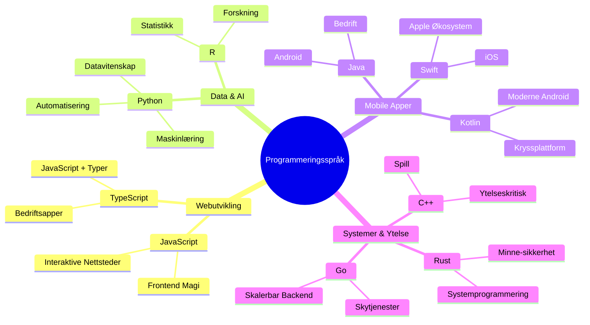
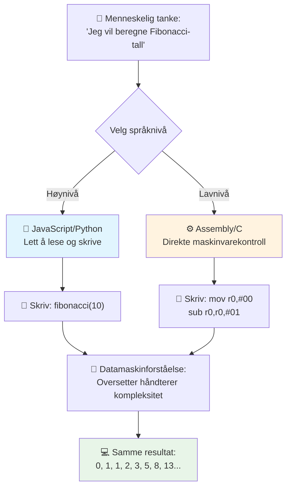
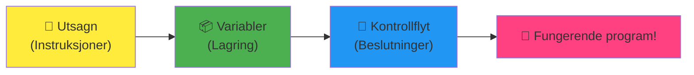
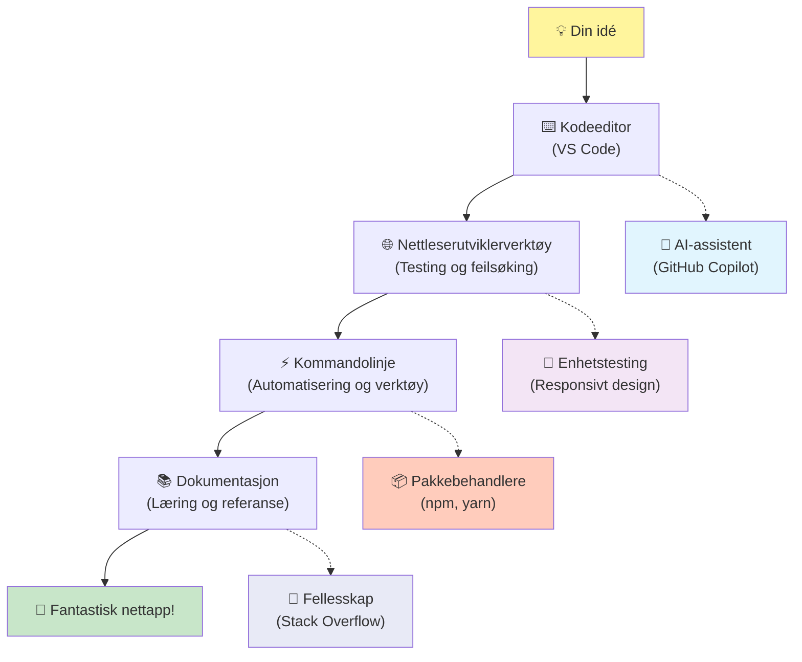
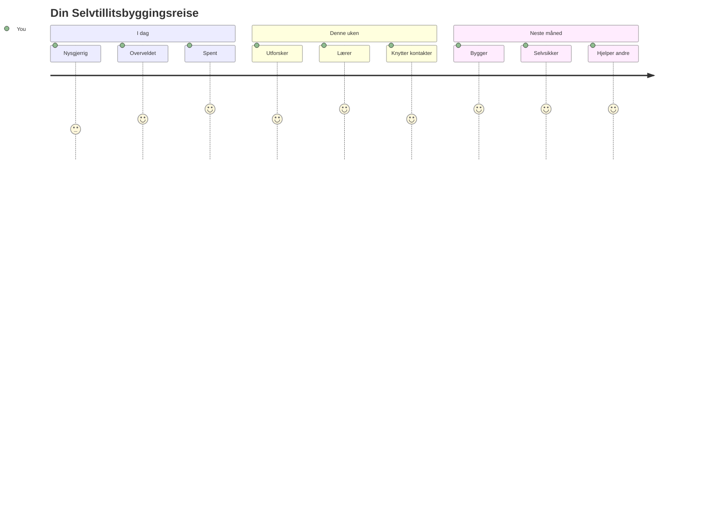

# Introduksjon til programmeringsspråk og moderne utviklerverktøy

Hei der, fremtidig utvikler! 👋 Kan jeg fortelle deg noe som fortsatt gir meg gåsehud hver eneste dag? Du er i ferd med å oppdage at programmering ikke bare handler om datamaskiner – det handler om å ha virkelige superkrefter for å realisere dine villeste ideer!

Du vet det øyeblikket når du bruker favorittappen din og alt bare klaffer perfekt? Når du trykker på en knapp og noe helt magisk skjer som får deg til å si "wow, hvordan klarte de DET?" Vel, noen akkurat som deg – antagelig sittende på sin favorittkafé klokka 2 om natten med sin tredje espresso – skrev koden som skapte den magien. Og her er det som kommer til å blåse bort hodet ditt: innen slutten av denne leksjonen vil du ikke bare forstå hvordan de gjorde det, men du vil være ivrig etter å prøve det selv!

Se, jeg skjønner helt hvis programmering føles skremmende akkurat nå. Da jeg begynte, trodde jeg ærlig talt at du måtte være et slags mattesnillegeni eller ha programmert siden du var fem år. Men her er det som helt endret perspektivet mitt: programmering er akkurat som å lære å ha samtaler på et nytt språk. Du starter med «hei» og «takk», så går du videre til å bestille kaffe, og før du vet ordet av det, fører du dype filosofiske diskusjoner! Bortsett fra at i dette tilfellet har du samtaler med datamaskiner, og ærlig talt? De er de mest tålmodige samtalepartnere du noensinne vil møte – de dømmer aldri feilene dine og er alltid klare for å prøve igjen!

I dag skal vi utforske de utrolige verktøyene som gjør moderne webutvikling ikke bare mulig, men også skikkelig vanedannende. Jeg snakker om akkurat de samme editorene, nettleserne og arbeidsflytene som utviklere hos Netflix, Spotify og ditt favoritt indie-appstudio bruker hver eneste dag. Og her er delen som kommer til å få deg til å danse lykkelig: de fleste av disse profesjonelle, industristandard verktøyene er helt gratis!


> Sketchnote av [Tomomi Imura](https://twitter.com/girlie_mac)


```mermaid
journey
    title Din programmeringsreise i dag
    section Discover
      Hva er programmering: 5: You
      Programmeringsspråk: 4: You
      Verktøyoversikt: 5: You
    section Explore
      Kodeditorer: 4: You
      Nettlesere & utviklerverktøy: 5: You
      Kommandolinje: 3: You
    section Practice
      Språketektiv: 4: You
      Verktøysutforskning: 5: You
      Fellesskapsforbindelse: 5: You
```
## La Oss Se Hva Du Allerede Kan!

Før vi hopper inn i det morsomme, er jeg nysgjerrig – hva kan du allerede om denne programmeringsverdenen? Og hør her, hvis du ser på disse spørsmålene og tenker «jeg har bokstavelig talt ikke peiling på noe av dette», så er det ikke bare greit, det er perfekt! Det betyr at du er akkurat på rett sted. Tenk på denne quizen som oppvarming før trening – vi varmer bare opp de hjerne-musklene!

[Ta pre-leksjonsquizen](https://ff-quizzes.netlify.app/web/)


## Eventyret Vi Skal Ta Sammen

Ok, jeg spretter genuint av glede over hva vi skal utforske i dag! Seriøst, jeg skulle ønske jeg kunne se ansiktet ditt når noen av disse konseptene faller på plass. Her er den utrolige reisen vi tar sammen:

- **Hva programmering egentlig er (og hvorfor det er det kuleste som finnes!)** – Vi skal oppdage hvordan kode bokstavelig talt er den usynlige magien som driver alt rundt deg, fra den alarmen som på et eller annet vis vet at det er mandag morgen til algoritmen som perfekt kuraterer Netflix-anbefalingene dine
- **Programmeringsspråk og deres fantastiske personligheter** – Tenk deg å gå inn på en fest der hver person har helt forskjellige superkrefter og måter å løse problemer på. Det er sånn programmeringsspråkverdenen er, og du kommer til å elske å møte dem!
- **De grunnleggende byggeklossene som lager digital magi** – Tenk på disse som det ultimate kreative LEGO-settet. Når du forstår hvordan disse bitene passer sammen, vil du innse at du bokstavelig talt kan bygge hva som helst fantasien din drømmer om
- **Profesjonelle verktøy som får deg til å føle at du nettopp har fått utlevert en trollmannsstav** – Jeg overdriver ikke her – disse verktøyene vil faktisk få deg til å føle at du har superkrefter, og det beste? De er de samme proffene bruker!

> 💡 **Her er saken**: Ikke engang prøv å memorere alt i dag! Akkurat nå vil jeg bare at du skal kjenne den gnisten av spenning om hva som er mulig. Detaljene vil feste seg naturlig etter hvert som vi øver sammen – sånn skjer ekte læring!

> Du kan ta denne leksjonen på [Microsoft Learn](https://learn.microsoft.com/en-us/learn/modules/web-development-101/introduction-programming/?WT.mc_id=academic-77807-sagibbon)!

## Så Hva Er Programmering Egentlig?

Ok, la oss ta det milliondollarspørsmålet: hva er egentlig programmering?

Jeg gir deg en historie som helt endret hvordan jeg tenker på dette. Forrige uke prøvde jeg å forklare til mamma hvordan man bruker den nye smart-TV-fjernkontrollen vår. Jeg tok meg selv i å si ting som «Trykk på den røde knappen, men ikke den store røde knappen, den lille røde knappen til venstre... nei, din andre venstre... ok, hold den nå i to sekunder, ikke ett, ikke tre...» Kjenner du deg igjen? 😅

Det er programmering! Det er kunsten å gi utrolig detaljerte, steg-for-steg-instruksjoner til noe som er veldig kraftfullt, men som trenger alt skrevet helt ut. Bortsett fra at i stedet for å forklare til mamma (som kan spørre "hvilken rød knapp?!"), forklarer du til en datamaskin (som bare gjør akkurat det du sier, selv om det du sa ikke helt var det du mente).

Her er det som blåste meg bort da jeg først lærte dette: datamaskiner er faktisk ganske enkle i kjernen. De forstår bokstavelig talt bare to ting – 1 og 0, som i praksis er bare "ja" og "nei" eller "på" og "av." Det er det! Men her blir det magisk – vi trenger ikke å snakke i 1 og 0 som vi er i Matrix. Det er her **programmeringsspråk** kommer til unnsetning. De er som å ha verdens beste oversetter som tar de helt normale mennesketankene dine og konverterer dem til datamaskinspråk.

Og her er det som fortsatt gir meg ekte gåsehud hver morgen når jeg våkner: bokstavelig talt *alt* digitalt i livet ditt startet med noen akkurat som deg, sannsynligvis sittende i pysjamas med en kopp kaffe, og skrev kode på sin laptop. Det Instagram-filteret som får deg til å se feilfri ut? Noen kodet det. Anbefalingen som ledet deg til din nye favorittsang? En utvikler bygde den algoritmen. Appen som hjelper deg med å dele middagsregningen med venner? Jepp, noen tenkte "dette er irriterende, jeg tror jeg kan fikse det" og så... gjorde de det!

Når du lærer å programmere, plukker du ikke bare opp en ny ferdighet – du blir en del av dette utrolige fellesskapet av problemløsere som bruker dagene sine på å tenke, "Hva om jeg kunne lage noe som gjør noens dag bare litt bedre?" Ærlig talt, er det noe som er kulere enn det?

✅ **Moro Faktasøk**: Her er noe superkult å sjekke når du har et ledig øyeblikk – hvem tror du var verdens første programmerer? Jeg gir deg et hint: det er kanskje ikke den du forventer! Historien bak denne personen er helt fascinerende og viser at programmering alltid har handlet om kreativ problemløsning og å tenke utenfor boksen.

### 🧠 **Sjekk-inn: Hvordan Har Du Det?**

**Ta et øyeblikk til å reflektere:**
- Gir idéen om å "gi instruksjoner til datamaskiner" mening for deg nå?
- Kan du tenke på en daglig oppgave du kunne tenke deg å automatisere med programmering?
- Hvilke spørsmål spinner rundt i hodet ditt om dette med programmering?

> **Husk**: Det er helt normalt om noen konsepter føles uklare akkurat nå. Å lære programmering er som å lære et nytt språk – det tar tid for hjernen din å bygge de nevrale banene. Du gjør det bra!

## Programmeringsspråk Er Som Ulike Smaker Av Magi

Ok, dette kommer til å høres rart ut, men heng med – programmeringsspråk er mye som ulike typer musikk. Tenk på det: du har jazz, som er myk og improvisert, rock som er kraftfull og direkte, klassisk som er elegant og strukturert, og hip-hop som er kreativ og uttrykksfull. Hver stil har sin egen stemning, sitt eget fellesskap av lidenskapelige fans, og hver er perfekt for forskjellige stemninger og anledninger.

Programmeringsspråk fungerer akkurat på samme måte! Du ville ikke bruke det samme språket til å lage et morsomt mobilspill som du ville brukt til å analysere enorme mengder klimadata, akkurat som du ikke ville spilt death metal på en yogatime (vel, på de fleste yogatimer, da! 😄).

Men her er noe som blåser meg bort hver gang jeg tenker på det: disse språkene er som å ha den mest tålmodige, geniale tolken i verden sittende rett ved siden av deg. Du kan uttrykke ideene dine på en måte som føles naturlig for den menneskelige hjernen, og de håndterer alt det utrolig komplekse arbeidet med å oversette det til 1 og 0 som datamaskiner faktisk snakker. Det er som å ha en venn som er perfekt flytende i både "menneskelig kreativitet" og "datamaskinlogikk" – og som aldri blir sliten, aldri trenger kaffepauser og aldri dømmer deg for å stille samme spørsmål to ganger!

### Populære Programmeringsspråk og Deres Bruksområder


```mermaid
mindmap
  root((Programmeringsspråk))
    Webutvikling
      JavaScript
        Frontend Magi
        Interaktive Nettsteder
      TypeScript
        JavaScript + Typer
        Bedriftsapper
    Data & AI
      Python
        Datavitenskap
        Maskinlæring
        Automatisering
      R
        Statistikk
        Forskning
    Mobile Apper
      Java
        Android
        Bedrift
      Swift
        iOS
        Apple Økosystem
      Kotlin
        Moderne Android
        Kryssplattform
    Systemer & Ytelse
      C++
        Spill
        Ytelseskritisk
      Rust
        Minne-sikkerhet
        Systemprogrammering
      Go
        Skytjenester
        Skalerbar Backend
```
| Språk | Best For | Hvorfor Det Er Populært |
|-------|----------|-------------------------|
| **JavaScript** | Webutvikling, brukergrensesnitt | Kjører i nettlesere og driver interaktive nettsider |
| **Python** | Datavitenskap, automatisering, AI | Lett å lese og lære, kraftige biblioteker |
| **Java** | Bedriftsapplikasjoner, Android-apper | Plattformuavhengig, robust for store systemer |
| **C#** | Windows-applikasjoner, spillutvikling | Sterk støtte i Microsoft-økosystemet |
| **Go** | Skyløsninger, backend-systemer | Raskt, enkelt, designet for moderne databehandling |

### Høynivå- vs. Lavnivåspråk

Ok, dette var ærlig talt konseptet som knuste hjernen min da jeg startet å lære, så jeg skal dele analogien som til slutt fikk det til å falle på plass for meg – og jeg håper virkelig den hjelper deg også!

Tenk deg at du besøker et land hvor du ikke snakker språket, og du desperat trenger å finne nærmeste toalett (vi har alle vært der, ikke sant? 😅):

- **Lavnivåprogrammering** er som å lære lokal dialekt så godt at du kan prate med bestemora som selger frukt på hjørnet ved å bruke kulturelle referanser, lokalt slang og interne vitser som bare noen som vokste opp der forstår. Super imponerende og utrolig effektivt... hvis du tilfeldigvis er flytende! Men ganske overveldende når du bare prøver å finne et toalett.

- **Høynivåprogrammering** er som å ha den fantastiske lokale vennen som bare skjønner deg. Du kan si "Jeg må virkelig finne et toalett" på vanlig engelsk, og de tar seg av all kulturoversettelsen og gir deg veibeskrivelse på en måte som gir perfekt mening for din ikke-lokale hjerne.

På programmeringsspråk:
- **Lavnivåspråk** (som Assembly eller C) lar deg ha utrolig detaljerte samtaler med datamaskinens faktiske maskinvare, men du må tenke som en maskin, noe som... la oss si det sånn, er et ganske stort mentalt skifte!
- **Høynivåspråk** (som JavaScript, Python eller C#) lar deg tenke som et menneske mens de håndterer maskinspråket i bakgrunnen. I tillegg har de disse utrolig inkluderende fellesskapene fulle av folk som husker hvordan det var å være nybegynner og som virkelig vil hjelpe!

Gjett hvilke jeg skal anbefale at du begynner med? 😉 Høynivåspråk er som støttesykler du aldri egentlig vil ta av fordi de gjør hele opplevelsen så mye mer hyggelig!


```mermaid
flowchart TB
    A["👤 Menneskelig tanke:<br/>'Jeg vil beregne Fibonacci-tall'"] --> B{Velg språknivå}
    
    B -->|Høynivå| C["🌟 JavaScript/Python<br/>Lett å lese og skrive"]
    B -->|Lavnivå| D["⚙️ Assembly/C<br/>Direkte maskinvarekontroll"]
    
    C --> E["📝 Skriv: fibonacci(10)"]
    D --> F["📝 Skriv: mov r0,#00<br/>sub r0,r0,#01"]
    
    E --> G["🤖 Datamaskinforståelse:<br/>Oversetter håndterer kompleksitet"]
    F --> G
    
    G --> H["💻 Samme resultat:<br/>0, 1, 1, 2, 3, 5, 8, 13..."]
    
    style C fill:#e1f5fe
    style D fill:#fff3e0
    style H fill:#e8f5e8
```
### La Meg Vise Deg Hvorfor Høynivåspråk Er Så Mye Vennligere

Ok, jeg skal til å vise deg noe som perfekt demonstrerer hvorfor jeg forelsket meg i høynivåspråk, men først – jeg trenger at du lover meg noe. Når du ser det første kodeeksempelet, ikke få panikk! Det er ment å se skremmende ut. Det er nettopp poenget mitt!

Vi skal se på akkurat den samme oppgaven skrevet i to helt forskjellige stiler. Begge lager det som kalles Fibonacci-sekvensen – det er et vakkert matematisk mønster der hvert tall er summen av de to forrige: 0, 1, 1, 2, 3, 5, 8, 13... (Moro fakta: du finner dette mønsteret bokstavelig talt overalt i naturen – solsikkefrøspiraler, kongler, til og med hvordan galakser dannes!)

Klar for å se forskjellen? La oss gå!

**Høynivåspråk (JavaScript) – Menneskevennlig:**

```javascript
// Trinn 1: Grunnleggende Fibonacci-oppsett
const fibonacciCount = 10;
let current = 0;
let next = 1;

console.log('Fibonacci sequence:');
```

**Dette gjør koden:**
- **Deklarerer** en konstant for å spesifisere hvor mange Fibonacci-tall vi ønsker å generere
- **Initialiserer** to variabler for å følge med på gjeldende og neste tall i sekvensen
- **Setter opp** startverdiene (0 og 1) som definerer Fibonacci-mønsteret
- **Viser** en overskrift for å identifisere utdataene våre

```javascript
// Trinn 2: Generer sekvensen med en løkke
for (let i = 0; i < fibonacciCount; i++) {
  console.log(`Position ${i + 1}: ${current}`);
  
  // Beregn neste tall i sekvensen
  const sum = current + next;
  current = next;
  next = sum;
}
```

**Breaking down hva som skjer her:**
- **Looper** gjennom hver posisjon i sekvensen vår ved bruk av en `for`-løkke
- **Viser** hvert tall med sin posisjon ved hjelp av template literals
- **Beregner** neste Fibonacci-tall ved å legge sammen gjeldende og neste verdi
- **Oppdaterer** variablene våre for å gå videre i iterasjonen

```javascript
// Trinn 3: Moderne funksjonell tilnærming
const generateFibonacci = (count) => {
  const sequence = [0, 1];
  
  for (let i = 2; i < count; i++) {
    sequence[i] = sequence[i - 1] + sequence[i - 2];
  }
  
  return sequence;
};

// Brukseksempel
const fibSequence = generateFibonacci(10);
console.log(fibSequence);
```

**I koden over har vi:**
- **Opprettet** en gjenbrukbar funksjon med moderne piltast-syntaks
- **Bygget** et array for å lagre hele sekvensen i stedet for å vise ett tall om gangen
- **Brukt** arrayindeksering for å regne ut hvert nytt tall ut fra tidligere verdier
- **Returnert** hele sekvensen for fleksibel bruk i andre deler av programmet vårt

**Lavnivåspråk (ARM Assembly) – Datamaskinvennlig:**

```assembly
 area ascen,code,readonly
 entry
 code32
 adr r0,thumb+1
 bx r0
 code16
thumb
 mov r0,#00
 sub r0,r0,#01
 mov r1,#01
 mov r4,#10
 ldr r2,=0x40000000
back add r0,r1
 str r0,[r2]
 add r2,#04
 mov r3,r0
 mov r0,r1
 mov r1,r3
 sub r4,#01
 cmp r4,#00
 bne back
 end
```

Legg merke til hvordan JavaScript-versjonen nesten leses som engelske instruksjoner, mens Assembly-versjonen bruker kryptiske kommandoer som direkte kontrollerer datamaskinens prosessor. Begge utfører akkurat samme oppgave, men høynivåspråket er mye enklere for mennesker å forstå, skrive og vedlikeholde.

**Nøkkelforskjeller du vil legge merke til:**
- **Lesbarhet**: JavaScript bruker beskrivende navn som `fibonacciCount` mens Assembly bruker kryptiske etiketter som `r0`, `r1`
- **Kommentarer**: Høynivåspråk oppmuntrer til forklarende kommentarer som gjør koden selvforklarende
- **Struktur**: JavaScripts logiske flyt samsvarer med hvordan mennesker tenker på problemer steg for steg
- **Vedlikehold**: Å oppdatere JavaScript-versjonen for ulike krav er enkelt og tydelig

✅ **Om Fibonacci-sekvensen**: Dette absolutt vakre tallmønsteret (der hvert tall er summen av de to forrige: 0, 1, 1, 2, 3, 5, 8...) dukker opp bokstavelig talt *overalt* i naturen! Du finner det i solsikkespiraler, konglemønstre, måten nautilusskall krøller seg på, og til og med i hvordan greinene på trær vokser. Det er ganske utrolig hvordan matematikk og koding kan hjelpe oss å forstå og gjenskape mønstrene som naturen bruker for å skape skjønnhet!


## Byggeklossene som får magien til å skje

Greit, nå som du har sett hvordan programmeringsspråk ser ut i praksis, la oss bryte ned de grunnleggende delene som utgjør bokstavelig talt alle programmer som noen gang er skrevet. Tenk på disse som de essensielle ingrediensene i favorittoppskriften din – når du forstår hva hver enkelt gjør, vil du kunne lese og skrive kode i omtrent hvilket som helst språk!

Dette er litt som å lære programmeringens grammatikk. Husker du på skolen da du lærte om substantiv, verb og hvordan sette sammen setninger? Programmering har sin egen versjon av grammatikk, og ærlig talt, den er mye mer logisk og tilgivende enn engelsk grammatikk noen gang var! 😄

### Utsagn: Steg-for-steg-instruksjoner

La oss starte med **utsagn** – disse er som individuelle setninger i en samtale med datamaskinen din. Hvert utsagn forteller datamaskinen å gjøre én spesifikk ting, litt som å gi veibeskrivelser: «Ta til venstre her», «Stopp på det røde lyset», «Parkér på den plassen.»

Det jeg liker med utsagn er hvor lesbare de vanligvis er. Sjekk dette:

```javascript
// Grunnleggende setninger som utfører enkelt handlinger
const userName = "Alex";                    
console.log("Hello, world!");              
const sum = 5 + 3;                         
```

**Dette gjør koden:**
- **Deklarer** en konstant variabel for å lagre brukerens navn
- **Viser** en hilsen i konsollutgangen
- **Beregner** og lagrer resultatet av en matematisk operasjon

```javascript
// Utsagn som samhandler med nettsider
document.title = "My Awesome Website";      
document.body.style.backgroundColor = "lightblue";
```

**Steg for steg, dette skjer:**
- **Endrer** nettsidens tittel som vises i nettleserfanen
- **Bytter** bakgrunnsfargen til hele sidens kropp

### Variabler: Programmets minnesystem

Ok, **variabler** er ærlig talt en av mine absolutte favorittkonsepter å lære bort fordi de er så veldig like ting du allerede bruker hver eneste dag!

Tenk på telefonens kontaktliste et øyeblikk. Du husker ikke alle telefonnumrene – i stedet lagrer du “Mamma,” “Bestevenn,” eller “Pizzeriaen som leverer til kl 2” og lar telefonen huske de faktiske tallene. Variabler fungerer akkurat på samme måte! De er som merkede beholdere hvor programmet ditt kan lagre informasjon og hente det senere ved hjelp av et navn som faktisk gir mening.

Det som er så kult: variabler kan endre seg mens programmet kjører (derav navnet "variabel" – ser du hva de gjorde der?). Akkurat som du kanskje oppdaterer pizzeria-kontakten når du finner et enda bedre sted, kan variabler oppdateres når programmet lærer ny informasjon eller situasjonen endrer seg!

La meg vise deg hvor vakkert enkelt dette kan være:

```javascript
// Trinn 1: Opprette grunnleggende variabler
const siteName = "Weather Dashboard";        
let currentWeather = "sunny";               
let temperature = 75;                       
let isRaining = false;                      
```

**Forstå disse konseptene:**
- **Lagre** uforanderlige verdier i `const`-variabler (som nettstednavn)
- **Bruk** `let` for verdier som kan endres i programmet ditt
- **Tildel** forskjellige datatyper: strenger (tekst), tall og boolske (true/false)
- **Velg** beskrivende navn som forklarer hva hver variabel inneholder

```javascript
// Trinn 2: Arbeide med objekter for å gruppere relatert data
const weatherData = {                       
  location: "San Francisco",
  humidity: 65,
  windSpeed: 12
};
```

**I eksempelet over har vi:**
- **Opprettet** et objekt for å samle relatert værinformasjon
- **Organisert** flere data under ett variabelnavn
- **Brukt** nøkkel-verdi-par for å merke hver informasjon tydelig

```javascript
// Trinn 3: Bruke og oppdatere variabler
console.log(`${siteName}: Today is ${currentWeather} and ${temperature}°F`);
console.log(`Wind speed: ${weatherData.windSpeed} mph`);

// Oppdatering av endringsbare variabler
currentWeather = "cloudy";                  
temperature = 68;                          
```

**La oss forstå hver del:**
- **Viser** informasjon med mal-litteraler med `${}`-syntaks
- **Henter** objekt-egenskaper med punkt-notation (`weatherData.windSpeed`)
- **Oppdaterer** variabler deklarert med `let` for å reflektere endrede forhold
- **Kombinerer** flere variabler for å lage meningsfulle meldinger

```javascript
// Trinn 4: Moderne destrukturering for renere kode
const { location, humidity } = weatherData; 
console.log(`${location} humidity: ${humidity}%`);
```

**Det du må vite:**
- **Trekk ut** spesifikke egenskaper fra objekter med destructuring-tilordning
- **Opprett** nye variabler automatisk med samme navn som objektets nøkler
- **Forenkle** koden ved å unngå repetitiv punkt-notation

### Kontrollflyt: Lær programmet ditt å tenke

Ok, nå begynner programmering å bli helt fantastisk! **Kontrollflyt** er egentlig å lære programmet ditt å ta smarte avgjørelser, akkurat som du gjør hver dag uten å tenke over det.

Tenk deg dette: i morges gikk du sannsynligvis gjennom noe som «Hvis det regner, tar jeg med paraply. Hvis det er kaldt, tar jeg på jakke. Hvis jeg er sen, dropper jeg frokost og tar kaffe på vei.» Hjernen din følger naturlig denne hvis-så-logikken dusinvis av ganger daglig!

Dette gjør at programmer føles intelligente og levende i stedet for bare å følge kjedelige, forutsigbare skript. De kan faktisk vurdere en situasjon, evaluere hva som skjer, og svare passende. Det er som å gi programmet ditt en hjerne som kan tilpasse seg og ta valg!

Vil du se hvor vakkert dette fungerer? La meg vise deg:

```javascript
// Trinn 1: Grunnleggende betinget logikk
const userAge = 17;

if (userAge >= 18) {
  console.log("You can vote!");
} else {
  const yearsToWait = 18 - userAge;
  console.log(`You'll be able to vote in ${yearsToWait} year(s).`);
}
```

**Dette gjør koden:**
- **Sjekker** om brukerens alder oppfyller stemmerettskravet
- **Utfører** ulike kodeblokker basert på resultatet av betingelsen
- **Beregner** og viser hvor lenge det er til brukeren kan stemme hvis under 18
- **Gir** spesifikk og hjelpsom tilbakemelding for hver situasjon

```javascript
// Trinn 2: Flere betingelser med logiske operatorer
const userAge = 17;
const hasPermission = true;

if (userAge >= 18 && hasPermission) {
  console.log("Access granted: You can enter the venue.");
} else if (userAge >= 16) {
  console.log("You need parent permission to enter.");
} else {
  console.log("Sorry, you must be at least 16 years old.");
}
```

**Dette skjer i detalj:**
- **Kombinerer** flere betingelser med `&&` (og) operatoren
- **Lager** et hierarki av betingelser med `else if` for flere scenarier
- **Håndterer** alle mulige tilfeller med en endelig `else`-setning
- **Gir** klar, nyttig tilbakemelding for hver situasjon

```javascript
// Trinn 3: Konsis betingelse med ternær operator
const votingStatus = userAge >= 18 ? "Can vote" : "Cannot vote yet";
console.log(`Status: ${votingStatus}`);
```

**Dette må du huske:**
- **Bruk** ternær-operatoren (`? :`) for enkle to-alternativer-betingelser
- **Skriv** betingelsen først, så `?`, deretter sant resultat, så `:`, og til slutt usant resultat
- **Bruk** dette mønsteret når du må tildele verdier basert på betingelser

```javascript
// Trinn 4: Håndtering av flere spesifikke tilfeller
const dayOfWeek = "Tuesday";

switch (dayOfWeek) {
  case "Monday":
  case "Tuesday":
  case "Wednesday":
  case "Thursday":
  case "Friday":
    console.log("It's a weekday - time to work!");
    break;
  case "Saturday":
  case "Sunday":
    console.log("It's the weekend - time to relax!");
    break;
  default:
    console.log("Invalid day of the week");
}
```

**Koden gjør følgende:**
- **Samsvarer** variabelverdi med flere spesifikke tilfeller
- **Grupperer** like tilfeller sammen (hverdager vs. helger)
- **Utfører** korrekt kodeblokk når et treff finnes
- **Inkluderer** en `default`-saksbehandling for uventede verdier
- **Bruker** `break`-setninger for å unngå at koden fortsetter til neste tilfelle

> 💡 **Virkelighetsanalogien**: Tenk på kontrollflyt som å ha verdens mest tålmodige GPS som gir deg retninger. Den kan si «Hvis det er trafikk i hovedgaten, ta motorveien i stedet. Hvis veiarbeid blokkerer motorveien, prøv den naturskjønne veien.» Programmer bruker akkurat samme type betingede logikk for å svare intelligent på ulike situasjoner og alltid gi brukerne best mulig opplevelse.

### 🎯 **Konseptsjekk: Beherske byggeklossene**

**La oss se hvordan det går med det grunnleggende:**
- Kan du forklare forskjellen mellom en variabel og et utsagn med egne ord?
- Tenk på et reelt scenario der du ville brukt en hvis-så-beslutning (som stemmeeksempelet vårt)
- Hva er én ting ved programmeringslogikk som overrasket deg?

**Rask selvtillitsboost:**

```mermaid
flowchart LR
    A["📝 Utsagn<br/>(Instruksjoner)"] --> B["📦 Variabler<br/>(Lagring)"] --> C["🔀 Kontrollflyt<br/>(Beslutninger)"] --> D["🎉 Fungerende program!"]
    
    style A fill:#ffeb3b
    style B fill:#4caf50
    style C fill:#2196f3
    style D fill:#ff4081
```
✅ **Hva som kommer nå**: Vi skal ha en kjempegøy tid med å utforske disse konseptene enda mer sammen! Akkurat nå, bare kjenn på spenningen over alle de fantastiske mulighetene som ligger foran deg. De spesifikke ferdighetene og teknikkene kommer naturlig når vi øver sammen – jeg lover dette blir mye morsommere enn du kanskje tror!

## Verktøyene i yrket

Dette er ærlig talt stedet jeg blir så oppstemt at jeg nesten ikke klarer å holde meg! 🚀 Nå skal vi snakke om de utrolige verktøyene som kommer til å få deg til å føle at du nettopp har fått nøklene til et digitalt romskip.

Vet du hvordan en kokk har de perfekt balanserte knivene som føles som forlengelser av hendene? Eller hvordan en musiker har den gitaren som ser ut til å synge så snart de rører ved den? Vel, utviklere har sin versjon av disse magiske verktøyene, og her kommer det som kommer til å blåse hodet ditt – de fleste er helt gratis!

Jeg sitter nesten og hopper i stolen av å tenke på å dele disse med deg fordi de har revolusjonert hvordan vi bygger programvare. Vi snakker om AI-drevne kodeassistenter som kan hjelpe deg å skrive koden din (jeg tuller ikke!), skybaserte miljøer hvor du kan bygge hele applikasjoner bokstavelig talt fra hvor som helst med Wi-Fi, og feilsøkingsverktøy så sofistikerte at det er som å ha røntgensyn for programmene dine.

Og her er delen som fortsatt gir meg gåsehud: dette er ikke "begynnerverktøy" som du vokser ut av. Dette er akkurat de samme profesjonelle verktøyene som utviklere hos Google, Netflix og det indie app-studioet du elsker bruker akkurat nå. Du kommer til å føle deg som en skikkelig proff når du bruker dem!


```mermaid
graph TD
    A["💡 Din idé"] --> B["⌨️ Kodeeditor<br/>(VS Code)"] 
    B --> C["🌐 Nettleserutviklerverktøy<br/>(Testing og feilsøking)"]
    C --> D["⚡ Kommandolinje<br/>(Automatisering og verktøy)"]
    D --> E["📚 Dokumentasjon<br/>(Læring og referanse)"]
    E --> F["🚀 Fantastisk nettapp!"]
    
    B -.-> G["🤖 AI-assistent<br/>(GitHub Copilot)"]
    C -.-> H["📱 Enhetstesting<br/>(Responsivt design)"]
    D -.-> I["📦 Pakkebehandlere<br/>(npm, yarn)"]
    E -.-> J["👥 Fellesskap<br/>(Stack Overflow)"]
    
    style A fill:#fff59d
    style F fill:#c8e6c9
    style G fill:#e1f5fe
    style H fill:#f3e5f5
    style I fill:#ffccbc
    style J fill:#e8eaf6
```
### Kodeeditorer og IDE-er: Dine nye digitale bestevenner

La oss snakke om kodeeditorer – disse kommer seriøst til å bli dine nye favorittsteder å henge! Tenk på dem som din personlige kodesanctuary hvor du vil bruke mesteparten av tiden din på å skape og perfeksjonere dine digitale kreasjoner.

Men her er det som er helt magisk med moderne editorer: de er ikke bare fine teksteditorer. De er som å ha den smarteste, mest støttende kode-mentoren sittende rett ved siden av deg 24/7. De fanger opp skrivefeil før du engang legger merke til dem, foreslår forbedringer som får deg til å se ut som et geni, hjelper deg å forstå hva hver del av koden gjør, og noen av dem kan til og med forutsi hva du er i ferd med å skrive og tilby å fullføre tankene dine!

Jeg husker den første gangen jeg oppdaget autofullføring – jeg følte virkelig at jeg levde i fremtiden. Du begynner å skrive noe, og editoren sier, «Hei, tenkte du på denne funksjonen som gjør akkurat det du trenger?» Det er som å ha en tankeleser som kodingkompis!

**Hva gjør disse editorene så utrolige?**

Moderne kodeeditorer tilbyr et imponerende utvalg av funksjoner designet for å øke produktiviteten din:

| Funksjon | Hva den gjør | Hvorfor det hjelper |
|---------|--------------|--------------|
| **Syntax Highlighting** | Farger ulike deler av koden din | Gjør koden enklere å lese og oppdage feil |
| **Auto-completion** | Foreslår kode mens du skriver | Farter opp koding og reduserer tastefeil |
| **Debugging Tools** | Hjelper deg å finne og rette feil | Spar timer med feilsøking |
| **Extensions** | Legger til spesialiserte funksjoner | Tilpass editoren for hvilken som helst teknologi |
| **AI Assistants** | Foreslår kode og forklaringer | Fremskynder læring og produktivitet |

> 🎥 **Videoressurs**: Vil du se disse verktøyene i praksis? Sjekk ut denne [Tools of the Trade video](https://youtube.com/watch?v=69WJeXGBdxg) for en grundig gjennomgang.

#### Anbefalte editorer for nettutvikling

**[Visual Studio Code](https://code.visualstudio.com/?WT.mc_id=academic-77807-sagibbon)** (Gratis)
- Mest populær blant webutviklere
- Utmerket utvidelsesøkosystem
- Innebygd terminal og Git-integrasjon
- **Må-ha-utvidelser**:
  - [GitHub Copilot](https://marketplace.visualstudio.com/items?itemName=GitHub.copilot) - AI-drevne kodeforslag
  - [Live Share](https://marketplace.visualstudio.com/items?itemName=MS-vsliveshare.vsliveshare) - Samarbeid i sanntid
  - [Prettier](https://marketplace.visualstudio.com/items?itemName=esbenp.prettier-vscode) - Automatisk kodeformatering
  - [Code Spell Checker](https://marketplace.visualstudio.com/items?itemName=streetsidesoftware.code-spell-checker) - Fanger stavefeil i koden

**[JetBrains WebStorm](https://www.jetbrains.com/webstorm/)** (Betalt, gratis for studenter)
- Avanserte verktøy for feilsøking og testing
- Intelligente kodefullføringer
- Innebygd versjonskontroll

**Skybaserte IDE-er** (Ulike priser)
- [GitHub Codespaces](https://github.com/features/codespaces) - Full VS Code i nettleseren
- [Replit](https://replit.com/) - Flott for læring og deling av kode
- [StackBlitz](https://stackblitz.com/) - Umiddelbar, fullstack webutvikling

> 💡 **Kom i gang-tips**: Start med Visual Studio Code – det er gratis, mye brukt i bransjen, og har et enormt fellesskap som lager hjelpsomme opplæringer og utvidelser.


### Nettlesere: Ditt hemmelige utviklingslaboratorium

Ok, gjør deg klar til å få tankene blåst helt bort! Du vet hvordan du bruker nettlesere til å bla gjennom sosiale medier og se videoer? Vel, det viser seg at de har skjult dette utrolige hemmelige utviklingslaboratoriet hele tiden, bare ventet på at du skulle oppdage det!

Hver gang du høyreklikker på en nettside og velger «Inspiser element», åpner du en skjult verden av utviklerverktøy som ærlig talt er kraftigere enn noen dyr programvare jeg pleide å betale hundrevis av dollar for. Det er som å oppdage at ditt vanlige kjøkken har skjult et profesjonelt kokkelaboratorium bak en hemmelig panel!
Første gang noen viste meg nettleserens DevTools, brukte jeg nesten tre timer på å bare klikke rundt og si "VENT, KAN DEN GJØRE DET OGSÅ?!" Du kan bokstavelig talt redigere hvilken som helst nettside i sanntid, se nøyaktig hvor raskt alt laster, teste hvordan siden din ser ut på ulike enheter, og til og med feilsøke JavaScript som en ekte proff. Det er helt utrolig!

**Her er hvorfor nettlesere er ditt hemmelige våpen:**

Når du lager en nettside eller webapplikasjon, må du se hvordan den ser ut og oppfører seg i den virkelige verden. Nettlesere viser ikke bare arbeidet ditt, men gir også detaljert tilbakemelding om ytelse, tilgjengelighet og potensielle problemer.

#### Nettleserens utviklerverktøy (DevTools)

Moderne nettlesere inneholder omfattende utviklerverktøy:

| Verktøykategori | Hva det gjør | Eksempel på bruk |
|-----------------|--------------|------------------|
| **Elementinspektør** | Se og rediger HTML/CSS i sanntid | Juster styling for å se umiddelbare resultater |
| **Konsoll** | Vis feilmeldinger og test JavaScript | Feilsøk problemer og eksperimenter med kode |
| **Nettverksmonitor** | Følg hvordan ressurser lastes | Optimaliser ytelse og lastetider |
| **Tilgjengelighetssjekker** | Test for inkluderende design | Sørg for at siden fungerer for alle brukere |
| **Enhetssimulator** | Forhåndsvis på forskjellige skjermstørrelser | Test responsivt design uten flere enheter |

#### Anbefalte nettlesere for utvikling

- **[Chrome](https://developers.google.com/web/tools/chrome-devtools/)** - Industri-standard DevTools med omfattende dokumentasjon
- **[Firefox](https://developer.mozilla.org/docs/Tools)** - Fremragende CSS Grid og tilgjengelighetsverktøy
- **[Edge](https://docs.microsoft.com/microsoft-edge/devtools-guide-chromium/?WT.mc_id=academic-77807-sagibbon)** - Bygget på Chromium med Microsofts utviklerressurser

> ⚠️ **Viktig testetips**: Test alltid nettstedene dine i flere nettlesere! Det som fungerer perfekt i Chrome kan se annerledes ut i Safari eller Firefox. Profesjonelle utviklere tester på tvers av alle store nettlesere for å sikre en konsekvent brukeropplevelse.


### Kommandolinjeverktøy: Din inngangsport til superkrefter som utvikler

Ok, la oss være helt ærlige her om kommandolinjen, fordi jeg vil at du skal høre dette fra noen som virkelig forstår det. Da jeg først så den – bare denne skumle svarte skjermen med blinkende tekst – tenkte jeg bokstavelig talt, "Nei, absolutt ikke! Dette ser ut som noe fra en hackerfilm på 80-tallet, og jeg er virkelig ikke smart nok for dette!" 😅

Men her er hva jeg skulle ønske noen hadde fortalt meg da, og som jeg sier til deg nå: kommandolinjen er ikke skummel – det er faktisk som å ha en direkte samtale med datamaskinen din. Tenk på det som forskjellen mellom å bestille mat gjennom en fancy app med bilder og menyer (som er fint og enkelt) versus å gå inn på din lokale favorittrestaurant hvor kokken vet nøyaktig hva du liker og kan trylle fram noe perfekt bare fordi du sier "overrask meg med noe fantastisk."

Kommandolinjen er stedet utviklere går for å føle seg som ekte trollmenn. Du skriver noen tilsynelatende magiske ord (okei, det er bare kommandoer, men de føles magiske!), trykker enter, og BOOM – du har laget hele prosjektstrukturer, installert kraftige verktøy fra hele verden, eller publisert appen din til internett for millioner av mennesker å se. Når du først smaker på den kraften, er det ærlig talt ganske vanedannende!

**Hvorfor kommandolinjen vil bli ditt favorittverktøy:**

Mens grafiske grensesnitt er flotte for mange oppgaver, utmerker kommandolinjen seg på automatisering, presisjon og hastighet. Mange utviklerverktøy fungerer hovedsakelig via kommandolinjegrensesnitt, og å lære å bruke dem effektivt kan dramatisk forbedre produktiviteten din.

```bash
# Trinn 1: Opprett og naviger til prosjektkatalogen
mkdir my-awesome-website
cd my-awesome-website
```

**Dette gjør koden:**
- **Opprett** en ny katalog som heter "my-awesome-website" for prosjektet ditt
- **Gå inn** i den nyopprettede katalogen for å starte arbeidet

```bash
# Trinn 2: Initialiser prosjektet med package.json
npm init -y

# Installer moderne utviklingsverktøy
npm install --save-dev vite prettier eslint
npm install --save-dev @eslint/js
```

**Steg for steg, dette skjer:**
- **Initialiserer** et nytt Node.js-prosjekt med standardinnstillinger ved bruk av `npm init -y`
- **Installerer** Vite som et moderne byggverktøy for rask utvikling og produksjonsbygg
- **Legger til** Prettier for automatisk kodeformatering og ESLint for kodekvalitetssjekker
- **Bruker** flagget `--save-dev` for å markere disse som utviklingsavhengigheter

```bash
# Steg 3: Opprett prosjektstruktur og filer
mkdir src assets
echo '<!DOCTYPE html><html><head><title>My Site</title></head><body><h1>Hello World</h1></body></html>' > index.html

# Start utviklingsserver
npx vite
```

**I eksempelet over har vi:**
- **Organisert** prosjektet ved å lage separate mapper for kildekode og ressurser
- **Generert** en grunnleggende HTML-fil med korrekt dokumentstruktur
- **Startet** Vite utviklingsserver for live oppdatering og hot module replacement

#### Essensielle kommandolinjeverktøy for webutvikling

| Verktøy | Formål | Hvorfor du trenger det |
|---------|--------|-----------------------|
| **[Git](https://git-scm.com/)** | Versjonskontroll | Spor endringer, samarbeid med andre, sikkerhetskopier arbeidet ditt |
| **[Node.js & npm](https://nodejs.org/)** | JavaScript runtime og pakkebehandling | Kjør JavaScript utenfor nettlesere, installer moderne utviklerverktøy |
| **[Vite](https://vitejs.dev/)** | Byggverktøy og utviklingsserver | Lynrask utvikling med hot module replacement |
| **[ESLint](https://eslint.org/)** | Kodekvalitet | Finn og fiks problemer automatisk i JavaScript-koden din |
| **[Prettier](https://prettier.io/)** | Kodeformatering | Hold koden din konsekvent formatert og lettlest |

#### Plattformspesifikke alternativer

**Windows:**
- **[Windows Terminal](https://docs.microsoft.com/windows/terminal/?WT.mc_id=academic-77807-sagibbon)** - Moderne, funksjonsrik terminal
- **[PowerShell](https://docs.microsoft.com/powershell/?WT.mc_id=academic-77807-sagibbon)** 💻 - Kraftig skriptingsmiljø
- **[Command Prompt](https://learn.microsoft.com/windows-server/administration/windows-commands/windows-commands)** 💻 - Tradisjonell Windows-kommandolinje

**macOS:**
- **[Terminal](https://support.apple.com/guide/terminal/)** 💻 - Innebygd terminalapplikasjon
- **[iTerm2](https://iterm2.com/)** - Forbedret terminal med avanserte funksjoner

**Linux:**
- **[Bash](https://www.gnu.org/software/bash/)** 💻 - Standard Linux-kommandoshell
- **[KDE Konsole](https://docs.kde.org/trunk5/en/konsole/konsole/index.html)** - Avansert terminalemulator

> 💻 = Forinstallert i operativsystemet

> 🎯 **Læringsvei**: Start med grunnleggende kommandoer som `cd` (endre katalog), `ls` eller `dir` (liste filer), og `mkdir` (lag mappe). Øv deg på moderne arbeidsflytkommandoer som `npm install`, `git status`, og `code .` (åpner nåværende katalog i VS Code). Når du blir mer komfortabel, vil du naturlig lære mer avanserte kommandoer og automatiseringsteknikker.


### Dokumentasjon: Din alltid tilgjengelige læringsmentor

Ok, la meg dele en liten hemmelighet som kommer til å få deg til å føle deg mye bedre som nybegynner: selv de mest erfarne utviklerne bruker enorme mengder tid på å lese dokumentasjon. Og det er ikke fordi de ikke vet hva de gjør – det er faktisk et tegn på klokskap!

Tenk på dokumentasjon som verdens mest tålmodige, kunnskapsrike lærere som er tilgjengelige 24/7. Står fast ved et problem klokka to om natta? Dokumentasjonen er der med en varm virtuell klem og akkurat det svaret du trenger. Vil du lære om noen kule nye funksjoner som alle snakker om? Dokumentasjonen støtter deg med steg-for-steg eksempler. Prøver du å forstå hvorfor noe fungerer som det gjør? Du gjettet det – dokumentasjonen forklarer det på en måte som endelig får det til å falle på plass!

Her er noe som helt endret mitt perspektiv: webutviklingsverdenen beveger seg utrolig raskt, og ingen (absolutt ingen!) husker alt utenat. Jeg har sett seniorutviklere med over 15 års erfaring slå opp på grunnleggende syntaks, og vet du hva? Det er ikke pinlig – det er smart! Det handler ikke om å ha et perfekt minne; det handler om å vite hvor du finner pålitelige svar raskt og forstå hvordan du bruker dem.

**Her skjer magien:**

Profesjonelle utviklere bruker mye tid på å lese dokumentasjon – ikke fordi de ikke vet hva de gjør, men fordi webutviklingslandskapet forandrer seg så raskt at det krever kontinuerlig læring for å holde seg oppdatert. God dokumentasjon hjelper deg å forstå ikke bare *hvordan* du bruker noe, men *hvorfor* og *når* du skal bruke det.

#### Essensielle dokumentasjonsressurser

**[Mozilla Developer Network (MDN)](https://developer.mozilla.org/docs/Web)**
- Gullstandarden for dokumentasjon om webteknologi
- Omfattende veiledninger for HTML, CSS og JavaScript
- Inkluderer informasjon om nettleserkompatibilitet
- Har praktiske eksempler og interaktive demoer

**[Web.dev](https://web.dev)** (av Google)
- Moderne beste praksis innen webutvikling
- Veiledninger for ytelsesoptimalisering
- Tilgjengelighet og inkluderende designprinsipper
- Casestudier fra virkelige prosjekter

**[Microsoft Developer Documentation](https://docs.microsoft.com/microsoft-edge/#microsoft-edge-for-developers)**
- Ressurser for Edge-nettleserutvikling
- Veiledninger for Progressive Web Apps
- Innsikt i kryssplattformutvikling

**[Frontend Masters Learning Paths](https://frontendmasters.com/learn/)**
- Strukturerte læringsplaner
- Videokurs fra bransjeeksperter
- Praktiske kodeøvelser

> 📚 **Studietips**: Ikke prøv å huske dokumentasjonen utenat – lær hvordan du navigerer den effektivt. Bokmerk ofte brukte referanser og øv på å bruke søkefunksjoner for å finne spesifikk informasjon raskt.

### 🔧 **Verktøymesterskap: Hva appellerer mest til deg?**

**Ta et øyeblikk for å tenke over:**
- Hvilket verktøy gleder du deg mest til å prøve først? (Det finnes ikke noe galt svar!)
- Føles kommandolinjen fortsatt skremmende, eller er du nysgjerrig på den?
- Kan du se for deg å bruke nettleserens DevTools for å titte bak kulissene på dine favorittnettsider?


```mermaid
pie title "Utviklertid brukt med verktøy"
    "Kodeeditor" : 40
    "Nettlesertesting" : 25
    "Kommando-linje" : 15
    "Lese dokumentasjon" : 15
    "Feilsøking" : 5
```
> **Morsom innsikt**: De fleste utviklere bruker omtrent 40% av tiden sin i kodeeditoren, men merk hvor mye tid som går til testing, læring og problemløsning. Programmering handler ikke bare om å skrive kode – det handler om å skape gode opplevelser!

✅ **Tankevekkende**: Her er noe interessant å tenke på – hvordan tror du verktøyene for å bygge nettsider (utvikling) kan være forskjellige fra verktøyene for å designe hvordan de ser ut (design)? Det er som forskjellen på en arkitekt som tegner et vakkert hus, og entreprenøren som faktisk bygger det. Begge er viktige, men har forskjellige verktøykasser! Denne typen tenkning vil virkelig hjelpe deg å se det større bildet av hvordan nettsider blir til.

## GitHub Copilot Agent-utfordring 🚀

Bruk Agent-modus for å fullføre følgende utfordring:

**Beskrivelse:** Utforsk funksjonene til en moderne kodeeditor eller IDE og demonstrer hvordan den kan forbedre arbeidsflyten din som webutvikler.

**Oppgave:** Velg en kodeeditor eller IDE (for eksempel Visual Studio Code, WebStorm eller en skybasert IDE). List opp tre funksjoner eller utvidelser som hjelper deg å skrive, feilsøke eller vedlikeholde kode mer effektivt. For hver, gi en kort forklaring på hvordan det gagner arbeidsflyten din.

---

## 🚀 Utfordring

**Ok, detektiv, klar for din første sak?**

Nå som du har dette fantastiske grunnlaget, har jeg et eventyr som skal hjelpe deg å se hvor utrolig mangfoldig og fascinerende programmeringsverdenen virkelig er. Og hør her – dette handler ikke om å skrive kode ennå, så ikke stress! Tenk på deg selv som en detektiv innen programmeringsspråk på din aller første spennende sak!

**Din oppgave, hvis du velger å ta den:**
1. **Bli en språkutforsker**: Velg tre programmeringsspråk fra helt forskjellige universer – kanskje ett som lager nettsider, ett som lager mobilapper, og ett som knuser data for forskere. Finn eksempler på samme enkle oppgave skrevet i hvert språk. Jeg lover at du kommer til å bli helt forbløffet over hvor forskjellige de kan se ut, selv om de gjør akkurat det samme!

2. **Avdekk deres opprinnelseshistorier**: Hva gjør hvert språk spesielt? Her er en kul fakta – hvert eneste programmeringsspråk ble laget fordi noen tenkte, "Vet du hva? Det må finnes en bedre måte å løse dette spesifikke problemet på." Klarer du å finne ut hvilke problemer det var? Noen av historiene er virkelig fascinerende!

3. **Møt fellesskapene**: Sjekk hvor imøtekommende og lidenskapelige de forskjellige språkfellesskapene er. Noen har millioner av utviklere som deler kunnskap og hjelper hverandre, andre er mindre, men utrolig sammensveisede og støttende. Du kommer til å elske å se de forskjellige personlighetene disse fellesskapene har!

4. **Følg magefølelsen**: Hvilket språk føles mest tilgjengelig for deg akkurat nå? Ikke stress med å ta det "perfekte" valget – hør bare på instinktene dine! Det finnes ærlig talt ikke noe galt svar her, og du kan alltid utforske flere senere.

**Bonus detektivarbeid**: Se om du kan finne ut hvilke store nettsteder eller apper som er bygget med hvert språk. Jeg garanterer at du vil bli sjokkert over å lære hva som driver Instagram, Netflix eller det mobilspillet du ikke klarer å slutte å spille!

> 💡 **Husk**: Du prøver ikke å bli ekspert på noen av disse språkene i dag. Du skal bare bli kjent med nabolaget før du bestemmer deg for hvor du vil slå deg ned. Ta deg god tid, ha det gøy, og la nysgjerrigheten lede deg!

## La oss feire det du har oppdaget!

Jøss, du har tatt til deg så mye utrolig informasjon i dag! Jeg er oppriktig spent på å se hvor mye av denne fantastiske reisen som har festet seg hos deg. Og husk – dette er ikke en prøve hvor du må få alt riktig. Dette er mer som en feiring av alt det kule du har lært om denne fascinerende verdenen du snart skal dykke inn i!

[Ta etter-leksjon-quizen](https://ff-quizzes.netlify.app/web/)

## Gjennomgang & Selvstudium

**Ta den tiden du trenger for å utforske og ha det gøy!**
Du har dekket mye i dag, og det er noe å være stolt av! Nå kommer den morsomme delen – å utforske de temaene som vekket nysgjerrigheten din. Husk, dette er ikke lekser – det er et eventyr!

**Fordyp deg i det som begeistrer deg:**

**Prøv deg på programmeringsspråk:**
- Besøk de offisielle nettsidene til 2-3 språk som fanget oppmerksomheten din. Hvert av dem har sin egen personlighet og historie!
- Prøv noen nettbaserte koding-lekeplasser som [CodePen](https://codepen.io/), [JSFiddle](https://jsfiddle.net/), eller [Replit](https://replit.com/). Ikke vær redd for å eksperimentere – du kan ikke ødelegge noe!
- Les om hvordan ditt favorittspråk ble til. Seriøst, noen av disse opprinnelseshistoriene er fascinerende og vil hjelpe deg å forstå hvorfor språkene fungerer som de gjør.

**Bli komfortabel med de nye verktøyene dine:**
- Last ned Visual Studio Code hvis du ikke har gjort det allerede – det er gratis, og du kommer til å elske det!
- Bruk noen minutter på å bla gjennom Extensions-markedet. Det er som en app-butikk for kodeeditoren din!
- Åpne nettleserens utviklerverktøy og klikk litt rundt. Ikke bekymre deg for å forstå alt – bare bli kjent med hva som finnes der.

**Bli med i fellesskapet:**
- Følg noen utviklerfellesskap på [Dev.to](https://dev.to/), [Stack Overflow](https://stackoverflow.com/), eller [GitHub](https://github.com/). Programmeringsfellesskapet er utrolig imøtekommende mot nybegynnere!
- Se noen nybegynnervennlige koding-videoer på YouTube. Det finnes så mange flotte skapere der ute som husker hvordan det er å være nybegynner.
- Vurder å bli med på lokale meetups eller online fellesskap. Tro meg, utviklere elsker å hjelpe nykommere!

> 🎯 **Hør her, dette vil jeg at du skal huske**: Du trenger ikke å bli en kode-trollmann over natten! Akkurat nå blir du bare kjent med denne fantastiske nye verdenen du skal bli en del av. Ta deg god tid, nyt reisen, og husk – hver eneste utvikler du beundrer har engang sittet akkurat der du sitter nå, spent og kanskje litt overveldet. Det er helt normalt, og det betyr at du gjør det riktig!


## Oppgave

[Reading the Docs](assignment.md)

> 💡 **En liten dytt for oppgaven din**: Jeg vil virkelig gjerne se at du utforsker noen verktøy vi ikke har dekket ennå! Hopp over editorer, nettlesere og kommandolinjeverktøy vi allerede har snakket om – det finnes et helt utrolig univers av fantastiske utviklingsverktøy der ute som bare venter på å bli oppdaget. Se etter de som aktivt vedlikeholdes og har levende, hjelpsomme fellesskap (disse pleier å ha de beste veiledningene og de mest støttende folka når du uunngåelig sitter fast og trenger en vennlig hånd).

---

## 🚀 Din programmeringsreise-tidslinje

### ⚡ **Dette kan du gjøre de neste 5 minuttene**
- [ ] Bokmerke 2-3 programmeringsspråk-nettsider som fanget interessen din
- [ ] Last ned Visual Studio Code hvis du ikke har gjort det allerede
- [ ] Åpne nettleserens DevTools (F12) og klikk rundt på en hvilken som helst nettside
- [ ] Bli med i ett programmeringsfellesskap (Dev.to, Reddit r/webdev, eller Stack Overflow)

### ⏰ **Dette kan du få gjort denne timen**
- [ ] Fullfør quizen etter timen og reflekter over svarene dine
- [ ] Sett opp VS Code med GitHub Copilot-utvidelsen
- [ ] Prøv et "Hello World"-eksempel i 2 forskjellige programmeringsspråk på nettet
- [ ] Se en video om "En dag i livet til en utvikler" på YouTube
- [ ] Start detektivarbeidet med ditt valgte programmeringsspråk (fra utfordringen)

### 📅 **Din ukelange eventyrferd**
- [ ] Fullfør oppgaven og utforsk 3 nye utviklingsverktøy
- [ ] Følg 5 utviklere eller programmeringskontoer på sosiale medier
- [ ] Prøv å bygge noe lite i CodePen eller Replit (selv bare "Hello, [Ditt navn]!")
- [ ] Les ett utviklerblogginnlegg om noens kode-reise
- [ ] Bli med på et virtuelt meetup eller se et foredrag om programmering
- [ ] Begynn å lære ditt valgte språk med nettbaserte veiledninger

### 🗓️ **Din månedslange forvandling**
- [ ] Bygg ditt første lille prosjekt (selv en enkel nettside teller!)
- [ ] Bidra til et open-source prosjekt (start med dokumentasjonsfikser)
- [ ] Mentor noen som nettopp har startet sin programmeringsreise
- [ ] Lag din egen utviklerportefølje-nettside
- [ ] Knytt kontakt med lokale utviklerfellesskap eller studiegrupper
- [ ] Begynn å planlegge ditt neste læringsmål

### 🎯 **Siste refleksjons-sjekk**

**Før du går videre, ta et øyeblikk til å feire:**
- Hva er en ting om programmering som begeistret deg i dag?
- Hvilket verktøy eller konsept vil du utforske først?
- Hvordan føler du deg nå som du skal starte denne programmeringsreisen?
- Hva er ett spørsmål du gjerne vil stille en utvikler akkurat nå?


```mermaid
journey
    title Din Selvtillitsbyggingsreise
    section I dag
      Nysgjerrig: 3: You
      Overveldet: 4: You
      Spent: 5: You
    section Denne uken
      Utforsker: 4: You
      Lærer: 5: You
      Knytter kontakter: 4: You
    section Neste måned
      Bygger: 5: You
      Selvsikker: 5: You
      Hjelper andre: 5: You
```
> 🌟 **Husk**: Hver ekspert var en gang en nybegynner. Hver seniorutvikler har følt akkurat det samme som du gjør nå – spent, kanskje litt overveldet, og definitivt nysgjerrig på hva som er mulig. Du er i fantastisk selskap, og denne reisen kommer til å bli utrolig. Velkommen til den fantastiske verdenen av programmering! 🎉

---

<!-- CO-OP TRANSLATOR DISCLAIMER START -->
**Ansvarsfraskrivelse**:
Dette dokumentet er oversatt ved hjelp av AI-oversettelsestjenesten [Co-op Translator](https://github.com/Azure/co-op-translator). Selv om vi streber etter nøyaktighet, vennligst vær oppmerksom på at automatiske oversettelser kan inneholde feil eller unøyaktigheter. Det opprinnelige dokumentet på originalspråket skal anses som den autoritative kilden. For kritisk informasjon anbefales profesjonell menneskelig oversettelse. Vi er ikke ansvarlige for eventuelle misforståelser eller feiltolkninger som oppstår ved bruk av denne oversettelsen.
<!-- CO-OP TRANSLATOR DISCLAIMER END -->