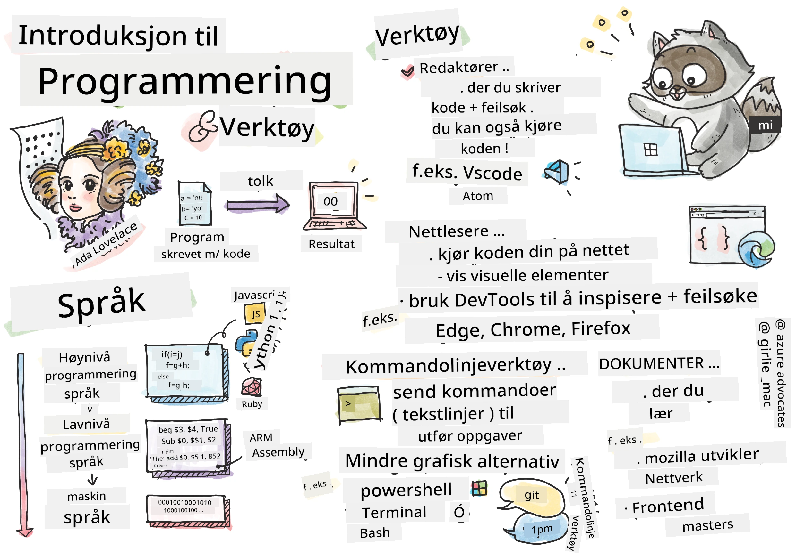
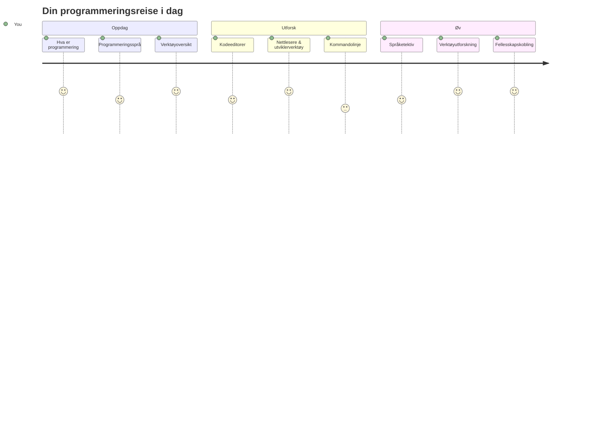
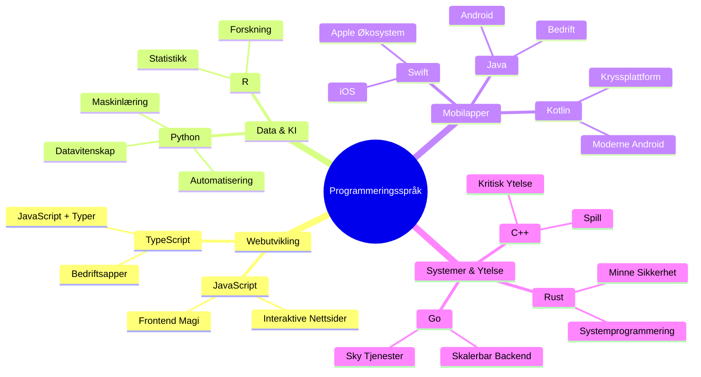
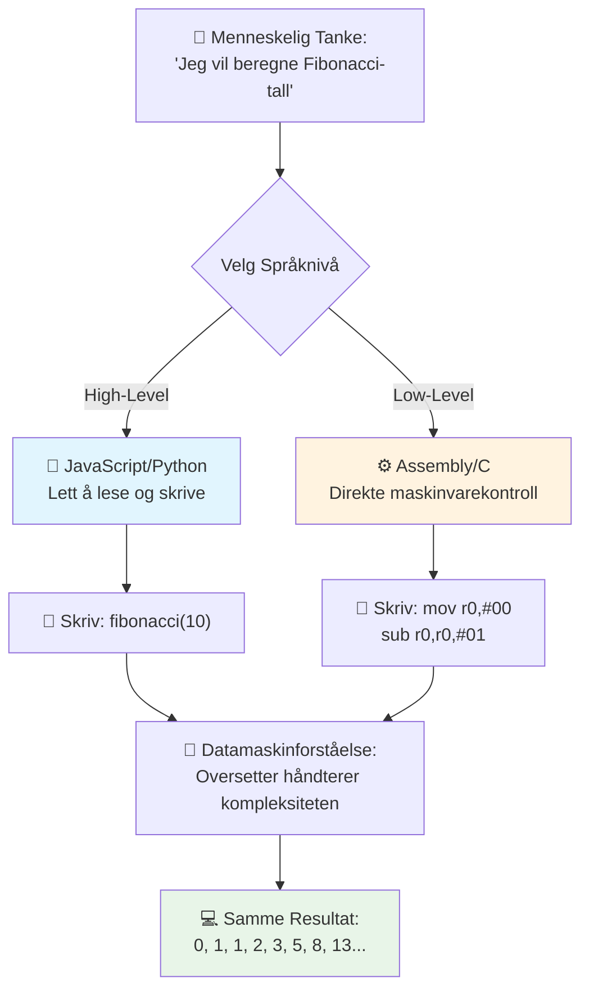
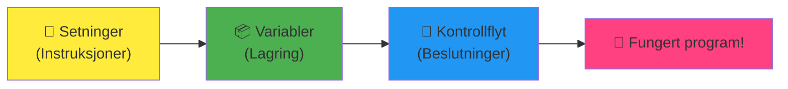
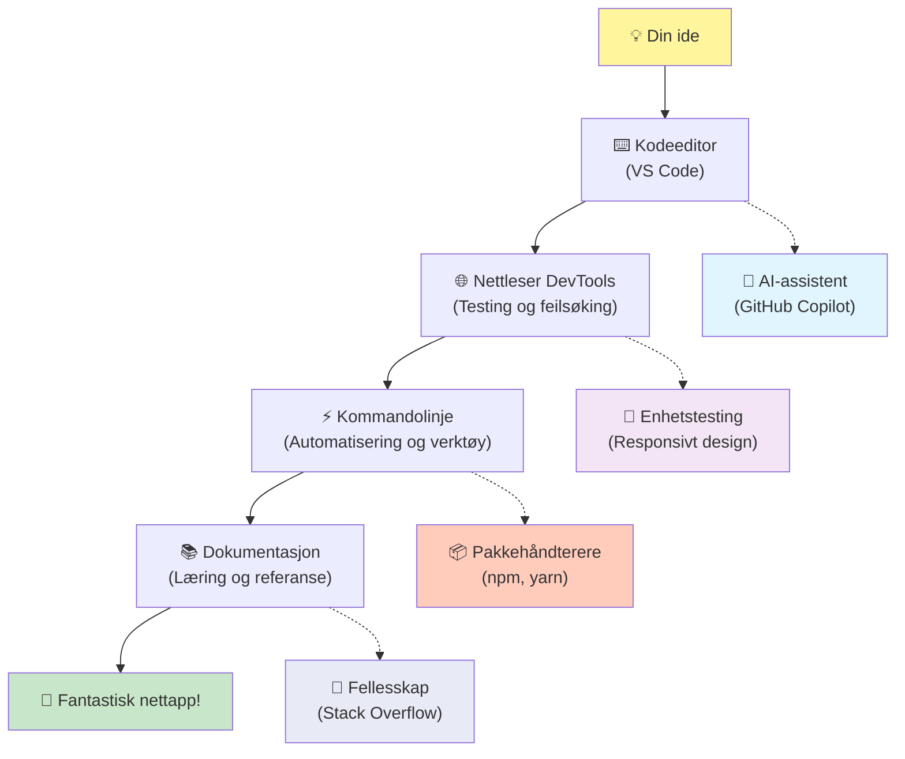
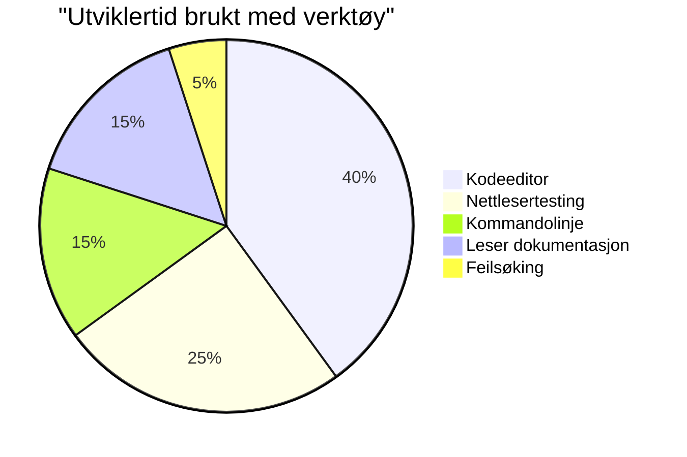
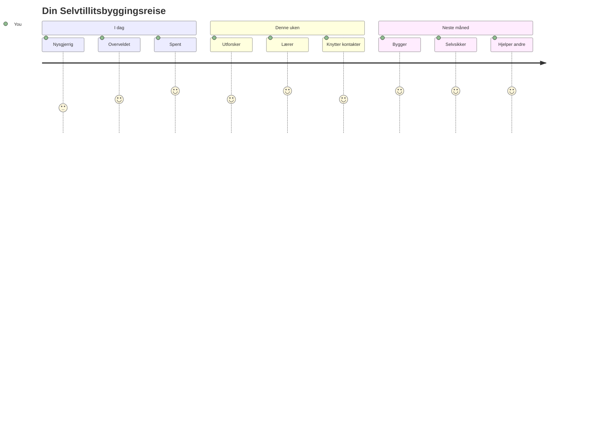

# Introduksjon til programmeringsspråk og moderne utviklerverktøy
 
Hei der, fremtidige utvikler! 👋 Kan jeg fortelle deg noe som fortsatt gir meg frysninger hver eneste dag? Du er i ferd med å oppdage at programmering ikke bare handler om datamaskiner – det handler om å ha faktiske superkrefter for å bringe dine villeste ideer til live!

Du vet det øyeblikket når du bruker favorittappen din og alt bare klikker perfekt? Når du trykker på en knapp og noe helt magisk skjer som får deg til å si "wow, hvordan klarte de DET?" Vel, noen akkurat som deg – sannsynligvis sittende på sin favorittkafé klokken 2 om natten med sin tredje espresso – skrev koden som skapte den magien. Og her er det som kommer til å blåse deg av banen: innen slutten av denne leksjonen vil du ikke bare forstå hvordan de gjorde det, men du vil være ivrig etter å prøve det selv!

Se, jeg skjønner helt om programmering føles skremmende akkurat nå. Da jeg begynte, trodde jeg ærlig talt at man måtte være et slags mattegeni eller ha programmert siden man var fem år gammel. Men her er hva som helt endret perspektivet mitt: programmering er akkurat som å lære å føre samtaler på et nytt språk. Du begynner med "hei" og "takk," så jobber du deg opp til å bestille kaffe, og før du vet ordet av det, har du dype filosofiske diskusjoner! Bortsett fra at i dette tilfellet fører du samtaler med datamaskiner, og ærlig talt? De er de mest tålmodige samtalepartnerne du noen gang vil møte – de dømmer aldri feilene dine og er alltid gira på å prøve igjen!

I dag skal vi utforske de utrolige verktøyene som gjør moderne webutvikling ikke bare mulig, men også skikkelig vanedannende. Jeg snakker om de eksakte samme editorene, nettleserne og arbeidsflytene som utviklere hos Netflix, Spotify og ditt favoritt indie app-studio bruker hver eneste dag. Og her er delen som kommer til å få deg til å gjøre en gledessang: de fleste av disse profesjonelle, industristandard verktøyene er helt gratis!


> Sketchnote av [Tomomi Imura](https://twitter.com/girlie_mac)


```mermaid
journey
    title Din programmeringsreise i dag
    section Oppdag
      Hva er programmering: 5: You
      Programmeringsspråk: 4: You
      Verktøyoversikt: 5: You
    section Utforsk
      Kodeeditorer: 4: You
      Nettlesere & utviklerverktøy: 5: You
      Kommandolinje: 3: You
    section Øv
      Språketektiv: 4: You
      Verktøyutforskning: 5: You
      Fellesskapskobling: 5: You
```
## La oss se hva du allerede kan!

Før vi kaster oss ut i de morsomme tingene, er jeg nysgjerrig – hva vet du allerede om denne programmeringsverdenen? Og hør her, hvis du ser på disse spørsmålene og tenker "jeg har virkelig null peiling på noe av dette," så er det ikke bare greit, det er perfekt! Det betyr at du er nøyaktig på rett plass. Tenk på denne quizen som oppvarming før trening – vi varmer bare opp de hjerne-musklene!

[Ta før-leksjons quiz](https://ff-quizzes.netlify.app/web/)


## Eventyret vi skal gå på sammen

Ok, jeg er virkelig gira på det vi skal utforske i dag! Seriøst, jeg skulle bare ønske jeg kunne se ansiktet ditt når noen av disse konseptene klikker. Her er den utrolige reisen vi tar sammen:

- **Hva programmering faktisk er (og hvorfor det er det kuleste som finnes!)** – Vi skal oppdage hvordan kode bokstavelig talt er den usynlige magien som driver alt rundt deg, fra den alarmen som på mystisk vis vet at det er mandag morgen til algoritmen som perfekt kuraterer Netflix-anbefalingene dine
- **Programmeringsspråk og deres fantastiske personligheter** – Tenk deg å gå inn i en fest hvor hver person har helt forskjellige superkrefter og måter å løse problemer på. Slik er programmeringsspråkverdenen, og du kommer til å elske å bli kjent med dem!
- **De grunnleggende byggeklossene som får digital magi til å skje** – Tenk på disse som det ultimate kreative LEGO-settet. Når du forstår hvordan disse bitene passer sammen, vil du innse at du bokstavelig talt kan bygge hva som helst fantasien din drømmer om
- **Profesjonelle verktøy som får deg til å føle at du akkurat har fått overlevert en trollmanns tryllestav** – Jeg overdriver ikke – disse verktøyene vil virkelig få deg til å føle at du har superkrefter, og det beste? De er de samme proffene bruker!

> 💡 **Her er saken**: Ikke engang tenk på å prøve å huske alt i dag! Akkurat nå vil jeg bare at du skal kjenne gnisten av spenning for hva som er mulig. Detaljene sitter naturlig når vi øver sammen – det er slik ekte læring skjer!

> Du kan ta denne leksjonen på [Microsoft Learn](https://learn.microsoft.com/en-us/learn/modules/web-development-101/introduction-programming/?WT.mc_id=academic-77807-sagibbon)!

## Hva er egentlig *programmering*?

Ok, la oss ta million-spørsmålet: hva er programmering, egentlig?

Jeg skal fortelle deg en historie som helt endret hvordan jeg tenker på dette. Forrige uke prøvde jeg å forklare til mamma hvordan hun skulle bruke vår nye smarte TV-fjernkontroll. Jeg fanget meg selv i å si ting som "Trykk på den røde knappen, men ikke den store røde knappen, den lille røde knappen på venstre side... nei, den andre venstre... ok, hold den nå i to sekunder, ikke ett, ikke tre..." Kjenner du deg igjen? 😅

Det er programmering! Det er kunsten å gi utrolig detaljerte, trinn-for-trinn instruksjoner til noe som er veldig kraftfullt men som trenger at alt blir forklart helt presist. Bortsett fra at i stedet for å forklare til mamma (som kan spørre "hvilken rød knapp?!"), forklarer du til en datamaskin (som bare gjør akkurat det du sier, selv om det du sa ikke helt var det du mente).

Her er det som blåste meg av banen da jeg først lærte det: datamaskiner er faktisk ganske enkle i kjernen. De forstår bokstavelig talt bare to ting – 1 og 0, som egentlig bare betyr "ja" og "nei" eller "på" og "av." Det er det! Men der det blir magisk – vi trenger ikke å snakke i 1 og 0 som om vi er i The Matrix. Det er der **programmeringsspråkene** kommer til unnsetning. De er som verdens beste tolk som tar dine helt vanlige menneskelige tanker og oversetter dem til datamaskinens språk.

Og her er det som fortsatt gir meg ekte frysninger hver morgen når jeg våkner: bokstavelig talt *alt* digitalt i livet ditt startet med noen akkurat som deg, sannsynligvis sittende i pysjamas med en kopp kaffe, og skrev kode på sin laptop. Det Instagram-filteret som får deg til å se feilfri ut? Noen har kodet det. Anbefalingen som ledet deg til din nye favorittsang? En utvikler bygde den algoritmen. Appen som hjelper deg med å splitte middagsregningen med venner? Jepp, noen tenkte "dette er irriterende, jeg tror jeg kan fikse dette" og så... gjorde de det!

Når du lærer å programmere, plukker du ikke bare opp en ny ferdighet – du blir en del av dette utrolige fellesskapet av problemløsere som tilbringer dagene sine med å tenke, "Hva om jeg kunne lage noe som gjør noens dag litt bedre?" Ærlig talt, finnes det noe kulere enn det?

✅ **Morsom fakta-jakt**: Her er noe superkult du kan se opp når du har en ledig stund – hvem tror du var verdens første dataprogrammerer? Jeg gir deg et hint: det er kanskje ikke den du forventer! Historien bak denne personen er helt fascinerende og viser at programmering alltid har handlet om kreativ problemløsning og å tenke utenfor boksen.

### 🧠 **Sjekk inn: Hvordan har du det?**

**Ta et øyeblikk for refleksjon:**
- Gir ideen om "å gi instruksjoner til datamaskiner" mening for deg nå?
- Kan du tenke på en daglig oppgave du gjerne vil automatisere med programmering?
- Hvilke spørsmål bobler opp i hodet ditt om hele dette programmeringsgreiene?

> **Husk**: Det er helt normalt om noen konsepter føles uklare nå. Å lære programmering er som å lære et nytt språk – det tar tid for hjernen å bygge de nevrale forbindelsene. Du gjør det kjempebra!

## Programmeringsspråk er som forskjellige magisorter

Ok, dette kommer til å høres rart ut, men heng med – programmeringsspråk er veldig lik forskjellige typer musikk. Tenk på det: du har jazz, som er smooth og improvisatorisk, rock som er kraftfull og rett fram, klassisk som er elegant og strukturert, og hip-hop som er kreativ og uttrykksfull. Hver stil har sin egen stemning, sitt eget fellesskap av lidenskapelige fans, og hver er perfekt for forskjellige stemninger og anledninger.

Programmeringsspråk fungerer akkurat på samme måte! Du ville ikke brukt det samme språket til å lage et morsomt mobilspill som du ville brukt til å bearbeide store mengder klimadata, akkurat slik du ikke ville spilt death metal på en yogatime (vel, kanskje ikke på de fleste yogatimene i hvert fall! 😄).

Men her er det som blåser meg av banen hver gang jeg tenker på det: disse språkene er som å ha den mest tålmodige, geniale tolken i verden sittende rett ved siden av deg. Du kan uttrykke ideene dine på en måte som føles naturlig for din menneskehjerne, og de håndterer alt det utrolig komplekse arbeidet med å oversette det til 1 og 0 som datamaskiner faktisk forstår. Det er som å ha en venn som er perfekt flytende i både "menneskelig kreativitet" og "datamaskinlogikk" – og de blir aldri slitne, trenger aldri kaffepauser og dømmer deg aldri for å stille samme spørsmål to ganger!

### Populære programmeringsspråk og deres bruksområder


```mermaid
mindmap
  root((Programmeringsspråk))
    Webutvikling
      JavaScript
        Frontend Magi
        Interaktive Nettsider
      TypeScript
        JavaScript + Typer
        Bedriftsapper
    Data & KI
      Python
        Datavitenskap
        Maskinlæring
        Automatisering
      R
        Statistikk
        Forskning
    Mobilapper
      Java
        Android
        Bedrift
      Swift
        iOS
        Apple Økosystem
      Kotlin
        Moderne Android
        Kryssplattform
    Systemer & Ytelse
      C++
        Spill
        Kritisk Ytelse
      Rust
        Minne Sikkerhet
        Systemprogrammering
      Go
        Sky Tjenester
        Skalerbar Backend
```
| Språk | Best for | Hvorfor det er populært |
|----------|----------|------------------|
| **JavaScript** | Webutvikling, brukergrensesnitt | Kjører i nettlesere og driver interaktive nettsider |
| **Python** | Data science, automatisering, AI | Lett å lese og lære, kraftige biblioteker |
| **Java** | Forretningsapplikasjoner, Android-apper | Plattformuavhengig, robust for store systemer |
| **C#** | Windows-applikasjoner, spillutvikling | Sterk støtte i Microsoft-økosystemet |
| **Go** | Sky-tjenester, backend-systemer | Rask, enkel, designet for moderne databehandling |

### Høynivå- kontra lavnivåspråk

Ok, dette var ærlig talt konseptet som knuste hjernen min da jeg først begynte å lære, så jeg skal dele analogien som endelig fikk det til å klikke for meg – og jeg håper virkelig det hjelper deg også!

Tenk deg at du besøker et land hvor du ikke snakker språket, og du desperat trenger å finne nærmeste toalett (vi har alle vært der, ikke sant? 😅):

- **Lavnivå-programmering** er som å lære den lokale dialekten så godt at du kan prate med bestemoren som selger frukt i hjørnet ved å bruke kulturelle referanser, lokal slang og interne vitser som bare noen som har vokst opp der ville forstå. Superimponerende og utrolig effektivt... om du tilfeldigvis er flytende! Men ganske overveldende når du bare prøver å finne et toalett.

- **Høynivå-programmering** er som å ha den fantastiske lokale vennen som bare forstår deg. Du kan si "Jeg trenger virkelig å finne et toalett" på vanlig engelsk, og de tar seg av all kulturell oversettelse og gir deg veibeskrivelse på en måte som gir perfekt mening for din ikke-lokale hjerne.

I programmering betyr det:
- **Lavnivåspråk** (som Assembly eller C) lar deg ha utrolig detaljerte samtaler med datamaskinens faktiske maskinvare, men du må tenke som en maskin, noe som er... vel, la oss bare si det er et ganske stort mentalt skifte!
- **Høynivåspråk** (som JavaScript, Python eller C#) lar deg tenke som et menneske mens de håndterer all maskinspråket i bakgrunnen. Pluss, de har disse utrolig innbydende fellesskapene fulle av folk som husker hvordan det var å være ny og virkelig ønsker å hjelpe!

Gjett hvilke jeg kommer til å foreslå du starter med? 😉 Høynivåspråk er som å ha støttehjul på sykkelen som du aldri egentlig vil ta av fordi de gjør hele opplevelsen så mye mer hyggelig!


```mermaid
flowchart TB
    A["👤 Menneskelig Tanke:<br/>'Jeg vil beregne Fibonacci-tall'"] --> B{Velg Språknivå}
    
    B -->|High-Level| C["🌟 JavaScript/Python<br/>Lett å lese og skrive"]
    B -->|Low-Level| D["⚙️ Assembly/C<br/>Direkte maskinvarekontroll"]
    
    C --> E["📝 Skriv: fibonacci(10)"]
    D --> F["📝 Skriv: mov r0,#00<br/>sub r0,r0,#01"]
    
    E --> G["🤖 Datamaskinforståelse:<br/>Oversetter håndterer kompleksiteten"]
    F --> G
    
    G --> H["💻 Samme Resultat:<br/>0, 1, 1, 2, 3, 5, 8, 13..."]
    
    style C fill:#e1f5fe
    style D fill:#fff3e0
    style H fill:#e8f5e8
```
### La meg vise deg hvorfor høynivåspråk er mye vennligere

Ok, jeg er i ferd med å vise deg noe som perfekt demonstrerer hvorfor jeg forelsket meg i høynivåspråk, men først – jeg trenger at du lover meg noe. Når du ser det første kode-eksemplet, ikke få panikk! Det skal se skremmende ut. Det er akkurat poenget mitt!

Vi skal se på den nøyaktige samme oppgaven skrevet i to helt forskjellige stiler. Begge lager det som kalles Fibonacci-sekvensen – det er et vakkert matematisk mønster hvor hvert tall er summen av de to foregående: 0, 1, 1, 2, 3, 5, 8, 13... (Morsomt faktum: du finner dette mønsteret bokstavelig talt overalt i naturen – solsikkefrøspiraler, konglekroner, til og med måten galakser formes på!)

Klar til å se forskjellen? La oss gå!

**Høynivåspråk (JavaScript) – Menneskevennlig:**

```javascript
// Trinn 1: Grunnleggende Fibonacci-oppsett
const fibonacciCount = 10;
let current = 0;
let next = 1;

console.log('Fibonacci sequence:');
```

**Dette gjør koden:**
- **Deklarerer** en konstant for å spesifisere hvor mange Fibonacci-tall vi vil generere
- **Initialiserer** to variabler for å holde styr på nåværende og neste tall i sekvensen
- **Setter opp** startverdiene (0 og 1) som definerer Fibonacci-mønsteret
- **Viser** en overskriftsmelding for å identifisere vår utdata

```javascript
// Trinn 2: Generer sekvensen med en løkke
for (let i = 0; i < fibonacciCount; i++) {
  console.log(`Position ${i + 1}: ${current}`);
  
  // Beregn neste tall i sekvensen
  const sum = current + next;
  current = next;
  next = sum;
}
```

**Bryter ned hva som skjer her:**
- **Looper** gjennom hver posisjon i sekvensen med en `for`-løkke
- **Viser** hvert tall med posisjonen sin ved bruk av template literals
- **Beregner** det neste Fibonacci-tallet ved å legge sammen nåværende og neste verdi
- **Oppdaterer** våre variabler for å gå videre til neste iterasjon

```javascript
// Trinn 3: Moderne funksjonell tilnærming
const generateFibonacci = (count) => {
  const sequence = [0, 1];
  
  for (let i = 2; i < count; i++) {
    sequence[i] = sequence[i - 1] + sequence[i - 2];
  }
  
  return sequence;
};

// Brukseksempel
const fibSequence = generateFibonacci(10);
console.log(fibSequence);
```

**I det over har vi:**
- **Laget** en gjenbrukbar funksjon med moderne pilfunksjon-syntaks
- **Bygget** en array for å lagre hele sekvensen istedenfor å vise ett og ett tall
- **Brukt** array-indeksering for å beregne hvert nytt tall fra tidligere verdier
- **Returnert** hele sekvensen for fleksibel bruk i andre deler av programmet

**Lavnivåspråk (ARM Assembly) – Datamaskinvennlig:**

```assembly
 area ascen,code,readonly
 entry
 code32
 adr r0,thumb+1
 bx r0
 code16
thumb
 mov r0,#00
 sub r0,r0,#01
 mov r1,#01
 mov r4,#10
 ldr r2,=0x40000000
back add r0,r1
 str r0,[r2]
 add r2,#04
 mov r3,r0
 mov r0,r1
 mov r1,r3
 sub r4,#01
 cmp r4,#00
 bne back
 end
```

Legg merke til hvordan JavaScript-versjonen leses nesten som engelskinstruksjoner, mens Assembly-versjonen bruker kryptiske kommandoer som styrer datamaskinens prosessor direkte. Begge oppnår den nøyaktige samme oppgaven, men høynivåspråket er mye enklere for mennesker å forstå, skrive og vedlikeholde.

**Viktige forskjeller du vil legge merke til:**
- **Lesbarhet**: JavaScript bruker beskrivende navn som `fibonacciCount` mens Assembly bruker kryptiske etiketter som `r0`, `r1`
- **Kommentarer**: Høynivåspråk oppfordrer til forklarende kommentarer som gjør koden selvforklarende
- **Struktur**: JavaScripts logiske flyt matcher hvordan mennesker tenker på problemer trinn for trinn
- **Vedlikehold**: Å oppdatere JavaScript-versjonen for ulike krav er enkelt og klart

✅ **Om Fibonacci-sekvensen**: Dette helt fantastiske tallmønsteret (hvor hvert tall er summen av de to foregående: 0, 1, 1, 2, 3, 5, 8...) dukker bokstavelig talt opp *overalt* i naturen! Du finner det i solsikkespiraler, konglemønstre, hvordan nautilusskall krummer seg og til og med i hvordan tregrener vokser. Det er ganske utrolig hvordan matematikk og kode kan hjelpe oss med å forstå og gjenskape mønstrene naturen bruker for å skape skjønnhet!


## Byggesteinene som får magien til å skje

Ok, nå som du har sett hvordan programmeringsspråk ser ut i praksis, la oss bryte ned de grunnleggende delene som utgjør bokstavelig talt hvert program som noen gang er skrevet. Tenk på disse som de essensielle ingrediensene i din favorittoppskrift – når du forstår hva hver enkelt gjør, vil du kunne lese og skrive kode i omtrent hvilket som helst språk!

Dette er litt som å lære programmeringens grammatikk. Husker du da du gikk på skolen og lærte om substantiv, verb og hvordan sette sammen setninger? Programmering har sin egen versjon av grammatikk, og ærlig talt, den er mye mer logisk og tilgivende enn engelsk grammatikk noen gang var! 😄

### Setninger: Steg-for-steg-instruksjoner

La oss starte med **setninger** – disse er som enkeltsetninger i en samtale med datamaskinen din. Hver setning forteller datamaskinen å gjøre en spesifikk ting, omtrent som å gi veibeskrivelser: "Sving til venstre her," "Stopp ved det røde lyset," "Parkér på det stedet."

Det jeg elsker med setninger er hvor lesbare de vanligvis er. Se på dette:

```javascript
// Grunnleggende uttalelser som utfører enkelthandlinger
const userName = "Alex";                    
console.log("Hello, world!");              
const sum = 5 + 3;                         
```

**Slik fungerer denne koden:**
- **Deklarer** en konstant variabel for å lagre en brukers navn
- **Viser** en hilsen til konsollutgangen
- **Beregner** og lagrer resultatet av en matematisk operasjon

```javascript
// Utsagn som samhandler med nettsider
document.title = "My Awesome Website";      
document.body.style.backgroundColor = "lightblue";
```

**Trinn for trinn, slik skjer det:**
- **Endrer** nettsidens tittel som vises i nettleserfanen
- **Endrer** bakgrunnsfargen på hele sidens kropp

### Variabler: Programmets minnesystem

Ok, **variabler** er ærlig talt et av mine absolutte favorittkonsepter å lære bort fordi de er så mye som ting du allerede bruker hver eneste dag!

Tenk på kontaktlisten på telefonen din et øyeblikk. Du husker ikke alles telefonnummer – du lagrer i stedet "Mamma," "Bestevenn," eller "Pizzastedet som leverer til kl. 2" og lar telefonen huske de faktiske numrene. Variabler fungerer akkurat på samme måte! De er som merkede beholdere hvor programmet ditt kan lagre informasjon og hente den senere ved å bruke et navn som faktisk gir mening.

Det som er skikkelig kult: variabler kan endres mens programmet kjører (derfor navnet "variabel" – ser du hva de gjorde der?). Akkurat som du kanskje oppdaterer pizzakontakten når du finner et enda bedre sted, kan variablene oppdateres når programmet ditt lærer ny informasjon eller situasjoner endres!

La meg vise deg hvor vakkert enkelt dette kan være:

```javascript
// Trinn 1: Opprette grunnleggende variabler
const siteName = "Weather Dashboard";        
let currentWeather = "sunny";               
let temperature = 75;                       
let isRaining = false;                      
```

**Å forstå disse konseptene:**
- **Lagre** uforanderlige verdier i `const`-variabler (som nettstedets navn)
- **Bruke** `let` for verdier som kan endre seg gjennom programmet
- **Tilordne** forskjellige datatyper: strenger (tekst), tall og booleans (true/false)
- **Velge** beskrivende navn som forklarer hva hver variabel inneholder

```javascript
// Trinn 2: Arbeide med objekter for å gruppere relatert data
const weatherData = {                       
  location: "San Francisco",
  humidity: 65,
  windSpeed: 12
};
```

**I eksemplet over har vi:**
- **Opprettet** et objekt for å gruppere relatert værinformasjon
- **Organisert** flere datadeler under ett variabelnavn
- **Brukt** nøkkel-verdi-par for å tydelig merke hver informasjonsbit

```javascript
// Trinn 3: Bruke og oppdatere variabler
console.log(`${siteName}: Today is ${currentWeather} and ${temperature}°F`);
console.log(`Wind speed: ${weatherData.windSpeed} mph`);

// Oppdatere endringsbare variabler
currentWeather = "cloudy";                  
temperature = 68;                          
```

**La oss forstå hver del:**
- **Vis** informasjon ved hjelp av mal-litteraler med `${}`-syntaks
- **Tilgang** til objektets egenskaper med dot-notasjon (`weatherData.windSpeed`)
- **Oppdater** variabler deklarert med `let` for å gjenspeile endrede forhold
- **Kombiner** flere variabler for å lage meningsfulle meldinger

```javascript
// Trinn 4: Moderne destrukturering for renere kode
const { location, humidity } = weatherData; 
console.log(`${location} humidity: ${humidity}%`);
```

**Det du må vite:**
- **Hent ut** spesifikke egenskaper fra objekter med destrukturering
- **Opprette** nye variabler automatisk med samme navn som objektets nøkler
- **Forenkle** koden ved å unngå gjentatt dot-notasjon

### Kontrollflyt: Lær programmet ditt å tenke

Ok, dette er der programmering blir helt sinnssykt! **Kontrollflyt** er i bunn og grunn å lære programmet ditt å ta smarte avgjørelser, akkurat som du gjør hver eneste dag uten engang å tenke over det.

Se for deg: i dag tidlig gikk du sannsynligvis gjennom noe som "Hvis det regner, tar jeg med paraply. Hvis det er kaldt, tar jeg på jakke. Hvis jeg er sen, hopper jeg over frokost og tar med kaffe." Hjernen din følger naturlig denne hvis-da-logikken dusinvis av ganger hver dag!

Dette gjør at programmer føles intelligente og levende, i stedet for bare å følge noen kjedelige, forutsigbare skript. De kan faktisk se på en situasjon, vurdere hva som skjer, og reagere passende. Det er som å gi programmet ditt en hjerne som kan tilpasse seg og ta valg!

Vil du se hvor fint dette fungerer? La meg vise deg:

```javascript
// Trinn 1: Grunnleggende betinget logikk
const userAge = 17;

if (userAge >= 18) {
  console.log("You can vote!");
} else {
  const yearsToWait = 18 - userAge;
  console.log(`You'll be able to vote in ${yearsToWait} year(s).`);
}
```

**Dette gjør koden:**
- **Sjekker** om brukerens alder møter stemmerettskravet
- **Utfører** forskjellige kodeblokker basert på resultatet
- **Beregner** og viser hvor lenge til stemmerettelighet hvis under 18
- **Gir** spesifikke, hjelpsomme tilbakemeldinger for hver situasjon

```javascript
// Steg 2: Flere betingelser med logiske operatorer
const userAge = 17;
const hasPermission = true;

if (userAge >= 18 && hasPermission) {
  console.log("Access granted: You can enter the venue.");
} else if (userAge >= 16) {
  console.log("You need parent permission to enter.");
} else {
  console.log("Sorry, you must be at least 16 years old.");
}
```

**Slik brytes det ned:**
- **Kombinerer** flere betingelser med `&&` (og)-operatoren
- **Oppretter** et hierarki av betingelser med `else if` for flere scenarioer
- **Håndterer** alle mulige tilfeller med en siste `else`-setning
- **Gir** klare og handlingsrettede tilbakemeldinger for hver situasjon

```javascript
// Trinn 3: Konsis betingelse med ternæroperator
const votingStatus = userAge >= 18 ? "Can vote" : "Cannot vote yet";
console.log(`Status: ${votingStatus}`);
```

**Det du må huske:**
- **Bruk** den ternære operatoren (`? :`) for enkle to-alternativ-betingelser
- **Skriv** betingelse først, etterfulgt av `?`, så sant resultat, deretter `:`, og så usant resultat
- **Bruk** dette mønsteret når du trenger å tilordne verdier basert på betingelser

```javascript
// Trinn 4: Håndtering av flere spesifikke tilfeller
const dayOfWeek = "Tuesday";

switch (dayOfWeek) {
  case "Monday":
  case "Tuesday":
  case "Wednesday":
  case "Thursday":
  case "Friday":
    console.log("It's a weekday - time to work!");
    break;
  case "Saturday":
  case "Sunday":
    console.log("It's the weekend - time to relax!");
    break;
  default:
    console.log("Invalid day of the week");
}
```

**Denne koden gjør følgende:**
- **Matcher** variabelverdien mot flere spesifikke tilfeller
- **Grupperer** lignende tilfeller sammen (ukedager vs. helger)
- **Utfører** passende kodeblokk når en match finnes
- **Inkluderer** en `default`-tilfelle for å håndtere uventede verdier
- **Bruker** `break`-setninger for å forhindre at koden fortsetter til neste tilfelle

> 💡 **Virkelighetsanalog**: Tenk på kontrollflyt som verdens mest tålmodige GPS som gir deg veibeskrivelser. Den kan si "Hvis det er trafikk i Main Street, ta motorveien i stedet. Hvis veiarbeid blokkerer motorveien, prøv den naturskjønne ruten." Programmer bruker akkurat samme type betingede logikk for å svare intelligent på ulike situasjoner og alltid gi brukerne den best mulige opplevelsen.

### 🎯 **Konsept-sjekk: Mester i byggesteiner**

**La oss se hvordan det går med det grunnleggende:**
- Kan du forklare forskjellen mellom en variabel og en setning med egne ord?
- Tenk på et virkelig scenario hvor du ville brukt en hvis-da-beslutning (som stemmeeksemplet vårt)
- Hva er én ting om programmeringslogikk som overrasket deg?

**Rask selvtillitsboost:**

```mermaid
flowchart LR
    A["📝 Setninger<br/>(Instruksjoner)"] --> B["📦 Variabler<br/>(Lagring)"] --> C["🔀 Kontrollflyt<br/>(Beslutninger)"] --> D["🎉 Fungert program!"]
    
    style A fill:#ffeb3b
    style B fill:#4caf50
    style C fill:#2196f3
    style D fill:#ff4081
```
✅ **Hva som kommer nå**: Vi skal ha det utrolig gøy med å dykke dypere inn i disse konseptene mens vi fortsetter denne utrolige reisen sammen! For nå, bare fokuser på å kjenne spenningen for alle de fantastiske mulighetene foran deg. De spesifikke ferdighetene og teknikkene vil komme naturlig ettersom vi øver sammen – jeg lover dette blir mye mer moro enn du kanskje forventer!

## Verktøyene i faget

Ok, ærlig talt, her blir jeg så gira at jeg nesten ikke klarer å holde meg! 🚀 Vi skal snakke om de utrolige verktøyene som kommer til å få deg til å føle at du nettopp har fått nøklene til et digitalt romskip.

Vet du hvordan en kokk har de perfekte balanseknivene som føles som en forlengelse av hendene? Eller hvordan en musiker har den ene gitaren som virker som den synger i det de tar på den? Vel, utviklere har vår egen versjon av disse magiske verktøyene, og her kommer det som kommer til å blåse deg av banen – de fleste av dem er helt gratis!

Jeg hopper nesten i stolen av begeistring over å dele disse med deg fordi de har revolusjonert hvordan vi bygger programvare. Vi snakker om AI-drevne kodeassistenter som kan hjelpe deg med å skrive kode (jeg tuller ikke!), cloud-miljøer hvor du kan bygge hele applikasjoner fra bokstavelig talt hvor som helst med Wi-Fi, og feilsøkingsverktøy så avanserte at de føles som røntgensyn for programmene dine.

Og her er den delen som fortsatt gir meg frysninger: dette er ikke "begynnerverktøy" du vokser fra. Dette er de samme profesjonelle verktøyene som utviklere i Google, Netflix, og det indie app-studioet du elsker bruker akkurat nå. Du kommer til å føle deg som en proff ved å bruke dem!


```mermaid
graph TD
    A["💡 Din ide"] --> B["⌨️ Kodeeditor<br/>(VS Code)"] 
    B --> C["🌐 Nettleser DevTools<br/>(Testing og feilsøking)"]
    C --> D["⚡ Kommandolinje<br/>(Automatisering og verktøy)"]
    D --> E["📚 Dokumentasjon<br/>(Læring og referanse)"]
    E --> F["🚀 Fantastisk nettapp!"]
    
    B -.-> G["🤖 AI-assistent<br/>(GitHub Copilot)"]
    C -.-> H["📱 Enhetstesting<br/>(Responsivt design)"]
    D -.-> I["📦 Pakkehåndterere<br/>(npm, yarn)"]
    E -.-> J["👥 Fellesskap<br/>(Stack Overflow)"]
    
    style A fill:#fff59d
    style F fill:#c8e6c9
    style G fill:#e1f5fe
    style H fill:#f3e5f5
    style I fill:#ffccbc
    style J fill:#e8eaf6
```
### Kodeeditorer og IDE-er: Dine nye digitale bestevenner

La oss snakke om kodeeditorer – disse kommer seriøst til å bli dine nye favorittsteder å henge! Tenk på dem som din personlige kodebastion hvor du tilbringer mesteparten av tiden din på å lage og perfeksjonere dine digitale kreasjoner.

Men det som er helt magisk med moderne editorer: de er ikke bare fancy tekstredigerere. De er som å ha den mest briljante, støttende kodeveilederen som sitter rett ved siden av deg 24/7. De fanger opp skrivefeil før du merker dem, foreslår forbedringer som får deg til å se ut som et geni, hjelper deg å forstå hva hver liten del av koden gjør, og noen av dem kan til og med forutsi hva du holder på å skrive og tilby å fullføre tankene dine!

Jeg husker da jeg først oppdaget autfullføring – jeg følte bokstavelig talt at jeg levde i framtiden. Du begynner å skrive noe, og editoren sier, "Hei, tenkte du på denne funksjonen som gjør akkurat det du trenger?" Det er som å ha en tankeleser som kodekompis!

**Hva gjør disse editorene så utrolige?**

Moderne kodeeditorer tilbyr en imponerende rekke funksjoner designet for å øke produktiviteten din:

| Funksjon | Hva den gjør | Hvorfor det hjelper |
|---------|--------------|--------------|
| **Syntaksutheving** | Farger forskjellige deler av koden din | Gjør koden lettere å lese og oppdage feil |
| **Autocompletion** | Foreslår kode mens du skriver | Øker hastigheten på koding og reduserer skrivefeil |
| **Feilsøkingsverktøy** | Hjelper deg finne og fikse feil | Spar timer med feilsøking |
| **Utvidelser** | Legg til spesialiserte funksjoner | Tilpass editoren for hvilken som helst teknologi |
| **AI-assistenter** | Foreslår kode og forklaringer | Øker læring og produktivitet |

> 🎥 **Videoressurs**: Vil du se disse verktøyene i aksjon? Sjekk ut denne [Tools of the Trade video](https://youtube.com/watch?v=69WJeXGBdxg) for en omfattende oversikt.

#### Anbefalte editorer for webutvikling

**[Visual Studio Code](https://code.visualstudio.com/?WT.mc_id=academic-77807-sagibbon)** (Gratis)
- Mest brukt blant webutviklere
- Utmerket økosystem for utvidelser
- Innebygd terminal og Git-integrasjon
- **Må ha-utvidelser**:
  - [GitHub Copilot](https://marketplace.visualstudio.com/items?itemName=GitHub.copilot) - AI-drevne kodeforslag
  - [Live Share](https://marketplace.visualstudio.com/items?itemName=MS-vsliveshare.vsliveshare) - Sanntidssamarbeid
  - [Prettier](https://marketplace.visualstudio.com/items?itemName=esbenp.prettier-vscode) - Automatisk kodeformatering
  - [Code Spell Checker](https://marketplace.visualstudio.com/items?itemName=streetsidesoftware.code-spell-checker) - Fanger skrivefeil i koden din

**[JetBrains WebStorm](https://www.jetbrains.com/webstorm/)** (Betalt, gratis for studenter)
- Avanserte feilsøkings- og testverktøy
- Intelligent kodefullføring
- Innebygd versjonskontroll

**Cloud-baserte IDE-er** (Forskjellige prisklasser)
- [GitHub Codespaces](https://github.com/features/codespaces) - Full VS Code i nettleseren
- [Replit](https://replit.com/) - Flott for læring og deling av kode
- [StackBlitz](https://stackblitz.com/) - Umiddelbar full-stack webutvikling

> 💡 **Kom i gang-tips**: Start med Visual Studio Code – det er gratis, mye brukt i bransjen, og har et enormt fellesskap som lager hjelpsomme tutorials og utvidelser.


### Nettlesere: Ditt hemmelige utviklingslaboratorium

Ok, gjør deg klar til å bli helt overveldet! Du vet hvordan du har brukt nettlesere til å bla gjennom sosiale medier og se videoer? Vel, det viser seg at de har skjult dette utrolige hemmelige utviklingslaboratoriet hele tiden, bare ventende på at du skal oppdage det!

Hver eneste gang du høyreklikker på en nettside og velger "Inspiser element," åpner du en skjult verden av utviklerverktøy som ærlig talt er kraftigere enn noe dyrt programvare jeg pleide å betale hundrevis av kroner for. Det er som å oppdage at ditt vanlige kjøkken har skjult et profesjonelt kokkelaboratorium bak en hemmelig luke!
Første gang noen viste meg nettleserens DevTools, brukte jeg omtrent tre timer bare på å klikke rundt og si "VENT, KAN DEN GJØRE DETTE OGSÅ?!" Du kan bokstavelig talt redigere hvilken som helst nettside i sanntid, se nøyaktig hvor raskt alt lastes, teste hvordan siden din ser ut på forskjellige enheter, og til og med feilsøke JavaScript som en ekte proff. Det er helt utrolig!

**Her er hvorfor nettlesere er ditt hemmelige våpen:**

Når du lager en nettside eller webapplikasjon, trenger du å se hvordan den ser ut og oppfører seg i virkeligheten. Nettlesere viser ikke bare arbeidet ditt, men gir også detaljert tilbakemelding om ytelse, tilgjengelighet og potensielle problemer.

#### Browser Developer Tools (DevTools)

Moderne nettlesere inkluderer omfattende utviklingsverktøy:

| Verktøykategori | Hva det gjør | Eksempelbruk |
|-----------------|--------------|--------------|
| **Elementinspektør** | Se og redigere HTML/CSS i sanntid | Justere stil for å se resultater umiddelbart |
| **Konsoll** | Se feilmeldinger og teste JavaScript | Feilsøke problemer og eksperimentere med kode |
| **Nettverksmonitor** | Spore hvordan ressurser lastes | Optimalisere ytelse og lastetider |
| **Tilgjengelighetstester** | Teste for inkluderende design | Sikre at siden fungerer for alle brukere |
| **Enhetssimulator** | Forhåndsvise på forskjellige skjermstørrelser | Teste responsivt design uten flere enheter |

#### Anbefalte nettlesere for utvikling

- **[Chrome](https://developers.google.com/web/tools/chrome-devtools/)** - Bransjestandard DevTools med omfattende dokumentasjon
- **[Firefox](https://developer.mozilla.org/docs/Tools)** - Utmerkede CSS Grid- og tilgjengelighetsverktøy
- **[Edge](https://docs.microsoft.com/microsoft-edge/devtools-guide-chromium/?WT.mc_id=academic-77807-sagibbon)** - Basert på Chromium med Microsofts utviklerressurser

> ⚠️ **Viktig testtips**: Test alltid nettsidene dine i flere nettlesere! Det som fungerer perfekt i Chrome, kan se annerledes ut i Safari eller Firefox. Profesjonelle utviklere tester på tvers av alle store nettlesere for å sikre en jevn brukeropplevelse.


### Kommandolinjeverktøy: Din inngangsport til utviklersuperkrefter

Ok, la oss ha et ærlig øyeblikk her om kommandolinjen, for jeg vil at du skal høre dette fra noen som virkelig forstår det. Da jeg først så den – bare denne skumle svarte skjermen med blinkende tekst – tenkte jeg bokstavelig talt, "Nei, absolutt ikke! Dette ser ut som noe fra en hackerfilm på 80-tallet, og jeg er definitivt ikke smart nok for dette!" 😅

Men her er det jeg skulle ønske noen hadde fortalt meg den gang, og det jeg sier til deg nå: kommandolinjen er ikke skummel – det er faktisk som å ha en direkte samtale med datamaskinen din. Tenk på det som forskjellen mellom å bestille mat via en fancy app med bilder og menyer (som er enkelt og greit) versus å gå inn på din favorittlokale restaurant hvor kokken vet nøyaktig hva du liker og kan lage noe perfekt bare ved at du sier "overrask meg med noe fantastisk."

Kommandolinjen er stedet hvor utviklere føler seg som ekte trollmenn. Du skriver noen tilsynelatende magiske ord (ok, det er bare kommandoer, men de føles magiske!), trykker enter, og BOOM – du har opprettet hele prosjektstrukturer, installert kraftige verktøy fra hele verden, eller publisert appen din på Internett slik at millioner kan se den. Når du først smaker på den kraften, blir det ærlig talt ganske avhengighetsskapende!

**Hvorfor kommandolinjen vil bli ditt favorittverktøy:**

Mens grafiske grensesnitt er flotte for mange oppgaver, utmerker kommandolinjen seg på automatisering, presisjon og fart. Mange utviklingsverktøy fungerer primært gjennom kommandolinjegrensesnitt, og å lære å bruke dem effektivt kan dramatisk forbedre produktiviteten din.

```bash
# Trinn 1: Opprett og naviger til prosjektmappen
mkdir my-awesome-website
cd my-awesome-website
```

**Dette gjør koden:**
- **Oppretter** en ny mappe kalt "my-awesome-website" for prosjektet ditt
- **Går inn** i den nylig opprettede mappen for å begynne arbeidet

```bash
# Trinn 2: Initialiser prosjekt med package.json
npm init -y

# Installer moderne utviklingsverktøy
npm install --save-dev vite prettier eslint
npm install --save-dev @eslint/js
```

**Steg for steg, dette skjer:**
- **Initialiserer** et nytt Node.js-prosjekt med standardinnstillinger via `npm init -y`
- **Installerer** Vite som et moderne byggverktøy for rask utvikling og produksjonsbygg
- **Legger til** Prettier for automatisk kodingformattering og ESLint for kodekvalitetssjekker
- **Bruker** flagget `--save-dev` for å merke disse som kun utviklingsavhengigheter

```bash
# Trinn 3: Opprett prosjektstruktur og filer
mkdir src assets
echo '<!DOCTYPE html><html><head><title>My Site</title></head><body><h1>Hello World</h1></body></html>' > index.html

# Start utviklingsserver
npx vite
```

**Her har vi:**
- **Organisert** prosjektet ved å lage egne mapper for kildekode og ressurser
- **Generert** en grunnleggende HTML-fil med riktig dokumentstruktur
- **Startet** Vite utviklingsserver for live reload og hot module replacement

#### Essensielle kommandolinjeverktøy for webutvikling

| Verktøy | Formål | Hvorfor du trenger det |
|---------|--------|-----------------------|
| **[Git](https://git-scm.com/)** | Versjonskontroll | Spore endringer, samarbeide med andre, sikkerhetskopiere arbeidet |
| **[Node.js & npm](https://nodejs.org/)** | JavaScript-runtime & pakkebehandling | Kjøre JavaScript utenfor nettlesere, installere moderne utviklingsverktøy |
| **[Vite](https://vitejs.dev/)** | Byggverktøy & utviklingsserver | Lynrask utvikling med hot module replacement |
| **[ESLint](https://eslint.org/)** | Kvalitetskontroll på kode | Finn og fikse problemer automatisk i JavaScript-koden |
| **[Prettier](https://prettier.io/)** | Kodeformattering | Holde koden din konsekvent formatert og lett å lese |

#### Plattformspesifikke alternativer

**Windows:**
- **[Windows Terminal](https://docs.microsoft.com/windows/terminal/?WT.mc_id=academic-77807-sagibbon)** - Moderne, funksjonsrik terminal
- **[PowerShell](https://docs.microsoft.com/powershell/?WT.mc_id=academic-77807-sagibbon)** 💻 - Kraftig skriptemiljø
- **[Command Prompt](https://docs.microsoft.com/windows-server/administration/windows-commands/?WT.mc_id=academic-77807-sagibbon)** 💻 - Tradisjonell Windows kommandolinje

**macOS:**
- **[Terminal](https://support.apple.com/guide/terminal/)** 💻 - Innebygd terminalapplikasjon
- **[iTerm2](https://iterm2.com/)** - Forbedret terminal med avanserte funksjoner

**Linux:**
- **[Bash](https://www.gnu.org/software/bash/)** 💻 - Standard Linux-skall
- **[KDE Konsole](https://docs.kde.org/trunk5/en/konsole/konsole/index.html)** - Avansert terminalemulator

> 💻 = Forhåndsinstallert på operativsystemet

> 🎯 **Læringsvei**: Start med grunnleggende kommandoer som `cd` (endre mappe), `ls` eller `dir` (liste filer) og `mkdir` (lage mappe). Øv med moderne arbeidsflytkommandoer som `npm install`, `git status` og `code .` (åpner gjeldende mappe i VS Code). Når du blir tryggere, lærer du naturlig mer avanserte kommandoer og automatiseringsteknikker.


### Dokumentasjon: Din alltid tilgjengelige læringsmentor

Ok, la meg dele en liten hemmelighet som vil få deg til å føle deg mye bedre som nybegynner: selv de mest erfarne utviklerne bruker store deler av tiden sin på å lese dokumentasjon. Og det er ikke fordi de ikke vet hva de gjør – det er faktisk et tegn på klokskap!

Tenk på dokumentasjon som å ha tilgang til verdens mest tålmodige, kunnskapsrike lærere som er tilgjengelige 24/7. Står du fast på et problem klokken 2 om natten? Dokumentasjon er der med en varm virtuell klem og akkurat det svaret du trenger. Vil du lære om en kul ny funksjon alle snakker om? Dokumentasjonen hjelper deg med trinnvise eksempler. Prøver du å forstå hvorfor noe fungerer som det gjør? Gjett hva – dokumentasjonen forklarer det på en måte som endelig får det til å “klikke”!

Her er noe som helt forandret perspektivet mitt: webutvikling beveger seg utrolig raskt, og ingen (jeg mener absolutt ingen!) husker alt i hodet. Jeg har sett seniorutviklere med 15+ år erfaring slå opp grunnleggende syntaks, og vet du hva? Det er ikke flaut – det er smart! Det handler ikke om perfekt hukommelse; det handler om å vite hvor man finner pålitelige svar raskt og hvordan man bruker dem.

**Her skjer den virkelige magien:**

Profesjonelle utviklere bruker en betydelig del av tiden sin på å lese dokumentasjon – ikke fordi de ikke kan, men fordi webutviklingslandskapet endrer seg så raskt at kontinuerlig læring er nødvendig for å henge med. God dokumentasjon hjelper deg å forstå ikke bare *hvordan* du bruker noe, men også *hvorfor* og *når* det skal brukes.

#### Essensielle dokumentasjonsressurser

**[Mozilla Developer Network (MDN)](https://developer.mozilla.org/docs/Web)**
- Gullstandarden for dokumentasjon om webteknologi
- Omfattende guider for HTML, CSS og JavaScript
- Inkluderer informasjon om nettleserkompatibilitet
- Har praktiske eksempler og interaktive demos

**[Web.dev](https://web.dev)** (fra Google)
- Moderne beste praksis for webutvikling
- Veiledninger for ytelsesoptimalisering
- Tilgjengelighet og prinsipper for inkluderende design
- Casestudier fra virkelige prosjekter

**[Microsoft Developer Documentation](https://docs.microsoft.com/microsoft-edge/#microsoft-edge-for-developers)**
- Ressurser for Edge-nettleserutvikling
- Veiledninger for Progressive Web Apps
- Innsikt i tverrplattformutvikling

**[Frontend Masters Learning Paths](https://frontendmasters.com/learn/)**
- Strukturerte læringsløp
- Videokurs fra bransjeeksperter
- Hands-on kodeøvelser

> 📚 **Studieteknikk**: Ikke prøv å memorere dokumentasjonen – lær heller hvordan du effektivt navigerer i den. Bokmerk ofte brukte referanser og øv på å bruke søkefunksjoner for å finne spesifikk informasjon raskt.

### 🔧 **Verktøymester-sjekk: Hva klinger med deg?**

**Ta et øyeblikk og tenk over:**
- Hvilket verktøy gleder du deg mest til å prøve først? (Det finnes ikke noe feil svar!)
- Føles kommandolinjen fortsatt skummel, eller er du nysgjerrig på den?
- Kan du forestille deg å bruke nettleserens DevTools for å kikke bak kulissene på favorittnettsidene dine?


```mermaid
pie title "Utviklertid brukt med verktøy"
    "Kodeeditor" : 40
    "Nettlesertesting" : 25
    "Kommandolinje" : 15
    "Leser dokumentasjon" : 15
    "Feilsøking" : 5
```
> **Morsom innsikt**: De fleste utviklere bruker omtrent 40 % av tiden i kodeeditoren, men legg merke til hvor mye tid som går til testing, læring og problemløsning. Programmering handler ikke bare om å skrive kode – det handler om å skape opplevelser!

✅ **Noe å tenke på**: Her er noe interessant å gruble på – hvordan tror du verktøyene for å bygge nettsider (utvikling) kan være annerledes enn verktøyene for å designe hvordan de ser ut (design)? Det er som forskjellen mellom en arkitekt som tegner et vakkert hus og entreprenøren som faktisk bygger det. Begge er viktige, men trenger forskjellige verktøykasser! Denne typen tenkning vil virkelig hjelpe deg å se hele bildet av hvordan nettsider blir til.

## GitHub Copilot Agent Challenge 🚀

Bruk Agent-modus til å fullføre følgende utfordring:

**Beskrivelse:** Utforsk funksjonene til en moderne kodeeditor eller IDE og vis hvordan den kan forbedre arbeidsflyten din som webutvikler.

**Oppgave:** Velg en kodeeditor eller IDE (som Visual Studio Code, WebStorm, eller en skybasert IDE). List opp tre funksjoner eller utvidelser som hjelper deg med å skrive, feilsøke eller vedlikeholde kode mer effektivt. For hver, gi en kort forklaring på hvordan det gagner arbeidsflyten din.

---

## 🚀 Utfordring

**Ok, detektiv, klar for din første sak?**

Nå som du har dette fantastiske grunnlaget, har jeg et eventyr som skal hjelpe deg å se hvor utrolig variert og fascinerende programmeringsverdenen virkelig er. Og hør her – dette handler ikke om å skrive kode ennå, så ingen press! Tenk på deg selv som en programmeringsspråkdetektiv med din aller første spennende sak!

**Ditt oppdrag, hvis du velger å akseptere det:**
1. **Bli en språkutforsker**: Velg tre programmeringsspråk fra helt forskjellige univers – kanskje ett som lager nettsider, ett som lager mobilapper og ett som bearbeider data for vitenskapsfolk. Finn eksempler på samme enkle oppgave skrevet i hvert språk. Jeg lover du blir helt forbløffet over hvor forskjellige de kan se ut, selv om de gjør akkurat det samme!

2. **Avdekk opprinnelseshistoriene**: Hva gjør hvert språk unikt? Her er en kul fakta – hvert eneste programmeringsspråk ble skapt fordi noen tenkte, "Vet du hva? Det må finnes en bedre måte å løse dette spesifikke problemet på." Kan du finne ut hvilke problemer de var? Noen av disse historiene er virkelig fascinerende!

3. **Møt fellesskapene**: Se hvor inkluderende og lidenskapelige hvert språks fellesskap er. Noen har millioner av utviklere som deler kunnskap og hjelper hverandre, andre er mindre men utrolig sammensveiset og støttende. Du kommer til å elske å se de forskjellige personlighetene i disse fellesskapene!

4. **Følg magefølelsen**: Hvilket språk føles mest tilgjengelig for deg akkurat nå? Ikke stress over å velge det "perfekte" – bare stol på instinktene dine! Det finnes ærlig talt ingen feil svar her, og du kan alltid utforske flere senere.

**Bonusdetektivarbeid**: Se om du kan finne ut hvilke store nettsteder eller apper som er laget med hvert språk. Jeg lover at du blir sjokkert over å lære hva som driver Instagram, Netflix eller det mobilspillet du ikke klarer å legge fra deg!

> 💡 **Husk**: Du trenger ikke bli ekspert i noen av disse språkene i dag. Du blir bare kjent med "nabolaget" før du bestemmer deg for hvor du vil slå deg ned. Ta deg tid, ha det gøy, og la nysgjerrigheten lede deg!

## La oss feire det du har oppdaget!

Herregud, du har sugd til deg så mye utrolig informasjon i dag! Jeg er virkelig spent på å se hvor mye av denne fantastiske reisen som har festet seg hos deg. Og husk – dette er ikke en test hvor du må få alt perfekt. Dette er mer som en feiring av alt det kule du har lært om denne fascinerende verdenen du er i ferd med å dykke ned i!

[Ta quizzen etter leksjonen](https://ff-quizzes.netlify.app/web/)

## Gjennomgang & Selvstudium

**Ta deg tid til å utforske og ha det gøy med det!**
Du har dekket mye i dag, og det er noe å være stolt av! Nå kommer den morsomme delen – å utforske de temaene som vekket din nysgjerrighet. Husk, dette er ikke lekser – det er et eventyr!

**Dykk dypere inn i det som begeistrer deg:**

**Bli praktisk med programmeringsspråk:**
- Besøk de offisielle nettsidene til 2-3 språk som fanget oppmerksomheten din. Hvert språk har sin egen personlighet og historie!
- Prøv noen nettbaserte kodelekeplasser som [CodePen](https://codepen.io/), [JSFiddle](https://jsfiddle.net/), eller [Replit](https://replit.com/). Ikke vær redd for å eksperimentere – du kan ikke ødelegge noe!
- Les om hvordan favorittspråket ditt ble til. Seriøst, noen av disse opprinnelseshistoriene er fascinerende og vil hjelpe deg å forstå hvorfor språk fungerer slik de gjør.

**Bli komfortabel med dine nye verktøy:**
- Last ned Visual Studio Code hvis du ikke allerede har det – det er gratis, og du kommer til å elske det!
- Bruk noen minutter på å bla gjennom Extensions-markedet. Det er som en app-butikk for kodeeditoren din!
- Åpne nettleserens Utviklerverktøy og klikk rundt. Ikke bekymre deg for å forstå alt – bli bare kjent med hva som finnes der.

**Bli med i fellesskapet:**
- Følg noen utviklerfellesskap på [Dev.to](https://dev.to/), [Stack Overflow](https://stackoverflow.com/), eller [GitHub](https://github.com/). Programmeringsfellesskapet er utrolig imøtekommende for nykommere!
- Se noen nybegynnervennlige kodevideoer på YouTube. Det finnes mange flinke skapere der ute som husker hvordan det er å være i starten.
- Vurder å bli med på lokale meetups eller nettbaserte fellesskap. Tro meg, utviklere elsker å hjelpe nykommere!

> 🎯 **Hør her, dette vil jeg at du skal huske**: Du forventes ikke å bli en kodeekspert over natten! Akkurat nå blir du bare kjent med denne fantastiske nye verdenen du er i ferd med å bli en del av. Ta deg tid, nyt reisen, og husk – hver eneste utvikler du beundrer satt en gang akkurat der du er nå, følte seg spent og kanskje litt overveldet. Det er helt normalt, og det betyr at du gjør det riktig!


## Oppgave

[Reading the Docs](assignment.md)

> 💡 **Et lite dytt for oppgaven din**: Jeg vil virkelig gjerne se at du utforsker noen verktøy vi ikke har dekket ennå! Hopp over editorer, nettlesere og kommandolinjeverktøy vi allerede har snakket om – det finnes et helt utrolig univers av fantastiske utviklingsverktøy der ute som bare venter på å bli oppdaget. Se etter de som aktivt vedlikeholdes og har levende, hjelpsomme fellesskap (disse pleier å ha de beste veiledningene og de mest støttende menneskene når du uunngåelig står fast og trenger en vennlig hånd).

---

## 🚀 Din programmeringsreise tidslinje

### ⚡ **Hva du kan gjøre de neste 5 minuttene**
- [ ] Bokmerke 2-3 programmeringsspråk-nettsider som fanget oppmerksomheten din
- [ ] Last ned Visual Studio Code hvis du ikke allerede har det
- [ ] Åpne nettleserens DevTools (F12) og klikk rundt på en hvilken som helst nettside
- [ ] Bli med i ett programmeringsfellesskap (Dev.to, Reddit r/webdev, eller Stack Overflow)

### ⏰ **Hva du kan få til denne timen**
- [ ] Fullfør quizzen etter leksjonen og reflekter over svarene dine
- [ ] Sett opp VS Code med GitHub Copilot-utvidelsen
- [ ] Prøv et "Hello World"-eksempel i 2 forskjellige programmeringsspråk på nett
- [ ] Se en "En dag i en utviklers liv"-video på YouTube
- [ ] Start detektivarbeidet ditt med programmeringsspråk (fra utfordringen)

### 📅 **Ditt eventyr denne uken**
- [ ] Fullfør oppgaven og utforsk 3 nye utviklingsverktøy
- [ ] Følg 5 utviklere eller programmeringskontoer på sosiale medier
- [ ] Prøv å bygge noe lite i CodePen eller Replit (selv bare "Hello, [Ditt navn]!")
- [ ] Les et blogginnlegg fra en utvikler om noens kode-reise
- [ ] Bli med på et virtuelt meetup eller se et programmeringsforedrag
- [ ] Begynn å lære ditt valgte språk med nettbaserte veiledninger

### 🗓️ **Din transformasjon denne måneden**
- [ ] Bygg ditt første lille prosjekt (selv en enkel nettside teller!)
- [ ] Bidra til et open source-prosjekt (start med dokumentasjonsfikser)
- [ ] Mentor noen som nettopp har startet sin programmeringsreise
- [ ] Lag din egen utviklerporteføljenettside
- [ ] Knytt kontakt med lokale utviklerfellesskap eller studiegrupper
- [ ] Begynn å planlegge din neste læringsmilepæl

### 🎯 **Sluttrefleksjon**

**Før du går videre, ta et øyeblikk til å feire:**
- Hva er én ting ved programmering som begeistret deg i dag?
- Hvilket verktøy eller konsept vil du utforske først?
- Hvordan føler du deg ved å starte denne programmeringsreisen?
- Hva er ett spørsmål du gjerne vil stille en utvikler akkurat nå?


```mermaid
journey
    title Din Selvtillitsbyggingsreise
    section I dag
      Nysgjerrig: 3: You
      Overveldet: 4: You
      Spent: 5: You
    section Denne uken
      Utforsker: 4: You
      Lærer: 5: You
      Knytter kontakter: 4: You
    section Neste måned
      Bygger: 5: You
      Selvsikker: 5: You
      Hjelper andre: 5: You
```
> 🌟 **Husk**: Hver ekspert har vært nybegynner. Hver seniorutvikler har en gang følt akkurat det du føler nå – spent, kanskje litt overveldet, og definitivt nysgjerrig på hva som er mulig. Du er i fantastisk selskap, og denne reisen kommer til å bli utrolig. Velkommen til den herlige verden av programmering! 🎉

---

<!-- CO-OP TRANSLATOR DISCLAIMER START -->
**Ansvarsfraskrivelse**:
Dette dokumentet har blitt oversatt ved hjelp av AI-oversettelsestjenesten [Co-op Translator](https://github.com/Azure/co-op-translator). Selv om vi streber etter nøyaktighet, vennligst merk at automatiske oversettelser kan inneholde feil eller unøyaktigheter. Det opprinnelige dokumentet på dets opprinnelige språk bør anses som den autoritative kilden. For kritisk informasjon anbefales profesjonell menneskelig oversettelse. Vi er ikke ansvarlige for eventuelle misforståelser eller feiltolkninger som oppstår ved bruk av denne oversettelsen.
<!-- CO-OP TRANSLATOR DISCLAIMER END -->