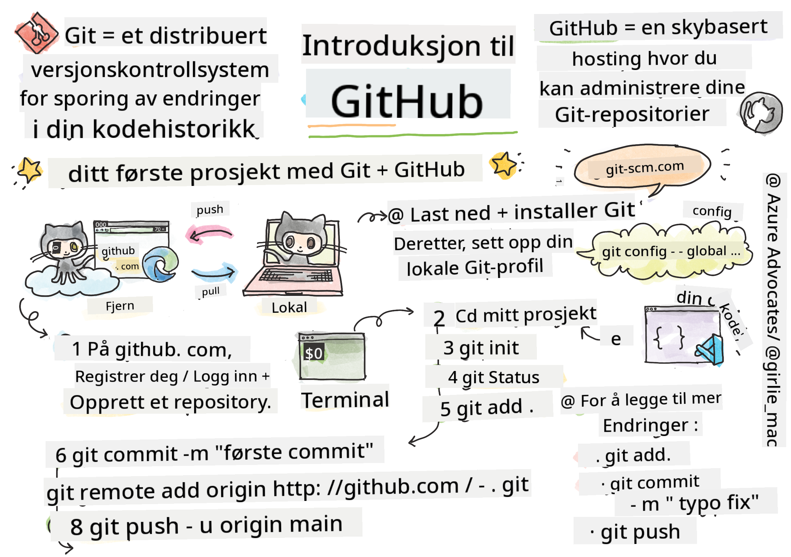
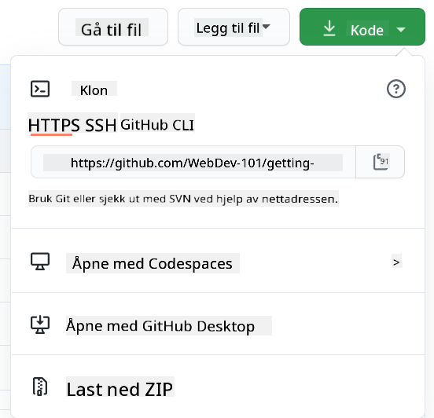

<!--
CO_OP_TRANSLATOR_METADATA:
{
  "original_hash": "05666cecb8983a72cf0ce1d18932b5b7",
  "translation_date": "2025-08-26T22:15:17+00:00",
  "source_file": "1-getting-started-lessons/2-github-basics/README.md",
  "language_code": "no"
}
-->
# Introduksjon til GitHub

Denne leksjonen dekker det grunnleggende om GitHub, en plattform for å lagre og administrere endringer i koden din.


> Sketchnote av [Tomomi Imura](https://twitter.com/girlie_mac)

## Forhåndsquiz
[Forhåndsquiz](https://ff-quizzes.netlify.app/web/quiz/3)

## Introduksjon

I denne leksjonen skal vi gå gjennom:

- hvordan spore arbeidet du gjør på maskinen din
- hvordan jobbe med prosjekter sammen med andre
- hvordan bidra til åpen kildekode

### Forutsetninger

Før du begynner, må du sjekke om Git er installert. Skriv følgende i terminalen:  
`git --version`

Hvis Git ikke er installert, [last ned Git](https://git-scm.com/downloads). Deretter setter du opp din lokale Git-profil i terminalen:
* `git config --global user.name "ditt-navn"`
* `git config --global user.email "din-epost"`

For å sjekke om Git allerede er konfigurert, kan du skrive:
`git config --list`

Du trenger også en GitHub-konto, en kodeeditor (som Visual Studio Code), og du må åpne terminalen din (eller: kommandolinjen).

Gå til [github.com](https://github.com/) og opprett en konto hvis du ikke allerede har en, eller logg inn og fyll ut profilen din.

✅ GitHub er ikke det eneste kodearkivet i verden; det finnes andre, men GitHub er det mest kjente.

### Forberedelse

Du trenger både en mappe med et kodeprosjekt på din lokale maskin (laptop eller PC) og et offentlig repository på GitHub, som vil tjene som et eksempel på hvordan du kan bidra til andres prosjekter.

---

## Kodehåndtering

La oss si at du har en mappe lokalt med et kodeprosjekt, og du ønsker å begynne å spore fremgangen din ved hjelp av git - versjonskontrollsystemet. Noen sammenligner det å bruke git med å skrive et kjærlighetsbrev til ditt fremtidige jeg. Når du leser commit-meldingene dine dager, uker eller måneder senere, vil du kunne huske hvorfor du tok en beslutning, eller "rulle tilbake" en endring - forutsatt at du skriver gode "commit-meldinger".

### Oppgave: Lag et repository og commit kode  

> Se video
> 
> [](https://www.youtube.com/watch?v=9R31OUPpxU4)

1. **Opprett et repository på GitHub**. På GitHub.com, i repositories-fanen, eller fra navigasjonslinjen øverst til høyre, finn knappen **new repo**.

   1. Gi repositoryet ditt (mappen) et navn.
   1. Velg **create repository**.

1. **Naviger til arbeidsmappen din**. I terminalen, bytt til mappen (også kjent som katalogen) du vil begynne å spore. Skriv:

   ```bash
   cd [name of your folder]
   ```

1. **Initialiser et git repository**. I prosjektet ditt, skriv:

   ```bash
   git init
   ```

1. **Sjekk status**. For å sjekke statusen til repositoryet ditt, skriv:

   ```bash
   git status
   ```

   Utdataene kan se omtrent slik ut:

   ```output
   Changes not staged for commit:
   (use "git add <file>..." to update what will be committed)
   (use "git checkout -- <file>..." to discard changes in working directory)

        modified:   file.txt
        modified:   file2.txt
   ```

   Typisk forteller en `git status`-kommando deg ting som hvilke filer som er klare til å _lagres_ i repoet eller har endringer som du kanskje vil bevare.

1. **Legg til alle filer for sporing**  
   Dette kalles også staging av filer/legging av filer i staging-området.

   ```bash
   git add .
   ```

   `git add` pluss `.`-argumentet indikerer at alle filene og endringene dine skal spores.

1. **Legg til utvalgte filer for sporing**

   ```bash
   git add [file or folder name]
   ```

   Dette hjelper oss med å legge til kun utvalgte filer i staging-området når vi ikke ønsker å committe alle filer samtidig.

1. **Fjern staging for alle filer**

   ```bash
   git reset
   ```

   Denne kommandoen hjelper oss med å fjerne staging for alle filer samtidig.

1. **Fjern staging for en bestemt fil**

   ```bash
   git reset [file or folder name]
   ```

   Denne kommandoen hjelper oss med å fjerne staging for kun en bestemt fil som vi ikke ønsker å inkludere i neste commit.

1. **Lagre arbeidet ditt**. På dette tidspunktet har du lagt til filene i et såkalt _staging-område_. Et sted hvor Git sporer filene dine. For å gjøre endringen permanent, må du _committe_ filene. For å gjøre dette, oppretter du en _commit_ med kommandoen `git commit`. En _commit_ representerer et lagringspunkt i historikken til repoet ditt. Skriv følgende for å opprette en _commit_:

   ```bash
   git commit -m "first commit"
   ```

   Dette committer alle filene dine og legger til meldingen "first commit". For fremtidige commit-meldinger bør du være mer beskrivende for å formidle hvilken type endring du har gjort.

1. **Koble ditt lokale Git-repo til GitHub**. Et Git-repo er nyttig på maskinen din, men på et tidspunkt vil du ha en sikkerhetskopi av filene dine et sted og også invitere andre til å jobbe med repoet ditt. Et flott sted for dette er GitHub. Husk at vi allerede har opprettet et repo på GitHub, så det eneste vi trenger å gjøre er å koble vårt lokale Git-repo til GitHub. Kommandoen `git remote add` gjør nettopp dette. Skriv følgende kommando:

   > Merk, før du skriver kommandoen, gå til GitHub-reposiden din for å finne repository-URL-en. Du vil bruke den i kommandoen nedenfor. Erstatt ```https://github.com/username/repository_name.git``` med GitHub-URL-en din.

   ```bash
   git remote add origin https://github.com/username/repository_name.git
   ```

   Dette oppretter en _remote_, eller tilkobling, kalt "origin" som peker på GitHub-repositoryet du opprettet tidligere.

1. **Send lokale filer til GitHub**. Så langt har du opprettet en _tilkobling_ mellom det lokale repoet og GitHub-repoet. La oss sende disse filene til GitHub med følgende kommando `git push`, slik:

   > Merk, navnet på grenen din kan være forskjellig som standard fra ```main```.

   ```bash
   git push -u origin main
   ```

   Dette sender commitene dine i "main"-grenen til GitHub.

2. **For å legge til flere endringer**. Hvis du vil fortsette å gjøre endringer og sende dem til GitHub, trenger du bare å bruke følgende tre kommandoer:

   ```bash
   git add .
   git commit -m "type your commit message here"
   git push
   ```

   > Tips, du vil kanskje også adoptere en `.gitignore`-fil for å forhindre at filer du ikke ønsker å spore, dukker opp på GitHub - som den notatfilen du lagrer i samme mappe, men som ikke har noe sted i et offentlig repository. Du kan finne maler for `.gitignore`-filer på [.gitignore templates](https://github.com/github/gitignore).

#### Commit-meldinger

En flott Git commit-emnelinje fullfører følgende setning:  
Hvis den brukes, vil denne committen <emnelinjen din her>

For emnet, bruk imperativ, nåtid: "endre" ikke "endret" eller "endrer".  
Som i emnet, bruk også imperativ, nåtid i kroppen (valgfritt). Kroppen bør inkludere motivasjonen for endringen og kontrastere dette med tidligere oppførsel. Du forklarer `hvorfor`, ikke `hvordan`.

✅ Ta noen minutter til å surfe rundt på GitHub. Kan du finne en virkelig flott commit-melding? Kan du finne en veldig minimal en? Hvilken informasjon synes du er den viktigste og mest nyttige å formidle i en commit-melding?

### Oppgave: Samarbeid

Hovedgrunnen til å legge ting på GitHub var å gjøre det mulig å samarbeide med andre utviklere.

## Jobbe med prosjekter sammen med andre

> Se video
>
> [](https://www.youtube.com/watch?v=bFCM-PC3cu8)

I repositoryet ditt, naviger til `Insights > Community` for å se hvordan prosjektet ditt sammenlignes med anbefalte fellesskapsstandarder.

Her er noen ting som kan forbedre GitHub-repoet ditt:
- **Beskrivelse**. Har du lagt til en beskrivelse for prosjektet ditt?
- **README**. Har du lagt til en README? GitHub gir veiledning for å skrive en [README](https://docs.github.com/articles/about-readmes/?WT.mc_id=academic-77807-sagibbon).
- **Retningslinjer for bidrag**. Har prosjektet ditt [retningslinjer for bidrag](https://docs.github.com/articles/setting-guidelines-for-repository-contributors/?WT.mc_id=academic-77807-sagibbon)?
- **Code of Conduct**. En [Code of Conduct](https://docs.github.com/articles/adding-a-code-of-conduct-to-your-project/).
- **Lisens**. Kanskje viktigst, en [lisens](https://docs.github.com/articles/adding-a-license-to-a-repository/).

Alle disse ressursene vil være til nytte for å onboarde nye teammedlemmer. Dette er typisk de tingene nye bidragsytere ser på før de i det hele tatt ser på koden din, for å finne ut om prosjektet ditt er det rette stedet for dem å bruke tiden sin.

✅ README-filer, selv om de tar tid å forberede, blir ofte oversett av travle vedlikeholdere. Kan du finne et eksempel på en spesielt beskrivende en? Merk: det finnes noen [verktøy for å lage gode README-er](https://www.makeareadme.com/) som du kanskje vil prøve.

### Oppgave: Slå sammen kode

Bidragsdokumenter hjelper folk med å bidra til prosjektet. De forklarer hvilke typer bidrag du ser etter og hvordan prosessen fungerer. Bidragsytere må gå gjennom en rekke trinn for å kunne bidra til repoet ditt på GitHub:

1. **Fork repoet ditt**. Du vil sannsynligvis at folk skal _forke_ prosjektet ditt. Å forke betyr å opprette en kopi av repositoryet ditt på deres GitHub-profil.
1. **Klon**. Derfra vil de klone prosjektet til sin lokale maskin.
1. **Opprett en gren**. Du vil be dem om å opprette en _gren_ for arbeidet sitt.
1. **Fokuser endringen på ett område**. Be bidragsytere om å konsentrere bidragene sine om én ting om gangen - på den måten er sjansen større for at du kan _slå sammen_ arbeidet deres. Tenk deg at de skriver en feilretting, legger til en ny funksjon og oppdaterer flere tester - hva om du bare vil, eller kan, implementere 2 av 3, eller 1 av 3 endringer?

✅ Tenk deg en situasjon der grener er spesielt kritiske for å skrive og levere god kode. Hvilke bruksområder kan du tenke deg?

> Merk, vær endringen du ønsker å se i verden, og opprett grener for ditt eget arbeid også. Alle commits du gjør, vil bli gjort på grenen du for øyeblikket er "sjekket ut" til. Bruk `git status` for å se hvilken gren det er.

La oss gå gjennom en bidragsarbeidsflyt. Anta at bidragsyteren allerede har _forket_ og _klonet_ repoet, slik at de har et Git-repo klart til å jobbe med på sin lokale maskin:

1. **Opprett en gren**. Bruk kommandoen `git branch` for å opprette en gren som vil inneholde endringene de har tenkt å bidra med:

   ```bash
   git branch [branch-name]
   ```

1. **Bytt til arbeidsgrenen**. Bytt til den spesifiserte grenen og oppdater arbeidskatalogen med `git switch`:

   ```bash
   git switch [branch-name]
   ```

1. **Gjør arbeidet**. På dette tidspunktet vil du legge til endringene dine. Ikke glem å fortelle Git om det med følgende kommandoer:

   ```bash
   git add .
   git commit -m "my changes"
   ```

   Sørg for å gi commiten din et godt navn, både for din egen del og for vedlikeholderen av repoet du hjelper til med.

1. **Kombiner arbeidet ditt med `main`-grenen**. På et tidspunkt er du ferdig med arbeidet, og du vil kombinere arbeidet ditt med det i `main`-grenen. `Main`-grenen kan ha endret seg i mellomtiden, så sørg for å oppdatere den til den nyeste med følgende kommandoer:

   ```bash
   git switch main
   git pull
   ```

   På dette tidspunktet vil du sørge for at eventuelle _konflikter_, situasjoner der Git ikke enkelt kan _kombinere_ endringene, skjer i arbeidsgrenen din. Derfor kjør følgende kommandoer:

   ```bash
   git switch [branch_name]
   git merge main
   ```

   Dette vil hente inn alle endringer fra `main` til grenen din, og forhåpentligvis kan du bare fortsette. Hvis ikke, vil VS Code fortelle deg hvor Git er _forvirret_, og du endrer bare de berørte filene for å angi hvilket innhold som er mest nøyaktig.

1. **Send arbeidet ditt til GitHub**. Å sende arbeidet ditt til GitHub betyr to ting. Å pushe grenen din til repoet ditt og deretter åpne en PR, Pull Request.

   ```bash
   git push --set-upstream origin [branch-name]
   ```

   Kommandoen ovenfor oppretter grenen på det forkede repoet ditt.

1. **Åpne en PR**. Deretter vil du åpne en PR. Du gjør dette ved å navigere til det forkede repoet på GitHub. Du vil se en indikasjon på GitHub der det spør om du vil opprette en ny PR. Klikk på det, og du blir tatt til et grensesnitt der du kan endre commit-meldingens tittel og gi den en mer passende beskrivelse. Nå vil vedlikeholderen av repoet du forket se denne PR-en, og _krysser fingrene_ vil de sette pris på og _slå sammen_ PR-en din. Du er nå en bidragsyter, yay :)

1. **Rydd opp**. Det anses som god praksis å _rydde opp_ etter at du har lykkes med å slå sammen en PR. Du vil rydde opp både i den lokale grenen din og grenen du pushet til GitHub. Først, la oss slette den lokalt med følgende kommando:

   ```bash
   git branch -d [branch-name]
   ```
Sørg for å gå til GitHub-siden for den forkede repoen neste gang og fjern den eksterne grenen du nettopp har pushet til.

`Pull request` virker som et merkelig begrep fordi du egentlig ønsker å pushe endringene dine til prosjektet. Men vedlikeholderen (prosjekteieren) eller kjerneteamet må vurdere endringene dine før de slås sammen med prosjektets "main"-gren, så du ber egentlig om en beslutning om endringen fra en vedlikeholder.

En pull request er stedet hvor man kan sammenligne og diskutere forskjellene som er introdusert på en gren, med anmeldelser, kommentarer, integrerte tester og mer. En god pull request følger omtrent de samme reglene som en commit-melding. Du kan legge til en referanse til et problem i problemsporing, for eksempel når arbeidet ditt løser et problem. Dette gjøres ved å bruke en `#` etterfulgt av nummeret på problemet ditt. For eksempel `#97`.

🤞Krysser fingrene for at alle sjekker går gjennom og at prosjekteieren(e) slår sammen endringene dine med prosjektet🤞

Oppdater din nåværende lokale arbeidsgren med alle nye commits fra den tilsvarende eksterne grenen på GitHub:

`git pull`

## Hvordan bidra til open source

Først, la oss finne et repository (eller **repo**) på GitHub som interesserer deg og som du ønsker å bidra med en endring til. Du vil kopiere innholdet til din maskin.

✅ En god måte å finne 'nybegynnervennlige' repoer på er å [søke etter taggen 'good-first-issue'](https://github.blog/2020-01-22-browse-good-first-issues-to-start-contributing-to-open-source/).



Det finnes flere måter å kopiere kode på. En måte er å "klone" innholdet i repoet, ved å bruke HTTPS, SSH eller GitHub CLI (Command Line Interface).

Åpne terminalen din og klon repoet slik:
`git clone https://github.com/ProjectURL`

For å jobbe med prosjektet, gå til riktig mappe:
`cd ProjectURL`

Du kan også åpne hele prosjektet ved å bruke [Codespaces](https://github.com/features/codespaces), GitHubs innebygde kodeeditor / skyutviklingsmiljø, eller [GitHub Desktop](https://desktop.github.com/).

Til slutt kan du laste ned koden i en zip-mappe.

### Noen flere interessante ting om GitHub

Du kan stjerne, følge og/eller "forke" ethvert offentlig repo på GitHub. Du finner dine stjernemerkede repoer i rullegardinmenyen øverst til høyre. Det er som å bokmerke, men for kode.

Prosjekter har en problemsporer, som oftest på GitHub i "Issues"-fanen med mindre annet er angitt, hvor folk diskuterer problemer relatert til prosjektet. Og fanen Pull Requests er der folk diskuterer og vurderer endringer som er under arbeid.

Prosjekter kan også ha diskusjoner i forum, e-postlister eller chattekanaler som Slack, Discord eller IRC.

✅ Ta en titt rundt ditt nye GitHub-repo og prøv noen ting, som å redigere innstillinger, legge til informasjon i repoet ditt, og opprette et prosjekt (som et Kanban-brett). Det er mye du kan gjøre!

---

## 🚀 Utfordring

Samarbeid med en venn for å jobbe med hverandres kode. Opprett et prosjekt sammen, fork kode, opprett grener og slå sammen endringer.

## Quiz etter forelesning
[Quiz etter forelesning](https://ff-quizzes.netlify.app/web/quiz/4)

## Gjennomgang & Selvstudium

Les mer om [å bidra til open source-programvare](https://opensource.guide/how-to-contribute/#how-to-submit-a-contribution).

[Git jukselapp](https://training.github.com/downloads/github-git-cheat-sheet/).

Øv, øv, øv. GitHub har flotte læringsveier tilgjengelig via [skills.github.com](https://skills.github.com):

- [Første uke på GitHub](https://skills.github.com/#first-week-on-github)

Du finner også mer avanserte kurs.

## Oppgave

Fullfør [kurset Første uke på GitHub](https://skills.github.com/#first-week-on-github)

---

**Ansvarsfraskrivelse**:  
Dette dokumentet er oversatt ved hjelp av AI-oversettelsestjenesten [Co-op Translator](https://github.com/Azure/co-op-translator). Selv om vi streber etter nøyaktighet, vær oppmerksom på at automatiserte oversettelser kan inneholde feil eller unøyaktigheter. Det originale dokumentet på sitt opprinnelige språk bør anses som den autoritative kilden. For kritisk informasjon anbefales profesjonell menneskelig oversettelse. Vi er ikke ansvarlige for eventuelle misforståelser eller feiltolkninger som oppstår ved bruk av denne oversettelsen.