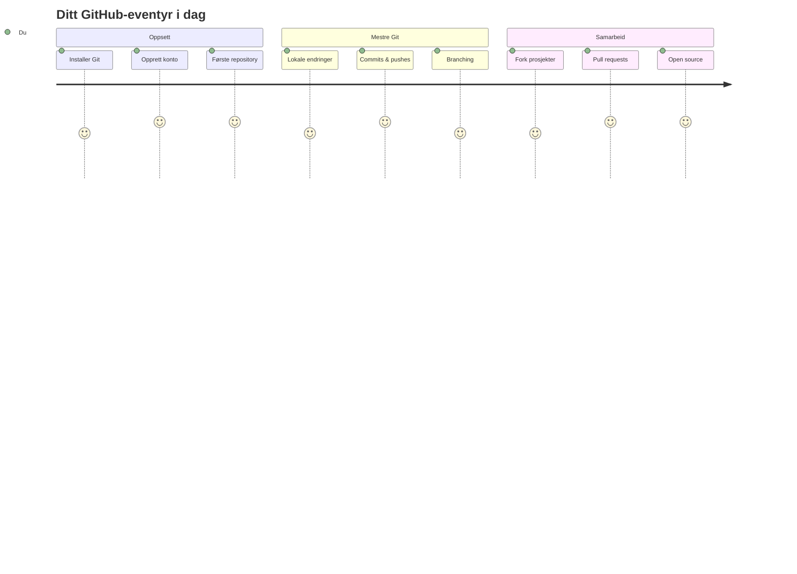
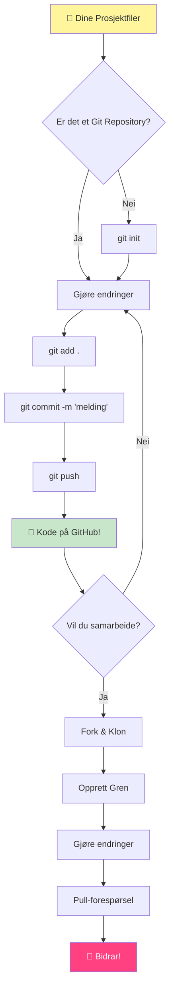
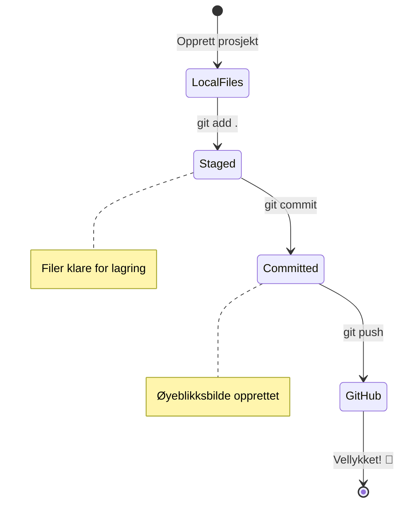
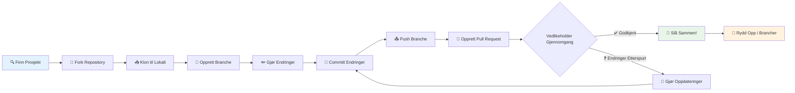
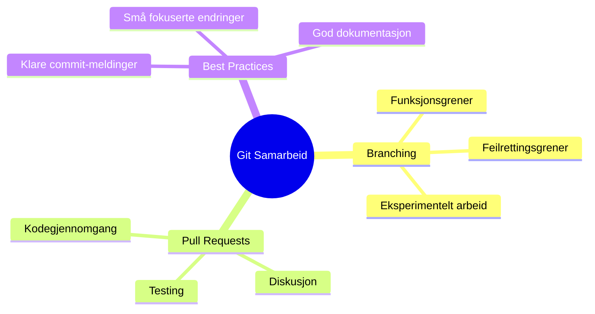
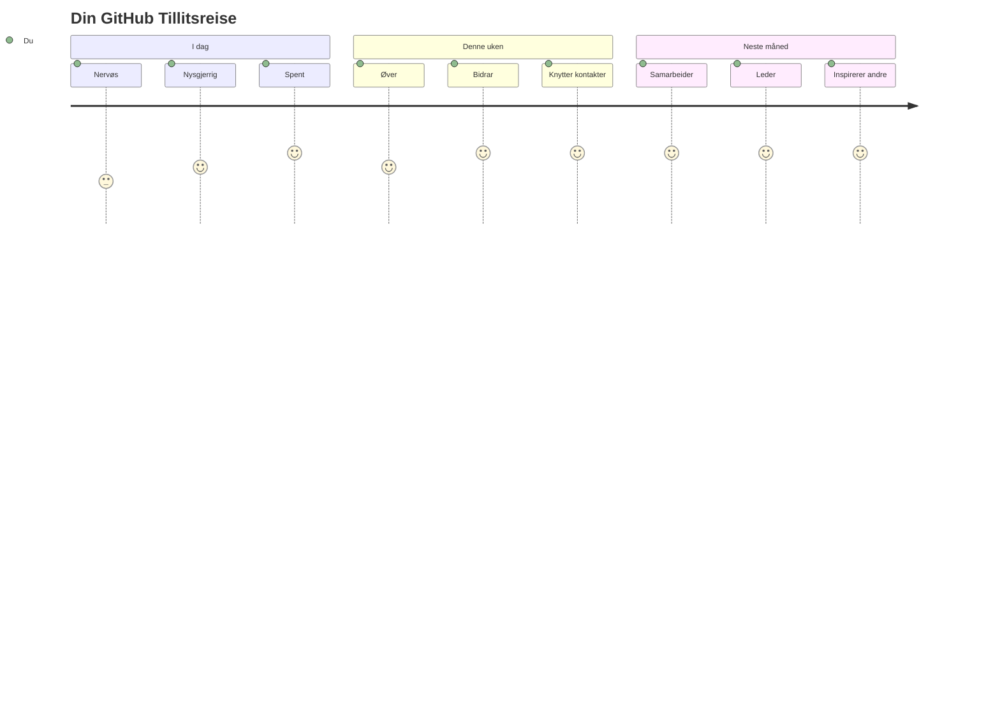

<!--
CO_OP_TRANSLATOR_METADATA:
{
  "original_hash": "5c383cc2cc23bb164b06417d1c107a44",
  "translation_date": "2026-01-07T00:59:31+00:00",
  "source_file": "1-getting-started-lessons/2-github-basics/README.md",
  "language_code": "no"
}
-->
# Introduksjon til GitHub

Hei der, fremtidige utvikler! 👋 Klar til å bli med millioner av kodere rundt om i verden? Jeg er virkelig spent på å introdusere deg for GitHub – tenk på det som sosiale medier for programmerere, bortsett fra at i stedet for å dele bilder av lunsjen din, deler vi kode og bygger utrolige ting sammen!

Dette er noe som virkelig blåser meg av banen: hver app på telefonen din, hver nettside du besøker, og de fleste verktøyene du lærer å bruke ble laget av team av utviklere som samarbeidet på plattformer akkurat som GitHub. Den musikkappen du elsker? Noen som deg har bidratt til den. Det spillet du ikke klarer å legge fra deg? Yep, sannsynligvis bygget med samarbeid på GitHub. Og nå SKAL DU lære hvordan du blir en del av det fantastiske fellesskapet!

Jeg vet dette kan føles som mye i starten – jeg husker selv da jeg stirret på min første GitHub-side og tenkte "Hva i alle dager betyr egentlig dette?" Men her er greia: hver eneste utvikler startet akkurat der du er nå. Når du er ferdig med denne leksjonen, vil du ha ditt helt eget GitHub-repositorium (tenk på det som din personlige prosjektutstilling i skyen), og du vil vite hvordan du lagrer arbeidet ditt, deler det med andre, og til og med bidrar til prosjekter som millioner av mennesker bruker.

Vi skal ta denne reisen sammen, ett steg av gangen. Ikke hast, ingen press – bare du, meg, og noen skikkelig kule verktøy som snart blir dine nye bestevenner!


> Sketchnote av [Tomomi Imura](https://twitter.com/girlie_mac)


## Forhåndsquiz
[Forhåndsquiz](https://ff-quizzes.netlify.app)

## Introduksjon

Før vi dykker ned i det virkelig spennende, la oss gjøre datamaskinen din klar for litt GitHub-magi! Tenk på dette som å organisere kunsttilbehøret ditt før du lager et mesterverk – å ha de riktige verktøyene klart gjør alt mye smidigere og mye morsommere.

Jeg skal gå gjennom hver oppsettsteg personlig, og jeg lover at det ikke er så skremmende som det kan se ut ved første øyekast. Hvis noe ikke klikker med en gang, er det helt normalt! Jeg husker jeg satte opp mitt første utviklingsmiljø og følte at jeg prøvde å lese eldgamle hieroglyfer. Hver eneste utvikler har vært akkurat der du er nå, og lurt på om de gjør det riktig. Spoiler alert: hvis du er her og lærer, gjør du det allerede riktig! 🌟

I denne leksjonen skal vi dekke:

- sporing av arbeidet du gjør på maskinen din
- hvordan jobbe på prosjekter sammen med andre
- hvordan bidra til åpen kildekode-programvare

### Forutsetninger

La oss gjøre datamaskinen din klar for litt GitHub-magi! Ikke bekymre deg – dette oppsettet trenger du bare gjøre én gang, så er du klar for hele kodereisen din.

Ok, la oss begynne med grunnlaget! Først må vi sjekke om Git allerede finnes på datamaskinen din. Git er i bunn og grunn som en supersmart assistent som husker hver eneste endring du gjør i koden din – mye bedre enn å panikktrykke Ctrl+S hvert annet sekund (vi har alle vært der!).

La oss se om Git allerede er installert ved å skrive denne magiske kommandoen i terminalen din:
`git --version`

Hvis Git ikke er der ennå, ingen problem! Gå bare til [last ned Git](https://git-scm.com/downloads) og hent det. Når du har installert det, må vi introdusere Git for deg på riktig måte:

> 💡 **Første gang-oppsett**: Disse kommandoene forteller Git hvem du er. Denne informasjonen vil bli knyttet til hver commit du lager, så velg et navn og en e-post du er komfortabel med å dele offentlig.

```bash
git config --global user.name "your-name"
git config --global user.email "your-email"
```

For å sjekke om Git allerede er konfigurert kan du skrive:
```bash
git config --list
```

Du vil også trenge en GitHub-konto, en kodeeditor (som Visual Studio Code), og du må åpne terminalen din (eller: kommandoprompt).

Gå til [github.com](https://github.com/) og opprett en konto hvis du ikke har en fra før, eller logg inn og fyll ut profilen din.

💡 **Moderne tips**: Vurder å sette opp [SSH-nøkler](https://docs.github.com/en/authentication/connecting-to-github-with-ssh) eller bruke [GitHub CLI](https://cli.github.com/) for enklere autentisering uten passord.

✅ GitHub er ikke det eneste kode-repositoriet der ute; det finnes andre, men GitHub er det mest kjente

### Forberedelse

Du trenger både en mappe med et kodeprosjekt på din lokale maskin (laptop eller PC), og et offentlig repositorium på GitHub, som vil tjene som et eksempel på hvordan du kan bidra til andres prosjekter.

### Holde koden din sikker

La oss snakke litt om sikkerhet – men ikke bekymre deg, vi skal ikke overvelde deg med skremmende ting! Tenk på disse sikkerhetsrutinene som å låse bilen eller huset ditt. De er enkle vaner som blir andre natur og beskytter det harde arbeidet ditt.

Vi skal vise deg moderne og sikre måter å jobbe med GitHub på helt fra starten. På den måten utvikler du gode vaner som vil tjene deg godt gjennom hele kodekarrieren din.

Når du jobber med GitHub er det viktig å følge sikkerhetsbest practices:

| Sikkerhetsområde | Beste praksis | Hvorfor det er viktig |
|------------------|--------------|----------------------|
| **Autentisering** | Bruk SSH-nøkler eller personlige tilgangstokener | Passord er mindre sikre og fases ut |
| **To-faktor autentisering** | Aktiver 2FA på GitHub-kontoen din | Legger til et ekstra lag med kontobeskyttelse |
| **Repositoriumssikkerhet** | Ikke commit sensitiv informasjon | API-nøkler og passord skal aldri være i offentlige repoer |
| **Avhengighetsstyring** | Aktiver Dependabot for oppdateringer | Holder dine avhengigheter sikre og oppdaterte |

> ⚠️ **Kritisk sikkerhetsvarsel**: Aldri commit API-nøkler, passord eller annen sensitiv informasjon i noen repositorium. Bruk miljøvariabler og `.gitignore`-filer for å beskytte sensitiv data.

**Moderne autentiseringsoppsett:**

```bash
# Generer SSH-nøkkel (moderne ed25519-algoritme)
ssh-keygen -t ed25519 -C "your_email@example.com"

# Sett opp Git til å bruke SSH
git remote set-url origin git@github.com:username/repository.git
```

> 💡 **Profftips**: SSH-nøkler eliminerer behovet for å skrive inn passord gjentatte ganger og er sikrere enn tradisjonelle autentiseringsmetoder.

---

## Administrer koden din som en proff

Ok, HER begynner det virkelig å bli spennende! 🎉 Vi skal lære hvordan du sporer og håndterer koden din slik proffene gjør det, og ærlig talt er dette en av mine favoritting å lære bort fordi det er en så stor forandring.

Se for deg at du skriver en fantastisk historie, og du vil holde styr på hvert utkast, hver strålende endring, og hvert "vent, det var genialt!"-øyeblikk underveis. Det er nøyaktig det Git gjør for koden din! Det er som å ha den mest utrolige tidsreisende notatboken som husker ALT – hver tast, hver endring, hvert "oops, nå brøt jeg alt"-øyeblikk som du kan angre på med en gang.

Jeg skal være ærlig – dette kan føles overveldende i starten. Da jeg begynte, tenkte jeg "Hvorfor kan jeg ikke bare lagre filene mine som vanlig?" Men stol på meg: når Git klikker for deg (og det vil det!), får du et øyeblikk der du tenker "Hvordan kunne jeg NOENSINNE kode uten dette?" Det er som å oppdage at du kan fly når du har gått overalt hele livet!

Si at du har en mappe lokalt med et kodeprosjekt og vil begynne å spore fremgangen din med git - versjonskontrollsystemet. Noen sammenligner bruk av git med å skrive et kjærlighetsbrev til ditt fremtidige jeg. Når du leser commit-meldingene dine dager, uker eller måneder senere kan du huske hvorfor du tok en beslutning, eller "tilbakestille" en endring – det vil si, når du skriver gode "commit-meldinger".


### Oppgave: Lag ditt første repositorium!

> 🎯 **Din oppgave (og jeg er så spent på deg!)**: Vi skal lage ditt aller første GitHub-repositorium sammen! Når vi er ferdige her, vil du ha ditt eget lille hjørne av internett hvor koden din lever, og du vil ha gjort din første "commit" (det er utviklerspråk for å lagre arbeidet ditt på en smart måte).
>
> Dette er virkelig et spesielt øyeblikk – du er i ferd med å bli en offisiell del av det globale utviklersamfunnet! Jeg husker fortsatt hvor spennende det var å lage mitt første repo og tenke "Wow, jeg gjør virkelig dette!"

La oss gå gjennom dette eventyret sammen, steg for steg. Ta den tiden du trenger med hver del – det er ingen premie for å skynde seg, og jeg lover at hvert eneste steg vil gi mening. Husk, hver kode-superstjerne du beundrer satt en gang her akkurat der du er, og var i ferd med å lage sitt første repositorium. Hvor kult er ikke det?

> Sjekk ut videoen
> 
> [](https://www.youtube.com/watch?v=9R31OUPpxU4)

**La oss gjøre dette sammen:**

1. **Lag ditt repositorium på GitHub**. Gå til GitHub.com og se etter den lysegrønne **New**-knappen (eller **+**-tegnet øverst til høyre). Klikk på den og velg **New repository**.

   Her er hva du skal gjøre:
   1. Gi repositoriet ditt et navn – gjør det meningsfullt for deg!
   1. Legg til en beskrivelse hvis du vil (det hjelper andre å forstå hva prosjektet ditt handler om)
   1. Bestem om det skal være offentlig (alle kan se det) eller privat (bare for deg)
   1. Jeg anbefaler å hake av for å legge til en README-fil – det er som forsiden av prosjektet ditt
   1. Klikk **Create repository** og feir – du har akkurat laget ditt første repo! 🎉

2. **Naviger til prosjektmappen din**. Nå åpner vi terminalen din (ikke vær redd, det er ikke så skummelt som det ser ut!). Vi må fortelle datamaskinen hvor prosjektfilene dine er. Skriv denne kommandoen:

   ```bash
   cd [name of your folder]
   ```

   **Hva vi gjør her:**
   - Vi sier egentlig "Hei datamaskin, ta meg til prosjektmappen min"
   - Det er som å åpne en bestemt mappe på skrivebordet, men vi gjør det med tekstkommandoer
   - Bytt ut `[name of your folder]` med det egentlige navnet på prosjektmappen din

3. **Gjør mappen din om til et Git-repositorium**. Nå skjer magien! Skriv:

   ```bash
   git init
   ```

   **Dette skjedde nettopp (kult, ikke sant!):**
   - Git laget akkurat en skjult `.git`-mappe i prosjektet ditt – du ser den ikke, men den er der!
   - Den vanlige mappen din er nå et "repositorium" som kan spore hver endring du gjør
   - Tenk på det som å gi mappen superkrefter til å huske alt

4. **Sjekk hva som skjer**. La oss se hva Git mener om prosjektet ditt akkurat nå:

   ```bash
   git status
   ```

   **Slik forstår du hva Git forteller deg:**
   
   Du kan se noe som dette:

   ```output
   Changes not staged for commit:
   (use "git add <file>..." to update what will be committed)
   (use "git restore <file>..." to discard changes in working directory)

        modified:   file.txt
        modified:   file2.txt
   ```

   **Ikke få panikk! Dette betyr:**
   - Filer i **rødt** er filer som har endringer, men ikke er klare til å lagres enda
   - Filer i **grønt** (når du ser dem) er klare til å lagres
   - Git hjelper deg ved å fortelle nøyaktig hva du kan gjøre videre

   > 💡 **Profftips**: Kommandoen `git status` er din beste venn! Bruk den når du er usikker på hva som foregår. Det er som å spørre Git "Hei, hva skjer akkurat nå?"

5. **Gjør filene klare til lagring** (dette kalles "staging"):

   ```bash
   git add .
   ```

   **Hva vi nettopp gjorde:**
   - Vi sa til Git "Hei, jeg vil inkludere ALLE filene i neste lagring"
   - `.` betyr "alt i denne mappen"
   - Nå er filene dine "staged" og klare for neste steg

   **Vil du være mer selektiv?** Du kan legge til bare bestemte filer:

   ```bash
   git add [file or folder name]
   ```

   **Hvorfor vil du kanskje gjøre det?**
   - Noen ganger vil du lagre beslektede endringer sammen
   - Det hjelper deg å organisere arbeidet ditt i logiske biter
   - Gjør det lettere å forstå hva som endret seg og når

   **Byttet mening?** Ikke stress! Du kan fjerne filer fra staging slik:

   ```bash
   # Fjern alt fra staging
   git reset
   
   # Fjern bare én fil fra staging
   git reset [file name]
   ```

   Ikke bekymre deg – dette sletter ikke arbeidet ditt, det fjerner bare filene fra "klare til lagring"-bunken.

6. **Lagre arbeidet ditt permanent** (gjør din første commit!):

   ```bash
   git commit -m "first commit"
   ```

   **🎉 Gratulerer! Du har akkurat gjort din første commit!**

   **Dette skjedde nettopp:**
   - Git tok et "øyeblikksbilde" av alle filene du hadde staged akkurat nå
   - Din commit-melding "first commit" forklarer hva dette lagringspunktet handler om
   - Git ga dette øyeblikksbildet en unik ID slik at du alltid kan finne det senere
   - Du har offisielt begynt å spore historikken til prosjektet ditt!

   > 💡 **Fremtidige commit-meldinger**: For neste commits, vær mer beskrivende! I stedet for "oppdatert ting", prøv "Legg til kontaktskjema på forsiden" eller "Fiks feil i navigasjonsmenyen". Ditt fremtidige jeg vil takke deg!

7. **Koble det lokale prosjektet til GitHub**. Akkurat nå eksisterer prosjektet ditt kun på datamaskinen din. La oss koble det til GitHub-repositoriet ditt slik at du kan dele det med verden!

   Først, gå til GitHub-repositoriets side og kopier URL-en. Kom så tilbake hit og skriv:

   ```bash
   git remote add origin https://github.com/username/repository_name.git
   ```
   
   (Bytt ut URL-en med din egen repositorie-URL!)

   **Dette gjorde vi akkurat:**
   - Vi opprettet en tilkobling mellom ditt lokale prosjekt og ditt GitHub-repositorium
   - "Origin" er bare et kallenavn for ditt GitHub-repositorium – det er som å legge til en kontakt i telefonen din
   - Nå vet din lokale Git hvor den skal sende koden din når du er klar til å dele den

   💡 **Enklere måte**: Hvis du har GitHub CLI installert, kan du gjøre dette med én kommando:
   ```bash
   gh repo create my-repo --public --push --source=.
   ```

8. **Send koden din til GitHub** (det store øyeblikket!):

   ```bash
   git push -u origin main
   ```

   **🚀 Dette er det! Du laster opp koden din til GitHub!**
   
   **Hva skjer:**
   - Dine commits reiser fra datamaskinen din til GitHub
   - `-u` flagget setter opp en permanent tilkobling slik at fremtidige pushes blir enklere
   - "main" er navnet på din primære branch (som hovedmappen)
   - Etter dette kan du bare skrive `git push` for fremtidige opplastinger!

   💡 **Hurtigtips**: Hvis branchen din heter noe annet (som "master"), bruk det navnet i stedet. Du kan sjekke med `git branch --show-current`.

9. **Din nye daglige kodeflyt** (her blir det vanedannende!):

   Fra nå av, når du gjør endringer i prosjektet ditt, har du denne enkle tre-trinns dansen:

   ```bash
   git add .
   git commit -m "describe what you changed"
   git push
   ```

   **Dette blir din kodepuls:**
   - Gjør noen fantastiske endringer i koden din ✨
   - Stage dem med `git add` ("Hei Git, se på disse endringene!")
   - Lagre dem med `git commit` og en beskrivende melding (fremtidige du kommer til å takke deg!)
   - Del dem med verden ved å bruke `git push` 🚀
   - Vask og gjenta – seriøst, dette blir like naturlig som å puste!

   Jeg elsker denne arbeidsflyten fordi det er som å ha flere lagringspunkter i et videospill. Har du gjort en endring du liker? Commit den! Vil du prøve noe risikabelt? Ikke noe problem – du kan alltid gå tilbake til din siste commit hvis ting går galt!

   > 💡 **Tips**: Du vil kanskje også lage en `.gitignore` fil for å hindre at filer du ikke ønsker å spore dukker opp på GitHub – som den notatfilen du har i samme mappe men som ikke har noe å gjøre i et offentlig repo. Du kan finne maler for `.gitignore` filer på [.gitignore templates](https://github.com/github/gitignore) eller lage en ved hjelp av [gitignore.io](https://www.toptal.com/developers/gitignore).

### 🧠 **Første innsjekk i repositoriet: Hvordan føltes det?**

**Ta et øyeblikk til å feire og reflektere:**
- Hvordan føltes det å se koden din dukke opp på GitHub for første gang?
- Hvilket steg føltes mest forvirrende, og hvilket føltes overraskende enkelt?
- Kan du forklare forskjellen mellom `git add`, `git commit`, og `git push` med egne ord?


> **Husk**: Selv erfarne utviklere glemmer noen ganger de eksakte kommandoene. Å få denne arbeidsflyten til å bli muskelminne krever øvelse – du gjør det kjempebra!

#### Moderne Git-arbeidsflyter

Vurder å ta i bruk disse moderne praksisene:

- **Conventional Commits**: Bruk et standardisert commit-meldingsformat som `feat:`, `fix:`, `docs:`, osv. Lær mer på [conventionalcommits.org](https://www.conventionalcommits.org/)
- **Atomiske commits**: Sørg for at hver commit representerer en enkelt logisk endring
- **Hyppige commits**: Commit ofte med beskrivende meldinger fremfor store, sjeldne commits

#### Commit-meldinger

En god Git commit-overskrift fullfører følgende setning:  
Hvis den blir brukt, vil denne committen <din overskrift her>

Bruk imperativ form i nåtid i overskriften: "endre" ikke "endret" eller "endringer".  
Som i overskriften, bruk også imperativ nåtid i teksten i kroppen (valgfritt). Kroppen bør inkludere motivasjonen for endringen og sammenligne med tidligere oppførsel. Du forklarer `hvorfor`, ikke `hvordan`.

✅ Ta noen minutter til å utforske GitHub. Kan du finne en virkelig god commit-melding? Kan du finne en veldig minimal? Hvilken informasjon synes du er viktigst og mest nyttig å formidle i en commit-melding?

## Jobbe sammen med andre (Den morsomme delen!)

Hold på hatten, for HER blir GitHub magisk! 🪄 Du har mestret å administrere din egen kode, men nå dykker vi ned i min absolutte favorittdel – samarbeid med fantastiske mennesker fra hele verden.

Se for deg dette: Du våkner i morgen og ser at noen i Tokyo forbedret koden din mens du sov. Så fikser noen i Berlin en feil du har sittet fast på. På ettermiddagen har en utvikler i São Paulo lagt til en funksjon du aldri hadde tenkt på. Det er ingen science fiction – det er bare en vanlig tirsdag i GitHub-universet!

Det som virkelig begeistrer meg er at samarbeidsferdighetene du er i ferd med å lære? Det er de nøyaktig samme arbeidsflytene som team hos Google, Microsoft og dine favoritt-startups bruker hver eneste dag. Du lærer ikke bare et kult verktøy – du lærer det hemmelige språket som får hele programvareverden til å samarbeide.

Seriøst, når du opplever suset ved at noen merger din første pull request, vil du forstå hvorfor utviklere blir så lidenskapelige om åpen kildekode. Det er som å være en del av verdens største, mest kreative teamprosjekt!

> Sjekk ut video
>
> [](https://www.youtube.com/watch?v=bFCM-PC3cu8)

Hovedgrunnen til å legge ting på GitHub var å gjøre det mulig å samarbeide med andre utviklere.


I ditt repositorium, gå til `Insights > Community` for å se hvordan prosjektet ditt sammenlignes med anbefalte fellesskapsstandarder.

Vil du gjøre repoet ditt profesjonelt og innbydende? Gå til repoet ditt og klikk på `Insights > Community`. Denne kule funksjonen viser hvordan prosjektet ditt sammenlignes med hva GitHub-fellesskapet mener er "gode repositorie-praksiser."

> 🎯 **Få prosjektet ditt til å skinne**: Et godt organisert repo med god dokumentasjon er som en ren, innbydende butikkfasade. Det forteller folk at du bryr deg om arbeidet ditt og gjør andre motivert til å bidra!

**Dette gjør et repo fantastisk:**

| Hva du bør legge til | Hvorfor det er viktig | Hva det gjør for deg |
|---------------------|----------------------|---------------------|
| **Beskrivelse** | Førsteinntrykk teller! | Folk vet med en gang hva prosjektet ditt gjør |
| **README** | Frontsiden til prosjektet ditt | Som en vennlig guide for nye besøkende |
| **Retningslinjer for bidrag** | Viser at du ønsker hjelp | Folk vet akkurat hvordan de kan hjelpe deg |
| **Adferdskodeks** | Skaper et vennlig rom | Alle føler seg velkommen til å Delta |
| **Lisens** | Juridisk klarhet | Andre vet hvordan de kan bruke koden din |
| **Sikkerhetspolicy** | Viser at du er ansvarlig | Demonstrerer profesjonell praksis |

> 💡 **Proff tips**: GitHub tilbyr maler for alle disse filene. Når du oppretter et nytt repositorium, huk av for å generere disse filene automatisk.

**Moderne GitHub-funksjoner å utforske:**

🤖 **Automatisering & CI/CD:**  
- **GitHub Actions** for automatisert testing og utrulling  
- **Dependabot** for automatisk oppdatering av avhengigheter  

💬 **Fellesskap & prosjektstyring:**  
- **GitHub Discussions** for fellesskapssamtaler utenfor issues  
- **GitHub Projects** for kanban-stil prosjektstyring  
- **Branchbeskyttelsesregler** for å sikre god kodekvalitet

Alle disse ressursene vil hjelpe til ved innføring av nye teammedlemmer. Og det er vanligvis det nye bidragsytere ser på før de til og med ser på koden din, for å finne ut om prosjektet ditt er riktig plass for dem å bruke tiden sin.

✅ README-filer, selv om de tar tid å lage, blir ofte neglisjert av travle vedlikeholdere. Kan du finne et eksempel på en spesielt beskrivende? Merk: det finnes noen [verktøy for å lage gode README-filer](https://www.makeareadme.com/) som du kanskje vil prøve.

### Oppgave: Merge litt kode

Bidragsdokumentasjon hjelper folk å bidra til prosjektet. Den forklarer hvilke typer bidrag du ser etter og hvordan prosessen fungerer. Bidragsytere må gjennom en serie steg for å kunne bidra til repoet ditt på GitHub:

1. **Forke repoet ditt** Du vil sannsynligvis at folk skal _forke_ prosjektet ditt. Å forke betyr å lage en kopi av repoet ditt på deres GitHub-profil.
1. **Clone**. Derfra kloner de prosjektet til sin lokale maskin.  
1. **Lag en branch**. Du vil be dem opprette en _branch_ for arbeidet sitt.  
1. **Fokuser endringen på ett område**. Be bidragsytere om å konsentrere bidragene sine på én ting om gangen - da er sjansen større for at du kan _merge_ inn arbeidet deres. Tenk deg at de skriver en feilretting, legger til en ny funksjon og oppdaterer flere tester – hva om du vil, eller bare kan, implementere 2 av 3, eller 1 av 3 endringer?

✅ Tenk deg en situasjon der brancher er spesielt kritisk for å skrive og levere god kode. Hvilke brukstilfeller kan du tenke deg?

> Husk, vær den endringen du ønsker å se i verden, og lag også brancher for ditt eget arbeid. Alle commits du gjør vil gjøres på branchen du for øyeblikket er "checked out" til. Bruk `git status` for å se hvilken branch det er.

La oss gå gjennom en bidragsyter-arbeidsflyt. Anta at bidragsyteren allerede har _forket_ og _klonet_ repoet, så de har et Git-repo klart for arbeid på sin lokale maskin:

1. **Lag en branch**. Bruk kommandoen `git branch` for å lage en branch som skal inneholde endringene de vil bidra med:

   ```bash
   git branch [branch-name]
   ```

   > 💡 **Moderne tilnærming**: Du kan også lage og bytte til ny branch i én kommando:
   ```bash
   git switch -c [branch-name]
   ```

1. **Bytt til arbeidsbranch**. Bytt til den angitte branchen og oppdater arbeidskatalogen med `git switch`:

   ```bash
   git switch [branch-name]
   ```

   > 💡 **Moderne notis**: `git switch` er den moderne erstatningen for `git checkout` ved branch-bytting. Det er klarere og tryggere for nybegynnere.

1. **Gjør arbeid**. Nå vil du legge til endringene dine. Ikke glem å fortelle Git om det med følgende kommandoer:

   ```bash
   git add .
   git commit -m "my changes"
   ```

   > ⚠️ **Commit-melding kvalitet**: Sørg for at du gir din commit et godt navn, både for din egen skyld og vedlikeholderen av repoet du hjelper på. Vær spesifikk om hva du endret!

1. **Kombiner arbeidet ditt med `main` branch**. På et tidspunkt er du ferdig med arbeidet og vil kombinere det med `main` branchen. `main` branchen kan ha endret seg i mellomtiden, så sørg først for å oppdatere den til siste versjon med følgende kommandoer:

   ```bash
   git switch main
   git pull
   ```

   Nå vil du forsikre deg om at eventuelle _konflikter_, situasjoner hvor Git ikke lett kan _kombinere_ endringene, oppstår i din arbeidsbranch. Derfor kjør følgende kommandoer:

   ```bash
   git switch [branch_name]
   git merge main
   ```

   Kommandoen `git merge main` vil hente alle endringer fra `main` inn i branchen din. Forhåpentligvis kan du bare fortsette. Hvis ikke, vil VS Code fortelle deg hvor Git er _forvirret_, og du kan endre de berørte filene for å angi hvilket innhold som er mest korrekt.
   
   💡 **Moderne alternativ**: Vurder å bruke `git rebase` for en renere historikk:
   ```bash
   git rebase main
   ```
   Dette "replayer" dine commits på toppen av siste main-branch og skaper en lineær historikk.

1. **Send arbeidet ditt til GitHub**. Å sende arbeidet ditt til GitHub innebærer to ting: å pushe branchen til ditt repo og så åpne en PR, Pull Request.

   ```bash
   git push --set-upstream origin [branch-name]
   ```

   Kommandoen over oppretter branchen på ditt forkede repo.

### 🤝 **Samarbeidsevner: Klar til å jobbe med andre?**

**La oss se hvordan du føler om samarbeid:**
- Gir ideen om forking og pull requests mening for deg nå?
- Hva er en ting med å jobbe med brancher du vil øve mer på?
- Hvor komfortabel føler du deg med å bidra til andres prosjekter?


> **Selvtillitsboost**: Hver eneste utvikler du beundrer var en gang nervøs for sin første pull request. GitHub-fellesskapet er utrolig imøtekommende for nykommere!

1. **Åpne en PR**. Neste steg er å åpne en PR. Du gjør det ved å navigere til det forkede repoet på GitHub. Du vil se en indikasjon på GitHub som spør om du vil lage en ny PR, du klikker på den og blir tatt til et grensesnitt hvor du kan endre commit-meldingens tittel, gi en mer passende beskrivelse. Nå vil vedlikeholderen av repoet du forked se denne PR og _krysser fingrene_ de setter pris på og _merger_ din PR. Nå er du en bidragsyter, hurra :)

   💡 **Moderne tips**: Du kan også lage PRs med GitHub CLI:
   ```bash
   gh pr create --title "Your PR title" --body "Description of changes"
   ```

   🔧 **Beste praksis for PRs**:
   - Link til relaterte issues med nøkkelord som "Fixes #123"
   - Legg til skjermbilder for UI-endringer
   - Be om spesifikke anmeldere
   - Bruk utkast-PR for arbeid under utvikling
   - Sørg for at alle CI-sjekker passerer før du ber om gjennomgang
1. **Rydd opp**. Det regnes som god praksis å _rydde opp_ etter at du har slått sammen en pull request (PR). Du vil rydde opp både i din lokale gren og grenen du pushet til GitHub. Først la oss slette den lokalt med følgende kommando: 

   ```bash
   git branch -d [branch-name]
   ```

   Sørg for at du går til GitHub-siden for den forkede repoen neste og fjerner den eksterne grenen du nettopp pushet til.

`Pull request` virker som et dumt begrep fordi egentlig vil du pushe endringene dine til prosjektet. Men vedlikeholderen (prosjekteieren) eller kjernegruppen må vurdere endringene dine før de slår dem sammen med prosjektets "main"-gren, så du ber egentlig om en beslutning om endring fra en vedlikeholder.

En pull request er stedet å sammenligne og diskutere forskjellene introdusert på en gren med gjennomganger, kommentarer, integrerte tester og mer. En god pull request følger omtrent de samme reglene som en commit-melding. Du kan legge til en referanse til et problem i issue-tracker, når arbeidet ditt for eksempel løser et problem. Dette gjøres ved å bruke en `#` etterfulgt av nummeret på problemet ditt. For eksempel `#97`.

🤞Kryss fingrene for at alle sjekker går igjennom og at prosjekteier(ne) slår endringene dine sammen i prosjektet🤞

Oppdater din nåværende lokale arbeidsgren med alle nye commits fra den tilsvarende eksterne grenen på GitHub:

`git pull`

## Bidra til åpen kildekode (Din sjanse til å gjøre en forskjell!)

Er du klar for noe som virkelig kommer til å blåse bort av meg? 🤯 La oss snakke om å bidra til open source-prosjekter – og jeg får frysninger bare av å tenke på å dele dette med deg!

Dette er din sjanse til å bli en del av noe helt ekstraordinært. Tenk deg å forbedre verktøyene som millioner av utviklere bruker hver dag, eller fikse en feil i en app som vennene dine elsker. Det er ikke bare en drøm – det er hva åpen kildekode-bidragsyting handler om!

Her er hva som gir meg gåsehud hver gang jeg tenker på det: hvert eneste verktøy du har lært med – kodeeditoren din, rammene vi skal utforske, til og med nettleseren du leser dette i – startet med noen akkurat som deg som gjorde sitt aller første bidrag. Den geniale utvikleren som laget din favoritt VS Code-utvidelse? De var engang en nybegynner som klikket på "create pull request" med skjelvende hender, akkurat som du er i ferd med å gjøre.

Og her er det vakreste: open source-fellesskapet er som internettets største gruppemamma-klem. De fleste prosjekter ser aktivt etter nykommere og har problemer merket "good first issue" spesielt for folk som deg! Vedlikeholdere blir oppriktig glade når de ser nye bidragsytere fordi de husker sine egne første steg.

```mermaid
flowchart TD
    A[🔍 Utforsk GitHub] --> B[🏷️ Finn "god første sak"]
    B --> C[📖 Les Retningslinjer for Bidrag]
    C --> D[🍴 Gaffel Repository]
    D --> E[💻 Sett Opp Lokalt Miljø]
    E --> F[🌿 Opprett Funksjonsgren]
    F --> G[✨ Gjør Ditt Bidrag]
    G --> H[🧪 Test Dine Endringer]
    H --> I[📝 Skriv Klar Commit]
    I --> J[📤 Push & Opprett PR]
    J --> K[💬 Engasjer Deg med Tilbakemeldinger]
    K --> L[🎉 Sammenflettet! Du er en Bidragsyter!]
    L --> M[🌟 Finn Neste Sak]
    
    style A fill:#e1f5fe
    style L fill:#c8e6c9
    style M fill:#fff59d
```
Du lærer ikke bare å kode her – du forbereder deg på å bli med i en global familie av byggere som våkner hver dag og tenker "Hvordan kan vi gjøre den digitale verden litt bedre?" Velkommen til klubben! 🌟

Først, la oss finne et repository (eller **repo**) på GitHub som interesserer deg og som du ønsker å bidra med en endring til. Du vil kopiere innholdet til din maskin.

✅ En god måte å finne 'nybegynnervennlige' repoer på er å [søke etter taggen 'good-first-issue'](https://github.blog/2020-01-22-browse-good-first-issues-to-start-contributing-to-open-source/).


Det finnes flere måter å kopiere kode på. En måte er å "klone" innholdet i repoet, ved å bruke HTTPS, SSH, eller GitHub CLI (Command Line Interface).

Åpne terminalen din og klon repoet slik:
```bash
# Bruker HTTPS
git clone https://github.com/ProjectURL

# Bruker SSH (krever SSH-nøkkeloppsett)
git clone git@github.com:username/repository.git

# Bruker GitHub CLI
gh repo clone username/repository
```

For å jobbe på prosjektet, bytt til riktig mappe:
`cd ProjectURL`

Du kan også åpne hele prosjektet ved å bruke:
- **[GitHub Codespaces](https://github.com/features/codespaces)** - GitHubs skyutviklingsmiljø med VS Code i nettleseren
- **[GitHub Desktop](https://desktop.github.com/)** - En GUI-applikasjon for Git-operasjoner  
- **[GitHub.dev](https://github.dev)** - Trykk `.`-tasten på et GitHub-repo for å åpne VS Code i nettleseren
- **VS Code** med GitHub Pull Requests-utvidelsen

Til slutt, du kan laste ned koden i en zippet mappe.

### Noen flere interessante ting om GitHub

Du kan stjerne, følge og/eller "forke" et offentlig repository på GitHub. Du finner dine stjernemerkede repos i nedtrekksmenyen øverst til høyre. Det er som bokmerking, men for kode.

Prosjekter har en issue-tracker, for det meste på GitHub i "Issues"-fanen med mindre annet er oppgitt, der folk diskuterer problemer som gjelder prosjektet. Og Pull Requests-fanen er der folk diskuterer og vurderer endringer som er under arbeid.

Prosjekter kan også ha diskusjoner i forum, mailinglister eller chattekanaler som Slack, Discord eller IRC.

🔧 **Moderne GitHub-funksjoner**:
- **GitHub Discussions** - Innebygd forum for samfunnsamtaler
- **GitHub Sponsors** - Støtt vedlikeholdere økonomisk  
- **Security-fanen** - Rapporter om sårbarheter og sikkerhetsråd
- **Actions-fanen** - Se automatiserte arbeidsflyter og CI/CD-pipelines
- **Insights-fanen** - Analyser om bidragsytere, commits og prosjektets helse
- **Projects-fanen** - GitHubs innebygde prosjektstyringsverktøy

✅ Ta en titt rundt i din nye GitHub-repo og prøv noen ting, som å redigere innstillinger, legge til informasjon i repoen, lage et prosjekt (som et Kanban-board), og sette opp GitHub Actions for automatisering. Det er mye du kan gjøre!

---

## 🚀 Utfordring 

Greit, det er på tide å teste dine blanke nye GitHub-superkrefter! 🚀 Her er en utfordring som kommer til å få alt til å falle på plass på den mest tilfredsstillende måten:

Ta med deg en venn (eller det familiemedlemmet som alltid spør hva du driver på med av alt dette "data-greiene") og legg ut på et samarbeidende kodeeventyr sammen! Her skjer den ekte magien – lag et prosjekt, la dem fork'e det, lag noen grener, og slå sammen endringer som de proffene du holder på å bli.

Jeg skal ikke lyve – du kommer sannsynligvis til å le på et tidspunkt (spesielt når dere begge prøver å endre samme linje), kanskje klø dere i hodet i forvirring, men dere vil definitivt ha de fantastiske "aha!"-øyeblikkene som gjør at all læring er verdt det. I tillegg er det noe spesielt med å dele den første vellykkede sammenslåingen med noen andre – det er som en liten feiring av hvor langt du har kommet!

Har du ikke en koding-venn enda? Ikke noe problem! GitHub-fellesskapet er fullt av utrolig imøtekommende folk som husker hvordan det var å være ny. Se etter repos med merkelapper "good first issue" – de sier i praksis "Hei nybegynnere, kom og lær med oss!" Hvor kult er ikke det?

## Quiz etter forelesning
[Quiz etter forelesning](https://ff-quizzes.netlify.app/web/en/)

## Gjennomgang & Fortsett å lære

Puh! 🎉 Se på deg – du har nettopp mestret GitHub-grunnleggende som en absolutt mester! Hvis hjernen din føles litt full akkurat nå, er det helt normalt og egentlig et godt tegn. Du har akkurat lært verktøy som tok meg uker å bli komfortabel med da jeg startet.

Git og GitHub er utrolig kraftige (alvorlig talt, veldig kraftige), og hver utvikler jeg kjenner – inkludert de som nå virker som trollmenn – måtte øve og snuble litt før alt falt på plass. Det faktum at du har kommet deg gjennom denne leksjonen betyr at du allerede er på vei mot å mestre noen av de viktigste verktøyene i en utviklers verktøykasse.

Her er noen helt fantastiske ressurser for å hjelpe deg med å øve og bli enda mer fantastisk:

- [Guide til å bidra til åpen kildekode](https://opensource.guide/how-to-contribute/#how-to-submit-a-contribution) – Din veikart til å gjøre en forskjell
- [Git jukselapp](https://training.github.com/downloads/github-git-cheat-sheet/) – Ha denne lett tilgjengelig for rask referanse!

Og husk: øvelse gjør fremgang, ikke perfeksjon! Jo mer du bruker Git og GitHub, jo mer naturlig blir det. GitHub har laget noen fantastiske interaktive kurs som lar deg øve i et trygt miljø:

- [Introduksjon til GitHub](https://github.com/skills/introduction-to-github)
- [Kommunisere ved hjelp av Markdown](https://github.com/skills/communicate-using-markdown)  
- [GitHub Pages](https://github.com/skills/github-pages)
- [Håndtere merge-konflikter](https://github.com/skills/resolve-merge-conflicts)

**Føler du deg eventyrlysten? Sjekk ut disse moderne verktøyene:**
- [GitHub CLI dokumentasjon](https://cli.github.com/manual/) – For når du vil føle deg som en kommandolinje-mester
- [GitHub Codespaces dokumentasjon](https://docs.github.com/en/codespaces) – Kode i skyen!
- [GitHub Actions dokumentasjon](https://docs.github.com/en/actions) – Automatiser alt
- [Beste praksis for Git](https://www.atlassian.com/git/tutorials/comparing-workflows) – Løft arbeidsflyten din til neste nivå

## GitHub Copilot Agent Challenge 🚀

Bruk Agent-modus for å fullføre følgende utfordring:

**Beskrivelse:** Lag et samarbeidsprosjekt for webutvikling som demonstrerer hele GitHub-arbeidsflyten du har lært i denne leksjonen. Denne utfordringen vil hjelpe deg med å øve på opprettelse av repositories, samarbeidsfunksjoner og moderne Git-arbeidsflyter i et ekte scenario.

**Oppgave:** Opprett et nytt offentlig GitHub-repository for et enkelt "Web Development Resources"-prosjekt. Repositoryet skal inkludere en godt strukturert README.md-fil med en liste over nyttige verktøy og ressurser for webutvikling, organisert etter kategorier (HTML, CSS, JavaScript, osv.). Sett opp repoet med riktige fellesskapsstandarder inkludert lisens, retningslinjer for bidrag og en adferdskodeks. Opprett minst to feature-grener: en for å legge til CSS-ressurser og en annen for JavaScript-ressurser. Lag commits til hver gren med beskrivende commit-meldinger, og opprett pull requests for å slå endringene tilbake til main. Aktiver GitHub-funksjoner som Issues, Discussions, og sett opp en enkel GitHub Actions-arbeidsflyt for automatiske sjekker.

## Oppgave 

Din oppgave, hvis du velger å ta den: Fullfør [Introduksjon til GitHub](https://github.com/skills/introduction-to-github) kurset på GitHub Skills. Dette interaktive kurset lar deg øve på alt du har lært i et trygt, guidet miljø. I tillegg får du en kul merkelapp når du er ferdig! 🏅

**Klar for flere utfordringer?**
- Konfigurer SSH-autentisering på GitHub-kontoen din (ingen flere passord!)
- Prøv å bruke GitHub CLI til dine daglige Git-operasjoner
- Opprett et repository med en GitHub Actions-arbeidsflyt
- Utforsk GitHub Codespaces ved å åpne akkurat dette repoet i en skybasert editor

---

## 🚀 Din GitHub-mester-tidslinje

### ⚡ **Hva du kan gjøre de neste 5 minuttene**
- [ ] Stjern merk dette repoet og 3 andre prosjekter som interesserer deg
- [ ] Sett opp tofaktorautentisering på din GitHub-konto
- [ ] Lag en enkel README for ditt første repository
- [ ] Følg 5 utviklere som inspirerer deg

### 🎯 **Hva du kan få til denne timen**
- [ ] Fullfør quizen etter leksjonen og reflekter over din GitHub-reise
- [ ] Sett opp SSH-nøkler for passordfri GitHub-autentisering
- [ ] Lag ditt første meningsfulle commit med en flott commit-melding
- [ ] Utforsk GitHubs "Explore"-fane for å oppdage populære prosjekter
- [ ] Øv på å fork'e et repository og gjøre en liten endring

### 📅 **Din ukeslange GitHub-reise**
- [ ] Fullfør GitHub Skills-kursene (Introduksjon til GitHub, Markdown)
- [ ] Lag din første pull request til et åpen kildekode-prosjekt
- [ ] Sett opp et GitHub Pages-nettsted for å vise frem arbeidet ditt
- [ ] Bli med i GitHub Discussions på prosjekter du er interessert i
- [ ] Opprett et repository med riktige fellesskapsstandarder (README, lisens mm.)
- [ ] Prøv GitHub Codespaces for skybasert utvikling

### 🌟 **Din månedslange transformasjon**
- [ ] Bidra til 3 forskjellige open source-prosjekter
- [ ] Mentor noen som er ny på GitHub (gi videre!)
- [ ] Sett opp automatiske arbeidsflyter med GitHub Actions
- [ ] Bygg en portefølje som viser dine GitHub-bidrag
- [ ] Delta i Hacktoberfest eller lignende community-arrangementer
- [ ] Bli vedlikeholder av ditt eget prosjekt som andre kan bidra til

### 🎓 **Avsluttende GitHub-mester sjekk**

**Feir hvor langt du har kommet:**
- Hva er din favoritt ting med å bruke GitHub?
- Hvilken samarbeidsfunksjon gleder du deg mest til?
- Hvor trygg føler du deg på å bidra til åpen kildekode nå?
- Hvilket prosjekt vil du bidra til først?


> 🌍 **Velkommen til det globale utviklerfellesskapet!** Du har nå verktøyene til å samarbeide med millioner av utviklere verden over. Ditt første bidrag kan virke lite, men husk – hvert stort open source-prosjekt startet med noen som gjorde sin aller første commit. Spørsmålet er ikke om du vil gjøre en forskjell, men hvilket fantastisk prosjekt som først får nytte av ditt unike perspektiv! 🚀

Husk: alle eksperter var en gang nybegynnere. Du fikser dette! 💪

---

<!-- CO-OP TRANSLATOR DISCLAIMER START -->
**Ansvarsfraskrivelse**:
Dette dokumentet er oversatt ved hjelp av AI-oversettelsestjenesten [Co-op Translator](https://github.com/Azure/co-op-translator). Selv om vi streber etter nøyaktighet, vennligst vær oppmerksom på at automatiske oversettelser kan inneholde feil eller unøyaktigheter. Det opprinnelige dokumentet på morsmålet bør betraktes som den autoritative kilden. For kritisk informasjon anbefales profesjonell menneskelig oversettelse. Vi er ikke ansvarlige for eventuelle misforståelser eller feiltolkninger som oppstår ved bruk av denne oversettelsen.
<!-- CO-OP TRANSLATOR DISCLAIMER END -->