# Lage tilgjengelige nettsider

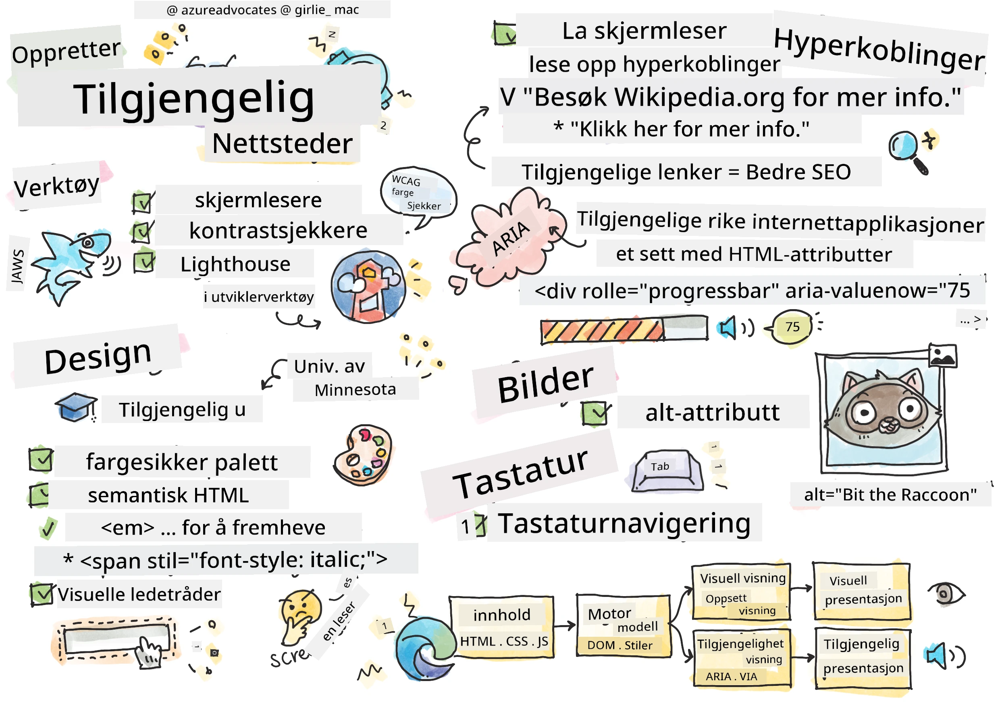
> Sketchnote av [Tomomi Imura](https://twitter.com/girlie_mac)

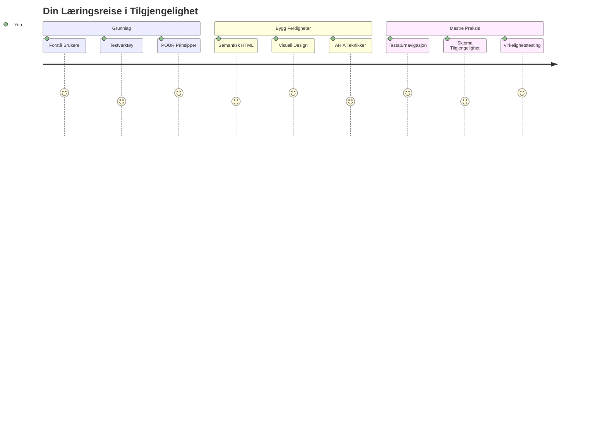
## Quiz før forelesning
[Quiz før forelesning](https://ff-quizzes.netlify.app/web/)

> Kraften til nettet ligger i dets universalitet. Tilgang for alle, uavhengig av funksjonshemning, er en viktig del.
>
> \- Sir Timothy Berners-Lee, W3C-direktør og oppfinner av World Wide Web

Her er noe som kanskje overrasker deg: når du bygger tilgjengelige nettsider, hjelper du ikke bare personer med funksjonsnedsettelser—du gjør faktisk nettet bedre for alle!

Har du noen gang lagt merke til de lave kantsteinene i gatehjørner? De ble opprinnelig designet for rullestoler, men hjelper nå folk med barnevogner, leveringsarbeidere med traller, reisende med koffert på hjul og syklister også. Det er akkurat slik tilgjengelig nettdesign fungerer—løsninger som hjelper én gruppe, ender ofte opp med å gagne alle. Ganske kult, ikke sant?

I denne leksjonen skal vi utforske hvordan lage nettsider som virkelig fungerer for alle, uansett hvordan de surfer på nettet. Du vil oppdage praktiske teknikker som allerede er innebygd i webstandarder, prøve testverktøy på egenhånd og se hvordan tilgjengelighet gjør sidene dine mer brukervennlige for alle brukere.

Ved slutten av denne leksjonen vil du ha selvtilliten til å gjøre tilgjengelighet til en naturlig del av utviklingsarbeidet ditt. Klar til å utforske hvordan gjennomtenkte designvalg kan åpne nettet for milliarder av brukere? La oss sette i gang!

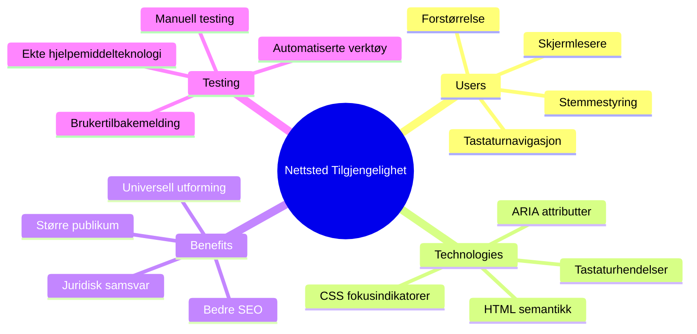
> Du kan ta denne leksjonen på [Microsoft Learn](https://docs.microsoft.com/learn/modules/web-development-101/accessibility/?WT.mc_id=academic-77807-sagibbon)!

## Forstå hjelpeteknologier

Før vi hopper inn i koding, la oss ta et øyeblikk for å forstå hvordan personer med ulike evner faktisk opplever nettet. Dette er ikke bare teori—forståelse av disse virkelige navigasjonsmønstrene vil gjøre deg til en mye bedre utvikler!

Hjelpeteknologier er ganske fantastiske verktøy som hjelper personer med funksjonsnedsettelser å interagere med nettsider på måter som kan overraske deg. Når du blir kjent med hvordan disse teknologiene fungerer, blir det mye mer intuitivt å lage tilgjengelige nettopplevelser. Det er som å lære å se koden din gjennom andres øyne.

### Skjermlesere

[Skjermlesere](https://en.wikipedia.org/wiki/Screen_reader) er ganske avanserte teknologier som omdanner digital tekst til tale eller punktskriftutgang. Selv om de først og fremst brukes av personer med synshemninger, er de også svært nyttige for brukere med lærevansker som dysleksi.

Jeg liker å tenke på en skjermleser som å ha en veldig smart forteller som leser en bok for deg. Den leser innhold høyt i en logisk rekkefølge, kunngjør interaktive elementer som "knapp" eller "lenke", og gir hurtigtaster for å hoppe rundt på en side. Men her er greia—skjermlesere kan bare jobbe sin magi hvis vi bygger nettsider med riktig struktur og meningsfullt innhold. Det er her du som utvikler kommer inn!

**Populære skjermlesere på ulike plattformer:**
- **Windows**: [NVDA](https://www.nvaccess.org/about-nvda/) (gratis og mest populær), [JAWS](https://webaim.org/articles/jaws/), [Narrator](https://support.microsoft.com/windows/complete-guide-to-narrator-e4397a0d-ef4f-b386-d8ae-c172f109bdb1/?WT.mc_id=academic-77807-sagibbon) (innebygd)
- **macOS/iOS**: [VoiceOver](https://support.apple.com/guide/voiceover/welcome/10) (innebygd og svært kapabel)
- **Android**: [TalkBack](https://support.google.com/accessibility/android/answer/6283677) (innebygd)
- **Linux**: [Orca](https://wiki.gnome.org/Projects/Orca) (gratis og åpen kildekode)

**Hvordan skjermlesere navigerer nettpresentasjoner:**

Skjermlesere tilbyr flere navigasjonsmetoder som gjør surfing effektivt for erfarne brukere:
- **Sekvensiell lesing**: Leser innhold fra topp til bunn, som å følge en bok
- **Landmark-navigasjon**: Hopper mellom seksjoner på siden (header, nav, main, footer)
- **Overskriftsnavigasjon**: Hopper mellom overskrifter for å forstå sidestruktur
- **Lenkelister**: Genererer en liste over alle lenker for rask tilgang
- **Skjemakontroller**: Navigerer direkte mellom inputfelter og knapper

> 💡 **Her er noe som blåste meg av banen**: 68 % av skjermleserbrukere navigerer hovedsakelig med overskrifter ([WebAIM Survey](https://webaim.org/projects/screenreadersurvey9/#finding)). Det betyr at overskriftsstrukturen din er som et veikart for brukerne—når den er riktig, hjelper du folk å finne veien i innholdet ditt raskere!

### Bygge din testarbeidsflyt

Her er noen gode nyheter—effektiv tilgjengelighetstesting trenger ikke være overveldende! Du vil kombinere automatiserte verktøy (de er fantastiske til å oppdage åpenbare feil) med noe praktisk testing. Her er en systematisk tilnærming jeg har funnet fanger de fleste problemer uten å spise opp hele dagen din:

**Viktig manuell test-arbeidsflyt:**

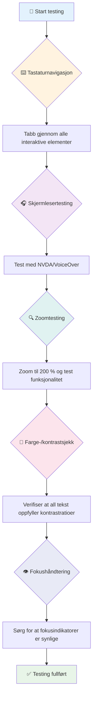
**Trinn-for-trinn test-sjekkliste:**
1. **Tastaturnavigasjon**: Bruk bare Tab, Shift+Tab, Enter, Space og piltaster
2. **Skjermlesertesting**: Slå på NVDA, VoiceOver eller Narrator og naviger med øynene lukket
3. **Zoom-testing**: Test med 200 % og 400 % zoomnivåer
4. **Fargkontrastverifisering**: Sjekk all tekst og brukergrensesnittelementer
5. **Test fokusindikatorer**: Sørg for at alle interaktive elementer har synlige fokus-tilstander

✅ **Start med Lighthouse**: Åpne nettleserens Utviklerverktøy, kjør en Lighthouse-tilgjengelighetsrevisjon, og bruk resultatene til å guide fokuset i den manuelle testingen din.

### Zoom- og forstørrelsesverktøy

Vet du hvordan du noen ganger kniper for å zoome på telefonen når teksten er for liten, eller myser på laptopskjermen i sterkt sollys? Mange brukere er avhengige av forstørrelsesverktøy for å gjøre innhold lesbart hver eneste dag. Dette inkluderer personer med nedsatt syn, eldre, og alle som noen gang har prøvd å lese en nettside ute i friluft.

Moderne zoomteknologier har utviklet seg utover å bare gjøre ting større. Å forstå hvordan disse verktøyene fungerer vil hjelpe deg å lage responsive design som forblir funksjonelle og attraktive på alle forstørrelsesnivåer.

**Moderne nettleserzoom-funksjoner:**
- **Sidezoom**: Skalerer alt innhold proporsjonalt (tekst, bilder, layout) – dette er den foretrukne metoden
- **Zoom kun på tekst**: Øker fontstørrelse mens original layout bevares
- **Knip-til-zoom**: Mobilgest for midlertidig forstørrelse
- **Nettleserstøtte**: Alle moderne nettlesere støtter zoom opptil 500 % uten å bryte funksjonalitet

**Spesialisert forstørrelsesprogramvare:**
- **Windows**: [Forstørrelsesglass](https://support.microsoft.com/windows/use-magnifier-to-make-things-on-the-screen-easier-to-see-414948ba-8b1c-d3bd-8615-0e5e32204198) (innebygd), [ZoomText](https://www.freedomscientific.com/training/zoomtext/getting-started/)
- **macOS/iOS**: [Zoom](https://www.apple.com/accessibility/mac/vision/) (innebygd med avanserte funksjoner)

> ⚠️ **Designhensyn**: WCAG krever at innhold forblir funksjonelt ved 200 % zoom. På dette nivået skal horisontal rulling være minimal, og alle interaktive elementer må fortsatt være tilgjengelige.

✅ **Test ditt responsive design**: Zoom nettleseren til 200 % og 400 %. Tilpasser layouten seg elegant? Kan du fortsatt få tilgang til all funksjonalitet uten overdreven rulling?

## Moderne tilgjengelighetstestverktøy

Nå som du forstår hvordan folk navigerer nettet med hjelpeteknologier, la oss utforske verktøy som hjelper deg å bygge og teste tilgjengelige nettsider.

Tenk på det slik: automatiserte verktøy er gode til å fange åpenbare problemer (som manglende alt-tekst), mens praktisk testing hjelper deg å sikre at siden føles god å bruke i virkeligheten. Sammen gir de deg selvtillit på at nettsidene dine fungerer for alle.

### Fargkontrasttesting

Her er noen gode nyheter: fargkontrast er en av de vanligste tilgjengelighetsutfordringene, men også en av de enkleste å fikse. God kontrast gagner alle—fra brukere med synsnedsettelser til folk som prøver å lese telefonen sin på stranden.

**WCAG-kontrastkrav:**

| Teksttype | WCAG AA (minimum) | WCAG AAA (forbedret) |
|-----------|-------------------|---------------------|
| **Normal tekst** (under 18 pt) | 4,5:1 kontrastforhold | 7:1 kontrastforhold |
| **Stor tekst** (18 pt+ eller 14 pt+ fet) | 3:1 kontrastforhold | 4,5:1 kontrastforhold |
| **UI-komponenter** (knapper, formularrammer) | 3:1 kontrastforhold | 3:1 kontrastforhold |

**Essensielle testverktøy:**
- [Colour Contrast Analyser](https://www.tpgi.com/color-contrast-checker/) – Skrivebordsapp med fargeplukker
- [WebAIM Contrast Checker](https://webaim.org/resources/contrastchecker/) – Nettbasert med umiddelbar feedback
- [Stark](https://www.getstark.co/) – Designverktøy-plugin for Figma, Sketch, Adobe XD
- [Accessible Colors](https://accessible-colors.com/) – Finn tilgjengelige fargepaletter

✅ **Lag bedre fargepaletter**: Start med merkevarens farger og bruk kontrastkontrollere for å lage tilgjengelige varianter. Dokumenter disse som tilgjengelige fargetoner i designsystemet ditt.

### Omfattende tilgjengelighetsrevisjon

Den mest effektive tilgjengelighetstesting kombinerer flere metoder. Ingen enkelt verktøy fanger opp alt, så ved å bygge en testrutine med forskjellige tilnærminger sikrer du grundig dekning.

**Nettleserbasert testing (innebygd i DevTools):**
- **Chrome/Edge**: Lighthouse-tilgjengelighetsrevisjon + tilgjengelighetspanel
- **Firefox**: Tilgjengelighetsinspektør med detaljert trevisning
- **Safari**: Revisjonsfane i Web Inspector med VoiceOver-simulering

**Profesjonelle testutvidelser:**
- [axe DevTools](https://www.deque.com/axe/devtools/) – Bransjestandard for automatisert testing
- [WAVE](https://wave.webaim.org/extension/) – Visuell tilbakemelding med feilmelding
- [Accessibility Insights](https://accessibilityinsights.io/) – Microsofts omfattende testsett

**Kommando-linje og CI/CD-integrasjon:**
- [axe-core](https://github.com/dequelabs/axe-core) – JavaScript-bibliotek for automatisert testing
- [Pa11y](https://pa11y.org/) – Kommando-linje tilgjengelighetstestverktøy
- [Lighthouse CI](https://github.com/GoogleChrome/lighthouse-ci) – Automatisert tilgjengelighetsscore

> 🎯 **Testmål**: sikte på Lighthouse-tilgjengelighetsscore på 95+ som baseline. Husk at automatiserte verktøy kun fanger ca. 30-40 % av tilgjengelighetsproblemer—manuell testing er fortsatt essensielt!

### 🧠 **Testferdighets-sjekk: Klar for å finne problemer?**

**La oss se hvordan du føler deg om tilgjengelighetstesting:**
- Hvilken testmetode virker mest tilgjengelig for deg akkurat nå?
- Kan du tenke deg å bruke bare tastaturnavigasjon en hel dag?
- Hva er en tilgjengelighetsbarriere du personlig har opplevd på nettet?

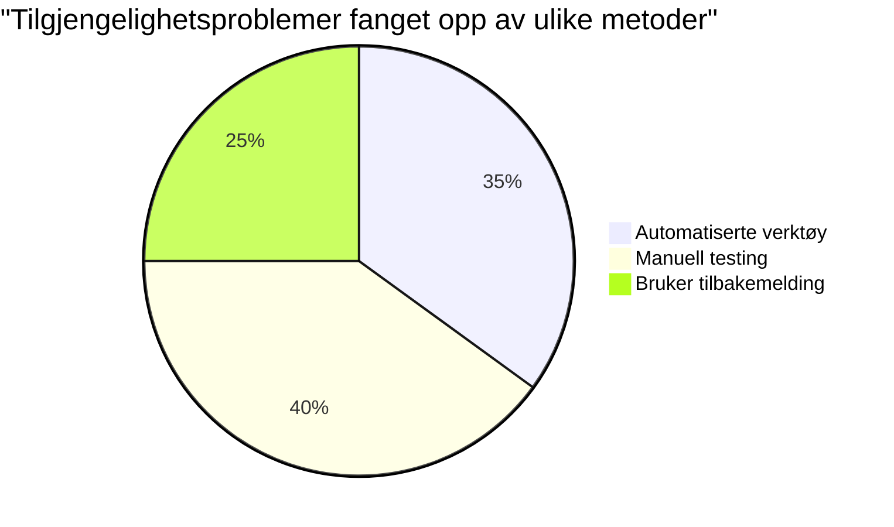
> **Selvtillitsboost**: Profesjonelle tilgjengelighetstestere bruker akkurat denne kombinasjonen av metoder. Du lærer bransjestandard praksis!

## Bygge tilgjengelighet fra bunnen av

Nøkkelen til suksess med tilgjengelighet er å bygge det inn i grunnlaget ditt fra dag én. Jeg vet det er fristende å tenke "jeg legger til tilgjengelighet senere", men det er som å prøve å legge til en rampe til et hus etter at det allerede er bygget. Mulig? Ja. Lett? Ikke akkurat.

Tenk på tilgjengelighet som å planlegge et hus—det er mye enklere å inkludere rullestoltilgang i de opprinnelige arkitektplanene enn å lage tilpasninger i etterkant.

### POUR-prinsippene: Din tilgjengelighetsgrunnmur

Retningslinjene for tilgjengelig webinnhold (WCAG) er bygget rundt fire grunnleggende prinsipper som staver ut POUR. Ikke bekymre deg—disse er ikke tørr, akademisk teori! De er praktiske retningslinjer for å lage innhold som fungerer for alle.

Når du får taket på POUR, blir tilgjengelighetsvalg mye mer intuitive. Det er som å ha en mental sjekkliste som guider designvalgene dine. La oss bryte det ned:

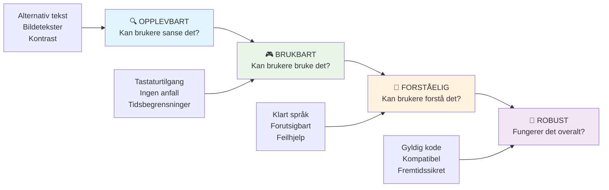
**🔍 Oppfattbart (Perceivable)**: Informasjon må kunne presenteres på måter brukerne kan oppfatte med sine tilgjengelige sanser

- Gi tekstalternativer for ikke-tekstlig innhold (bilder, videoer, lyd)
- Sørg for tilstrekkelig fargekontrast for all tekst og UI-komponenter
- Tilby teksting og transkripsjoner for multimedia
- Design innhold som forblir funksjonelt når det økes til 200 %
- Bruk flere sansemessige kjennetegn (ikke bare farge) for å formidle informasjon

**🎮 Opererbart (Operable)**: Alle grensesnittkomponenter må kunne betjenes med tilgjengelige inndata-metoder

- Gjør all funksjonalitet tilgjengelig via tastaturnavigasjon
- Gi brukerne nok tid til å lese og interagere med innhold
- Unngå innhold som kan forårsake anfall eller balanseforstyrrelser
- Hjelp brukerne å navigere effektivt med klar struktur og landemerker
- Sørg for at interaktive elementer har tilstrekkelig målstørrelse (minst 44 px)

**📖 Forståelig (Understandable)**: Informasjon og UI-operasjon må være klar og forståelig

- Bruk klart, enkelt språk tilpasset målgruppen din
- Sørg for at innhold opptrer og fungerer på forutsigbare, konsistente måter
- Gi klare instruksjoner og feilmeldinger ved brukerinput
- Hjelp brukerne å forstå og rette feil i skjemaer
- Organiser innhold med logisk leserekkefølge og informasjonsstruktur

**💪 Robust (Robust)**: Innhold må fungere pålitelig på tvers av ulike teknologier og hjelpeteknologier

- **Bruk gyldig, semantisk HTML som grunnlag**
- **Sørg for kompatibilitet med nåværende og fremtidige hjelpeteknologier**
- **Følg webstandarder og beste praksis for markup**
- **Test på tvers av forskjellige nettlesere, enheter og hjelpemidler**
- **Strukturer innhold slik at det degraderer pent når avanserte funksjoner ikke støttes**

### 🎯 **POUR-prinsippene: Slik gjør du dem holdbare**

**Rask refleksjon over grunnlaget:**
- Kan du tenke deg en nettsidefunksjon som bryter hvert POUR-prinsipp?
- Hvilket prinsipp føles mest naturlig for deg som utvikler?
- Hvordan kan disse prinsippene forbedre design for alle, ikke bare brukere med funksjonsnedsettelser?

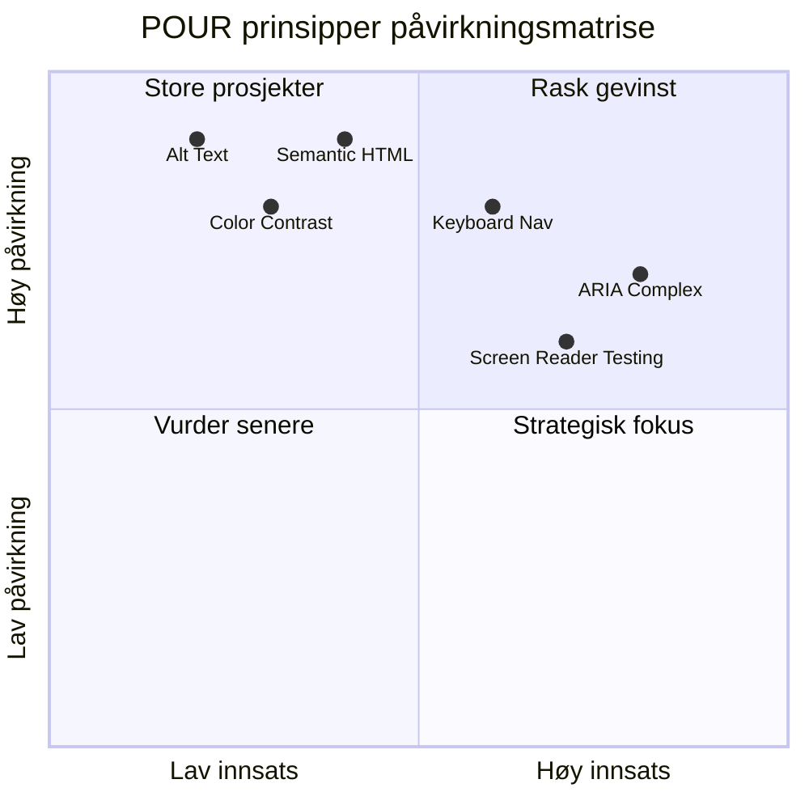
> **Husk**: Start med forbedringer som gir stor effekt med liten innsats. Semantisk HTML og alternativ tekst gir deg den største tilgjengelighetsforbedringen med minst innsats!

## Lage tilgjengelig visuell design

God visuell design og tilgjengelighet går hånd i hånd. Når du designer med tilgjengelighet i tankene, oppdager du ofte at disse begrensningene fører til renere, mer elegante løsninger som gagner alle brukere.

La oss utforske hvordan vi kan skape visuelt tiltalende design som fungerer for alle, uavhengig av deres synsevne eller betingelsene de ser innholdet under.

### Farge- og visuelle tilgjengelighetsstrategier

Farge er et kraftfullt kommunikasjonsmiddel, men den bør aldri være den eneste måten du formidler viktig informasjon på. Å designe utover farge skaper mer robuste, inkluderende opplevelser som fungerer i flere situasjoner.

**Design for fargesynsvariasjoner:**

Omtrent 8 % av menn og 0,5 % av kvinner har en form for fargesynsvariasjon (ofte kalt «fargeblindhet»). De vanligste typene er:
- **Deuteranopi**: Vansker med å skille rødt og grønt
- **Protanopi**: Rødt ser mer dempet ut
- **Tritanopi**: Vansker med blått og gult (sjeldent)

**Inkluderende fargestrategier:**

```css
/* ❌ Bad: Using only color to indicate status */
.error { color: red; }
.success { color: green; }

/* ✅ Good: Color plus icons and context */
.error {
  color: #d32f2f;
  border-left: 4px solid #d32f2f;
}
.error::before {
  content: "⚠️";
  margin-right: 8px;
}

.success {
  color: #2e7d32;
  border-left: 4px solid #2e7d32;
}
.success::before {
  content: "✅";
  margin-right: 8px;
}
```

**Utover grunnleggende kontrastkrav:**
- Test fargevalgene dine med fargeblindhetssimulatorer
- Bruk mønstre, teksturer eller former i tillegg til fargekoding
- Sørg for at interaktive tilstander forblir gjenkjennelige uten farge
- Tenk på hvordan designet ser ut i høykontrastmodus

✅ **Test fargetilgjengeligheten din**: Bruk verktøy som [Coblis](https://www.color-blindness.com/coblis-color-blindness-simulator/) for å se hvordan siden din ser ut for brukere med ulike typer fargesyn.

### Fokusindikatorer og interaksjonsdesign

Fokusindikatorer er det digitale ekvivalenten til en markør—de viser tastaturbrukere hvor de er på siden. Godt designede fokusindikatorer forbedrer opplevelsen for alle ved å gjøre interaksjoner tydelige og forutsigbare.

**Beste praksis for moderne fokusindikatorer:**

```css
/* Enhanced focus styles that work across browsers */
button:focus-visible {
  outline: 2px solid #0066cc;
  outline-offset: 2px;
  box-shadow: 0 0 0 4px rgba(0, 102, 204, 0.25);
}

/* Remove focus outline for mouse users, preserve for keyboard users */
button:focus:not(:focus-visible) {
  outline: none;
}

/* Focus-within for complex components */
.card:focus-within {
  box-shadow: 0 0 0 3px rgba(74, 144, 164, 0.5);
  border-color: #4A90A4;
}

/* Ensure focus indicators meet contrast requirements */
.custom-focus:focus-visible {
  outline: 3px solid #ffffff;
  outline-offset: 2px;
  box-shadow: 0 0 0 6px #000000;
}
```

**Krav til fokusindikatorer:**
- **Synlighet**: Må ha minst 3:1 kontrastforhold mot omkringliggende elementer
- **Bredde**: Minimum 2px tykkelse rundt hele elementet
- **Varighet**: Skal være synlig til fokus flyttes til et annet element
- **Forskjell**: Må visuelt skille seg fra andre UI-tilstander

> 💡 **Designtips**: Gode fokusindikatorer bruker ofte en kombinasjon av outline, boks-skygge og fargeendringer for å sikre synlighet mot ulike bakgrunner og kontekster.

✅ **Revider fokusindikatorer**: Naviger med Tab gjennom nettstedet ditt og noter hvilke elementer som har klare fokusindikatorer. Er noen vanskelige å se eller mangler helt?

### Semantisk HTML: Grunnlaget for tilgjengelighet

Semantisk HTML er som å gi hjelpemidler et GPS-system for nettsiden din. Når du bruker riktige HTML-elementer for deres tiltenkte formål, gir du i praksis skjermlesere, tastatur og andre verktøy en detaljert veibeskrivelse som hjelper brukerne å navigere effektivt.

Her er en analogi som virkelig traff meg: semantisk HTML er forskjellen på et godt organisert bibliotek med klare kategorier og hjelpsomme skilt versus et lager der bøkene ligger spredt tilfeldig. Begge steder har de samme bøkene, men hvor ville du helst prøve å finne noe? Akkurat!

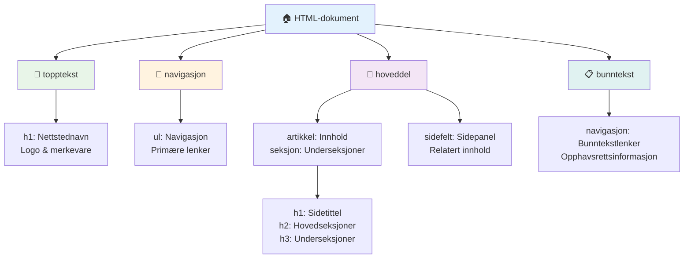
**Byggeklosser for tilgjengelig sidestruktur:**

```html
<!-- Landmark elements provide page navigation structure -->
<header>
  <h1>Your Site Name</h1>
  <nav aria-label="Main navigation">
    <ul>
      <li><a href="/home">Home</a></li>
      <li><a href="/about">About</a></li>
      <li><a href="/services">Services</a></li>
    </ul>
  </nav>
</header>

<main>
  <article>
    <header>
      <h1>Article Title</h1>
      <p>Published on <time datetime="2024-10-14">October 14, 2024</time></p>
    </header>
    
    <section>
      <h2>First Section</h2>
      <p>Content that relates to this section...</p>
    </section>
    
    <section>
      <h2>Second Section</h2>
      <p>More related content...</p>
    </section>
  </article>
  
  <aside>
    <h2>Related Links</h2>
    <nav aria-label="Related articles">
      <ul>
        <li><a href="/related-1">First related article</a></li>
        <li><a href="/related-2">Second related article</a></li>
      </ul>
    </nav>
  </aside>
</main>

<footer>
  <p>&copy; 2024 Your Site Name. All rights reserved.</p>
  <nav aria-label="Footer links">
    <ul>
      <li><a href="/privacy">Privacy Policy</a></li>
      <li><a href="/contact">Contact Us</a></li>
    </ul>
  </nav>
</footer>
```

**Hvorfor semantisk HTML transformerer tilgjengelighet:**

| Semantisk element | Formål | Fordel for skjermleser |
|------------------|---------|------------------------|
| `<header>` | Side- eller seksjonsoverskrift | "Banner landemerke" – rask navigasjon til toppen |
| `<nav>` | Navigasjonslenker | "Navigasjonslandemerke" – liste over navigasjonsseksjoner |
| `<main>` | Hovedinnhold på siden | "Hovedlandemerke" – hopp direkte til innhold |
| `<article>` | Selvstendig innhold | Annonserer artikkelgrenser |
| `<section>` | Tematiske innholdgrupper | Gir struktur til innholdet |
| `<aside>` | Relatert sidelayout | "Komplementært landemerke" |
| `<footer>` | Side- eller seksjonsbunntekst | "Contentinfo landemerke" |

**Skjermleserens superkrefter med semantisk HTML:**
- **Landemernavigasjon**: Hopp raskt mellom store seksjoner på siden
- **Overskriftsoversikt**: Generer innholdsfortegnelse fra overskriftsstrukturen
- **Elementlister**: Lag lister over alle lenker, knapper eller skjemaelementer
- **Kontekstbevissthet**: Forstå forholdet mellom innholdseksjoner

> 🎯 **Rask test**: Prøv å navigere på siden med skjermleser ved hjelp av landemerkeskift (D for landemerke, H for overskrift, K for lenke i NVDA/JAWS). Gir navigasjonen mening?

### 🏗️ **Semantisk HTML-mesterevaluering: Bygge sterke grunnmurer**

**La oss vurdere din semantiske forståelse:**
- Kan du identifisere landemerkene på en nettside bare ved å se på HTML?
- Hvordan forklarer du forskjellen mellom `<section>` og `<div>` til en venn?
- Hva sjekker du først hvis en skjermleserbruker rapporterer navigasjonsproblemer?

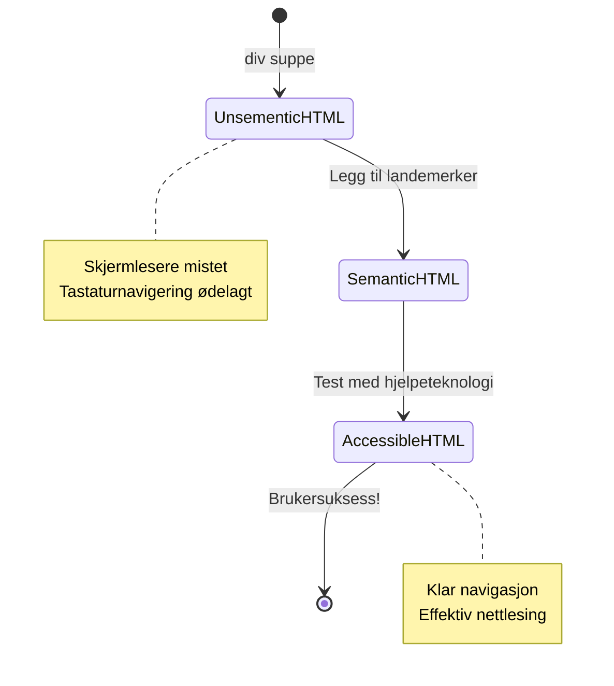
> **Profftips**: God semantisk HTML løser omtrent 70 % av tilgjengelighetsproblemer automatisk. Mestre dette grunnlaget så er du godt på vei!

✅ **Revider din semantiske struktur**: Bruk Tilgjengelighet-panelet i nettleserens DevTools for å se tilgjengelighetstreet og sørg for at markeringen din skaper en logisk struktur.

### Overskriftshierarki: Lage en logisk innholdsoversikt

Overskrifter er helt avgjørende for tilgjengelig innhold—de er som ryggraden som holder alt sammen. Skjermleserbrukere er helt avhengige av overskrifter for å forstå og navigere innholdet ditt. Tenk på det som å gi en innholdsfortegnelse til siden din.

**Her er gullregelen for overskrifter:**
Hopp aldri over nivåer. Gå alltid logisk fra `<h1>` til `<h2>`, deretter `<h3>`, og videre. Husker du å lage disposisjoner på skolen? Det er akkurat samme prinsipp—du ville ikke hoppet fra «I. Hovedpoeng» rett til «C. Undersubpoeng» uten et «A. Underpoeng» imellom, ikke sant?

**Eksempel på perfekt overskriftsstruktur:**

```html
<!-- ✅ Excellent: Logical, hierarchical progression -->
<main>
  <h1>Complete Guide to Web Accessibility</h1>
  
  <section>
    <h2>Understanding Screen Readers</h2>
    <p>Introduction to screen reader technology...</p>
    
    <h3>Popular Screen Reader Software</h3>
    <p>NVDA, JAWS, and VoiceOver comparison...</p>
    
    <h3>Testing with Screen Readers</h3>
    <p>Step-by-step testing instructions...</p>
  </section>
  
  <section>
    <h2>Color and Contrast Guidelines</h2>
    <p>Designing with sufficient contrast...</p>
    
    <h3>WCAG Contrast Requirements</h3>
    <p>Understanding the different contrast levels...</p>
    
    <h3>Testing Tools and Techniques</h3>
    <p>Tools for verifying contrast ratios...</p>
  </section>
</main>
```

```html
<!-- ❌ Problematic: Skipping levels, inconsistent structure -->
<h1>Page Title</h1>
<h3>Subsection</h3> <!-- Skipped h2 -->
<h2>This should come before h3</h2>
<h1>Another main heading?</h1> <!-- Multiple h1s -->
```

**Beste praksis for overskrifter:**
- **Én `<h1>` per side**: Vanligvis hovedsidetittel eller primærinnholdets overskrift
- **Logisk progresjon**: Aldri hopp over nivåer (h1 → h2 → h3, ikke h1 → h3)
- **Beskrivende innhold**: Gjør overskrifter meningsfulle når de leses utenom kontekst
- **Visuell styling med CSS**: Bruk CSS for utseendet, HTML-nivåer for strukturen

**Statistikk om skjermleseres navigasjon gjennom overskrifter:**
- 68 % av skjermleserbrukere navigerer via overskrifter ([WebAIM Survey](https://webaim.org/projects/screenreadersurvey9/#finding))
- Brukere forventer en logisk oversiktsstruktur
- Overskrifter gir raskest måte å forstå sidens struktur på

> 💡 **Profftips**: Bruk nettleserutvidelser som "HeadingsMap" for å visualisere overskriftsstrukturen din. Den bør leses som en godt organisert innholdsfortegnelse.

✅ **Test overskriftsstrukturen**: Bruk en skjermlesers overskriftsnavigasjon (H-tasten i NVDA) for å hoppe gjennom overskriftene dine. Forteller progresjonen innholdets historie logisk?

### Avanserte visuelle tilgjengelighetsteknikker

Utover det grunnleggende om kontrast og farge finnes det avanserte teknikker som hjelper med å skape virkelig inkluderende visuelle opplevelser. Disse metodene sikrer at innholdet ditt fungerer under ulike visningsforhold og med hjelpemidler.

**Essensielle strategier for visuell kommunikasjon:**

- **Multimodal tilbakemelding**: Kombiner visuelle, tekstlige og noen ganger lydsignaler
- **Progressiv avsløring**: Presenter informasjon i bite-sized biter
- **Konsekvente interaksjonsmønstre**: Bruk velkjente brukergrensesnittkonvensjoner
- **Responsiv typografi**: Skaler tekst passende på tvers av enheter
- **Laste- og feilmeldingsstatus**: Gi tydelig tilbakemelding for alle brukerhandlinger

**CSS-verktøy for bedre tilgjengelighet:**

```css
/* Screen reader only text - visually hidden but accessible */
.sr-only {
  position: absolute;
  width: 1px;
  height: 1px;
  padding: 0;
  margin: -1px;
  overflow: hidden;
  clip: rect(0, 0, 0, 0);
  white-space: nowrap;
  border: 0;
}

/* Skip link for keyboard navigation */
.skip-link {
  position: absolute;
  top: -40px;
  left: 6px;
  background: #000000;
  color: #ffffff;
  padding: 8px 16px;
  text-decoration: none;
  border-radius: 4px;
  font-weight: bold;
  transition: top 0.3s ease;
  z-index: 1000;
}

.skip-link:focus {
  top: 6px;
}

/* Reduced motion respect */
@media (prefers-reduced-motion: reduce) {
  .skip-link {
    transition: none;
  }
  
  * {
    animation-duration: 0.01ms !important;
    animation-iteration-count: 1 !important;
    transition-duration: 0.01ms !important;
  }
}

/* High contrast mode support */
@media (prefers-contrast: high) {
  .button {
    border: 2px solid;
  }
}
```

> 🎯 **Tilgjengelighetsmønster**: «Skip link» er essensiell for tastaturbrukere. Den bør være det første fokuserbare elementet på siden din og hoppe direkte til hovedinnholdet.

✅ **Implementer hoppnavigering**: Legg til hopp-lenker på sidene dine og test dem ved å trykke Tab så snart siden lastes. De skal dukke opp og gjøre det mulig å hoppe til hovedinnholdet.

## Lage meningsfylt lenketekst

Lenker er i bunn og grunn det vi veier oss gjennom nettet med, men dårlig skrevet lenketekst er som veiskilt som bare sier «Sted» i stedet for «Sentrum Chicago». Ikke særlig hjelpsomt, ikke sant?

Dette blåste meg av banen da jeg først lærte det: skjermlesere kan hente ut alle lenkene fra en side og vise dem som en stor liste. Tenk om noen ga deg en katalog over alle lenkene på siden din. Ville hver enkelt gi mening alene? Det er testen lenketeksten din må bestå!

### Forståelse av navigasjonsmønstre for lenker

Skjermlesere tilbyr kraftige navigasjonsfunksjoner for lenker som avhenger av godt skrevet lenketekst:

**Lenkenavigasjonsmetoder:**
- **Sekvensiell opplesning**: Lenker leses i kontekst som del av innholdsstrømmen
- **Generering av lenkelister**: Alle lenker på siden samles i en søkbar katalog
- **Rask navigering**: Hopp mellom lenker med tastatursnarveier (K i NVDA)
- **Søkefunksjon**: Finn spesifikke lenker ved å skrive deltekst

**Hvorfor kontekst er viktig:**
Når skjermleserbrukere genererer en lenkeliste, ser de noe sånt som dette:
- «Last ned rapport»
- «Les mer»
- «Klikk her»
- «Personvernregler»
- «Klikk her»

Bare to av disse lenkene gir nyttig informasjon når de leses utenom kontekst!

> 📊 **Brukerpåvirkning**: Skjermleserbrukere skanner lenkelister for å raskt forstå sideinnhold. Generisk lenketekst tvinger dem til å gå tilbake til hver lenkes kontekst, noe som betydelig senker surfingen.

### Vanlige feil i lenketekst å unngå

Å vite hva som ikke fungerer hjelper deg å kjenne igjen og fikse tilgjengelighetsproblemer i eksisterende innhold.

**❌ Generisk lenketekst som ikke gir kontekst:**

```html
<!-- Meaningless when read from a link list -->
<p>Our sustainability efforts are detailed in our recent report. 
   <a href="/sustainability-2024.pdf">Click here</a> to view it.</p>

<!-- Repeated generic text throughout the page -->
<div class="article-card">
  <h3>Web Accessibility Guide</h3>
  <p>Learn the fundamentals...</p>
  <a href="/accessibility-guide">Read more</a>
</div>
<div class="article-card">
  <h3>Color Contrast Tips</h3>
  <p>Improve your design...</p>
  <a href="/color-contrast">Read more</a>
</div>

<!-- URLs as link text (difficult for screen readers to announce) -->
<p>Visit https://www.w3.org/WAI/WCAG21/quickref/ for WCAG guidelines.</p>

<!-- Vague action words -->
<a href="/contact">Go</a> | <a href="/about">See</a> | <a href="/help">View</a>
```

**Hvorfor disse mønstrene feiler:**
- **«Klikk her»** forteller ikke brukerne noe om destinasjonen
- **«Les mer»** gjentatt flere ganger skaper forvirring
- **Rene URL-er** er vanskelige for skjermlesere å uttale tydelig
- **Enkeltord** som «Gå» eller «Se» mangler beskrivende kontekst

### Skrive utmerket lenketekst

Beskrivende lenketekst gagner alle—seende brukere kan raskt skanne lenker, og skjermleserbrukere forstår destinasjonen umiddelbart.

**✅ Eksempler på klar, beskrivende lenketekst:**

```html
<!-- Descriptive text that explains the destination -->
<p>Our comprehensive <a href="/sustainability-2024.pdf">2024 sustainability report (PDF, 2.1MB)</a> details our environmental initiatives.</p>

<!-- Specific, unique link text for each card -->
<div class="article-card">
  <h3>Web Accessibility Guide</h3>
  <p>Learn the fundamentals of inclusive design...</p>
  <a href="/accessibility-guide">Read our complete web accessibility guide</a>
</div>
<div class="article-card">
  <h3>Color Contrast Tips</h3>
  <p>Improve your design with better color choices...</p>
  <a href="/color-contrast">Explore color contrast best practices</a>
</div>

<!-- Meaningful text instead of raw URLs -->
<p>The <a href="https://www.w3.org/WAI/WCAG21/quickref/">WCAG 2.1 Quick Reference guide</a> provides comprehensive accessibility guidelines.</p>

<!-- Descriptive action links -->
<a href="/contact">Contact our support team</a> | 
<a href="/about">About our company</a> | 
<a href="/help">Get help with your account</a>
```

**Beste praksis for lenketekst:**
- **Vær spesifikk**: «Last ned kvartalsrapport» vs. «Last ned»
- **Inkluder filtype og størrelse**: «(PDF, 1,2MB)» for nedlastbare filer
- **Nevn om lenker åpnes eksternt**: «(åpnes i nytt vindu)» der det passer
- **Bruk aktivt språk**: «Kontakt oss» vs. «Kontaktside»
- **Hold det konsist**: Sikte på 2–8 ord når mulig

### Avanserte mønstre for lenketilgjengelighet

Noen ganger krever visuelle designbegrensninger eller tekniske krav spesielle løsninger. Her er avanserte teknikker for vanlige utfordrende scenarioer:

**Bruke ARIA for bedre kontekst:**

```html
<!-- When button text must be short but needs more context -->
<a href="/report.pdf" 
   aria-label="Download 2024 annual financial report, PDF format, 2.3MB">
  Download Report
</a>

<!-- When the full context comes from surrounding content -->
<h3 id="sustainability-heading">Sustainability Initiative</h3>
<p>Our efforts to reduce environmental impact...</p>
<a href="/sustainability-details" 
   aria-labelledby="sustainability-heading"
   aria-describedby="sustainability-summary">
  Learn more
</a>
<p id="sustainability-summary">Detailed breakdown of our 2024 environmental goals and achievements</p>
```

**Indikere filtyper og eksternt mål:**

```html
<!-- Method 1: Include information in visible link text -->
<a href="/annual-report.pdf">
  Download our 2024 annual report (PDF, 2.3MB)
</a>

<!-- Method 2: Use screen reader-only text for file details -->
<a href="/annual-report.pdf">
  Download our 2024 annual report
  <span class="sr-only">(PDF format, 2.3MB)</span>
</a>

<!-- Method 3: External link indication -->
<a href="https://example.com" 
   target="_blank" 
   aria-describedby="external-link-warning">
  Visit external resource
</a>
<span id="external-link-warning" class="sr-only">
  (opens in new window)
</span>

<!-- Method 4: Using CSS for visual indicators -->
<a href="https://example.com" class="external-link">
  External resource
</a>
```

```css
/* Visual indicator for external links */
.external-link::after {
  content: " ↗";
  font-size: 0.8em;
  color: #666;
}

/* Screen reader announcement for external links */
.external-link::before {
  content: "External link: ";
  position: absolute;
  left: -10000px;
  width: 1px;
  height: 1px;
  overflow: hidden;
}
```

> ⚠️ **Viktig**: Når du bruker `target="_blank"`, informer alltid brukerne om at lenken åpnes i nytt vindu eller fane. Uventede navigasjonsendringer kan være forvirrende.

✅ **Test lenkekonteksten**: Bruk nettleserens utviklerverktøy for å generere en liste over alle lenker på siden din. Forstår du hva hver lenke gjør uten medfølgende kontekst?

## ARIA: Booster tilgjengeligheten i HTML

[Accessible Rich Internet Applications (ARIA)](https://developer.mozilla.org/docs/Web/Accessibility/ARIA) er som en universell oversetter mellom dine komplekse webapplikasjoner og hjelpemidler. Når HTML alene ikke kan uttrykke alt det interaktive komponentene dine gjør, trår ARIA til for å fylle gapene.

Jeg liker å tenke på ARIA som hjelpsomme merknader i HTML-en din—litt som scenereplikker i et skuespill som hjelper skuespillerne å forstå roller og relasjoner.

**Her er den viktigste regelen om ARIA**: Bruk alltid semantisk HTML først, legg så til ARIA for å forbedre den. Tenk på ARIA som krydder, ikke hovedrett. Det skal klargjøre og forbedre HTML-strukturen, aldri erstatte den. Få grunnlaget rett først!

### Strategisk ARIA-implementering

ARIA er kraftfullt, men med makt kommer ansvar. Feil bruk av ARIA kan gjøre tilgjengeligheten verre enn ingen ARIA i det hele tatt. Her er når og hvordan du bruker det effektivt:

**✅ Bruk ARIA når:**
- Du lager egendefinerte interaktive widgets (akordeoner, faner, karuseller)
- Du bygger dynamisk innhold som endres uten sideoppdatering
- Du gir ekstra kontekst for komplekse UI-forhold
- Du viser lastestatus eller levende innholdsoppdateringer
- Du lager app-lignende grensesnitt med tilpassede kontroller

**❌ Unngå ARIA når:**
- Standard HTML-elementer allerede gir nødvendig semantikk
- Du er usikker på hvordan du skal implementere det riktig
- Det gjentar informasjon som allerede finnes i semantisk HTML
- Du ikke har testet med ekte hjelpemidler

> 🎯 **ARIA gullregel**: «Ikke endre semantikk med mindre du absolutt må, sørg alltid for tastaturtilgjengelighet, og test med ekte hjelpemidler.»
**De fem kategoriene av ARIA:**

1. **Roller**: Hva er dette elementet? (`button`, `tab`, `dialog`)
2. **Egenskaper**: Hva er dets funksjoner? (`aria-required`, `aria-haspopup`)
3. **Tilstander**: Hva er dens nåværende tilstand? (`aria-expanded`, `aria-checked`)
4. **Landemerker**: Hvor er det i sideoppsettet? (`banner`, `navigation`, `main`)
5. **Live regioner**: Hvordan skal endringer kunngjøres? (`aria-live`, `aria-atomic`)

### Viktige ARIA-mønstre for moderne webapper

Disse mønstrene løser de vanligste tilgjengelighetsutfordringene i interaktive webapplikasjoner:

**Navngi og beskrive elementer:**

```html
<!-- aria-label: Provides accessible name when visible text isn't sufficient -->
<button aria-label="Close newsletter subscription dialog">×</button>

<!-- aria-labelledby: References existing text as the accessible name -->
<section aria-labelledby="news-heading">
  <h2 id="news-heading">Latest News</h2>
  <!-- news content -->
</section>

<!-- aria-describedby: Links to additional descriptive text -->
<input type="password" 
       aria-describedby="pwd-requirements pwd-strength"
       required>
<div id="pwd-requirements">
  Password must contain at least 8 characters, including uppercase, lowercase, and numbers.
</div>
<div id="pwd-strength" aria-live="polite">
  <!-- Dynamic password strength indicator -->
</div>
```

**Live regioner for dynamisk innhold:**

```html
<!-- Polite announcements (don't interrupt current speech) -->
<div aria-live="polite" id="status-updates">
  <!-- Status messages appear here -->
</div>

<!-- Assertive announcements (interrupt and announce immediately) -->
<div aria-live="assertive" id="urgent-alerts">
  <!-- Error messages and critical alerts -->
</div>

<!-- Loading states with live regions -->
<button id="submit-btn" aria-describedby="loading-status">
  Submit Application
</button>
<div id="loading-status" aria-live="polite" aria-atomic="true">
  <!-- "Processing your application..." appears here -->
</div>
```

**Eksempel på interaktiv widget (akkordeon):**

```html
<div class="accordion">
  <h3>
    <button aria-expanded="false" 
            aria-controls="panel-1" 
            id="accordion-trigger-1"
            class="accordion-trigger">
      Accessibility Guidelines
    </button>
  </h3>
  <div id="panel-1" 
       role="region"
       aria-labelledby="accordion-trigger-1" 
       hidden>
    <p>WCAG 2.1 provides comprehensive guidelines...</p>
  </div>
</div>
```

```javascript
// JavaScript for å administrere akordeontilstand
function toggleAccordion(trigger) {
  const panel = document.getElementById(trigger.getAttribute('aria-controls'));
  const isExpanded = trigger.getAttribute('aria-expanded') === 'true';
  
  // Bytt tilstander
  trigger.setAttribute('aria-expanded', !isExpanded);
  panel.hidden = isExpanded;
  
  // Meld endring til skjermlesere
  const status = document.getElementById('status-updates');
  status.textContent = isExpanded ? 'Section collapsed' : 'Section expanded';
}
```

### Beste praksis for ARIA-implementering

ARIA er kraftig, men krever nøye implementering. Å følge disse retningslinjene hjelper med å sikre at din ARIA forbedrer i stedet for å hindre tilgjengeligheten:

**🛡️ Kjerneprinsipper:**

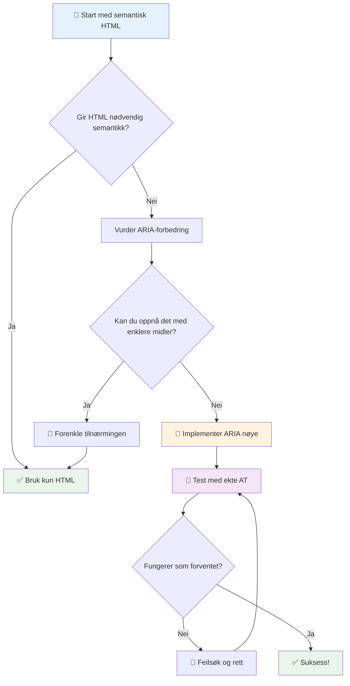
1. **Semantisk HTML først**: Foretrekk alltid `<button>` fremfor `<div role="button">`
2. **Ikke bryt semantikk**: Overstyr aldri eksisterende HTML-betydning (unngå `<h1 role="button">`)
3. **Oppretthold tastaturtilgjengelighet**: Alle interaktive ARIA-elementer må være fullt tastaturtilgjengelige
4. **Test med ekte brukere**: ARIA-støtte varierer betydelig mellom hjelpemidler
5. **Start enkelt**: Kompleks ARIA-implementering er mer utsatt for feil

**🔍 Testingsflyt:**

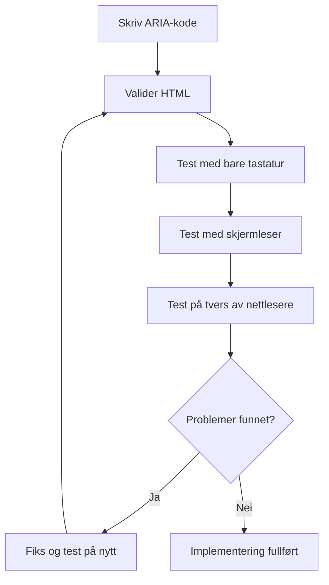
**🚫 Vanlige ARIA-feil å unngå:**

- **Motstridende informasjon**: Ikke motstrid HTML-semantikken
- **For mye merking**: For mye ARIA-informasjon overvelder brukere
- **Statisk ARIA**: Glemmer å oppdatere ARIA-tilstander når innhold endres
- **Utestede implementeringer**: ARIA som fungerer i teorien, men feiler i praksis
- **Manglende tastaturstøtte**: ARIA-roller uten tilhørende tastaturinteraksjon

> 💡 **Testingsressurser**: Bruk verktøy som [accessibility-checker](https://www.npmjs.com/package/accessibility-checker) for automatisert ARIA-validering, men test alltid med ekte skjermlesere for full opplevelse.

### 🎭 **ARIA ferdighetstest: Klar for komplekse interaksjoner?**

**Vurder din ARIA-selvtillit:**
- Når ville du valgt ARIA fremfor semantisk HTML? (Tips: nesten aldri!)
- Kan du forklare hvorfor `<div role="button">` vanligvis er dårligere enn `<button>`?
- Hva er det viktigste å huske om ARIA-testing?

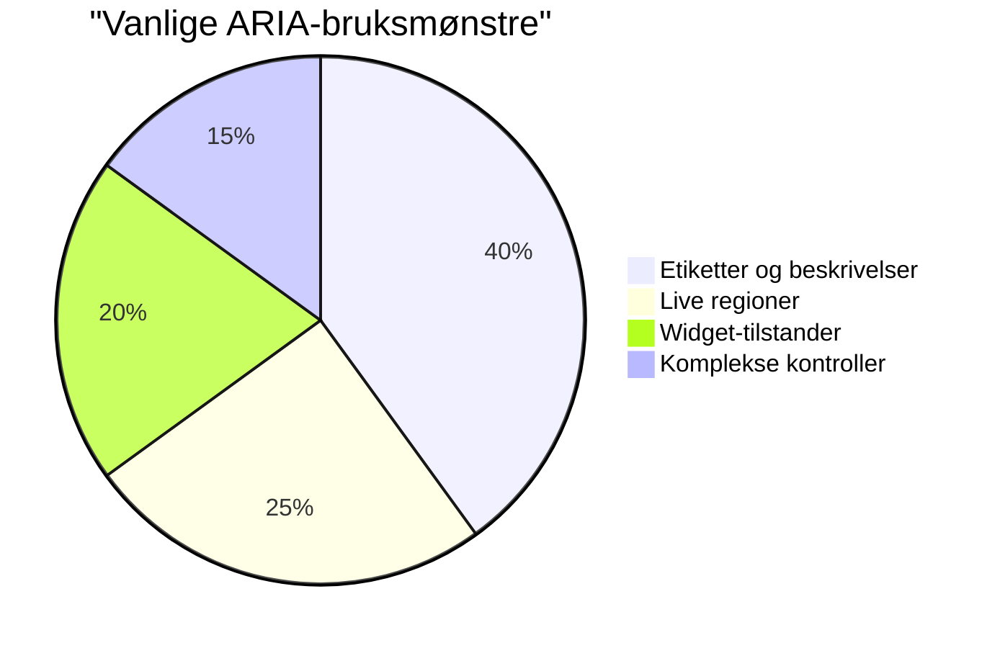
> **Nøkkelinnsikt**: Det meste av ARIA-bruk gjelder merking og beskrivelse av elementer. Komplekse widget-mønstre er mye mindre vanlige enn du kanskje tror!

✅ **Lær fra eksperter**: Studer [ARIA Authoring Practices Guide](https://w3c.github.io/aria-practices/) for velprøvde mønstre og implementeringer av komplekse interaktive widgets.

## Gjøre bilder og medier tilgjengelige

Visuelt og lydinnhold er viktige deler av moderne nettopplevelser, men kan skape barrierer hvis de ikke implementeres gjennomtenkt. Målet er å sikre at informasjonen og den følelsesmessige effekten av mediene dine når alle brukere. Når du først mestrer det, blir det en naturlig del av arbeidet.

Ulike medietyper krever forskjellige tilgjengelighetstilnærminger. Det er som matlaging—you ville ikke behandle en delikat fisk på samme måte som en kraftig biff. Å forstå disse forskjellene hjelper deg å velge riktig løsning for hver situasjon.

### Strategisk bilde-tilgjengelighet

Hvert bilde på nettstedet ditt har et formål. Å forstå det formålet hjelper deg å skrive bedre alternativ tekst og skape mer inkluderende opplevelser.

**De fire typene bilder og deres alt-tekst-strategier:**

**Informative bilder** - formidler viktig informasjon:
```html

```

**Dekorative bilder** - rent visuelle uten informasjonsverdi:
```html

```

**Funksjonelle bilder** - fungerer som knapper eller kontroller:
```html
<button>
  
</button>
```

**Komplekse bilder** - diagrammer, diagrammer, infografikk:
```html

<div id="chart-description">
  <p>Detailed description: Sales data shows a steady increase across all quarters...</p>
</div>
```

### Video- og lydtilgjengelighet

**Krav for video:**
- **Teksting**: Tekstversjon av talte ord og lydeffekter
- **Lyd beskrivelser**: Fortelling av visuelle elementer for blinde brukere
- **Transkripsjoner**: Full tekstversjon av all lyd- og visuelt innhold

```html
<video controls>
  <source src="video.mp4" type="video/mp4">
  <track kind="captions" src="captions.vtt" srclang="en" label="English">
  <track kind="descriptions" src="descriptions.vtt" srclang="en" label="Audio descriptions">
</video>
```

**Krav for lyd:**
- **Transkripsjoner**: Tekstversjon av all tale
- **Visuelle indikatorer**: For lyd-only innhold, tilby visuelle tips

### Moderne bildeteknikker

**Bruke CSS for dekorative bilder:**
```css
.hero-section {
  background-image: url('decorative-hero.jpg');
  /* Decorative images in CSS don't need alt text */
}
```

**Responsivt bilder med tilgjengelighet:**
```html
<picture>
  <source media="(min-width: 800px)" srcset="large-chart.png">
  <source media="(min-width: 400px)" srcset="medium-chart.png">
  
</picture>
```

✅ **Test bilde-tilgjengelighet**: Bruk en skjermleser for å navigere på en side med bilder. Får du nok informasjon til å forstå innholdet?

## Tastaturnavigasjon og fokusstyring

Mange brukere navigerer nettet helt med tastaturet. Dette inkluderer personer med motoriske funksjonsreduseringer, avanserte brukere som opplever tastatur som raskere enn mus, og alle hvis mus ikke fungerer. Å sørge for at siden fungerer godt med tastatur er essensielt og gjør ofte siden mer effektiv for alle.

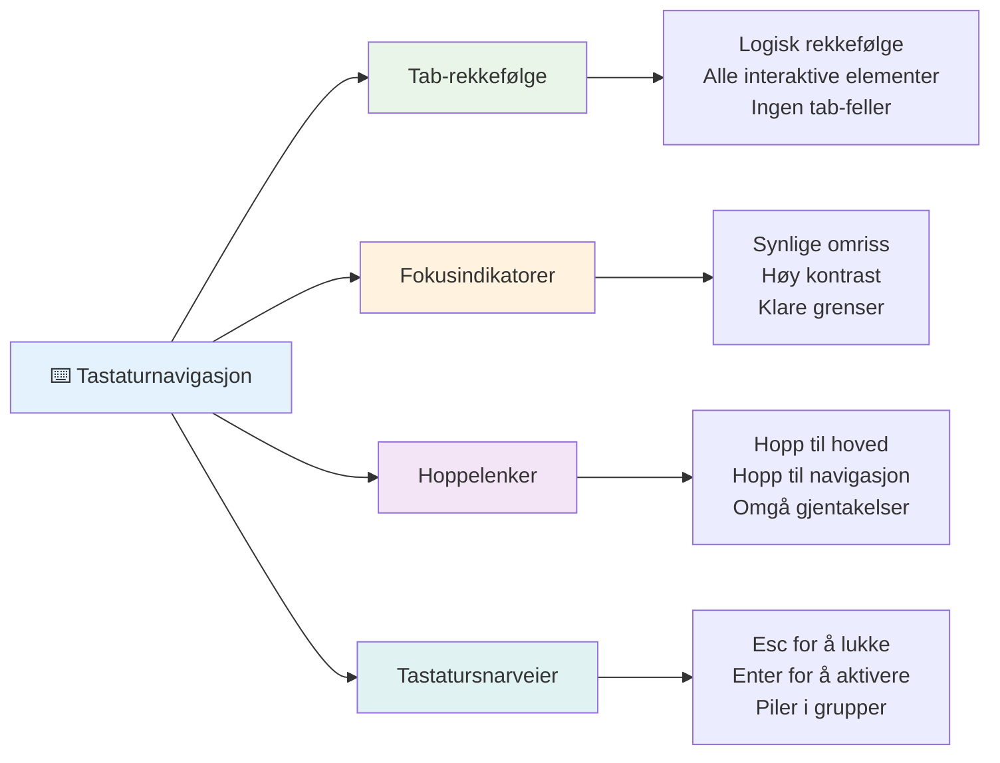
### Viktige mønstre for tastaturnavigasjon

**Standard tastaturinteraksjoner:**
- **Tab**: Flytt fokus fremover gjennom interaktive elementer
- **Shift + Tab**: Flytt fokus bakover
- **Enter**: Aktiver knapper og linker
- **Space**: Aktiver knapper, kryss av i avkrysningsbokser
- **Piltaster**: Naviger innen komponentgrupper (radioknapper, menyer)
- **Escape**: Lukk modaler, nedtrekksmenyer eller avbryt operasjoner

### Beste praksis for fokusstyring

**Synlige fokusindikatorer:**
```css
/* Ensure focus is always visible */
button:focus-visible {
  outline: 2px solid #4A90A4;
  outline-offset: 2px;
}

/* Custom focus styles for different components */
.card:focus-within {
  box-shadow: 0 0 0 3px rgba(74, 144, 164, 0.5);
}
```

**Hopp linker for effektiv navigering:**
```html
<a href="#main-content" class="skip-link">Skip to main content</a>
<a href="#navigation" class="skip-link">Skip to navigation</a>

<nav id="navigation">
  <!-- navigation content -->
</nav>
<main id="main-content">
  <!-- main content -->
</main>
```

**Riktig tabb-rekkefølge:**
```html
<!-- Use semantic HTML for natural tab order -->
<form>
  <label for="name">Name:</label>
  <input type="text" id="name" tabindex="0">
  
  <label for="email">Email:</label>
  <input type="email" id="email" tabindex="0">
  
  <button type="submit" tabindex="0">Submit</button>
</form>
```

### Fokus-fangst i modaler

Når modale dialoger åpnes, bør fokus låses innenfor modalen:

```javascript
// Moderne implementering av felle for fokus
function trapFocus(element) {
  const focusableElements = element.querySelectorAll(
    'button, [href], input, select, textarea, [tabindex]:not([tabindex="-1"])'
  );
  
  const firstElement = focusableElements[0];
  const lastElement = focusableElements[focusableElements.length - 1];

  element.addEventListener('keydown', (e) => {
    if (e.key === 'Tab') {
      if (e.shiftKey && document.activeElement === firstElement) {
        e.preventDefault();
        lastElement.focus();
      } else if (!e.shiftKey && document.activeElement === lastElement) {
        e.preventDefault();
        firstElement.focus();
      }
    }
    
    if (e.key === 'Escape') {
      closeModal();
    }
  });
  
  // Sett fokus på første element når modal åpnes
  firstElement.focus();
}
```

✅ **Test tastaturnavigasjon**: Prøv å navigere nettstedet ditt kun med Tab-tasten. Kan du nå alle interaktive elementer? Er fokusrekkefølgen logisk? Er fokusindikatorene tydelig synlige?

## Skjema-tilgjengelighet

Skjemaer er kritiske for brukerinteraksjon og krever spesiell oppmerksomhet til tilgjengelighet.

### Merking og tilknytning av skjemaelementer

**Hver skjema-kontroll trenger en etikett:**
```html
<!-- Explicit labeling (preferred) -->
<label for="username">Username:</label>
<input type="text" id="username" name="username" required>

<!-- Implicit labeling -->
<label>
  Password:
  <input type="password" name="password" required>
</label>

<!-- Using aria-label when visual label isn't desired -->
<input type="search" aria-label="Search products" placeholder="Search...">
```

### Feilhåndtering og validering

**Tilgjengelige feilmeldinger:**
```html
<label for="email">Email Address:</label>
<input type="email" id="email" name="email" 
       aria-describedby="email-error" 
       aria-invalid="true" required>
<div id="email-error" role="alert">
  Please enter a valid email address
</div>
```

**Beste praksis for skjema-validering:**
- Bruk `aria-invalid` for å indikere ugyldige felt
- Gi klare, spesifikke feilmeldinger
- Bruk `role="alert"` for viktige feilmeldinger
- Vis feil umiddelbart og ved skjema-innsending

### Feltsett og gruppering

**Grupper relaterte skjema-kontroller:**
```html
<fieldset>
  <legend>Shipping Address</legend>
  <label for="street">Street Address:</label>
  <input type="text" id="street" name="street">
  
  <label for="city">City:</label>
  <input type="text" id="city" name="city">
</fieldset>

<fieldset>
  <legend>Preferred Contact Method</legend>
  <input type="radio" id="contact-email" name="contact" value="email">
  <label for="contact-email">Email</label>
  
  <input type="radio" id="contact-phone" name="contact" value="phone">
  <label for="contact-phone">Phone</label>
</fieldset>
```

## Din tilgjengelighetsreise: Viktige poeng

Gratulerer! Du har akkurat fått grunnleggende kunnskap for å lage virkelig inkluderende nettopplevelser. Dette er ganske spennende! Nett-tilgjengelighet handler ikke bare om å krysse av bokser i samsvar – det handler om å forstå de mange måtene folk interagerer med digitalt innhold på, og designe for denne fantastiske kompleksiteten.

Du er nå en del av et voksende fellesskap av utviklere som forstår at god design fungerer for alle. Velkommen til klubben!

**🎯 Ditt tilgjengelighetsverktøy inkluderer nå:**

| Kjerneprinsipp | Implementering | Effekt |
|----------------|----------------|---------|
| **Semantisk HTML-grunnlag** | Bruk riktige HTML-elementer til tiltenkt formål | Skjermlesere kan navigere effektivt, tastatur fungerer automatisk |
| **Inkluderende visuell design** | Tilstrekkelig kontrast, meningsfull fargebruk, synlige fokusindikatorer | Klart for alle i alle lysforhold |
| **Beskrivende innhold** | Meningsfull linktekst, alt-tekst, overskrifter | Brukere forstår innhold uten visuell kontekst |
| **Tastaturtilgjengelighet** | Tab-rekkefølge, tastatursnarveier, fokusstyring | Motorisk tilgjengelighet og kraftbrukereffektivitet |
| **ARIA-forbedring** | Strategisk bruk for å fylle semantiske hull | Komplekse applikasjoner fungerer med hjelpemidler |
| **Omfattende testing** | Automatiske verktøy + manuell verifisering + testing med ekte brukere | Oppdag problemer før de påvirker brukere |

**🚀 Dine neste steg:**

1. **Bygg inn tilgjengelighet i arbeidsflyten din**: Gjør testing til en naturlig del av utviklingsprosessen
2. **Lær av ekte brukere**: Søk tilbakemeldinger fra personer som bruker hjelpemidler
3. **Hold deg oppdatert**: Tilgjengelighetsteknikker utvikler seg med ny teknologi og standarder
4. **Vær en pådriver for inkludering**: Del kunnskapen din og gjør tilgjengelighet til et team-fokus

> 💡 **Husk**: Tilgjengelighetsbegrensninger fører ofte til innovative, elegante løsninger som gagner alle. Hull i fortau, teksting og stemmekontroller startet som tilgjengelighetsfunksjoner og ble allment forbedringer.

**Forretningscaset er krystallklart**: Tilgjengelige nettsteder når flere brukere, rangerer bedre i søkemotorer, har lavere vedlikeholdskostnader og unngår juridiske risikoer. Men ærlig talt? Den egentlige grunnen til å bry seg om tilgjengelighet går mye dypere. Tilgjengelige nettsteder representerer det beste med nettet—åpenhet, inkludering og ideen om at alle fortjener lik tilgang til informasjon.

Du er nå rustet til å bygge fremtidens inkluderende nett. Hvert tilgjengelige nettsted du lager gjør internett til et mer innbydende sted for alle. Det er ganske fantastisk å tenke på!

## Ytterligere ressurser

Fortsett din læringsreise om tilgjengelighet med disse essensielle ressursene:

**📚 Offisielle standarder og retningslinjer:**
- [WCAG 2.1 Guidelines](https://www.w3.org/WAI/WCAG21/quickref/) - Den offisielle tilgjengelighetsstandarden med hurtigreferanse
- [ARIA Authoring Practices Guide](https://w3c.github.io/aria-practices/) - Omfattende mønstre for interaktive widgets
- [WebAIM Guidelines](https://webaim.org/) - Praktiske, nybegynnervennlige tilgjengelighetsråd

**🛠️ Verktøy og testressurser:**
- [axe DevTools](https://www.deque.com/axe/devtools/) - Bransjestandard for tilgjengelighetstesting
- [A11y Project Checklist](https://www.a11yproject.com/checklist/) - Steg-for-steg tilgjengelighetsverifisering
- [Accessibility Insights](https://accessibilityinsights.io/) - Microsofts omfattende testsuite
- [Color Oracle](https://colororacle.org/) - Simulator for fargeblindhet til design-testing

**🎓 Læring og fellesskap:**
- [WebAIM Screen Reader Survey](https://webaim.org/projects/screenreadersurvey9/) - Ekte brukerpreferanser og atferd
- [Inclusive Components](https://inclusive-components.design/) - Moderne tilgjengelige komponentmønstre
- [A11y Coffee](https://a11y.coffee/) - Rask tilgjengelighetstips og innsikt
- [Web Accessibility Initiative (WAI)](https://www.w3.org/WAI/) - W3Cs omfattende tilgjengelighetsressurser

**🎥 Praktisk læring:**
- [Accessibility Developer Guide](https://www.accessibility-developer-guide.com/) - Praktiske implementeringsanvisninger
- [Deque University](https://dequeuniversity.com/) - Profesjonelle tilgjengelighetskurs

## GitHub Copilot Agent Challenge 🚀

Bruk Agent-modus for å fullføre følgende utfordring:

**Beskrivelse:** Lag en tilgjengelig modal dialogkomponent som demonstrerer riktig fokusstyring, ARIA-attributter og tastaturnavigasjonsmønstre.

**Prompt:** Bygg en komplett modal dialogkomponent med HTML, CSS og JavaScript som inkluderer: riktig fokusfanging, ESC-tast for å lukke, klikk utenfor for å lukke, ARIA-attributter for skjermlesere, og synlige fokusindikatorer. Modalen skal inneholde et skjema med riktige etiketter og feilhåndtering. Sørg for at komponenten møter WCAG 2.1 AA-standardene.

## 🚀 Utfordring

Ta denne HTML-en og omskriv den for å gjøre den så tilgjengelig som mulig, basert på strategiene du har lært.

```html
<!DOCTYPE html>
<html lang="en">
  <head>
    <meta charset="UTF-8">
    <meta name="viewport" content="width=device-width, initial-scale=1.0">
    <title>Turtle Ipsum - The World's Premier Turtle Fan Club</title>
    <link href='../assets/style.css' rel='stylesheet' type='text/css'>
  </head>
  <body>
    <header class="site-header">
      <h1 class="site-title">Turtle Ipsum</h1>
      <p class="site-subtitle">The World's Premier Turtle Fan Club</p>
    </header>
    
    <nav class="main-nav" aria-label="Main navigation">
      <h2 class="nav-header">Resources</h2>
      <ul class="nav-list">
        <li><a href="https://www.youtube.com/watch?v=CMNry4PE93Y">"I like turtles" video</a></li>
        <li><a href="https://en.wikipedia.org/wiki/Turtle">Basic turtle information</a></li>
        <li><a href="https://en.wikipedia.org/wiki/Turtles_(chocolate)">Chocolate turtles candy</a></li>
      </ul>
    </nav>
    
    <main class="main-content">
      <article>
        <h1>Welcome to Turtle Ipsum</h1>
        <p class="intro">
          <a href="/about">Learn more about our turtle community</a> and discover fascinating facts about these amazing creatures.
        </p>
        <p class="article-text">
          Turtle ipsum dolor sit amet, consectetur adipiscing elit, sed do eiusmod tempor incididunt ut labore et dolore magna aliqua. Ut enim ad minim veniam, quis nostrud exercitation ullamco laboris nisi ut aliquip ex ea commodo consequat. Duis aute irure dolor in reprehenderit in voluptate velit esse cillum dolore eu fugiat nulla pariatur. Excepteur sint occaecat cupidatat non proident, sunt in culpa qui officia deserunt mollit anim id est laborum.
        </p>
      </article>
    </main>
    
    <footer class="footer">
      <section class="newsletter-signup">
        <h2>Stay Updated</h2>
        <button type="button" onclick="showNewsletterForm()">Sign up for turtle news</button>
      </section>
      
      <nav class="footer-nav" aria-label="Footer navigation">
        <h2>Site Pages</h2>
        <ul>
          <li><a href="../">Home</a></li>
          <li><a href="../semantic">Semantic HTML example</a></li>
        </ul>
      </nav>
      
      <p class="footer-copyright">&copy; 2024 Instrument. All rights reserved.</p>
    </footer>
  </body>
</html>
```

**Nøkkel forbedringer gjort:**
- Lagt til riktig semantisk HTML-struktur
- Rettet overskriftshierarki (én h1, logisk progresjon)
- Lagt til meningsfull linktekst i stedet for "klikk her"
- Inkludert korrekte ARIA-etiketter for navigasjon
- Lagt til lang-attributt og riktige meta-tags
- Brukt knappelement for interaktive elementer
- Strukturert footer-innhold med riktige landemerker

## Quiz etter forelesning
[Post-lecture quiz](https://ff-quizzes.netlify.app/web/en/)

## Gjennomgang og selvstudium

Mange regjeringer har lover om tilgjengelighetskrav. Les om tilgjengelighetslovgivningen i ditt hjemland. Hva er dekket, og hva ikke? Et eksempel er [denne offentlige nettsiden](https://accessibility.blog.gov.uk/).

## Oppgave

[Analyser et ikke-tilgjengelig nettsted](assignment.md)

Credits: [Turtle Ipsum](https://github.com/Instrument/semantic-html-sample) av Instrument

---

## 🚀 Din tidslinje for tilgjengelighetsmestring

### ⚡ **Hva du kan gjøre i løpet av de neste 5 minuttene**
- [ ] Installer axe DevTools-utvidelsen i nettleseren din
- [ ] Kjør en Lighthouse-tilgjengelighetsrevisjon på ditt favorittnettsted
- [ ] Prøv å navigere et hvilket som helst nettsted kun med Tab-tasten
- [ ] Test nettleserens innebygde skjermleser (Narrator/VoiceOver)

### 🎯 **Hva du kan oppnå denne timen**
- [ ] Fullfør quiz etter timen og reflekter over tilgjengelighetsinnsikter
- [ ] Øv på å skrive meningsfull alt-tekst for 10 forskjellige bilder
- [ ] Revider et nettsteds overskriftsstruktur med HeadingsMap-utvidelsen
- [ ] Fiks tilgjengelighetsproblemer funnet i utfordrings-HTML-en
- [ ] Test fargekontrast på ditt nåværende prosjekt med WebAIMs verktøy

### 📅 **Din ukelange tilgjengelighetsreise**
- [ ] Fullfør oppgaven med å analysere et ikke-tilgjengelig nettsted
- [ ] Sett opp utviklingsmiljøet ditt med tilgjengelighetstestverktøy
- [ ] Øv på tastaturnavigasjon på 5 forskjellige komplekse nettsteder
- [ ] Bygg et enkelt skjema med riktige etiketter, feilhåndtering og ARIA
- [ ] Bli med i et tilgjengelighetsfellesskap (A11y Slack, WebAIM forum)
- [ ] Se ekte brukere med funksjonshemninger navigere nettsteder (YouTube har gode eksempler)

### 🌟 **Din månedslange forvandling**
- [ ] Integrer tilgjengelighetstesting i din utviklingsarbeidsflyt
- [ ] Bidra til et åpen kildekode-prosjekt ved å fikse tilgjengelighetsproblemer
- [ ] Gjennomfør brukervennlighetstesting med noen som bruker hjelpemidler
- [ ] Bygg et tilgjengelig komponentbibliotek for teamet ditt
- [ ] Vær forkjemper for tilgjengelighet på arbeidsplassen eller i samfunnet ditt
- [ ] Veilede noen som er ny innen tilgjengelighetskonsepter

### 🏆 **Sluttkontroll for tilgjengelighetsmester**

**Feire reisen din innen tilgjengelighet:**
- Hva er det mest overraskende du lærte om hvordan folk bruker nettet?
- Hvilket tilgjengelighetsprinsipp stemmer best overens med din utviklingsstil?
- Hvordan har det å lære om tilgjengelighet forandret ditt perspektiv på design?
- Hva er den første tilgjengelighetsforbedringen du ønsker å gjøre på et reelt prosjekt?

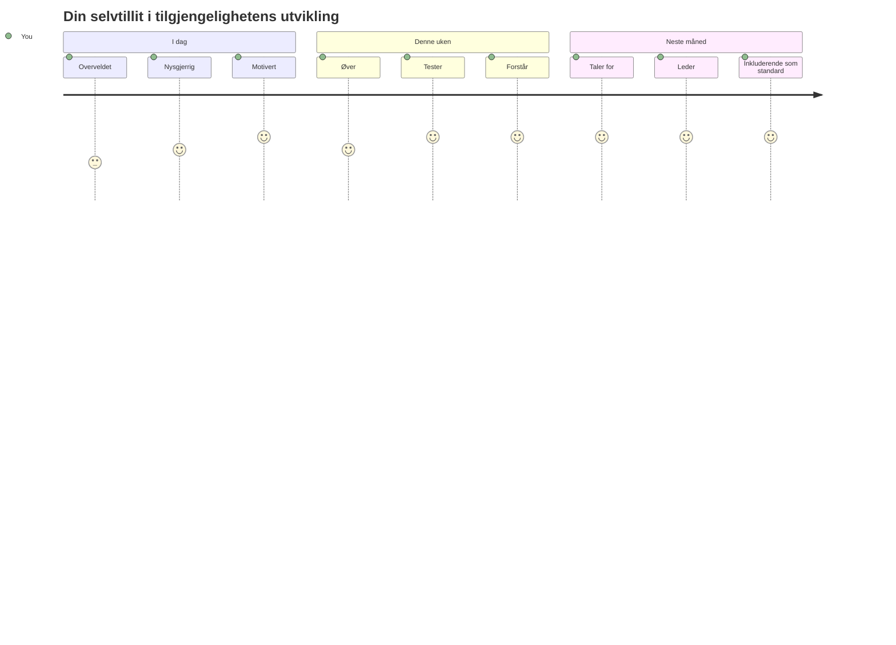
> 🌍 **Du er nå en tilgjengelighetsmester!** Du forstår at gode nettopplevelser fungerer for alle, uavhengig av hvordan de får tilgang til nettet. Hver tilgjengelig funksjon du bygger gjør internett mer inkluderende. Nettet trenger utviklere som deg som ser tilgjengelighet ikke som en begrensning, men som en mulighet til å skape bedre opplevelser for alle brukere. Velkommen til bevegelsen! 🎉

---

<!-- CO-OP TRANSLATOR DISCLAIMER START -->
**Ansvarsfraskrivelse**:
Dette dokumentet er oversatt ved hjelp av AI-oversettelsestjenesten [Co-op Translator](https://github.com/Azure/co-op-translator). Selv om vi streber etter nøyaktighet, vær oppmerksom på at automatiske oversettelser kan inneholde feil eller unøyaktigheter. Det originale dokumentet på sitt opprinnelige språk bør betraktes som den autoritative kilden. For kritisk informasjon anbefales profesjonell menneskelig oversettelse. Vi er ikke ansvarlige for eventuelle misforståelser eller feiltolkninger som oppstår ved bruk av denne oversettelsen.
<!-- CO-OP TRANSLATOR DISCLAIMER END -->