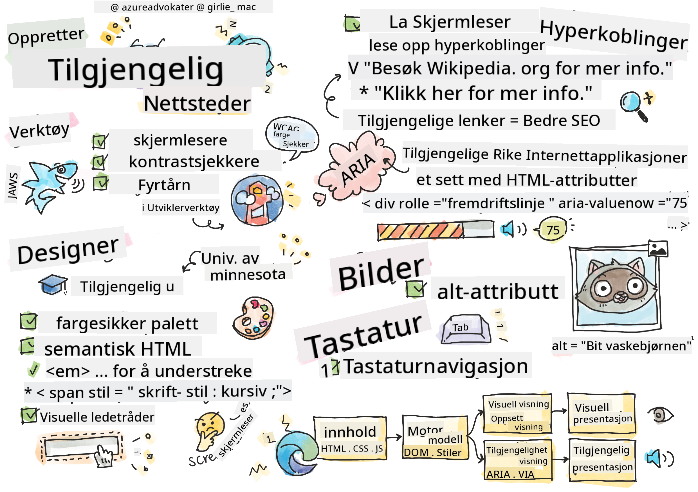

<!--
CO_OP_TRANSLATOR_METADATA:
{
  "original_hash": "e4cd5b1faed4adab5acf720f82798003",
  "translation_date": "2025-08-26T22:20:23+00:00",
  "source_file": "1-getting-started-lessons/3-accessibility/README.md",
  "language_code": "no"
}
-->
# Lage tilgjengelige nettsider


> Sketchnote av [Tomomi Imura](https://twitter.com/girlie_mac)

## Quiz før forelesning
[Quiz før forelesning](https://ff-quizzes.netlify.app/web/quiz/5)

> Kraften i nettet ligger i dets universalitet. Tilgang for alle, uavhengig av funksjonsnedsettelse, er en essensiell del.
>
> \- Sir Timothy Berners-Lee, W3C-direktør og oppfinner av World Wide Web

Dette sitatet understreker perfekt viktigheten av å lage tilgjengelige nettsider. En applikasjon som ikke kan brukes av alle, er per definisjon ekskluderende. Som webutviklere bør vi alltid ha tilgjengelighet i tankene. Ved å fokusere på dette fra starten av, vil du være godt på vei til å sikre at alle kan få tilgang til sidene du lager. I denne leksjonen vil du lære om verktøyene som kan hjelpe deg med å sikre at dine nettressurser er tilgjengelige, og hvordan du bygger med tilgjengelighet i tankene.

> Du kan ta denne leksjonen på [Microsoft Learn](https://docs.microsoft.com/learn/modules/web-development-101/accessibility/?WT.mc_id=academic-77807-sagibbon)!

## Verktøy å bruke

### Skjermlesere

Et av de mest kjente tilgjengelighetsverktøyene er skjermlesere.

[Skjermlesere](https://en.wikipedia.org/wiki/Screen_reader) er ofte brukte klienter for personer med synsnedsettelser. Akkurat som vi bruker tid på å sikre at en nettleser formidler informasjonen vi ønsker å dele, må vi også sørge for at en skjermleser gjør det samme.

I sin enkleste form vil en skjermleser lese en side fra topp til bunn med lyd. Hvis siden din kun består av tekst, vil leseren formidle informasjonen på en lignende måte som en nettleser. Selvfølgelig er nettsider sjelden kun tekst; de inneholder lenker, grafikk, farger og andre visuelle komponenter. Det må tas hensyn til at denne informasjonen leses riktig av en skjermleser.

Alle webutviklere bør gjøre seg kjent med en skjermleser. Som nevnt ovenfor er det klienten brukerne dine vil benytte. På samme måte som du er kjent med hvordan en nettleser fungerer, bør du lære hvordan en skjermleser fungerer. Heldigvis er skjermlesere innebygd i de fleste operativsystemer.

Noen nettlesere har også innebygde verktøy og utvidelser som kan lese tekst høyt eller til og med gi noen grunnleggende navigasjonsfunksjoner, som [disse tilgjengelighetsfokuserte Edge-verktøyene](https://support.microsoft.com/help/4000734/microsoft-edge-accessibility-features). Disse er også viktige tilgjengelighetsverktøy, men fungerer veldig annerledes enn skjermlesere og bør ikke forveksles med skjermlesertestverktøy.

✅ Prøv en skjermleser og en nettleser med tekstleser. På Windows er [Narrator](https://support.microsoft.com/windows/complete-guide-to-narrator-e4397a0d-ef4f-b386-d8ae-c172f109bdb1/?WT.mc_id=academic-77807-sagibbon) inkludert som standard, og [JAWS](https://webaim.org/articles/jaws/) og [NVDA](https://www.nvaccess.org/about-nvda/) kan også installeres. På macOS og iOS er [VoiceOver](https://support.apple.com/guide/voiceover/welcome/10) installert som standard.

### Zoom

Et annet verktøy som ofte brukes av personer med synsnedsettelser, er zooming. Den enkleste typen zooming er statisk zoom, kontrollert gjennom `Control + pluss-tegn (+)` eller ved å redusere skjermoppløsningen. Denne typen zoom får hele siden til å endre størrelse, så bruk av [responsivt design](https://developer.mozilla.org/docs/Learn/CSS/CSS_layout/Responsive_Design) er viktig for å gi en god brukeropplevelse ved økte zoomnivåer.

En annen type zoom bruker spesialisert programvare for å forstørre ett område av skjermen og panorere, omtrent som å bruke et ekte forstørrelsesglass. På Windows er [Magnifier](https://support.microsoft.com/windows/use-magnifier-to-make-things-on-the-screen-easier-to-see-414948ba-8b1c-d3bd-8615-0e5e32204198) innebygd, og [ZoomText](https://www.freedomscientific.com/training/zoomtext/getting-started/) er en tredjeparts forstørrelsesprogramvare med flere funksjoner og en større brukerbase. Både macOS og iOS har innebygd forstørrelsesprogramvare kalt [Zoom](https://www.apple.com/accessibility/mac/vision/).

### Kontrasttestere

Farger på nettsider må velges nøye for å imøtekomme behovene til fargeblinde brukere eller personer som har vansker med å se farger med lav kontrast.

✅ Test en nettside du liker å bruke for fargebruk med en nettleserutvidelse som [WCAGs fargetester](https://microsoftedge.microsoft.com/addons/detail/wcag-color-contrast-check/idahaggnlnekelhgplklhfpchbfdmkjp?hl=en-US&WT.mc_id=academic-77807-sagibbon). Hva lærer du?

### Lighthouse

I utviklerverktøyene i nettleseren din finner du Lighthouse-verktøyet. Dette verktøyet er viktig for å få en første vurdering av tilgjengeligheten (samt andre analyser) av en nettside. Selv om det er viktig å ikke stole utelukkende på Lighthouse, er en 100 % score veldig nyttig som et utgangspunkt.

✅ Finn Lighthouse i utviklerverktøyene i nettleseren din og kjør en analyse på en hvilken som helst side. Hva oppdager du?

## Designe for tilgjengelighet

Tilgjengelighet er et relativt stort tema. For å hjelpe deg finnes det mange ressurser tilgjengelig.

- [Accessible U - University of Minnesota](https://accessibility.umn.edu/your-role/web-developers)

Selv om vi ikke vil kunne dekke alle aspekter ved å lage tilgjengelige sider, er det nedenfor noen av de viktigste prinsippene du bør implementere. Å designe en tilgjengelig side fra starten av er **alltid** enklere enn å gå tilbake til en eksisterende side for å gjøre den tilgjengelig.

## Gode visuelle prinsipper

### Fargesikre paletter

Folk ser verden på forskjellige måter, og dette inkluderer farger. Når du velger et fargeskjema for siden din, bør du sørge for at det er tilgjengelig for alle. Et flott [verktøy for å generere fargepaletter er Color Safe](http://colorsafe.co/).

✅ Identifiser en nettside som er veldig problematisk i sin bruk av farger. Hvorfor?

### Bruk riktig HTML

Med CSS og JavaScript er det mulig å få ethvert element til å se ut som hvilken som helst type kontroll. `<span>` kan brukes til å lage en `<button>`, og `<b>` kan bli en hyperlenke. Selv om dette kan anses som enklere å style, formidler det ingenting til en skjermleser. Bruk riktig HTML når du lager kontroller på en side. Hvis du vil ha en hyperlenke, bruk `<a>`. Å bruke riktig HTML for riktig kontroll kalles å bruke Semantisk HTML.

✅ Gå til en hvilken som helst nettside og se om designerne og utviklerne bruker HTML riktig. Kan du finne en knapp som burde vært en lenke? Hint: høyreklikk og velg 'Vis sidekilde' i nettleseren din for å se underliggende kode.

### Lag en beskrivende overskriftshierarki

Skjermleserbrukere [stoler sterkt på overskrifter](https://webaim.org/projects/screenreadersurvey8/#finding) for å finne informasjon og navigere gjennom en side. Å skrive beskrivende overskriftsinnhold og bruke semantiske overskriftstagger er viktig for å lage en lett navigerbar side for skjermleserbrukere.

### Bruk gode visuelle ledetråder

CSS gir full kontroll over utseendet til ethvert element på en side. Du kan lage tekstbokser uten en ramme eller hyperlenker uten en understrek. Dessverre kan fjerning av disse ledetrådene gjøre det mer utfordrende for noen som er avhengige av dem å gjenkjenne typen kontroll.

## Viktigheten av lenketekst

Hyperlenker er kjernen i å navigere på nettet. Som et resultat er det viktig å sikre at en skjermleser kan lese lenker riktig, slik at alle brukere kan navigere på siden din.

### Skjermlesere og lenker

Som du forventer, leser skjermlesere lenketekst på samme måte som de leser annen tekst på siden. Med dette i tankene kan teksten nedenfor virke helt akseptabel.

> Den lille pingvinen, noen ganger kjent som fe-pingvinen, er den minste pingvinen i verden. [Klikk her](https://en.wikipedia.org/wiki/Little_penguin) for mer informasjon.

> Den lille pingvinen, noen ganger kjent som fe-pingvinen, er den minste pingvinen i verden. Besøk https://en.wikipedia.org/wiki/Little_penguin for mer informasjon.

> **NOTE** Som du snart vil lese, bør du **aldri** lage lenker som ser ut som de ovenfor.

Husk, skjermlesere er et annet grensesnitt enn nettlesere med et annet sett med funksjoner.

### Problemet med å bruke URL-en

Skjermlesere leser teksten. Hvis en URL vises i teksten, vil skjermleseren lese URL-en. Generelt sett formidler ikke URL-en meningsfull informasjon og kan høres irriterende ut. Du har kanskje opplevd dette hvis telefonen din noen gang har lest opp en tekstmelding med en URL.

### Problemet med "klikk her"

Skjermlesere har også muligheten til å lese kun hyperlenkene på en side, på samme måte som en seende person ville skannet en side etter lenker. Hvis lenketeksten alltid er "klikk her", vil brukeren bare høre "klikk her, klikk her, klikk her, klikk her, klikk her, ..." Alle lenker blir nå uatskillelige fra hverandre.

### God lenketekst

God lenketekst beskriver kort hva som er på den andre siden av lenken. I eksempelet ovenfor som handler om små pingviner, er lenken til Wikipedia-siden om arten. Frasen *små pingviner* ville være perfekt som lenketekst, da det gjør det klart hva noen vil lære om hvis de klikker på lenken - små pingviner.

> Den [lille pingvinen](https://en.wikipedia.org/wiki/Little_penguin), noen ganger kjent som fe-pingvinen, er den minste pingvinen i verden.

✅ Surf på nettet i noen minutter for å finne sider som bruker uklare lenkestrategier. Sammenlign dem med andre, bedre lenkede sider. Hva lærer du?

#### Notater om søkemotorer

Som en ekstra bonus ved å sikre at siden din er tilgjengelig for alle, hjelper du også søkemotorer med å navigere på siden din. Søkemotorer bruker lenketekst for å lære temaene til sider. Så å bruke god lenketekst hjelper alle!

### ARIA

Tenk deg følgende side:

| Produkt      | Beskrivelse        | Bestill      |
| ------------ | ------------------ | ------------ |
| Widget       | [Beskrivelse](../../../../1-getting-started-lessons/3-accessibility/') | [Bestill](../../../../1-getting-started-lessons/3-accessibility/') |
| Super widget | [Beskrivelse](../../../../1-getting-started-lessons/3-accessibility/') | [Bestill](../../../../1-getting-started-lessons/3-accessibility/') |

I dette eksempelet gir det mening for noen som bruker en nettleser å duplisere teksten for beskrivelse og bestill. Men for noen som bruker en skjermleser, vil de bare høre ordene *beskrivelse* og *bestill* gjentatt uten kontekst.

For å støtte disse typene scenarier støtter HTML et sett med attributter kjent som [Accessible Rich Internet Applications (ARIA)](https://developer.mozilla.org/docs/Web/Accessibility/ARIA). Disse attributtene lar deg gi tilleggsinformasjon til skjermlesere.

> **NOTE**: Som med mange aspekter av HTML, kan støtte for nettlesere og skjermlesere variere. Men de fleste hovedklienter støtter ARIA-attributter.

Du kan bruke `aria-label` for å beskrive lenken når formatet på siden ikke tillater deg å gjøre det. Beskrivelsen for widget kan settes som

``` html
<a href="#" aria-label="Widget description">description</a>
```

✅ Generelt sett overgår bruk av Semantisk markup som beskrevet ovenfor bruken av ARIA, men noen ganger finnes det ingen semantisk ekvivalent for ulike HTML-widgeter. Et godt eksempel er et tre (Tree). Det finnes ingen HTML-ekvivalent for et tre, så du identifiserer den generiske `<div>` for dette elementet med en riktig rolle og aria-verdier. [MDN-dokumentasjonen om ARIA](https://developer.mozilla.org/docs/Web/Accessibility/ARIA) inneholder mer nyttig informasjon.

```html
<h2 id="tree-label">File Viewer</h2>
<div role="tree" aria-labelledby="tree-label">
  <div role="treeitem" aria-expanded="false" tabindex="0">Uploads</div>
</div>
```

## Bilder

Det sier seg selv at skjermlesere ikke automatisk kan lese hva som er i et bilde. Å sikre at bilder er tilgjengelige krever ikke mye arbeid - det er det `alt`-attributtet handler om. Alle meningsfulle bilder bør ha en `alt` for å beskrive hva de er.  
Bilder som kun er dekorative, bør ha sitt `alt`-attributt satt til en tom streng: `alt=""`. Dette hindrer skjermlesere fra unødvendig å annonsere det dekorative bildet.

✅ Som du kanskje forventer, kan heller ikke søkemotorer forstå hva som er i et bilde. De bruker også alt-tekst. Så nok en gang gir det å sikre at siden din er tilgjengelig ekstra fordeler!

## Tastaturet

Noen brukere er ikke i stand til å bruke en mus eller styreflate, og er i stedet avhengige av tastaturinteraksjoner for å navigere fra ett element til det neste. Det er viktig at nettsiden din presenterer innholdet i en logisk rekkefølge, slik at en tastaturbruker kan få tilgang til hvert interaktivt element mens de beveger seg nedover et dokument. Hvis du bygger nettsidene dine med semantisk markup og bruker CSS for å style deres visuelle layout, bør siden din være navigerbar med tastatur, men det er viktig å teste dette aspektet manuelt. Lær mer om [strategier for tastaturnavigasjon](https://webaim.org/techniques/keyboard/).

✅ Gå til en hvilken som helst nettside og prøv å navigere gjennom den kun ved hjelp av tastaturet. Hva fungerer, hva fungerer ikke? Hvorfor?

## Oppsummering

Et nett som kun er tilgjengelig for noen, er ikke et virkelig 'verdensomspennende nett'. Den beste måten å sikre at sidene du lager er tilgjengelige, er å innlemme beste praksis for tilgjengelighet fra starten av. Selv om det krever noen ekstra trinn, vil det å innarbeide disse ferdighetene i arbeidsflyten din nå bety at alle sidene du lager vil være tilgjengelige.

---

## 🚀 Utfordring

Ta denne HTML-en og skriv den om for å være så tilgjengelig som mulig, gitt strategiene du har lært.

```html
<!DOCTYPE html>
<html>
  <head>
    <title>
      Example
    </title>
    <link href='../assets/style.css' rel='stylesheet' type='text/css'>
  </head>
  <body>
    <div class="site-header">
      <p class="site-title">Turtle Ipsum</p>
      <p class="site-subtitle">The World's Premier Turtle Fan Club</p>
    </div>
    <div class="main-nav">
      <p class="nav-header">Resources</p>
      <div class="nav-list">
        <p class="nav-item nav-item-bull"><a href="https://www.youtube.com/watch?v=CMNry4PE93Y">"I like turtles"</a></p>
        <p class="nav-item nav-item-bull"><a href="https://en.wikipedia.org/wiki/Turtle">Basic Turtle Info</a></p>
        <p class="nav-item nav-item-bull"><a href="https://en.wikipedia.org/wiki/Turtles_(chocolate)">Chocolate Turtles</a></p>
      </div>
    </div>
    <div class="main-content">
      <div>
        <p class="page-title">Welcome to Turtle Ipsum. 
            <a href="">Click here</a> to learn more.
        </p>
        <p class="article-text">
          Turtle ipsum dolor sit amet, consectetur adipiscing elit, sed do eiusmod tempor incididunt ut labore et dolore magna aliqua. Ut enim ad minim veniam, quis nostrud exercitation ullamco laboris nisi ut aliquip ex ea commodo consequat. Duis aute irure dolor in reprehenderit in voluptate velit esse cillum dolore eu fugiat nulla pariatur. Excepteur sint occaecat cupidatat non proident, sunt in culpa qui officia deserunt mollit anim id est laborum
        </p>
      </div>
    </div>
    <div class="footer">
      <div class="footer-section">
        <span class="button">Sign up for turtle news</span>
      </div><div class="footer-section">
        <p class="nav-header footer-title">
          Internal Pages
        </p>
        <div class="nav-list">
          <p class="nav-item nav-item-bull"><a href="../">Index</a></p>
          <p class="nav-item nav-item-bull"><a href="../semantic">Semantic Example</a></p>
        </div>
      </div>
      <p class="footer-copyright">&copy; 2016 Instrument</span>
    </div>
  </body>
</html>
```

## Quiz etter forelesning
[Quiz etter forelesning](https://ff-quizzes.netlify.app/web/quiz/6)

## Gjennomgang og selvstudium
Mange regjeringer har lover om tilgjengelighetskrav. Les deg opp på tilgjengelighetslovene i ditt hjemland. Hva dekkes, og hva dekkes ikke? Et eksempel er [denne offentlige nettsiden](https://accessibility.blog.gov.uk/).

## Oppgave

[Analyser en ikke-tilgjengelig nettside](assignment.md)

Kreditering: [Turtle Ipsum](https://github.com/Instrument/semantic-html-sample) av Instrument

---

**Ansvarsfraskrivelse**:  
Dette dokumentet er oversatt ved hjelp av AI-oversettelsestjenesten [Co-op Translator](https://github.com/Azure/co-op-translator). Selv om vi streber etter nøyaktighet, vær oppmerksom på at automatiserte oversettelser kan inneholde feil eller unøyaktigheter. Det originale dokumentet på sitt opprinnelige språk bør anses som den autoritative kilden. For kritisk informasjon anbefales profesjonell menneskelig oversettelse. Vi er ikke ansvarlige for eventuelle misforståelser eller feiltolkninger som oppstår ved bruk av denne oversettelsen.