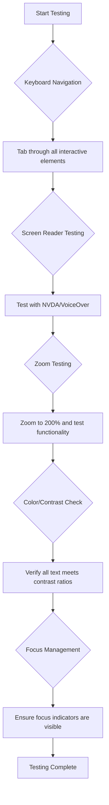
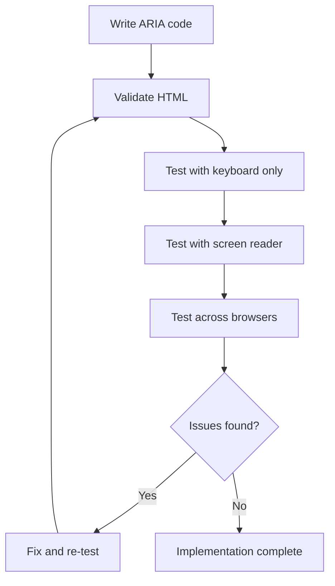

<!--
CO_OP_TRANSLATOR_METADATA:
{
  "original_hash": "90b19cde5b79b29e91babd3138cd8035",
  "translation_date": "2025-10-23T22:20:37+00:00",
  "source_file": "1-getting-started-lessons/3-accessibility/README.md",
  "language_code": "no"
}
-->
# Lage tilgjengelige nettsider


> Sketchnote av [Tomomi Imura](https://twitter.com/girlie_mac)

## Quiz før forelesning
[Quiz før forelesning](https://ff-quizzes.netlify.app/web/)

> Kraften i nettet ligger i dets universalitet. Tilgang for alle, uavhengig av funksjonshemming, er en essensiell del.
>
> \- Sir Timothy Berners-Lee, W3C-direktør og oppfinner av World Wide Web

Her er noe som kanskje vil overraske deg: når du bygger tilgjengelige nettsider, hjelper du ikke bare personer med funksjonshemminger—du gjør faktisk nettet bedre for alle!

Har du noen gang lagt merke til de små rampene ved gatehjørner? De ble opprinnelig designet for rullestoler, men nå hjelper de også folk med barnevogner, bud med traller, reisende med trillekofferter og syklister. Det er akkurat slik tilgjengelig webdesign fungerer—løsninger som hjelper én gruppe, ender ofte opp med å være til nytte for alle. Ganske kult, ikke sant?

I denne leksjonen skal vi utforske hvordan vi kan lage nettsider som virkelig fungerer for alle, uansett hvordan de bruker nettet. Du vil oppdage praktiske teknikker som allerede er innebygd i webstandarder, få praktisk erfaring med testverktøy, og se hvordan tilgjengelighet gjør nettstedene dine mer brukervennlige for alle.

Ved slutten av denne leksjonen vil du ha selvtilliten til å gjøre tilgjengelighet til en naturlig del av din utviklingsprosess. Klar til å utforske hvordan gjennomtenkte designvalg kan åpne nettet for milliarder av brukere? La oss sette i gang!

> Du kan ta denne leksjonen på [Microsoft Learn](https://docs.microsoft.com/learn/modules/web-development-101/accessibility/?WT.mc_id=academic-77807-sagibbon)!

## Forstå hjelpemiddelteknologier

Før vi hopper inn i koding, la oss ta et øyeblikk til å forstå hvordan mennesker med ulike evner faktisk opplever nettet. Dette er ikke bare teori—å forstå disse navigasjonsmønstrene i den virkelige verden vil gjøre deg til en mye bedre utvikler!

Hjelpemiddelteknologier er ganske fantastiske verktøy som hjelper personer med funksjonshemminger å interagere med nettsider på måter som kan overraske deg. Når du får taket på hvordan disse teknologiene fungerer, blir det mye mer intuitivt å skape tilgjengelige webopplevelser. Det er som å lære å se koden din gjennom andres øyne.

### Skjermlesere

[Skjermlesere](https://en.wikipedia.org/wiki/Screen_reader) er ganske sofistikerte teknologier som konverterer digital tekst til tale eller punktskrift. Selv om de primært brukes av personer med synshemminger, er de også svært nyttige for brukere med læringsvansker som dysleksi.

Jeg liker å tenke på en skjermleser som en veldig smart forteller som leser en bok for deg. Den leser innhold høyt i en logisk rekkefølge, annonserer interaktive elementer som "knapp" eller "lenke," og gir tastatursnarveier for å hoppe rundt på en side. Men her er saken—skjermlesere kan bare gjøre magien sin hvis vi bygger nettsider med riktig struktur og meningsfullt innhold. Det er her du som utvikler kommer inn!

**Populære skjermlesere på tvers av plattformer:**
- **Windows**: [NVDA](https://www.nvaccess.org/about-nvda/) (gratis og mest populær), [JAWS](https://webaim.org/articles/jaws/), [Narrator](https://support.microsoft.com/windows/complete-guide-to-narrator-e4397a0d-ef4f-b386-d8ae-c172f109bdb1/?WT.mc_id=academic-77807-sagibbon) (innebygd)
- **macOS/iOS**: [VoiceOver](https://support.apple.com/guide/voiceover/welcome/10) (innebygd og svært kapabel)
- **Android**: [TalkBack](https://support.google.com/accessibility/android/answer/6283677) (innebygd)
- **Linux**: [Orca](https://wiki.gnome.org/Projects/Orca) (gratis og åpen kildekode)

**Hvordan skjermlesere navigerer webinnhold:**

Skjermlesere gir flere navigasjonsmetoder som gjør surfing effektivt for erfarne brukere:
- **Sekvensiell lesing**: Leser innhold fra topp til bunn, som å følge en bok
- **Landmarks-navigasjon**: Hopper mellom seksjoner på siden (header, navigasjon, hovedinnhold, footer)
- **Overskriftsnavigasjon**: Hopper mellom overskrifter for å forstå sidens struktur
- **Lenkelister**: Genererer en liste over alle lenker for rask tilgang
- **Skjemakontroller**: Navigerer direkte mellom input-felt og knapper

> 💡 **Her er noe som blåste meg av banen**: 68% av skjermleserbrukere navigerer primært ved hjelp av overskrifter ([WebAIM-undersøkelse](https://webaim.org/projects/screenreadersurvey9/#finding)). Dette betyr at overskriftsstrukturen din er som et veikart for brukere—når du får det riktig, hjelper du folk med å finne veien rundt innholdet ditt raskere!

### Bygge din testarbeidsflyt

Her er gode nyheter—effektiv testing for tilgjengelighet trenger ikke være overveldende! Du vil kombinere automatiserte verktøy (de er fantastiske til å fange åpenbare problemer) med litt praktisk testing. Her er en systematisk tilnærming som jeg har funnet ut fanger de fleste problemer uten å ta hele dagen:

**Essensiell manuell testarbeidsflyt:**



**Trinn-for-trinn test sjekkliste:**
1. **Tastaturnavigasjon**: Bruk kun Tab, Shift+Tab, Enter, Space og piltaster
2. **Skjermlesertesting**: Aktiver NVDA, VoiceOver eller Narrator og naviger med øynene lukket
3. **Zoomtesting**: Test på 200% og 400% zoomnivåer
4. **Fargekontrastverifisering**: Sjekk all tekst og UI-komponenter
5. **Fokusindikator-testing**: Sørg for at alle interaktive elementer har synlige fokusstatuser

✅ **Start med Lighthouse**: Åpne nettleserens DevTools, kjør en Lighthouse-tilgjengelighetsanalyse, og bruk resultatene til å fokusere på manuell testing.

### Zoom- og forstørrelsesverktøy

Du vet hvordan du noen ganger zoomer inn på telefonen når teksten er for liten, eller myser mot laptopskjermen i sterkt sollys? Mange brukere er avhengige av forstørrelsesverktøy for å gjøre innhold lesbart hver eneste dag. Dette inkluderer personer med nedsatt syn, eldre og alle som noen gang har prøvd å lese en nettside utendørs.

Moderne zoomteknologier har utviklet seg utover bare å gjøre ting større. Å forstå hvordan disse verktøyene fungerer vil hjelpe deg med å lage responsive design som forblir funksjonelle og attraktive på alle forstørrelsesnivåer.

**Moderne nettleserzoom-funksjoner:**
- **Sidezoom**: Skalerer alt innhold proporsjonalt (tekst, bilder, layout) - dette er den foretrukne metoden
- **Kun tekstzoom**: Øker skriftstørrelsen mens den opprinnelige layouten beholdes
- **Pinch-to-zoom**: Mobilgest støtte for midlertidig forstørrelse
- **Nettleserstøtte**: Alle moderne nettlesere støtter zoom opp til 500% uten å bryte funksjonaliteten

**Spesialisert forstørrelsesprogramvare:**
- **Windows**: [Magnifier](https://support.microsoft.com/windows/use-magnifier-to-make-things-on-the-screen-easier-to-see-414948ba-8b1c-d3bd-8615-0e5e32204198) (innebygd), [ZoomText](https://www.freedomscientific.com/training/zoomtext/getting-started/)
- **macOS/iOS**: [Zoom](https://www.apple.com/accessibility/mac/vision/) (innebygd med avanserte funksjoner)

> ⚠️ **Designhensyn**: WCAG krever at innhold forblir funksjonelt når det zoomes til 200%. På dette nivået bør horisontal scrolling være minimal, og alle interaktive elementer bør forbli tilgjengelige.

✅ **Test ditt responsive design**: Zoom nettleseren din til 200% og 400%. Tilpasser layouten seg elegant? Kan du fortsatt få tilgang til all funksjonalitet uten overdreven scrolling?

## Moderne verktøy for testing av tilgjengelighet

Nå som du forstår hvordan folk navigerer på nettet med hjelpemiddelteknologier, la oss utforske verktøyene som hjelper deg med å bygge og teste tilgjengelige nettsider.

Tenk på det slik: automatiserte verktøy er gode til å fange åpenbare problemer (som manglende alt-tekst), mens praktisk testing hjelper deg med å sikre at nettstedet ditt føles bra å bruke i den virkelige verden. Sammen gir de deg trygghet om at nettstedene dine fungerer for alle.

### Testing av fargekontrast

Her er gode nyheter: fargekontrast er en av de vanligste tilgjengelighetsproblemene, men det er også en av de enkleste å fikse. God kontrast er til nytte for alle—fra brukere med synshemminger til folk som prøver å lese telefonene sine på stranden.

**WCAG-kontrastkrav:**

| Teksttype | WCAG AA (Minimum) | WCAG AAA (Forbedret) |
|-----------|-------------------|---------------------|
| **Vanlig tekst** (under 18pt) | 4.5:1 kontrastforhold | 7:1 kontrastforhold |
| **Stor tekst** (18pt+ eller 14pt+ fet) | 3:1 kontrastforhold | 4.5:1 kontrastforhold |
| **UI-komponenter** (knapper, skjemarammer) | 3:1 kontrastforhold | 3:1 kontrastforhold |

**Essensielle testverktøy:**
- [Colour Contrast Analyser](https://www.tpgi.com/color-contrast-checker/) - Desktop-app med fargevelger
- [WebAIM Contrast Checker](https://webaim.org/resources/contrastchecker/) - Nettbasert med umiddelbar tilbakemelding
- [Stark](https://www.getstark.co/) - Designverktøy-plugin for Figma, Sketch, Adobe XD
- [Accessible Colors](https://accessible-colors.com/) - Finn tilgjengelige fargepaletter

✅ **Bygg bedre fargepaletter**: Start med merkevarefargene dine og bruk kontrasttestere for å lage tilgjengelige varianter. Dokumenter disse som tilgjengelige fargetokens i designsystemet ditt.

### Omfattende tilgjengelighetsrevisjon

Den mest effektive tilgjengelighetstesten kombinerer flere tilnærminger. Ingen enkelt verktøy fanger alt, så det å bygge en testrutine med ulike metoder sikrer grundig dekning.

**Nettleserbasert testing (innebygd i DevTools):**
- **Chrome/Edge**: Lighthouse tilgjengelighetsanalyse + Tilgjengelighetspanel
- **Firefox**: Tilgjengelighetsinspektør med detaljert trevisning
- **Safari**: Revisjonsfanen i Web Inspector med VoiceOver-simulering

**Profesjonelle testutvidelser:**
- [axe DevTools](https://www.deque.com/axe/devtools/) - Bransjestandard for automatisert testing
- [WAVE](https://wave.webaim.org/extension/) - Visuell tilbakemelding med feilmarkering
- [Accessibility Insights](https://accessibilityinsights.io/) - Microsofts omfattende testverktøy

**Kommandolinje og CI/CD-integrasjon:**
- [axe-core](https://github.com/dequelabs/axe-core) - JavaScript-bibliotek for automatisert testing
- [Pa11y](https://pa11y.org/) - Kommandolinjeverktøy for tilgjengelighetstesting
- [Lighthouse CI](https://github.com/GoogleChrome/lighthouse-ci) - Automatisert tilgjengelighetsscore

> 🎯 **Testmål**: Sikt på en Lighthouse-tilgjengelighetsscore på 95+ som din grunnlinje. Husk, automatiserte verktøy fanger bare omtrent 30-40% av tilgjengelighetsproblemer—manuell testing er fortsatt essensielt!

## Bygge tilgjengelighet fra grunnen av

Nøkkelen til suksess med tilgjengelighet er å bygge det inn i fundamentet fra dag én. Jeg vet det kan være fristende å tenke "jeg legger til tilgjengelighet senere," men det er som å prøve å legge til en rampe til et hus etter at det allerede er bygget. Mulig? Ja. Enkelt? Ikke akkurat.

Tenk på tilgjengelighet som å planlegge et hus—det er mye enklere å inkludere rullestoltilgang i de opprinnelige arkitektplanene enn å ettermontere alt senere.

### POUR-prinsippene: Grunnlaget for tilgjengelighet

Retningslinjene for tilgjengelig webinnhold (WCAG) er bygget rundt fire grunnleggende prinsipper som staver POUR. Ikke bekymre deg—dette er ikke tørre akademiske konsepter! De er faktisk praktiske retningslinjer for å lage innhold som fungerer for alle.

Når du får taket på POUR, blir det mye mer intuitivt å ta tilgjengelighetsbeslutninger. Det er som å ha en mental sjekkliste som veileder designvalgene dine. La oss bryte det ned:

**🔍 Oppfattbart**: Informasjon må presenteres på måter brukere kan oppfatte gjennom sine tilgjengelige sanser

- Gi tekstalternativer for ikke-tekstlig innhold (bilder, videoer, lyd)
- Sørg for tilstrekkelig fargekontrast for all tekst og UI-komponenter
- Tilby undertekster og transkripsjoner for multimedieinnhold
- Design innhold som forblir funksjonelt når det forstørres opp til 200%
- Bruk flere sensoriske egenskaper (ikke bare farge) for å formidle informasjon

**🎮 Operativt**: Alle grensesnittkomponenter må være operable gjennom tilgjengelige inputmetoder

- Gjør all funksjonalitet tilgjengelig via tastaturnavigasjon
- Gi brukere tilstrekkelig tid til å lese og interagere med innhold
- Unngå innhold som forårsaker anfall eller vestibulære lidelser
- Hjelp brukere med å navigere effektivt med klar struktur og landemerker
- Sørg for at interaktive elementer har tilstrekkelige målstørrelser (minimum 44px)

**📖 Forståelig**: Informasjon og UI-operasjon må være klar og forståelig

- Bruk klar, enkel språk som passer for målgruppen din
- Sørg for at innhold vises og opererer på forutsigbare, konsistente måter
- Gi klare instruksjoner og feilmeldinger for brukerinput
- Hjelp brukere med å forstå og rette feil i skjemaer
- Organiser innhold med logisk leserekkefølge og informasjonshierarki

**💪 Robust**: Innhold må fungere pålitelig på tvers av ulike teknologier og hjelpemiddelverktøy

- Bruk gyldig, semantisk HTML som fundament
- Sørg for kompatibilitet med nåværende og fremtidige hjelpemiddelverktøy
- Følg webstandarder og beste praksis for markup
- Test på tvers av ulike nettlesere, enheter og hjelpemiddelverktøy
- Struktur innhold slik at det degraderer elegant når avanserte funksjoner ikke støttes

## Lage tilgjengelig visuell design

God visuell design og tilgjengelighet går hånd i hånd. Når du designer med tilgjengelighet i tankene, oppdager du ofte at disse begrensningene fører til renere, mer elegante løsninger som gagner alle brukere.

La oss utforske hvordan vi kan lage visuelt tiltalende design som fungerer for alle, uavhengig av deres visuelle evner eller forholdene de ser innholdet under.

### Farge- og visuelle tilgjengelighetsstrategier
Farge er kraftfullt for kommunikasjon, men det bør aldri være den eneste måten du formidler viktig informasjon. Å designe utover farge skaper mer robuste og inkluderende opplevelser som fungerer i flere situasjoner.

**Design for fargesynsforskjeller:**

Omtrent 8 % av menn og 0,5 % av kvinner har en form for fargesynsforskjell (ofte kalt "fargeblindhet"). De vanligste typene er:
- **Deuteranopia**: Vanskeligheter med å skille mellom rødt og grønt
- **Protanopia**: Rødt ser svakere ut
- **Tritanopia**: Vanskeligheter med blått og gult (sjelden)

**Inkluderende fargestrategier:**

```css
/* ❌ Bad: Using only color to indicate status */
.error { color: red; }
.success { color: green; }

/* ✅ Good: Color plus icons and context */
.error {
  color: #d32f2f;
  border-left: 4px solid #d32f2f;
}
.error::before {
  content: "⚠️";
  margin-right: 8px;
}

.success {
  color: #2e7d32;
  border-left: 4px solid #2e7d32;
}
.success::before {
  content: "✅";
  margin-right: 8px;
}
```

**Utover grunnleggende kontrastkrav:**
- Test fargevalgene dine med simulatorer for fargeblindhet
- Bruk mønstre, teksturer eller former sammen med fargekoding
- Sørg for at interaktive tilstander forblir gjenkjennelige uten farge
- Vurder hvordan designet ditt ser ut i høy kontrast-modus

✅ **Test tilgjengeligheten til fargene dine**: Bruk verktøy som [Coblis](https://www.color-blindness.com/coblis-color-blindness-simulator/) for å se hvordan nettstedet ditt ser ut for brukere med ulike typer fargesyn.

### Fokusindikatorer og interaksjonsdesign

Fokusindikatorer er den digitale ekvivalenten til en markør – de viser tastaturbrukere hvor de befinner seg på siden. Godt designede fokusindikatorer forbedrer opplevelsen for alle ved å gjøre interaksjoner klare og forutsigbare.

**Moderne beste praksis for fokusindikatorer:**

```css
/* Enhanced focus styles that work across browsers */
button:focus-visible {
  outline: 2px solid #0066cc;
  outline-offset: 2px;
  box-shadow: 0 0 0 4px rgba(0, 102, 204, 0.25);
}

/* Remove focus outline for mouse users, preserve for keyboard users */
button:focus:not(:focus-visible) {
  outline: none;
}

/* Focus-within for complex components */
.card:focus-within {
  box-shadow: 0 0 0 3px rgba(74, 144, 164, 0.5);
  border-color: #4A90A4;
}

/* Ensure focus indicators meet contrast requirements */
.custom-focus:focus-visible {
  outline: 3px solid #ffffff;
  outline-offset: 2px;
  box-shadow: 0 0 0 6px #000000;
}
```

**Krav til fokusindikatorer:**
- **Synlighet**: Må ha minst 3:1 kontrastforhold med omkringliggende elementer
- **Bredde**: Minimum 2px tykkelse rundt hele elementet
- **Vedvarende**: Skal forbli synlig til fokus flyttes til et annet sted
- **Distinksjon**: Må være visuelt forskjellig fra andre UI-tilstander

> 💡 **Designtips**: Gode fokusindikatorer bruker ofte en kombinasjon av kontur, boks-skygge og fargeendringer for å sikre synlighet på ulike bakgrunner og kontekster.

✅ **Revider fokusindikatorer**: Naviger gjennom nettstedet ditt med Tab-tasten og legg merke til hvilke elementer som har klare fokusindikatorer. Er noen vanskelige å se eller helt fraværende?

### Semantisk HTML: Grunnlaget for tilgjengelighet

Semantisk HTML er som å gi hjelpemiddelsteknologier et GPS-system for nettstedet ditt. Når du bruker de riktige HTML-elementene til deres tiltenkte formål, gir du skjermlesere, tastaturer og andre verktøy et detaljert veikart som hjelper brukere med å navigere effektivt.

Her er en analogi som virkelig klikket for meg: semantisk HTML er forskjellen mellom et godt organisert bibliotek med klare kategorier og hjelpsomme skilt versus et lager hvor bøker er spredt tilfeldig. Begge steder har de samme bøkene, men hvor ville du helst prøve å finne noe? Nettopp!

**Byggeklosser for en tilgjengelig sidestruktur:**

```html
<!-- Landmark elements provide page navigation structure -->
<header>
  <h1>Your Site Name</h1>
  <nav aria-label="Main navigation">
    <ul>
      <li><a href="/home">Home</a></li>
      <li><a href="/about">About</a></li>
      <li><a href="/services">Services</a></li>
    </ul>
  </nav>
</header>

<main>
  <article>
    <header>
      <h1>Article Title</h1>
      <p>Published on <time datetime="2024-10-14">October 14, 2024</time></p>
    </header>
    
    <section>
      <h2>First Section</h2>
      <p>Content that relates to this section...</p>
    </section>
    
    <section>
      <h2>Second Section</h2>
      <p>More related content...</p>
    </section>
  </article>
  
  <aside>
    <h2>Related Links</h2>
    <nav aria-label="Related articles">
      <ul>
        <li><a href="/related-1">First related article</a></li>
        <li><a href="/related-2">Second related article</a></li>
      </ul>
    </nav>
  </aside>
</main>

<footer>
  <p>&copy; 2024 Your Site Name. All rights reserved.</p>
  <nav aria-label="Footer links">
    <ul>
      <li><a href="/privacy">Privacy Policy</a></li>
      <li><a href="/contact">Contact Us</a></li>
    </ul>
  </nav>
</footer>
```

**Hvorfor semantisk HTML transformerer tilgjengelighet:**

| Semantisk element | Formål | Fordel for skjermleser |
|------------------|---------|----------------------|
| `<header>` | Side- eller seksjonshode | "Banner-landemerke" - rask navigering til toppen |
| `<nav>` | Navigasjonslenker | "Navigasjonslandemerke" - liste over navigasjonsseksjoner |
| `<main>` | Primært sideinnhold | "Hovedlandemerke" - hopp direkte til innhold |
| `<article>` | Selvstendig innhold | Kunngjør artikkelgrenser |
| `<section>` | Tematiske innholdsgrupper | Gir innholdsstruktur |
| `<aside>` | Relatert sideinnhold | "Komplementært landemerke" |
| `<footer>` | Side- eller seksjonsfot | "Innholdsinfo-landemerke" |

**Skjermleser-superkrefter med semantisk HTML:**
- **Landemerkenavigasjon**: Hopp mellom større seksjoner på siden umiddelbart
- **Oversiktskart**: Generer en innholdsfortegnelse fra overskriftsstrukturen din
- **Elementlister**: Lag lister over alle lenker, knapper eller skjemaelementer
- **Kontekstforståelse**: Forstå relasjoner mellom innholdsseksjoner

> 🎯 **Rask test**: Prøv å navigere nettstedet ditt med en skjermleser ved hjelp av landemerke-snarveier (D for landemerke, H for overskrift, K for lenke i NVDA/JAWS). Gir navigasjonen mening?

✅ **Revider den semantiske strukturen din**: Bruk tilgjengelighetspanelet i nettleserens DevTools for å se tilgjengelighetstreet og sikre at oppsettet ditt skaper en logisk struktur.

### Overskriftsstruktur: Skap en logisk innholdsoversikt

Overskrifter er helt avgjørende for tilgjengelig innhold – de er som ryggraden som holder alt sammen. Skjermleserbrukere er sterkt avhengige av overskrifter for å forstå og navigere innholdet ditt. Tenk på det som å gi en innholdsfortegnelse for siden din.

**Her er den gyldne regelen for overskrifter:**
Aldri hopp over nivåer. Alltid gå logisk fra `<h1>` til `<h2>` til `<h3>`, og så videre. Husker du å lage disposisjoner på skolen? Det er akkurat samme prinsipp – du ville ikke hoppe fra "I. Hovedpunkt" rett til "C. Under-underpunkt" uten en "A. Underpunkt" imellom, ikke sant?

**Eksempel på perfekt overskriftsstruktur:**

```html
<!-- ✅ Excellent: Logical, hierarchical progression -->
<main>
  <h1>Complete Guide to Web Accessibility</h1>
  
  <section>
    <h2>Understanding Screen Readers</h2>
    <p>Introduction to screen reader technology...</p>
    
    <h3>Popular Screen Reader Software</h3>
    <p>NVDA, JAWS, and VoiceOver comparison...</p>
    
    <h3>Testing with Screen Readers</h3>
    <p>Step-by-step testing instructions...</p>
  </section>
  
  <section>
    <h2>Color and Contrast Guidelines</h2>
    <p>Designing with sufficient contrast...</p>
    
    <h3>WCAG Contrast Requirements</h3>
    <p>Understanding the different contrast levels...</p>
    
    <h3>Testing Tools and Techniques</h3>
    <p>Tools for verifying contrast ratios...</p>
  </section>
</main>
```

```html
<!-- ❌ Problematic: Skipping levels, inconsistent structure -->
<h1>Page Title</h1>
<h3>Subsection</h3> <!-- Skipped h2 -->
<h2>This should come before h3</h2>
<h1>Another main heading?</h1> <!-- Multiple h1s -->
```

**Beste praksis for overskrifter:**
- **Én `<h1>` per side**: Vanligvis hovedtittelen eller primærinnholdets overskrift
- **Logisk progresjon**: Aldri hopp over nivåer (h1 → h2 → h3, ikke h1 → h3)
- **Beskrivende innhold**: Gjør overskrifter meningsfulle når de leses uten kontekst
- **Visuell styling med CSS**: Bruk CSS for utseende, HTML-nivåer for struktur

**Statistikk om skjermlesernavigasjon:**
- 68 % av skjermleserbrukere navigerer via overskrifter ([WebAIM-undersøkelse](https://webaim.org/projects/screenreadersurvey9/#finding))
- Brukere forventer å finne en logisk overskriftsoversikt
- Overskrifter gir den raskeste måten å forstå sidestrukturen på

> 💡 **Profftips**: Bruk nettleserutvidelser som "HeadingsMap" for å visualisere overskriftsstrukturen din. Den bør leses som en godt organisert innholdsfortegnelse.

✅ **Test overskriftsstrukturen din**: Bruk skjermleserens overskriftsnavigasjon (H-tasten i NVDA) for å hoppe gjennom overskriftene dine. Forteller progresjonen historien om innholdet ditt logisk?

### Avanserte visuelle tilgjengelighetsteknikker

Utover grunnleggende kontrast og farge finnes det sofistikerte teknikker som hjelper med å skape virkelig inkluderende visuelle opplevelser. Disse metodene sikrer at innholdet ditt fungerer under ulike visningsforhold og med hjelpemiddelsteknologier.

**Essensielle strategier for visuell kommunikasjon:**

- **Multimodal tilbakemelding**: Kombiner visuelle, tekstlige og noen ganger lydsignaler
- **Progressiv avsløring**: Presenter informasjon i fordøyelige biter
- **Konsekvente interaksjonsmønstre**: Bruk kjente UI-konvensjoner
- **Responsiv typografi**: Skaler tekst riktig på tvers av enheter
- **Lasting og feilmeldinger**: Gi tydelig tilbakemelding for alle brukerhandlinger

**CSS-verktøy for forbedret tilgjengelighet:**

```css
/* Screen reader only text - visually hidden but accessible */
.sr-only {
  position: absolute;
  width: 1px;
  height: 1px;
  padding: 0;
  margin: -1px;
  overflow: hidden;
  clip: rect(0, 0, 0, 0);
  white-space: nowrap;
  border: 0;
}

/* Skip link for keyboard navigation */
.skip-link {
  position: absolute;
  top: -40px;
  left: 6px;
  background: #000000;
  color: #ffffff;
  padding: 8px 16px;
  text-decoration: none;
  border-radius: 4px;
  font-weight: bold;
  transition: top 0.3s ease;
  z-index: 1000;
}

.skip-link:focus {
  top: 6px;
}

/* Reduced motion respect */
@media (prefers-reduced-motion: reduce) {
  .skip-link {
    transition: none;
  }
  
  * {
    animation-duration: 0.01ms !important;
    animation-iteration-count: 1 !important;
    transition-duration: 0.01ms !important;
  }
}

/* High contrast mode support */
@media (prefers-contrast: high) {
  .button {
    border: 2px solid;
  }
}
```

> 🎯 **Tilgjengelighetsmønster**: "Hopp-lenke" er essensielt for tastaturbrukere. Den bør være det første fokuserbare elementet på siden din og hoppe direkte til hovedinnholdet.

✅ **Implementer hoppnavigasjon**: Legg til hopp-lenker på sidene dine og test dem ved å trykke Tab så snart siden lastes. De bør vises og la deg hoppe til hovedinnholdet.

## Skap meningsfull lenketekst

Lenker er i bunn og grunn motorveiene på nettet, men dårlig skrevet lenketekst er som å ha veiskilt som bare sier "Sted" i stedet for "Sentrum Chicago." Ikke veldig hjelpsomt, sant?

Her er noe som virkelig overrasket meg da jeg først lærte det: skjermlesere kan hente ut alle lenkene fra en side og vise dem som én stor liste. Tenk deg at noen ga deg en katalog over hver lenke på siden din. Ville hver enkelt gi mening alene? Det er testen lenketeksten din må bestå!

### Forstå lenkenavigasjonsmønstre

Skjermlesere tilbyr kraftige lenkenavigasjonsfunksjoner som er avhengige av godt skrevet lenketekst:

**Lenkenavigasjonsmetoder:**
- **Sekvensiell lesing**: Lenker leses i kontekst som en del av innholdsstrømmen
- **Generering av lenkelister**: Alle sidelenker samlet i en søkbar katalog
- **Rask navigasjon**: Hopp mellom lenker ved hjelp av tastatursnarveier (K i NVDA)
- **Søkemuligheter**: Finn spesifikke lenker ved å skrive inn deler av teksten

**Hvorfor kontekst er viktig:**
Når skjermleserbrukere genererer en lenkeliste, ser de noe slikt:
- "Last ned rapport"
- "Les mer"
- "Klikk her"
- "Personvernpolicy"
- "Klikk her"

Bare to av disse lenkene gir nyttig informasjon når de leses uten kontekst!

> 📊 **Brukerinnvirkning**: Skjermleserbrukere skanner lenkelister for raskt å forstå sideinnhold. Generisk lenketekst tvinger dem til å navigere tilbake til hver lenkes kontekst, noe som betydelig bremser nettleseropplevelsen.

### Vanlige feil med lenketekst å unngå

Å forstå hva som ikke fungerer hjelper deg med å gjenkjenne og fikse tilgjengelighetsproblemer i eksisterende innhold.

**❌ Generisk lenketekst som ikke gir kontekst:**

```html
<!-- Meaningless when read from a link list -->
<p>Our sustainability efforts are detailed in our recent report. 
   <a href="/sustainability-2024.pdf">Click here</a> to view it.</p>

<!-- Repeated generic text throughout the page -->
<div class="article-card">
  <h3>Web Accessibility Guide</h3>
  <p>Learn the fundamentals...</p>
  <a href="/accessibility-guide">Read more</a>
</div>
<div class="article-card">
  <h3>Color Contrast Tips</h3>
  <p>Improve your design...</p>
  <a href="/color-contrast">Read more</a>
</div>

<!-- URLs as link text (difficult for screen readers to announce) -->
<p>Visit https://www.w3.org/WAI/WCAG21/quickref/ for WCAG guidelines.</p>

<!-- Vague action words -->
<a href="/contact">Go</a> | <a href="/about">See</a> | <a href="/help">View</a>
```

**Hvorfor disse mønstrene feiler:**
- **"Klikk her"** forteller brukere ingenting om destinasjonen
- **"Les mer"** gjentatt flere ganger skaper forvirring
- **Rå URL-er** er vanskelige for skjermlesere å uttale tydelig
- **Enkeltord** som "Gå" eller "Se" mangler beskrivende kontekst

### Skriv utmerket lenketekst

Beskrivende lenketekst gagner alle – synlige brukere kan raskt skanne lenker, og skjermleserbrukere forstår destinasjoner umiddelbart.

**✅ Klare, beskrivende lenketeksteksempler:**

```html
<!-- Descriptive text that explains the destination -->
<p>Our comprehensive <a href="/sustainability-2024.pdf">2024 sustainability report (PDF, 2.1MB)</a> details our environmental initiatives.</p>

<!-- Specific, unique link text for each card -->
<div class="article-card">
  <h3>Web Accessibility Guide</h3>
  <p>Learn the fundamentals of inclusive design...</p>
  <a href="/accessibility-guide">Read our complete web accessibility guide</a>
</div>
<div class="article-card">
  <h3>Color Contrast Tips</h3>
  <p>Improve your design with better color choices...</p>
  <a href="/color-contrast">Explore color contrast best practices</a>
</div>

<!-- Meaningful text instead of raw URLs -->
<p>The <a href="https://www.w3.org/WAI/WCAG21/quickref/">WCAG 2.1 Quick Reference guide</a> provides comprehensive accessibility guidelines.</p>

<!-- Descriptive action links -->
<a href="/contact">Contact our support team</a> | 
<a href="/about">About our company</a> | 
<a href="/help">Get help with your account</a>
```

**Beste praksis for lenketekst:**
- **Vær spesifikk**: "Last ned kvartalsrapporten" vs. "Last ned"
- **Inkluder filtype og størrelse**: "(PDF, 1.2MB)" for nedlastbare filer
- **Nevn om lenker åpnes eksternt**: "(åpnes i nytt vindu)" når det er relevant
- **Bruk aktivt språk**: "Kontakt oss" vs. "Kontaktside"
- **Hold det kort**: Sikt på 2-8 ord når mulig

### Avanserte tilgjengelighetsmønstre for lenker

Noen ganger krever visuelle designbegrensninger eller tekniske krav spesielle løsninger. Her er sofistikerte teknikker for vanlige utfordrende scenarier:

**Bruk av ARIA for forbedret kontekst:**

```html
<!-- When button text must be short but needs more context -->
<a href="/report.pdf" 
   aria-label="Download 2024 annual financial report, PDF format, 2.3MB">
  Download Report
</a>

<!-- When the full context comes from surrounding content -->
<h3 id="sustainability-heading">Sustainability Initiative</h3>
<p>Our efforts to reduce environmental impact...</p>
<a href="/sustainability-details" 
   aria-labelledby="sustainability-heading"
   aria-describedby="sustainability-summary">
  Learn more
</a>
<p id="sustainability-summary">Detailed breakdown of our 2024 environmental goals and achievements</p>
```

**Indikere filtyper og eksterne destinasjoner:**

```html
<!-- Method 1: Include information in visible link text -->
<a href="/annual-report.pdf">
  Download our 2024 annual report (PDF, 2.3MB)
</a>

<!-- Method 2: Use screen reader-only text for file details -->
<a href="/annual-report.pdf">
  Download our 2024 annual report
  <span class="sr-only">(PDF format, 2.3MB)</span>
</a>

<!-- Method 3: External link indication -->
<a href="https://example.com" 
   target="_blank" 
   aria-describedby="external-link-warning">
  Visit external resource
</a>
<span id="external-link-warning" class="sr-only">
  (opens in new window)
</span>

<!-- Method 4: Using CSS for visual indicators -->
<a href="https://example.com" class="external-link">
  External resource
</a>
```

```css
/* Visual indicator for external links */
.external-link::after {
  content: " ↗";
  font-size: 0.8em;
  color: #666;
}

/* Screen reader announcement for external links */
.external-link::before {
  content: "External link: ";
  position: absolute;
  left: -10000px;
  width: 1px;
  height: 1px;
  overflow: hidden;
}
```

> ⚠️ **Viktig**: Når du bruker `target="_blank"`, informer alltid brukere om at lenken åpnes i et nytt vindu eller fane. Uventede navigasjonsendringer kan være forvirrende.

✅ **Test lenkekonteksten din**: Bruk nettleserens utviklerverktøy for å generere en liste over alle lenker på siden din. Kan du forstå formålet med hver lenke uten noen omkringliggende kontekst?

## ARIA: Superlading av HTML-tilgjengelighet

[Accessible Rich Internet Applications (ARIA)](https://developer.mozilla.org/docs/Web/Accessibility/ARIA) er som å ha en universell oversetter mellom dine komplekse webapplikasjoner og hjelpemiddelsteknologier. Når HTML alene ikke kan uttrykke alt interaktive komponenter gjør, trer ARIA inn for å fylle disse hullene.

Jeg liker å tenke på ARIA som å legge til hjelpsomme merknader til HTML-en din – litt som sceneanvisninger i et manus som hjelper skuespillere med å forstå rollene og relasjonene sine.

**Her er den viktigste regelen om ARIA**: Bruk alltid semantisk HTML først, og legg deretter til ARIA for å forbedre den. Tenk på ARIA som krydder, ikke hovedretten. Det skal klargjøre og forbedre HTML-strukturen din, aldri erstatte den. Få grunnlaget riktig først!

### Strategisk ARIA-implementering

ARIA er kraftfullt, men med makt kommer ansvar. Feil bruk av ARIA kan gjøre tilgjengeligheten verre enn ingen ARIA i det hele tatt. Her er når og hvordan du bruker det effektivt:

**✅ Bruk ARIA når:**
- Du lager tilpassede interaktive widgets (accordioner, faner, karuseller)
- Du bygger dynamisk innhold som endres uten sideoppdateringer
- Du gir ekstra kontekst for komplekse UI-relasjoner
- Du indikerer lastetilstander eller live innholdsoppdateringer
- Du lager app-lignende grensesnitt med tilpassede kontroller

**❌ Unngå ARIA når:**
- Standard HTML-elementer allerede gir nødvendig semantikk
- Du er usikker på hvordan du implementerer det riktig
- Det dupliserer informasjon som allerede er gitt av semantisk HTML
- Du ikke har testet med faktiske hjelpemiddelsteknologier

> 🎯 **ARIA Gylden Regel**: "Ikke endre semantikk med mindre du absolutt må, sørg alltid for tastaturtilgjengelighet, og test med ekte hjelpemiddelsteknologi."

**De fem kategoriene av ARIA:**

1. **Roller**: Hva er dette elementet? (`button`, `tab`, `dialog`)
2. **Egenskaper**: Hva er dets funksjoner? (`aria-required`, `aria-haspopup`)
3. **Tilstander**: Hva er dets nåværende tilstand? (`aria-expanded`, `aria-checked`)
4. **Landemerker**: Hvor er det i sidestrukturen? (`banner`, `navigation`, `main`)
5. **Live-regioner**: Hvordan skal endringer kunngjøres? (`aria-live`, `aria-atomic`)

### Essensielle ARIA-mønstre for moderne webapplikasjoner

Disse mønstrene løser de vanligste tilgjengelighetsutfordringene i interaktive webapplikasjoner:

**Navngi og beskrive elementer:**

```html
<!-- aria-label: Provides accessible name when visible text isn't sufficient -->
<button aria-label="Close newsletter subscription dialog">×</button>

<!-- aria-labelledby: References existing text as the accessible name -->
<section aria-labelledby="news-heading">
  <h2 id="news-heading">Latest News</h2>
  <!-- news content -->
</section>

<!-- aria-describedby: Links to additional descriptive text -->
<input type="password" 
       aria-describedby="pwd-requirements pwd-strength"
       required>
<div id="pwd-requirements">
  Password must contain at least 8 characters, including uppercase, lowercase, and numbers.
</div>
<div id="pwd-strength" aria-live="polite">
  <!-- Dynamic password strength indicator -->
</div>
```

**Live-regioner for dynamisk innhold:**

```html
<!-- Polite announcements (don't interrupt current speech) -->
<div aria-live="polite" id="status-updates">
  <!-- Status messages appear here -->
</div>

<!-- Assertive announcements (interrupt and announce immediately) -->
<div aria-live="assertive" id="urgent-alerts">
  <!-- Error messages and critical alerts -->
</div>

<!-- Loading states with live regions -->
<button id="submit-btn" aria-describedby="loading-status">
  Submit Application
</button>
<div id="loading-status" aria-live="polite" aria-atomic="true">
  <!-- "Processing your application..." appears here -->
</div>
```

**Eksempel på interaktiv widget (accordion):**

```html
<div class="accordion">
  <h3>
    <button aria-expanded="false" 
            aria-controls="panel-1" 
            id="accordion-trigger-1"
            class="accordion-trigger">
      Accessibility Guidelines
    </button>
  </h3>
  <div id="panel-1" 
       role="region"
       aria-labelledby="accordion-trigger-1" 
       hidden>
    <p>WCAG 2.1 provides comprehensive guidelines...</p>
  </div>
</div>
```

```javascript
// JavaScript to manage accordion state
function toggleAccordion(trigger) {
  const panel = document.getElementById(trigger.getAttribute('aria-controls'));
  const isExpanded = trigger.getAttribute('aria-expanded') === 'true';
  
  // Toggle states
  trigger.setAttribute('aria-expanded', !isExpanded);
  panel.hidden = isExpanded;
  
  // Announce change to screen readers
  const status = document.getElementById('status-updates');
  status.textContent = isExpanded ? 'Section collapsed' : 'Section expanded';
}
```

### Beste praksis for ARIA-implementering

ARIA er kraftfullt, men krever nøye implementering. Å følge disse retningslinjene hjelper med å sikre at ARIA forbedrer i stedet for å hindre tilgjengelighet:

**🛡️ Kjerneprinsipper:**

1. **Semantisk HTML først**: Foretrekk alltid `<button>` fremfor `<div role="button">`
2. **Ikke bryt semantikk**: Overstyr aldri eksisterende HTML-betydning (unngå `<h1 role="button">`)
3. **Oppretthold tastaturtilgjengelighet**: Alle interaktive ARIA-elementer må være fullt tastaturtilgjengelige
4. **Test med ekte brukere**: ARIA-støtte varierer betydelig mellom hjelpemiddelsteknologier
5. **Start enkelt**: Komplekse ARIA-implementeringer har større sannsynlighet for å inneholde feil

**🔍 Testarbeidsflyt:**



**🚫 Vanlige ARIA-feil å unngå:**

- **Motstridende informasjon**: Ikke motstrid HTML-semantikk
- **Overmerking**: For mye ARIA-informasjon kan overvelde brukere
- **Statisk ARIA**: Glemmer å oppdatere ARIA-tilstander når innhold endres
- **Utestede implementeringer**: ARIA som fungerer i teorien, men feiler i praksis
- **Manglende tastaturstøtte**: ARIA-roller uten tilsvarende tastaturinteraksjoner

> 💡 **Testressurser**: Bruk verktøy som [accessibility-checker](https://www.npmjs.com/package/accessibility-checker) for automatisk ARIA-validering, men test alltid med ekte skjermlesere for en fullstendig opplevelse.

✅ **Lær av ekspertene**: Studer [ARIA Authoring Practices Guide](https://w3c.github.io/aria-practices/) for velprøvde mønstre og implementeringer av komplekse interaktive widgets.

## Gjør bilder og medier tilgjengelige

Visuelt og auditivt innhold er essensielle deler av moderne nettopplevelser, men de kan skape barrierer hvis de ikke implementeres på en gjennomtenkt måte. Målet er å sikre at informasjonen og den følelsesmessige effekten av mediene når alle brukere. Når du først får taket på det, blir det en naturlig del av prosessen.

Ulike typer medier krever ulike tilnærminger til tilgjengelighet. Det er som matlaging—du ville ikke behandlet en delikat fisk på samme måte som en kraftig biff. Å forstå disse forskjellene hjelper deg med å velge riktig løsning for hver situasjon.

### Strategisk bilde-tilgjengelighet

Hvert bilde på nettstedet ditt har en hensikt. Å forstå denne hensikten hjelper deg med å skrive bedre alternativ tekst og skape mer inkluderende opplevelser.

**De fire typene bilder og deres strategier for alternativ tekst:**

**Informative bilder** - formidler viktig informasjon:
```html

```

**Dekorative bilder** - kun visuelle uten informasjonsverdi:
```html

```

**Funksjonelle bilder** - fungerer som knapper eller kontroller:
```html
<button>
  
</button>
```

**Komplekse bilder** - grafer, diagrammer, infografikk:
```html

<div id="chart-description">
  <p>Detailed description: Sales data shows a steady increase across all quarters...</p>
</div>
```

### Video- og lydtilgjengelighet

**Videokrav:**
- **Teksting**: Tekstversjon av taleinnhold og lydeffekter
- **Lydbeskrivelser**: Fortelling av visuelle elementer for blinde brukere
- **Transkripsjoner**: Full tekstversjon av alt lyd- og visuelt innhold

```html
<video controls>
  <source src="video.mp4" type="video/mp4">
  <track kind="captions" src="captions.vtt" srclang="en" label="English">
  <track kind="descriptions" src="descriptions.vtt" srclang="en" label="Audio descriptions">
</video>
```

**Lydkrav:**
- **Transkripsjoner**: Tekstversjon av alt taleinnhold
- **Visuelle indikatorer**: For lydinnhold alene, gi visuelle signaler

### Moderne bildeteknikker

**Bruk av CSS for dekorative bilder:**
```css
.hero-section {
  background-image: url('decorative-hero.jpg');
  /* Decorative images in CSS don't need alt text */
}
```

**Responsiv bilder med tilgjengelighet:**
```html
<picture>
  <source media="(min-width: 800px)" srcset="large-chart.png">
  <source media="(min-width: 400px)" srcset="medium-chart.png">
  
</picture>
```

✅ **Test bilde-tilgjengelighet**: Bruk en skjermleser for å navigere på en side med bilder. Får du nok informasjon til å forstå innholdet?

## Tastaturnavigasjon og fokusstyring

Mange brukere navigerer på nettet kun med tastaturet. Dette inkluderer personer med motoriske funksjonshemninger, erfarne brukere som synes tastatur er raskere enn mus, og alle som har en mus som har sluttet å fungere. Å sørge for at nettstedet ditt fungerer godt med tastaturinput er essensielt og gjør ofte nettstedet mer effektivt for alle.

### Essensielle tastaturnavigasjonsmønstre

**Standard tastaturinteraksjoner:**
- **Tab**: Flytt fokus fremover gjennom interaktive elementer
- **Shift + Tab**: Flytt fokus bakover
- **Enter**: Aktiver knapper og lenker
- **Space**: Aktiver knapper, merk av i avkrysningsbokser
- **Piltaster**: Naviger innen komponentgrupper (radioknapper, menyer)
- **Escape**: Lukk modaler, rullegardinmenyer eller avbryt operasjoner

### Beste praksis for fokusstyring

**Synlige fokusindikatorer:**
```css
/* Ensure focus is always visible */
button:focus-visible {
  outline: 2px solid #4A90A4;
  outline-offset: 2px;
}

/* Custom focus styles for different components */
.card:focus-within {
  box-shadow: 0 0 0 3px rgba(74, 144, 164, 0.5);
}
```

**Hopp-lenker for effektiv navigasjon:**
```html
<a href="#main-content" class="skip-link">Skip to main content</a>
<a href="#navigation" class="skip-link">Skip to navigation</a>

<nav id="navigation">
  <!-- navigation content -->
</nav>
<main id="main-content">
  <!-- main content -->
</main>
```

**Riktig tab-rekkefølge:**
```html
<!-- Use semantic HTML for natural tab order -->
<form>
  <label for="name">Name:</label>
  <input type="text" id="name" tabindex="0">
  
  <label for="email">Email:</label>
  <input type="email" id="email" tabindex="0">
  
  <button type="submit" tabindex="0">Submit</button>
</form>
```

### Fokusfangst i modaler

Når du åpner modale dialoger, bør fokus fanges innenfor modalen:

```javascript
// Modern focus trap implementation
function trapFocus(element) {
  const focusableElements = element.querySelectorAll(
    'button, [href], input, select, textarea, [tabindex]:not([tabindex="-1"])'
  );
  
  const firstElement = focusableElements[0];
  const lastElement = focusableElements[focusableElements.length - 1];

  element.addEventListener('keydown', (e) => {
    if (e.key === 'Tab') {
      if (e.shiftKey && document.activeElement === firstElement) {
        e.preventDefault();
        lastElement.focus();
      } else if (!e.shiftKey && document.activeElement === lastElement) {
        e.preventDefault();
        firstElement.focus();
      }
    }
    
    if (e.key === 'Escape') {
      closeModal();
    }
  });
  
  // Focus first element when modal opens
  firstElement.focus();
}
```

✅ **Test tastaturnavigasjon**: Prøv å navigere på nettstedet ditt ved å bruke kun Tab-tasten. Kan du nå alle interaktive elementer? Er fokusrekkefølgen logisk? Er fokusindikatorene tydelig synlige?

## Skjematilgjengelighet

Skjemaer er avgjørende for brukerinteraksjon og krever spesiell oppmerksomhet for å være tilgjengelige.

### Tilknytning mellom etikett og skjemakontroll

**Hver skjemakontroll trenger en etikett:**
```html
<!-- Explicit labeling (preferred) -->
<label for="username">Username:</label>
<input type="text" id="username" name="username" required>

<!-- Implicit labeling -->
<label>
  Password:
  <input type="password" name="password" required>
</label>

<!-- Using aria-label when visual label isn't desired -->
<input type="search" aria-label="Search products" placeholder="Search...">
```

### Feilhåndtering og validering

**Tilgjengelige feilmeldinger:**
```html
<label for="email">Email Address:</label>
<input type="email" id="email" name="email" 
       aria-describedby="email-error" 
       aria-invalid="true" required>
<div id="email-error" role="alert">
  Please enter a valid email address
</div>
```

**Beste praksis for skjemavalidering:**
- Bruk `aria-invalid` for å indikere ugyldige felt
- Gi klare, spesifikke feilmeldinger
- Bruk `role="alert"` for viktige feilmeldinger
- Vis feil både umiddelbart og ved innsending av skjema

### Feltgruppering

**Grupper relaterte skjemakontroller:**
```html
<fieldset>
  <legend>Shipping Address</legend>
  <label for="street">Street Address:</label>
  <input type="text" id="street" name="street">
  
  <label for="city">City:</label>
  <input type="text" id="city" name="city">
</fieldset>

<fieldset>
  <legend>Preferred Contact Method</legend>
  <input type="radio" id="contact-email" name="contact" value="email">
  <label for="contact-email">Email</label>
  
  <input type="radio" id="contact-phone" name="contact" value="phone">
  <label for="contact-phone">Phone</label>
</fieldset>
```

## Din tilgjengelighetsreise: Viktige punkter

Gratulerer! Du har nettopp fått grunnleggende kunnskap for å skape virkelig inkluderende nettopplevelser. Dette er ganske spennende! Webtilgjengelighet handler ikke bare om å oppfylle krav—det handler om å anerkjenne de ulike måtene folk interagerer med digitalt innhold på og designe for denne fantastiske kompleksiteten.

Du er nå en del av et voksende fellesskap av utviklere som forstår at god design fungerer for alle. Velkommen til klubben!

**🎯 Din tilgjengelighetsverktøykasse inkluderer nå:**

| Kjerneprinsipp | Implementering | Effekt |
|----------------|----------------|---------|
| **Semantisk HTML-grunnlag** | Bruk riktige HTML-elementer til deres tiltenkte formål | Skjermlesere kan navigere effektivt, tastaturer fungerer automatisk |
| **Inkluderende visuell design** | Tilstrekkelig kontrast, meningsfull fargebruk, synlige fokusindikatorer | Tydelig for alle i alle lysforhold |
| **Beskrivende innhold** | Meningsfulle lenketekster, alternativ tekst, overskrifter | Brukere forstår innhold uten visuell kontekst |
| **Tastaturtilgjengelighet** | Tab-rekkefølge, tastatursnarveier, fokusstyring | Motorisk tilgjengelighet og effektivitet for erfarne brukere |
| **ARIA-forbedring** | Strategisk bruk for å fylle semantiske hull | Komplekse applikasjoner fungerer med hjelpemiddelteknologier |
| **Omfattende testing** | Automatiserte verktøy + manuell verifisering + testing med ekte brukere | Oppdag problemer før de påvirker brukerne |

**🚀 Dine neste steg:**

1. **Inkluder tilgjengelighet i arbeidsflyten din**: Gjør testing til en naturlig del av utviklingsprosessen
2. **Lær av ekte brukere**: Søk tilbakemeldinger fra personer som bruker hjelpemiddelteknologier
3. **Hold deg oppdatert**: Tilgjengelighetsteknikker utvikler seg med nye teknologier og standarder
4. **Forkjemp inkludering**: Del kunnskapen din og gjør tilgjengelighet til en prioritet i teamet

> 💡 **Husk**: Begrensninger innen tilgjengelighet fører ofte til innovative, elegante løsninger som gagner alle. Ramper, teksting og stemmekontroller startet som tilgjengelighetsfunksjoner og ble til mainstream forbedringer.

**Forretningsfordelene er klare**: Tilgjengelige nettsteder når flere brukere, rangerer bedre i søkemotorer, har lavere vedlikeholdskostnader og unngår juridiske risikoer. Men ærlig talt? Den virkelige grunnen til å bry seg om tilgjengelighet går mye dypere. Tilgjengelige nettsteder legemliggjør de beste verdiene på nettet—åpenhet, inkludering og ideen om at alle fortjener lik tilgang til informasjon.

Du er nå rustet til å bygge fremtidens inkluderende nett. Hvert tilgjengelige nettsted du lager, gjør internett til et mer innbydende sted for alle. Det er ganske fantastisk når du tenker på det!

## Tilleggsressurser

Fortsett din læringsreise innen tilgjengelighet med disse essensielle ressursene:

**📚 Offisielle standarder og retningslinjer:**
- [WCAG 2.1 Guidelines](https://www.w3.org/WAI/WCAG21/quickref/) - Den offisielle tilgjengelighetsstandarden med hurtigreferanse
- [ARIA Authoring Practices Guide](https://w3c.github.io/aria-practices/) - Omfattende mønstre for interaktive widgets
- [WebAIM Guidelines](https://webaim.org/) - Praktisk, nybegynnervennlig veiledning om tilgjengelighet

**🛠️ Verktøy og testressurser:**
- [axe DevTools](https://www.deque.com/axe/devtools/) - Bransjestandard for tilgjengelighetstesting
- [A11y Project Checklist](https://www.a11yproject.com/checklist/) - Trinnvis tilgjengelighetsverifisering
- [Accessibility Insights](https://accessibilityinsights.io/) - Microsofts omfattende testverktøy
- [Color Oracle](https://colororacle.org/) - Simulerer fargeblindhet for designtesting

**🎓 Læring og fellesskap:**
- [WebAIM Screen Reader Survey](https://webaim.org/projects/screenreadersurvey9/) - Ekte brukerpreferanser og -atferd
- [Inclusive Components](https://inclusive-components.design/) - Moderne tilgjengelige komponentmønstre
- [A11y Coffee](https://a11y.coffee/) - Rask tilgjengelighetstips og innsikt
- [Web Accessibility Initiative (WAI)](https://www.w3.org/WAI/) - W3Cs omfattende tilgjengelighetsressurser

**🎥 Praktisk læring:**
- [Accessibility Developer Guide](https://www.accessibility-developer-guide.com/) - Praktisk implementeringsveiledning
- [Deque University](https://dequeuniversity.com/) - Profesjonelle kurs i tilgjengelighet

## GitHub Copilot Agent Challenge 🚀

Bruk Agent-modus for å fullføre følgende utfordring:

**Beskrivelse:** Lag en tilgjengelig modaldialogkomponent som demonstrerer riktig fokusstyring, ARIA-attributter og tastaturnavigasjonsmønstre.

**Oppgave:** Bygg en komplett modaldialogkomponent med HTML, CSS og JavaScript som inkluderer: riktig fokusfangst, ESC-tast for å lukke, klikk utenfor for å lukke, ARIA-attributter for skjermlesere og synlige fokusindikatorer. Modalen skal inneholde et skjema med riktige etiketter og feilhåndtering. Sørg for at komponenten oppfyller WCAG 2.1 AA-standarder.


## 🚀 Utfordring

Ta denne HTML-en og skriv den om for å gjøre den så tilgjengelig som mulig, basert på strategiene du har lært.

```html
<!DOCTYPE html>
<html lang="en">
  <head>
    <meta charset="UTF-8">
    <meta name="viewport" content="width=device-width, initial-scale=1.0">
    <title>Turtle Ipsum - The World's Premier Turtle Fan Club</title>
    <link href='../assets/style.css' rel='stylesheet' type='text/css'>
  </head>
  <body>
    <header class="site-header">
      <h1 class="site-title">Turtle Ipsum</h1>
      <p class="site-subtitle">The World's Premier Turtle Fan Club</p>
    </header>
    
    <nav class="main-nav" aria-label="Main navigation">
      <h2 class="nav-header">Resources</h2>
      <ul class="nav-list">
        <li><a href="https://www.youtube.com/watch?v=CMNry4PE93Y">"I like turtles" video</a></li>
        <li><a href="https://en.wikipedia.org/wiki/Turtle">Basic turtle information</a></li>
        <li><a href="https://en.wikipedia.org/wiki/Turtles_(chocolate)">Chocolate turtles candy</a></li>
      </ul>
    </nav>
    
    <main class="main-content">
      <article>
        <h1>Welcome to Turtle Ipsum</h1>
        <p class="intro">
          <a href="/about">Learn more about our turtle community</a> and discover fascinating facts about these amazing creatures.
        </p>
        <p class="article-text">
          Turtle ipsum dolor sit amet, consectetur adipiscing elit, sed do eiusmod tempor incididunt ut labore et dolore magna aliqua. Ut enim ad minim veniam, quis nostrud exercitation ullamco laboris nisi ut aliquip ex ea commodo consequat. Duis aute irure dolor in reprehenderit in voluptate velit esse cillum dolore eu fugiat nulla pariatur. Excepteur sint occaecat cupidatat non proident, sunt in culpa qui officia deserunt mollit anim id est laborum.
        </p>
      </article>
    </main>
    
    <footer class="footer">
      <section class="newsletter-signup">
        <h2>Stay Updated</h2>
        <button type="button" onclick="showNewsletterForm()">Sign up for turtle news</button>
      </section>
      
      <nav class="footer-nav" aria-label="Footer navigation">
        <h2>Site Pages</h2>
        <ul>
          <li><a href="../">Home</a></li>
          <li><a href="../semantic">Semantic HTML example</a></li>
        </ul>
      </nav>
      
      <p class="footer-copyright">&copy; 2024 Instrument. All rights reserved.</p>
    </footer>
  </body>
</html>
```

**Viktige forbedringer gjort:**
- Lagt til riktig semantisk HTML-struktur
- Fikset overskriftsstruktur (enkel h1, logisk progresjon)
- Lagt til meningsfulle lenketekster i stedet for "klikk her"
- Inkludert riktige ARIA-etiketter for navigasjon
- Lagt til lang-attributt og riktige meta-tagger
- Brukt knappelement for interaktive elementer
- Strukturert innhold i bunntekst med riktige landemerker

## Quiz etter forelesning
[Quiz etter forelesning](https://ff-quizzes.netlify.app/web/en/)

## Gjennomgang og selvstudium

Mange land har lover om tilgjengelighetskrav. Les om tilgjengelighetslovene i ditt hjemland. Hva dekkes, og hva dekkes ikke? Et eksempel er [denne offentlige nettsiden](https://accessibility.blog.gov.uk/).

## Oppgave
 
[Analyser en ikke-tilgjengelig nettside](assignment.md)

Kreditering: [Turtle Ipsum](https://github.com/Instrument/semantic-html-sample) av Instrument

---

**Ansvarsfraskrivelse**:  
Dette dokumentet er oversatt ved hjelp av AI-oversettelsestjenesten [Co-op Translator](https://github.com/Azure/co-op-translator). Selv om vi streber etter nøyaktighet, vær oppmerksom på at automatiserte oversettelser kan inneholde feil eller unøyaktigheter. Det originale dokumentet på sitt opprinnelige språk bør anses som den autoritative kilden. For kritisk informasjon anbefales profesjonell menneskelig oversettelse. Vi er ikke ansvarlige for misforståelser eller feiltolkninger som oppstår ved bruk av denne oversettelsen.