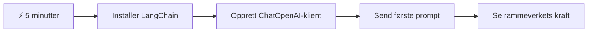
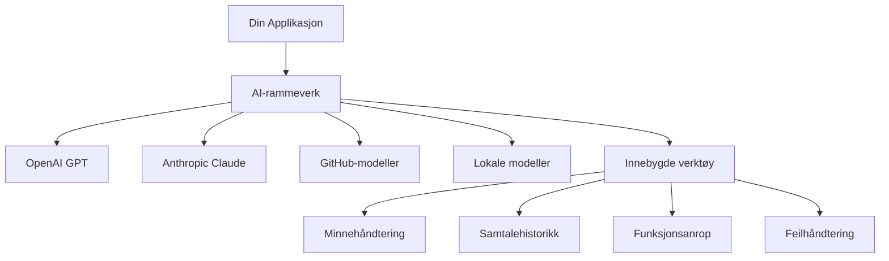
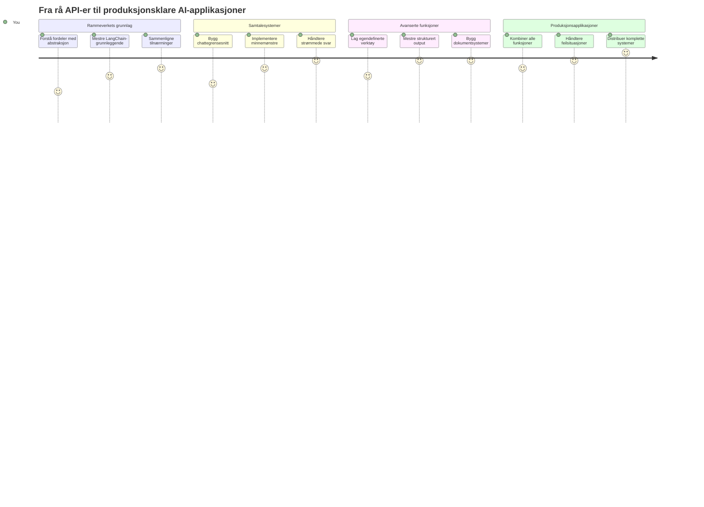
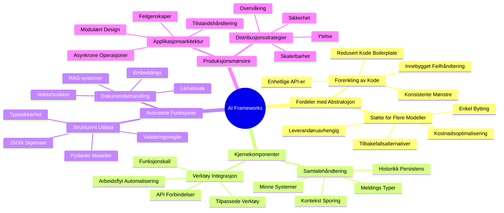
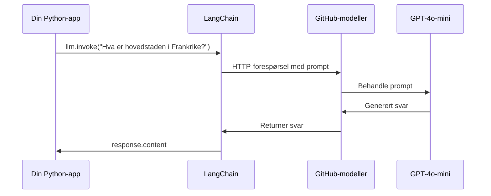
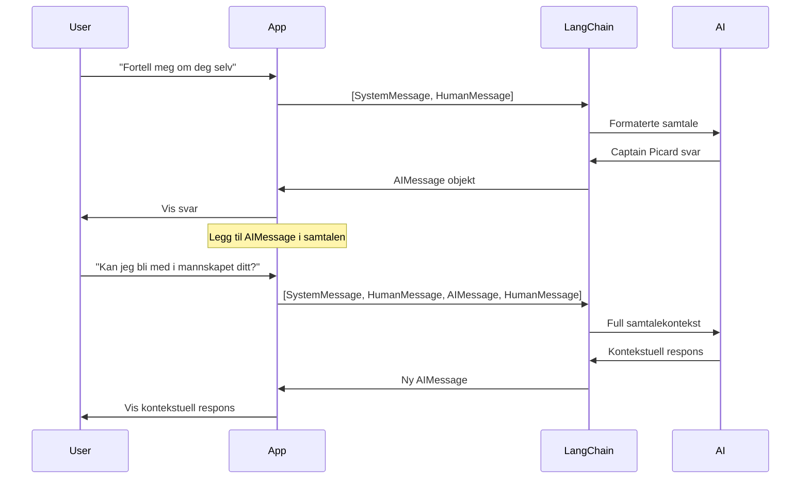
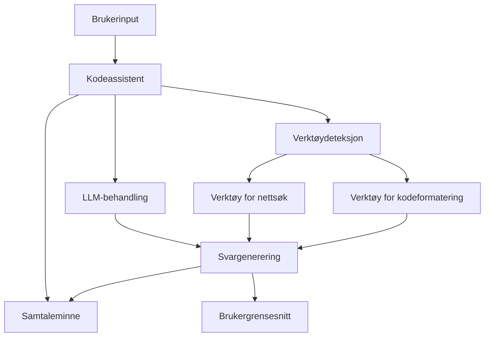
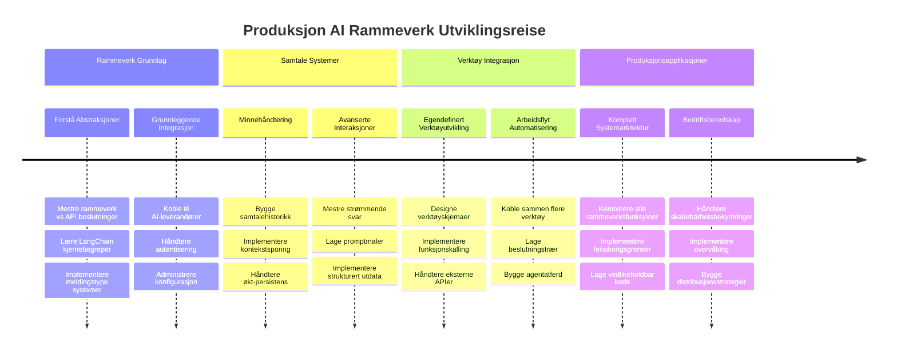
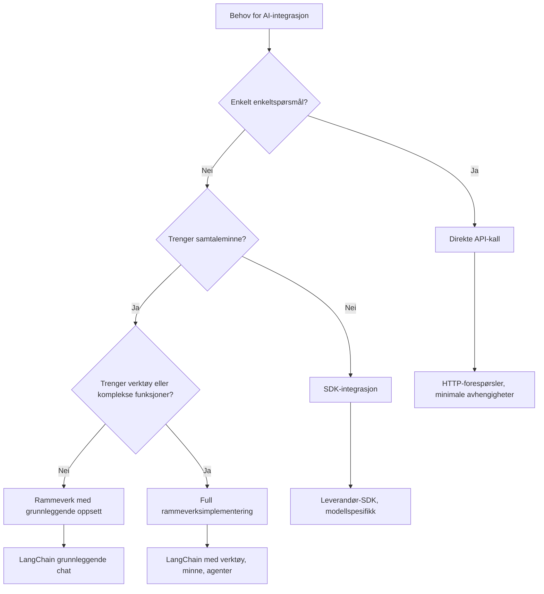

# AI-rammeverk

Har du noen gang følt deg overveldet når du prøvde å bygge AI-applikasjoner fra bunnen av? Du er ikke alene! AI-rammeverk er som å ha en sveitsisk lommekniv for AI-utvikling - de er kraftige verktøy som kan spare deg for tid og hodebry når du bygger intelligente applikasjoner. Tenk på et AI-rammeverk som et godt organisert bibliotek: det tilbyr ferdigbygde komponenter, standardiserte API-er og smarte abstraksjoner slik at du kan fokusere på å løse problemer i stedet for å slite med implementasjonsdetaljer.

I denne leksjonen skal vi utforske hvordan rammeverk som LangChain kan gjøre det som tidligere var komplekse AI-integrasjonsoppgaver om til ren, lettlest kode. Du vil oppdage hvordan du kan takle virkelige utfordringer som å holde oversikt over samtaler, implementere verktøysamtaler og håndtere ulike AI-modeller gjennom ett samlet grensesnitt.

Når vi er ferdige, vil du vite når du skal bruke rammeverk i stedet for rå API-kall, hvordan du bruker abstraksjonene deres effektivt, og hvordan du bygger AI-applikasjoner som er klare for bruk i virkelige situasjoner. La oss utforske hva AI-rammeverk kan gjøre for prosjektene dine.

## ⚡ Hva du kan gjøre de neste 5 minuttene

**Rask start for travle utviklere**


- **Minutt 1**: Installer LangChain: `pip install langchain langchain-openai`
- **Minutt 2**: Sett opp GitHub-tokenet ditt og importer ChatOpenAI-klienten
- **Minutt 3**: Lag en enkel samtale med system- og menneskemeldinger
- **Minutt 4**: Legg til et grunnleggende verktøy (som en add-funksjon) og se AI-verktøysamtale
- **Minutt 5**: Opplev forskjellen mellom rå API-kall og rammeverksabstraksjon

**Rask testkode**:
```python
from langchain_openai import ChatOpenAI
from langchain_core.messages import SystemMessage, HumanMessage

llm = ChatOpenAI(
    api_key=os.environ["GITHUB_TOKEN"],
    base_url="https://models.github.ai/inference",
    model="openai/gpt-4o-mini"
)

response = llm.invoke([
    SystemMessage(content="You are a helpful coding assistant"),
    HumanMessage(content="Explain Python functions briefly")
])
print(response.content)
```

**Hvorfor dette er viktig**: På 5 minutter vil du oppleve hvordan AI-rammeverk forvandler kompleks AI-integrasjon til enkle metodetilkall. Dette er grunnlaget som driver produksjonsklare AI-applikasjoner.

## Hvorfor velge et rammeverk?

Så du er klar til å bygge en AI-app – flott! Men her er tingen: du har flere forskjellige veier du kan gå, og hver av dem har sine fordeler og ulemper. Det er litt som å velge mellom å gå, sykle eller kjøre bil for å komme til et sted – alle vil komme deg dit, men opplevelsen (og innsatsen) blir helt forskjellig.

La oss bryte ned de tre hovedmåtene du kan integrere AI i prosjektene dine på:

| Tilnærming | Fordeler | Best for | Vurderinger |
|------------|----------|----------|-------------|
| **Direkte HTTP-forespørsler** | Full kontroll, ingen avhengigheter | Enkle forespørsler, lære grunnleggende | Mer omfattende kode, manuell feilbehandling |
| **SDK-integrasjon** | Mindre boilerplate, modellspesifikk optimalisering | Applikasjoner med én modell | Begrenset til spesifikke leverandører |
| **AI-rammeverk** | Enhetlig API, innebygde abstraksjoner | Apper med flere modeller, komplekse arbeidsflyter | Læringskurve, potensiell over-abstraksjon |

### Fordeler med rammeverk i praksis


**Hvorfor rammeverk betyr noe:**
- **Samler** flere AI-leverandører under ett grensesnitt
- **Håndterer** samtaleminne automatisk
- **Tilbyr** ferdige verktøy for vanlige oppgaver som embeddings og funksjonskall
- **Administrerer** feilbehandling og retry-logikk
- **Gjør** komplekse arbeidsflyter om til lettleste metodetilkall

> 💡 **Profftips**: Bruk rammeverk når du bytter mellom forskjellige AI-modeller eller bygger komplekse funksjoner som agenter, minne eller verktøysamtaler. Hold deg til direkte API-er når du lærer det grunnleggende eller bygger enkle, fokuserte apper.

**Konklusjon**: Som når du velger mellom et håndverkerverktøy og et komplett verksted, handler det om å matche verktøyet med oppgaven. Rammeverk utmerker seg for komplekse, funksjonsrike applikasjoner, mens direkte API-er fungerer bra for enkle bruksområder.

## 🗺️ Din læringsreise gjennom AI-rammeverk-mestring


**Ditt mål for reisen**: Innen slutten av denne leksjonen vil du ha mestret AI-rammeverksutvikling og kunne bygge sofistikerte, produksjonsklare AI-applikasjoner som kan konkurrere med kommersielle AI-assistenter.

## Introduksjon

I denne leksjonen skal vi lære å:

- Bruke et vanlig AI-rammeverk.
- Ta tak i vanlige problemer som chat-samtaler, verktøybruk, minne og kontekst.
- Utnytte dette til å bygge AI-apper.

## 🧠 AI-rammeverksutviklingsøkosystem


**Kjernprinsipp**: AI-rammeverk abstraherer kompleksitet samtidig som de gir kraftige abstraksjoner for samtalehåndtering, verktøyintegrasjon og dokumentprosessering, som gjør det mulig for utviklere å bygge sofistikerte AI-applikasjoner med ren, vedlikeholdbar kode.

## Din første AI-prompt

La oss starte med det grunnleggende ved å lage din første AI-applikasjon som sender et spørsmål og får et svar tilbake. Som Archimedes som oppdaget prinsippet om forskyvning i badekaret sitt, er det noen ganger de enkleste observasjonene som fører til de mest kraftfulle innsiktene – og rammeverk gjør disse innsiktene tilgjengelige.

### Sette opp LangChain med GitHub-modeller

Vi skal bruke LangChain for å koble til GitHub-modeller, noe som er ganske kult fordi det gir deg gratis tilgang til forskjellige AI-modeller. Det beste? Du trenger bare noen få enkle konfigurasjonsparametere for å komme i gang:

```python
from langchain_openai import ChatOpenAI
import os

llm = ChatOpenAI(
    api_key=os.environ["GITHUB_TOKEN"],
    base_url="https://models.github.ai/inference",
    model="openai/gpt-4o-mini",
)

# Send en enkel oppfordring
response = llm.invoke("What's the capital of France?")
print(response.content)
```

**La oss bryte ned hva som skjer her:**
- **Oppretter** en LangChain-klient med `ChatOpenAI`-klassen – dette er din inngangsport til AI!
- **Konfigurerer** tilkoblingen til GitHub-modeller med ditt autentiseringstoken
- **Spesifiserer** hvilken AI-modell som skal brukes (`gpt-4o-mini`) – tenk på dette som å velge din AI-assistent
- **Sender** spørsmålet ditt med `invoke()`-metoden – det er her magien skjer
- **Henter ut** og viser svaret – og voilà, du chatter med AI!

> 🔧 **Oppsettstips**: Hvis du bruker GitHub Codespaces, er du heldig – `GITHUB_TOKEN` er allerede satt opp for deg! Jobber du lokalt? Ikke noe problem, du må bare lage et personlig tilgangstoken med riktige tillatelser.

**Forventet utdata:**
```text
The capital of France is Paris.
```


## Bygge samtaleorientert AI

Det første eksempelet viser det grunnleggende, men det er bare en enkel utveksling – du stiller et spørsmål, får et svar, og det er det. I virkelige applikasjoner vil du at AI-en skal huske hva dere har diskutert, slik Watson og Holmes bygde sine etterforskningssamtaler over tid.

Her blir LangChain spesielt nyttig. Det tilbyr ulike meldingstyper som hjelper til med å strukturere samtaler og lar deg gi AI-en en personlighet. Du vil bygge chatteopplevelser som opprettholder kontekst og karakter.

### Forstå meldingstyper

Tenk på disse meldingstypene som forskjellige “hatter” deltakerne har i en samtale. LangChain bruker ulike meldingsklasser for å holde styr på hvem som sier hva:

| Meldingstype | Formål | Eksempelbruk |
|--------------|---------|--------------|
| `SystemMessage` | Definerer AI-personlighet og oppførsel | "Du er en hjelpsom kodeassistent" |
| `HumanMessage` | Representerer brukerinput | "Forklar hvordan funksjoner fungerer" |
| `AIMessage` | Lagrer AI-svar | Tidligere AI-responser i samtalen |

### Lage din første samtale

La oss lage en samtale der AI-en antar en bestemt rolle. Vi lar den være Kaptein Picard – en karakter kjent for sin diplomatiske visdom og lederskap:

```python
messages = [
    SystemMessage(content="You are Captain Picard of the Starship Enterprise"),
    HumanMessage(content="Tell me about you"),
]
```

**Slik bryter vi ned oppsettet for denne samtalen:**
- **Etablerer** AI-ens rolle og personlighet via `SystemMessage`
- **Gir** den innledende brukerforespørselen via `HumanMessage`
- **Lager** et grunnlag for samtaler som går over flere runder

Den fullstendige koden for dette eksempelet ser slik ut:

```python
from langchain_core.messages import HumanMessage, SystemMessage
from langchain_openai import ChatOpenAI
import os

llm = ChatOpenAI(
    api_key=os.environ["GITHUB_TOKEN"],
    base_url="https://models.github.ai/inference",
    model="openai/gpt-4o-mini",
)

messages = [
    SystemMessage(content="You are Captain Picard of the Starship Enterprise"),
    HumanMessage(content="Tell me about you"),
]


# fungerer
response  = llm.invoke(messages)
print(response.content)
```

Du bør få et resultat som ligner dette:

```text
I am Captain Jean-Luc Picard, the commanding officer of the USS Enterprise (NCC-1701-D), a starship in the United Federation of Planets. My primary mission is to explore new worlds, seek out new life and new civilizations, and boldly go where no one has gone before. 

I believe in the importance of diplomacy, reason, and the pursuit of knowledge. My crew is diverse and skilled, and we often face challenges that test our resolve, ethics, and ingenuity. Throughout my career, I have encountered numerous species, grappled with complex moral dilemmas, and have consistently sought peaceful solutions to conflicts.

I hold the ideals of the Federation close to my heart, believing in the importance of cooperation, understanding, and respect for all sentient beings. My experiences have shaped my leadership style, and I strive to be a thoughtful and just captain. How may I assist you further?
```

For å opprettholde kontinuitet i samtalen (i stedet for å nullstille konteksten hver gang), må du fortsette å legge til svar i meldingslisten din. Som muntlige tradisjoner som bevarte historier gjennom generasjoner, bygger denne tilnærmingen varig minne:

```python
from langchain_core.messages import HumanMessage, SystemMessage
from langchain_openai import ChatOpenAI
import os

llm = ChatOpenAI(
    api_key=os.environ["GITHUB_TOKEN"],
    base_url="https://models.github.ai/inference",
    model="openai/gpt-4o-mini",
)

messages = [
    SystemMessage(content="You are Captain Picard of the Starship Enterprise"),
    HumanMessage(content="Tell me about you"),
]


# fungerer
response  = llm.invoke(messages)

print(response.content)

print("---- Next ----")

messages.append(response)
messages.append(HumanMessage(content="Now that I know about you, I'm Chris, can I be in your crew?"))

response  = llm.invoke(messages)

print(response.content)

```

Kult, ikke sant? Det som skjer her er at vi kaller LLM to ganger – først med bare de to innledende meldingene våre, men så igjen med hele samtalehistorikken. Det er som om AI-en faktisk følger med på samtalen vår!

Når du kjører denne koden, vil du få et andre svar som høres slik ut:

```text
Welcome aboard, Chris! It's always a pleasure to meet those who share a passion for exploration and discovery. While I cannot formally offer you a position on the Enterprise right now, I encourage you to pursue your aspirations. We are always in need of talented individuals with diverse skills and backgrounds. 

If you are interested in space exploration, consider education and training in the sciences, engineering, or diplomacy. The values of curiosity, resilience, and teamwork are crucial in Starfleet. Should you ever find yourself on a starship, remember to uphold the principles of the Federation: peace, understanding, and respect for all beings. Your journey can lead you to remarkable adventures, whether in the stars or on the ground. Engage!
```


Jeg tar det som et kanskje ;)

## Streaming av svar

Har du lagt merke til hvordan ChatGPT ser ut til å “skrive” sine svar i sanntid? Det er streaming i aksjon. Som å se en dyktig kalligraf jobbe – se tegnene dukke opp strek for strek i stedet for å materialisere seg umiddelbart – gjør streaming interaksjonen mer naturlig og gir umiddelbar tilbakemelding.

### Implementere streaming med LangChain

```python
from langchain_openai import ChatOpenAI
import os

llm = ChatOpenAI(
    api_key=os.environ["GITHUB_TOKEN"],
    base_url="https://models.github.ai/inference",
    model="openai/gpt-4o-mini",
    streaming=True
)

# Strøm svaret
for chunk in llm.stream("Write a short story about a robot learning to code"):
    print(chunk.content, end="", flush=True)
```

**Hvorfor streaming er fantastisk:**
- **Viser** innhold mens det blir laget – ikke mer pinlig venting!
- **Får** brukerne til å føle at noe faktisk skjer
- **Føles** raskere, selv om det teknisk sett ikke er det
- **Lar** brukere begynne å lese mens AI-en fortsatt “tenker”

> 💡 **Brukeropplevelsestips**: Streaming skinner spesielt når du håndterer lengre svar som kodeforklaringer, kreativ skriving eller detaljerte veiledninger. Brukerne dine vil elske å se fremdriften i stedet for å stirre på en tom skjerm!

### 🎯 Pedagogisk sjekkpunkt: Fordeler med rammeverksabstraksjon

**Pause og refleksjon**: Du har nettopp opplevd kraften i AI-rammeverksabstraksjoner. Sammenlign det du har lært med rå API-kall fra tidligere leksjoner.

**Rask selvvurdering**:
- Kan du forklare hvordan LangChain forenkler samtalehåndtering sammenlignet med manuell sporing av meldinger?
- Hva er forskjellen mellom `invoke()` og `stream()`-metodene, og når ville du brukt hver?
- Hvordan forbedrer rammeverkets meldingssystem kodeorganiseringen?

**Virkelighetskobling**: Abstraksjonsmønstrene du har lært (meldingstyper, streaming-grensesnitt, samtaleminne) brukes i alle store AI-applikasjoner – fra ChatGPTs grensesnitt til GitHub Copilots kodeassistanse. Du mestrer de samme arkitektoniske mønstrene som profesjonelle AI-utviklingsteam bruker.

**Utfordringsspørsmål**: Hvordan ville du designet en rammeverksabstraksjon for håndtering av ulike AI-modellleverandører (OpenAI, Anthropic, Google) med ett enkelt grensesnitt? Tenk på fordeler og ulemper.

## Prompt-maler

Prompt-maler fungerer som retoriske strukturer brukt i klassisk talekunst – tenk på hvordan Cicero tilpasset tale-mønstrene sine for ulike publikum mens han beholdt det samme overbevisende rammeverket. De gjør at du kan lage gjenbrukbare prompts hvor du kan bytte ut forskjellige informasjonsbiter uten å skrive alt på nytt. Når du har satt opp malen, fyller du bare inn variablene med de verdiene du trenger.

### Lage gjenbrukbare prompts

```python
from langchain_core.prompts import ChatPromptTemplate

# Definer en mal for kodeforklaringer
template = ChatPromptTemplate.from_messages([
    ("system", "You are an expert programming instructor. Explain concepts clearly with examples."),
    ("human", "Explain {concept} in {language} with a practical example for {skill_level} developers")
])

# Bruk malen med forskjellige verdier
questions = [
    {"concept": "functions", "language": "JavaScript", "skill_level": "beginner"},
    {"concept": "classes", "language": "Python", "skill_level": "intermediate"},
    {"concept": "async/await", "language": "JavaScript", "skill_level": "advanced"}
]

for question in questions:
    prompt = template.format_messages(**question)
    response = llm.invoke(prompt)
    print(f"Topic: {question['concept']}\n{response.content}\n---\n")
```

**Hvorfor du vil elske å bruke maler:**
- **Holder** promptene dine konsistente gjennom hele appen
- **Ingen flere** rotete strengsammensetninger – bare rene, enkle variabler
- **AI-en din** oppfører seg forutsigbart fordi strukturen forblir den samme
- **Oppdateringer** er en lek – endre malen én gang, så er det fikset overalt

## Strukturert output

Har du noen gang blitt frustrert over å prøve å tolke AI-responser som kommer som ustrukturert tekst? Strukturert output er som å lære AI-en å følge den systematiske tilnærmingen som Linné brukte for biologisk klassifisering – organisert, forutsigbar og enkel å jobbe med. Du kan be om JSON, spesifikke datastrukturer eller hvilket som helst format du trenger.

### Definere output-skjemaer

```python
from langchain_core.prompts import ChatPromptTemplate
from langchain_core.output_parsers import JsonOutputParser
from pydantic import BaseModel, Field

class CodeReview(BaseModel):
    score: int = Field(description="Code quality score from 1-10")
    strengths: list[str] = Field(description="List of code strengths")
    improvements: list[str] = Field(description="List of suggested improvements")
    overall_feedback: str = Field(description="Summary feedback")

# Sett opp parseren
parser = JsonOutputParser(pydantic_object=CodeReview)

# Lag prompt med formatinstruksjoner
prompt = ChatPromptTemplate.from_messages([
    ("system", "You are a code reviewer. {format_instructions}"),
    ("human", "Review this code: {code}")
])

# Formater prompten med instruksjoner
chain = prompt | llm | parser

# Få strukturert respons
code_sample = """
def calculate_average(numbers):
    return sum(numbers) / len(numbers)
"""

result = chain.invoke({
    "code": code_sample,
    "format_instructions": parser.get_format_instructions()
})

print(f"Score: {result['score']}")
print(f"Strengths: {', '.join(result['strengths'])}")
```

**Hvorfor strukturert output er en stor forandring:**
- **Slutt på** å gjette hvilket format du får tilbake – det er konsekvent hver gang
- **Kan kobles** direkte til databaser og API-er uten ekstra arbeid
- **Fanger opp** rare AI-responser før de ødelegger appen din
- **Gjør** koden din renere fordi du vet nøyaktig hva du jobber med

## Verktøysamtaler

Nå kommer vi til en av de kraftigste funksjonene: verktøy. Dette er hvordan du gir AI-en din praktiske muligheter utover samtaler. Som de middelalderske laugene utviklet spesialiserte verktøy for spesifikke håndverk, kan du utstyre AI-en din med fokuserte instrumenter. Du beskriver hvilke verktøy som er tilgjengelige, og når noen ber om noe som matcher, kan AI-en ta affære.

### Bruke Python

La oss legge til noen verktøy slik:

```python
from typing_extensions import Annotated, TypedDict

class add(TypedDict):
    """Add two integers."""

    # Anmerkninger må ha typen og kan valgfritt inkludere en standardverdi og beskrivelse (i den rekkefølgen).
    a: Annotated[int, ..., "First integer"]
    b: Annotated[int, ..., "Second integer"]

tools = [add]

functions = {
    "add": lambda a, b: a + b
}
```

Hva skjer her? Vi lager en mal for et verktøy kalt `add`. Ved å arve fra `TypedDict` og bruke de fancy `Annotated`-typene for `a` og `b`, gir vi LLM et klart bilde av hva dette verktøyet gjør og hva det trenger. `functions`-ordboken er som verktøyskassa vår – den forteller koden akkurat hva den skal gjøre når AI-en bestemmer seg for å bruke et bestemt verktøy.

La oss se hvordan vi så kaller LLM med dette verktøyet:

```python
llm = ChatOpenAI(
    api_key=os.environ["GITHUB_TOKEN"],
    base_url="https://models.github.ai/inference",
    model="openai/gpt-4o-mini",
)

llm_with_tools = llm.bind_tools(tools)
```

Her kaller vi `bind_tools` med `tools`-arrayet vårt, og dermed har LLM `llm_with_tools` nå kunnskap om dette verktøyet.

For å bruke denne nye LLM kan vi skrive følgende kode:

```python
query = "What is 3 + 12?"

res = llm_with_tools.invoke(query)
if(res.tool_calls):
    for tool in res.tool_calls:
        print("TOOL CALL: ", functions[tool["name"]](../../../10-ai-framework-project/**tool["args"]))
print("CONTENT: ",res.content)
```

Når vi nå kaller `invoke` på denne nye llm, som har verktøy, får vi kanskje eiendommen `tool_calls` fylt ut. Hvis så, har alle identifiserte verktøy en `name` og `args`-egenskap som identifiserer hvilket verktøy som skal kalles og med hvilke argumenter. Den fullstendige koden ser slik ut:

```python
from langchain_core.messages import HumanMessage, SystemMessage
from langchain_openai import ChatOpenAI
import os
from typing_extensions import Annotated, TypedDict

class add(TypedDict):
    """Add two integers."""

    # Anmerkninger må ha typen og kan valgfritt inkludere en standardverdi og beskrivelse (i den rekkefølgen).
    a: Annotated[int, ..., "First integer"]
    b: Annotated[int, ..., "Second integer"]

tools = [add]

functions = {
    "add": lambda a, b: a + b
}

llm = ChatOpenAI(
    api_key=os.environ["GITHUB_TOKEN"],
    base_url="https://models.github.ai/inference",
    model="openai/gpt-4o-mini",
)

llm_with_tools = llm.bind_tools(tools)

query = "What is 3 + 12?"

res = llm_with_tools.invoke(query)
if(res.tool_calls):
    for tool in res.tool_calls:
        print("TOOL CALL: ", functions[tool["name"]](../../../10-ai-framework-project/**tool["args"]))
print("CONTENT: ",res.content)
```

Når du kjører denne koden, bør du se utdata som ligner på:

```text
TOOL CALL:  15
CONTENT: 
```

AI-en undersøkte "Hva er 3 + 12" og gjenkjente dette som en oppgave for `add`-verktøyet. Som en dyktig bibliotekar som vet hvilken referanse man skal konsultere basert på spørsmålets karakter, gjorde det denne vurderingen ut fra verktøyets navn, beskrivelse og feltspecifikasjoner. Resultatet 15 kommer fra vår `functions`-ordbok som utfører verktøyet:

```python
print("TOOL CALL: ", functions[tool["name"]](../../../10-ai-framework-project/**tool["args"]))
```

### Et mer interessant verktøy som kaller et web-API
Å legge til tall demonstrerer konseptet, men ekte verktøy utfører vanligvis mer komplekse operasjoner, som å kalle web-APIer. La oss utvide eksemplet vårt til å la AI hente innhold fra internett – på samme måte som telegrafoperatører en gang koblet sammen fjerne steder:

```python
class joke(TypedDict):
    """Tell a joke."""

    # Anmerkninger må ha typen og kan valgfritt inkludere en standardverdi og beskrivelse (i den rekkefølgen).
    category: Annotated[str, ..., "The joke category"]

def get_joke(category: str) -> str:
    response = requests.get(f"https://api.chucknorris.io/jokes/random?category={category}", headers={"Accept": "application/json"})
    if response.status_code == 200:
        return response.json().get("value", f"Here's a {category} joke!")
    return f"Here's a {category} joke!"

functions = {
    "add": lambda a, b: a + b,
    "joke": lambda category: get_joke(category)
}

query = "Tell me a joke about animals"

# resten av koden er den samme
```

Nå, hvis du kjører denne koden, vil du få et svar som sier noe som:

```text
TOOL CALL:  Chuck Norris once rode a nine foot grizzly bear through an automatic car wash, instead of taking a shower.
CONTENT:  
```

```mermaid
flowchart TD
    A[Brukerspørsmål: "Fortell meg en vits om dyr"] --> B[LangChain Analyse]
    B --> C{Verktøy tilgjengelig?}
    C -->|Ja| D[Velg vitsverktøy]
    C -->|Nei| E[Generer direkte svar]
    
    D --> F[Ekstraher parametere]
    F --> G[Ring vits(kategori="dyr")]
    G --> H[API-forespørsel til chucknorris.io]
    H --> I[Returner vitsinnhold]
    I --> J[Vis til bruker]
    
    E --> K[AI-generert svar]
    K --> J
    
    subgraph "Verktøydefinisjonslag"
        L[TypedDict-skjema]
        M[Funksjonsimplementasjon]
        N[Parameterverifisering]
    end
    
    D --> L
    F --> N
    G --> M
```
Her er koden i sin helhet:

```python
from langchain_openai import ChatOpenAI
import requests
import os
from typing_extensions import Annotated, TypedDict

class add(TypedDict):
    """Add two integers."""

    # Anmerkninger må ha typen og kan valgfritt inkludere en standardverdi og beskrivelse (i den rekkefølgen).
    a: Annotated[int, ..., "First integer"]
    b: Annotated[int, ..., "Second integer"]

class joke(TypedDict):
    """Tell a joke."""

    # Anmerkninger må ha typen og kan valgfritt inkludere en standardverdi og beskrivelse (i den rekkefølgen).
    category: Annotated[str, ..., "The joke category"]

tools = [add, joke]

def get_joke(category: str) -> str:
    response = requests.get(f"https://api.chucknorris.io/jokes/random?category={category}", headers={"Accept": "application/json"})
    if response.status_code == 200:
        return response.json().get("value", f"Here's a {category} joke!")
    return f"Here's a {category} joke!"

functions = {
    "add": lambda a, b: a + b,
    "joke": lambda category: get_joke(category)
}

llm = ChatOpenAI(
    api_key=os.environ["GITHUB_TOKEN"],
    base_url="https://models.github.ai/inference",
    model="openai/gpt-4o-mini",
)

llm_with_tools = llm.bind_tools(tools)

query = "Tell me a joke about animals"

res = llm_with_tools.invoke(query)
if(res.tool_calls):
    for tool in res.tool_calls:
        # print("VERKTØYRING: ", tool)
        print("TOOL CALL: ", functions[tool["name"]](../../../10-ai-framework-project/**tool["args"]))
print("CONTENT: ",res.content)
```

## Embeddings og dokumentbehandling

Embeddings representerer en av de mest elegante løsningene innen moderne AI. Forestill deg om du kunne ta et hvilket som helst tekstutdrag og konvertere det til numeriske koordinater som fanger meningen. Det er akkurat det embeddings gjør – de transformerer tekst til punkter i et flerdimensjonalt rom hvor lignende konsepter samler seg. Det er som å ha et koordinatsystem for ideer, på samme måte som Mendelejev organiserte det periodiske system etter atomære egenskaper.

### Lage og bruke embeddings

```python
from langchain_openai import OpenAIEmbeddings
from langchain_community.vectorstores import FAISS
from langchain_community.document_loaders import TextLoader
from langchain.text_splitter import CharacterTextSplitter

# Initialiser innebygde representasjoner
embeddings = OpenAIEmbeddings(
    api_key=os.environ["GITHUB_TOKEN"],
    base_url="https://models.github.ai/inference",
    model="text-embedding-3-small"
)

# Last inn og del opp dokumenter
loader = TextLoader("documentation.txt")
documents = loader.load()

text_splitter = CharacterTextSplitter(chunk_size=1000, chunk_overlap=0)
texts = text_splitter.split_documents(documents)

# Opprett vektorlagring
vectorstore = FAISS.from_documents(texts, embeddings)

# Utfør likhetssøk
query = "How do I handle user authentication?"
similar_docs = vectorstore.similarity_search(query, k=3)

for doc in similar_docs:
    print(f"Relevant content: {doc.page_content[:200]}...")
```

### Dokumentinnlastere for ulike formater

```python
from langchain_community.document_loaders import (
    PyPDFLoader,
    CSVLoader,
    JSONLoader,
    WebBaseLoader
)

# Last inn forskjellige dokumenttyper
pdf_loader = PyPDFLoader("manual.pdf")
csv_loader = CSVLoader("data.csv")
json_loader = JSONLoader("config.json")
web_loader = WebBaseLoader("https://example.com/docs")

# Behandle alle dokumenter
all_documents = []
for loader in [pdf_loader, csv_loader, json_loader, web_loader]:
    docs = loader.load()
    all_documents.extend(docs)
```

**Hva du kan gjøre med embeddings:**
- **Bygge** søk som faktisk forstår hva du mener, ikke bare nøkkelordmatching
- **Skape** AI som kan svare på spørsmål om dokumentene dine
- **Lage** anbefalingssystemer som foreslår virkelig relevant innhold
- **Automatisk** organisere og kategorisere innholdet ditt

```mermaid
flowchart LR
    A[Dokumenter] --> B[Tekstdeler]
    B --> C[Opprett Innleiring]
    C --> D[Vektorbutikk]
    
    E[Brukerspørsmål] --> F[Spørringsinnleiring]
    F --> G[Likhetssøk]
    G --> D
    D --> H[Relevante Dokumenter]
    H --> I[AI-svar]
    
    subgraph "Vektorrom"
        J[Dokument A: [0.1, 0.8, 0.3...]]
        K[Dokument B: [0.2, 0.7, 0.4...]]
        L[Spørring: [0.15, 0.75, 0.35...]]
    end
    
    C --> J
    C --> K
    F --> L
    G --> J
    G --> K
```
## Bygge en komplett AI-applikasjon

Nå skal vi integrere alt du har lært til en omfattende applikasjon – en kodeassistent som kan svare på spørsmål, bruke verktøy og holde samtaleminne. På samme måte som boktrykkerkunsten kombinerte eksisterende teknologier (løststående typer, blekk, papir og trykk) til noe revolusjonerende, skal vi kombinere AI-komponentene våre til noe praktisk og nyttig.

### Eksempel på komplett applikasjon

```python
from langchain_openai import ChatOpenAI, OpenAIEmbeddings
from langchain_core.prompts import ChatPromptTemplate
from langchain_core.messages import HumanMessage, SystemMessage, AIMessage
from langchain_community.vectorstores import FAISS
from typing_extensions import Annotated, TypedDict
import os
import requests

class CodingAssistant:
    def __init__(self):
        self.llm = ChatOpenAI(
            api_key=os.environ["GITHUB_TOKEN"],
            base_url="https://models.github.ai/inference",
            model="openai/gpt-4o-mini"
        )
        
        self.conversation_history = [
            SystemMessage(content="""You are an expert coding assistant. 
            Help users learn programming concepts, debug code, and write better software.
            Use tools when needed and maintain a helpful, encouraging tone.""")
        ]
        
        # Definer verktøy
        self.setup_tools()
    
    def setup_tools(self):
        class web_search(TypedDict):
            """Search for programming documentation or examples."""
            query: Annotated[str, "Search query for programming help"]
        
        class code_formatter(TypedDict):
            """Format and validate code snippets."""
            code: Annotated[str, "Code to format"]
            language: Annotated[str, "Programming language"]
        
        self.tools = [web_search, code_formatter]
        self.llm_with_tools = self.llm.bind_tools(self.tools)
    
    def chat(self, user_input: str):
        # Legg til brukermelding i samtalen
        self.conversation_history.append(HumanMessage(content=user_input))
        
        # Hent AI-svar
        response = self.llm_with_tools.invoke(self.conversation_history)
        
        # Håndter verktøy kall hvis noen
        if response.tool_calls:
            for tool_call in response.tool_calls:
                tool_result = self.execute_tool(tool_call)
                print(f"🔧 Tool used: {tool_call['name']}")
                print(f"📊 Result: {tool_result}")
        
        # Legg til AI-svar i samtalen
        self.conversation_history.append(response)
        
        return response.content
    
    def execute_tool(self, tool_call):
        tool_name = tool_call['name']
        args = tool_call['args']
        
        if tool_name == 'web_search':
            return f"Found documentation for: {args['query']}"
        elif tool_name == 'code_formatter':
            return f"Formatted {args['language']} code: {args['code'][:50]}..."
        
        return "Tool execution completed"

# Brukseksempel
assistant = CodingAssistant()

print("🤖 Coding Assistant Ready! Type 'quit' to exit.\n")

while True:
    user_input = input("You: ")
    if user_input.lower() == 'quit':
        break
    
    response = assistant.chat(user_input)
    print(f"🤖 Assistant: {response}\n")
```

**Applikasjonsarkitektur:**


**Nøkkelfunksjoner vi har implementert:**
- **Husker** hele samtalen din for kontinuitet i kontekst
- **Utfører handlinger** gjennom verktøysanrop, ikke bare samtale
- **Følger** forutsigbare interaksjonsmønstre
- **Håndterer** feilsituasjoner og komplekse arbeidsflyter automatisk

### 🎯 Pedagogisk sjekkpunkt: Produksjons-AI-arkitektur

**Forståelse av arkitektur**: Du har bygget en komplett AI-applikasjon som kombinerer samtalehåndtering, verktøysanrop og strukturerte arbeidsflyter. Dette representerer produksjonsnivå utvikling av AI-applikasjoner.

**Nøkkelkonsepter behersket**:
- **Klassebasert arkitektur**: Organisert, vedlikeholdbar AI-applikasjonsstruktur
- **Verktøyintegrasjon**: Egendefinert funksjonalitet utover samtale
- **Minnestyring**: Vedvarende samtalekontekst
- **Feilhåndtering**: Robust applikasjonsadferd

**Bransjetilknytning**: Arkitekturmønstrene du har implementert (samtaleklasser, verktøysystemer, minnestyring) er de samme mønstrene som brukes i bedrifts-AI-applikasjoner som Slack sin AI-assistent, GitHub Copilot og Microsoft Copilot. Du bygger med profesjonell, arkitektonisk tankegang.

**Refleksjonsspørsmål**: Hvordan ville du utvidet denne applikasjonen for å håndtere flere brukere, vedvarende lagring eller integrasjon med eksterne databaser? Vurder utfordringer med skalerbarhet og tilstandsstyring.

## Oppgave: Bygg din egen AI-drevne studieassistent

**Mål**: Lag en AI-applikasjon som hjelper studenter med å lære programmeringskonsepter ved å gi forklaringer, kodeeksempler og interaktive quizer.

### Krav

**Kjernefunksjoner (påkrevd):**
1. **Samtalegrensesnitt**: Implementer et chatsystem som opprettholder kontekst over flere spørsmål
2. **Utdanningsverktøy**: Lag minst to verktøy som hjelper med læring:
   - Verktøy for kodeforklaring
   - Quizgenerator for konsepter
3. **Personlig tilpasning**: Bruk systemmeldinger for å tilpasse svar til ulike ferdighetsnivåer
4. **Responsformattering**: Implementer strukturert output for quizspørsmål

### Implementeringstrinn

**Trinn 1: Sett opp miljøet ditt**
```bash
pip install langchain langchain-openai
```

**Trinn 2: Grunnleggende chatfunksjonalitet**
- Lag en `StudyAssistant`-klasse
- Implementer samtaleminne
- Legg til personlighet for utdanningsstøtte

**Trinn 3: Legg til utdanningsverktøy**
- **Kodeforklarer**: Bryter ned kode i forståelige deler
- **Quizgenerator**: Lager spørsmål om programmeringskonsepter
- **Fremdriftssporer**: Holder oversikt over omfang av temaer

**Trinn 4: Forbedrede funksjoner (valgfritt)**
- Implementer strømming av svar for bedre brukeropplevelse
- Legg til dokumentinnlasting for å inkludere kursmateriale
- Lag embeddings for innholdssøk basert på likhet

### Evalueringskriterier

| Funksjon | Utmerket (4) | God (3) | Tilfredsstillende (2) | Trenger forbedring (1) |
|---------|---------------|----------|------------------|----------------|
| **Samtaleflyt** | Naturlige, kontekstbevisste svar | God kontekstbevaring | Enkel samtale | Ingen minne mellom utvekslinger |
| **Verktøyintegrasjon** | Flere nyttige verktøy fungerer sømløst | 2+ verktøy implementert riktig | 1-2 enkle verktøy | Verktøy ikke funksjonelle |
| **Kodekvalitet** | Ren, godt dokumentert, feilhåndtering | God struktur, noe dokumentasjon | Grunnleggende funksjonalitet fungerer | Dårlig struktur, ingen feilhåndtering |
| **Utdanningsverdi** | Virkelig hjelpsom for læring, adaptiv | God læringsstøtte | Grunnleggende forklaringer | Begrenset lærerik verdi |

### Eksempelkodestruktur

```python
class StudyAssistant:
    def __init__(self, skill_level="beginner"):
        # Initialiser LLM, verktøy og samtaleminne
        pass
    
    def explain_code(self, code, language):
        # Verktøy: Forklar hvordan kode fungerer
        pass
    
    def generate_quiz(self, topic, difficulty):
        # Verktøy: Lag øvelsesspørsmål
        pass
    
    def chat(self, user_input):
        # Hovedsamtalegrensesnitt
        pass

# Eksempel på bruk
assistant = StudyAssistant(skill_level="intermediate")
response = assistant.chat("Explain how Python functions work")
```

**Bonusutfordringer:**
- Legg til stemmeinn- og utgang
- Lag et webgrensesnitt med Streamlit eller Flask
- Lag en kunnskapsbase fra kursmateriale ved bruk av embeddings
- Legg til fremdriftssporing og personlig læringssti

## 📈 Din tidslinje for mestring av AI-rammeverksutvikling


**🎓 Avslutningsmilepæl**: Du har med suksess mestret AI-rammeverksutvikling ved å bruke de samme verktøyene og mønstrene som driver moderne AI-applikasjoner. Disse ferdighetene representerer det ytterste innen AI-applikasjonsutvikling og forbereder deg på å bygge intelligente systemer på bedriftsnivå.

**🔄 Neste nivå kapasiteter**:
- Klar for å utforske avanserte AI-arkitekturer (agenter, multi-agent systemer)
- Forberedt på å bygge RAG-systemer med vektordatabaser
- Utstyrt for å skape multimodale AI-applikasjoner
- Fundamentet lagt for skalering og optimalisering av AI-applikasjoner

## Oppsummering

🎉 Du har nå mestret grunnprinsippene i AI-rammeverksutvikling og lært hvordan man bygger sofistikerte AI-applikasjoner med LangChain. Som å fullføre en omfattende læretid, har du skaffet deg en solid verktøykasse med ferdigheter. La oss gå gjennom hva du har oppnådd.

### Hva du har lært

**Kjerneprinsipper i rammeverk:**
- **Fordeler med rammeverk**: Forstå når det er best å bruke rammeverk fremfor direkte API-kall
- **LangChain-grunnleggende**: Setup og konfigurasjon av AI-modellforbindelser
- **Meldingstyper**: Bruke `SystemMessage`, `HumanMessage` og `AIMessage` for strukturerte samtaler

**Avanserte funksjoner:**
- **Verktøysanrop**: Lage og integrere egendefinerte verktøy for utvidet AI-funksjonalitet
- **Samtaleminne**: Opprettholde kontekst over flere samtalerunder
- **Streaming-respons**: Implementere responslevering i sanntid
- **Prompt-maler**: Bygge gjenbrukbare, dynamiske prompts
- **Strukturert output**: Sikre konsistente, maskinlesbare AI-svar
- **Embeddings**: Lage semantisk søk og dokumentbehandlingsfunksjoner

**Praktiske bruksområder:**
- **Bygge komplette apper**: Kombinere flere funksjoner til produksjonsklare apper
- **Feilhåndtering**: Implementere robust feilbehandling og validering
- **Verktøyintegrasjon**: Lage egendefinerte verktøy som utvider AI-evner

### Viktige poeng

> 🎯 **Husk**: AI-rammeverk som LangChain er dine beste venner som skjuler kompleksiteten og pakker mange funksjoner inn. De er perfekte når du trenger samtaleminne, verktøysanrop, eller ønsker å jobbe med flere AI-modeller uten å miste forstanden.

**Beslutningsramme for AI-integrasjon:**


### Hvor går du videre herfra?

**Begynn å bygge nå:**
- Ta disse konseptene og skap noe som begeistrer DEG!
- Lek deg med ulike AI-modeller gjennom LangChain – det er som en lekeplass for AI-modeller
- Lag verktøy som løser virkelige problemer du møter i arbeidet eller prosjektene dine

**Klar for neste nivå?**
- **AI-agenter**: Bygg AI-systemer som faktisk kan planlegge og utføre komplekse oppgaver på egenhånd
- **RAG (Retrieval-Augmented Generation)**: Kombiner AI med egne kunnskapsbaser for superkraftige applikasjoner
- **Multimodal AI**: Jobb med tekst, bilder og lyd samlet – mulighetene er uendelige!
- **Produksjonsdistribusjon**: Lær hvordan du skalerer AI-appene dine og overvåker dem i den virkelige verden

**Bli med i fellesskapet:**
- LangChain-fellesskapet er fantastisk for å holde seg oppdatert og lære beste praksis
- GitHub Models gir deg tilgang til banebrytende AI-funksjoner – perfekt for eksperimentering
- Fortsett å øve med forskjellige brukstilfeller – hvert prosjekt vil lære deg noe nytt

Du har nå kunnskapen til å bygge intelligente, samtalebaserte applikasjoner som kan hjelpe folk med å løse reelle problemer. Som renessansemesterne som kombinerte kunstnerisk visjon med tekniske ferdigheter, kan du nå fusjonere AI-evner med praktisk anvendelse. Spørsmålet er: Hva vil du skape? 🚀

## GitHub Copilot Agent Challenge 🚀

Bruk Agent-modus for å løse følgende utfordring:

**Beskrivelse:** Bygg en avansert AI-drevet kodegjennomgangsassistent som kombinerer flere LangChain-funksjoner inkludert verktøysanrop, strukturert output og samtaleminne for å gi omfattende tilbakemelding på kodeinnleveringer.

**Prompt:** Lag en CodeReviewAssistant-klasse som implementerer:
1. Et verktøy for å analysere kodekompleksitet og foreslå forbedringer
2. Et verktøy for å sjekke kode mot beste praksis
3. Strukturert output ved bruk av Pydantic-modeller for konsistent gjennomgangsformat
4. Samtaleminne for å spore gjennomgangsøkter
5. Et hoved-chatgrensesnitt som kan håndtere kodeinnleveringer og gi detaljerte, handlingsorienterte tilbakemeldinger

Assistenten skal kunne gjennomgå kode i flere programmeringsspråk, opprettholde kontekst på tvers av flere kodeinnleveringer i en økt, og gi både sammendragsresultater og detaljerte forbedringsforslag.

Lær mer om [agent mode](https://code.visualstudio.com/blogs/2025/02/24/introducing-copilot-agent-mode) her.

---

<!-- CO-OP TRANSLATOR DISCLAIMER START -->
**Ansvarsfraskrivelse**:
Dette dokumentet er oversatt ved hjelp av AI-oversettingstjenesten [Co-op Translator](https://github.com/Azure/co-op-translator). Selv om vi streber etter nøyaktighet, vær oppmerksom på at automatiske oversettelser kan inneholde feil eller unøyaktigheter. Det opprinnelige dokumentet på dets opprinnelige språk bør betraktes som den autoritative kilden. For kritisk informasjon anbefales profesjonell menneskelig oversettelse. Vi er ikke ansvarlige for eventuelle misforståelser eller feiltolkninger som oppstår ved bruk av denne oversettelsen.
<!-- CO-OP TRANSLATOR DISCLAIMER END -->