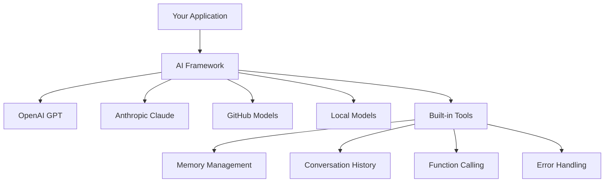
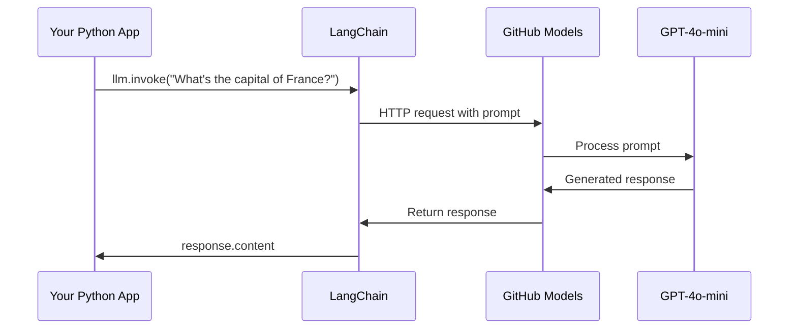
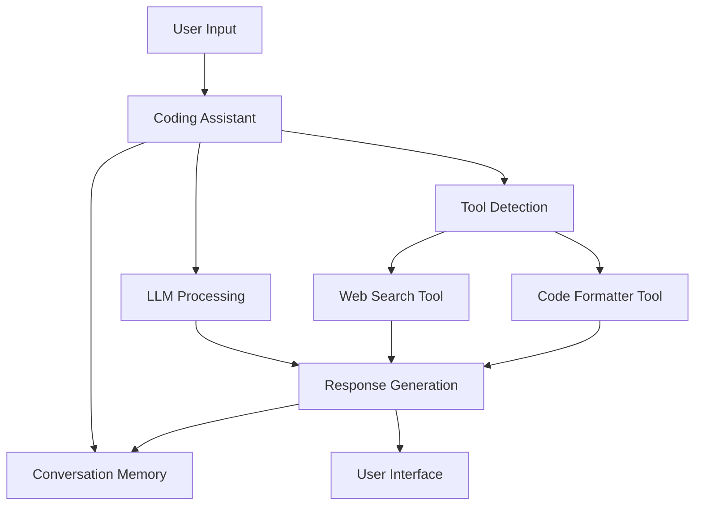
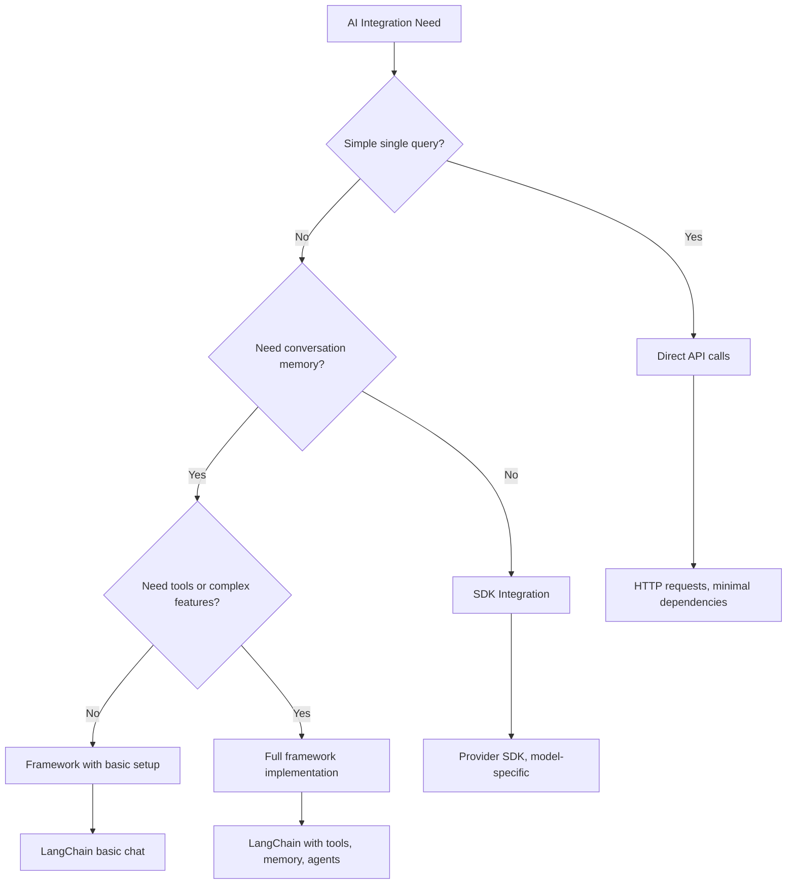

<!--
CO_OP_TRANSLATOR_METADATA:
{
  "original_hash": "e2c4ae5688e34b4b8b09d52aec56c79e",
  "translation_date": "2025-10-23T22:23:21+00:00",
  "source_file": "10-ai-framework-project/README.md",
  "language_code": "no"
}
-->
# AI-rammeverk

Har du noen gang følt deg overveldet av å bygge AI-applikasjoner fra bunnen av? Du er ikke alene! AI-rammeverk er som en sveitsisk lommekniv for AI-utvikling – kraftige verktøy som kan spare deg for tid og frustrasjon når du bygger intelligente applikasjoner. Tenk på et AI-rammeverk som et godt organisert bibliotek: det gir forhåndsbygde komponenter, standardiserte API-er og smarte abstraksjoner, slik at du kan fokusere på å løse problemer i stedet for å slite med implementasjonsdetaljer.

I denne leksjonen skal vi utforske hvordan rammeverk som LangChain kan gjøre tidligere komplekse AI-integreringsoppgaver til ren, lesbar kode. Du vil oppdage hvordan du kan takle virkelige utfordringer som å holde oversikt over samtaler, implementere verktøykall og håndtere ulike AI-modeller gjennom ett samlet grensesnitt.

Når vi er ferdige, vil du vite når du skal bruke rammeverk i stedet for rå API-kall, hvordan du bruker deres abstraksjoner effektivt, og hvordan du bygger AI-applikasjoner som er klare for virkeligheten. La oss utforske hva AI-rammeverk kan gjøre for prosjektene dine.

## Hvorfor velge et rammeverk?

Så du er klar til å bygge en AI-app – fantastisk! Men her er saken: du har flere forskjellige veier du kan ta, og hver av dem har sine egne fordeler og ulemper. Det er litt som å velge mellom å gå, sykle eller kjøre for å komme et sted – alle vil få deg dit, men opplevelsen (og innsatsen) vil være helt forskjellig.

La oss bryte ned de tre hovedmåtene du kan integrere AI i prosjektene dine:

| Tilnærming | Fordeler | Best for | Betraktninger |
|------------|----------|----------|---------------|
| **Direkte HTTP-forespørsler** | Full kontroll, ingen avhengigheter | Enkle spørringer, lære grunnleggende | Mer omstendelig kode, manuell feilbehandling |
| **SDK-integrasjon** | Mindre boilerplate, modellspesifikk optimalisering | Applikasjoner med én modell | Begrenset til spesifikke leverandører |
| **AI-rammeverk** | Samlet API, innebygde abstraksjoner | Apper med flere modeller, komplekse arbeidsflyter | Læringskurve, potensiell over-abstraksjon |

### Fordeler med rammeverk i praksis



**Hvorfor rammeverk er viktige:**
- **Samler** flere AI-leverandører under ett grensesnitt
- **Håndterer** samtaleminne automatisk
- **Tilbyr** ferdige verktøy for vanlige oppgaver som embeddings og funksjonskall
- **Administrerer** feilbehandling og retry-logikk
- **Forenkler** komplekse arbeidsflyter til lesbare metodekall

> 💡 **Profftips**: Bruk rammeverk når du bytter mellom ulike AI-modeller eller bygger komplekse funksjoner som agenter, minne eller verktøykall. Hold deg til direkte API-er når du lærer det grunnleggende eller bygger enkle, fokuserte applikasjoner.

**Konklusjon**: Som å velge mellom en håndverkers spesialverktøy og et komplett verksted, handler det om å matche verktøyet til oppgaven. Rammeverk er overlegne for komplekse, funksjonsrike applikasjoner, mens direkte API-er fungerer godt for enkle bruksområder.

## Introduksjon

I denne leksjonen skal vi lære å:

- Bruke et vanlig AI-rammeverk.
- Løse vanlige problemer som chatsamtaler, verktøybruk, minne og kontekst.
- Utnytte dette til å bygge AI-applikasjoner.

## Din første AI-forespørsel

La oss starte med det grunnleggende ved å lage din første AI-applikasjon som sender et spørsmål og får et svar tilbake. Som Archimedes som oppdaget prinsippet om fortrengning i badekaret sitt, fører noen ganger de enkleste observasjonene til de mest kraftfulle innsiktene – og rammeverk gjør disse innsiktene tilgjengelige.

### Sette opp LangChain med GitHub-modeller

Vi skal bruke LangChain til å koble til GitHub-modeller, som er ganske kult fordi det gir deg gratis tilgang til ulike AI-modeller. Det beste? Du trenger bare noen få enkle konfigurasjonsparametere for å komme i gang:

```python
from langchain_openai import ChatOpenAI
import os

llm = ChatOpenAI(
    api_key=os.environ["GITHUB_TOKEN"],
    base_url="https://models.github.ai/inference",
    model="openai/gpt-4o-mini",
)

# Send a simple prompt
response = llm.invoke("What's the capital of France?")
print(response.content)
```

**La oss bryte ned hva som skjer her:**
- **Oppretter** en LangChain-klient ved hjelp av `ChatOpenAI`-klassen – dette er din inngangsport til AI!
- **Konfigurerer** tilkoblingen til GitHub-modeller med din autentiseringstoken
- **Spesifiserer** hvilken AI-modell som skal brukes (`gpt-4o-mini`) – tenk på dette som å velge din AI-assistent
- **Sender** spørsmålet ditt ved hjelp av `invoke()`-metoden – her skjer magien
- **Henter** og viser svaret – og voilà, du snakker med AI!

> 🔧 **Oppsettsnotat**: Hvis du bruker GitHub Codespaces, er du heldig – `GITHUB_TOKEN` er allerede satt opp for deg! Jobber du lokalt? Ingen problem, du trenger bare å opprette en personlig tilgangstoken med riktige tillatelser.

**Forventet utdata:**
```text
The capital of France is Paris.
```



## Bygge samtale-AI

Det første eksempelet demonstrerer det grunnleggende, men det er bare en enkelt utveksling – du stiller et spørsmål, får et svar, og det er det. I virkelige applikasjoner vil du at AI-en din skal huske hva du har diskutert, som hvordan Watson og Holmes bygde sine etterforskningssamtaler over tid.

Det er her LangChain blir spesielt nyttig. Det gir ulike meldingstyper som hjelper med å strukturere samtaler og lar deg gi AI-en din en personlighet. Du vil bygge chatteopplevelser som opprettholder kontekst og karakter.

### Forstå meldingstyper

Tenk på disse meldingstypene som forskjellige "hatter" deltakerne har på seg i en samtale. LangChain bruker ulike meldingsklasser for å holde oversikt over hvem som sier hva:

| Meldingstype | Formål | Eksempel på bruk |
|--------------|--------|------------------|
| `SystemMessage` | Definerer AI-personlighet og oppførsel | "Du er en hjelpsom kodeassistent" |
| `HumanMessage` | Representerer brukerens input | "Forklar hvordan funksjoner fungerer" |
| `AIMessage` | Lagrer AI-svar | Tidligere AI-svar i samtalen |

### Lage din første samtale

La oss lage en samtale der AI-en vår antar en spesifikk rolle. Vi skal få den til å innta rollen som Captain Picard – en karakter kjent for sin diplomatiske visdom og lederskap:

```python
messages = [
    SystemMessage(content="You are Captain Picard of the Starship Enterprise"),
    HumanMessage(content="Tell me about you"),
]
```

**Bryter ned oppsettet for samtalen:**
- **Etablerer** AI-ens rolle og personlighet gjennom `SystemMessage`
- **Gir** den innledende brukerforespørselen via `HumanMessage`
- **Skaper** et grunnlag for samtaler med flere runder

Den fullstendige koden for dette eksempelet ser slik ut:

```python
from langchain_core.messages import HumanMessage, SystemMessage
from langchain_openai import ChatOpenAI
import os

llm = ChatOpenAI(
    api_key=os.environ["GITHUB_TOKEN"],
    base_url="https://models.github.ai/inference",
    model="openai/gpt-4o-mini",
)

messages = [
    SystemMessage(content="You are Captain Picard of the Starship Enterprise"),
    HumanMessage(content="Tell me about you"),
]


# works
response  = llm.invoke(messages)
print(response.content)
```

Du bør se et resultat som ligner på:

```text
I am Captain Jean-Luc Picard, the commanding officer of the USS Enterprise (NCC-1701-D), a starship in the United Federation of Planets. My primary mission is to explore new worlds, seek out new life and new civilizations, and boldly go where no one has gone before. 

I believe in the importance of diplomacy, reason, and the pursuit of knowledge. My crew is diverse and skilled, and we often face challenges that test our resolve, ethics, and ingenuity. Throughout my career, I have encountered numerous species, grappled with complex moral dilemmas, and have consistently sought peaceful solutions to conflicts.

I hold the ideals of the Federation close to my heart, believing in the importance of cooperation, understanding, and respect for all sentient beings. My experiences have shaped my leadership style, and I strive to be a thoughtful and just captain. How may I assist you further?
```

For å opprettholde samtalekontinuitet (i stedet for å nullstille konteksten hver gang), må du fortsette å legge til svar i meldingslisten din. Som de muntlige tradisjonene som bevarte historier gjennom generasjoner, bygger denne tilnærmingen varig minne:

```python
from langchain_core.messages import HumanMessage, SystemMessage
from langchain_openai import ChatOpenAI
import os

llm = ChatOpenAI(
    api_key=os.environ["GITHUB_TOKEN"],
    base_url="https://models.github.ai/inference",
    model="openai/gpt-4o-mini",
)

messages = [
    SystemMessage(content="You are Captain Picard of the Starship Enterprise"),
    HumanMessage(content="Tell me about you"),
]


# works
response  = llm.invoke(messages)

print(response.content)

print("---- Next ----")

messages.append(response)
messages.append(HumanMessage(content="Now that I know about you, I'm Chris, can I be in your crew?"))

response  = llm.invoke(messages)

print(response.content)

```

Ganske stilig, ikke sant? Det som skjer her er at vi kaller LLM to ganger – først med bare våre to innledende meldinger, men deretter igjen med hele samtalehistorikken. Det er som om AI-en faktisk følger med på samtalen vår!

Når du kjører denne koden, får du et andre svar som høres omtrent slik ut:

```text
Welcome aboard, Chris! It's always a pleasure to meet those who share a passion for exploration and discovery. While I cannot formally offer you a position on the Enterprise right now, I encourage you to pursue your aspirations. We are always in need of talented individuals with diverse skills and backgrounds. 

If you are interested in space exploration, consider education and training in the sciences, engineering, or diplomacy. The values of curiosity, resilience, and teamwork are crucial in Starfleet. Should you ever find yourself on a starship, remember to uphold the principles of the Federation: peace, understanding, and respect for all beings. Your journey can lead you to remarkable adventures, whether in the stars or on the ground. Engage!
```

Jeg tar det som et kanskje ;)

## Strømming av svar

Har du noen gang lagt merke til hvordan ChatGPT ser ut til å "skrive" svarene sine i sanntid? Det er strømming i aksjon. Som å se en dyktig kalligraf jobbe – se karakterene dukke opp strek for strek i stedet for å materialisere seg umiddelbart – gjør strømming interaksjonen mer naturlig og gir umiddelbar tilbakemelding.

### Implementere strømming med LangChain

```python
from langchain_openai import ChatOpenAI
import os

llm = ChatOpenAI(
    api_key=os.environ["GITHUB_TOKEN"],
    base_url="https://models.github.ai/inference",
    model="openai/gpt-4o-mini",
    streaming=True
)

# Stream the response
for chunk in llm.stream("Write a short story about a robot learning to code"):
    print(chunk.content, end="", flush=True)
```

**Hvorfor strømming er fantastisk:**
- **Viser** innhold mens det blir opprettet – ikke mer pinlig venting!
- **Får** brukerne til å føle at noe faktisk skjer
- **Føles** raskere, selv når det teknisk sett ikke er det
- **Lar** brukerne begynne å lese mens AI-en fortsatt "tenker"

> 💡 **Brukeropplevelsestips**: Strømming skinner virkelig når du jobber med lengre svar som kodeforklaringer, kreativ skriving eller detaljerte veiledninger. Brukerne dine vil elske å se fremgang i stedet for å stirre på en tom skjerm!

## Maler for forespørsler

Maler for forespørsler fungerer som retoriske strukturer brukt i klassisk retorikk – tenk på hvordan Cicero ville tilpasse sine taler for ulike publikum mens han beholdt den samme overbevisende rammen. De lar deg lage gjenbrukbare forespørsler der du kan bytte ut ulike deler av informasjon uten å skrive alt fra bunnen av. Når du har satt opp malen, fyller du bare inn variablene med de verdiene du trenger.

### Lage gjenbrukbare maler

```python
from langchain_core.prompts import ChatPromptTemplate

# Define a template for code explanations
template = ChatPromptTemplate.from_messages([
    ("system", "You are an expert programming instructor. Explain concepts clearly with examples."),
    ("human", "Explain {concept} in {language} with a practical example for {skill_level} developers")
])

# Use the template with different values
questions = [
    {"concept": "functions", "language": "JavaScript", "skill_level": "beginner"},
    {"concept": "classes", "language": "Python", "skill_level": "intermediate"},
    {"concept": "async/await", "language": "JavaScript", "skill_level": "advanced"}
]

for question in questions:
    prompt = template.format_messages(**question)
    response = llm.invoke(prompt)
    print(f"Topic: {question['concept']}\n{response.content}\n---\n")
```

**Hvorfor du vil elske å bruke maler:**
- **Holder** forespørslene dine konsistente i hele appen din
- **Ingen flere** rotete strengsammensetninger – bare rene, enkle variabler
- **Din AI** oppfører seg forutsigbart fordi strukturen forblir den samme
- **Oppdateringer** er en lek – endre malen én gang, og den er fikset overalt

## Strukturert utdata

Har du noen gang blitt frustrert over å prøve å analysere AI-svar som kommer tilbake som ustrukturert tekst? Strukturert utdata er som å lære AI-en din å følge den systematiske tilnærmingen som Linné brukte for biologisk klassifisering – organisert, forutsigbart og enkelt å jobbe med. Du kan be om JSON, spesifikke datastrukturer eller hvilket som helst format du trenger.

### Definere utdata-skjemaer

```python
from langchain_core.prompts import ChatPromptTemplate
from langchain_core.output_parsers import JsonOutputParser
from pydantic import BaseModel, Field

class CodeReview(BaseModel):
    score: int = Field(description="Code quality score from 1-10")
    strengths: list[str] = Field(description="List of code strengths")
    improvements: list[str] = Field(description="List of suggested improvements")
    overall_feedback: str = Field(description="Summary feedback")

# Set up the parser
parser = JsonOutputParser(pydantic_object=CodeReview)

# Create prompt with format instructions
prompt = ChatPromptTemplate.from_messages([
    ("system", "You are a code reviewer. {format_instructions}"),
    ("human", "Review this code: {code}")
])

# Format the prompt with instructions
chain = prompt | llm | parser

# Get structured response
code_sample = """
def calculate_average(numbers):
    return sum(numbers) / len(numbers)
"""

result = chain.invoke({
    "code": code_sample,
    "format_instructions": parser.get_format_instructions()
})

print(f"Score: {result['score']}")
print(f"Strengths: {', '.join(result['strengths'])}")
```

**Hvorfor strukturert utdata er en game-changer:**
- **Ingen flere** gjetninger om hvilket format du får tilbake – det er konsekvent hver gang
- **Kan kobles** direkte til databasene og API-ene dine uten ekstra arbeid
- **Fanger opp** rare AI-svar før de ødelegger appen din
- **Gjør** koden din renere fordi du vet nøyaktig hva du jobber med

## Verktøykall

Nå kommer vi til en av de mest kraftfulle funksjonene: verktøy. Dette er hvordan du gir AI-en din praktiske evner utover samtale. Som hvordan middelalderens laug utviklet spesialiserte verktøy for spesifikke håndverk, kan du utstyre AI-en din med fokuserte instrumenter. Du beskriver hvilke verktøy som er tilgjengelige, og når noen ber om noe som matcher, kan AI-en din ta affære.

### Bruke Python

La oss legge til noen verktøy slik:

```python
from typing_extensions import Annotated, TypedDict

class add(TypedDict):
    """Add two integers."""

    # Annotations must have the type and can optionally include a default value and description (in that order).
    a: Annotated[int, ..., "First integer"]
    b: Annotated[int, ..., "Second integer"]

tools = [add]

functions = {
    "add": lambda a, b: a + b
}
```

Så hva skjer her? Vi lager en plan for et verktøy kalt `add`. Ved å arve fra `TypedDict` og bruke de fancy `Annotated`-typene for `a` og `b`, gir vi LLM et klart bilde av hva dette verktøyet gjør og hva det trenger. `functions`-ordboken er som verktøykassen vår – den forteller koden vår nøyaktig hva den skal gjøre når AI-en bestemmer seg for å bruke et spesifikt verktøy.

La oss se hvordan vi kaller LLM med dette verktøyet neste gang:

```python
llm = ChatOpenAI(
    api_key=os.environ["GITHUB_TOKEN"],
    base_url="https://models.github.ai/inference",
    model="openai/gpt-4o-mini",
)

llm_with_tools = llm.bind_tools(tools)
```

Her kaller vi `bind_tools` med vår `tools`-array, og dermed har LLM `llm_with_tools` nå kunnskap om dette verktøyet.

For å bruke denne nye LLM-en, kan vi skrive følgende kode:

```python
query = "What is 3 + 12?"

res = llm_with_tools.invoke(query)
if(res.tool_calls):
    for tool in res.tool_calls:
        print("TOOL CALL: ", functions[tool["name"]](../../../10-ai-framework-project/**tool["args"]))
print("CONTENT: ",res.content)
```

Nå som vi kaller `invoke` på denne nye LLM-en, som har verktøy, kan egenskapen `tool_calls` bli fylt ut. Hvis det er tilfelle, har identifiserte verktøy en `name` og `args`-egenskap som identifiserer hvilket verktøy som skal kalles og med argumenter. Den fullstendige koden ser slik ut:

```python
from langchain_core.messages import HumanMessage, SystemMessage
from langchain_openai import ChatOpenAI
import os
from typing_extensions import Annotated, TypedDict

class add(TypedDict):
    """Add two integers."""

    # Annotations must have the type and can optionally include a default value and description (in that order).
    a: Annotated[int, ..., "First integer"]
    b: Annotated[int, ..., "Second integer"]

tools = [add]

functions = {
    "add": lambda a, b: a + b
}

llm = ChatOpenAI(
    api_key=os.environ["GITHUB_TOKEN"],
    base_url="https://models.github.ai/inference",
    model="openai/gpt-4o-mini",
)

llm_with_tools = llm.bind_tools(tools)

query = "What is 3 + 12?"

res = llm_with_tools.invoke(query)
if(res.tool_calls):
    for tool in res.tool_calls:
        print("TOOL CALL: ", functions[tool["name"]](../../../10-ai-framework-project/**tool["args"]))
print("CONTENT: ",res.content)
```

Når du kjører denne koden, bør du se utdata som ligner på:

```text
TOOL CALL:  15
CONTENT: 
```

AI-en undersøkte "Hva er 3 + 12" og gjenkjente dette som en oppgave for `add`-verktøyet. Som hvordan en dyktig bibliotekar vet hvilken referanse som skal konsulteres basert på typen spørsmål som stilles, gjorde den denne avgjørelsen ut fra verktøyets navn, beskrivelse og feltspesifikasjoner. Resultatet på 15 kommer fra vår `functions`-ordbok som utfører verktøyet:

```python
print("TOOL CALL: ", functions[tool["name"]](../../../10-ai-framework-project/**tool["args"]))
```

### Et mer interessant verktøy som kaller en web-API

Å legge til tall demonstrerer konseptet, men virkelige verktøy utfører vanligvis mer komplekse operasjoner, som å kalle web-API-er. La oss utvide eksempelet vårt til å få AI-en til å hente innhold fra internett – på samme måte som telegrafoperatører en gang koblet fjerne steder:

```python
class joke(TypedDict):
    """Tell a joke."""

    # Annotations must have the type and can optionally include a default value and description (in that order).
    category: Annotated[str, ..., "The joke category"]

def get_joke(category: str) -> str:
    response = requests.get(f"https://api.chucknorris.io/jokes/random?category={category}", headers={"Accept": "application/json"})
    if response.status_code == 200:
        return response.json().get("value", f"Here's a {category} joke!")
    return f"Here's a {category} joke!"

functions = {
    "add": lambda a, b: a + b,
    "joke": lambda category: get_joke(category)
}

query = "Tell me a joke about animals"

# the rest of the code is the same
```

Nå, hvis du kjører denne koden, vil du få et svar som sier noe som:

```text
TOOL CALL:  Chuck Norris once rode a nine foot grizzly bear through an automatic car wash, instead of taking a shower.
CONTENT:  
```

Her er koden i sin helhet:

```python
from langchain_openai import ChatOpenAI
import requests
import os
from typing_extensions import Annotated, TypedDict

class add(TypedDict):
    """Add two integers."""

    # Annotations must have the type and can optionally include a default value and description (in that order).
    a: Annotated[int, ..., "First integer"]
    b: Annotated[int, ..., "Second integer"]

class joke(TypedDict):
    """Tell a joke."""

    # Annotations must have the type and can optionally include a default value and description (in that order).
    category: Annotated[str, ..., "The joke category"]

tools = [add, joke]

def get_joke(category: str) -> str:
    response = requests.get(f"https://api.chucknorris.io/jokes/random?category={category}", headers={"Accept": "application/json"})
    if response.status_code == 200:
        return response.json().get("value", f"Here's a {category} joke!")
    return f"Here's a {category} joke!"

functions = {
    "add": lambda a, b: a + b,
    "joke": lambda category: get_joke(category)
}

llm = ChatOpenAI(
    api_key=os.environ["GITHUB_TOKEN"],
    base_url="https://models.github.ai/inference",
    model="openai/gpt-4o-mini",
)

llm_with_tools = llm.bind_tools(tools)

query = "Tell me a joke about animals"

res = llm_with_tools.invoke(query)
if(res.tool_calls):
    for tool in res.tool_calls:
        # print("TOOL CALL: ", tool)
        print("TOOL CALL: ", functions[tool["name"]](../../../10-ai-framework-project/**tool["args"]))
print("CONTENT: ",res.content)
```

## Embeddings og dokumentbehandling

Embeddings representerer en av de mest elegante løsningene i moderne AI. Tenk deg om du kunne ta et hvilket som helst stykke tekst og konvertere det til numeriske koordinater som fanger dets mening. Det er akkurat det embeddings gjør – de transformerer tekst til punkter i et flerdimensjonalt rom der lignende konsepter samles. Det er som å ha et koordinatsystem for ideer, som minner om hvordan Mendelejev organiserte det periodiske systemet etter atomiske egenskaper.

### Lage og bruke embeddings

```python
from langchain_openai import OpenAIEmbeddings
from langchain_community.vectorstores import FAISS
from langchain_community.document_loaders import TextLoader
from langchain.text_splitter import CharacterTextSplitter

# Initialize embeddings
embeddings = OpenAIEmbeddings(
    api_key=os.environ["GITHUB_TOKEN"],
    base_url="https://models.github.ai/inference",
    model="text-embedding-3-small"
)

# Load and split documents
loader = TextLoader("documentation.txt")
documents = loader.load()

text_splitter = CharacterTextSplitter(chunk_size=1000, chunk_overlap=0)
texts = text_splitter.split_documents(documents)

# Create vector store
vectorstore = FAISS.from_documents(texts, embeddings)

# Perform similarity search
query = "How do I handle user authentication?"
similar_docs = vectorstore.similarity_search(query, k=3)

for doc in similar_docs:
    print(f"Relevant content: {doc.page_content[:200]}...")
```

### Dokumentlastere for ulike formater

```python
from langchain_community.document_loaders import (
    PyPDFLoader,
    CSVLoader,
    JSONLoader,
    WebBaseLoader
)

# Load different document types
pdf_loader = PyPDFLoader("manual.pdf")
csv_loader = CSVLoader("data.csv")
json_loader = JSONLoader("config.json")
web_loader = WebBaseLoader("https://example.com/docs")

# Process all documents
all_documents = []
for loader in [pdf_loader, csv_loader, json_loader, web_loader]:
    docs = loader.load()
    all_documents.extend(docs)
```

**Hva du kan gjøre med embeddings:**
- **Bygge** søk som faktisk forstår hva du mener, ikke bare nøkkelordmatching
- **Skape** AI som kan svare på spørsmål om dokumentene dine
- **Lage** anbefalingssystemer som foreslår virkelig relevant innhold
- **Automatisk** organisere og kategorisere innholdet ditt

## Bygge en komplett AI-applikasjon

Nå skal vi integrere alt du har lært i en omfattende applikasjon – en kodeassistent som kan svare på spørsmål, bruke verktøy og opprettholde samtaleminne. Som hvordan trykkpressen kombinerte eksisterende teknologier (bevegelige typer, blekk, papir og trykk) til noe transformativt, skal vi kombinere våre AI-komponenter til noe praktisk og nyttig.

### Komplett applikasjonseksempel

```python
from langchain_openai import ChatOpenAI, OpenAIEmbeddings
from langchain_core.prompts import ChatPromptTemplate
from langchain_core.messages import HumanMessage, SystemMessage, AIMessage
from langchain_community.vectorstores import FAISS
from typing_extensions import Annotated, TypedDict
import os
import requests

class CodingAssistant:
    def __init__(self):
        self.llm = ChatOpenAI(
            api_key=os.environ["GITHUB_TOKEN"],
            base_url="https://models.github.ai/inference",
            model="openai/gpt-4o-mini"
        )
        
        self.conversation_history = [
            SystemMessage(content="""You are an expert coding assistant. 
            Help users learn programming concepts, debug code, and write better software.
            Use tools when needed and maintain a helpful, encouraging tone.""")
        ]
        
        # Define tools
        self.setup_tools()
    
    def setup_tools(self):
        class web_search(TypedDict):
            """Search for programming documentation or examples."""
            query: Annotated[str, "Search query for programming help"]
        
        class code_formatter(TypedDict):
            """Format and validate code snippets."""
            code: Annotated[str, "Code to format"]
            language: Annotated[str, "Programming language"]
        
        self.tools = [web_search, code_formatter]
        self.llm_with_tools = self.llm.bind_tools(self.tools)
    
    def chat(self, user_input: str):
        # Add user message to conversation
        self.conversation_history.append(HumanMessage(content=user_input))
        
        # Get AI response
        response = self.llm_with_tools.invoke(self.conversation_history)
        
        # Handle tool calls if any
        if response.tool_calls:
            for tool_call in response.tool_calls:
                tool_result = self.execute_tool(tool_call)
                print(f"🔧 Tool used: {tool_call['name']}")
                print(f"📊 Result: {tool_result}")
        
        # Add AI response to conversation
        self.conversation_history.append(response)
        
        return response.content
    
    def execute_tool(self, tool_call):
        tool_name = tool_call['name']
        args = tool_call['args']
        
        if tool_name == 'web_search':
            return f"Found documentation for: {args['query']}"
        elif tool_name == 'code_formatter':
            return f"Formatted {args['language']} code: {args['code'][:50]}..."
        
        return "Tool execution completed"

# Usage example
assistant = CodingAssistant()

print("🤖 Coding Assistant Ready! Type 'quit' to exit.\n")

while True:
    user_input = input("You: ")
    if user_input.lower() == 'quit':
        break
    
    response = assistant.chat(user_input)
    print(f"🤖 Assistant: {response}\n")
```

**Applikasjonsarkitektur:**



**Nøkkelfunksjoner vi har implementert:**
- **Husker** hele samtalen din for kontekstkontinuitet
- **Utfører handlinger** gjennom verktøykall, ikke bare samtale
- **Følger** forutsigbare interaksjonsmønstre
- **Administrerer** feilbehandling og komplekse arbeidsflyter automatisk

## Oppgave: Bygg din egen AI-drevne studieassistent

**Mål**: Lag en AI-applikasjon som hjelper studenter med å lære programmeringskonsepter ved å gi forklaringer, kodeeksempler og interaktive quizer.

### Krav

**Kjernefunksjoner (påkrevd):**
1. **Samtalegrensesnitt**: Implementer et chatsystem som opprettholder kontekst på tvers av flere spørsmål
2. **Pedagogiske verktøy**: Lag minst to verktøy som hjelper med læring:
   - Verktøy for kodeforklaringer
   - Generator for konseptquiz
3. **Personlig læring**: Bruk systemmeldinger for å tilpasse svar til ulike ferdighetsnivåer  
4. **Svarformattering**: Implementer strukturert utdata for quizspørsmål  

### Implementeringssteg  

**Steg 1: Sett opp miljøet ditt**  
```bash
pip install langchain langchain-openai
```
  
**Steg 2: Grunnleggende chat-funksjonalitet**  
- Opprett en `StudyAssistant`-klasse  
- Implementer samtaleminne  
- Legg til personlighetskonfigurasjon for pedagogisk støtte  

**Steg 3: Legg til pedagogiske verktøy**  
- **Kodeforklarer**: Bryter ned kode i forståelige deler  
- **Quizgenerator**: Lager spørsmål om programmeringskonsepter  
- **Fremdriftssporing**: Holder oversikt over dekket emner  

**Steg 4: Avanserte funksjoner (valgfritt)**  
- Implementer strømmende svar for bedre brukeropplevelse  
- Legg til dokumentinnlasting for å inkludere kursmateriale  
- Opprett embeddings for innholdshenting basert på likhet  

### Evalueringskriterier  

| Funksjon | Utmerket (4) | Bra (3) | Tilfredsstillende (2) | Trenger arbeid (1) |  
|----------|--------------|---------|-----------------------|--------------------|  
| **Samtaleflyt** | Naturlige, kontekstbevisste svar | God kontekstbevaring | Grunnleggende samtale | Ingen minne mellom utvekslinger |  
| **Verktøyintegrasjon** | Flere nyttige verktøy som fungerer sømløst | 2+ verktøy implementert korrekt | 1-2 grunnleggende verktøy | Verktøy fungerer ikke |  
| **Kodekvalitet** | Ren, godt dokumentert, feilhåndtering | God struktur, noe dokumentasjon | Grunnleggende funksjonalitet fungerer | Dårlig struktur, ingen feilhåndtering |  
| **Pedagogisk verdi** | Virkelig nyttig for læring, tilpasset | God læringsstøtte | Grunnleggende forklaringer | Begrenset pedagogisk nytte |  

### Eksempel på kodestruktur  

```python
class StudyAssistant:
    def __init__(self, skill_level="beginner"):
        # Initialize LLM, tools, and conversation memory
        pass
    
    def explain_code(self, code, language):
        # Tool: Explain how code works
        pass
    
    def generate_quiz(self, topic, difficulty):
        # Tool: Create practice questions
        pass
    
    def chat(self, user_input):
        # Main conversation interface
        pass

# Example usage
assistant = StudyAssistant(skill_level="intermediate")
response = assistant.chat("Explain how Python functions work")
```
  
**Bonusutfordringer:**  
- Legg til stemmeinn-/utgangsmuligheter  
- Implementer et webgrensesnitt med Streamlit eller Flask  
- Opprett en kunnskapsbase fra kursmateriale ved hjelp av embeddings  
- Legg til fremdriftssporing og personlig læringsvei  

## Oppsummering  

🎉 Du har nå mestret grunnleggende AI-rammeverksutvikling og lært hvordan du bygger sofistikerte AI-applikasjoner med LangChain. Som å fullføre et omfattende lærlingprogram, har du fått en betydelig verktøykasse med ferdigheter. La oss oppsummere hva du har oppnådd.  

### Hva du har lært  

**Kjernekonsepter for rammeverk:**  
- **Fordeler med rammeverk**: Forstå når du skal velge rammeverk fremfor direkte API-kall  
- **Grunnleggende om LangChain**: Sette opp og konfigurere AI-modelltilkoblinger  
- **Meldingskategorier**: Bruke `SystemMessage`, `HumanMessage` og `AIMessage` for strukturerte samtaler  

**Avanserte funksjoner:**  
- **Verktøykalling**: Lage og integrere tilpassede verktøy for forbedrede AI-funksjoner  
- **Samtaleminne**: Bevare kontekst gjennom flere samtaleomganger  
- **Strømmende svar**: Implementere sanntidslevering av svar  
- **Promptmaler**: Bygge gjenbrukbare, dynamiske prompts  
- **Strukturert utdata**: Sikre konsistente, analyserbare AI-svar  
- **Embeddings**: Lage semantisk søk og dokumentbehandlingsfunksjoner  

**Praktiske anvendelser:**  
- **Bygge komplette apper**: Kombinere flere funksjoner til produksjonsklare applikasjoner  
- **Feilhåndtering**: Implementere robust feiladministrasjon og validering  
- **Verktøyintegrasjon**: Lage tilpassede verktøy som utvider AI-funksjonalitet  

### Viktige lærdommer  

> 🎯 **Husk**: AI-rammeverk som LangChain er i bunn og grunn dine kompleksitetsskjulende, funksjonsrike bestevenner. De er perfekte når du trenger samtaleminne, verktøykalling, eller ønsker å jobbe med flere AI-modeller uten å miste oversikten.  

**Beslutningsrammeverk for AI-integrasjon:**  


  
### Hva gjør du videre?  

**Begynn å bygge nå:**  
- Ta disse konseptene og bygg noe som inspirerer DEG!  
- Lek med ulike AI-modeller gjennom LangChain - det er som en lekeplass for AI-modeller  
- Lag verktøy som løser faktiske problemer du møter i arbeid eller prosjekter  

**Klar for neste nivå?**  
- **AI-agenter**: Bygg AI-systemer som faktisk kan planlegge og utføre komplekse oppgaver på egen hånd  
- **RAG (Retrieval-Augmented Generation)**: Kombiner AI med dine egne kunnskapsbaser for superkraftige applikasjoner  
- **Multi-modal AI**: Jobb med tekst, bilder og lyd sammen - mulighetene er uendelige!  
- **Produksjonsutplassering**: Lær hvordan du skalerer AI-appene dine og overvåker dem i den virkelige verden  

**Bli med i fellesskapet:**  
- LangChain-fellesskapet er fantastisk for å holde seg oppdatert og lære beste praksis  
- GitHub Models gir deg tilgang til banebrytende AI-funksjoner - perfekt for eksperimentering  
- Fortsett å øve med ulike bruksområder - hvert prosjekt vil lære deg noe nytt  

Du har nå kunnskapen til å bygge intelligente, samtalebaserte applikasjoner som kan hjelpe folk med å løse reelle problemer. Som renessansehåndverkere som kombinerte kunstnerisk visjon med teknisk dyktighet, kan du nå kombinere AI-funksjoner med praktisk anvendelse. Spørsmålet er: hva vil du skape? 🚀  

## GitHub Copilot Agent-utfordring 🚀  

Bruk Agent-modus for å fullføre følgende utfordring:  

**Beskrivelse:** Bygg en avansert AI-drevet kodegjennomgangsassistent som kombinerer flere LangChain-funksjoner, inkludert verktøykalling, strukturert utdata og samtaleminne for å gi omfattende tilbakemeldinger på kodeinnsendinger.  

**Prompt:** Lag en CodeReviewAssistant-klasse som implementerer:  
1. Et verktøy for å analysere kodekompleksitet og foreslå forbedringer  
2. Et verktøy for å sjekke kode mot beste praksis  
3. Strukturert utdata ved bruk av Pydantic-modeller for konsistent gjennomgangsformat  
4. Samtaleminne for å spore gjennomgangssesjoner  
5. Et hovedchatgrensesnitt som kan håndtere kodeinnsendinger og gi detaljerte, handlingsrettede tilbakemeldinger  

Assistenten skal kunne gjennomgå kode i flere programmeringsspråk, opprettholde kontekst gjennom flere kodeinnsendinger i en sesjon, og gi både sammendragsvurderinger og detaljerte forbedringsforslag.  

Lær mer om [agent mode](https://code.visualstudio.com/blogs/2025/02/24/introducing-copilot-agent-mode) her.  

---

**Ansvarsfraskrivelse**:  
Dette dokumentet er oversatt ved hjelp av AI-oversettelsestjenesten [Co-op Translator](https://github.com/Azure/co-op-translator). Selv om vi streber etter nøyaktighet, vær oppmerksom på at automatiske oversettelser kan inneholde feil eller unøyaktigheter. Det originale dokumentet på sitt opprinnelige språk bør anses som den autoritative kilden. For kritisk informasjon anbefales profesjonell menneskelig oversettelse. Vi er ikke ansvarlige for eventuelle misforståelser eller feiltolkninger som oppstår ved bruk av denne oversettelsen.