<!--
CO_OP_TRANSLATOR_METADATA:
{
  "original_hash": "672b0bb6e8b431075f3bdb7130590d2d",
  "translation_date": "2026-01-07T00:19:14+00:00",
  "source_file": "2-js-basics/1-data-types/README.md",
  "language_code": "no"
}
-->
# JavaScript grunnleggende: Datatyper

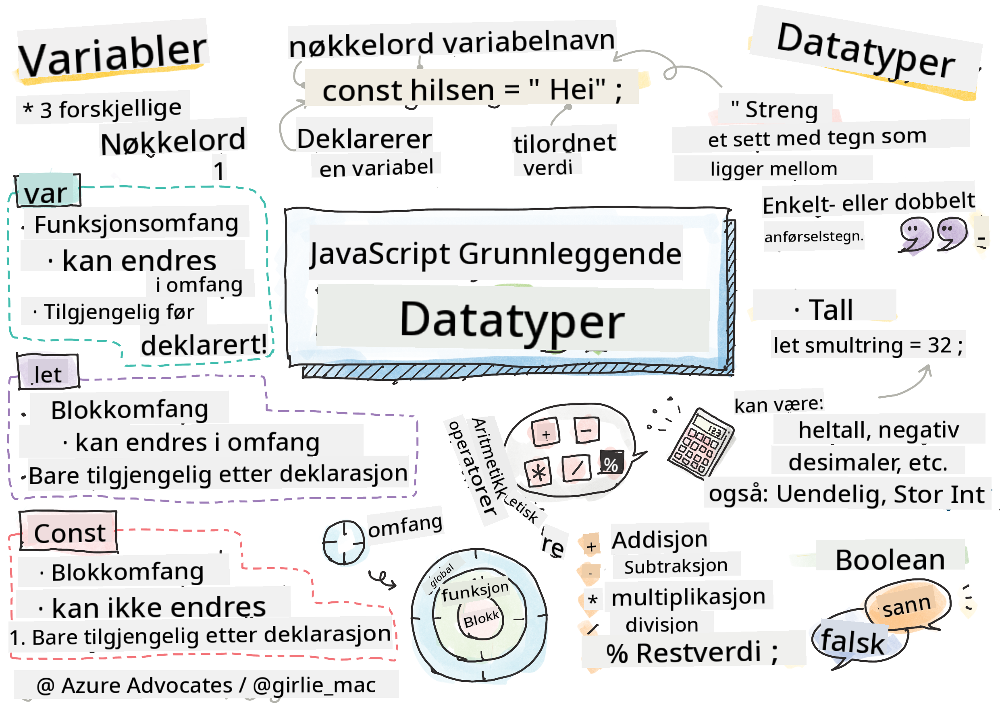
> Sketchnote av [Tomomi Imura](https://twitter.com/girlie_mac)

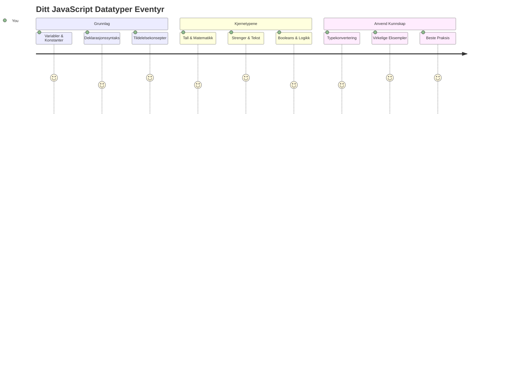
Datatyper er et av de grunnleggende konseptene i JavaScript som du vil møte i hvert program du skriver. Tenk på datatyper som arkivsystemet brukt av de gamle bibliotekarene i Alexandria – de hadde spesifikke plasser for ruller som inneholdt poesi, matematikk og historiske opptegnelser. JavaScript organiserer informasjon på lignende måte med forskjellige kategorier for ulike typer data.

I denne leksjonen skal vi utforske de kjerne datatypene som gjør at JavaScript fungerer. Du vil lære hvordan du håndterer tall, tekst, true/false verdier, og forstå hvorfor det er viktig å velge riktig datatype for programmene dine. Disse konseptene kan virke abstrakte i starten, men med praksis blir de naturlige.

Å forstå datatyper vil gjøre alt annet i JavaScript mye klarere. Akkurat som arkitekter må forstå forskjellige byggematerialer før de konstruerer en katedral, vil disse grunnprinsippene støtte alt du bygger fremover.

## Forhåndsquiz
[Forhåndsquiz](https://ff-quizzes.netlify.app/web/)

Denne leksjonen dekker det grunnleggende i JavaScript, språket som gir interaktivitet på nettet.

> Du kan ta denne leksjonen på [Microsoft Learn](https://docs.microsoft.com/learn/modules/web-development-101-variables/?WT.mc_id=academic-77807-sagibbon)!

[](https://youtube.com/watch?v=JNIXfGiDWM8 "Variabler i JavaScript")

[](https://youtube.com/watch?v=AWfA95eLdq8 "Datatyper i JavaScript")

> 🎥 Klikk på bildene over for videoer om variabler og datatyper

La oss starte med variabler og datatypene som fyller dem!

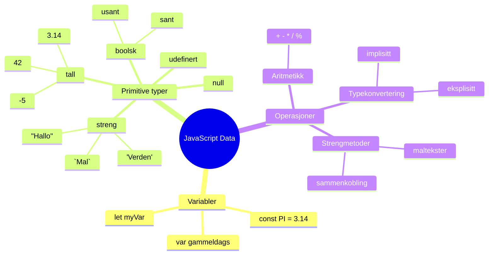
## Variabler

Variabler er grunnleggende byggeklosser i programmering. Som de merkede krukkene som middelalderens alkymister brukte til å lagre forskjellige stoffer, lar variabler deg lagre informasjon og gi den et beskrivende navn slik at du kan referere til det senere. Trenger du å huske noen sin alder? Lagre det i en variabel kalt `age`. Vil du spore en brukers navn? Ha det i en variabel kalt `userName`.

Vi vil fokusere på den moderne tilnærmingen til å lage variabler i JavaScript. Teknikker du lærer her representerer års utvikling av språket og beste praksis utviklet av programmeringsmiljøet.

Å opprette og **deklarere** en variabel har følgende syntaks **[keyword] [name]**. Den består av to deler:

- **Nøkkelord**. Bruk `let` for variabler som kan endres, eller `const` for verdier som forblir de samme.
- **Variabelnavnet**, dette er et beskrivende navn du velger selv.

✅ Nøkkelordet `let` ble introdusert i ES6 og gir variabelen din det som kalles _blokksområde_. Det anbefales at du bruker `let` eller `const` i stedet for det eldre nøkkelordet `var`. Vi vil gå mer i dybden på blokksområder i fremtidige deler.

### Oppgave - jobbe med variabler

1. **Deklarer en variabel**. La oss starte med å lage vår første variabel:

    ```javascript
    let myVariable;
    ```

   **Hva dette gjør:**
   - Dette forteller JavaScript å opprette et lagringssted kalt `myVariable`
   - JavaScript allokerer plass i minnet for denne variabelen
   - Variabelen har foreløpig ingen verdi (undefined)

2. **Gi den en verdi**. Nå setter vi noe i variabelen vår:

    ```javascript
    myVariable = 123;
    ```

   **Hvordan tildeling fungerer:**
   - Operatoren `=` tildeler verdien 123 til vår variabel
   - Variabelen inneholder nå denne verdien i stedet for å være undefined
   - Du kan referere til denne verdien gjennom koden din med `myVariable`

   > Merk: Bruken av `=` i denne leksjonen betyr at vi bruker en "tildelingsoperator", brukt til å sette en verdi til en variabel. Det betyr ikke likhet.

3. **Gjør det på den smarte måten**. Faktisk, la oss kombinere disse to stegene:

    ```javascript
    let myVariable = 123;
    ```

    **Denne tilnærmingen er mer effektiv:**
    - Du deklarerer variabelen og tildeler verdi i en og samme setning
    - Dette er standard praksis blant utviklere
    - Det reduserer kodelengde samtidig som det opprettholder klarhet

4. **Ombestem deg**. Hva om vi vil lagre et annet tall?

   ```javascript
   myVariable = 321;
   ```

   **Forstå omtildeling:**
   - Variabelen inneholder nå 321 i stedet for 123
   - Den tidligere verdien erstattes – variabler lagrer bare én verdi om gangen
   - Denne mutabiliteten er kjennetegnet til variabler deklarert med `let`

   ✅ Prøv det! Du kan skrive JavaScript rett i nettleseren din. Åpne Developer Tools i nettleseren. I konsollen vil du finne en prompt; skriv `let myVariable = 123`, trykk enter, så skriv `myVariable`. Hva skjer? Du vil lære mer om disse konseptene i kommende leksjoner.

### 🧠 **Variabler mestringssjekk: Bli komfortabel**

**La oss se hvordan du føler deg om variabler:**
- Kan du forklare forskjellen mellom å deklarere og tildele en variabel?
- Hva skjer hvis du prøver å bruke en variabel før du deklarerer den?
- Når ville du velge `let` over `const` for en variabel?

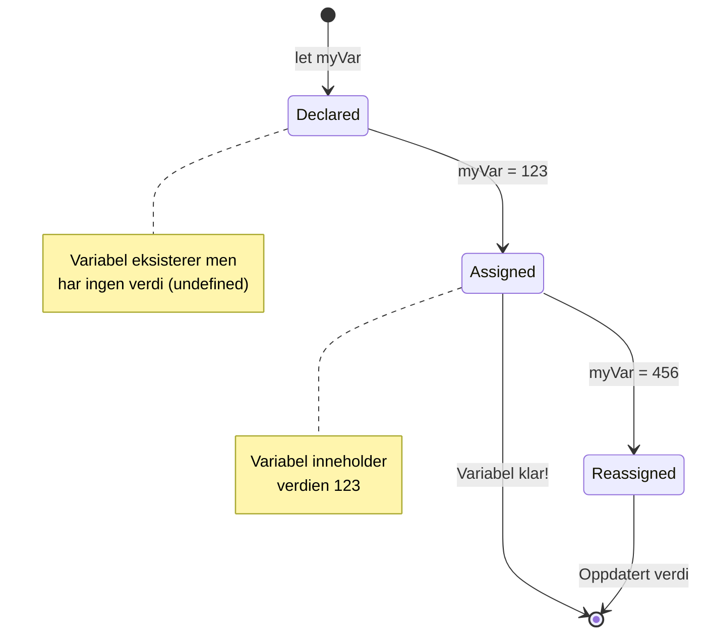
> **Raskt tips**: Tenk på variabler som merkede oppbevaringsbokser. Du lager boksen (`let`), legger noe i den (`=`), og kan senere erstatte innholdet om nødvendig!

## Konstanter

Noen ganger trenger du å lagre informasjon som aldri skal endres under programkjøringen. Tenk på konstanter som de matematiske prinsippene Euclid etablerte i det gamle Hellas – når de var bevist og dokumentert, forble de faste for all fremtid.

Konstanter fungerer likt som variabler, men med en viktig begrensning: når du har gitt dem en verdi, kan den ikke endres. Denne uforanderligheten bidrar til å forhindre utilsiktede endringer av kritiske verdier i programmet ditt.

Deklarasjon og initialisering av en konstant følger de samme prinsippene som en variabel, med unntak av nøkkelordet `const`. Konstanter deklareres vanligvis med store bokstaver.

```javascript
const MY_VARIABLE = 123;
```

**Dette gjør koden:**
- **Oppretter** en konstant kalt `MY_VARIABLE` med verdien 123
- **Bruker** navnekonvensjon med store bokstaver for konstanter
- **Forhindrer** fremtidige endringer i denne verdien

Konstanter har to hovedregler:

- **Du må gi dem en verdi med én gang** – ingen tomme konstanter tillatt!
- **Du kan aldri endre den verdien** – JavaScript vil kaste en feil hvis du prøver. La oss se hva jeg mener:

   **Enkel verdi** - Følgende er IKKE tillatt:
   
      ```javascript
      const PI = 3;
      PI = 4; // ikke tillatt
      ```

   **Hva du må huske:**
   - **Forsøk** på å tilordne konstanten på nytt vil forårsake en feil
   - **Beskytter** viktige verdier fra utilsiktede endringer
   - **Sikrer** at verdien forblir konsekvent gjennom programmet

   **Objektreferanse er beskyttet** - Følgende er IKKE tillatt:
   
      ```javascript
      const obj = { a: 3 };
      obj = { b: 5 } // ikke tillatt
      ```

   **Forstå disse konseptene:**
   - **Forhindrer** å erstatte hele objektet med et nytt
   - **Beskytter** referansen til det opprinnelige objektet
   - **Opprettholder** objektets identitet i minnet

    **Objektverdi er ikke beskyttet** - Følgende ER tillatt:
    
      ```javascript
      const obj = { a: 3 };
      obj.a = 5;  // tillatt
      ```

      **Forklaring på hva som skjer her:**
      - **Endrer** egenskapsverdien inne i objektet
      - **Beholder** samme objektreferanse
      - **Demonstrerer** at objektinnhold kan endres mens referansen forblir konstant

   > Merk at `const` betyr at referansen er beskyttet mot ny tildeling. Verdien er ikke _uforanderlig_ og kan endres, spesielt hvis det er en kompleks konstruksjon som et objekt.

## Datatyper

JavaScript organiserer informasjon i forskjellige kategorier kalt datatyper. Dette konseptet speiler hvordan gamle lærde kategoriserte kunnskap – Aristoteles skilte mellom ulike typer resonnement, vel vitende om at logiske prinsipper ikke kunne anvendes ensartet på poesi, matematikk og naturfilosofi.

Datatyper er viktige fordi ulike operasjoner fungerer med ulike typer informasjon. Akkurat som du ikke kan utføre aritmetikk på en persons navn eller alfabetisere en matematisk likning, krever JavaScript riktig datatype for hver operasjon. Å forstå dette forhindrer feil og gjør koden din mer pålitelig.

Variabler kan lagre mange forskjellige typer verdier, som tall og tekst. Disse forskjellige verditypene kalles **datatypen**. Datatyper er en viktig del av programvareutvikling fordi det hjelper utviklere å ta beslutninger om hvordan koden skal skrives og hvordan programvaren skal kjøre. Videre har noen datatyper unike egenskaper som hjelper til å transformere eller trekke ut ekstra informasjon fra en verdi.

✅ Datatyper kalles også JavaScript-dataprimitiver, ettersom de er de laveste nivåene datatyper språket tilbyr. Det finnes 7 primitive datatyper: string, number, bigint, boolean, undefined, null og symbol. Ta et øyeblikk og visualiser hva hver av disse primitivene kan representere. Hva er en `zebra`? Hva med `0`? `true`?

### Tall

Tall er den mest direkte datatypen i JavaScript. Enten du jobber med hele tall som 42, desimaler som 3.14, eller negative tall som -5, håndterer JavaScript dem ensartet.

Husker du variabelen vår fra tidligere? Den 123 vi lagret var faktisk av typen tall:

```javascript
let myVariable = 123;
```

**Viktige kjennetegn:**
- JavaScript gjenkjenner automatisk numeriske verdier
- Du kan utføre matematiske operasjoner med disse variablene
- Ingen eksplisitt typedeklarasjon er påkrevd

Variabler kan lagre alle typer tall, inkludert desimaler eller negative tall. Tall kan også brukes med aritmetiske operatorer, som vi tar for oss i [neste seksjon](../../../../2-js-basics/1-data-types).

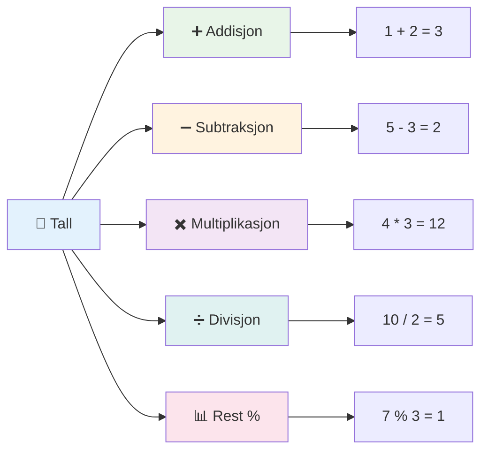
### Aritmetiske Operatorer

Aritmetiske operatorer lar deg utføre matematiske beregninger i JavaScript. Disse operatorene følger de samme prinsippene som matematikere har brukt i århundrer – de samme symbolene som dukket opp i verkene til lærde som Al-Khwarizmi, som utviklet algebraisk notasjon.

Operatorene fungerer slik du forventer fra tradisjonell matematikk: pluss for addisjon, minus for subtraksjon, og så videre.

Det finnes flere typer operatorer for aritmetiske funksjoner, noen av dem listet her:

| Symbol | Beskrivelse                                                            | Eksempel                         |
| ------ | --------------------------------------------------------------------- | ------------------------------- |
| `+`    | **Addisjon**: Kalkulerer summen av to tall                            | `1 + 2 //forventet svar er 3`   |
| `-`    | **Subtraksjon**: Kalkulerer differansen mellom to tall                | `1 - 2 //forventet svar er -1`  |
| `*`    | **Multiplikasjon**: Kalkulerer produktet av to tall                   | `1 * 2 //forventet svar er 2`   |
| `/`    | **Divisjon**: Kalkulerer kvotienten av to tall                        | `1 / 2 //forventet svar er 0.5` |
| `%`    | **Restverdi**: Kalkulerer resten fra divisjon av to tall              | `1 % 2 //forventet svar er 1`   |

✅ Prøv det! Prøv en aritmetisk operasjon i nettleserens konsoll. Overrasker resultatene deg?

### 🧮 **Mattekunnskap sjekk: Beregne med selvtillit**

**Test din forståelse av aritmetikk:**
- Hva er forskjellen mellom `/` (divisjon) og `%` (rest)?
- Kan du forutsi hva `10 % 3` er? (Hint: det er ikke 3.33...)
- Hvorfor kan restenoperatoren være nyttig i programmering?

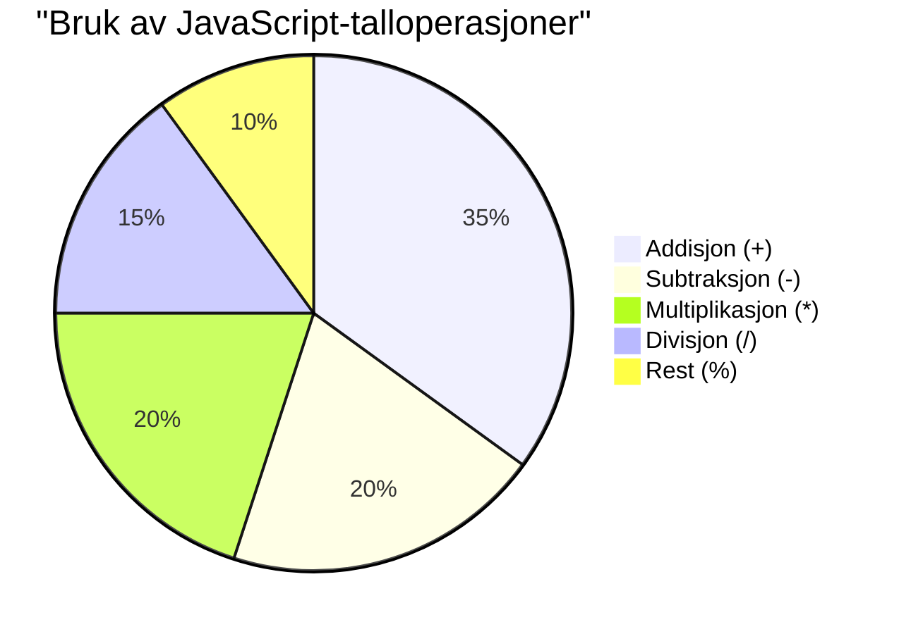
> **Innsikt fra virkeligheten**: Restoperatoren (%) er supernyttig for å sjekke om tall er partall/oddetall, lage mønstre eller sykle gjennom arrays!

### Strenger

I JavaScript representeres tekstlig data som strenger. Begrepet "streng" kommer fra konseptet med tegn som er satt sammen i sekvens, på samme måte som skrivere i middelalderklostre koblet bokstaver for å danne ord og setninger i sine manuskripter.

Strenger er grunnleggende for webutvikling. Hver tekstbit som vises på et nettsted – brukernavn, knappetiketter, feilmeldinger, innhold – håndteres som strengdata. Å forstå strenger er essensielt for å lage funksjonelle brukergrensesnitt.

Strenger er sett med tegn som er plassert mellom enkle eller doble anførselstegn.

```javascript
'This is a string'
"This is also a string"
let myString = 'This is a string value stored in a variable';
```

**Forstå disse konseptene:**
- **Bruker** enten enkle `'` eller doble `"` anførselstegn for å definere strenger
- **Lagrer** tekstdata som kan inkludere bokstaver, tall og symboler
- **Tildeler** strengverdier til variabler for senere bruk
- **Krever** anførselstegn for å skille tekst fra variabelnavn

Husk å bruke anførselstegn når du skriver en streng, ellers antar JavaScript at det er et variabelnavn.

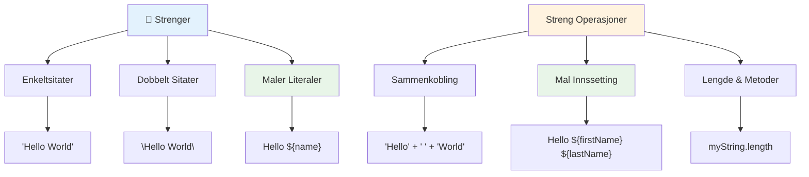
### Formatering av Strenger

Strengmanipulasjon lar deg kombinere tekst-elementer, inkorporere variabler og skape dynamisk innhold som reagerer på programtilstand. Denne teknikken gjør det mulig å bygge tekst programmessig.

Ofte må du slå sammen flere strenger – denne prosessen kalles konkatenasjon.
For å **sammenkoble** to eller flere strenger, eller koble dem sammen, bruk `+` operatoren.

```javascript
let myString1 = "Hello";
let myString2 = "World";

myString1 + myString2 + "!"; //HalloVerden!
myString1 + " " + myString2 + "!"; //Hei Verden!
myString1 + ", " + myString2 + "!"; //Hei, Verden!
```

**Steg for steg, dette skjer:**
- **Kombinerer** flere strenger ved bruk av `+` operatoren
- **Slår sammen** strenger direkte uten mellomrom i det første eksempelet
- **Legger til** mellomroms-tegn `" "` mellom strengene for lesbarhet
- **Setter inn** skilletegn som komma for å lage riktig formatering

✅ Hvorfor blir `1 + 1 = 2` i JavaScript, men `'1' + '1' = 11`? Tenk over det. Hva med `'1' + 1`?

**Malmelitteraler** er en annen måte å formatere strenger på, bortsett fra at man bruker backtick i stedet for anførselstegn. Alt som ikke er ren tekst må plasseres inn i plassholdere `${ }`. Dette inkluderer variabler som kan være strenger.

```javascript
let myString1 = "Hello";
let myString2 = "World";

`${myString1} ${myString2}!` //Hei Verden!
`${myString1}, ${myString2}!` //Hei, Verden!
```

**La oss forstå hver del:**
- **Bruker** backticks `` ` `` i stedet for vanlige anførselstegn for å lage malmelitteraler
- **Innebygger** variabler direkte ved bruk av `${}`-plassholder syntaks
- **Bevarer** mellomrom og formatering nøyaktig som skrevet
- **Gir** en renere måte å lage komplekse strenger med variabler på

Du kan oppnå formateringsmålene dine med begge metodene, men malmelitteraler respekterer eventuelle mellomrom og linjeskift.

✅ Når ville du brukt en malmelitteral i stedet for en vanlig streng?

### 🔤 **Strengmestrings-sjekk: Selvsikkerhet i Tekstmanipulasjon**

**Evaluer dine strengferdigheter:**
- Kan du forklare hvorfor `'1' + '1'` blir `'11'` i stedet for `2`?
- Hvilken strengmetode synes du er mest lesbar: sammenkobling eller malmelitteraler?
- Hva skjer hvis du glemmer anførselstegn rundt en streng?

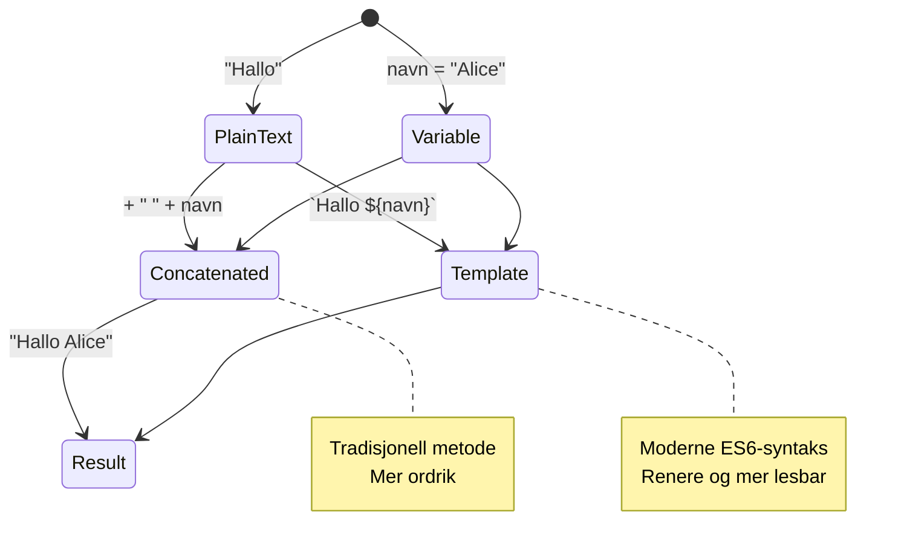
> **Proff tips**: Malmelitteraler foretrekkes vanligvis for kompleks strengbygging fordi de er mer lesbare og håndterer flerslinje-strenger på en flott måte!

### Booleans

Booleans representerer den enkleste formen for data: de kan bare ha en av to verdier – `true` eller `false`. Dette binære logikksystemet stammer fra arbeidet til George Boole, en matematiker fra 1800-tallet som utviklet boolsk algebra.

Til tross for sin enkelhet er booleans essensielle for programlogikk. De gjør det mulig for koden din å ta beslutninger basert på betingelser – om en bruker er logget inn, om en knapp ble klikket, eller om visse kriterier er oppfylt.

Booleans kan kun ha to verdier: `true` eller `false`. Booleans hjelper med å bestemme hvilke kodeblokker som skal kjøres når visse betingelser er oppfylt. I mange tilfeller hjelper [operatorer](../../../../2-js-basics/1-data-types) med å sette verdien til en Boolean, og du vil ofte se og skrive variabler som initieres eller får oppdatert verdi med en operator.

```javascript
let myTrueBool = true;
let myFalseBool = false;
```

**I eksempelet over har vi:**
- **Opprettet** en variabel som lagrer Boolean-verdien `true`
- **Vist** hvordan man lagrer Boolean-verdien `false`
- **Brukt** nøkkelordene `true` og `false` nøyaktig (ingen anførselstegn nødvendig)
- **Forberedt** disse variablene for bruk i betingede utsagn

✅ En variabel kan anses som 'truthy' hvis den evalueres til en boolean `true`. Interessant nok er [alle verdier sannhetsverdier med mindre definert som falsy](https://developer.mozilla.org/docs/Glossary/Truthy) i JavaScript.

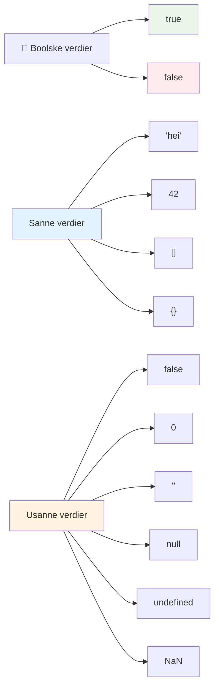
### 🎯 **Boolean Logikk Sjekk: Ferdigheter i Beslutningstaking**

**Test din forståelse av boolean:**
- Hvorfor tror du JavaScript har "truthy" og "falsy" verdier utover bare `true` og `false`?
- Kan du forutsi hvilken av disse som er falsy: `0`, `"0"`, `[]`, `"false"`?
- Hvordan kan booleans være nyttige ved styring av programflyt?

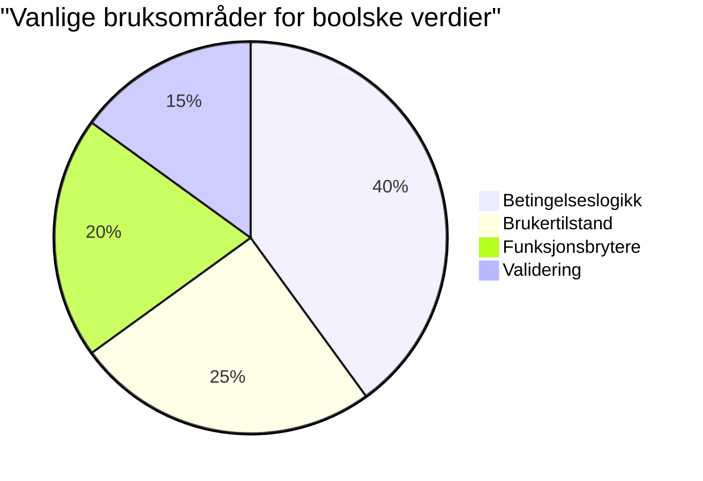
> **Husk**: I JavaScript er det bare 6 verdier som er falsy: `false`, `0`, `""`, `null`, `undefined`, og `NaN`. Alt annet er truthy!

---

## 📊 **Oppsummering av verktøykassen for datatyper**

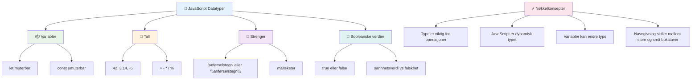
## GitHub Copilot Agent Challenge 🚀

Bruk Agent-modus for å fullføre følgende utfordring:

**Beskrivelse:** Lag en personlig informasjonsbehandler som demonstrerer alle JavaScript-datatypene du har lært i denne leksjonen, samtidig som den håndterer virkelige datasituasjoner.

**Oppgave:** Bygg et JavaScript-program som lager et brukerprofil-objekt som inneholder: en persons navn (streng), alder (nummer), status som student (boolean), favorittfarger som en array, og et adresse-objekt med gate, by og postnummer-egenskaper. Inkluder funksjoner for å vise profilinformasjonen og oppdatere individuelle felt. Sørg for å demonstrere strengsammenkobling, malmelitteraler, aritmetiske operasjoner med alder, og boolsk logikk for studentstatus.

Les mer om [agent mode](https://code.visualstudio.com/blogs/2025/02/24/introducing-copilot-agent-mode) her.

## 🚀 Utfordring

JavaScript har noen oppførsler som kan overraske utviklere. Her er et klassisk eksempel å utforske: prøv å skrive dette i nettleserkonsollen din: `let age = 1; let Age = 2; age == Age` og se resultatet. Det returnerer `false` – kan du finne ut hvorfor?

Dette er en av flere JavaScript-atferder det er verdt å forstå. Kjennskap til disse særegenhetene vil hjelpe deg å skrive mer pålitelig kode og feilsøke problemer mer effektivt.

## Post-forelesningsquiz
[Post-forelesningsquiz](https://ff-quizzes.netlify.app)

## Gjennomgang og Selvstudium

Ta en titt på [denne listen med JavaScript-øvelser](https://css-tricks.com/snippets/javascript/) og prøv en. Hva lærte du?

## Oppgave

[Datatyper Øvelse](assignment.md)

## 🚀 Din JavaScript Datatype-Mestrings Tidslinje

### ⚡ **Hva Du Kan Gjøre Innen 5 Minutter**
- [ ] Åpne nettleserkonsollen din og lag 3 variabler med forskjellige datatyper
- [ ] Prøv utfordringen: `let age = 1; let Age = 2; age == Age` og finn ut hvorfor det er false
- [ ] Øv på strengsammenkobling med navnet ditt og favorittnummeret ditt
- [ ] Test hva som skjer når du legger et tall til en streng

### 🎯 **Hva Du Kan Få Til Denne Timen**
- [ ] Fullfør post-leksjonsquiz og gå gjennom eventuelle forvirrende konsepter
- [ ] Lag en mini kalkulator som legger til, trekker fra, multipliserer og dividerer to tall
- [ ] Lag en enkel navneformatterer ved bruk av malmelitteraler
- [ ] Utforsk forskjellene mellom `==` og `===` sammenligningsoperatorer
- [ ] Øv på å konvertere mellom forskjellige datatyper

### 📅 **Din JavaScript-uke**
- [ ] Fullfør oppgaven med selvtillit og kreativitet
- [ ] Lag en personlig profil-objekt med alle lærte datatyper
- [ ] Øv med [JavaScript-øvelser fra CSS-Tricks](https://css-tricks.com/snippets/javascript/)
- [ ] Bygg en enkel skjema-validator med boolsk logikk
- [ ] Eksperimenter med array- og objekt-datatyper (forhåndsvisning av kommende leksjoner)
- [ ] Bli med i et JavaScript-fellesskap og stille spørsmål om datatyper

### 🌟 **Din Månedslange Transformasjon**
- [ ] Integrer kunnskap om datatyper i større programmeringsprosjekter
- [ ] Forstå når og hvorfor man skal bruke hver datatype i virkelige applikasjoner
- [ ] Hjelp andre nybegynnere å forstå JavaScripts grunnprinsipper
- [ ] Bygg en liten applikasjon som håndterer forskjellige typer brukerdata
- [ ] Utforsk avanserte datatypeteknikker som typekoersjon og streng likhet
- [ ] Bidra til open source JavaScript-prosjekter med dokumentasjonsforbedringer

### 🧠 **Siste Datatype Mestrings-Sjekk**

**Feire din JavaScript-grunnmur:**
- Hvilken datatype overrasket deg mest med sin oppførsel?
- Hvor komfortabel føler du deg med å forklare variabler vs. konstanter til en venn?
- Hva er den mest interessante tingen du oppdaget om JavaScripts typesystem?
- Hvilken virkelighetsapplikasjon kan du forestille deg å bygge med disse grunnleggende konseptene?

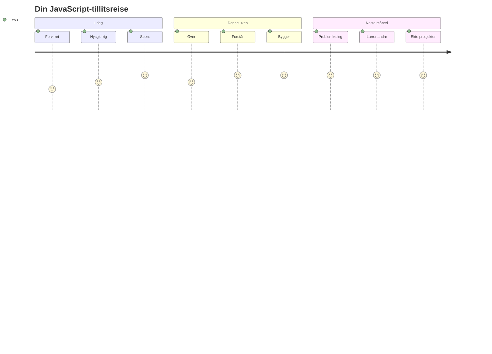
> 💡 **Du har bygd fundamentet!** Å forstå datatyper er som å lære alfabetet før du skriver historier. Hvert JavaScript-program du noen gang skriver vil bruke disse grunnleggende konseptene. Du har nå byggeklossene til å lage interaktive nettsider, dynamiske applikasjoner, og løse virkelige problemer med kode. Velkommen til den fantastiske verden av JavaScript! 🎉

---

<!-- CO-OP TRANSLATOR DISCLAIMER START -->
**Ansvarsfraskrivelse**:
Dette dokumentet er oversatt ved bruk av AI-oversettelsestjenesten [Co-op Translator](https://github.com/Azure/co-op-translator). Selv om vi streber etter nøyaktighet, vennligst vær oppmerksom på at automatiske oversettelser kan inneholde feil eller unøyaktigheter. Det opprinnelige dokumentet på dets morsmål skal anses som den autoritative kilden. For kritisk informasjon anbefales profesjonell menneskelig oversettelse. Vi er ikke ansvarlige for eventuelle misforståelser eller feiltolkninger som oppstår ved bruk av denne oversettelsen.
<!-- CO-OP TRANSLATOR DISCLAIMER END -->