# JavaScript Grunnleggende: Metoder og Funksjoner

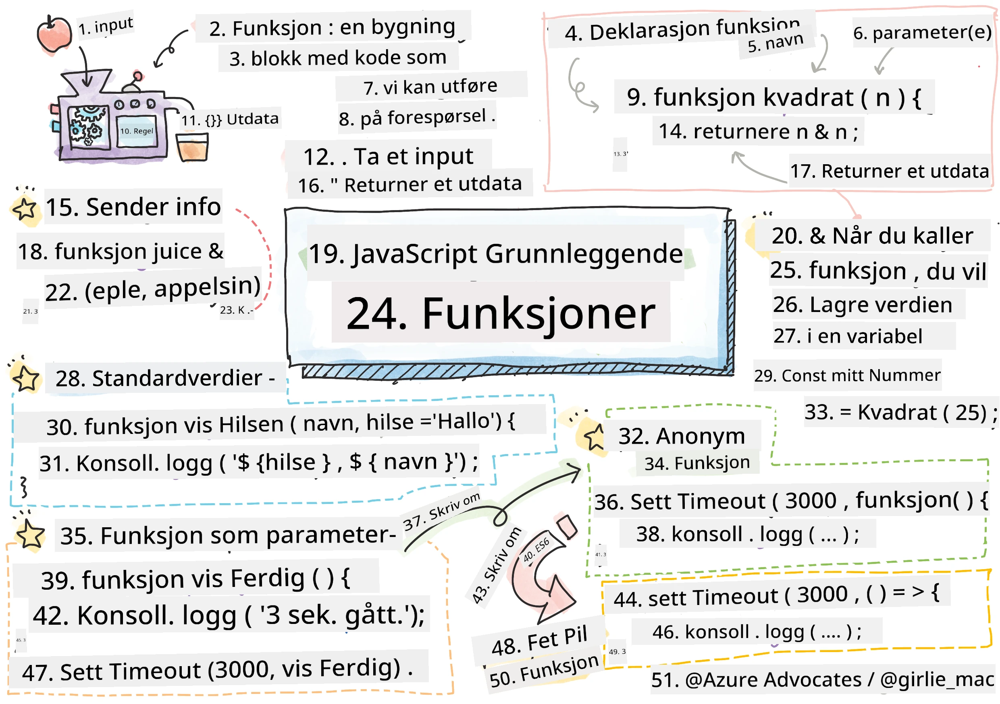
> Sketchnote av [Tomomi Imura](https://twitter.com/girlie_mac)

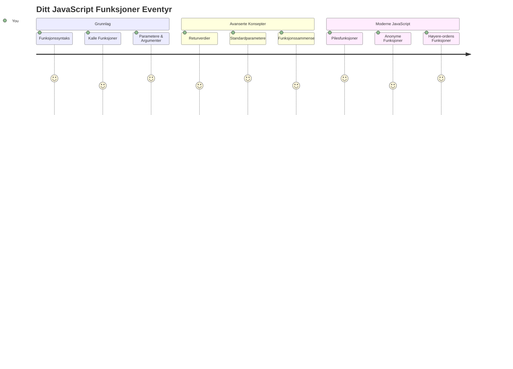
## Pre-forelesningsquiz
[Pre-lecture quiz](https://ff-quizzes.netlify.app)

Å skrive den samme koden gjentatte ganger er en av programmeringens vanligste frustrasjoner. Funksjoner løser dette problemet ved å la deg pakke kode inn i gjenbrukbare blokker. Tenk på funksjoner som de standardiserte delene som gjorde Henry Fords samlebånd revolusjonerende – når du oppretter en pålitelig komponent, kan du bruke den hvor som helst uten å bygge den opp fra bunnen av igjen.

Funksjoner lar deg samle kodebiter slik at du kan bruke dem på nytt gjennom hele programmet ditt. I stedet for å kopiere og lime inn samme logikk overalt, kan du lage en funksjon én gang og kalle den når du trenger det. Denne tilnærmingen holder koden din organisert og gjør oppdateringer mye enklere.

I denne leksjonen vil du lære hvordan du lager dine egne funksjoner, sender informasjon til dem og får nyttige resultater tilbake. Du vil oppdage forskjellen mellom funksjoner og metoder, lære moderne syntaksmetoder, og se hvordan funksjoner kan jobbe sammen med andre funksjoner. Vi bygger opp disse konseptene steg for steg.

[](https://youtube.com/watch?v=XgKsD6Zwvlc "Methods and Functions")

> 🎥 Klikk på bildet over for en video om metoder og funksjoner.

> Du kan ta denne leksjonen på [Microsoft Learn](https://docs.microsoft.com/learn/modules/web-development-101-functions/?WT.mc_id=academic-77807-sagibbon)!

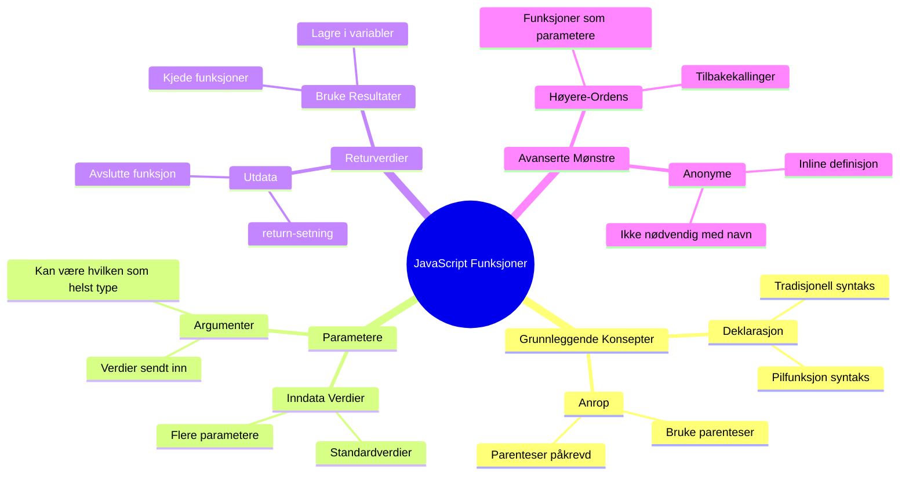
## Funksjoner

En funksjon er en selvstendig blokk med kode som utfører en spesifikk oppgave. Den kapsler inn logikk som du kan kjøre når som helst.

I stedet for å skrive den samme koden flere ganger gjennom programmet ditt, kan du pakke den inn i en funksjon og kalle funksjonen når du trenger det. Denne tilnærmingen holder koden din ryddig og gjør oppdateringer mye enklere. Tenk på vedlikeholdsutfordringen hvis du måtte endre logikk som var spredt over 20 forskjellige steder i kodebasen din.

Å gi funksjonene dine beskrivende navn er essensielt. En godt navngitt funksjon formidler klart hva den gjør – når du ser `cancelTimer()`, forstår du umiddelbart hva den gjør, akkurat som en tydelig merket knapp forteller deg nøyaktig hva som skjer når du klikker på den. 

## Lage og kalle en funksjon

La oss se på hvordan man lager en funksjon. Syntaksen følger et konsekvent mønster:

```javascript
function nameOfFunction() { // funksjonsdefinisjon
 // funksjonsdefinisjon/-kropp
}
```

La oss bryte dette ned:
- Nøkkelordet `function` sier til JavaScript "Hei, jeg lager en funksjon!"
- `nameOfFunction` er hvor du gir funksjonen et beskrivende navn
- Parentesene `()` er hvor du kan legge til parametere (det kommer vi til snart)
- Krøllparentesene `{}` inneholder selve koden som kjører når du kaller funksjonen

La oss lage en enkel hilsningsfunksjon for å se dette i praksis:

```javascript
function displayGreeting() {
  console.log('Hello, world!');
}
```

Denne funksjonen skriver ut "Hello, world!" til konsollen. Når du har definert den, kan du bruke den så mange ganger du trenger.

For å kjøre (eller "kalle") funksjonen skriver du navnet etterfulgt av parenteser. JavaScript lar deg definere funksjonen før eller etter du kaller den – JavaScript-motoren tar seg av kjørselsrekkefølgen.

```javascript
// kaller vår funksjon
displayGreeting();
```

Når du kjører denne linjen, utfører den all koden inne i `displayGreeting`-funksjonen, og viser "Hello, world!" i nettleserens konsoll. Du kan kalle denne funksjonen gjentatte ganger.

### 🧠 **Grunnleggende funksjonskontroll: Lage dine første funksjoner**

**La oss se hvordan du forstår grunnleggende funksjoner:**
- Kan du forklare hvorfor vi bruker krøllparenteser `{}` i funksjonsdefinisjoner?
- Hva skjer hvis du skriver `displayGreeting` uten parentesene?
- Hvorfor kan det være lurt å kalle samme funksjon flere ganger?

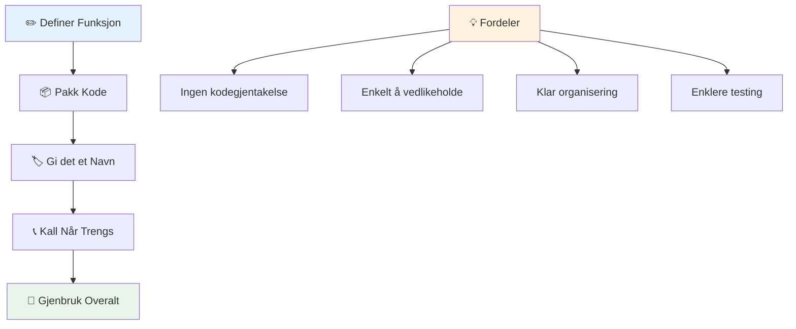
> **Merk:** Du har brukt **metoder** gjennom disse leksjonene. `console.log()` er en metode – i praksis en funksjon som tilhører `console`-objektet. Hovedforskjellen er at metoder er knyttet til objekter, mens funksjoner står fritt. Mange utviklere bruker disse begrepene om hverandre i uformelle samtaler.

### Beste praksis for funksjoner

Her er noen tips som hjelper deg å skrive gode funksjoner:

- Gi funksjonene dine klare, beskrivende navn – ditt fremtidige jeg vil takke deg!
- Bruk **camelCase** for flersordsnavn (som `calculateTotal` i stedet for `calculate_total`)
- Hold hver funksjon fokusert på å gjøre én ting godt

## Å sende informasjon til en funksjon

Vår `displayGreeting`-funksjon er begrenset – den kan bare vise "Hello, world!" til alle. Parametere lar oss gjøre funksjoner mer fleksible og nyttige.

**Parametere** fungerer som plassholdere hvor du kan sette inn forskjellige verdier hver gang du bruker funksjonen. På denne måten kan den samme funksjonen jobbe med forskjellig informasjon ved hver kall.

Du lister opp parametere inni parentesene når du definerer funksjonen, og skiller flere parametere med komma:

```javascript
function name(param, param2, param3) {

}
```

Hver parameter fungerer som en plassholder – når noen kaller funksjonen, gir de faktiske verdier som settes inn på disse plassene.

La oss oppdatere hilsningsfunksjonen til å ta imot navnet til en person:

```javascript
function displayGreeting(name) {
  const message = `Hello, ${name}!`;
  console.log(message);
}
```

Legg merke til hvordan vi bruker backticks (`` ` ``) og `${}` for å sette inn navnet direkte i meldingen – dette kalles en mal-literal, og er en veldig praktisk måte å bygge strenger med variabler i.

Nå kan vi sende inn hvilket som helst navn når vi kaller funksjonen:

```javascript
displayGreeting('Christopher');
// viser "Hallo, Christopher!" når den kjøres
```

JavaScript tar strengen `'Christopher'`, tilordner den til `name`-parameteren, og lager den personlige meldingen "Hello, Christopher!"

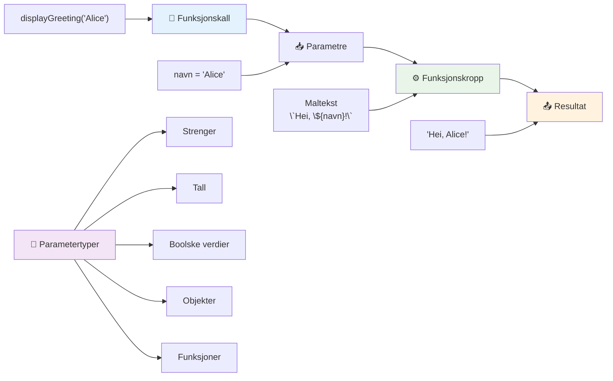
## Standardverdier

Hva hvis vi vil gjøre noen parametere valgfrie? Det er her standardverdier kommer til nytte!

La oss si at vi vil at folk skal kunne tilpasse hilsningsordet, men hvis de ikke oppgir ett, bruker vi bare "Hello" som reserve. Du kan sette opp standardverdier ved å bruke likhetstegn, akkurat som når du setter en variabel:

```javascript
function displayGreeting(name, salutation='Hello') {
  console.log(`${salutation}, ${name}`);
}
```

Her er `name` fortsatt påkrevd, men `salutation` har en reserveverdi `'Hello'` hvis ingen gir en annen hilsen.

Nå kan vi kalle denne funksjonen på to forskjellige måter:

```javascript
displayGreeting('Christopher');
// viser "Hei, Christopher"

displayGreeting('Christopher', 'Hi');
// viser "Hei, Christopher"
```

I det første kallet bruker JavaScript standard "Hello" siden vi ikke spesifiserte en hilsen. I det andre kallet bruker den vår egen "Hi". Denne fleksibiliteten gjør funksjonene tilpasningsdyktige i ulike situasjoner.

### 🎛️ **Parametermesterskap: Gjøre funksjoner fleksible**

**Test kunnskapen din om parametere:**
- Hva er forskjellen mellom en parameter og et argument?
- Hvorfor er standardverdier nyttige i ekte programmering?
- Kan du forutsi hva som skjer hvis du sender flere argumenter enn parametere?

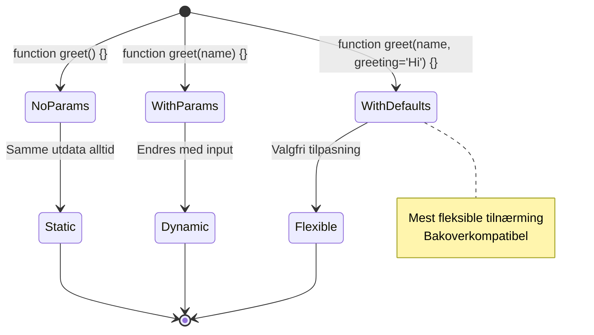
> **Profftips**: Standardparametere gjør funksjonene dine mer brukervennlige. Brukere kan komme raskt i gang med fornuftige standarder, men tilpasse ved behov!

## Returnere verdier

Så langt har funksjonene våre bare skrevet ut meldinger til konsollen, men hva om du vil at en funksjon skal regne ut noe og gi deg resultatet tilbake?

Der kommer **returverdier** inn i bildet. I stedet for bare å vise noe, kan en funksjon gi deg tilbake en verdi som du kan lagre i en variabel eller bruke andre steder i koden.

For å sende en verdi tilbake, bruker du `return`-nøkkelordet etterfulgt av det du vil returnere:

```javascript
return myVariable;
```

Noe viktig: Når en funksjon treffer en `return`-setning, slutter den umiddelbart å kjøre og sender denne verdien tilbake til den som kalte funksjonen.

La oss endre hilsningsfunksjonen til å returnere meldingen i stedet for å skrive den ut:

```javascript
function createGreetingMessage(name) {
  const message = `Hello, ${name}`;
  return message;
}
```

Nå lager denne funksjonen meldingen og gir den tilbake til oss i stedet for å skrive den ut.

For å bruke den returnerte verdien kan vi lagre den i en variabel, akkurat som med andre verdier:

```javascript
const greetingMessage = createGreetingMessage('Christopher');
```

Nå inneholder `greetingMessage` "Hello, Christopher" og vi kan bruke den hvor som helst i koden – vise den på en nettside, inkludere den i en epost, eller sende den til en annen funksjon.

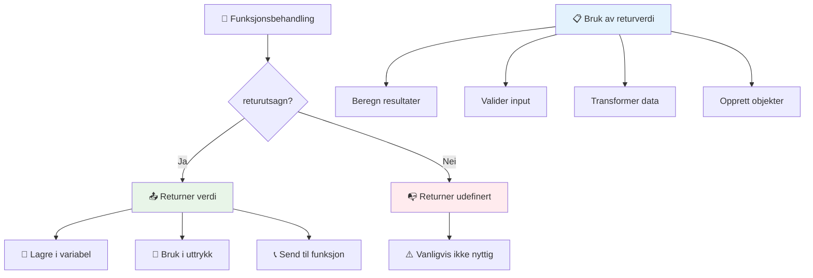
### 🔄 **Returverdier - sjekk: Få resultater tilbake**

**Vurder kunnskapen din om returverdier:**
- Hva skjer med kode som kommer etter en `return`-setning i en funksjon?
- Hvorfor er det ofte bedre å returnere verdier enn bare å skrive ut i konsollen?
- Kan en funksjon returnere ulike typer verdier (streng, tall, boolsk)?

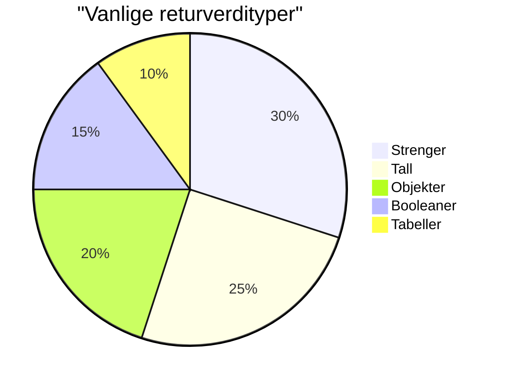
> **Viktig innsikt**: Funksjoner som returnerer verdier er mer allsidige fordi den som kaller funksjonen bestemmer hva som skal gjøres med resultatet. Dette gjør koden mer modulær og gjenbrukbar!

## Funksjoner som parametere til funksjoner

Funksjoner kan sendes som parametere til andre funksjoner. Selv om dette kan virke komplekst i starten, er det en kraftfull egenskap som muliggjør fleksible programmeringsmønstre.

Dette mønsteret er veldig vanlig når du vil si "når noe skjer, gjør dette andre". For eksempel, "når timeren er ferdig, kjør denne koden" eller "når brukeren klikker på knappen, kall denne funksjonen."

La oss se på `setTimeout`, som er en innebygd funksjon som venter en viss tid og så kjører noe kode. Vi må fortelle den hvilken kode den skal kjøre – perfekt bruk av å sende inn en funksjon!

Prøv denne koden – etter 3 sekunder ser du en melding:

```javascript
function displayDone() {
  console.log('3 seconds has elapsed');
}
// tidsverdi er i millisekunder
setTimeout(displayDone, 3000);
```

Legg merke til at vi sender `displayDone` (uten parenteser) til `setTimeout`. Vi kaller ikke funksjonen selv – vi gir den til `setTimeout` og sier "kall denne om 3 sekunder."

### Anonyme funksjoner

Noen ganger trenger du en funksjon til bare én ting og vil ikke gi den noe navn. Tenk på det – hvis du bare bruker en funksjon én gang, hvorfor kaste bort koden med et ekstra navn?

JavaScript lar deg lage **anonyme funksjoner** – funksjoner uten navn som du kan definere rett der du trenger dem.

Slik kan vi skrive om timer-eksemplet vårt med en anonym funksjon:

```javascript
setTimeout(function() {
  console.log('3 seconds has elapsed');
}, 3000);
```

Dette oppnår samme resultat, men funksjonen defineres direkte inni `setTimeout`-kallet, og vi slipper en egen funksjonsdefinisjon.

### Piler (Arrow) funksjoner

Moderne JavaScript har en enda kortere måte å skrive funksjoner på kalt **arrow functions**. De bruker `=>` (som ser ut som en pil – skjønner du?) og er veldig populære blant utviklere.

Arrow-funksjoner lar deg droppe `function`-nøkkelordet og skrive mer kompakt kode.

Her er timer-eksemplet vårt med en arrow-funksjon:

```javascript
setTimeout(() => {
  console.log('3 seconds has elapsed');
}, 3000);
```

`()` er hvor parametere ville stått (tomt her), så kommer pilen `=>`, og til slutt funksjonskroppen i krøllparenteser. Dette gir samme funksjonalitet med mer konsis syntaks.

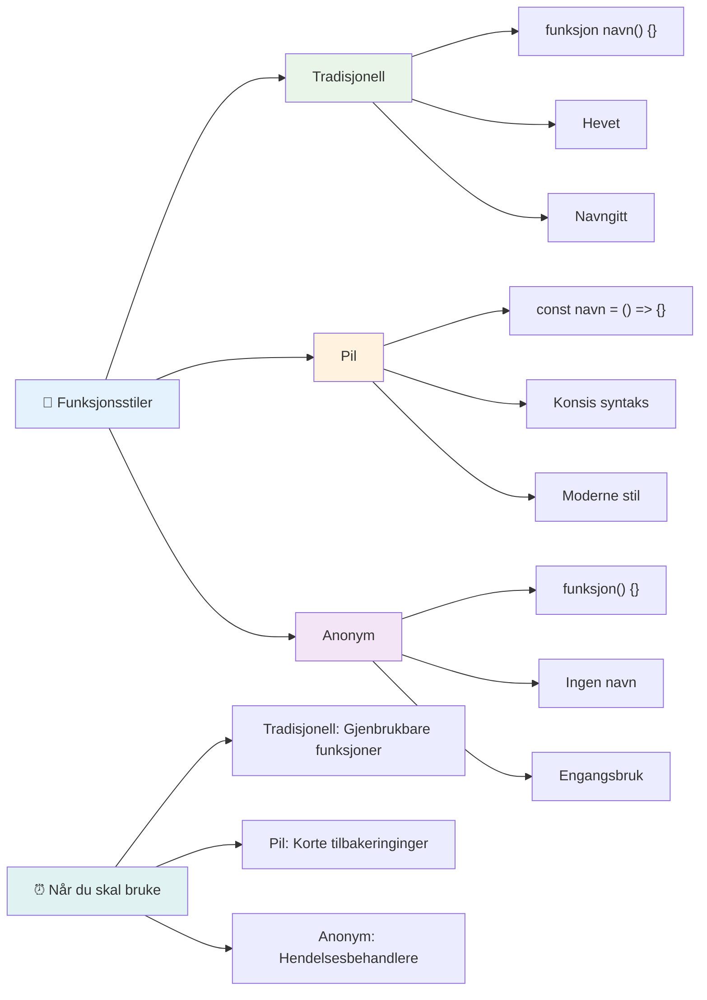
### Når bruke hvilken strategi

Når bør du bruke hver tilnærming? En praktisk regel: hvis du skal bruke funksjonen flere ganger, gi den et navn og definer den separat. Hvis det er for et helt spesifikt formål, vurder en anonym funksjon. Både arrow-funksjoner og tradisjonell syntaks er gyldige valg, men arrow-funksjoner er utbredt i moderne JavaScript-kodebaser.

### 🎨 **Funksjonsstiler - mestrings-sjekk: Velge riktig syntaks**

**Test forståelsen din av syntaks:**
- Når kan det være bedre å bruke arrow-funksjoner enn tradisjonell funksjonssyntaks?
- Hva er hovedfordelen med anonyme funksjoner?
- Kan du tenke deg en situasjon hvor en navngitt funksjon er bedre enn en anonym?

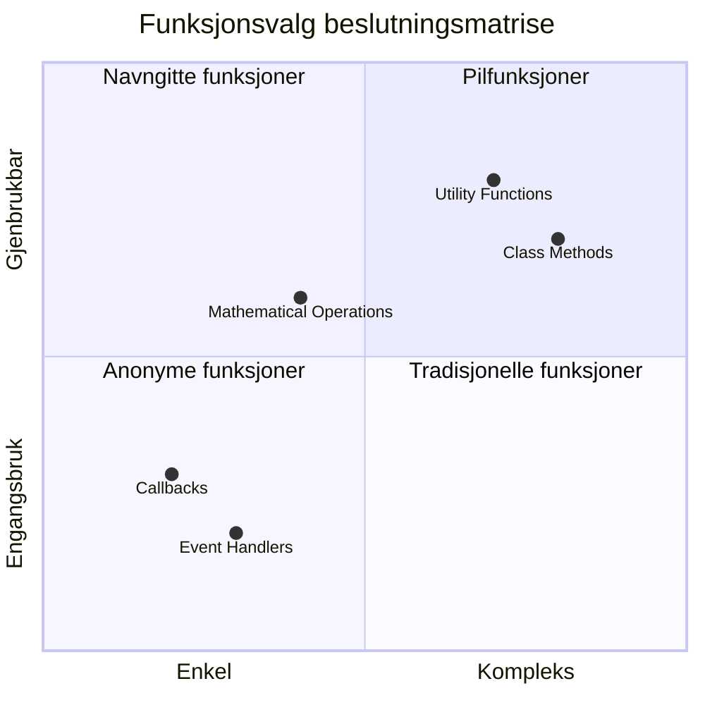
> **Moderne trend**: Arrow-funksjoner blir standardvalget for mange utviklere på grunn av deres kompakte syntaks, men tradisjonelle funksjoner har fortsatt sin plass!

---


## 🚀 Utfordring

Kan du formulere i én setning forskjellen mellom funksjoner og metoder? Prøv deg!

## GitHub Copilot Agent-utfordring 🚀

Bruk Agent-modus for å løse følgende utfordring:

**Beskrivelse:** Lag et verktøybibliotek med matematiske funksjoner som demonstrerer ulike funksjonskonsepter dekket i denne leksjonen, inkludert parametere, standardverdier, returverdier og arrow-funksjoner.

**Prompt:** Lag en JavaScript-fil kalt `mathUtils.js` som inneholder følgende funksjoner:
1. En funksjon `add` som tar to parametere og returnerer summen deres
2. En funksjon `multiply` med standardparameterverdier (andre parameter standard til 1)
3. En arrow-funksjon `square` som tar et tall og returnerer kvadratet av det
4. En funksjon `calculate` som aksepterer en annen funksjon som parameter og to tall, og så bruker funksjonen på disse tallene
5. Demonstrer å kalle hver funksjon med passende testtilfeller

Lær mer om [agent-modus](https://code.visualstudio.com/blogs/2025/02/24/introducing-copilot-agent-mode) her.

## Post-forelesningsquiz
[Post-lecture quiz](https://ff-quizzes.netlify.app)

## Gjennomgang og Selvstudium

Det er verdt å [lese litt mer om arrow-funksjoner](https://developer.mozilla.org/docs/Web/JavaScript/Reference/Functions/Arrow_functions), da de brukes mer og mer i kodebaser. Øv på å skrive en funksjon, og deretter omskrive den med denne syntaksen.

## Oppgave

[Fun with Functions](assignment.md)

---

## 🧰 **Ditt JavaScript Funksjonsverktøykitt Sammendrag**

```mermaid
graph TD
    A["🎯 JavaScript-funksjoner"] --> B["📋 Funksjonsdeklarasjon"]
    A --> C["📥 Parametere"]
    A --> D["📤 Returverdier"]
    A --> E["🎨 Moderne syntaks"]
    
    B --> B1["function name() {}"]
    B --> B2["Beskrivende navn"]
    B --> B3["Gjenbrukbare kodeblokker"]
    
    C --> C1["Inndata"]
    C --> C2["Standardverdier"]
    C --> C3["Flere parametere"]
    
    D --> D1["return-setning"]
    D --> D2["Forlat funksjon"]
    D --> D3["Send data tilbake"]
    
    E --> E1["Pilfunksjoner: () =>"]
    E --> E2["Anonyme funksjoner"]
    E --> E3["Høyereordensfunksjoner"]
    
    F["⚡ Nøkkelfordeler"] --> F1["Kodegjenbruk"]
    F --> F2["Bedre organisering"]
    F --> F3["Enklere testing"]
    F --> F4["Modulær design"]
    
    style A fill:#e3f2fd
    style B fill:#e8f5e8
    style C fill:#fff3e0
    style D fill:#f3e5f5
    style E fill:#e0f2f1
    style F fill:#fce4ec
```
---

## 🚀 Din JavaScript Funksjonsmestring Tidslinje

### ⚡ **Hva du kan gjøre i løpet av de neste 5 minuttene**
- [ ] Skriv en enkel funksjon som returnerer ditt favorittnummer
- [ ] Lag en funksjon med to parametere som legger dem sammen

- [ ] Prøv å konvertere en tradisjonell funksjon til pilfunksjon-syntaks
- [ ] Øv på utfordringen: forklar forskjellen mellom funksjoner og metoder

### 🎯 **Hva du kan oppnå denne timen**
- [ ] Fullfør quiz etter leksjonen og gå gjennom eventuelle forvirrende konsepter
- [ ] Bygg matematikkverktøybiblioteket fra GitHub Copilot-utfordringen
- [ ] Lag en funksjon som bruker en annen funksjon som parameter
- [ ] Øv på å skrive funksjoner med standardparametere
- [ ] Eksperimenter med template literals i funksjonsreturverdier

### 📅 **Din uke-lange funksjonsmestring**
- [ ] Fullfør oppgaven "Moro med funksjoner" med kreativitet
- [ ] Refaktorer noe repeterende kode du har skrevet til gjenbrukbare funksjoner
- [ ] Bygg en liten kalkulator ved bare å bruke funksjoner (ingen globale variabler)
- [ ] Øv på pilfunksjoner med array-metoder som `map()` og `filter()`
- [ ] Lag en samling med hjelpefunksjoner for vanlige oppgaver
- [ ] Studer høyereordensfunksjoner og funksjonell programmeringskonsepter

### 🌟 **Din måned-lange transformasjon**
- [ ] Mestre avanserte funksjonskonsepter som closures og scope
- [ ] Bygg et prosjekt som i stor grad bruker funksjonskomposisjon
- [ ] Bidra til open source ved å forbedre funksjonsdokumentasjon
- [ ] Lær bort til noen andre om funksjoner og ulike syntaksstiler
- [ ] Utforsk funksjonell programmering i JavaScript
- [ ] Lag et personlig bibliotek av gjenbrukbare funksjoner for fremtidige prosjekter

### 🏆 **Sluttkontroll for funksjonsmester**

**Feir funksjonsmestringen din:**
- Hva er den mest nyttige funksjonen du har laget så langt?
- Hvordan har det å lære om funksjoner endret måten du tenker på kodeorganisering?
- Hvilken funksjonssyntaks foretrekker du og hvorfor?
- Hvilket reelt problem ville du løst ved å skrive en funksjon?

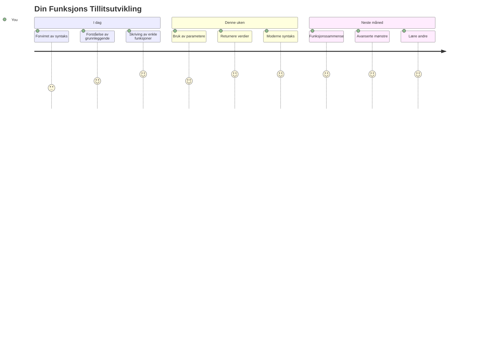
> 🎉 **Du har mestret et av programmeringens kraftigste konsepter!** Funksjoner er byggesteinene i større programmer. Enhver applikasjon du noensinne bygger vil bruke funksjoner for å organisere, gjenbruke og strukturere kode. Du forstår nå hvordan du pakker logikk inn i gjenbrukbare komponenter, noe som gjør deg til en mer effektiv og dyktig programmerer. Velkommen til verden av modulær programmering! 🚀

---

<!-- CO-OP TRANSLATOR DISCLAIMER START -->
**Ansvarsfraskrivelse**:
Dette dokumentet er oversatt ved hjelp av AI-oversettelsestjenesten [Co-op Translator](https://github.com/Azure/co-op-translator). Selv om vi streber etter nøyaktighet, vennligst vær oppmerksom på at automatiske oversettelser kan inneholde feil eller unøyaktigheter. Det originale dokumentet på originalspråket skal anses som den autoritative kilden. For kritisk informasjon anbefales profesjonell menneskelig oversettelse. Vi er ikke ansvarlige for misforståelser eller feiltolkninger som oppstår ved bruk av denne oversettelsen.
<!-- CO-OP TRANSLATOR DISCLAIMER END -->