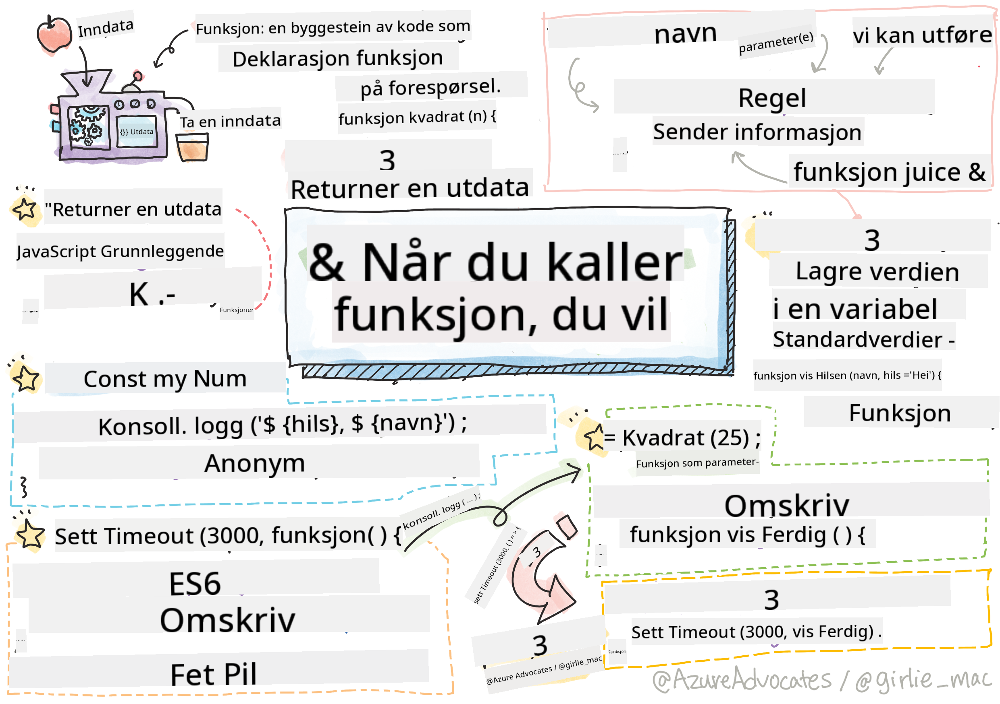

<!--
CO_OP_TRANSLATOR_METADATA:
{
  "original_hash": "ec43b53e8e015cdabfd3ad877b3c28e5",
  "translation_date": "2025-10-23T22:16:28+00:00",
  "source_file": "2-js-basics/2-functions-methods/README.md",
  "language_code": "no"
}
-->
# Grunnleggende JavaScript: Metoder og Funksjoner


> Sketchnote av [Tomomi Imura](https://twitter.com/girlie_mac)

## Quiz før forelesning
[Quiz før forelesning](https://ff-quizzes.netlify.app)

Å skrive den samme koden gjentatte ganger er en av de mest frustrerende aspektene ved programmering. Funksjoner løser dette problemet ved å la deg pakke kode inn i gjenbrukbare blokker. Tenk på funksjoner som de standardiserte delene som gjorde Henry Fords samlebånd revolusjonerende – når du har laget en pålitelig komponent, kan du bruke den hvor som helst uten å bygge den opp fra bunnen av.

Funksjoner lar deg samle deler av koden slik at du kan gjenbruke dem gjennom hele programmet. I stedet for å kopiere og lime inn den samme logikken overalt, kan du lage en funksjon én gang og kalle den når det trengs. Denne tilnærmingen holder koden din organisert og gjør oppdateringer mye enklere.

I denne leksjonen vil du lære hvordan du lager dine egne funksjoner, sender informasjon til dem, og får nyttige resultater tilbake. Du vil oppdage forskjellen mellom funksjoner og metoder, lære moderne syntaksmetoder, og se hvordan funksjoner kan fungere med andre funksjoner. Vi bygger opp disse konseptene steg for steg.

[](https://youtube.com/watch?v=XgKsD6Zwvlc "Metoder og Funksjoner")

> 🎥 Klikk på bildet over for en video om metoder og funksjoner.

> Du kan ta denne leksjonen på [Microsoft Learn](https://docs.microsoft.com/learn/modules/web-development-101-functions/?WT.mc_id=academic-77807-sagibbon)!

## Funksjoner

En funksjon er en selvstendig kodeblokk som utfører en spesifikk oppgave. Den kapsler inn logikk som du kan utføre når det trengs.

I stedet for å skrive den samme koden flere ganger gjennom programmet ditt, kan du pakke den inn i en funksjon og kalle den når du trenger det. Denne tilnærmingen holder koden din ryddig og gjør oppdateringer mye enklere. Tenk på vedlikeholdsutfordringen hvis du måtte endre logikk som var spredt over 20 forskjellige steder i kodebasen din.

Det er viktig å gi funksjonene dine beskrivende navn. En godt navngitt funksjon kommuniserer tydelig formålet sitt – når du ser `cancelTimer()`, forstår du umiddelbart hva den gjør, akkurat som en tydelig merket knapp forteller deg nøyaktig hva som vil skje når du klikker på den.

## Lage og kalle en funksjon

La oss se på hvordan man lager en funksjon. Syntaksen følger et konsistent mønster:

```javascript
function nameOfFunction() { // function definition
 // function definition/body
}
```

La oss bryte dette ned:
- Nøkkelordet `function` forteller JavaScript "Hei, jeg lager en funksjon!"
- `nameOfFunction` er der du gir funksjonen din et beskrivende navn
- Parentesene `()` er der du kan legge til parametere (vi kommer til det snart)
- Krøllparentesene `{}` inneholder den faktiske koden som kjører når du kaller funksjonen

La oss lage en enkel hilsningsfunksjon for å se dette i praksis:

```javascript
function displayGreeting() {
  console.log('Hello, world!');
}
```

Denne funksjonen skriver "Hello, world!" til konsollen. Når du har definert den, kan du bruke den så mange ganger du trenger.

For å utføre (eller "kalle") funksjonen din, skriver du navnet etterfulgt av parenteser. JavaScript lar deg definere funksjonen din før eller etter at du kaller den – JavaScript-motoren vil håndtere rekkefølgen på utførelsen.

```javascript
// calling our function
displayGreeting();
```

Når du kjører denne linjen, utføres all koden inne i `displayGreeting`-funksjonen din, og "Hello, world!" vises i nettleserens konsoll. Du kan kalle denne funksjonen gjentatte ganger.

> **Merk:** Du har brukt **metoder** gjennom disse leksjonene. `console.log()` er en metode – i hovedsak en funksjon som tilhører `console`-objektet. Den viktigste forskjellen er at metoder er knyttet til objekter, mens funksjoner står uavhengig. Mange utviklere bruker disse begrepene om hverandre i uformelle samtaler.

### Beste praksis for funksjoner

Her er noen tips for å hjelpe deg med å skrive gode funksjoner:

- Gi funksjonene dine klare, beskrivende navn – din fremtidige selv vil takke deg!
- Bruk **camelCasing** for navn med flere ord (som `calculateTotal` i stedet for `calculate_total`)
- Hold hver funksjon fokusert på å gjøre én ting godt

## Sende informasjon til en funksjon

Vår `displayGreeting`-funksjon er begrenset – den kan bare vise "Hello, world!" for alle. Parametere lar oss gjøre funksjoner mer fleksible og nyttige.

**Parametere** fungerer som plassholdere der du kan sette inn forskjellige verdier hver gang du bruker funksjonen. På denne måten kan den samme funksjonen fungere med ulik informasjon ved hver kall.

Du lister opp parametere inne i parentesene når du definerer funksjonen, og skiller flere parametere med komma:

```javascript
function name(param, param2, param3) {

}
```

Hver parameter fungerer som en plassholder – når noen kaller funksjonen din, gir de faktiske verdier som settes inn på disse plassene.

La oss oppdatere hilsningsfunksjonen vår til å akseptere noens navn:

```javascript
function displayGreeting(name) {
  const message = `Hello, ${name}!`;
  console.log(message);
}
```

Legg merke til hvordan vi bruker backticks (`` ` ``) og `${}` for å sette inn navnet direkte i meldingen vår – dette kalles en mal-literal, og det er en veldig praktisk måte å bygge strenger med variabler blandet inn.

Nå når vi kaller funksjonen vår, kan vi sende inn hvilket som helst navn:

```javascript
displayGreeting('Christopher');
// displays "Hello, Christopher!" when run
```

JavaScript tar strengen `'Christopher'`, tilordner den til parameteren `name`, og lager den personlige meldingen "Hello, Christopher!"

## Standardverdier

Hva om vi vil gjøre noen parametere valgfrie? Det er her standardverdier kommer til nytte!

La oss si at vi vil at folk skal kunne tilpasse hilsningsordet, men hvis de ikke spesifiserer ett, bruker vi bare "Hello" som en reserve. Du kan sette opp standardverdier ved å bruke likhetstegnet, akkurat som når du setter en variabel:

```javascript
function displayGreeting(name, salutation='Hello') {
  console.log(`${salutation}, ${name}`);
}
```

Her er `name` fortsatt nødvendig, men `salutation` har en reserveverdi på `'Hello'` hvis ingen gir en annen hilsen.

Nå kan vi kalle denne funksjonen på to forskjellige måter:

```javascript
displayGreeting('Christopher');
// displays "Hello, Christopher"

displayGreeting('Christopher', 'Hi');
// displays "Hi, Christopher"
```

I den første kallet bruker JavaScript standardverdien "Hello" siden vi ikke spesifiserte en hilsen. I det andre kallet bruker den vår tilpassede "Hi" i stedet. Denne fleksibiliteten gjør funksjoner tilpasningsdyktige til ulike scenarier.

## Returneringsverdier

Funksjonene våre så langt har bare skrevet meldinger til konsollen, men hva om du vil at en funksjon skal beregne noe og gi deg tilbake resultatet?

Det er her **returneringsverdier** kommer inn. I stedet for bare å vise noe, kan en funksjon gi deg tilbake en verdi som du kan lagre i en variabel eller bruke i andre deler av koden din.

For å sende en verdi tilbake, bruker du nøkkelordet `return` etterfulgt av det du vil returnere:

```javascript
return myVariable;
```

Her er noe viktig: når en funksjon treffer en `return`-setning, stopper den umiddelbart å kjøre og sender den verdien tilbake til den som kalte den.

La oss endre hilsningsfunksjonen vår til å returnere meldingen i stedet for å skrive den ut:

```javascript
function createGreetingMessage(name) {
  const message = `Hello, ${name}`;
  return message;
}
```

Nå, i stedet for å skrive ut hilsningen, lager denne funksjonen meldingen og gir den tilbake til oss.

For å bruke den returnerte verdien, kan vi lagre den i en variabel akkurat som enhver annen verdi:

```javascript
const greetingMessage = createGreetingMessage('Christopher');
```

Nå inneholder `greetingMessage` "Hello, Christopher", og vi kan bruke den hvor som helst i koden vår – for å vise den på en nettside, inkludere den i en e-post, eller sende den til en annen funksjon.

## Funksjoner som parametere for funksjoner

Funksjoner kan sendes som parametere til andre funksjoner. Selv om dette konseptet kan virke komplekst i starten, er det en kraftig funksjon som muliggjør fleksible programmeringsmønstre.

Dette mønsteret er veldig vanlig når du vil si "når noe skjer, gjør denne andre tingen." For eksempel, "når timeren er ferdig, kjør denne koden" eller "når brukeren klikker på knappen, kall denne funksjonen."

La oss se på `setTimeout`, som er en innebygd funksjon som venter en viss tid og deretter kjører noe kode. Vi må fortelle den hvilken kode den skal kjøre – perfekt brukstilfelle for å sende en funksjon!

Prøv denne koden – etter 3 sekunder vil du se en melding:

```javascript
function displayDone() {
  console.log('3 seconds has elapsed');
}
// timer value is in milliseconds
setTimeout(displayDone, 3000);
```

Legg merke til hvordan vi sender `displayDone` (uten parenteser) til `setTimeout`. Vi kaller ikke funksjonen selv – vi gir den videre til `setTimeout` og sier "kall denne om 3 sekunder."

### Anonyme funksjoner

Noen ganger trenger du en funksjon for bare én ting og vil ikke gi den et navn. Tenk på det – hvis du bare bruker en funksjon én gang, hvorfor fylle opp koden din med et ekstra navn?

JavaScript lar deg lage **anonyme funksjoner** – funksjoner uten navn som du kan definere akkurat der du trenger dem.

Slik kan vi skrive om timer-eksempelet vårt ved hjelp av en anonym funksjon:

```javascript
setTimeout(function() {
  console.log('3 seconds has elapsed');
}, 3000);
```

Dette oppnår samme resultat, men funksjonen er definert direkte innenfor `setTimeout`-kallet, noe som eliminerer behovet for en separat funksjonsdeklarasjon.

### Fat arrow-funksjoner

Moderne JavaScript har en enda kortere måte å skrive funksjoner på, kalt **arrow functions**. De bruker `=>` (som ser ut som en pil – skjønner?) og er veldig populære blant utviklere.

Arrow functions lar deg hoppe over nøkkelordet `function` og skrive mer konsis kode.

Her er timer-eksempelet vårt med en arrow function:

```javascript
setTimeout(() => {
  console.log('3 seconds has elapsed');
}, 3000);
```

Parentesene `()` er der parametere ville gått (tomt i dette tilfellet), deretter kommer pilen `=>`, og til slutt funksjonskroppen i krøllparenteser. Dette gir samme funksjonalitet med mer konsis syntaks.

### Når skal du bruke hver strategi?

Når bør du bruke hver tilnærming? En praktisk retningslinje: Hvis du vil bruke funksjonen flere ganger, gi den et navn og definer den separat. Hvis den er for én spesifikk bruk, vurder en anonym funksjon. Både arrow functions og tradisjonell syntaks er gyldige valg, selv om arrow functions er utbredt i moderne JavaScript-kodebaser.

---


## 🚀 Utfordring

Kan du forklare forskjellen mellom funksjoner og metoder i én setning? Prøv!

## GitHub Copilot Agent Utfordring 🚀

Bruk Agent-modus for å fullføre følgende utfordring:

**Beskrivelse:** Lag et verktøybibliotek med matematiske funksjoner som demonstrerer ulike funksjonskonsepter dekket i denne leksjonen, inkludert parametere, standardverdier, returneringsverdier og arrow functions.

**Oppgave:** Lag en JavaScript-fil kalt `mathUtils.js` som inneholder følgende funksjoner:
1. En funksjon `add` som tar to parametere og returnerer summen av dem
2. En funksjon `multiply` med standardverdier for parametere (andre parameter har standardverdi 1)
3. En arrow function `square` som tar et tall og returnerer kvadratet av det
4. En funksjon `calculate` som aksepterer en annen funksjon som parameter og to tall, og deretter bruker funksjonen på disse tallene
5. Demonstrer kall til hver funksjon med passende testtilfeller

Lær mer om [agent mode](https://code.visualstudio.com/blogs/2025/02/24/introducing-copilot-agent-mode) her.

## Quiz etter forelesning
[Quiz etter forelesning](https://ff-quizzes.netlify.app)

## Gjennomgang og selvstudium

Det er verdt [å lese litt mer om arrow functions](https://developer.mozilla.org/docs/Web/JavaScript/Reference/Functions/Arrow_functions), da de i økende grad brukes i kodebaser. Øv på å skrive en funksjon, og skriv den deretter om med denne syntaksen.

## Oppgave

[Moro med Funksjoner](assignment.md)

---

**Ansvarsfraskrivelse**:  
Dette dokumentet er oversatt ved hjelp av AI-oversettelsestjenesten [Co-op Translator](https://github.com/Azure/co-op-translator). Selv om vi streber etter nøyaktighet, vær oppmerksom på at automatiske oversettelser kan inneholde feil eller unøyaktigheter. Det originale dokumentet på sitt opprinnelige språk bør anses som den autoritative kilden. For kritisk informasjon anbefales profesjonell menneskelig oversettelse. Vi er ikke ansvarlige for misforståelser eller feiltolkninger som oppstår ved bruk av denne oversettelsen.