<!--
CO_OP_TRANSLATOR_METADATA:
{
  "original_hash": "c688385d15dd3645e924ea0ffee8967f",
  "translation_date": "2026-01-07T00:20:53+00:00",
  "source_file": "2-js-basics/3-making-decisions/README.md",
  "language_code": "no"
}
-->
# JavaScript Grunnleggende: Ta Beslutninger


> Sketchnote av [Tomomi Imura](https://twitter.com/girlie_mac)

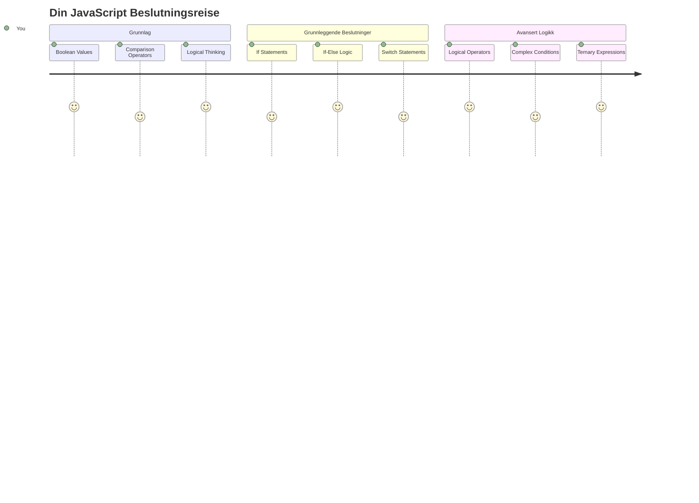
Har du noen gang lurt på hvordan applikasjoner tar smarte beslutninger? Som hvordan et navigasjonssystem velger den raskeste ruten, eller hvordan en termostat bestemmer når den skal slå på varmen? Dette er det grunnleggende konseptet med beslutningstaking i programmering.

Akkurat som Charles Babbages Analytical Engine var designet for å følge forskjellige operasjonssekvenser basert på betingelser, trenger moderne JavaScript-programmer å ta valg basert på varierende omstendigheter. Denne evnen til å forgrene og ta beslutninger er det som forvandler statisk kode til responsive, intelligente applikasjoner.

I denne leksjonen vil du lære hvordan du implementerer betinget logikk i programmene dine. Vi skal utforske betingede utsagn, sammenligningsoperatorer og logiske uttrykk som lar koden din evaluere situasjoner og svare hensiktsmessig.

## Forhåndsforelesnings-quiz

[Forhåndsforelesnings-quiz](https://ff-quizzes.netlify.app/web/quiz/11)

Evnen til å ta beslutninger og kontrollere programflyt er et grunnleggende aspekt ved programmering. Denne delen dekker hvordan du styrer utførelsesbanen til JavaScript-programmene dine ved hjelp av boolske verdier og betinget logikk.

[](https://youtube.com/watch?v=SxTp8j-fMMY "Making Decisions")

> 🎥 Klikk på bildet over for en video om å ta beslutninger.

> Du kan ta denne leksjonen på [Microsoft Learn](https://docs.microsoft.com/learn/modules/web-development-101-if-else/?WT.mc_id=academic-77807-sagibbon)!

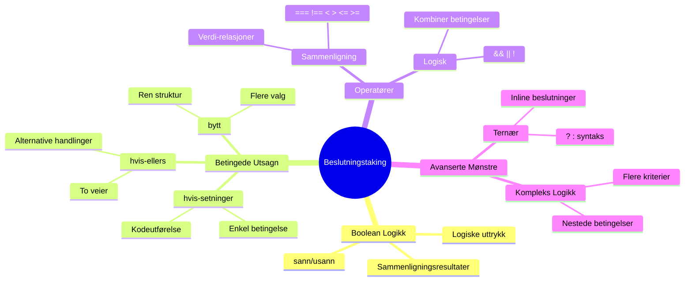
## En Kort Oppsummering av Boolske Verdier

Før vi utforsker beslutningstaking, la oss repetere boolske verdier fra vår forrige leksjon. Oppkalt etter matematikeren George Boole, representerer disse verdiene binære tilstander – enten `true` eller `false`. Det er ingen tvetydighet, ingen mellomting.

Disse binære verdiene danner grunnlaget for all beregningslogikk. Hver beslutning programmet ditt tar, reduseres til en boolsk evaluering.

Å lage boolske variabler er enkelt:

```javascript
let myTrueBool = true;
let myFalseBool = false;
```

Dette oppretter to variabler med eksplisitte boolske verdier.

✅ Boolske er oppkalt etter den engelske matematikeren, filosofen og logikeren George Boole (1815–1864).

## Sammenligningsoperatorer og Boolske

I praksis setter du sjelden boolske verdier manuelt. I stedet genererer du dem ved å evaluere betingelser: "Er dette tallet større enn det andre?" eller "Er disse verdiene like?"

Sammenligningsoperatorer muliggjør disse evalueringene. De sammenligner verdier og returnerer boolske resultater basert på forholdet mellom operandene.

| Symbol | Beskrivelse                                                                                                                                                   | Eksempel           |
| ------ | ------------------------------------------------------------------------------------------------------------------------------------------------------------- | ------------------ |
| `<`    | **Mindre enn**: Sammenligner to verdier og returnerer den boolske typen `true` hvis verdien på venstre side er mindre enn på høyre side                       | `5 < 6 // true`    |
| `<=`   | **Mindre enn eller lik**: Sammenligner to verdier og returnerer den boolske typen `true` hvis verdien på venstre side er mindre enn eller lik høyre side      | `5 <= 6 // true`   |
| `>`    | **Større enn**: Sammenligner to verdier og returnerer den boolske typen `true` hvis verdien på venstre side er større enn på høyre side                      | `5 > 6 // false`   |
| `>=`   | **Større enn eller lik**: Sammenligner to verdier og returnerer den boolske typen `true` hvis verdien på venstre side er større enn eller lik høyre side      | `5 >= 6 // false`  |
| `===`  | **Streng likhet**: Sammenligner to verdier og returnerer den boolske typen `true` hvis verdiene på høyre og venstre side er like OG har samme datatype        | `5 === 6 // false` |
| `!==`  | **Ulikhet**: Sammenligner to verdier og returnerer det motsatte boolske resultatet av det en streng likhetsoperator ville returnert                          | `5 !== 6 // true`  |

✅ Test kunnskapen din ved å skrive noen sammenligninger i nettleserens konsoll. Overrasker noen av de returnerte dataene deg?

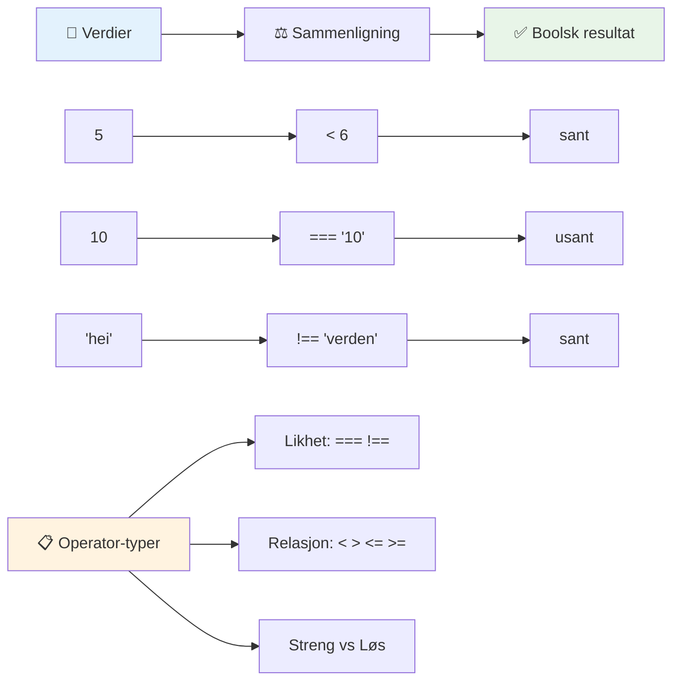
### 🧠 **Sammenligningskontroll: Forstå boolsk logikk**

**Test forståelsen av sammenligninger:**
- Hvorfor tror du `===` (streng likhet) generelt foretrekkes fremfor `==` (løs likhet)?
- Kan du forutsi hva `5 === '5'` returnerer? Hva med `5 == '5'`?
- Hva er forskjellen mellom `!==` og `!=`?

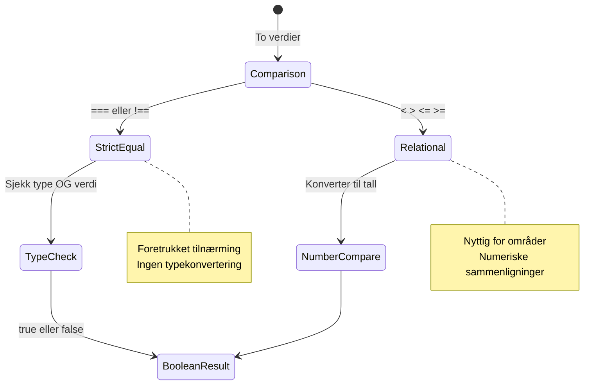
> **Proff-tips**: Bruk alltid `===` og `!==` for likhetssjekker med mindre du spesielt trenger typekonvertering. Dette hindrer uventet oppførsel!

## If-setning

`if`-setningen er som å stille et spørsmål i koden din. "Hvis denne betingelsen er sann, så gjør dette." Det er sannsynligvis det viktigste verktøyet du vil bruke for å ta beslutninger i JavaScript.

Slik fungerer det:

```javascript
if (condition) {
  // Betingelsen er sann. Koden i denne blokken vil kjøre.
}
```

Betingelsen går inni parentesene, og hvis den er `true`, kjører JavaScript koden inne i krøllparentesene. Hvis den er `false`, hopper JavaScript over hele blokken.

Du vil ofte bruke sammenligningsoperatorer for å lage disse betingelsene. La oss se et praktisk eksempel:

```javascript
let currentMoney = 1000;
let laptopPrice = 800;

if (currentMoney >= laptopPrice) {
  // Betingelsen er sann. Koden i denne blokken vil kjøre.
  console.log("Getting a new laptop!");
}
```

Siden `1000 >= 800` evalueres til `true`, kjører koden innenfor blokken og viser "Getting a new laptop!" i konsollen.

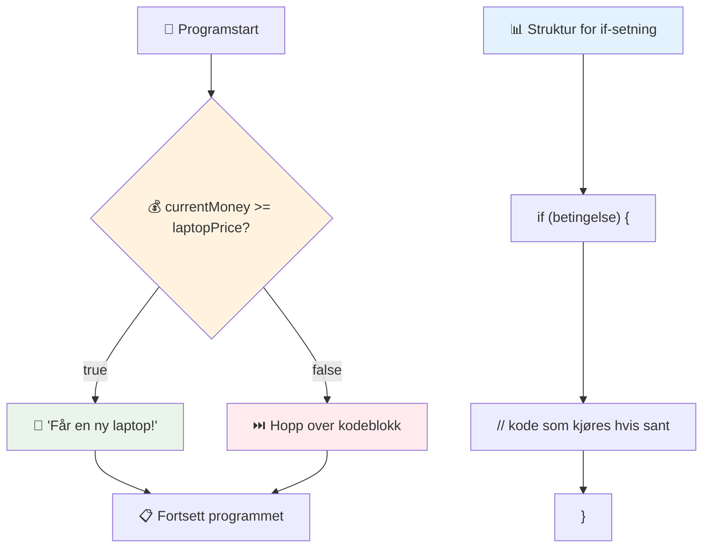
## If..Else Setning

Men hva om du vil at programmet ditt skal gjøre noe annet når betingelsen er falsk? Det er her `else` kommer inn – det er som å ha en backup-plan.

`else`-setningen gir deg en måte å si "hvis denne betingelsen ikke er sann, gjør dette i stedet."

```javascript
let currentMoney = 500;
let laptopPrice = 800;

if (currentMoney >= laptopPrice) {
  // Betingelsen er sann. Koden i denne blokken vil kjøre.
  console.log("Getting a new laptop!");
} else {
  // Betingelsen er usann. Koden i denne blokken vil kjøre.
  console.log("Can't afford a new laptop, yet!");
}
```

Nå, siden `500 >= 800` er `false`, hopper JavaScript over den første blokken og kjører `else`-blokken i stedet. Du vil se "Can't afford a new laptop, yet!" i konsollen.

✅ Test forståelsen av denne koden og den følgende ved å kjøre den i nettleserens konsoll. Endre verdiene til variablene currentMoney og laptopPrice for å endre det returnerte `console.log()`.

### 🎯 **If-Else Logikk Sjekk: Forgreningsvalg**

**Evaluer forståelsen av betinget logikk:**
- Hva skjer hvis `currentMoney` er nøyaktig lik `laptopPrice`?
- Kan du tenke på en virkelighetsnær situasjon hvor if-else logikk ville være nyttig?
- Hvordan kan du utvide dette for å håndtere flere prisklasser?

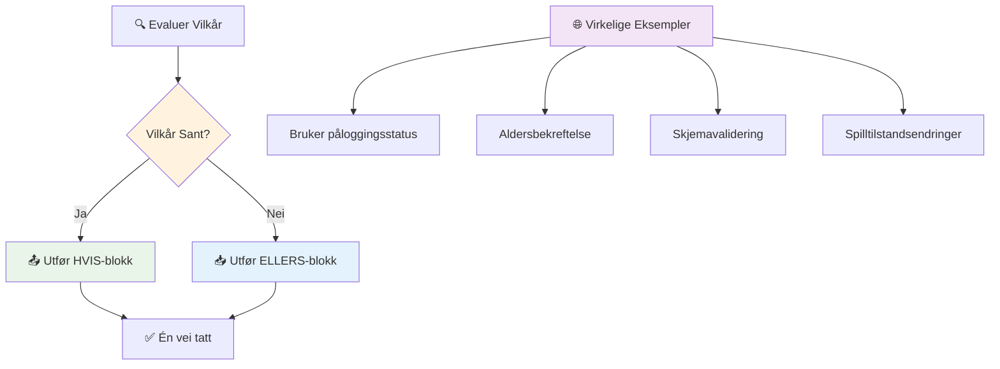
> **Viktig innsikt**: If-else sikrer at akkurat én sti tas. Dette garanterer at programmet ditt alltid har en respons på enhver betingelse!

## Switch-setning

Noen ganger trenger du å sammenligne én verdi mot flere alternativer. Selv om du kunne lenke flere `if..else`-setninger, blir denne tilnærmingen tungvint. `switch`-setningen gir en ryddigere struktur for å håndtere flere diskrete verdier.

Konseptet ligner på de mekaniske brytersystemene som ble brukt i tidlige telefonvekslinger – én input-verdi bestemmer hvilken spesifikk vei utførelsen følger.

```javascript
switch (expression) {
  case x:
    // kodeblokk
    break;
  case y:
    // kodeblokk
    break;
  default:
    // kodeblokk
}
```

Slik er den strukturert:
- JavaScript evaluerer uttrykket én gang
- Det ser gjennom hver `case` for å finne et treff
- Når det finner et treff, kjører det den kodeblokken
- `break` sier til JavaScript å stoppe og gå ut av switchen
- Hvis ingen cases matcher, kjører den `default` blokken (hvis du har en)

```javascript
// Program som bruker switch-setning for ukedag
let dayNumber = 2;
let dayName;

switch (dayNumber) {
  case 1:
    dayName = "Monday";
    break;
  case 2:
    dayName = "Tuesday";
    break;
  case 3:
    dayName = "Wednesday";
    break;
  default:
    dayName = "Unknown day";
    break;
}
console.log(`Today is ${dayName}`);
```

I dette eksemplet ser JavaScript at `dayNumber` er `2`, finner den matchende `case 2`, setter `dayName` til "Tuesday", og bryter ut av switchen. Resultatet? "Today is Tuesday" logges i konsollen.

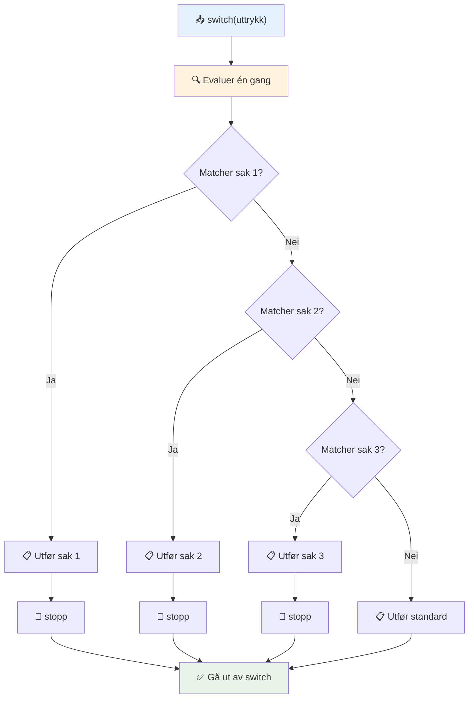
✅ Test forståelsen av denne koden og den følgende ved å kjøre den i nettleserens konsoll. Endre verdien til variabelen a for å endre det returnerte `console.log()`.

### 🔄 **Switch-setningens Mestring: Flere Alternativer**

**Test forståelsen av switch:**
- Hva skjer hvis du glemmer en `break`-setning?
- Når ville du brukt `switch` i stedet for flere `if-else`-setninger?
- Hvorfor er `default`-tilfellet nyttig selv om du tror du har dekket alle muligheter?

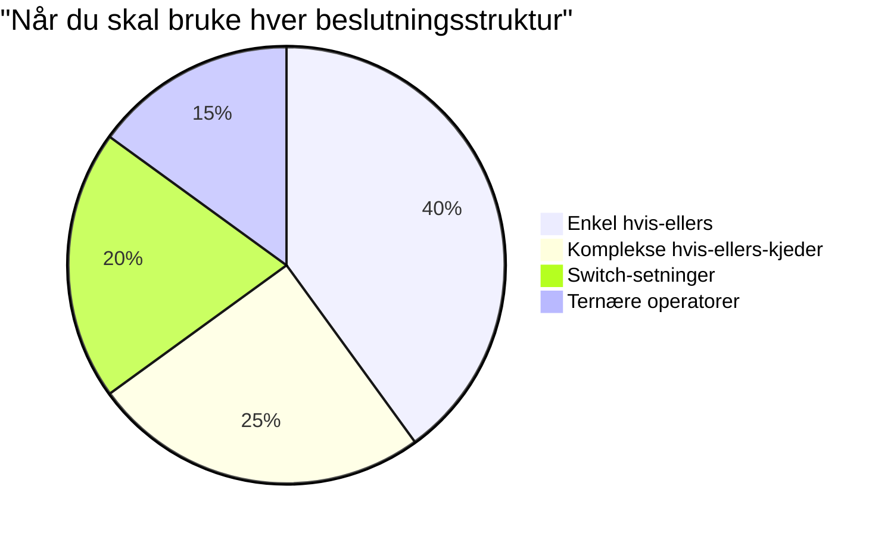
> **Beste praksis**: Bruk `switch` når du sammenligner én variabel mot flere spesifikke verdier. Bruk `if-else` for rekkeviddekontroller eller komplekse betingelser!

## Logiske Operatorer og Boolske

Komplekse beslutninger krever ofte evaluering av flere betingelser samtidig. Akkurat som boolsk algebra lar matematikere kombinere logiske uttrykk, tilbyr programmering logiske operatorer for å koble flere boolske betingelser.

Disse operatorene muliggjør sofistikert betinget logikk ved å kombinere enkle true/false-evalueringer.

| Symbol | Beskrivelse                                                                                     | Eksempel                                                                 |
| ------ | ----------------------------------------------------------------------------------------------- | ----------------------------------------------------------------------- |
| `&&`   | **Logisk OG**: Sammenligner to boolske uttrykk. Returnerer `true` **kun** hvis begge sider er sanne | `(5 > 3) && (5 < 10) // Begge sider er sanne. Returnerer true` |
| `\|\|` | **Logisk ELLER**: Sammenligner to boolske uttrykk. Returnerer `true` hvis minst én side er sann   | `(5 > 10) \|\| (5 < 10) // Én side er usann, den andre sann. Returnerer true` |
| `!`    | **Logisk IKKE**: Returnerer motsatt verdi av et boolsk uttrykk                                 | `!(5 > 10) // 5 er ikke større enn 10, så "!" gjør det sant`         |

Disse operatorene lar deg kombinere betingelser på nyttige måter:
- OG (`&&`) betyr at begge betingelsene må være sanne
- ELLER (`||`) betyr at minst én betingelse må være sann  
- IKKE (`!`) snur sann til usann (og omvendt)

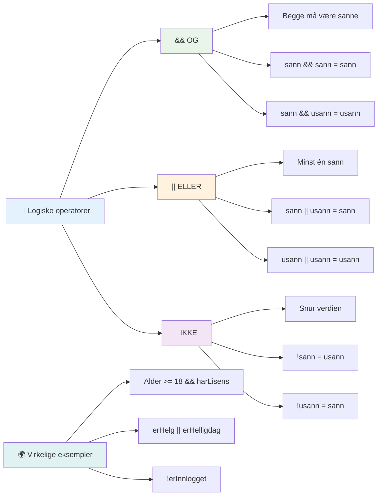
## Betingelser og Beslutninger med Logiske Operatorer

La oss se disse logiske operatorene i aksjon med et mer realistisk eksempel:

```javascript
let currentMoney = 600;
let laptopPrice = 800;
let laptopDiscountPrice = laptopPrice - (laptopPrice * 0.2); // Bærbar pris med 20 prosent rabatt

if (currentMoney >= laptopPrice || currentMoney >= laptopDiscountPrice) {
  // Tilstanden er sann. Koden i denne blokken vil kjøre.
  console.log("Getting a new laptop!");
} else {
  // Tilstanden er usann. Koden i denne blokken vil kjøre.
  console.log("Can't afford a new laptop, yet!");
}
```

I dette eksemplet: Vi kalkulerer en 20% rabattpris (640), og evaluerer deretter om tilgjengelige midler dekker enten fullpris ELLER rabattert pris. Siden 600 møter rabattpriskravet på 640, evalueres betingelsen til sann.

### 🧮 **Logiske Operatorer Sjekk: Kombiner Betingelser**

**Test forståelsen av logiske operatorer:**
- I uttrykket `A && B`, hva skjer hvis A er usann? Blir B evaluert i det hele tatt?
- Kan du tenke deg en situasjon hvor du trenger alle tre operatorene (&&, ||, !) sammen?
- Hva er forskjellen mellom `!user.isActive` og `user.isActive !== true`?

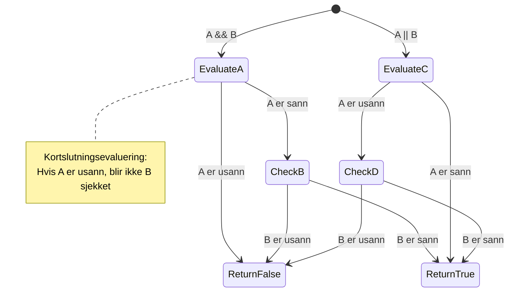
> **Ytelsestips**: JavaScript bruker "short-circuit evaluation" - i `A && B`, hvis A er usann, evalueres ikke B. Bruk dette til din fordel!

### Negasjonsoperator

Noen ganger er det enklere å tenke på når noe IKKE er sant. Som i stedet for å spørre "Er brukeren logget inn?", vil du kanskje spørre "Er brukeren IKKE logget inn?" Utropstegnet (`!`) snur logikken for deg.

```javascript
if (!condition) {
  // kjører hvis betingelsen er usann
} else {
  // kjører hvis betingelsen er sann
}
```

`!` operatoren er som å si "det motsatte av..." – hvis noe er `true`, gjør `!` det til `false`, og omvendt.

### Ternære uttrykk

For enkle betingede tildelinger tilbyr JavaScript **ternær operator**. Denne konsise syntaksen lar deg skrive et betinget uttrykk på én linje, nyttig når du trenger å tildele én av to verdier basert på en betingelse.

```javascript
let variable = condition ? returnThisIfTrue : returnThisIfFalse;
```

Det leses som et spørsmål: "Er denne betingelsen sann? Hvis ja, bruk denne verdien. Hvis nei, bruk den verdien."

Nedenfor er et mer håndfast eksempel:

```javascript
let firstNumber = 20;
let secondNumber = 10;
let biggestNumber = firstNumber > secondNumber ? firstNumber : secondNumber;
```

✅ Ta et øyeblikk til å lese denne koden flere ganger. Forstår du hvordan disse operatorene fungerer?

Denne linjen sier: "Er `firstNumber` større enn `secondNumber`? Hvis ja, sett `firstNumber` i `biggestNumber`. Hvis nei, sett `secondNumber` i `biggestNumber`."

Den ternære operatoren er bare en kortere måte å skrive denne tradisjonelle `if..else`-setningen på:

```javascript
let biggestNumber;
if (firstNumber > secondNumber) {
  biggestNumber = firstNumber;
} else {
  biggestNumber = secondNumber;
}
```

Begge tilnærminger gir identiske resultater. Den ternære operatoren tilbyr korthet, mens den tradisjonelle if-else-strukturen kan være mer lesbar for komplekse betingelser.

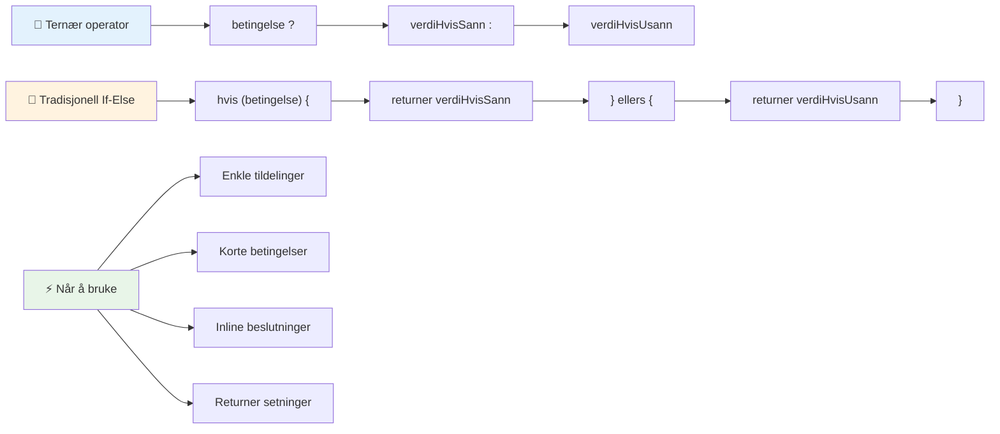
---


## 🚀 Utfordring

Lag et program som først er skrevet med logiske operatorer, og deretter skriv det om ved å bruke et ternært uttrykk. Hva er din foretrukne syntaks?

---

## GitHub Copilot Agent Utfordring 🚀

Bruk Agent-modus for å løse følgende utfordring:

**Beskrivelse:** Lag en omfattende karakterskala som demonstrerer flere beslutningskonsepter fra denne leksjonen, inkludert if-else setninger, switch-setninger, logiske operatorer og ternære uttrykk.

**Prompt:** Skriv et JavaScript-program som tar en students numeriske poengsum (0-100) og bestemmer deres bokstavkarakter ved å bruke følgende kriterier:
- A: 90-100
- B: 80-89  
- C: 70-79
- D: 60-69
- F: Under 60

Krav:
1. Bruk en if-else setning for å bestemme bokstavkarakteren
2. Bruk logiske operatorer for å sjekke om studenten består (karakter >= 60) OG har utmerkelser (karakter >= 90)
3. Bruk en switch-setning for å gi spesifikk tilbakemelding for hver bokstavkarakter
4. Bruk en ternær operator for å avgjøre om studenten er kvalifisert for neste kurs (karakter >= 70)
5. Inkluder input-validering for å sikre at poengsummen er mellom 0 og 100

Test programmet ditt med forskjellige poengsummer inkludert grenseverdier som 59, 60, 89, 90 og ugyldige input.

Lær mer om [agent mode](https://code.visualstudio.com/blogs/2025/02/24/introducing-copilot-agent-mode) her.


## Post-forelesningsquiz

[Post-forelesningsquiz](https://ff-quizzes.netlify.app/web/quiz/12)

## Gjennomgang & Selvstudium

Les mer om de mange operatorene som er tilgjengelige for brukeren [på MDN](https://developer.mozilla.org/docs/Web/JavaScript/Reference/Operators).

Gå gjennom Josh Comeaus flotte [operator lookup](https://joshwcomeau.com/operator-lookup/)!

## Oppgave

[Operatorer](assignment.md)

---

## 🧠 **Ditt beslutningsverktøy-sammendrag**

```mermaid
graph TD
    A["🎯 JavaScript Beslutninger"] --> B["🔍 Boolsk Logikk"]
    A --> C["📊 Betingede Utsagn"]
    A --> D["🔗 Logiske Operatorer"]
    A --> E["⚡ Avanserte Mønstre"]
    
    B --> B1["sanne/usanne verdier"]
    B --> B2["Sammenligningsoperatorer"]
    B --> B3["Konsepter for sannhetsverdi"]
    
    C --> C1["if-setninger"]
    C --> C2["if-else kjeder"]
    C --> C3["switch-setninger"]
    
    D --> D1["&& (OG)"]
    D --> D2["|| (ELLER)"]
    D --> D3["! (IKKE)"]
    
    E --> E1["Ternær operator"]
    E --> E2["Kortslutningsvurdering"]
    E --> E3["Komplekse betingelser"]
    
    F["💡 Viktige Prinsipper"] --> F1["Klare lesbare betingelser"]
    F --> F2["Konsistent sammenligningsstil"]
    F --> F3["Riktig operatorrekkefølge"]
    F --> F4["Effektiv vurderingsrekkefølge"]
    
    style A fill:#e3f2fd
    style B fill:#e8f5e8
    style C fill:#fff3e0
    style D fill:#f3e5f5
    style E fill:#e0f2f1
    style F fill:#fce4ec
```
---

## 🚀 Din tidslinje for JavaScript beslutningsmestring

### ⚡ **Hva du kan gjøre de neste 5 minuttene**
- [ ] Øv på sammenligningsoperatorer i nettleserkonsollen din
- [ ] Skriv en enkel if-else-setning som sjekker alderen din
- [ ] Prøv utfordringen: skriv om en if-else med en ternær operator
- [ ] Test hva som skjer med forskjellige "truthy" og "falsy" verdier

### 🎯 **Hva du kan oppnå denne timen**
- [ ] Fullfør post-leksjonsquizen og gjennomgå eventuelle forvirrende konsepter
- [ ] Bygg den omfattende karakterkalkulatoren fra GitHub Copilot-utfordringen
- [ ] Lag et enkelt beslutningstre for et virkelighetsnært scenario (som å velge hva du skal ha på deg)
- [ ] Øv på å kombinere flere betingelser med logiske operatorer
- [ ] Eksperimenter med switch-setninger for forskjellige brukstilfeller

### 📅 **Din ukelange logikkmestring**
- [ ] Fullfør oppgaven om operatorer med kreative eksempler
- [ ] Bygg en mini quiz-applikasjon ved bruk av ulike betingelsesstrukturer
- [ ] Lag en formvaliderer som sjekker flere inndataforhold
- [ ] Øv på Josh Comeaus [operator lookup](https://joshwcomeau.com/operator-lookup/) øvelser
- [ ] Refaktorer eksisterende kode for å bruke mer passende betingelsesstrukturer
- [ ] Studer short-circuit evaluering og ytelseskonsekvenser

### 🌟 **Din månedslange transformasjon**
- [ ] Mestre komplekse nestede betingelser og oppretthold lesbar kode
- [ ] Bygg en applikasjon med sofistikert beslutningslogikk
- [ ] Bidra til open source ved å forbedre betingelseslogikken i eksisterende prosjekter
- [ ] Lær bort til noen andre om ulike betingelsesstrukturer og når de skal brukes
- [ ] Utforsk funksjonelle programmeringstilnærminger til betingelseslogikk
- [ ] Lag en personlig referanseguide for beste praksis i betingelser

### 🏆 **Siste sjekk for beslutningsmesterskap**

**Feire din mestring av logisk tenkning:**
- Hva er den mest komplekse beslutningslogikken du har implementert med suksess?
- Hvilken betingelsesstruktur føles mest naturlig for deg og hvorfor?
- Hvordan har det å lære om logiske operatorer endret måten du løser problemer på?
- Hvilken virkelighetsapplikasjon kan ha nytte av sofistikert beslutningslogikk?

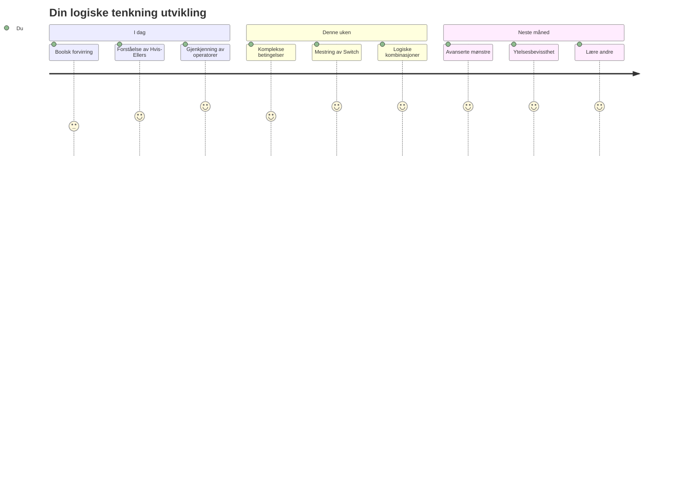
> 🧠 **Du har mestret kunsten å ta digitale beslutninger!** Hver interaktiv applikasjon er avhengig av betingelseslogikk for å reagere intelligent på brukerhandlinger og skiftende forhold. Du forstår nå hvordan du får programmene dine til å tenke, evaluere og velge passende svar. Dette logiske grunnlaget vil drive alle dynamiske applikasjoner du bygger! 🎉

---

<!-- CO-OP TRANSLATOR DISCLAIMER START -->
**Ansvarsfraskrivelse**:
Dette dokumentet er oversatt ved hjelp av AI-oversettelsestjenesten [Co-op Translator](https://github.com/Azure/co-op-translator). Selv om vi streber etter nøyaktighet, vennligst vær oppmerksom på at automatiske oversettelser kan inneholde feil eller unøyaktigheter. Det opprinnelige dokumentet på originalspråket skal anses som den autoritative kilden. For kritisk informasjon anbefales profesjonell menneskelig oversettelse. Vi er ikke ansvarlige for misforståelser eller feiltolkninger som oppstår ved bruk av denne oversettelsen.
<!-- CO-OP TRANSLATOR DISCLAIMER END -->