<!--
CO_OP_TRANSLATOR_METADATA:
{
  "original_hash": "1710a50a519a6e4a1b40a5638783018d",
  "translation_date": "2026-01-07T00:22:40+00:00",
  "source_file": "2-js-basics/4-arrays-loops/README.md",
  "language_code": "no"
}
-->
# JavaScript Grunnleggende: Arrays og Løkker


> Sketchnote av [Tomomi Imura](https://twitter.com/girlie_mac)

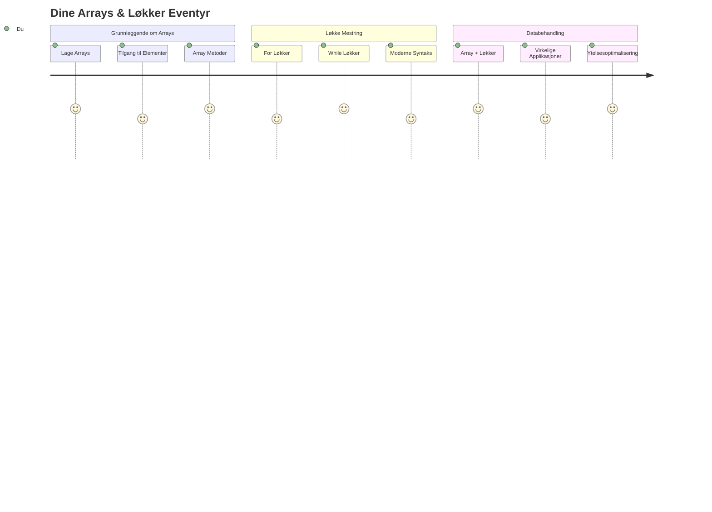
## Forhåndsforelesning Quiz
[Forhåndsforelesning quiz](https://ff-quizzes.netlify.app/web/quiz/13)

Har du noen gang lurt på hvordan nettsider holder oversikt over handlekurvartikler eller viser vennelisten din? Det er her arrays og løkker kommer inn. Arrays er som digitale beholdere som holder flere informasjonsbiter, mens løkker lar deg jobbe med all den dataen effektivt uten gjentakende kode.

Sammen danner disse to konseptene grunnlaget for å håndtere informasjon i programmene dine. Du vil lære å gå fra manuelt å skrive ut hvert eneste steg til å lage smart, effektiv kode som kan behandle hundrevis eller til og med tusenvis av elementer raskt.

På slutten av denne leksjonen vil du forstå hvordan du kan utføre komplekse databehandlingsoppgaver med bare noen få kodelinjer. La oss utforske disse essensielle programmeringskonseptene.

[](https://youtube.com/watch?v=1U4qTyq02Xw "Arrays")

[](https://www.youtube.com/watch?v=Eeh7pxtTZ3k "Løkker")

> 🎥 Klikk på bildene ovenfor for videoer om arrays og løkker.

> Du kan ta denne leksjonen på [Microsoft Learn](https://docs.microsoft.com/learn/modules/web-development-101-arrays/?WT.mc_id=academic-77807-sagibbon)!

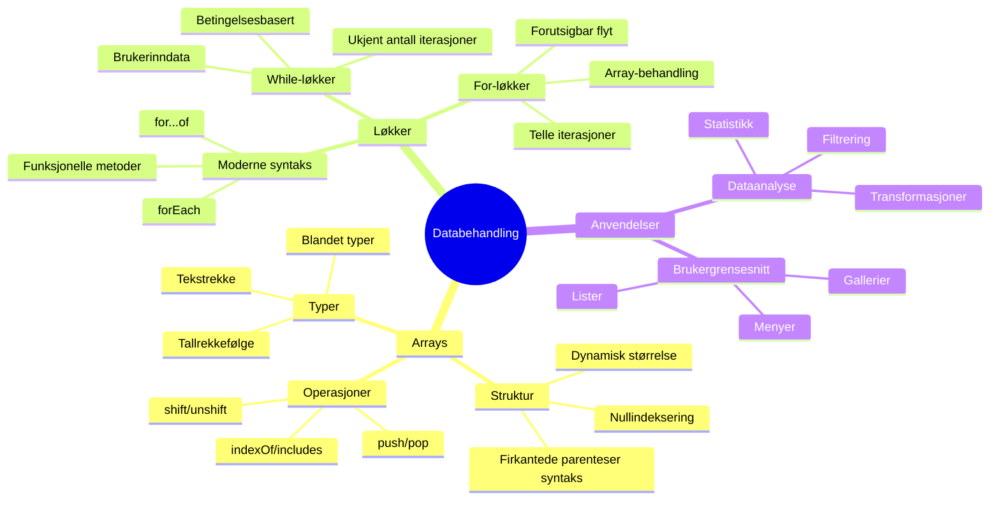
## Arrays

Tenk på arrays som et digitalt arkivskap – i stedet for å lagre ett dokument per skuff, kan du organisere flere relaterte elementer i en enkelt, strukturert beholder. I programmeringsspråk lar arrays deg lagre flere biter informasjon i én organisert pakke.

Enten du bygger et fotogalleri, administrerer en oppgaveliste, eller holder oversikt over høyeste poeng i et spill, gir arrays grunnlaget for dataorganisering. La oss se hvordan de fungerer.

✅ Arrays finnes overalt rundt oss! Kan du tenke deg et virkelig eksempel på en array, som et solcellepanel-array?

### Lage Arrays

Å lage et array er superenkelt – bare bruk firkantede parenteser!

```javascript
// Tom matrise - som en tom handlekurv som venter på varer
const myArray = [];
```

**Hva skjer her?**
Du har nettopp laget en tom beholder ved å bruke de firkantede parentesene `[]`. Tenk på det som en tom bibliotekshylle – den er klar til å holde hvilke som helst bøker du vil organisere der.

Du kan også fylle arrayen din med startverdier med en gang:

```javascript
// Smakemenyen i iskrembutikken din
const iceCreamFlavors = ["Chocolate", "Strawberry", "Vanilla", "Pistachio", "Rocky Road"];

// En brukers profilinformasjon (blanding av forskjellige datatyper)
const userData = ["John", 25, true, "developer"];

// Testresultater for din favorittklasse
const scores = [95, 87, 92, 78, 85];
```

**Kule ting å legge merke til:**
- Du kan lagre tekst, tall eller til og med sann/usann-verdier i samme array
- Bare skil hvert element med et komma – enkelt!
- Arrays er perfekte for å holde relaterte opplysninger samlet

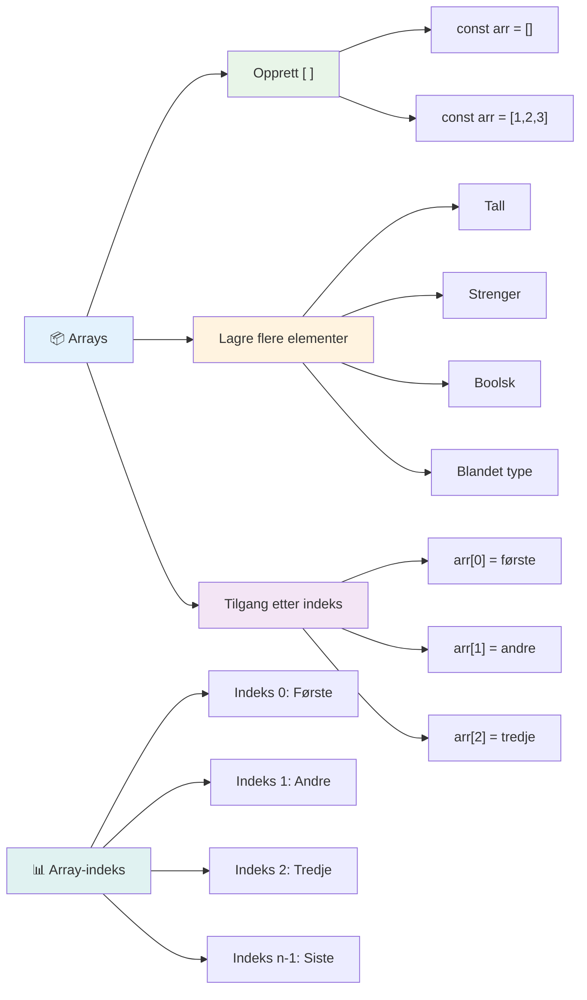
### Array-indeksering

Her er noe som kan virke uvanlig i starten: arrays nummererer elementene sine fra 0, ikke 1. Denne nullindekseringen har sin opprinnelse i hvordan datamaskinens minne fungerer – det har vært en programmeringskonvensjon siden de tidlige dagene av programmeringsspråk som C. Hvert sted i arrayen får sitt eget adressenummer kalt en **indeks**.

| Indeks | Verdi | Beskrivelse |
|-------|-------|-------------|
| 0 | "Chocolate" | Første element |
| 1 | "Strawberry" | Andre element |
| 2 | "Vanilla" | Tredje element |
| 3 | "Pistachio" | Fjerde element |
| 4 | "Rocky Road" | Femte element |

✅ Overrasker det deg at arrays starter på indeks null? I noen programmeringsspråk starter indeksene på 1. Det finnes en interessant historie rundt dette, som du kan [lese om på Wikipedia](https://en.wikipedia.org/wiki/Zero-based_numbering).

**Tilgang til array-elementer:**

```javascript
const iceCreamFlavors = ["Chocolate", "Strawberry", "Vanilla", "Pistachio", "Rocky Road"];

// Få tilgang til individuelle elementer ved hjelp av klammeparentesnotasjon
console.log(iceCreamFlavors[0]); // "Sjokolade" - første element
console.log(iceCreamFlavors[2]); // "Vanilje" - tredje element
console.log(iceCreamFlavors[4]); // "Rocky Road" - siste element
```

**Bryter ned hva som skjer her:**
- **Bruker** firkantede parenteser med indeksnummer for å hente elementer
- **Returnerer** verdien som er lagret på den spesifikke posisjonen i arrayen
- **Starter** tellingen fra 0, noe som gjør første element til indeks 0

**Endre array-elementer:**

```javascript
// Endre en eksisterende verdi
iceCreamFlavors[4] = "Butter Pecan";
console.log(iceCreamFlavors[4]); // "Smør Pecan"

// Legg til et nytt element på slutten
iceCreamFlavors[5] = "Cookie Dough";
console.log(iceCreamFlavors[5]); // "Deig til kjeks"
```

**I eksempelet ovenfor har vi:**
- **Endret** elementet på indeks 4 fra "Rocky Road" til "Butter Pecan"
- **Lagt til** et nytt element "Cookie Dough" på indeks 5
- **Utvidet** arrayens lengde automatisk når vi legger til utenfor gjeldende grenser

### Array-lengde og vanlige metoder

Arrays kommer med innebygde egenskaper og metoder som gjør det mye enklere å jobbe med data.

**Finne array-lengde:**

```javascript
const iceCreamFlavors = ["Chocolate", "Strawberry", "Vanilla", "Pistachio", "Rocky Road"];
console.log(iceCreamFlavors.length); // 5

// Lengden oppdateres automatisk når arrayet endres
iceCreamFlavors.push("Mint Chip");
console.log(iceCreamFlavors.length); // 6
```

**Viktige punkter å huske:**
- **Returnerer** totalt antall elementer i arrayen
- **Oppdateres** automatisk når elementer legges til eller fjernes
- **Gir** dynamisk telling som er nyttig for løkker og validering

**Viktige array-metoder:**

```javascript
const fruits = ["apple", "banana", "orange"];

// Legg til elementer
fruits.push("grape");           // Legger til på slutten: ["apple", "banana", "orange", "grape"]
fruits.unshift("strawberry");   // Legger til i begynnelsen: ["strawberry", "apple", "banana", "orange", "grape"]

// Fjern elementer
const lastFruit = fruits.pop();        // Fjerner og returnerer "grape"
const firstFruit = fruits.shift();     // Fjerner og returnerer "strawberry"

// Finn elementer
const index = fruits.indexOf("banana"); // Returnerer 1 (posisjonen til "banana")
const hasApple = fruits.includes("apple"); // Returnerer sant
```

**Forstå disse metodene:**
- **Legger til** elementer med `push()` (på slutten) og `unshift()` (i begynnelsen)
- **Fjerner** elementer med `pop()` (på slutten) og `shift()` (i begynnelsen)
- **Finnes** elementer med `indexOf()` og sjekker eksistens med `includes()`
- **Returnerer** nyttige verdier som fjernede elementer eller posisjonsindekser

✅ Prøv det selv! Bruk nettleserens konsoll for å opprette og manipulere et array du lager.

### 🧠 **Grunnleggende Array-sjekk: Organiser dataene dine**

**Test din forståelse av arrays:**
- Hvorfor tror du arrays starter å telle fra 0 i stedet for 1?
- Hva skjer om du prøver å få tilgang til en indeks som ikke finnes (som `arr[100]` i et array med 5 elementer)?
- Kan du tenke på tre virkelige situasjoner hvor arrays ville være nyttige?

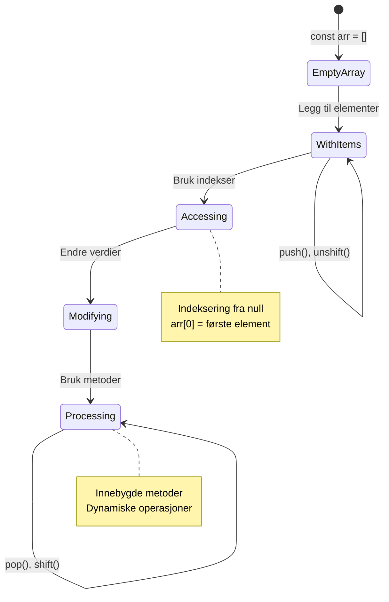
> **Virkelighetsinnsikt**: Arrays finnes overalt i programmering! Sosiale medier-feed, handlekurver, fotogallerier, spillelister – alle er arrays bak kulissene!

## Løkker

Tenk på den kjente straffen i Charles Dickens’ romaner hvor elever måtte skrive linjer gjentatte ganger på en tavle. Tenk om du bare kunne si til noen «skriv denne setningen 100 ganger» og få det gjort automatisk. Det er akkurat det løkker gjør for koden din.

Løkker er som å ha en utholdende assistent som kan gjenta oppgaver uten feil. Enten du må sjekke hvert element i en handlekurv eller vise alle bildene i et album, håndterer løkker repetisjonen effektivt.

JavaScript tilbyr flere typer løkker å velge mellom. La oss se nærmere på hver av dem og forstå når du bør bruke dem.

```mermaid
flowchart TD
    A["🔄 Løkketyper"] --> B["For-løkke"]
    A --> C["While-løkke"]
    A --> D["For...of-løkke"]
    A --> E["forEach-metode"]
    
    B --> B1["Kjente iterasjoner"]
    B --> B2["Tellerbasert"]
    B --> B3["for(init; betingelse; inkrement)"]
    
    C --> C1["Ukjente iterasjoner"]
    C --> C2["Betingelsesbasert"]
    C --> C3["while(betingelse)"]
    
    D --> D1["Moderne ES6+"]
    D --> D2["Array-iterasjon"]
    D --> D3["for(element av array)"]
    
    E --> E1["Funksjonell stil"]
    E --> E2["Array-metode"]
    E --> E3["array.forEach(callback)"]
    
    F["⏰ Når bruke"] --> F1["For: Telling, indekser"]
    F --> F2["While: Brukerinput, søking"]
    F --> F3["For...of: Enkel iterasjon"]
    F --> F4["forEach: Funksjonell programmering"]
    
    style A fill:#e3f2fd
    style B fill:#e8f5e8
    style C fill:#fff3e0
    style D fill:#f3e5f5
    style E fill:#e0f2f1
    style F fill:#fce4ec
```
### For-løkke

`for`-løkka er som å sette en timer – du vet nøyaktig hvor mange ganger du vil at noe skal skje. Den er superorganisert og forutsigbar, noe som gjør den perfekt når du jobber med arrays eller trenger å telle ting.

**For-løkkestruktur:**

| Komponent | Formål | Eksempel |
|-----------|---------|----------|
| **Initialisering** | Setter startpunkt | `let i = 0` |
| **Betingelse** | Når den skal fortsette | `i < 10` |
| **Inkrement** | Hvordan den oppdateres | `i++` |

```javascript
// Telling fra 0 til 9
for (let i = 0; i < 10; i++) {
  console.log(`Count: ${i}`);
}

// Mer praktisk eksempel: behandle poengsummer
const testScores = [85, 92, 78, 96, 88];
for (let i = 0; i < testScores.length; i++) {
  console.log(`Student ${i + 1}: ${testScores[i]}%`);
}
```

**Steg for steg, her skjer dette:**
- **Initialiserer** tellevariabelen `i` til 0 i starten
- **Sjekker** betingelsen `i < 10` før hver gjennomgang
- **Utfører** kodeblokken når betingelsen er sann
- **Øker** `i` med 1 etter hver gjennomgang med `i++`
- **Stopper** når betingelsen blir usann (når `i` når 10)

✅ Kjør denne koden i nettleserkonsollen. Hva skjer om du gjør små endringer i tellevariabelen, betingelsen eller inkrementuttrykket? Kan du få den til å gå baklengs, og lage en nedtelling?

### 🗓️ **For-løkke mestringssjekk: Kontrollert repetisjon**

**Evaluer din for-løkke-forståelse:**
- Hva er de tre delene av en for-løkke, og hva gjør hver del?
- Hvordan kan du gå gjennom et array baklengs?
- Hva skjer hvis du glemmer inkrementdelen (`i++`)?

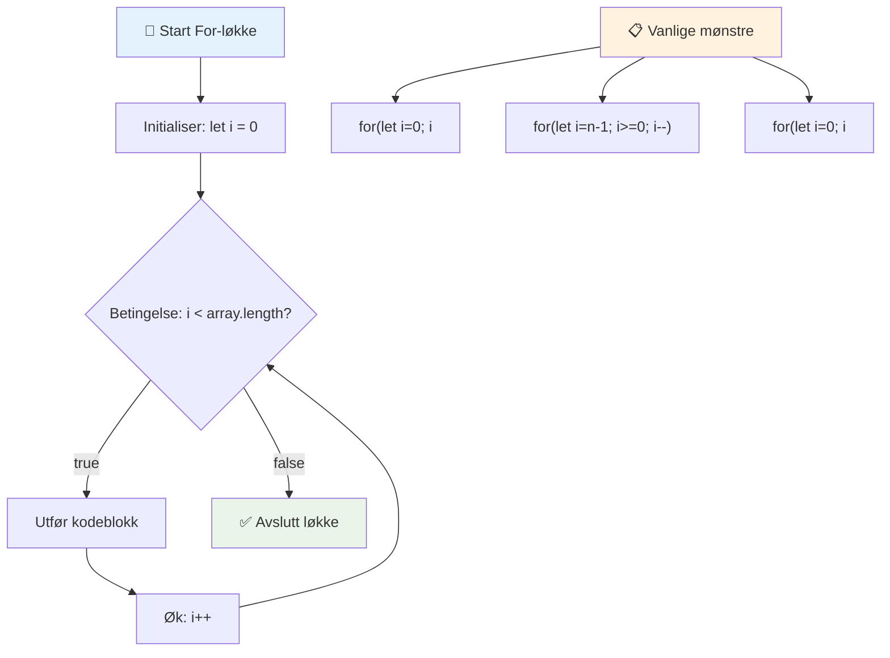
> **Løkkens visdom**: For-løkker er perfekte når du vet nøyaktig hvor mange ganger du må gjenta noe. De er det vanligste valget for arraybehandling!

### While-løkke

`while`-løkka er som å si «fortsett å gjøre dette til...» – du vet kanskje ikke akkurat hvor mange ganger den skal kjøre, men du vet når den skal stoppe. Den er perfekt for ting som å spørre en bruker om inndata til de gir deg det du trenger, eller søke gjennom data til du finner det du leter etter.

**Egenskaper ved while-løkke:**
- **Fortsetter** å kjøre så lenge betingelsen er sann
- **Krever** manuell håndtering av tellevariabler
- **Sjekker** betingelsen før hver gjennomgang
- **Risikerer** evige løkker hvis betingelsen aldri blir usann

```javascript
// Grunnleggende telleeksempel
let i = 0;
while (i < 10) {
  console.log(`While count: ${i}`);
  i++; // Ikke glem å inkrementere!
}

// Mer praktisk eksempel: behandle brukerinput
let userInput = "";
let attempts = 0;
const maxAttempts = 3;

while (userInput !== "quit" && attempts < maxAttempts) {
  userInput = prompt(`Enter 'quit' to exit (attempt ${attempts + 1}):`);
  attempts++;
}

if (attempts >= maxAttempts) {
  console.log("Maximum attempts reached!");
}
```

**Forstå disse eksemplene:**
- **Håndterer** telling manuelt inne i løkka
- **Øker** tellevariabelen for å forhindre evige løkker
- **Demonstrerer** praktisk bruk med brukerinput og forsøkstallbegrensning
- **Inkluderer** sikkerhetsmekanismer for å unngå uendelig kjøring

### ♾️ **While-løkke visdomssjekk: Betingelsesbasert repetisjon**

**Test din forståelse av while-løkker:**
- Hva er den største faren ved å bruke while-løkker?
- Når ville du velge en while-løkke over en for-løkke?
- Hvordan kan du forhindre evige løkker?

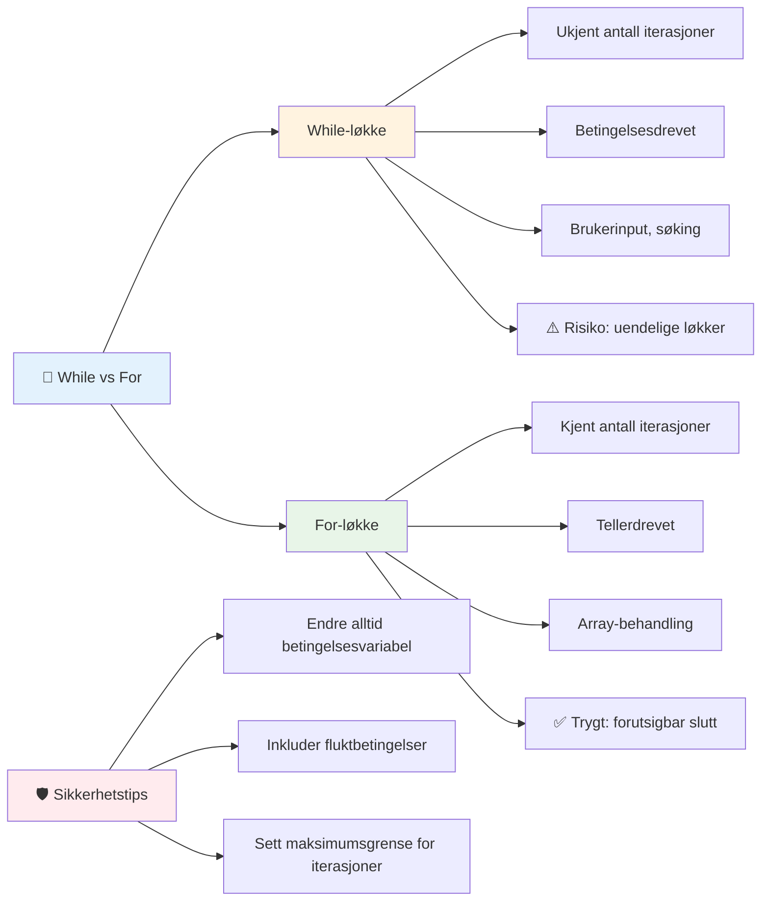
> **Sikkerhet først**: While-løkker er kraftige, men krever nøye styring av betingelsene. Sørg alltid for at løkkebetingelsen til slutt blir usann!

### Moderne løkkealternativer

JavaScript tilbyr moderne løkkesyntaks som kan gjøre koden din mer lesbar og mindre feilutsatt.

**For...of løkke (ES6+):**

```javascript
const colors = ["red", "green", "blue", "yellow"];

// Moderne tilnærming - renere og sikrere
for (const color of colors) {
  console.log(`Color: ${color}`);
}

// Sammenlign med tradisjonell for-løkke
for (let i = 0; i < colors.length; i++) {
  console.log(`Color: ${colors[i]}`);
}
```

**Viktige fordeler med for...of:**
- **Fjerner** behovet for indeksbehandling og potensielle avvik av én-feil
- **Gir** direkte tilgang til array-elementer
- **Forbedrer** lesbarheten og reduserer syntakskomplisitet

**forEach-metoden:**

```javascript
const prices = [9.99, 15.50, 22.75, 8.25];

// Bruke forEach for funksjonell programmeringsstil
prices.forEach((price, index) => {
  console.log(`Item ${index + 1}: $${price.toFixed(2)}`);
});

// forEach med pilfunksjoner for enkle operasjoner
prices.forEach(price => console.log(`Price: $${price}`));
```

**Det du må vite om forEach:**
- **Kjører** en funksjon for hvert array-element
- **Gir** både elementverdi og indeks som parametere
- **Kan ikke** stoppes tidlig (i motsetning til tradisjonelle løkker)
- **Returnerer** undefined (lager ikke et nytt array)

✅ Hvorfor ville du velge en for-løkke fremfor en while-løkke? 17 000 besøkende stilte det samme spørsmålet på StackOverflow, og noen av meningene [kan være interessante for deg](https://stackoverflow.com/questions/39969145/while-loops-vs-for-loops-in-javascript).

### 🎨 **Moderne løkkesyntaks-sjekk: Omfavner ES6+**

**Vurder din moderne JavaScript-forståelse:**
- Hva er fordelene med `for...of` i forhold til tradisjonelle for-løkker?
- Når kan du fortsatt foretrekke tradisjonelle for-løkker?
- Hva er forskjellen mellom `forEach` og `map`?

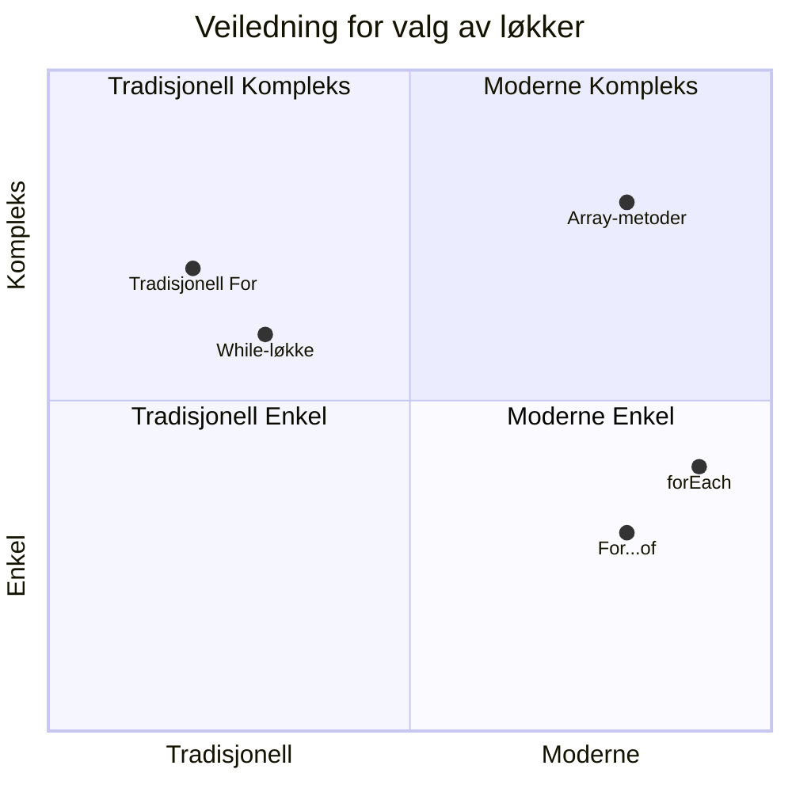
> **Moderne trend**: ES6+-syntaks som `for...of` og `forEach` er i ferd med å bli foretrukket til array-iterasjon fordi det er renere og mindre feilutsatt!

## Løkker og Arrays

Å kombinere arrays med løkker gir kraftige muligheter for databehandling. Denne kombinasjonen er grunnleggende for mange programmeringsoppgaver, fra visning av lister til å kalkulere statistikk.

**Tradisjonell array-behandling:**

```javascript
const iceCreamFlavors = ["Chocolate", "Strawberry", "Vanilla", "Pistachio", "Rocky Road"];

// Klassisk for-løkke tilnærming
for (let i = 0; i < iceCreamFlavors.length; i++) {
  console.log(`Flavor ${i + 1}: ${iceCreamFlavors[i]}`);
}

// Moderne for...of tilnærming
for (const flavor of iceCreamFlavors) {
  console.log(`Available flavor: ${flavor}`);
}
```

**La oss forstå hver tilnærming:**
- **Bruker** array-lengdeegenskap for å bestemme løkkens grense
- **Tilgår** elementer via indeks i tradisjonelle for-løkker
- **Gir** direkte elementtilgang i for...of-løkker
- **Behandler** hvert array-element nøyaktig én gang

**Praktisk eksempel på databehandling:**

```javascript
const studentGrades = [85, 92, 78, 96, 88, 73, 89];
let total = 0;
let highestGrade = studentGrades[0];
let lowestGrade = studentGrades[0];

// Behandle alle karakterer med en enkelt løkke
for (let i = 0; i < studentGrades.length; i++) {
  const grade = studentGrades[i];
  total += grade;
  
  if (grade > highestGrade) {
    highestGrade = grade;
  }
  
  if (grade < lowestGrade) {
    lowestGrade = grade;
  }
}

const average = total / studentGrades.length;
console.log(`Average: ${average.toFixed(1)}`);
console.log(`Highest: ${highestGrade}`);
console.log(`Lowest: ${lowestGrade}`);
```

**Slik fungerer denne koden:**
- **Initialiserer** variabler for sum og ytterpunkter
- **Behandler** hver karakter med en enkel effektiv løkke
- **Akkumulerer** totalen for gjennomsnittskalkulering
- **Sporer** høyeste og laveste verdi under gjennomgangen
- **Beregner** endelig statistikk etter at løkken er fullført

✅ Eksperimenter med å løpe gjennom et array du lager selv i nettleserkonsollen.

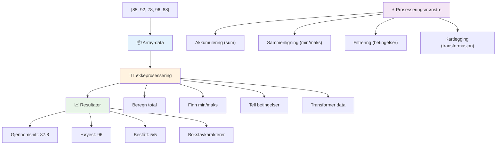
---

## GitHub Copilot Agent Utfordring 🚀

Bruk Agent-modus for å fullføre følgende utfordring:

**Beskrivelse:** Bygg en omfattende databehandlingsfunksjon som kombinerer arrays og løkker for å analysere et datasett og generere meningsfulle innsikter.

**Oppgave:** Lag en funksjon kalt `analyzeGrades` som tar et array av studentkarakter-objekter (hvert med egenskapene navn og poengsum) og returnerer et objekt med statistikk inkludert høyeste poengsum, laveste poengsum, gjennomsnittlig poengsum, antall studenter som besto (poengsum >= 70), og et array av navn på studenter som fikk over gjennomsnittet. Bruk minst to forskjellige løkketyper i løsningen din.

Lær mer om [agent modus](https://code.visualstudio.com/blogs/2025/02/24/introducing-copilot-agent-mode) her.

## 🚀 Utfordring
JavaScript tilbyr flere moderne array-metoder som kan erstatte tradisjonelle løkker for spesifikke oppgaver. Utforsk [forEach](https://developer.mozilla.org/docs/Web/JavaScript/Reference/Global_Objects/Array/forEach), [for-of](https://developer.mozilla.org/docs/Web/JavaScript/Reference/Statements/for...of), [map](https://developer.mozilla.org/docs/Web/JavaScript/Reference/Global_Objects/Array/map), [filter](https://developer.mozilla.org/docs/Web/JavaScript/Reference/Global_Objects/Array/filter), og [reduce](https://developer.mozilla.org/docs/Web/JavaScript/Reference/Global_Objects/Array/reduce). 

**Din utfordring:** Omstrukturer elevkarakter-eksemplet ved å bruke minst tre forskjellige array-metoder. Legg merke til hvor mye renere og mer lesbart koden blir med moderne JavaScript-syntaks.

## Post-forelesningsquiz
[Post-forelesningsquiz](https://ff-quizzes.netlify.app/web/quiz/14)


## Gjennomgang & Selvstudium

Arrays i JavaScript har mange tilknyttede metoder som er ekstremt nyttige for datamanipulering. [Les om disse metodene](https://developer.mozilla.org/docs/Web/JavaScript/Reference/Global_Objects/Array) og prøv noen av dem (som push, pop, slice og splice) på et array du lager.

## Oppgave

[Loop an Array](assignment.md)

---

## 📊 **Ditt sammendrag av Arrays & Løkker-verktøykassen**

```mermaid
graph TD
    A["🎯 Mestring av tabeller og løkker"] --> B["📦 Grunnleggende tabeller"]
    A --> C["🔄 Løkketyper"]
    A --> D["🔗 Databehandling"]
    A --> E["🎨 Moderne teknikker"]
    
    B --> B1["Opprettelse: [ ]"]
    B --> B2["Indeksering: arr[0]"]
    B --> B3["Metoder: push, pop"]
    B --> B4["Egenskaper: length"]
    
    C --> C1["For: Kjente iterasjoner"]
    C --> C2["While: Betingelsesbasert"]
    C --> C3["For...of: Direkte tilgang"]
    C --> C4["forEach: Funksjonell"]
    
    D --> D1["Statistikkberegning"]
    D --> D2["Datatransformasjon"]
    D --> D3["Filtrering & søk"]
    D --> D4["Sanntidsbehandling"]
    
    E --> E1["Pilerfunksjoner"]
    E --> E2["Metodekjedning"]
    E --> E3["Destrukturering"]
    E --> E4["Mal-literal"]
    
    F["💡 Viktige fordeler"] --> F1["Effektiv datahåndtering"]
    F --> F2["Redusert kodegjentakelse"]
    F --> F3["Skalerbare løsninger"]
    F --> F4["Renere syntaks"]
    
    style A fill:#e3f2fd
    style B fill:#e8f5e8
    style C fill:#fff3e0
    style D fill:#f3e5f5
    style E fill:#e0f2f1
    style F fill:#fce4ec
```
---

## 🚀 Din tidslinje for mestring av Arrays & Løkker

### ⚡ **Hva du kan gjøre de neste 5 minuttene**
- [ ] Lag et array av dine favorittfilmer og få tilgang til spesifikke elementer
- [ ] Skriv en for-løkke som teller fra 1 til 10
- [ ] Prøv utfordringen med moderne array-metoder fra leksjonen
- [ ] Øv på array-indeksering i nettleserkonsollen din

### 🎯 **Hva du kan oppnå denne timen**
- [ ] Fullfør post-leksjonsquizen og gå gjennom eventuelle utfordrende konsepter
- [ ] Bygg den omfattende karakteranalysatoren fra GitHub Copilot-utfordringen
- [ ] Lag en enkel handlekurv som legger til og fjerner elementer
- [ ] Øv på å konvertere mellom forskjellige løkketyper
- [ ] Eksperimenter med array-metoder som `push`, `pop`, `slice` og `splice`

### 📅 **Din ukeslange reise innen databehandling**
- [ ] Fullfør oppgaven "Loop an Array" med kreative forbedringer
- [ ] Bygg en gjøremålsliste-applikasjon som bruker arrays og løkker
- [ ] Lag en enkel statistikk-kalkulator for numeriske data
- [ ] Øv på [MDN array-metoder](https://developer.mozilla.org/docs/Web/JavaScript/Reference/Global_Objects/Array)
- [ ] Lag et fotogalleri eller musikkspillelistegrensesnitt
- [ ] Utforsk funksjonell programmering med `map`, `filter` og `reduce`

### 🌟 **Din månedslange transformasjon**
- [ ] Mestre avanserte array-operasjoner og ytelsesoptimalisering
- [ ] Bygg et komplett dashbord for datavisualisering
- [ ] Bidra til open source-prosjekter som involverer databehandling
- [ ] Lær bort til andre om arrays og løkker med praktiske eksempler
- [ ] Lag et personlig bibliotek med gjenbrukbare funksjoner for databehandling
- [ ] Utforsk algoritmer og datastrukturer basert på arrays

### 🏆 **Siste sjekkpunkt for databehandlingsmester**

**Feir din mestring av arrays og løkker:**
- Hva er den mest nyttige array-operasjonen du har lært for virkelige anvendelser?
- Hvilken løkketype føles mest naturlig for deg, og hvorfor?
- Hvordan har forståelsen av arrays og løkker endret din tilnærming til å organisere data?
- Hvilken kompleks databehandlingsoppgave ønsker du å prøve på neste?

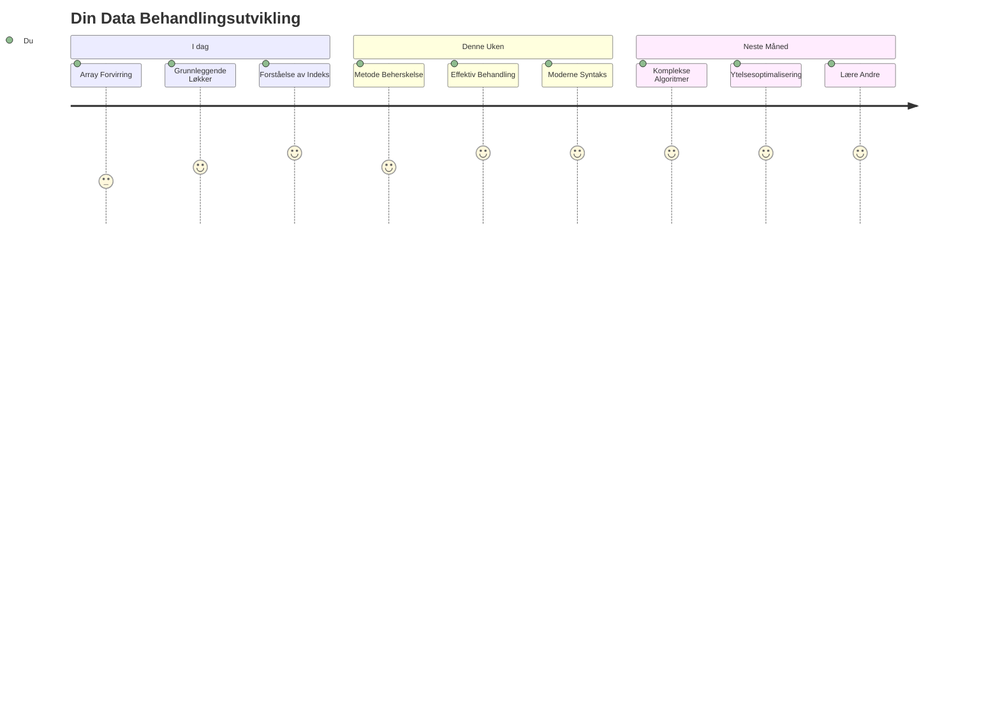
> 📦 **Du har låst opp kraften i dataorganisering og -behandling!** Arrays og løkker er grunnlaget for nesten alle applikasjoner du noen gang kommer til å lage. Fra enkle lister til kompleks dataanalyse har du nå verktøyene for å håndtere informasjon effektivt og elegant. Hver dynamisk nettside, mobilapp og datadrevet applikasjon er avhengig av disse fundamentale konseptene. Velkommen til verden av skalerbar databehandling! 🎉

---

<!-- CO-OP TRANSLATOR DISCLAIMER START -->
**Ansvarsfraskrivelse**:
Dette dokumentet er oversatt ved hjelp av AI-oversettelsestjenesten [Co-op Translator](https://github.com/Azure/co-op-translator). Selv om vi streber etter nøyaktighet, vennligst vær oppmerksom på at automatiske oversettelser kan inneholde feil eller unøyaktigheter. Det opprinnelige dokumentet på originalspråket skal anses som den autoritative kilden. For kritisk informasjon anbefales profesjonell menneskelig oversettelse. Vi er ikke ansvarlige for eventuelle misforståelser eller feiltolkninger som oppstår ved bruk av denne oversettelsen.
<!-- CO-OP TRANSLATOR DISCLAIMER END -->