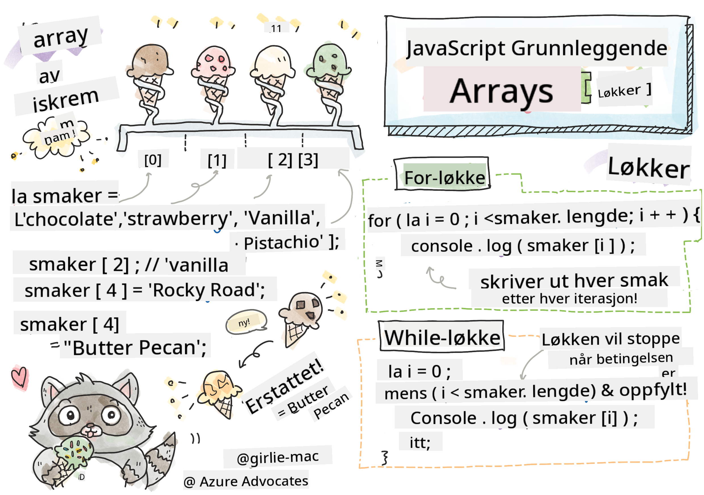

<!--
CO_OP_TRANSLATOR_METADATA:
{
  "original_hash": "3f7f87871312cf6cc12662da7d973182",
  "translation_date": "2025-08-26T21:46:59+00:00",
  "source_file": "2-js-basics/4-arrays-loops/README.md",
  "language_code": "no"
}
-->
# Grunnleggende JavaScript: Arrays og Løkker


> Sketchnote av [Tomomi Imura](https://twitter.com/girlie_mac)

## Quiz før forelesning
[Quiz før forelesning](https://ff-quizzes.netlify.app/web/quiz/13)

Denne leksjonen dekker det grunnleggende i JavaScript, språket som gir interaktivitet på nettet. I denne leksjonen vil du lære om arrays og løkker, som brukes til å manipulere data.

[](https://youtube.com/watch?v=1U4qTyq02Xw "Arrays")

[](https://www.youtube.com/watch?v=Eeh7pxtTZ3k "Løkker")

> 🎥 Klikk på bildene over for videoer om arrays og løkker.

> Du kan ta denne leksjonen på [Microsoft Learn](https://docs.microsoft.com/learn/modules/web-development-101-arrays/?WT.mc_id=academic-77807-sagibbon)!

## Arrays

Å jobbe med data er en vanlig oppgave i alle programmeringsspråk, og det blir mye enklere når data er organisert i en strukturert form, som arrays. Med arrays lagres data i en struktur som ligner en liste. En stor fordel med arrays er at du kan lagre ulike typer data i én array.

✅ Arrays finnes overalt! Kan du komme på et eksempel fra virkeligheten, som et solcellepanel-array?

Syntaksen for en array er et par med firkantede klammer.

```javascript
let myArray = [];
```

Dette er en tom array, men arrays kan også deklareres med data allerede lagt inn. Flere verdier i en array skilles med komma.

```javascript
let iceCreamFlavors = ["Chocolate", "Strawberry", "Vanilla", "Pistachio", "Rocky Road"];
```

Verdiene i en array tildeles en unik verdi kalt **indeks**, et heltall som tildeles basert på avstanden fra starten av arrayen. I eksempelet over har strengverdien "Chocolate" en indeks på 0, og indeksen til "Rocky Road" er 4. Bruk indeksen med firkantede klammer for å hente, endre eller legge til verdier i en array.

✅ Er det overraskende for deg at arrays starter på indeks null? I noen programmeringsspråk starter indekser på 1. Det finnes en interessant historie bak dette, som du kan [lese om på Wikipedia](https://en.wikipedia.org/wiki/Zero-based_numbering).

```javascript
let iceCreamFlavors = ["Chocolate", "Strawberry", "Vanilla", "Pistachio", "Rocky Road"];
iceCreamFlavors[2]; //"Vanilla"
```

Du kan bruke indeksen til å endre en verdi, slik som dette:

```javascript
iceCreamFlavors[4] = "Butter Pecan"; //Changed "Rocky Road" to "Butter Pecan"
```

Og du kan legge til en ny verdi på en gitt indeks slik som dette:

```javascript
iceCreamFlavors[5] = "Cookie Dough"; //Added "Cookie Dough"
```

✅ En mer vanlig måte å legge til verdier i en array på er ved å bruke array-operatører som array.push()

For å finne ut hvor mange elementer som er i en array, bruk `length`-egenskapen.

```javascript
let iceCreamFlavors = ["Chocolate", "Strawberry", "Vanilla", "Pistachio", "Rocky Road"];
iceCreamFlavors.length; //5
```

✅ Prøv det selv! Bruk nettleserens konsoll til å lage og manipulere en array du selv finner på.

## Løkker

Løkker lar oss utføre repeterende eller **iterative** oppgaver, og kan spare mye tid og kode. Hver iterasjon kan variere i variabler, verdier og betingelser. Det finnes ulike typer løkker i JavaScript, og de har små forskjeller, men gjør i hovedsak det samme: itererer over data.

### For-løkke

`for`-løkker krever 3 deler for å iterere:
- `counter` En variabel som vanligvis initialiseres med et tall som teller antall iterasjoner
- `condition` Et uttrykk som bruker sammenligningsoperatorer for å stoppe løkken når det blir `false`
- `iteration-expression` Kjøres på slutten av hver iterasjon, vanligvis brukt til å endre verdien av telleren
  
```javascript
// Counting up to 10
for (let i = 0; i < 10; i++) {
  console.log(i);
}
```

✅ Kjør denne koden i nettleserens konsoll. Hva skjer når du gjør små endringer i telleren, betingelsen eller iterasjonsuttrykket? Kan du få den til å kjøre baklengs, som en nedtelling?

### While-løkke

I motsetning til syntaksen for `for`-løkker, krever `while`-løkker kun en betingelse som stopper løkken når betingelsen blir `false`. Betingelser i løkker avhenger vanligvis av andre verdier som tellere, og må håndteres under løkken. Startverdier for tellere må opprettes utenfor løkken, og alle uttrykk for å oppfylle en betingelse, inkludert endring av telleren, må håndteres inne i løkken.

```javascript
//Counting up to 10
let i = 0;
while (i < 10) {
 console.log(i);
 i++;
}
```

✅ Hvorfor ville du valgt en for-løkke fremfor en while-løkke? 17 000 brukere hadde det samme spørsmålet på StackOverflow, og noen av meningene [kan være interessante for deg](https://stackoverflow.com/questions/39969145/while-loops-vs-for-loops-in-javascript).

## Løkker og Arrays

Arrays brukes ofte sammen med løkker fordi de fleste betingelser krever lengden av arrayen for å stoppe løkken, og indeksen kan også være telleren.

```javascript
let iceCreamFlavors = ["Chocolate", "Strawberry", "Vanilla", "Pistachio", "Rocky Road"];

for (let i = 0; i < iceCreamFlavors.length; i++) {
  console.log(iceCreamFlavors[i]);
} //Ends when all flavors are printed
```

✅ Eksperimenter med å iterere over en array du selv lager i nettleserens konsoll.

---

## 🚀 Utfordring

Det finnes andre måter å iterere over arrays på enn for- og while-løkker. Det finnes [forEach](https://developer.mozilla.org/docs/Web/JavaScript/Reference/Global_Objects/Array/forEach), [for-of](https://developer.mozilla.org/docs/Web/JavaScript/Reference/Statements/for...of), og [map](https://developer.mozilla.org/docs/Web/JavaScript/Reference/Global_Objects/Array/map). Skriv om array-løkken din ved å bruke en av disse teknikkene.

## Quiz etter forelesning
[Quiz etter forelesning](https://ff-quizzes.netlify.app/web/quiz/14)

## Gjennomgang og Selvstudium

Arrays i JavaScript har mange metoder knyttet til seg, som er svært nyttige for datamanipulering. [Les om disse metodene](https://developer.mozilla.org/docs/Web/JavaScript/Reference/Global_Objects/Array) og prøv noen av dem (som push, pop, slice og splice) på en array du selv lager.

## Oppgave

[Iterer over en Array](assignment.md)

---

**Ansvarsfraskrivelse**:  
Dette dokumentet er oversatt ved hjelp av AI-oversettelsestjenesten [Co-op Translator](https://github.com/Azure/co-op-translator). Selv om vi streber etter nøyaktighet, vær oppmerksom på at automatiske oversettelser kan inneholde feil eller unøyaktigheter. Det originale dokumentet på sitt opprinnelige språk bør anses som den autoritative kilden. For kritisk informasjon anbefales profesjonell menneskelig oversettelse. Vi er ikke ansvarlige for misforståelser eller feiltolkninger som oppstår ved bruk av denne oversettelsen.