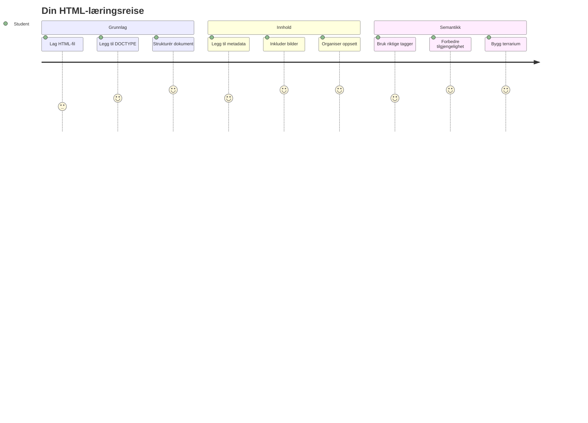
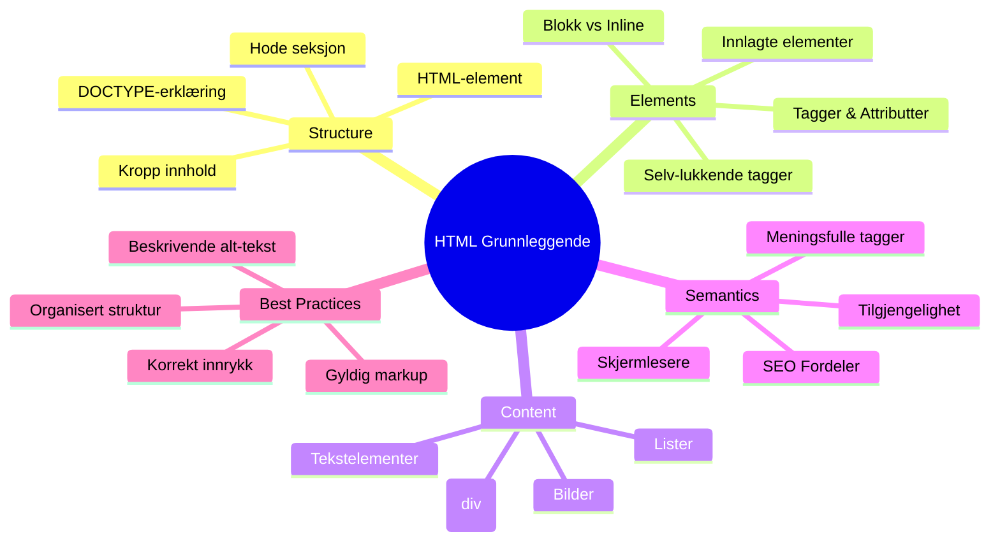
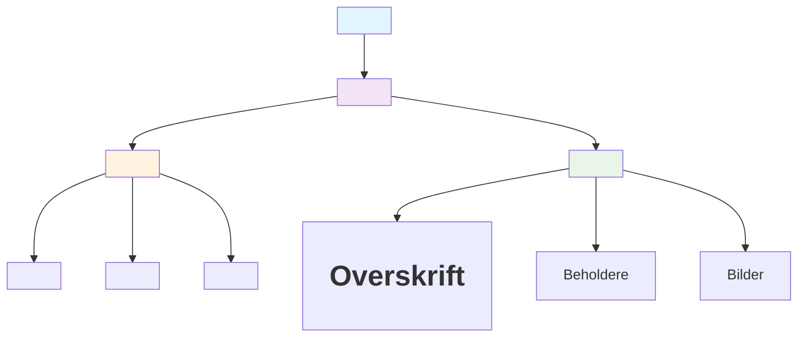
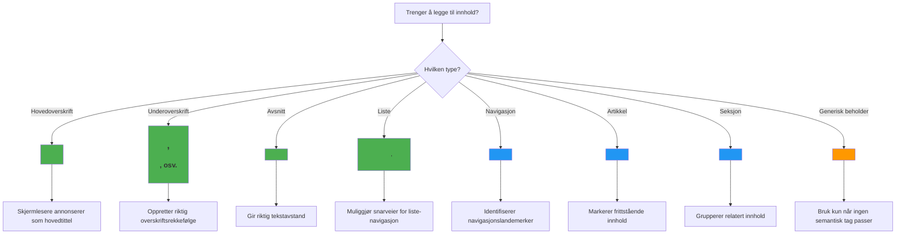
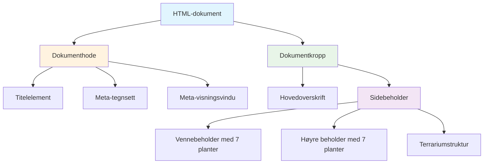
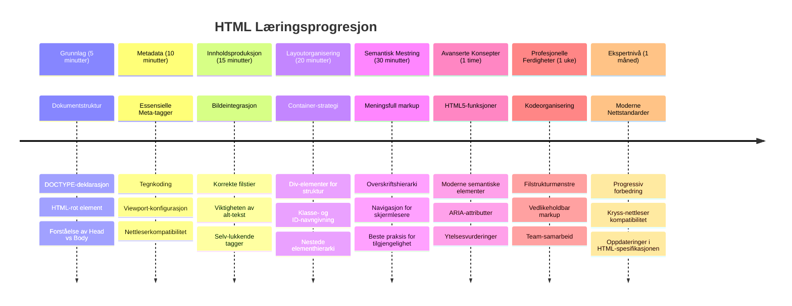

<!--
CO_OP_TRANSLATOR_METADATA:
{
  "original_hash": "3fcfa99c4897e051b558b5eaf1e8cc74",
  "translation_date": "2026-01-07T00:49:11+00:00",
  "source_file": "3-terrarium/1-intro-to-html/README.md",
  "language_code": "no"
}
-->
# Terrarium-prosjekt del 1: Introduksjon til HTML



> Sketchnote av [Tomomi Imura](https://twitter.com/girlie_mac)

HTML, eller HyperText Markup Language, er grunnlaget for alle nettsider du noen gang har besøkt. Tenk på HTML som skjelettet som gir struktur til nettsider – det definerer hvor innhold går, hvordan det organiseres, og hva hver del representerer. Mens CSS senere "kler opp" ditt HTML med farger og oppsett, og JavaScript bringer det til liv med interaktivitet, gir HTML den nødvendige strukturen som gjør alt annet mulig.

I denne leksjonen skal du lage HTML-strukturen for et virtuelt terrarium-grensesnitt. Dette praktiske prosjektet vil lære deg grunnleggende HTML-konsepter mens du bygger noe visuelt engasjerende. Du vil lære hvordan du organiserer innhold med semantiske elementer, jobber med bilder, og lager grunnlaget for en interaktiv webapplikasjon.

Ved slutten av denne leksjonen vil du ha en fungerende HTML-side som viser plantebilder i organiserte kolonner, klar for styling i neste leksjon. Ikke bekymre deg om det ser enkelt ut i starten – det er akkurat slik HTML skal være før CSS legger til den visuelle poleringen.


## Quiz før forelesning

[Quiz før forelesning](https://ff-quizzes.netlify.app/web/quiz/15)

> 📺 **Se og lær**: Se denne nyttige videooversikten
> 
> [](https://www.youtube.com/watch?v=1TvxJKBzhyQ)

## Sette opp prosjektet ditt

Før vi dykker inn i HTML-koden, la oss sette opp et ordentlig arbeidsområde for terrarium-prosjektet ditt. Å lage en organisert mappestruktur fra begynnelsen er en viktig vane som vil tjene deg godt gjennom hele webutviklingsreisen.

### Oppgave: Lag prosjektstrukturen din

Du skal lage en dedikert mappe for terrarium-prosjektet ditt og legge til din første HTML-fil. Her er to ulike metoder du kan bruke:

**Alternativ 1: Bruke Visual Studio Code**
1. Åpne Visual Studio Code
2. Klikk "File" → "Open Folder" eller bruk `Ctrl+K, Ctrl+O` (Windows/Linux) eller `Cmd+K, Cmd+O` (Mac)
3. Opprett en ny mappe kalt `terrarium` og velg den
4. I Explorer-panelet, klikk på ikonet for "New File"
5. Gi filen navnet `index.html`


**Alternativ 2: Bruke terminalkommandoer**
```bash
mkdir terrarium
cd terrarium
touch index.html
code index.html
```

**Dette oppnår disse kommandoene:**
- **Oppretter** en ny katalog kalt `terrarium` for prosjektet ditt
- **Går inn i** terrarium-mappen
- **Oppretter** en tom `index.html` fil
- **Åpner** filen i Visual Studio Code for redigering

> 💡 **Proftips**: Filnavnet `index.html` er spesielt i webutvikling. Når noen besøker en nettside, leter nettlesere automatisk etter `index.html` som standardside å vise. Det betyr at en URL som `https://mysite.com/projects/` automatisk vil vise `index.html`-filen i `projects`-mappen uten at du trenger å spesifisere filnavnet i URL-en.

## Forstå HTML-dokumentstruktur

Hvert HTML-dokument følger en spesifikk struktur som nettlesere må forstå og vise riktig. Tenk på denne strukturen som et formelt brev – den har påkrevde elementer i en bestemt rekkefølge som hjelper mottakeren (nettleseren) med å prosessere innholdet på riktig måte.


La oss starte med å legge til det essensielle grunnlaget som hvert HTML-dokument trenger.

### DOCTYPE-deklarasjonen og rootelementet

De to første linjene i en hvilken som helst HTML-fil fungerer som dokumentets "introduksjon" til nettleseren:

```html
<!DOCTYPE html>
<html></html>
```

**Forstå hva denne koden gjør:**
- **Deklarerer** dokumenttypen som HTML5 med `<!DOCTYPE html>`
- **Oppretter** rootelementet `<html>` som vil inneholde alt innhold på siden
- **Etablerer** moderne webstandarder for korrekt nettleserrendering
- **Sikrer** jevn visning på tvers av ulike nettlesere og enheter

> 💡 **VS Code tips**: Hold musepekeren over en hvilken som helst HTML-tag i VS Code for å se nyttig informasjon fra MDN Web Docs, inkludert bruker-eksempler og nettleserkompatibilitet.

> 📚 **Lær mer**: DOCTYPE-deklarasjonen hindrer nettlesere i å gå i "quirks mode," som ble brukt for å støtte svært gamle nettsider. Moderne webutvikling bruker den enkle `<!DOCTYPE html>` deklarasjonen for å sikre [standard-kompatibel rendering](https://developer.mozilla.org/docs/Web/HTML/Quirks_Mode_and_Standards_Mode).

### 🔄 **Pedagogisk sjekk**
**Pause og reflekter**: Før du fortsetter, sørg for at du forstår:
- ✅ Hvorfor hvert HTML-dokument trenger en DOCTYPE-deklarasjon
- ✅ Hva rootelementet `<html>` inneholder
- ✅ Hvordan denne strukturen hjelper nettlesere med å gjengi sidene riktig

**Rask selvtest**: Kan du forklare med dine egne ord hva "standard-kompatibel rendering" betyr?

## Legge til essensiell dokumentmetadata

`<head>`-delen i et HTML-dokument inneholder viktig informasjon som nettlesere og søkemotorer trenger, men som besøkende ikke ser direkte på siden. Tenk på det som "bak kulissene"-informasjonen som hjelper nettsiden din å fungere riktig og vises korrekt på ulike enheter og plattformer.

Denne metadataen forteller nettlesere hvordan de skal vise siden, hvilken tegnkoding de skal bruke, og hvordan de skal håndtere ulike skjermstørrelser – alt essensielt for å lage profesjonelle, tilgjengelige nettsider.

### Oppgave: Legg til dokumenthode

Sett inn denne `<head>`-seksjonen mellom dine åpne og lukkede `<html>`-tagger:

```html
<head>
	<title>Welcome to my Virtual Terrarium</title>
	<meta charset="utf-8" />
	<meta http-equiv="X-UA-Compatible" content="IE=edge" />
	<meta name="viewport" content="width=device-width, initial-scale=1" />
</head>
```

**Hva hvert element gjør:**
- **Setter** sidetittel som vises i nettleserfaner og søkeresultater
- **Spesifiserer** UTF-8 tegnkoding for riktig visning av tekst over hele verden
- **Sikrer** kompatibilitet med moderne versjoner av Internet Explorer
- **Konfigurerer** responsivt design ved å sette viewporten til enhetsbredde
- **Kontrollerer** startzoomen for å vise innhold i naturlig størrelse

> 🤔 **Tenk over dette**: Hva ville skjedd hvis du satt en viewport-meta tag som dette: `<meta name="viewport" content="width=600">`? Dette ville tvinge siden til alltid å være 600 piksler bred, og bryte responsivt design! Lær mer om [korrekt viewport-konfigurasjon](https://developer.mozilla.org/docs/Web/HTML/Viewport_meta_tag).

## Bygge dokumentets kropp

`<body>`-elementet inneholder alt synlig innhold på nettsiden – alt brukeren ser og kan interagere med. Mens `<head>`-delen ga instruksjoner til nettleseren, inneholder `<body>` den faktiske innholdet: tekst, bilder, knapper og andre elementer som lager brukergrensesnittet.

La oss legge til kroppens struktur og forstå hvordan HTML-tagger samhandler for å lage meningsfylt innhold.

### Forstå HTML-taggstruktur

HTML bruker parvise tagger for å definere elementer. De fleste tagger har en åpningstagg som `<p>` og en avslutningstagg som `</p>`, med innhold mellom: `<p>Hei, verden!</p>`. Dette lager et paragraf-element som inneholder teksten "Hei, verden!".

### Oppgave: Legg til body-elementet

Oppdater HTML-filen din til å inkludere `<body>`-elementet:

```html
<!DOCTYPE html>
<html>
	<head>
		<title>Welcome to my Virtual Terrarium</title>
		<meta charset="utf-8" />
		<meta http-equiv="X-UA-Compatible" content="IE=edge" />
		<meta name="viewport" content="width=device-width, initial-scale=1" />
	</head>
	<body></body>
</html>
```

**Dette gir den komplette strukturen:**
- **Etablerer** det grunnleggende HTML5 dokumentrammeverket
- **Inkluderer** essensiell metadata for korrekt nettleserrendering
- **Lager** en tom kropp klar for synlig innhold
- **Følger** moderne webutviklings beste praksis

Nå er du klar til å legge til synlige elementer i terrariet ditt. Vi bruker `<div>`-elementer som beholdere for å organisere forskjellige innholdsseksjoner, og ``-elementer for å vise plantebildene.

### Jobbe med bilder og layout-beholdere

Bilder er spesielle i HTML fordi de bruker "selvlukkende" tagger. I motsetning til elementer som `<p></p>` som omslutter innhold, inneholder ``-taggen all nødvendig informasjon innenfor seg selv ved hjelp av attributter som `src` for bildefil-lokasjon og `alt` for tilgjengelighet.

Før du legger til bilder i HTML-en din, må du organisere prosjektfilene dine riktig ved å lage en mappe for bilder og legge til plantegrafikkene.

**Først, sett opp bildene dine:**
1. Lag en mappe kalt `images` inne i terrarium-prosjektmappen din
2. Last ned plantebildene fra [løsningsmappen](../../../../3-terrarium/solution/images) (14 plantebilder totalt)
3. Kopier alle plantebildene over i den nye `images`-mappen

### Oppgave: Lag layout for plantevisning

Legg nå til plantebildene organisert i to kolonner mellom dine `<body></body>`-tagger:

```html
<div id="page">
	<div id="left-container" class="container">
		<div class="plant-holder">
			
		</div>
		<div class="plant-holder">
			
		</div>
		<div class="plant-holder">
			
		</div>
		<div class="plant-holder">
			
		</div>
		<div class="plant-holder">
			
		</div>
		<div class="plant-holder">
			
		</div>
		<div class="plant-holder">
			
		</div>
	</div>
	<div id="right-container" class="container">
		<div class="plant-holder">
			
		</div>
		<div class="plant-holder">
			
		</div>
		<div class="plant-holder">
			
		</div>
		<div class="plant-holder">
			
		</div>
		<div class="plant-holder">
			
		</div>
		<div class="plant-holder">
			
		</div>
		<div class="plant-holder">
			
		</div>
	</div>
</div>
```

**Steg for steg, dette skjer i koden:**
- **Oppretter** en hovedsidebeholder med `id="page"` for å holde alt innhold
- **Etablerer** to kolonnebeholdere: `left-container` og `right-container`
- **Organiserer** 7 planter i venstre kolonne og 7 planter i høyre kolonne
- **Pakker** hvert plantebilde i en `plant-holder` div for individuell posisjonering
- **Bruker** konsekvente klassenavn for CSS-styling i neste leksjon
- **Tildeler** unike ID-er til hvert plantebilde for JavaScript-interaksjon senere
- **Inkluderer** riktige filbaner som peker til bilder-mappen

> 🤔 **Tenk over dette**: Legg merke til at alle bildene har samme alternative tekst "plant" akkurat nå. Dette er ikke ideelt for tilgjengelighet. Skjermlesere vil høre "plant" 14 ganger uten å vite hvilke spesifikke planter hvert bilde viser. Kan du tenke deg bedre, mer beskrivende alt-tekster for hvert bilde?

> 📝 **HTML-elementtyper**: `<div>`-elementer er "blokknivå" og tar opp full bredde, mens `<span>`-elementer er "inline" og tar kun opp nødvendig bredde. Hva tror du ville skjedd hvis du endret alle disse `<div>`-taggene til `<span>`-tagger?

### 🔄 **Pedagogisk sjekk**
**Forståelse av struktur**: Ta et øyeblikk til å gjennomgå HTML-strukturen din:
- ✅ Kan du identifisere hovedbeholderne i layouten din?
- ✅ Forstår du hvorfor hvert bilde har en unik ID?
- ✅ Hvordan vil du beskrive formålet til `plant-holder`-divene?

**Visuell inspeksjon**: Åpne HTML-filen i en nettleser. Du skal se:
- En enkel liste med plantebilder
- Bilder organisert i to kolonner
- Enkel, ustylet layout

**Husk**: Dette enkle utseendet er akkurat hvordan HTML skal se ut før CSS-styling!

Med denne markupen lagt til vil plantene vises på skjermen, selv om det ikke ser polert ut ennå – det er CSS sin jobb i neste leksjon! For nå har du et solid HTML-grunnlag som ordentlig organiserer innholdet ditt og følger beste praksis for tilgjengelighet.

## Bruke semantisk HTML for tilgjengelighet

Semantisk HTML betyr å velge HTML-elementer basert på deres mening og hensikt, ikke bare utseende. Når du bruker semantisk markup, kommuniserer du struktur og mening av innholdet ditt til nettlesere, søkemotorer og hjelpemidler som skjermlesere.


Denne tilnærmingen gjør nettstedene dine mer tilgjengelige for brukere med funksjonsnedsettelser og hjelper søkemotorer å bedre forstå innholdet ditt. Det er et grunnleggende prinsipp i moderne webutvikling som skaper bedre opplevelser for alle.

### Legge til en semantisk sidetittel

La oss legge til en passende overskrift på terrarium-siden din. Sett inn denne linjen rett etter åpningstaggen `<body>`:

```html
<h1>My Terrarium</h1>
```

**Hvorfor semantisk markup er viktig:**
- **Hjelper** skjermlesere med å navigere og forstå sidestrukturen
- **Forbedrer** søkemotoroptimalisering (SEO) ved å klargjøre innholdshierarki
- **Øker** tilgjengeligheten for brukere med synshemninger eller kognitive forskjeller
- **Skaper** bedre brukeropplevelser på alle enheter og plattformer
- **Følger** webstandarder og beste praksis for profesjonell utvikling

**Eksempler på semantiske vs. ikke-semantiske valg:**

| Formål | ✅ Semantisk valg | ❌ Ikke-semantisk valg |
|---------|-------------------|------------------------|
| Hovedoverskrift | `<h1>Title</h1>` | `<div class="big-text">Title</div>` |
| Navigasjon | `<nav><ul><li></li></ul></nav>` | `<div class="menu"><div></div></div>` |
| Knapp | `<button>Click me</button>` | `<span onclick="...">Click me</span>` |
| Artikkelinnhold | `<article><p></p></article>` | `<div class="content"><div></div></div>` |

> 🎥 **Se det i praksis**: Se [hvordan skjermlesere interagerer med nettsider](https://www.youtube.com/watch?v=OUDV1gqs9GA) for å forstå hvorfor semantisk markup er avgjørende for tilgjengelighet. Legg merke til hvordan riktig HTML-struktur hjelper brukere å navigere effektivt.

## Lage terrarium-beholderen

Nå skal vi legge til HTML-strukturen for selve terrariet – glassbeholderen hvor plantene til slutt vil plasseres. Denne seksjonen demonstrerer et viktig konsept: HTML gir struktur, men uten CSS-styling vil ikke disse elementene være synlige ennå.

Terrarium-markupen bruker beskrivende klassenavn som vil gjøre CSS-stylingen intuitiv og vedlikeholdbar i neste leksjon.

### Oppgave: Legg til terrarium-strukturen

Sett inn denne markupen over den siste `</div>`-taggen (før avslutningstaggen til sidebeholderen):

```html
<div id="terrarium">
	<div class="jar-top"></div>
	<div class="jar-walls">
		<div class="jar-glossy-long"></div>
		<div class="jar-glossy-short"></div>
	</div>
	<div class="dirt"></div>
	<div class="jar-bottom"></div>
</div>
```

**Forstå denne terrarium-strukturen:**
- **Oppretter** en hovedterrarium-beholder med en unik ID for styling  

- **Definerer** separate elementer for hver visuell komponent (topp, vegger, jord, bunn)
- **Inkluderer** nestede elementer for glassrefleksjonseffekter (glinsende elementer)
- **Bruker** beskrivende klassenavn som klart indikerer hvert elements formål
- **Forbereder** strukturen for CSS-styling som vil skape terrariets glassutseende

> 🤔 **Merker du noe?**: Selv om du la til denne markupen, ser du ingenting nytt på siden! Dette illustrerer perfekt hvordan HTML gir struktur mens CSS gir utseende. Disse `<div>`-elementene eksisterer, men har ingen visuell styling ennå – det kommer i neste leksjon!


### 🔄 **Pedagogisk innsjekking**
**Beherskelse av HTML-struktur**: Før du går videre, sørg for at du kan:
- ✅ Forklare forskjellen mellom HTML-struktur og visuelt utseende
- ✅ Identifisere semantiske vs. ikke-semantiske HTML-elementer
- ✅ Beskrive hvordan riktig markup gagner tilgjengelighet
- ✅ Gjenkjenne dokumenttreets fullstendige struktur

**Test din forståelse**: Prøv å åpne HTML-filen i en nettleser med JavaScript deaktivert og CSS fjernet. Dette viser den rene semantiske strukturen du har laget!

---

## GitHub Copilot Agent-utfordring

Bruk Agent-modus for å fullføre følgende utfordring:

**Beskrivelse:** Lag en semantisk HTML-struktur for en seksjon om plantepleie som kan legges til terrarium-prosjektet.

**Oppgave:** Lag en semantisk HTML-seksjon som inkluderer en hovedoverskrift "Plant Care Guide", tre underseksjoner med overskrifter "Watering", "Light Requirements" og "Soil Care", hver med et avsnitt med informasjon om plantepleie. Bruk riktige semantiske HTML-tagger som `<section>`, `<h2>`, `<h3>`, og `<p>` for å strukturere innholdet passende.

Lær mer om [agent mode](https://code.visualstudio.com/blogs/2025/02/24/introducing-copilot-agent-mode) her.

## Utforsk HTML-historie-utfordring

**Lær om webutviklingen**

HTML har utviklet seg betydelig siden Tim Berners-Lee laget den første nettleseren på CERN i 1990. Noen eldre tagger som `<marquee>` er nå foreldet fordi de ikke fungerer godt med moderne tilgjengelighetsstandarder og prinsipper for responsivt design.

**Prøv dette eksperimentet:**
1. Pakk midlertidig inn `<h1>`-tittelen din i en `<marquee>`-tagg: `<marquee><h1>My Terrarium</h1></marquee>`
2. Åpne siden i en nettleser og observer rulleffekten
3. Tenk over hvorfor denne taggen ble avviklet (tips: tenk på brukeropplevelse og tilgjengelighet)
4. Fjern `<marquee>`-taggen og gå tilbake til semantisk markup

**Refleksjonsspørsmål:**
- Hvordan kan en rullende tittel påvirke brukere med synshemming eller bevegelsesfølsomhet?
- Hvilke moderne CSS-teknikker kan oppnå lignende visuelle effekter på en mer tilgjengelig måte?
- Hvorfor er det viktig å bruke dagens webstandarder i stedet for foreldede elementer?

Utforsk mer om [utdaterte og foreldede HTML-elementer](https://developer.mozilla.org/docs/Web/HTML/Element#Obsolete_and_deprecated_elements) for å forstå hvordan webstandarder utvikler seg for å forbedre brukeropplevelsen.


## Quiz etter forelesning

[Quiz etter forelesning](https://ff-quizzes.netlify.app/web/quiz/16)

## Gjennomgang og Selvstudium

**Fordyp deg i HTML-kunnskap**

HTML har vært grunnlaget for nettet i over 30 år, og har utviklet seg fra et enkelt dokumentmarkeringsspråk til en sofistikert plattform for å bygge interaktive applikasjoner. Å forstå denne utviklingen hjelper deg å sette pris på moderne webstandarder og ta bedre utviklingsvalg.

**Anbefalte læringsveier:**

1. **HTML-historie og utvikling**
   - Undersøk tidslinjen fra HTML 1.0 til HTML5
   - Utforsk hvorfor enkelte tagger ble avviklet (tilgjengelighet, mobilvennlighet, vedlikeholdbarhet)
   - Undersøk nye HTML-funksjoner og forslag

2. **Dypdykk i semantisk HTML**
   - Studer den fullstendige listen over [HTML5 semantiske elementer](https://developer.mozilla.org/docs/Web/HTML/Element)
   - Øv på å identifisere når du skal bruke `<article>`, `<section>`, `<aside>`, og `<main>`
   - Lær om ARIA-attributter for forbedret tilgjengelighet

3. **Moderne webutvikling**
   - Utforsk [å bygge responsive nettsteder](https://docs.microsoft.com/learn/modules/build-simple-website/?WT.mc_id=academic-77807-sagibbon) på Microsoft Learn
   - Forstå hvordan HTML integreres med CSS og JavaScript
   - Lær om webytelse og SEO beste praksis

**Refleksjonsspørsmål:**
- Hvilke foreldede HTML-tagger oppdaget du, og hvorfor ble de fjernet?
- Hvilke nye HTML-funksjoner foreslås for fremtidige versjoner?
- Hvordan bidrar semantisk HTML til webtilgjengelighet og SEO?

### ⚡ **Hva du kan gjøre de neste 5 minuttene**
- [ ] Åpne DevTools (F12) og inspiser HTML-strukturen til ditt favorittnettsted
- [ ] Lag en enkel HTML-fil med grunnleggende tagger: `<h1>`, `<p>`, og ``
- [ ] Valider HTML-en din med W3C HTML Validator online
- [ ] Prøv å legge til en kommentar i HTML-en din med `<!-- comment -->`

### 🎯 **Hva du kan oppnå denne timen**
- [ ] Fullfør quizen etter leksjonen og gå gjennom semantiske HTML-konsepter
- [ ] Lag en enkel nettside om deg selv med korrekt HTML-struktur
- [ ] Eksperimenter med forskjellige overskriftsnivåer og tekstformateringstags
- [ ] Legg til bilder og lenker for å øve på multimedia-integrering
- [ ] Undersøk HTML5-funksjoner du ikke har prøvd ennå

### 📅 **Din ukelange HTML-reise**
- [ ] Fullfør terrarium-prosjektoppgaven med semantisk markup
- [ ] Lag en tilgjengelig nettside med ARIA-labels og roller
- [ ] Øv på å lage skjemaer med ulike input-typer
- [ ] Utforsk HTML5 API-er som localStorage eller geolokasjon
- [ ] Studer responsive HTML-mønstre og mobil-først design
- [ ] Gå gjennom andres HTML-kode for god praksis

### 🌟 **Din månedslange webplattform**
- [ ] Lag en porteføljenettside som viser din HTML-ekspertise
- [ ] Lær HTML-templating med et rammeverk som Handlebars
- [ ] Bidra til open source-prosjekter ved å forbedre HTML-dokumentasjon
- [ ] Mestre avanserte HTML-konsepter som egendefinerte elementer
- [ ] Integrer HTML med CSS-rammeverk og JavaScript-biblioteker
- [ ] Veilede andre som lærer HTML-grunnleggende

## 🎯 Din HTML-mester-tidslinje


### 🛠️ Ditt HTML-verktøysettoppsummering

Etter å ha fullført denne leksjonen har du nå:
- **Dokumentstruktur**: Fullstendig HTML5-grunnlag med korrekt DOCTYPE
- **Semantisk markup**: Meningsfulle tagger som forbedrer tilgjengelighet og SEO
- **Bildeintegrasjon**: Riktig filorganisering og alt-tekst praksis
- **Layout-containere**: Strategisk bruk av div-er med beskrivende klassenavn
- **Tilgjengelighetsbevissthet**: Forståelse for skjermlesernavigasjon
- **Moderne standarder**: Nåværende HTML5-praksis og kunnskap om foreldede tagger
- **Prosjektgrunnlag**: Solid basis for CSS-styling og JavaScript-interaktivitet

**Neste steg**: Din HTML-struktur er klar for CSS-styling! Det semantiske fundamentet du har bygget vil gjøre neste leksjon mye enklere å forstå.


## Oppgave

[Øv deg på HTML: Lag en blogg-mockup](assignment.md)

---

<!-- CO-OP TRANSLATOR DISCLAIMER START -->
**Ansvarsfraskrivelse**:
Dette dokumentet er oversatt ved hjelp av AI-oversettingstjenesten [Co-op Translator](https://github.com/Azure/co-op-translator). Selv om vi streber etter nøyaktighet, vennligst vær oppmerksom på at automatiserte oversettelser kan inneholde feil eller unøyaktigheter. Det originale dokumentet på originalspråket skal betraktes som den autoritative kilden. For kritisk informasjon anbefales profesjonell menneskelig oversettelse. Vi er ikke ansvarlige for eventuelle misforståelser eller feiltolkninger som oppstår ved bruk av denne oversettelsen.
<!-- CO-OP TRANSLATOR DISCLAIMER END -->