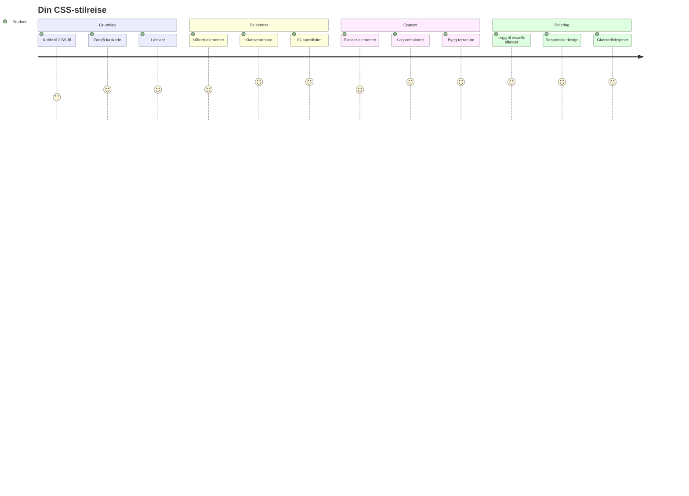
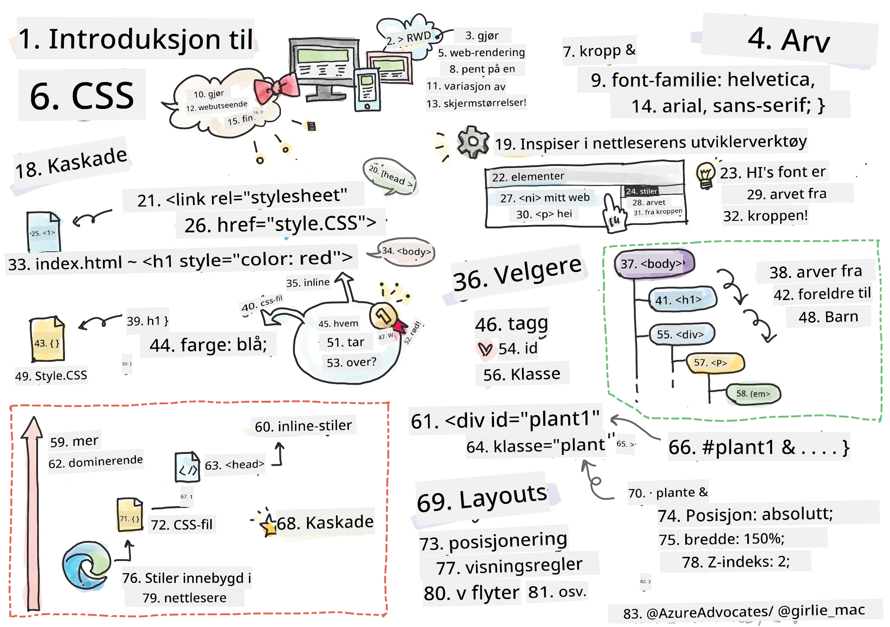
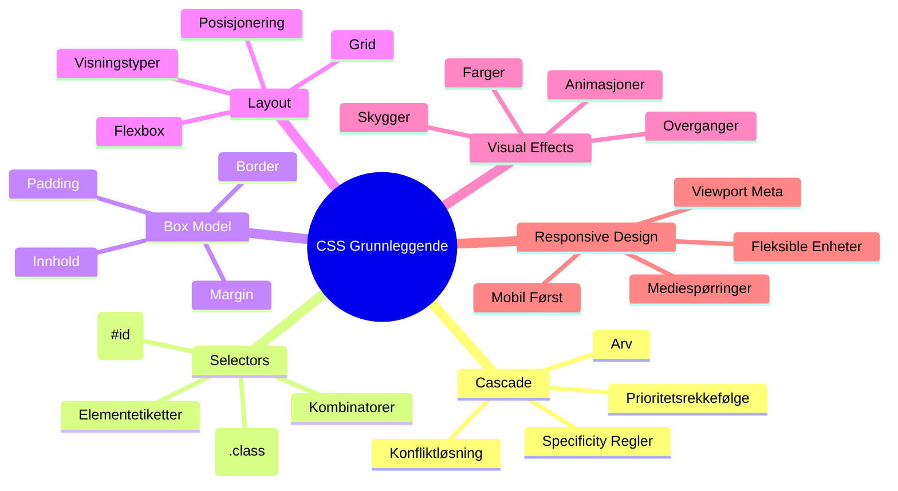
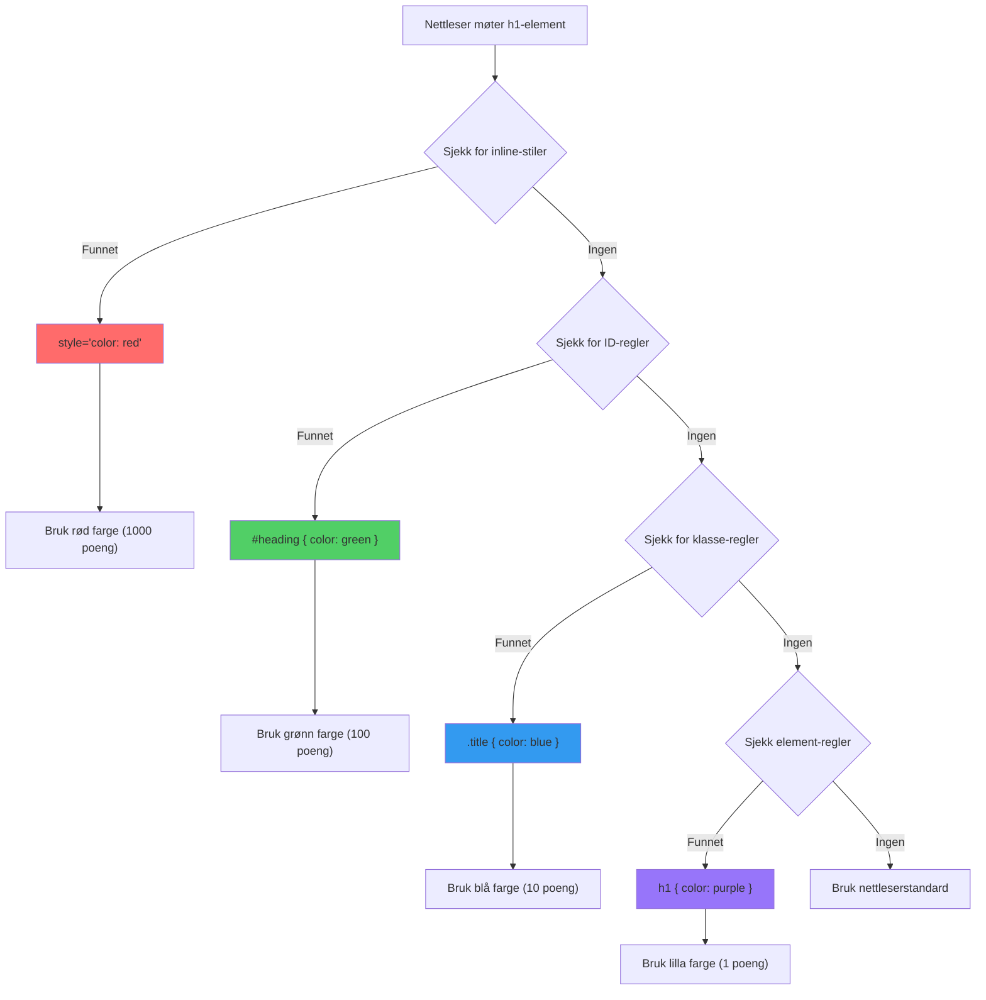
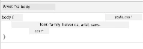
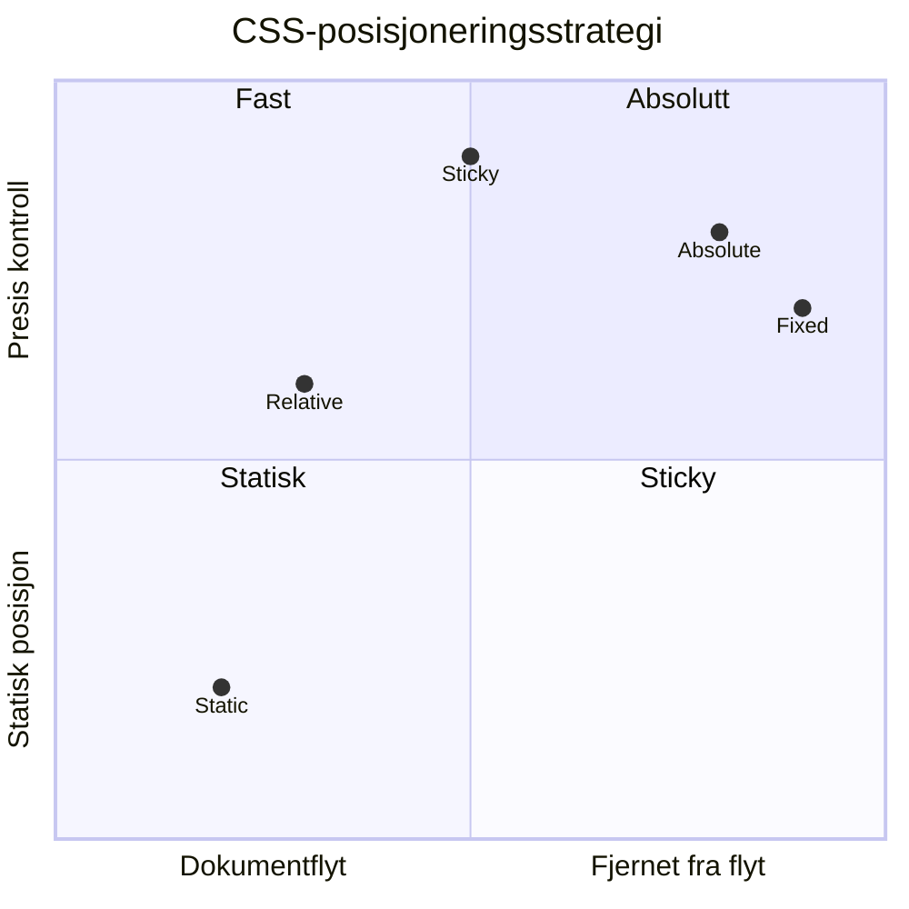
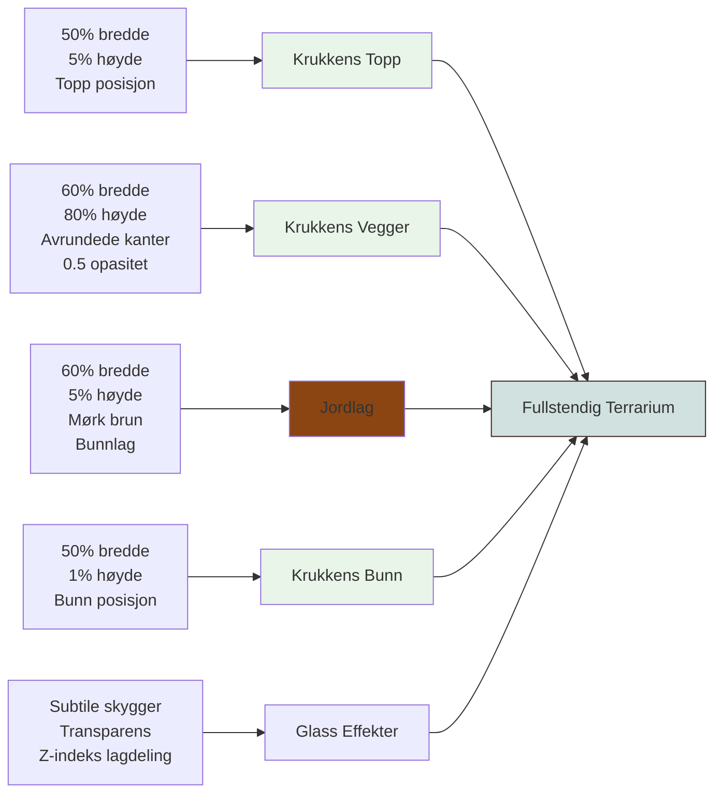
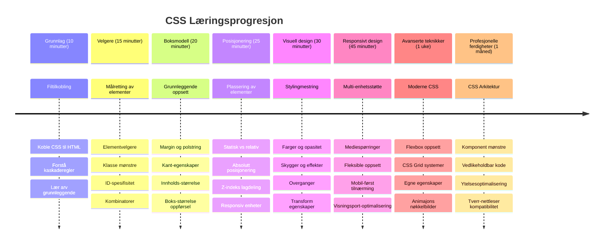

# Terrarium-prosjekt Del 2: Introduksjon til CSS



> Sketchnote av [Tomomi Imura](https://twitter.com/girlie_mac)

Husker du hvordan HTML-terrariet ditt så ganske enkelt ut? CSS er der vi forvandler den enkle strukturen til noe visuelt tiltalende.

Hvis HTML er som å bygge rammen til et hus, så er CSS alt som får det til å føles som hjemme – malingsfarger, møblering, belysning og hvordan rommene flyter sammen. Tenk på hvordan Versailles-palasset startet som en enkel jakthytte, men nøye oppmerksomhet på dekorasjon og layout forvandlet det til en av verdens mest praktfulle bygninger.

I dag skal vi forvandle terrariet ditt fra funksjonelt til polert. Du vil lære hvordan du plasserer elementer presist, får oppsett til å tilpasse seg forskjellige skjermstørrelser, og skaper det visuelle uttrykket som gjør nettsider engasjerende.

Ved slutten av denne leksjonen vil du se hvordan strategisk CSS-styling dramatisk kan forbedre prosjektet ditt. La oss tilføre litt stil til terrariet ditt.


## Forhåndsquiz

[Forhåndsquiz](https://ff-quizzes.netlify.app/web/quiz/17)

## Komme i gang med CSS

CSS blir ofte sett på som bare «å gjøre ting pene», men det har et mye bredere formål. CSS er som å være regissør for en film – du kontrollerer ikke bare hvordan alt ser ut, men også hvordan det beveger seg, reagerer på interaksjon, og tilpasser seg ulike situasjoner.

Moderne CSS er bemerkelsesverdig kapabel. Du kan skrive kode som automatisk justerer oppsett for telefoner, nettbrett og stasjonære datamaskiner. Du kan lage glatte animasjoner som leder brukerens oppmerksomhet dit det trengs. Resultatene kan være ganske imponerende når alt fungerer sammen.

> 💡 **Profftips**: CSS utvikler seg stadig med nye funksjoner og muligheter. Sjekk alltid [CanIUse.com](https://caniuse.com) for å verifisere nettleserstøtte for nyere CSS-funksjoner før du bruker dem i produksjonsprosjekter.

**Dette skal vi oppnå i denne leksjonen:**
- **Skaper** et komplett visuelt design for terrariet ditt med moderne CSS-teknikker
- **Utforsker** grunnleggende konsepter som kaskade, arv og CSS-velgere
- **Implementerer** responsiv posisjonering og oppsettsstrategier
- **Bygger** terrariets beholder ved bruk av CSS-former og styling

### Forutsetning

Du bør ha fullført HTML-strukturen for terrariet ditt fra forrige leksjon og ha det klart til styling.

> 📺 **Videoressurs**: Sjekk ut denne nyttige videoen
>
> [](https://www.youtube.com/watch?v=6yIdOIV9p1I)

### Sette opp CSS-filen din

Før vi kan starte med styling, må vi koble CSS til HTML-en vår. Denne forbindelsen forteller nettleseren hvor stylinginstruksjonene for terrariet vårt finnes.

I terrarimappen din lager du en ny fil kalt `style.css`, så lenker du til den i `<head>`-delen av HTML-dokumentet ditt:

```html
<link rel="stylesheet" href="./style.css" />
```

**Dette gjør koden:**
- **Oppretter** en forbindelse mellom HTML- og CSS-filene dine
- **Forteller** nettleseren å laste og bruke stilene fra `style.css`
- **Bruker** attributtet `rel="stylesheet"` for å spesifisere at dette er en CSS-fil
- **Refererer** filbanen med `href="./style.css"`

## Forståelse av CSS-kaskaden

Har du noen gang lurt på hvorfor CSS heter "Cascading Style Sheets"? Stiler faller som et fossestryk, og noen ganger kommer de i konflikt med hverandre.

Tenk på hvordan militære kommandostrukturer fungerer – en generalordre kan si "alle tropper skal bære grønt," men en spesifikk ordre til din enhet kan si "bruk dressblått til seremonien." Den mer spesifikke instruksen går foran. CSS følger lignende logikk, og å forstå denne hierarkien gjør feilsøking mye enklere.

### Eksperimentere med kaskadeprioritet

La oss se kaskaden i aksjon ved å skape en stilkonflikt. Først, legg til en inline-stil på `<h1>`-taggen din:

```html
<h1 style="color: red">My Terrarium</h1>
```

**Dette gjør koden:**
- **Setter** fargen rød direkte på `<h1>`-elementet ved bruk av inline-style
- **Bruker** `style`-attributtet for å legge CSS direkte inn i HTML-en
- **Skaper** stilen med høyest prioritet for dette spesifikke elementet

Neste, legg denne regelen til `style.css`-filen din:

```css
h1 {
  color: blue;
}
```

**Her har vi:**
- **Definert** en CSS-regel som målretter alle `<h1>`-elementene
- **Satt** tekstfargen til blå via et eksternt stylesheet
- **Laget** en regel med lavere prioritet sammenlignet med inline-stiler

✅ **Kunnskapssjekk**: Hvilken farge vises i webappen din? Hvorfor vinner den fargen? Kan du tenke deg situasjoner hvor det kan være ønskelig å overstyre stiler?


> 💡 **CSS prioriteringsrekkefølge (høyest til lavest):**
> 1. **Inline-stiler** (style-attributtet)
> 2. **ID-er** (#myId)
> 3. **Klasser** (.myClass) og attributter
> 4. **Elementvelgere** (h1, div, p)
> 5. **Nettleserstandarder**

## CSS-arv i praksis

CSS-arv fungerer som genetikk – elementer arver visse egenskaper fra sine overordnede elementer. Hvis du setter fontfamilien på `<body>`-elementet, bruker all tekst innenfor automatisk den samme fonten. Det er likt hvordan Habsburg-familiens karakteristiske kjeveform dukket opp over flere generasjoner uten at det var spesifisert for hver enkelt.

Men ikke alt blir arvet. Tekststiler som fonter og farger arves, men oppsetts-egenskaper som marger og rammer gjør ikke det. Akkurat som barn kan arve fysiske trekk, men ikke foreldrenes motepreferanser.

### Se på font-arv

La oss se arv i praksis ved å sette en fontfamilie på `<body>`-elementet:

```css
body {
  font-family: 'Segoe UI', Tahoma, Geneva, Verdana, sans-serif;
}
```

**Hva som skjer her:**
- **Setter** fontfamilien for hele siden ved å målrette `<body>`
- **Bruker** en font-stack med fallback-alternativer for bedre kompatibilitet i nettlesere
- **Benytter** moderne systemfonter som ser bra ut på ulike operativsystemer
- **Sikrer** at alle underordnede elementer arver denne fonten med mindre det overstyres eksplisitt

Åpne nettleserens utviklerverktøy (F12), gå til Elementer-fanen, og inspiser `<h1>`-elementet ditt. Du vil se at det arver fontfamilien fra body:



✅ **Eksperimenter**: Prøv å sette andre arvelige egenskaper på `<body>` som `color`, `line-height` eller `text-align`. Hva skjer med overskriften og andre elementer?

> 📝 **Arvelige egenskaper inkluderer**: `color`, `font-family`, `font-size`, `line-height`, `text-align`, `visibility`
>
> **Ikke-arvelige egenskaper inkluderer**: `margin`, `padding`, `border`, `width`, `height`, `position`

### 🔄 **Pedagogisk sjekk**
**Forståelse av CSS-grunnlag**: Før du går videre til velgere, bør du kunne:
- ✅ Forklare forskjellen mellom kaskade og arv
- ✅ Forutsi hvilken stil som vil vinne i en spesifisitetskonflikt
- ✅ Identifisere hvilke egenskaper som arves fra foreldreelementer
- ✅ Koble CSS-filer korrekt til HTML

**Rask test**: Hvis du har disse stilene, hvilken farge får et `<h1>` inne i en `<div class="special">`?  
```css
div { color: blue; }
.special { color: green; }
h1 { color: red; }
```
*Svar: Rød (elementvelgeren retter seg direkte mot h1)*

## Mestre CSS-velgere

CSS-velgere er måten du målretter bestemte elementer for styling. De fungerer som å gi presise anvisninger – i stedet for å si "huset", kan du si "det blå huset med den røde døren i Maple Street."

CSS tilbyr ulike måter å være spesifikk på, og det å velge riktig velger er som å velge det riktige verktøyet for en oppgave. Noen ganger må du style hver dør i nabolaget, andre ganger bare én bestemt dør.

### Elementvelgere (Tagger)

Elementvelgere målretter HTML-elementer etter taggnavn. De er perfekte for å sette grunnleggende stiler som gjelder over hele siden:

```css
body {
  font-family: 'Segoe UI', Tahoma, Geneva, Verdana, sans-serif;
  margin: 0;
  padding: 0;
}

h1 {
  color: #3a241d;
  text-align: center;
  font-size: 2.5rem;
  margin-bottom: 1rem;
}
```

**Forstå disse stilene:**
- **Setter** konsekvent typografi på hele siden med `body`-velgeren
- **Fjerner** nettleserens standard marger og padding for bedre kontroll
- **Styler** alle overskriftselementene med farge, justering og avstand
- **Bruker** `rem`-enheter for skalerbar og tilgjengelig fontstørrelse

Selv om elementvelgere fungerer godt for generell styling, trenger du mer spesifikke velgere for å style individuelle komponenter som plantene i terrariet ditt.

### ID-velgere for unike elementer

ID-velgere bruker `#`-symbolet og målretter elementer med spesifikke `id`-attributter. Siden ID-er må være unike på en side, er de perfekte for å style individuelle, spesielle elementer som beholderne for venstre og høyre plante.

La oss lage styling for terrariets sidebeholdere hvor plantene skal bo:

```css
#left-container {
  background-color: #f5f5f5;
  width: 15%;
  left: 0;
  top: 0;
  position: absolute;
  height: 100vh;
  padding: 1rem;
  box-sizing: border-box;
}

#right-container {
  background-color: #f5f5f5;
  width: 15%;
  right: 0;
  top: 0;
  position: absolute;
  height: 100vh;
  padding: 1rem;
  box-sizing: border-box;
}
```

**Dette oppnår koden:**
- **Plasserer** beholdere helt til venstre og høyre ved bruk av `absolute` posisjonering
- **Bruker** `vh` (viewport height)-enheter for responsiv høyde som tilpasser seg skjermstørrelsen
- **Setter** `box-sizing: border-box` slik at padding inkluderes i total bredde
- **Fjerner** unødvendige `px`-enheter fra nullverdier for renere kode
- **Setter** en subtil bakgrunnsfarge som er mer behagelig for øynene enn en skarp grå

✅ **Kodekvalitetsutfordring**: Legg merke til at denne CSS-en bryter med DRY-prinsippet (Don't Repeat Yourself). Kan du refaktorere den ved å bruke både ID og klasse?

**Forbedret tilnærming:**
```html
<div id="left-container" class="container"></div>
<div id="right-container" class="container"></div>
```

```css
.container {
  background-color: #f5f5f5;
  width: 15%;
  top: 0;
  position: absolute;
  height: 100vh;
  padding: 1rem;
  box-sizing: border-box;
}

#left-container {
  left: 0;
}

#right-container {
  right: 0;
}
```

### Klassevelgere for gjenbrukbare stiler

Klassevelgere bruker `.`-symbolet og er perfekte når du vil bruke de samme stilene på flere elementer. I motsetning til ID-er kan klasser gjenbrukes over hele HTML-en, noe som gjør dem ideelle for konsistente stilmønstre.

I terrariet vårt trenger hver plante lignende styling, men også individuell posisjonering. Vi vil bruke en kombinasjon av klasser for felles stiler og ID-er for unik posisjonering.

**Her er HTML-strukturen for hver plante:**
```html
<div class="plant-holder">
  
</div>
```

**Nøkkelelementer forklart:**
- **Bruker** `class="plant-holder"` for konsistent container-styling på tvers av alle planter
- **Setter** `class="plant"` for felles bildefunksjon og oppførsel
- **Inkluderer** unik `id="plant1"` for individuell posisjonering og JavaScript-interaksjon
- **Gir** beskrivende alt-tekst for skjermlesertilgjengelighet

Legg nå til disse stilene i `style.css`-filen din:

```css
.plant-holder {
  position: relative;
  height: 13%;
  left: -0.6rem;
}

.plant {
  position: absolute;
  max-width: 150%;
  max-height: 150%;
  z-index: 2;
  transition: transform 0.3s ease;
}

.plant:hover {
  transform: scale(1.05);
}
```

**Hva disse stilene gjør:**
- **Oppretter** relativ posisjonering for planteholderen for å etablere kontekst for posisjonering
- **Setter** hver planteholder til 13 % høyde, slik at alle planter får plass vertikalt uten rulling
- **Flytter** holderne litt mot venstre for bedre sentrering av plantene i beholderne
- **Tillater** plantene å skalere responsivt med `max-width` og `max-height`
- **Bruker** `z-index` for å legge plantene over andre elementer i terrariet
- **Legger til** en subtil hover-effekt med CSS-overganger for bedre brukerinteraksjon

✅ **Kritisk tenkning**: Hvorfor trenger vi både `.plant-holder` og `.plant` velgere? Hva ville skjedd hvis vi bare brukte én?

> 💡 **Designmønster**: Containeren (`.plant-holder`) styrer layout og posisjonering, mens innholdet (`.plant`) styrer utseende og skalering. Denne separasjonen gjør koden mer vedlikeholdbar og fleksibel.

## Forstå CSS-posisjonering

CSS-posisjonering er som å være regi for et teaterstykke – du bestemmer hvor hver skuespiller står og hvordan de beveger seg på scenen. Noen følger standard formasjon, mens andre trenger spesiell plassering for dramatisk effekt.

Når du forstår posisjonering, blir mange layoututfordringer håndterbare. Trenger du en navigasjonslinje som blir værende øverst mens brukeren blar? Posisjonering løser det. Vil du ha et verktøytips som dukker opp på et bestemt sted? Det er også posisjonering.

### De fem posisjonsverdiene


| Posisjonsverdi | Oppførsel | Bruksområde |
|----------------|-----------|-------------|
| `static` | Standardflyt, ignorerer top/left/right/bottom | Normal dokumentlayout |
| `relative` | Posisjonert relativt til sin normale plassering | Små justeringer, etablere posisjoneringskontekst |
| `absolute` | Posisjonert relativt til nærmeste posisjonerte forelder | Presis plassering, overlapp |
| `fixed` | Posisjonert relativt til viewporten | Navigasjonslinjer, flytende elementer |
| `sticky` | Bytter mellom relativ og fast basert på scroll | Overskrifter som fester seg ved scroll |

### Posisjonering i terrariet vårt

Terrariet benytter en strategisk kombinasjon av posisjonstyper for det ønskede oppsettet:

```css
/* Container positioning */
.container {
  position: absolute; /* Removes from normal flow */
  /* ... other styles ... */
}

/* Plant holder positioning */
.plant-holder {
  position: relative; /* Creates positioning context */
  /* ... other styles ... */
}

/* Plant positioning */
.plant {
  position: absolute; /* Allows precise placement within holder */
  /* ... other styles ... */
}
```

**Forstå posisjoneringsstrategien:**
- **Absolutte beholdere** fjernes fra normal dokumentflyt og festes til skjermkanter
- **Relative planteholdere** oppretter en posisjoneringskontekst samtidig som de forblir i dokumentflyten
- **Absolutte planter** kan plasseres presist innenfor sine relative beholdere
- **Kombinasjonen** lar plantene stables vertikalt samtidig som de kan posisjoneres individuelt

> 🎯 **Hvorfor dette er viktig**: `plant`-elementene trenger absolutt posisjonering for å bli dra-og-slippbare i neste leksjon. Absolutt posisjonering fjerner dem fra normal layoutflyt, noe som gjør dra-og-slipp-interaksjoner mulig.

✅ **Eksperimenter**: Prøv å endre posisjonsverdiene og observer resultatene:
- Hva skjer om du endrer `.container` fra `absolute` til `relative`?
- Hvordan endres layouten hvis `.plant-holder` bruker `absolute` i stedet for `relative`?
- Hva skjer når du bytter `.plant` til `relative` posisjonering?

### 🔄 **Pedagogisk innsjekking**
**CSS Posisjonering Mesterlig**: Ta en pause for å verifisere forståelsen din:
- ✅ Kan du forklare hvorfor planter trenger absolutt posisjonering for drag-and-drop?
- ✅ Forstår du hvordan relative beholdere skaper posisjoneringskontekst?
- ✅ Hvorfor bruker sidebeholderne absolutt posisjonering?
- ✅ Hva ville skjedd hvis du fjernet alle posisjoneringsdeklarasjoner helt?

**Reell Verden Kobling**: Tenk på hvordan CSS-posisjonering speiler reell verden layout:
- **Static**: Bøker på en hylle (naturlig rekkefølge)
- **Relative**: Flytte en bok litt men beholde plassen
- **Absolute**: Plassere et bokmerke på en eksakt sidenummer
- **Fixed**: En klistrelapp som forblir synlig mens du blar sider

## Bygge Terrariet med CSS

Nå skal vi bygge en glasskrukke kun med CSS – ingen bilder eller grafikkprogrammer nødvendig.

Å skape realistisk glass, skygger og dybdeeffekter ved å bruke posisjonering og transparens viser CSS sine visuelle muligheter. Denne teknikken speiler hvordan arkitekter innen Bauhaus-bevegelsen brukte enkle geometriske former for å lage komplekse, vakre strukturer. Når du forstår disse prinsippene, vil du kjenne igjen CSS-teknikkene bak mange nettdesign.



### Lage Komponentene til Glasskrukken

La oss bygge terrarium-krukken bit for bit. Hver del bruker absolutt posisjonering og prosentbaserte størrelser for responsivt design:

```css
.jar-walls {
  height: 80%;
  width: 60%;
  background: #d1e1df;
  border-radius: 1rem;
  position: absolute;
  bottom: 0.5%;
  left: 20%;
  opacity: 0.5;
  z-index: 1;
  box-shadow: inset 0 0 2rem rgba(0, 0, 0, 0.1);
}

.jar-top {
  width: 50%;
  height: 5%;
  background: #d1e1df;
  position: absolute;
  bottom: 80.5%;
  left: 25%;
  opacity: 0.7;
  z-index: 1;
  border-radius: 0.5rem 0.5rem 0 0;
}

.jar-bottom {
  width: 50%;
  height: 1%;
  background: #d1e1df;
  position: absolute;
  bottom: 0;
  left: 25%;
  opacity: 0.7;
  border-radius: 0 0 0.5rem 0.5rem;
}

.dirt {
  width: 60%;
  height: 5%;
  background: #3a241d;
  position: absolute;
  border-radius: 0 0 1rem 1rem;
  bottom: 1%;
  left: 20%;
  opacity: 0.7;
  z-index: -1;
}
```


**Forstå terrarium-konstruksjonen:**
- **Bruker** prosentbaserte dimensjoner for responsiv skalering på alle skjermstørrelser
- **Plasserer** elementer absolutt for å stable og justere dem presist
- **Bruker** ulike opasitetsverdier for å skape glasseffekten
- **Implementerer** `z-index` lagring slik at planter vises inni krukken
- **Legger til** subtile boksskygger og raffinert border-radius for mer realistisk utseende

### Responsivt Design med Prosenter

Legg merke til at alle dimensjonene bruker prosenter i stedet for faste piksler:

**Hvorfor dette er viktig:**
- **Sikrer** at terrariet skaleres proporsjonalt på hvilken som helst skjermstørrelse
- **Opprettholder** de visuelle forholdene mellom krukkens komponenter
- **Gir** en konsekvent opplevelse fra mobiltelefoner til store stasjonære skjermer
- **Lar** designen tilpasse seg uten å bryte layouten visuelt

### CSS-enheter i bruk

Vi bruker `rem`-enheter for border-radius, som skalerer relativt til rot-fontstørrelsen. Dette skaper mer tilgjengelige design som respekterer brukerens fontpreferanser. Les mer om [CSS relative units](https://www.w3.org/TR/css-values-3/#font-relative-lengths) i den offisielle spesifikasjonen.

✅ **Visuell eksperimentering**: Prøv å endre disse verdiene og se effektene:
- Endre jar-opasiteten fra 0.5 til 0.8 – hvordan påvirker det glassutseendet?
- Juster jordfargen fra `#3a241d` til `#8B4513` – hvilken visuell effekt får det?
- Endre `z-index` for jorden til 2 – hva skjer med lagringen?

### 🔄 **Pedagogisk innsjekking**
**Forståelse av visuell CSS-design**: Bekreft forståelsen din av visuell CSS:
- ✅ Hvordan skaper prosentbaserte dimensjoner responsiv design?
- ✅ Hvorfor skaper opasitet glasseffekten?
- ✅ Hvilken rolle spiller z-index i lagdelingen?
- ✅ Hvordan skaper border-radius verdiene krukkeformen?

**Designprinsipp**: Legg merke til hvordan vi bygger komplekse visuelle elementer fra enkle former:
1. **Rektangler** → **Avrundede rektangler** → **Krukkekomponenter**
2. **Flate farger** → **Opasitet** → **Glasseffekt**
3. **Individuelle elementer** → **Lagvis sammensetning** → **3D-utseende**

---

## GitHub Copilot Agent Challenge 🚀

Bruk Agent-modus for å fullføre denne utfordringen:

**Beskrivelse:** Lag en CSS-animasjon som får terrariumplantene til å svaie forsiktig fram og tilbake, som en naturlig bris. Dette hjelper deg å praktisere CSS-animasjoner, transformasjoner og keyframes samtidig som terrariet ditt får liv.

**Oppgave:** Legg til CSS keyframe-animasjoner for å få plantene i terrariet til å svaie forsiktig fra side til side. Lag en svingende animasjon som roterer hver plante svakt (2-3 grader) til venstre og høyre med en varighet på 3-4 sekunder, og anvend den på `.plant`-klassen. Sørg for at animasjonen går i loop og har en easing-funksjon for naturlig bevegelse.

Les mer om [agent mode](https://code.visualstudio.com/blogs/2025/02/24/introducing-copilot-agent-mode) her.

## 🚀 Utfordring: Legge til Glassrefleksjoner

Klar for å forbedre terrariet med realistiske glassrefleksjoner? Denne teknikken tilfører dybde og realisme til designen.

Du skal lage subtile høylys som simulerer hvordan lys reflekteres på glassoverflater. Denne tilnærmingen ligner på hvordan renessanse-malere som Jan van Eyck brukte lys og refleksjon for å få malt glass til å virke tredimensjonalt. Slik skal det bli:


**Din utfordring:**
- **Lag** subtile hvite eller lyse ovale former for glassrefleksjonene
- **Plasser** dem strategisk på venstre side av krukken
- **Bruk** passende opasitet og uskarphetseffekter for realistisk lysrefleksjon
- **Bruk** `border-radius` for å lage organiske, boblelignende former
- **Eksperimenter** med graderinger eller boksskygger for forbedret realisme

## Quiz etter forelesning

[Quiz etter forelesning](https://ff-quizzes.netlify.app/web/quiz/18)

## Utvid Dine CSS-Kunnskaper

CSS kan virke komplekst i starten, men når du forstår disse kjerneprinsippene får du et solid grunnlag for mer avanserte teknikker.

**Dine neste CSS-læringsområder:**
- **Flexbox** - forenkler justering og distribusjon av elementer
- **CSS Grid** - kraftige verktøy for å lage komplekse layouter
- **CSS Variabler** - reduserer gjentakelse og forbedrer vedlikehold
- **Responsivt design** - sikrer at nettsider fungerer godt på ulike skjermstørrelser

### Interaktive læringsressurser

Prøv disse konsepter med engasjerende, praktiske spill:
- 🐸 [Flexbox Froggy](https://flexboxfroggy.com/) - Mestre Flexbox gjennom morsomme utfordringer
- 🌱 [Grid Garden](https://codepip.com/games/grid-garden/) - Lær CSS Grid ved å dyrke virtuelle gulrøtter
- 🎯 [CSS Battle](https://cssbattle.dev/) - Test dine CSS-ferdigheter med kodingsutfordringer

### Ytterligere læring

For en omfattende innføring i CSS-fundamenter, fullfør denne Microsoft Learn-modulen: [Style your HTML app with CSS](https://docs.microsoft.com/learn/modules/build-simple-website/4-css-basics/?WT.mc_id=academic-77807-sagibbon)

### ⚡ **Hva du kan gjøre på de neste 5 minuttene**
- [ ] Åpne DevTools og inspiser CSS-stiler på en nettside via Elements-panelet
- [ ] Lag en enkel CSS-fil og koble den til en HTML-side
- [ ] Prøv å endre farger med forskjellige metoder: hex, RGB og navngitte farger
- [ ] Øv på boksen-modellen ved å legge til padding og margin på en div

### 🎯 **Hva du kan oppnå denne timen**
- [ ] Fullfør quiz etter leksjonen og gå gjennom CSS-fundamenter
- [ ] Style HTML-siden din med fonter, farger og marger
- [ ] Lag en enkel layout med flexbox eller grid
- [ ] Eksperimenter med CSS-overganger for myke effekter
- [ ] Øv på responsivt design med medieforespørsler

### 📅 **Din uke-lange CSS-reise**
- [ ] Fullfør terrarium-styling-oppgaven med kreativitet
- [ ] Mestre CSS Grid ved å bygge en fotogalleri-layout
- [ ] Lær CSS-animasjoner for å bringe designene til liv
- [ ] Utforsk CSS preprocessors som Sass eller Less
- [ ] Studer designprinsipper og bruk dem i CSS
- [ ] Analyser og gjenskap interessante design du finner på nettet

### 🌟 **Din månedslange designmestring**
- [ ] Bygg et komplett responsivt nettside-designsystem
- [ ] Lær CSS-in-JS eller utility-first rammeverk som Tailwind
- [ ] Bidra til open source-prosjekter med CSS-forbedringer
- [ ] Mestre avanserte CSS-konsepter som CSS egendefinerte egenskaper og containment
- [ ] Lag gjenbrukbare komponentbiblioteker med modulær CSS
- [ ] Veilede andre som lærer CSS og del designkunnskap

## 🎯 Din CSS-mestringstidslinje



### 🛠️ Din CSS-verktøykasse Oppsummering

Etter å ha fullført denne leksjonen har du nå:
- **Cascade-forståelse**: Hvordan stiler arves og overstyres
- **Selector-mesterlig**: Presis målretting med elementer, klasser og IDer
- **Posisjoneringsferdigheter**: Strategisk plassering og lagdeling av elementer
- **Visuell design**: Lage glasseffekter, skygger og transparens
- **Responsive teknikker**: Prosentbaserte layouter som tilpasser seg alle skjermer
- **Kodeorganisering**: Ren, vedlikeholdbar CSS-struktur
- **Moderne praksis**: Bruk av relative enheter og tilgjengelige designmønstre

**Neste steg**: Terrariet ditt har nå både struktur (HTML) og stil (CSS). Den siste leksjonen legger til interaktivitet med JavaScript!

## Oppgave

[CSS Refaktorering](assignment.md)

---

<!-- CO-OP TRANSLATOR DISCLAIMER START -->
**Ansvarsfraskrivelse**:
Dette dokumentet er oversatt ved bruk av AI-oversettelsestjenesten [Co-op Translator](https://github.com/Azure/co-op-translator). Selv om vi streber etter nøyaktighet, må du være klar over at automatiske oversettelser kan inneholde feil eller unøyaktigheter. Det opprinnelige dokumentet på originalspråket skal betraktes som den autoritative kilden. For kritisk informasjon anbefales profesjonell menneskelig oversettelse. Vi er ikke ansvarlige for eventuelle misforståelser eller feiltolkninger som oppstår ved bruk av denne oversettelsen.
<!-- CO-OP TRANSLATOR DISCLAIMER END -->