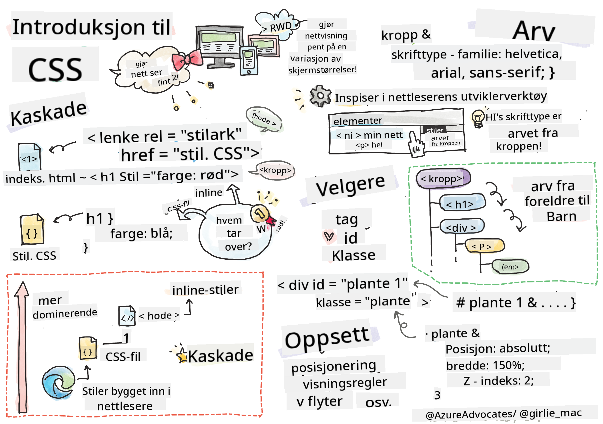
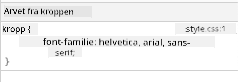
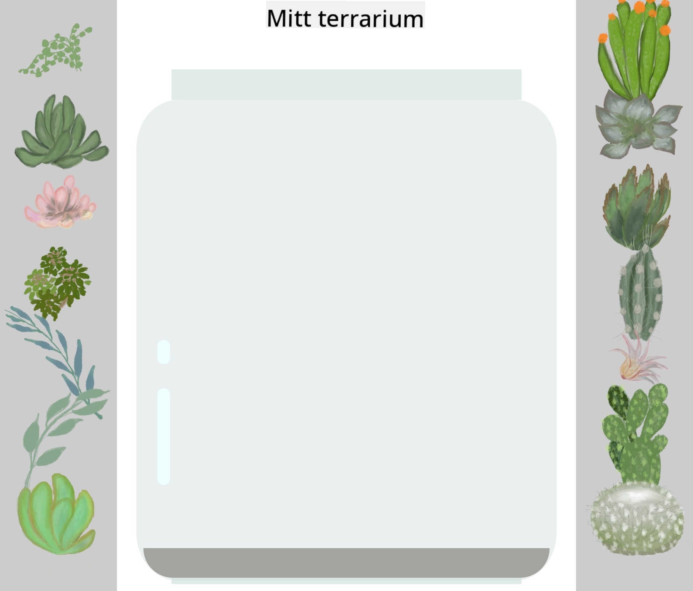

<!--
CO_OP_TRANSLATOR_METADATA:
{
  "original_hash": "92c4431eac70670b0450b02c1d11279a",
  "translation_date": "2025-10-23T22:28:19+00:00",
  "source_file": "3-terrarium/2-intro-to-css/README.md",
  "language_code": "no"
}
-->
# Terrarium Prosjekt Del 2: Introduksjon til CSS


> Sketchnote av [Tomomi Imura](https://twitter.com/girlie_mac)

Husker du hvordan HTML-terrariumet ditt så ganske enkelt ut? CSS er der vi forvandler den enkle strukturen til noe visuelt tiltalende.

Hvis HTML er som å bygge rammen til et hus, er CSS alt som får det til å føles som et hjem – malingsfarger, møblering, belysning og hvordan rommene flyter sammen. Tenk på hvordan Versailles-palasset startet som en enkel jaktlodge, men nøye oppmerksomhet til dekorasjon og layout forvandlet det til en av verdens mest praktfulle bygninger.

I dag skal vi forvandle terrariumet ditt fra funksjonelt til polert. Du vil lære hvordan du posisjonerer elementer presist, lager layout som tilpasser seg ulike skjermstørrelser, og skaper den visuelle appellen som gjør nettsteder engasjerende.

Ved slutten av denne leksjonen vil du se hvordan strategisk CSS-styling kan forbedre prosjektet ditt dramatisk. La oss legge til litt stil i terrariumet ditt.

## Quiz før forelesning

[Quiz før forelesning](https://ff-quizzes.netlify.app/web/quiz/17)

## Komme i gang med CSS

CSS blir ofte sett på som bare "å gjøre ting pene," men det har et mye bredere formål. CSS er som å være regissør for en film – du kontrollerer ikke bare hvordan alt ser ut, men også hvordan det beveger seg, reagerer på interaksjon og tilpasser seg ulike situasjoner.

Moderne CSS er utrolig kapabel. Du kan skrive kode som automatisk justerer layout for telefoner, nettbrett og stasjonære datamaskiner. Du kan lage jevne animasjoner som guider brukernes oppmerksomhet dit det trengs. Resultatene kan være ganske imponerende når alt fungerer sammen.

> 💡 **Proff-tips**: CSS utvikler seg stadig med nye funksjoner og kapabiliteter. Sjekk alltid [CanIUse.com](https://caniuse.com) for å verifisere nettleserstøtte for nyere CSS-funksjoner før du bruker dem i produksjonsprosjekter.

**Dette skal vi oppnå i denne leksjonen:**
- **Skaper** et komplett visuelt design for terrariumet ditt ved hjelp av moderne CSS-teknikker
- **Utforsker** grunnleggende konsepter som kaskade, arv og CSS-selektorer
- **Implementerer** responsive posisjonerings- og layoutstrategier
- **Bygger** terrariumbeholderen ved hjelp av CSS-former og styling

### Forutsetning

Du bør ha fullført HTML-strukturen for terrariumet ditt fra forrige leksjon og ha det klart til å styles.

> 📺 **Videoressurs**: Sjekk ut denne nyttige videoen
>
> [](https://www.youtube.com/watch?v=6yIdOIV9p1I)

### Sette opp CSS-filen din

Før vi kan begynne å style, må vi koble CSS til HTML-en vår. Denne koblingen forteller nettleseren hvor den finner stylinginstruksjonene for terrariumet vårt.

I terrarium-mappen din, opprett en ny fil kalt `style.css`, og koble den deretter til HTML-dokumentets `<head>`-seksjon:

```html
<link rel="stylesheet" href="./style.css" />
```

**Dette gjør koden:**
- **Oppretter** en kobling mellom HTML- og CSS-filene dine
- **Forteller** nettleseren å laste og bruke stilene fra `style.css`
- **Bruker** attributtet `rel="stylesheet"` for å spesifisere at dette er en CSS-fil
- **Refererer** til filbanen med `href="./style.css"`

## Forstå CSS-kaskaden

Har du noen gang lurt på hvorfor CSS kalles "Cascading" Style Sheets? Stiler kaskader ned som et fossefall, og noen ganger kommer de i konflikt med hverandre.

Tenk på hvordan militære kommandostrukturer fungerer – en generell ordre kan si "alle tropper skal ha på seg grønt," men en spesifikk ordre til enheten din kan si "ha på deg blå uniform til seremonien." Den mer spesifikke instruksjonen har forrang. CSS følger lignende logikk, og å forstå denne hierarkien gjør feilsøking mye enklere.

### Eksperimentere med kaskadeprioritet

La oss se kaskaden i aksjon ved å lage en stilkonflikt. Først, legg til en inline-stil i `<h1>`-taggen din:

```html
<h1 style="color: red">My Terrarium</h1>
```

**Hva denne koden gjør:**
- **Bruker** en rød farge direkte på `<h1>`-elementet ved hjelp av inline-styling
- **Bruker** attributtet `style` for å legge inn CSS direkte i HTML
- **Oppretter** den høyeste prioriteten for stilregelen for dette spesifikke elementet

Legg deretter til denne regelen i `style.css`-filen din:

```css
h1 {
  color: blue;
}
```

**I det ovennevnte har vi:**
- **Definert** en CSS-regel som retter seg mot alle `<h1>`-elementer
- **Satt** tekstfargen til blå ved hjelp av et eksternt stilark
- **Opprettet** en lavere prioritet regel sammenlignet med inline-stiler

✅ **Kunnskapssjekk**: Hvilken farge vises i webappen din? Hvorfor vinner den fargen? Kan du tenke på scenarier der du kanskje vil overstyre stiler?

> 💡 **CSS-prioritetsrekkefølge (høyest til lavest):**
> 1. **Inline-stiler** (style-attributt)
> 2. **ID-er** (#myId)
> 3. **Klasser** (.myClass) og attributter
> 4. **Element-selektorer** (h1, div, p)
> 5. **Nettleserens standardinnstillinger**

## CSS-arv i praksis

CSS-arv fungerer som genetikk – elementer arver visse egenskaper fra sine overordnede elementer. Hvis du setter fontfamilien på body-elementet, bruker all tekst inni automatisk den samme fonten. Det er som hvordan Habsburg-familiens karakteristiske kjeve dukket opp gjennom generasjoner uten å bli spesifisert for hver enkelt.

Men ikke alt blir arvet. Tekststiler som fonter og farger blir arvet, men layoutegenskaper som marginer og grenser blir ikke. Akkurat som barn kan arve fysiske trekk, men ikke foreldrenes klesvalg.

### Observere fontarv

La oss se arv i aksjon ved å sette en fontfamilie på `<body>`-elementet:

```css
body {
  font-family: 'Segoe UI', Tahoma, Geneva, Verdana, sans-serif;
}
```

**Bryte ned hva som skjer her:**
- **Setter** fontfamilien for hele siden ved å rette seg mot `<body>`-elementet
- **Bruker** en fontstabel med reservealternativer for bedre nettleserkompatibilitet
- **Bruker** moderne systemfonter som ser flotte ut på tvers av ulike operativsystemer
- **Sikrer** at alle barnelementer arver denne fonten med mindre det spesifikt overstyres

Åpne nettleserens utviklerverktøy (F12), naviger til Elements-fanen, og inspiser `<h1>`-elementet ditt. Du vil se at det arver fontfamilien fra body:



✅ **Eksperimenttid**: Prøv å sette andre arvelige egenskaper på `<body>` som `color`, `line-height` eller `text-align`. Hva skjer med overskriften din og andre elementer?

> 📝 **Arvelige egenskaper inkluderer**: `color`, `font-family`, `font-size`, `line-height`, `text-align`, `visibility`
>
> **Ikke-arvelige egenskaper inkluderer**: `margin`, `padding`, `border`, `width`, `height`, `position`

## Mestre CSS-selektorer

CSS-selektorer er din måte å rette seg mot spesifikke elementer for styling. De fungerer som å gi presise retninger – i stedet for å si "huset," kan du si "det blå huset med den røde døren på Maple Street."

CSS gir ulike måter å være spesifikk på, og å velge riktig selektor er som å velge det passende verktøyet for oppgaven. Noen ganger trenger du å style hver dør i nabolaget, og noen ganger bare én spesifikk dør.

### Element-selektorer (Tagger)

Element-selektorer retter seg mot HTML-elementer etter taggnavn. De er perfekte for å sette grunnleggende stiler som gjelder bredt over siden din:

```css
body {
  font-family: 'Segoe UI', Tahoma, Geneva, Verdana, sans-serif;
  margin: 0;
  padding: 0;
}

h1 {
  color: #3a241d;
  text-align: center;
  font-size: 2.5rem;
  margin-bottom: 1rem;
}
```

**Forstå disse stilene:**
- **Setter** konsistent typografi over hele siden med `body`-selektoren
- **Fjerner** standard nettlesermarginer og padding for bedre kontroll
- **Styler** alle overskriftselementer med farge, justering og avstand
- **Bruker** `rem`-enheter for skalerbar, tilgjengelig fontstørrelse

Mens element-selektorer fungerer godt for generell styling, trenger du mer spesifikke selektorer for å style individuelle komponenter som plantene i terrariumet ditt.

### ID-selektorer for unike elementer

ID-selektorer bruker symbolet `#` og retter seg mot elementer med spesifikke `id`-attributter. Siden ID-er må være unike på en side, er de perfekte for å style individuelle, spesielle elementer som våre venstre og høyre plantebeholdere.

La oss lage stylingen for terrariumets sidebeholdere der plantene skal bo:

```css
#left-container {
  background-color: #f5f5f5;
  width: 15%;
  left: 0;
  top: 0;
  position: absolute;
  height: 100vh;
  padding: 1rem;
  box-sizing: border-box;
}

#right-container {
  background-color: #f5f5f5;
  width: 15%;
  right: 0;
  top: 0;
  position: absolute;
  height: 100vh;
  padding: 1rem;
  box-sizing: border-box;
}
```

**Dette oppnår koden:**
- **Posisjonerer** beholdere ved de ytterste venstre og høyre kantene ved hjelp av `absolute` posisjonering
- **Bruker** `vh` (viewport height) enheter for responsiv høyde som tilpasser seg skjermstørrelse
- **Bruker** `box-sizing: border-box` slik at padding inkluderes i totalbredden
- **Fjerner** unødvendige `px`-enheter fra nullverdier for renere kode
- **Setter** en subtil bakgrunnsfarge som er mer behagelig for øynene enn skarp grå

✅ **Kodekvalitetsutfordring**: Legg merke til hvordan denne CSS-en bryter DRY (Don't Repeat Yourself)-prinsippet. Kan du refaktorere den ved å bruke både en ID og en klasse?

**Forbedret tilnærming:**
```html
<div id="left-container" class="container"></div>
<div id="right-container" class="container"></div>
```

```css
.container {
  background-color: #f5f5f5;
  width: 15%;
  top: 0;
  position: absolute;
  height: 100vh;
  padding: 1rem;
  box-sizing: border-box;
}

#left-container {
  left: 0;
}

#right-container {
  right: 0;
}
```

### Klasse-selektorer for gjenbrukbare stiler

Klasse-selektorer bruker symbolet `.` og er perfekte når du vil bruke de samme stilene på flere elementer. I motsetning til ID-er kan klasser gjenbrukes gjennom hele HTML-en din, noe som gjør dem ideelle for konsistente stylingsmønstre.

I terrariumet vårt trenger hver plante lignende styling, men også individuell posisjonering. Vi vil bruke en kombinasjon av klasser for delte stiler og ID-er for unik posisjonering.

**Her er HTML-strukturen for hver plante:**
```html
<div class="plant-holder">
  
</div>
```

**Viktige elementer forklart:**
- **Bruker** `class="plant-holder"` for konsistent beholderstyling på tvers av alle planter
- **Bruker** `class="plant"` for delte bildestiler og oppførsel
- **Inkluderer** unik `id="plant1"` for individuell posisjonering og JavaScript-interaksjon
- **Gir** beskrivende alt-tekst for skjermlesertilgjengelighet

Legg nå til disse stilene i `style.css`-filen din:

```css
.plant-holder {
  position: relative;
  height: 13%;
  left: -0.6rem;
}

.plant {
  position: absolute;
  max-width: 150%;
  max-height: 150%;
  z-index: 2;
  transition: transform 0.3s ease;
}

.plant:hover {
  transform: scale(1.05);
}
```

**Bryte ned disse stilene:**
- **Oppretter** relativ posisjonering for planteholderen for å etablere en posisjoneringskontekst
- **Setter** hver planteholder til 13% høyde, slik at alle planter passer vertikalt uten scrolling
- **Flytter** beholdere litt til venstre for bedre sentrering av planter innenfor beholderne
- **Lar** planter skalere responsivt med `max-width` og `max-height` egenskaper
- **Bruker** `z-index` for å lagre planter over andre elementer i terrariumet
- **Legger til** en subtil hover-effekt med CSS-overganger for bedre brukerinteraksjon

✅ **Kritisk tenkning**: Hvorfor trenger vi både `.plant-holder` og `.plant` selektorer? Hva ville skjedd hvis vi prøvde å bruke bare én?

> 💡 **Designmønster**: Beholderen (`.plant-holder`) kontrollerer layout og posisjonering, mens innholdet (`.plant`) kontrollerer utseende og skalering. Denne separasjonen gjør koden mer vedlikeholdbar og fleksibel.

## Forstå CSS-posisjonering

CSS-posisjonering er som å være sceneregissør for et teaterstykke – du dirigerer hvor hver skuespiller står og hvordan de beveger seg rundt på scenen. Noen skuespillere følger standardformasjonen, mens andre trenger spesifikk posisjonering for dramatisk effekt.

Når du forstår posisjonering, blir mange layoututfordringer håndterbare. Trenger du en navigasjonslinje som holder seg øverst mens brukerne ruller? Posisjonering fikser det. Vil du ha en verktøytips som vises på et spesifikt sted? Det er også posisjonering.

### De fem posisjonsverdiene

| Posisjonsverdi | Oppførsel | Bruksområde |
|----------------|----------|-------------|
| `static` | Standardflyt, ignorerer top/left/right/bottom | Normal dokumentlayout |
| `relative` | Posisjonert relativt til sin normale posisjon | Små justeringer, opprette posisjoneringskontekst |
| `absolute` | Posisjonert relativt til nærmeste posisjonerte forfader | Presis plassering, overlegg |
| `fixed` | Posisjonert relativt til visningsvinduet | Navigasjonslinjer, flytende elementer |
| `sticky` | Veksler mellom relativ og fast basert på scrolling | Overskrifter som fester seg ved scrolling |

### Posisjonering i vårt terrarium

Terrariumet vårt bruker en strategisk kombinasjon av posisjonstyper for å skape ønsket layout:

```css
/* Container positioning */
.container {
  position: absolute; /* Removes from normal flow */
  /* ... other styles ... */
}

/* Plant holder positioning */
.plant-holder {
  position: relative; /* Creates positioning context */
  /* ... other styles ... */
}

/* Plant positioning */
.plant {
  position: absolute; /* Allows precise placement within holder */
  /* ... other styles ... */
}
```

**Forstå posisjoneringsstrategien:**
- **Absolutte beholdere** fjernes fra normal dokumentflyt og festes til skjermkanter
- **Relativ planteholder** skaper en posisjoneringskontekst mens den forblir i dokumentflyt
- **Absolutte planter** kan posisjoneres presist innenfor sine relative beholdere
- **Denne kombinasjonen** lar planter stables vertikalt mens de er individuelt posisjonerbare

> 🎯 **Hvorfor dette er viktig**: `plant`-elementene trenger absolutt posisjonering for å bli flyttbare i neste leksjon. Absolutt posisjonering fjerner dem fra den normale layoutflyten, noe som gjør dra-og-slipp-interaksjoner mulig.

✅ **Eksperimenttid**: Prøv å endre posisjonsverdiene og observer resultatene:
- Hva skjer hvis du endrer `.container` fra `absolute` til `relative`?
- Hvordan endrer layouten seg hvis `.plant-holder` bruker `absolute` i stedet for `relative`?
- Hva skjer når du bytter `.plant` til `relative` posisjonering?

## Bygge terrariumet med CSS

Nå skal vi bygge en glasskrukke ved hjelp av kun CSS – ingen bilder eller grafikkprogramvare nødvendig.

Å lage realistisk utseende glass, skygger og dybdeeffekter ved hjelp av posisjonering og gjennomsiktighet demonstrerer CSS sine visuelle kapabiliteter. Denne teknikken speiler hvordan arkitekter i Bauhaus-bevegelsen brukte enkle geometriske former for å skape komplekse, vakre strukturer. Når du forstår disse prinsippene, vil du gjenkjenne CSS-teknikkene bak mange webdesign.

### Lage komponentene til glasskrukken
La oss bygge terrarium-glasset bit for bit. Hver del bruker absolutt posisjonering og prosentbasert størrelse for responsiv design:

```css
.jar-walls {
  height: 80%;
  width: 60%;
  background: #d1e1df;
  border-radius: 1rem;
  position: absolute;
  bottom: 0.5%;
  left: 20%;
  opacity: 0.5;
  z-index: 1;
  box-shadow: inset 0 0 2rem rgba(0, 0, 0, 0.1);
}

.jar-top {
  width: 50%;
  height: 5%;
  background: #d1e1df;
  position: absolute;
  bottom: 80.5%;
  left: 25%;
  opacity: 0.7;
  z-index: 1;
  border-radius: 0.5rem 0.5rem 0 0;
}

.jar-bottom {
  width: 50%;
  height: 1%;
  background: #d1e1df;
  position: absolute;
  bottom: 0;
  left: 25%;
  opacity: 0.7;
  border-radius: 0 0 0.5rem 0.5rem;
}

.dirt {
  width: 60%;
  height: 5%;
  background: #3a241d;
  position: absolute;
  border-radius: 0 0 1rem 1rem;
  bottom: 1%;
  left: 20%;
  opacity: 0.7;
  z-index: -1;
}
```

**Forstå terrarium-konstruksjonen:**
- **Bruker** prosentbaserte dimensjoner for responsiv skalering på alle skjermstørrelser
- **Plasserer** elementer absolutt for å stable og justere dem presist
- **Bruker** ulike opasitetsverdier for å skape en glassgjennomsiktighetseffekt
- **Implementerer** `z-index` lagdeling slik at plantene vises inne i glasset
- **Legger til** subtile skygger og raffinert avrunding av kantene for et mer realistisk utseende

### Responsiv design med prosenter

Legg merke til hvordan alle dimensjoner bruker prosenter i stedet for faste pikselverdier:

**Hvorfor dette er viktig:**
- **Sikrer** at terrariet skalerer proporsjonalt på alle skjermstørrelser
- **Opprettholder** de visuelle relasjonene mellom glasskomponentene
- **Gir** en konsistent opplevelse fra mobiltelefoner til store skrivebordsskjermer
- **Lar** designet tilpasse seg uten å bryte det visuelle oppsettet

### CSS-enheter i praksis

Vi bruker `rem`-enheter for avrunding av kantene, som skalerer relativt til rotfontstørrelsen. Dette skaper mer tilgjengelige design som respekterer brukerens fontpreferanser. Lær mer om [CSS relative enheter](https://www.w3.org/TR/css-values-3/#font-relative-lengths) i den offisielle spesifikasjonen.

✅ **Visuell eksperimentering**: Prøv å endre disse verdiene og observer effektene:
- Endre glassets opasitet fra 0.5 til 0.8 – hvordan påvirker dette glassets utseende?
- Juster jordfargen fra `#3a241d` til `#8B4513` – hvilken visuell effekt har dette?
- Endre `z-index` for jorden til 2 – hva skjer med lagdelingen?

---

## GitHub Copilot Agent-utfordring 🚀

Bruk Agent-modus for å fullføre følgende utfordring:

**Beskrivelse:** Lag en CSS-animasjon som får terrarium-plantene til å svaie forsiktig frem og tilbake, og simulerer en naturlig briseeffekt. Dette vil hjelpe deg med å øve på CSS-animasjoner, transformasjoner og nøkkelrammer, samtidig som det forbedrer terrariets visuelle appell.

**Oppgave:** Legg til CSS-nøkkelrammeanimasjoner for å få plantene i terrariet til å svaie forsiktig fra side til side. Lag en svaieanimasjon som roterer hver plante litt (2-3 grader) til venstre og høyre med en varighet på 3-4 sekunder, og bruk den på `.plant`-klassen. Sørg for at animasjonen går i en uendelig loop og har en easing-funksjon for naturlig bevegelse.

Lær mer om [agent-modus](https://code.visualstudio.com/blogs/2025/02/24/introducing-copilot-agent-mode) her.

## 🚀 Utfordring: Legge til glassrefleksjoner

Klar til å forbedre terrariet med realistiske glassrefleksjoner? Denne teknikken vil gi dybde og realisme til designet.

Du skal lage subtile høydepunkter som simulerer hvordan lys reflekteres fra glassoverflater. Denne tilnærmingen ligner på hvordan renessansemalere som Jan van Eyck brukte lys og refleksjon for å få malt glass til å se tredimensjonalt ut. Her er målet ditt:



**Din utfordring:**
- **Lag** subtile hvite eller lyse ovale former for glassrefleksjonene
- **Plasser** dem strategisk på venstre side av glasset
- **Bruk** passende opasitet og uskarphetseffekter for realistisk lysrefleksjon
- **Bruk** `border-radius` for å lage organiske, bobleaktige former
- **Eksperimenter** med gradienter eller skygger for forbedret realisme

## Quiz etter forelesning

[Quiz etter forelesning](https://ff-quizzes.netlify.app/web/quiz/18)

## Utvid CSS-kunnskapene dine

CSS kan virke komplekst i starten, men å forstå disse kjernekonseptene gir et solid grunnlag for mer avanserte teknikker.

**Dine neste CSS-læringsområder:**
- **Flexbox** - forenkler justering og distribusjon av elementer
- **CSS Grid** - gir kraftige verktøy for å lage komplekse oppsett
- **CSS-variabler** - reduserer repetisjon og forbedrer vedlikeholdbarhet
- **Responsiv design** - sikrer at nettsteder fungerer godt på ulike skjermstørrelser

### Interaktive læringsressurser

Øv på disse konseptene med disse engasjerende, praktiske spillene:
- 🐸 [Flexbox Froggy](https://flexboxfroggy.com/) - Mestre Flexbox gjennom morsomme utfordringer
- 🌱 [Grid Garden](https://codepip.com/games/grid-garden/) - Lær CSS Grid ved å dyrke virtuelle gulrøtter
- 🎯 [CSS Battle](https://cssbattle.dev/) - Test CSS-ferdighetene dine med kodeutfordringer

### Ytterligere læring

For omfattende CSS-grunnleggende, fullfør dette Microsoft Learn-modulet: [Style your HTML app with CSS](https://docs.microsoft.com/learn/modules/build-simple-website/4-css-basics/?WT.mc_id=academic-77807-sagibbon)

## Oppgave

[CSS Refactoring](assignment.md)

---

**Ansvarsfraskrivelse**:  
Dette dokumentet er oversatt ved hjelp av AI-oversettelsestjenesten [Co-op Translator](https://github.com/Azure/co-op-translator). Selv om vi streber etter nøyaktighet, vær oppmerksom på at automatiserte oversettelser kan inneholde feil eller unøyaktigheter. Det originale dokumentet på sitt opprinnelige språk bør anses som den autoritative kilden. For kritisk informasjon anbefales profesjonell menneskelig oversettelse. Vi er ikke ansvarlige for misforståelser eller feiltolkninger som oppstår ved bruk av denne oversettelsen.