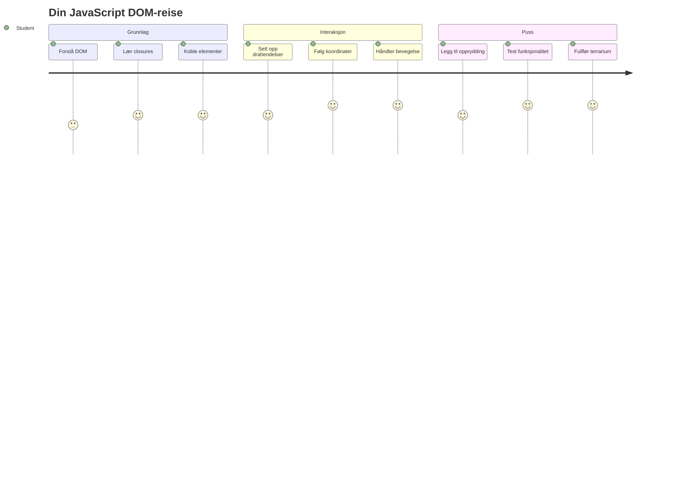
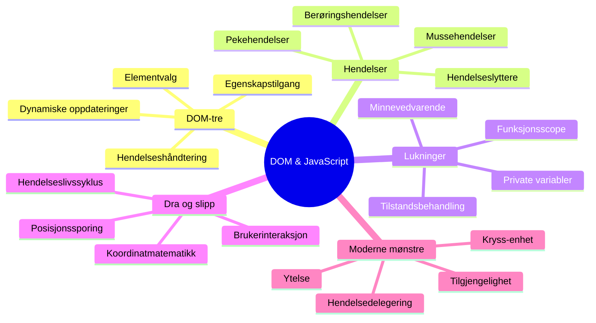
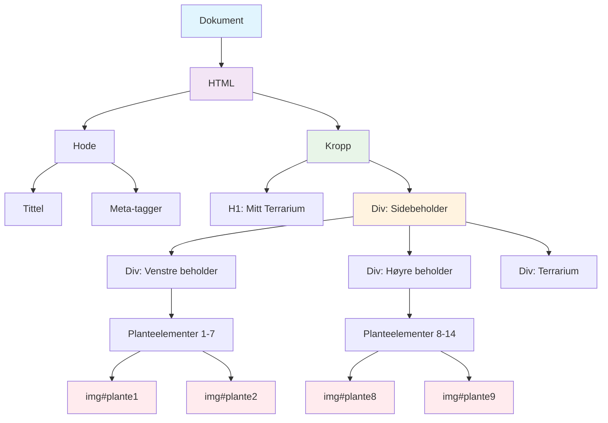
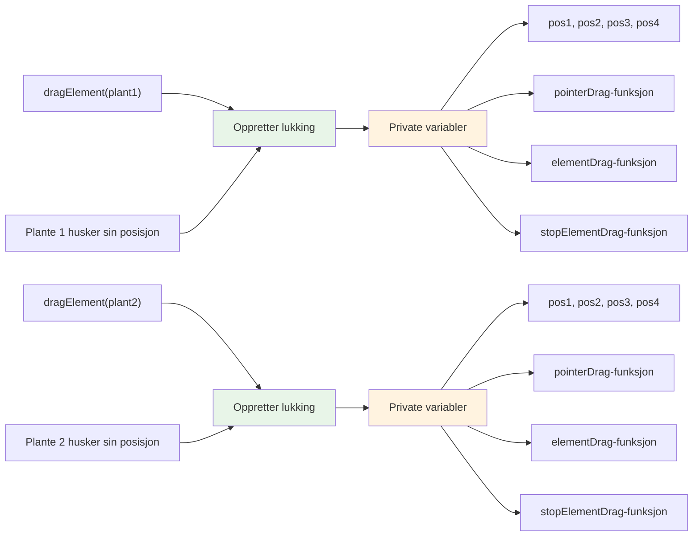
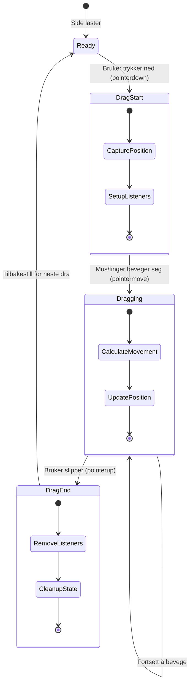
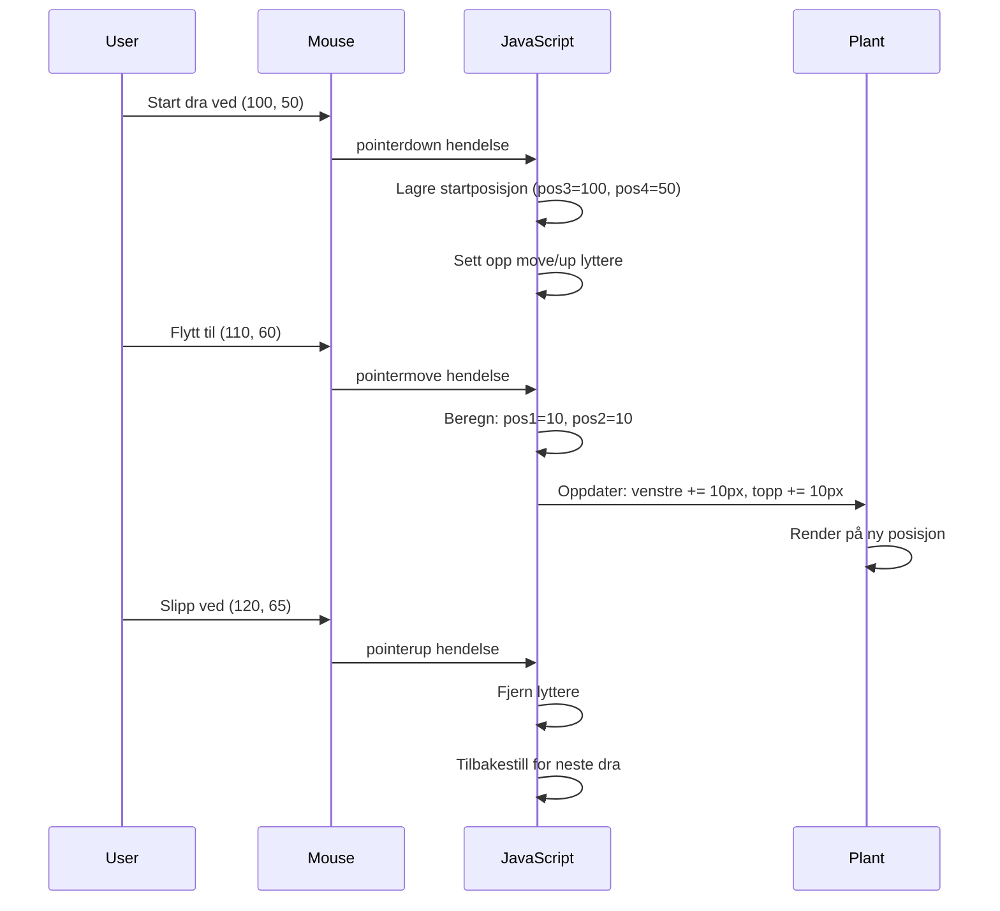
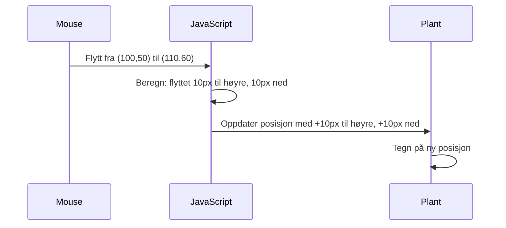
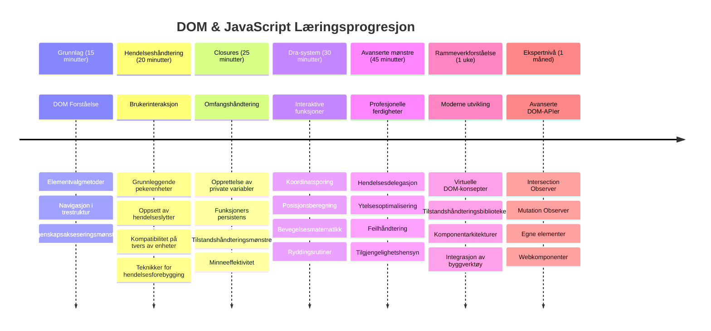

<!--
CO_OP_TRANSLATOR_METADATA:
{
  "original_hash": "973e48ad87d67bf5bb819746c9f8e302",
  "translation_date": "2026-01-07T00:50:36+00:00",
  "source_file": "3-terrarium/3-intro-to-DOM-and-closures/README.md",
  "language_code": "no"
}
-->
# Terrarium-prosjekt del 3: DOM-manipulasjon og JavaScript-closures



> Sketchnote av [Tomomi Imura](https://twitter.com/girlie_mac)

Velkommen til en av de mest engasjerende aspektene ved webutvikling – å gjøre ting interaktive! Document Object Model (DOM) er som en bro mellom din HTML og JavaScript, og i dag skal vi bruke den til å bringe terrariet ditt til liv. Da Tim Berners-Lee laget den første nettleseren, forestilte han seg et nett der dokumenter kunne være dynamiske og interaktive – DOM gjør denne visjonen mulig.

Vi skal også utforske JavaScript-closures, som kanskje høres skremmende ut i begynnelsen. Tenk på closures som å lage «minnelommer» hvor funksjonene dine kan huske viktig informasjon. Det er som om hver plante i terrariet har sin egen dataregistrering for å spore sin posisjon. Når du er ferdig med denne leksjonen, vil du forstå hvor naturlige og nyttige de er.

Her er hva vi bygger: et terrarium hvor brukere kan dra og slippe planter hvor som helst de vil. Du lærer DOM-manipulasjonsteknikker som driver alt fra drag-og-slipp filopplasting til interaktive spill. La oss få terrariet ditt til å leve.


## Quiz før forelesning

[Quiz før forelesning](https://ff-quizzes.netlify.app/web/quiz/19)

## Forstå DOM: Din inngangsport til interaktive nettsider

Document Object Model (DOM) er hvordan JavaScript kommuniserer med HTML-elementene dine. Når nettleseren din laster en HTML-side, lager den en strukturert representasjon av siden i minnet – det er DOM. Tenk på det som et familietre der hvert HTML-element er et familiemedlem som JavaScript kan få tilgang til, endre eller omarrangere.

DOM-manipulasjon forvandler statiske sider til interaktive nettsteder. Hver gang du ser en knapp som endrer farge ved hover, innhold som oppdateres uten sideoppdatering, eller elementer du kan dra rundt, er det DOM-manipulasjon i arbeid.




> En representasjon av DOM og HTML-markup som refererer til den. Fra [Olfa Nasraoui](https://www.researchgate.net/publication/221417012_Profile-Based_Focused_Crawler_for_Social_Media-Sharing_Websites)

**Dette gjør DOM kraftfullt:**
- **Gir** en strukturert måte å få tilgang til alle elementer på siden din
- **Muliggjør** dynamiske innholdsoppdateringer uten sideoppdateringer
- **Tillater** sanntidsrespons på brukerinteraksjoner som klikk og dra
- **Skaper** grunnlaget for moderne interaktive webapplikasjoner

## JavaScript-closures: Lage organisert og kraftfull kode

En [JavaScript-closure](https://developer.mozilla.org/docs/Web/JavaScript/Closures) er som å gi en funksjon sitt eget private arbeidsområde med vedvarende minne. Tenk på hvordan Darwins finker på Galápagosøyene utviklet spesialiserte nebb basert på sitt spesifikke miljø – closures fungerer på samme måte, og lager spesialiserte funksjoner som «husker» sin spesifikke kontekst selv etter at foreldrefunksjonen har fullført.

I terrariet vårt hjelper closures hver plante med å huske sin egen posisjon uavhengig. Dette mønsteret dukker opp overalt i profesjonell JavaScript-utvikling, og gjør det til et verdifullt konsept å forstå.


> 💡 **Forstå closures**: Closures er et viktig tema i JavaScript, og mange utviklere bruker dem i mange år før de fullt ut forstår alle teoretiske aspekter. I dag fokuserer vi på praktisk anvendelse – du vil se closures naturlig dukke opp når vi bygger våre interaktive funksjoner. Forståelsen utvikler seg mens du ser hvordan de løser virkelige problemer.


> En representasjon av DOM og HTML-markup som refererer til den. Fra [Olfa Nasraoui](https://www.researchgate.net/publication/221417012_Profile-Based_Focused_Crawler_for_Social_Media-Sharing_Websites)

I denne leksjonen skal vi fullføre vårt interaktive terrariumprosjekt ved å lage JavaScript som lar en bruker manipulere plantene på siden.

## Før vi begynner: Forberedelse for suksess

Du trenger HTML- og CSS-filene dine fra forrige terrariumleksjoner – vi skal gjøre det statiske designet interaktivt. Hvis du er ny, bør du fullføre disse leksjonene først for å få viktig kontekst.

Dette skal vi bygge:
- **Jevn drag-og-slipp** for alle terrariumplanter
- **Koordinatsporing** slik at planter husker posisjonene sine
- **Et komplett interaktivt grensesnitt** med ren JavaScript
- **Ren, organisert kode** med closure-mønstre

## Sette opp din JavaScript-fil

La oss lage JavaScript-filen som skal gjøre terrariet ditt interaktivt.

**Steg 1: Lag din scriptfil**

I terrarium-mappen din, lag en ny fil kalt `script.js`.

**Steg 2: Knytt JavaScript til HTML**

Legg til denne script-taggen i `<head>`-seksjonen i `index.html`-filen din:

```html
<script src="./script.js" defer></script>
```

**Hvorfor `defer`-attributtet er viktig:**
- **Sikrer** at JavaScript venter til all HTML er lastet
- **Forhindrer** feil der JavaScript søker etter elementer som ikke er klare ennå
- **Garanterer** at alle planteelementene dine er tilgjengelige for interaksjon
- **Gir** bedre ytelse enn å plassere skripter nederst på siden

> ⚠️ **Viktig notat**: `defer`-attributtet forhindrer vanlige tidsproblemer. Uten det kan JavaScript prøve å aksessere HTML-elementer før de er lastet, noe som fører til feil.

---

## Koble JavaScript til HTML-elementene dine

Før vi kan gjøre elementene draggbare, må JavaScript finne dem i DOM. Tenk på dette som et bibliotekkatalogiseringssystem – når du har katalognummret, kan du finne akkurat boken du trenger og få tilgang til hele innholdet.

Vi skal bruke `document.getElementById()`-metoden for å lage disse koblingene. Det er som å ha et presist arkivsystem – du oppgir en ID, og det finner akkurat elementet du trenger i HTML-en din.

### Aktivere drafunksjon for alle planter

Legg til denne koden i `script.js`-filen din:

```javascript
// Aktiver dra-funksjonalitet for alle 14 planter
dragElement(document.getElementById('plant1'));
dragElement(document.getElementById('plant2'));
dragElement(document.getElementById('plant3'));
dragElement(document.getElementById('plant4'));
dragElement(document.getElementById('plant5'));
dragElement(document.getElementById('plant6'));
dragElement(document.getElementById('plant7'));
dragElement(document.getElementById('plant8'));
dragElement(document.getElementById('plant9'));
dragElement(document.getElementById('plant10'));
dragElement(document.getElementById('plant11'));
dragElement(document.getElementById('plant12'));
dragElement(document.getElementById('plant13'));
dragElement(document.getElementById('plant14'));
```

**Dette oppnår denne koden:**
- **Finner** hvert planteelement i DOM ved hjelp av dets unike ID
- **Henter** en JavaScript-referanse til hvert HTML-element
- **Sender** hvert element til en `dragElement`-funksjon (som vi lager neste)
- **Forbereder** hver plante for drag-og-slipp interaksjon
- **Kobler** HTML-strukturen til JavaScript-funksjonalitet

> 🎯 **Hvorfor bruke ID-er i stedet for klasser?** ID-er gir unike identifikatorer for spesifikke elementer, mens CSS-klasser er laget for å style grupper av elementer. Når JavaScript skal manipulere individuelle elementer, gir ID-er den presisjonen og ytelsen vi trenger.

> 💡 **Tips:** Legg merke til at vi kaller `dragElement()` for hver plante individuelt. Denne tilnærmingen sikrer at hver plante får sin egen uavhengige dra-oppførsel, noe som er essensielt for en jevn brukeropplevelse.

### 🔄 **Pedagogisk sjekk**
**Forståelse av DOM-kobling**: Før vi går videre med drafunksjonalitet, sjekk at du kan:
- ✅ Forklare hvordan `document.getElementById()` finner HTML-elementer
- ✅ Forstå hvorfor vi bruker unike ID-er for hver plante
- ✅ Beskrive hensikten med `defer`-attributtet i script-tagger
- ✅ Gjenkjenne hvordan JavaScript og HTML kobles sammen gjennom DOM

**Rask selvevaluering**: Hva skjer hvis to elementer har samme ID? Hvorfor returnerer `getElementById()` bare ett element?
*Svar: ID-er skal være unike; hvis de er duplisert, returneres bare det første elementet*

---

## Lage dragElement-closure

Nå lager vi kjernen i vår drafunksjonalitet: en closure som styrer dra-oppførselen for hver plante. Denne closuren vil inneholde flere indre funksjoner som jobber sammen for å spore musebevegelser og oppdatere elementposisjoner.

Closures er perfekte for denne oppgaven fordi de lar oss lage "private" variabler som vedvarer mellom funksjonskall, og gir hver plante sin egen uavhengige koordinatsporing.

### Forstå closures med et enkelt eksempel

La meg demonstrere closures med et enkelt eksempel som illustrerer konseptet:

```javascript
function createCounter() {
    let count = 0; // Dette er som en privat variabel
    
    function increment() {
        count++; // Den indre funksjonen husker den ytre variabelen
        return count;
    }
    
    return increment; // Vi gir tilbake den indre funksjonen
}

const myCounter = createCounter();
console.log(myCounter()); // 1
console.log(myCounter()); // 2
```

**Dette skjer i dette closure-mønsteret:**
- **Oppretter** en privat `count`-variabel som bare eksisterer i denne closuren
- **Innerfunksjonen** kan få tilgang til og endre den ytre variabelen (closure-mekanismen)
- **Når vi returnerer** innerfunksjonen, beholder den forbindelsen til denne private dataen
- **Selv etter** at `createCounter()` er ferdig med kjøringen, vedvarer `count` og husker sin verdi

### Hvorfor closures er perfekte for drafunksjonalitet

For terrariet vårt må hver plante huske sine nåværende posisjonskoordinater. Closures gir den perfekte løsningen:

**Nøkkelfordeler i prosjektet:**
- **Opprettholder** private posisjonsvariabler for hver plante uavhengig
- **Bevarer** koordinatdata mellom drahendelser
- **Forhindrer** variabelkonflikter mellom ulike draggbare elementer
- **Skaper** ren og organisert kode

> 🎯 **Læringsmål**: Du trenger ikke mestre alle aspekter av closures akkurat nå. Fokuser på hvordan de hjelper oss med å organisere kode og opprettholde tilstand for drafunksjonaliteten vår.


### Lage dragElement-funksjonen

Nå bygger vi hovedfunksjonen som skal håndtere all dra-logikken. Legg til denne funksjonen under deklarasjonen av planteelementene dine:

```javascript
function dragElement(terrariumElement) {
    // Initialiser posisjonssporingsvariabler
    let pos1 = 0,  // Forrige muse X-posisjon
        pos2 = 0,  // Forrige muse Y-posisjon
        pos3 = 0,  // Nåværende muse X-posisjon
        pos4 = 0;  // Nåværende muse Y-posisjon
    
    // Sett opp den første dra-hendelseslytter
    terrariumElement.onpointerdown = pointerDrag;
}
```

**Forstå posisjonsporingssystemet:**
- **`pos1` og `pos2`**: Lagrer forskjellen mellom gamle og nye museposisjoner
- **`pos3` og `pos4`**: Sporer de nåværende musekoordinatene
- **`terrariumElement`**: Det spesifikke planteelementet vi lager draggbart
- **`onpointerdown`**: Hendelsen som trigges når brukeren begynner å dra

**Slik fungerer closure-mønsteret her:**
- **Oppretter** private posisjonsvariabler for hvert planteelement
- **Opprettholder** disse variablene gjennom hele drag-livssyklusen
- **Sikrer** at hver plante sporer sine egne koordinater uavhengig
- **Gir** et rent grensesnitt gjennom `dragElement`-funksjonen

### Hvorfor bruke pointer-events?

Du lurer kanskje på hvorfor vi bruker `onpointerdown` i stedet for den mer kjente `onclick`. Her er forklaringen:

| Hendelsestype | Best for | Fangsten |
|---------------|----------|---------|
| `onclick`     | Enkle knappklikk | Kan ikke håndtere dra (bare klikk og slipp) |
| `onpointerdown` | Både mus og berøring | Nyere, men godt støttet i dag |
| `onmousedown` | Kun desktop-mus | Utelukker mobilbrukere |

**Hvorfor pointer-events er perfekte for dette:**
- **Fungerer utmerket** enten noen bruker mus, finger eller penn
- **Føles likt** på laptop, nettbrett eller telefon
- **Håndterer** selve dra-bevegelsen (ikke bare klikk)
- **Gir** en jevn opplevelse som brukere forventer fra moderne webapper

> 💡 **Fremtidssikring**: Pointer-events er den moderne måten å håndtere brukerinteraksjoner på. I stedet for å skrive separat kode for mus og touch, får du begge deler gratis. Ganske praktisk, ikke sant?

### 🔄 **Pedagogisk sjekk**
**Forståelse av hendelseshåndtering**: Stopp opp og sjekk at du forstår:
- ✅ Hvorfor bruker vi pointer-events i stedet for mus-events?
- ✅ Hvordan persisterer closure-variabler mellom funksjonskall?
- ✅ Hvilken rolle spiller `preventDefault()` for jevn dragging?
- ✅ Hvorfor legger vi lyttere på dokumentet i stedet for enkelt-elementer?

**Virkelighetsforbindelse**: Tenk på drag-og-slipp-grensesnitt du bruker daglig:
- **Filopplastinger**: Dra filer inn i nettleservinduet
- **Kanban-tavler**: Flytte oppgaver mellom kolonner
- **Bildegallerier**: Omorganisere bilderangering
- **Mobilgrensesnitt**: Sveiping og drag på berøringsskjermer

---

## pointerDrag-funksjonen: Fange starten på en dra

Når en bruker trykker ned på en plante (enten med mus eller finger), trår `pointerDrag`-funksjonen i kraft. Denne funksjonen fanger de innledende koordinatene og setter opp dra-systemet.

Legg denne funksjonen inn i `dragElement`-closure, rett etter linjen `terrariumElement.onpointerdown = pointerDrag;`:

```javascript
function pointerDrag(e) {
    // Forhindre standard nettleseradferd (som tekstvalg)
    e.preventDefault();
    
    // Fang den opprinnelige mus-/berøringsposisjonen
    pos3 = e.clientX;  // X-koordinat der draingen startet
    pos4 = e.clientY;  // Y-koordinat der draingen startet
    
    // Sett opp hendelseslyttere for draingsprosessen
    document.onpointermove = elementDrag;
    document.onpointerup = stopElementDrag;
}
```

**Steg for steg, dette skjer:**
- **Forhindrer** standard nettleseradferd som kan forstyrre dragging
- **Registrerer** de nøyaktige koordinatene der brukeren startet dra-gesten
- **Etablerer** eventlyttinger for pågående dragbevegelser
- **Forbereder** systemet på å spore muse-/fingerbevegelser over hele dokumentet

### Forstå event-preventDefault

Linjen `e.preventDefault()` er avgjørende for jevn dragging:

**Uten dette kan nettlesere:**
- **Velge** tekst ved dragging over siden
- **Åpne** kontekstmenyer ved høyreklikk-drag
- **Forstyrre** vår tilpassede dra-adferd
- **Skape** visuelle forstyrrelser under drag-operasjonen

> 🔍 **Eksperiment:** Etter denne leksjonen, prøv å fjerne `e.preventDefault()` og se hvordan det påvirker drag-opplevelsen. Du vil raskt forstå hvorfor denne linjen er essensiell!

### Koordinatsporingssystem

`e.clientX` og `e.clientY`-egenskapene gir oss presise muse-/berøringskoordinater:

| Egenskap | Hva måles | Bruksområde |
|----------|-----------|-------------|
| `clientX` | Horisontal posisjon relativ til viewport | Sporing av bevegelse fra venstre til høyre |
| `clientY` | Vertikal posisjon relativ til viewport | Sporing av bevegelse opp og ned |
**Forstå disse koordinatene:**
- **Gir** pikselpresis posisjoneringsinformasjon
- **Oppdateres** i sanntid mens brukeren flytter pekeren
- **Forblir** konsekvent på tvers av forskjellige skjermstørrelser og zoomnivåer
- **Muliggjør** jevne, responsive dra-handlinger

### Sette opp hendelseslyttere på dokumentnivå

Legg merke til hvordan vi fester flytte- og stopp-hendelsene til hele `document`, ikke bare planteelementet:

```javascript
document.onpointermove = elementDrag;
document.onpointerup = stopElementDrag;
```

**Hvorfor feste til dokumentet:**
- **Fortsetter** å spore selv når musa forlater planteelementet
- **Forhindrer** avbrudd i dra-handlingen hvis brukeren beveger seg raskt
- **Gir** jevn dragging over hele skjermen
- **Håndterer** spesialtilfeller der pekeren beveger seg utenfor nettleservinduet

> ⚡ **Ytelsesnotat**: Vi vil rydde opp i disse dokumentnivå-lytterene når dragging stopper for å unngå minnelekkasjer og ytelsesproblemer.

## Fullføre dra-systemet: Bevegelse og opprydding

Nå legger vi til de to siste funksjonene som håndterer den faktiske dra-bevegelsen og oppryddingen når dragging stopper. Disse funksjonene jobber sammen for å skape jevn, responsiv plantebevegelse i terrariet ditt.

### elementDrag-funksjonen: Spore bevegelse

Legg til `elementDrag`-funksjonen rett etter avsluttende krøllete parentes for `pointerDrag`:

```javascript
function elementDrag(e) {
    // Beregn avstanden som er flyttet siden forrige hendelse
    pos1 = pos3 - e.clientX;  // Horisontal flyttet avstand
    pos2 = pos4 - e.clientY;  // Vertikal flyttet avstand
    
    // Oppdater sporing av gjeldende posisjon
    pos3 = e.clientX;  // Ny gjeldende X-posisjon
    pos4 = e.clientY;  // Ny gjeldende Y-posisjon
    
    // Bruk bevegelsen på elementets posisjon
    terrariumElement.style.top = (terrariumElement.offsetTop - pos2) + 'px';
    terrariumElement.style.left = (terrariumElement.offsetLeft - pos1) + 'px';
}
```

**Forstå matematikken bak koordinatene:**
- **`pos1` og `pos2`**: Beregner hvor langt musa har beveget seg siden forrige oppdatering
- **`pos3` og `pos4`**: Lagrer den nåværende museposisjonen for neste beregning
- **`offsetTop` og `offsetLeft`**: Henter elementets nåværende posisjon på siden
- **Subtraksjonslogikk**: Flytter elementet med samme avstand som musa har beveget seg


**Her er bevegelsesberegningen forklart:**
1. **Måler** forskjellen mellom gammel og ny museposisjon
2. **Beregner** hvor mye elementet skal flyttes basert på musebevegelsen
3. **Oppdaterer** elementets CSS-posisjons-egenskaper i sanntid
4. **Lagrer** den nye posisjonen som grunnlag for neste bevegelsesberegning

### Visuell fremstilling av matematikk


### stopElementDrag-funksjonen: Opprydding

Legg til oppryddingsfunksjonen etter avsluttende krøllete parentes for `elementDrag`:

```javascript
function stopElementDrag() {
    // Fjern hendelseslyttere på dokumentnivå
    document.onpointerup = null;
    document.onpointermove = null;
}
```

**Hvorfor opprydding er essensielt:**
- **Forhindrer** minnelekkasjer fra hengende event-lyttere
- **Stopper** dragging når brukeren slipper planten
- **Tillater** andre elementer å kunne dras uavhengig
- **Nullstiller** systemet for neste dra-operasjon

**Hva som skjer uten opprydding:**
- Event-lyttere fortsetter å kjøre selv etter dragging stopper
- Ytelsen forringes etter hvert som ubrukte lyttere akkumuleres
- Uforventet atferd ved interaksjon med andre elementer
- Nettleserressurser sløses bort på unødvendig hendelseshåndtering

### Forstå CSS-posisjonsegenskaper

Vårt dra-system manipulerer to viktige CSS-egenskaper:

| Egenskap | Hva den Kontrollerer | Hvordan vi bruker den |
|----------|---------------------|-----------------------|
| `top` | Avstand fra øverste kant | Vertikal posisjonering under dragging |
| `left` | Avstand fra venstre kant | Horisontal posisjonering under dragging |

**Viktige innsikter om offset-egenskaper:**
- **`offsetTop`**: Nåværende avstand fra toppen av det posisjonerte foreldre-elementet
- **`offsetLeft`**: Nåværende avstand fra venstre av det posisjonerte foreldre-elementet
- **Posisjoneringskontekst**: Disse verdiene er relative til nærmeste posisjonerte overordnede
- **Sanntidsoppdateringer**: Endres umiddelbart når vi modifiserer CSS-egenskapene

> 🎯 **Designfilosofi**: Dette dra-systemet er bevisst fleksibelt – det finnes ingen "slippe-soner" eller restriksjoner. Brukere kan plassere planter hvor som helst, noe som gir dem full kreativ kontroll over terrarie-designet sitt.

## Sette det hele sammen: Ditt komplette dra-system

Gratulerer! Du har nettopp bygget et sofistikert dra-og-slipp-system med ren JavaScript. Din komplette `dragElement`-funksjon inneholder nå en kraftig closure som håndterer:

**Hva closure-en din oppnår:**
- **Opprettholder** private posisjonsvariabler for hver plante uavhengig
- **Håndterer** hele drag-livssyklusen fra start til slutt
- **Gir** jevn, responsiv bevegelse over hele skjermen
- **Rydder** opp ressursene korrekt for å forhindre minnelekkasjer
- **Skaper** et intuitivt, kreativt grensesnitt for terrarie-design

### Test ditt interaktive terrarium

Nå kan du teste ditt interaktive terrarium! Åpne `index.html`-filen i en nettleser og prøv funksjonaliteten:

1. **Klikk og hold** på en plante for å begynne å dra
2. **Beveg musa eller finger** og se planten følge jevnt etter
3. **Slipp** for å slippe planten på den nye posisjonen
4. **Eksperimenter** med ulike arrangementer for å utforske grensesnittet

🥇 **Prestasjon**: Du har laget en fullt interaktiv webapplikasjon som bruker kjernekonsepter profesjonelle utviklere jobber med hver dag. Den drag-og-slipp-funksjonaliteten bruker de samme prinsippene bak filopplastinger, kanban-tavler og mange andre interaktive grensesnitt.

### 🔄 **Pedagogisk sjekk**
**Full systemforståelse**: Bekreft din mestring av hele drag-systemet:
- ✅ Hvordan opprettholder closures uavhengig tilstand for hver plante?
- ✅ Hvorfor er kokken for koordinatberegninger nødvendig for jevn bevegelse?
- ✅ Hva ville skje om vi glemte å rydde opp i event-lyttere?
- ✅ Hvordan skalerer dette mønsteret til mer komplekse interaksjoner?

**Kodekvalitetsrefleksjon**: Gå gjennom din komplette løsning:
- **Modulært design**: Hver plante får sin egen closure-instans
- **Effektiv hendelseshåndtering**: Riktig oppsett og opprydding av lyttere
- **Tverrplattformstøtte**: Fungerer på desktop og mobil
- **Ytelsesbevisst**: Ingen minnelekkasjer eller unødvendige beregninger


---

## GitHub Copilot Agent Challenge 🚀

Bruk Agent-modus for å fullføre følgende utfordring:

**Beskrivelse:** Forbedre terrarie-prosjektet ved å legge til funksjonalitet for tilbakestilling som returnerer alle planter til sine opprinnelige posisjoner med glatte animasjoner.

**Oppgave:** Lag en tilbakestillingsknapp som, når den klikkes, animerer alle planter tilbake til deres originale sidebjellsposisjoner ved hjelp av CSS-overganger. Funksjonen skal lagre de opprinnelige posisjonene når siden lastes, og glatt overføre plantene tilbake til disse posisjonene over 1 sekund når tilbakestillingsknappen trykkes.

Les mer om [agent mode](https://code.visualstudio.com/blogs/2025/02/24/introducing-copilot-agent-mode) her.

## 🚀 Ekstrautfordring: Utvid ferdighetene dine

Klar for å løfte terrariet ditt til neste nivå? Prøv å implementere disse forbedringene:

**Kreative utvidelser:**
- **Dobbeltklikk** en plante for å bringe den til fronten (z-indeks-manipulasjon)
- **Legg til visuell tilbakemelding** som en subtil glød ved hover over planter
- **Implementer grenser** for å forhindre at planter dras utenfor terrariet
- **Lag en lagrefunksjon** som husker planteposisjoner ved bruk av localStorage
- **Legg til lydeffekter** for plukking opp og sette ned planter

> 💡 **Læringsmulighet**: Hver av disse utfordringene vil lære deg nye aspekter av DOM-manipulering, hendelseshåndtering og brukeropplevelsesdesign.

## Quiz etter forelesningen

[Quiz etter forelesningen](https://ff-quizzes.netlify.app/web/quiz/20)

## Gjennomgang og selvstudie: Fordypning av forståelsen

Du har mestret grunnprinsippene for DOM-manipulering og closures, men det er alltid mer å utforske! Her er noen veier til å utvide kunnskap og ferdigheter.

### Alternative tilnærminger til drag og drop

Vi brukte pointer events for maksimal fleksibilitet, men webutvikling tilbyr flere metoder:

| Tilnærming | Best for | Læringsverdi |
|------------|----------|--------------|
| [HTML Drag and Drop API](https://developer.mozilla.org/docs/Web/API/HTML_Drag_and_Drop_API) | Filopplastinger, formelle dra-soner | Forstå native nettleserfunksjoner |
| [Touch Events](https://developer.mozilla.org/docs/Web/API/Touch_events) | Mobilspesifikke interaksjoner | Mobile-first utviklingsmønstre |
| CSS `transform`-egenskaper | Jevne animasjoner | Ytelsesoptimalisering |

### Avanserte DOM-manipulasjonstemaer

**Neste steg i læringen:**
- **Event delegation**: Effektiv hendelseshåndtering for flere elementer
- **Intersection Observer**: Oppdage når elementer kommer inn/forlater viewport
- **Mutation Observer**: Observere endringer i DOM-strukturen
- **Web Components**: Lage gjenbrukbare, kapslede UI-elementer
- **Virtual DOM-konsepter**: Forstå hvordan rammeverk optimaliserer DOM-oppdateringer

### Essensielle ressurser for videre læring

**Teknisk dokumentasjon:**
- [MDN Pointer Events Guide](https://developer.mozilla.org/docs/Web/API/Pointer_events) - Utførlig referanse for pointer events
- [W3C Pointer Events Specification](https://www.w3.org/TR/pointerevents1/) - Offisiell standarddokumentasjon
- [JavaScript Closures Deep Dive](https://developer.mozilla.org/docs/Web/JavaScript/Closures) - Avanserte closure-mønstre

**Nettleserkompatibilitet:**
- [CanIUse.com](https://caniuse.com/) - Sjekk støtte for funksjoner i ulike nettlesere
- [MDN Browser Compatibility Data](https://github.com/mdn/browser-compat-data) - Detaljert kompatibilitetsinformasjon

**Praksismuligheter:**
- **Lag** et puslespill med lignende drag-mekanismer
- **Bygg** en kanban-tavle med dra-og-slipp oppgavestyring
- **Design** et bildegalleri med draggable fotoarrangementer
- **Eksperimenter** med touch-gester for mobile grensesnitt

> 🎯 **Læringsstrategi**: Den beste måten å befeste disse konseptene på er gjennom praksis. Prøv å lage varianter av draggable grensesnitt – hvert prosjekt vil lære deg noe nytt om brukerinteraksjon og DOM-manipulasjon.

### ⚡ **Hva du kan gjøre de neste 5 minuttene**
- [ ] Åpne nettleserens DevTools og skriv `document.querySelector('body')` i konsollen
- [ ] Prøv å endre tekst på en nettside ved hjelp av `innerHTML` eller `textContent`
- [ ] Legg til en klikkhendelse til en knapp eller lenke på en nettside
- [ ] Undersøk DOM-trestrukturen i Elements-panelet

### 🎯 **Hva du kan oppnå denne timen**
- [ ] Fullfør quizen og gjennomgå DOM-manipulasjonskonsepter
- [ ] Lag en interaktiv nettside som reagerer på brukerklikk
- [ ] Øv på hendelseshåndtering med ulike hendelsestyper (klikk, mouseover, tastetrykk)
- [ ] Bygg en enkel oppgaveliste eller teller med DOM-manipulasjon
- [ ] Utforsk forholdet mellom HTML-elementer og JavaScript-objekter

### 📅 **Din ukelange JavaScript-reise**
- [ ] Fullfør det interaktive terrarie-prosjektet med dra-og-slipp-funksjonalitet
- [ ] Mestre event delegation for effektiv hendelseshåndtering
- [ ] Lær om event loop og asynkron JavaScript
- [ ] Øv på closures ved å bygge moduler med privat tilstand
- [ ] Utforsk moderne DOM API-er som Intersection Observer
- [ ] Lag interaktive komponenter uten å bruke rammeverk

### 🌟 **Din månedslange JavaScript-mestring**
- [ ] Lag en kompleks single-page-applikasjon med ren JavaScript
- [ ] Lær et moderne rammeverk (React, Vue eller Angular) og sammenlign med ren DOM
- [ ] Bidra til open source JavaScript-prosjekter
- [ ] Mestre avanserte konsepter som web components og custom elements
- [ ] Bygg ytelsesoptimaliserte webapplikasjoner med gode DOM-mønstre
- [ ] Lær bort om DOM-manipulering og JavaScript-grunnprinsipper

## 🎯 Din JavaScript DOM-mestring tidslinje


### 🛠️ Din oppsummering av JavaScript-verktøykasse

Etter å ha fullført denne leksjonen har du nå:
- **DOM-mestring**: Elementutvalg, egenskapsmanipulering og tre-navigering
- **Hendelsesekspertise**: Tverrplattform interaksjonshåndtering med pointer events
- **Forståelse av closures**: Privat tilstandsadministrasjon og funksjonens persistens
- **Interaktive systemer**: Full implementasjon av dra-og-slipp fra bunnen av
- **Ytelsesbevissthet**: Korrekt opprydding av hendelser og minnehåndtering
- **Moderne mønstre**: Kodeorganisering brukt i profesjonell utvikling
- **Brukeropplevelse**: Lage intuitive, responsive grensesnitt

**Profesjonelle ferdigheter tilegnet**: Du har bygget funksjoner med de samme teknikkene som:
- **Trello/Kanban-tavler**: Dra-kort mellom kolonner
- **Filopplasting**: Dra-og-slipp av filer
- **Bildegallerier**: Foto-arrangementgrensesnitt
- **Mobilapper**: Touch-baserte interaksjonsmønstre

**Neste nivå**: Du er klar til å utforske moderne rammeverk som React, Vue eller Angular som bygger på disse grunnleggende DOM-manipulasjonskonseptene!

## Oppgave

[Jobb litt mer med DOM](assignment.md)

---

<!-- CO-OP TRANSLATOR DISCLAIMER START -->
**Ansvarsfraskrivelse**:
Dette dokumentet er oversatt ved hjelp av AI-oversettelsestjenesten [Co-op Translator](https://github.com/Azure/co-op-translator). Selv om vi streber etter nøyaktighet, vær oppmerksom på at automatiserte oversettelser kan inneholde feil eller unøyaktigheter. Det originale dokumentet på originalsproget bør regnes som den autoritative kilden. For kritisk informasjon anbefales profesjonell menneskelig oversettelse. Vi påtar oss ikke ansvar for misforståelser eller feiltolkninger som oppstår ved bruk av denne oversettelsen.
<!-- CO-OP TRANSLATOR DISCLAIMER END -->