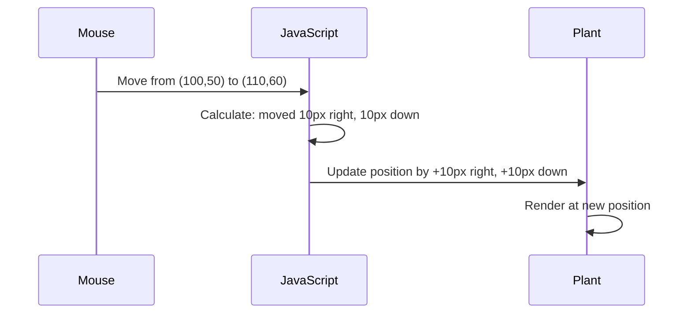

<!--
CO_OP_TRANSLATOR_METADATA:
{
  "original_hash": "bc93f6285423033ebf5b8abeb5282888",
  "translation_date": "2025-10-23T22:27:25+00:00",
  "source_file": "3-terrarium/3-intro-to-DOM-and-closures/README.md",
  "language_code": "no"
}
-->
# Terrariumprosjekt del 3: DOM-manipulering og JavaScript-closures


> Sketchnote av [Tomomi Imura](https://twitter.com/girlie_mac)

Velkommen til en av de mest engasjerende aspektene ved webutvikling - å gjøre ting interaktive! Document Object Model (DOM) fungerer som en bro mellom HTML og JavaScript, og i dag skal vi bruke det til å gi liv til terrariet ditt. Da Tim Berners-Lee skapte den første nettleseren, forestilte han seg en web hvor dokumenter kunne være dynamiske og interaktive - DOM gjør denne visjonen mulig.

Vi skal også utforske JavaScript-closures, som kanskje høres skremmende ut i starten. Tenk på closures som "hukommelseslommer" der funksjonene dine kan huske viktig informasjon. Det er som om hver plante i terrariet har sin egen dataregistrering for å spore posisjonen sin. Innen slutten av denne leksjonen vil du forstå hvor naturlige og nyttige de er.

Her er hva vi skal lage: et terrarium hvor brukere kan dra og slippe planter hvor de vil. Du vil lære DOM-manipuleringsteknikker som driver alt fra dra-og-slipp filopplastinger til interaktive spill. La oss gi liv til terrariet ditt.

## Quiz før leksjonen

[Quiz før leksjonen](https://ff-quizzes.netlify.app/web/quiz/19)

## Forstå DOM: Din inngangsport til interaktive nettsider

Document Object Model (DOM) er hvordan JavaScript kommuniserer med HTML-elementene dine. Når nettleseren din laster inn en HTML-side, oppretter den en strukturert representasjon av siden i minnet - det er DOM. Tenk på det som et slektstre der hvert HTML-element er et familiemedlem som JavaScript kan få tilgang til, endre eller omorganisere.

DOM-manipulering forvandler statiske sider til interaktive nettsteder. Hver gang du ser en knapp endre farge ved hover, innhold som oppdateres uten å laste siden på nytt, eller elementer du kan dra rundt, er det DOM-manipulering i aksjon.


> En representasjon av DOM og HTML-markeringen som refererer til det. Fra [Olfa Nasraoui](https://www.researchgate.net/publication/221417012_Profile-Based_Focused_Crawler_for_Social_Media-Sharing_Websites)

**Dette gjør DOM kraftig:**
- **Gir** en strukturert måte å få tilgang til ethvert element på siden din
- **Muliggjør** dynamiske innholdsoppdateringer uten å laste siden på nytt
- **Tillater** sanntidsrespons på brukerinteraksjoner som klikk og dra
- **Skaper** grunnlaget for moderne interaktive webapplikasjoner

## JavaScript-closures: Skap organisert, kraftig kode

En [JavaScript-closure](https://developer.mozilla.org/docs/Web/JavaScript/Closures) er som å gi en funksjon sitt eget private arbeidsområde med vedvarende hukommelse. Tenk på hvordan Darwins finker på Galápagosøyene utviklet spesialiserte nebb basert på sitt spesifikke miljø - closures fungerer på lignende måte, og skaper spesialiserte funksjoner som "husker" sin spesifikke kontekst selv etter at foreldrefunksjonen er ferdig.

I vårt terrarium hjelper closures hver plante med å huske sin egen posisjon uavhengig. Dette mønsteret dukker opp overalt i profesjonell JavaScript-utvikling, og gjør det til et verdifullt konsept å forstå.

> 💡 **Forstå closures**: Closures er et viktig tema i JavaScript, og mange utviklere bruker dem i årevis før de fullt ut forstår alle de teoretiske aspektene. I dag fokuserer vi på praktisk anvendelse - du vil se closures naturlig dukke opp mens vi bygger våre interaktive funksjoner. Forståelsen vil utvikle seg etter hvert som du ser hvordan de løser reelle problemer.


> En representasjon av DOM og HTML-markeringen som refererer til det. Fra [Olfa Nasraoui](https://www.researchgate.net/publication/221417012_Profile-Based_Focused_Crawler_for_Social_Media-Sharing_Websites)

I denne leksjonen skal vi fullføre vårt interaktive terrarieprosjekt ved å lage JavaScript som lar en bruker manipulere plantene på siden.

## Før vi begynner: Forberedelse for suksess

Du trenger HTML- og CSS-filene dine fra de tidligere terrarie-leksjonene - vi er i ferd med å gjøre det statiske designet interaktivt. Hvis du er med for første gang, vil det å fullføre de tidligere leksjonene gi viktig kontekst.

Her er hva vi skal lage:
- **Smidig dra-og-slipp** for alle terrarieplanter
- **Koordinatsporing** slik at plantene husker posisjonene sine
- **Et komplett interaktivt grensesnitt** ved bruk av ren JavaScript
- **Ren, organisert kode** ved bruk av closure-mønstre

## Oppsett av JavaScript-filen din

La oss lage JavaScript-filen som vil gjøre terrariet ditt interaktivt.

**Steg 1: Opprett script-filen din**

I terrarie-mappen din, opprett en ny fil kalt `script.js`.

**Steg 2: Koble JavaScript til HTML-filen din**

Legg til denne script-taggen i `<head>`-seksjonen av `index.html`-filen din:

```html
<script src="./script.js" defer></script>
```

**Hvorfor `defer`-attributtet er viktig:**
- **Sikrer** at JavaScript venter til all HTML er lastet
- **Forhindrer** feil der JavaScript leter etter elementer som ikke er klare ennå
- **Garanterer** at alle planteelementene dine er tilgjengelige for interaksjon
- **Gir** bedre ytelse enn å plassere script nederst på siden

> ⚠️ **Viktig merknad**: `defer`-attributtet forhindrer vanlige timingproblemer. Uten det kan JavaScript prøve å få tilgang til HTML-elementer før de er lastet, noe som fører til feil.

---

## Koble JavaScript til HTML-elementene dine

Før vi kan gjøre elementer flyttbare, må JavaScript finne dem i DOM. Tenk på dette som et bibliotekskatalogsystem - når du har katalognummeret, kan du finne akkurat den boken du trenger og få tilgang til alt innholdet.

Vi bruker metoden `document.getElementById()` for å lage disse koblingene. Det er som å ha et presist arkivsystem - du gir en ID, og det finner akkurat det elementet du trenger i HTML.

### Aktivere dra-funksjonalitet for alle planter

Legg til denne koden i `script.js`-filen din:

```javascript
// Enable drag functionality for all 14 plants
dragElement(document.getElementById('plant1'));
dragElement(document.getElementById('plant2'));
dragElement(document.getElementById('plant3'));
dragElement(document.getElementById('plant4'));
dragElement(document.getElementById('plant5'));
dragElement(document.getElementById('plant6'));
dragElement(document.getElementById('plant7'));
dragElement(document.getElementById('plant8'));
dragElement(document.getElementById('plant9'));
dragElement(document.getElementById('plant10'));
dragElement(document.getElementById('plant11'));
dragElement(document.getElementById('plant12'));
dragElement(document.getElementById('plant13'));
dragElement(document.getElementById('plant14'));
```

**Dette oppnår koden:**
- **Finner** hvert planteelement i DOM ved hjelp av dets unike ID
- **Henter** en JavaScript-referanse til hvert HTML-element
- **Sender** hvert element til en `dragElement`-funksjon (som vi skal lage neste)
- **Forbereder** hver plante for dra-og-slipp interaksjon
- **Kobler** HTML-strukturen din til JavaScript-funksjonalitet

> 🎯 **Hvorfor bruke ID-er i stedet for klasser?** ID-er gir unike identifikatorer for spesifikke elementer, mens CSS-klasser er designet for å style grupper av elementer. Når JavaScript trenger å manipulere individuelle elementer, gir ID-er den presisjonen og ytelsen vi trenger.

> 💡 **Proff-tips**: Legg merke til hvordan vi kaller `dragElement()` for hver plante individuelt. Denne tilnærmingen sikrer at hver plante får sin egen uavhengige dra-adferd, noe som er essensielt for smidig brukerinteraksjon.

---

## Bygge dragElement-closure

Nå skal vi lage kjernen i dra-funksjonaliteten vår: en closure som styrer dra-adferden for hver plante. Denne closuren vil inneholde flere indre funksjoner som samarbeider for å spore musebevegelser og oppdatere elementposisjoner.

Closures er perfekte for denne oppgaven fordi de lar oss opprette "private" variabler som vedvarer mellom funksjonskall, og gir hver plante sitt eget uavhengige koordinatsporingssystem.

### Forstå closures med et enkelt eksempel

La meg demonstrere closures med et enkelt eksempel som illustrerer konseptet:

```javascript
function createCounter() {
    let count = 0; // This is like a private variable
    
    function increment() {
        count++; // The inner function remembers the outer variable
        return count;
    }
    
    return increment; // We're giving back the inner function
}

const myCounter = createCounter();
console.log(myCounter()); // 1
console.log(myCounter()); // 2
```

**Dette skjer i closure-mønsteret:**
- **Oppretter** en privat `count`-variabel som kun eksisterer innenfor denne closuren
- **Den indre funksjonen** kan få tilgang til og endre den ytre variabelen (closure-mekanismen)
- **Når vi returnerer** den indre funksjonen, opprettholder den forbindelsen til den private dataen
- **Selv etter** at `createCounter()` er ferdig med å kjøre, vedvarer `count` og husker verdien sin

### Hvorfor closures er perfekte for dra-funksjonalitet

For vårt terrarium trenger hver plante å huske sine nåværende posisjonskoordinater. Closures gir den perfekte løsningen:

**Nøkkelfordeler for prosjektet vårt:**
- **Opprettholder** private posisjonsvariabler for hver plante uavhengig
- **Bevarer** koordinatdata mellom dra-hendelser
- **Forhindrer** variabelkonflikter mellom ulike flyttbare elementer
- **Skaper** en ren, organisert kodestruktur

> 🎯 **Læringsmål**: Du trenger ikke å mestre alle aspekter ved closures akkurat nå. Fokuser på å se hvordan de hjelper oss med å organisere kode og opprettholde tilstand for dra-funksjonaliteten.

### Lage dragElement-funksjonen

Nå skal vi bygge hovedfunksjonen som vil håndtere all dra-logikken. Legg til denne funksjonen under deklarasjonene for planteelementene:

```javascript
function dragElement(terrariumElement) {
    // Initialize position tracking variables
    let pos1 = 0,  // Previous mouse X position
        pos2 = 0,  // Previous mouse Y position  
        pos3 = 0,  // Current mouse X position
        pos4 = 0;  // Current mouse Y position
    
    // Set up the initial drag event listener
    terrariumElement.onpointerdown = pointerDrag;
}
```

**Forstå posisjonssporingssystemet:**
- **`pos1` og `pos2`**: Lagrer forskjellen mellom gamle og nye museposisjoner
- **`pos3` og `pos4`**: Sporer de nåværende musekoordinatene
- **`terrariumElement`**: Det spesifikke planteelementet vi gjør flyttbart
- **`onpointerdown`**: Hendelsen som utløses når brukeren begynner å dra

**Slik fungerer closure-mønsteret:**
- **Oppretter** private posisjonsvariabler for hvert planteelement
- **Opprettholder** disse variablene gjennom dra-livssyklusen
- **Sikrer** at hver plante sporer sine egne koordinater uavhengig
- **Gir** et rent grensesnitt gjennom `dragElement`-funksjonen

### Hvorfor bruke pointer-hendelser?

Du lurer kanskje på hvorfor vi bruker `onpointerdown` i stedet for den mer kjente `onclick`. Her er forklaringen:

| Hendelsestype | Best for | Ulempen |
|---------------|----------|---------|
| `onclick` | Enkle knappetrykk | Kan ikke håndtere dra (bare klikk og slipp) |
| `onpointerdown` | Både mus og berøring | Nyere, men godt støttet i dag |
| `onmousedown` | Kun mus på desktop | Utelukker mobilbrukere |

**Hvorfor pointer-hendelser er perfekte for det vi bygger:**
- **Fungerer utmerket** enten noen bruker mus, finger eller til og med stylus
- **Føles likt** på laptop, nettbrett eller telefon
- **Håndterer** den faktiske dra-bevegelsen (ikke bare klikk-og-ferdig)
- **Skaper** en smidig opplevelse som brukere forventer fra moderne webapper

> 💡 **Fremtidssikring**: Pointer-hendelser er den moderne måten å håndtere brukerinteraksjoner på. I stedet for å skrive separat kode for mus og berøring, får du begge gratis. Ganske kult, ikke sant?

---

## Funksjonen pointerDrag: Fange starten på en dra-bevegelse

Når en bruker trykker ned på en plante (enten med museklikk eller fingerberøring), aktiveres `pointerDrag`-funksjonen. Denne funksjonen fanger opp de innledende koordinatene og setter opp dra-systemet.

Legg til denne funksjonen inne i `dragElement`-closure, rett etter linjen `terrariumElement.onpointerdown = pointerDrag;`:

```javascript
function pointerDrag(e) {
    // Prevent default browser behavior (like text selection)
    e.preventDefault();
    
    // Capture the initial mouse/touch position
    pos3 = e.clientX;  // X coordinate where drag started
    pos4 = e.clientY;  // Y coordinate where drag started
    
    // Set up event listeners for the dragging process
    document.onpointermove = elementDrag;
    document.onpointerup = stopElementDrag;
}
```

**Steg for steg, dette skjer:**
- **Forhindrer** standard nettleseratferd som kan forstyrre dra-bevegelsen
- **Registrerer** de nøyaktige koordinatene der brukeren startet dra-bevegelsen
- **Etablerer** hendelseslyttere for den pågående dra-bevegelsen
- **Forbereder** systemet til å spore muse-/fingerbevegelse over hele dokumentet

### Forstå hendelsesforebygging

Linjen `e.preventDefault()` er avgjørende for smidig dra-bevegelse:

**Uten forebygging kan nettlesere:**
- **Velge** tekst når du drar over siden
- **Utløse** kontekstmenyer ved høyreklikk-dra
- **Forstyrre** vår tilpassede dra-adferd
- **Skape** visuelle artefakter under dra-operasjonen

> 🔍 **Eksperiment**: Etter å ha fullført denne leksjonen, prøv å fjerne `e.preventDefault()` og se hvordan det påvirker dra-opplevelsen. Du vil raskt forstå hvorfor denne linjen er essensiell!

### Koordinatsporingssystem

Egenskapene `e.clientX` og `e.clientY` gir oss presise muse-/berøringskoordinater:

| Egenskap | Hva den måler | Bruksområde |
|----------|---------------|-------------|
| `clientX` | Horisontal posisjon relativt til visningsområdet | Spore venstre-høyre bevegelse |
| `clientY` | Vertikal posisjon relativt til visningsområdet | Spore opp-ned bevegelse |

**Forstå disse koordinatene:**
- **Gir** pikselperfekt posisjonsinformasjon
- **Oppdateres** i sanntid mens brukeren beveger pekeren
- **Forblir** konsistent på tvers av ulike skjermstørrelser og zoomnivåer
- **Muliggjør** smidige, responsive dra-interaksjoner

### Oppsett av dokumentnivå hendelseslyttere

Legg merke til hvordan vi knytter flytte- og stopp-hendelsene til hele `document`, ikke bare planteelementet:

```javascript
document.onpointermove = elementDrag;
document.onpointerup = stopElementDrag;
```

**Hvorfor knytte til dokumentet:**
- **Fortsetter** sporing selv når musen forlater planteelementet
- **Forhindrer** avbrudd i dra-bevegelsen hvis brukeren beveger seg raskt
- **Gir** smidig dra-bevegelse over hele skjermen
- **Håndterer** kanttilfeller der pekeren beveger seg utenfor nettleservinduet

> ⚡ **Ytelsesnotat**: Vi rydder opp i disse dokumentnivå-lytterne når dra-bevegelsen stopper for å unngå minnelekkasjer og ytelsesproblemer.

## Fullføre dra-systemet: Bevegelse og opprydding

Nå skal vi legge til de to gjenværende funksjonene som håndterer den faktiske dra-bevegelsen og oppryddingen når dra-bevegelsen stopper. Disse funksjonene samarbeider for å skape smidig, responsiv plantebevegelse over terrariet ditt.

### Funksjonen elementDrag: Spore bevegelse

Legg til `elementDrag`-funksjonen rett etter den avsluttende krøllparentesen til `pointerDrag`:

```javascript
function elementDrag(e) {
    // Calculate the distance moved since the last event
    pos1 = pos3 - e.clientX;  // Horizontal distance moved
    pos2 = pos4 - e.clientY;  // Vertical distance moved
    
    // Update the current position tracking
    pos3 = e.clientX;  // New current X position
    pos4 = e.clientY;  // New current Y position
    
    // Apply the movement to the element's position
    terrariumElement.style.top = (terrariumElement.offsetTop - pos2) + 'px';
    terrariumElement.style.left = (terrariumElement.offsetLeft - pos1) + 'px';
}
```

**Forstå koordinatmatematikken:**
- **`pos1` og `pos2`**: Beregner hvor langt musen har beveget seg siden siste oppdatering
- **`pos3` og `pos4`**: Lagre musens nåværende posisjon for neste beregning
- **`offsetTop` og `offsetLeft`**: Hente elementets nåværende posisjon på siden
- **Subtraksjonslogikk**: Flytter elementet med samme avstand som musen har beveget seg

**Her er en oversikt over bevegelsesberegningen:**
1. **Måler** forskjellen mellom gammel og ny museposisjon
2. **Beregner** hvor mye elementet skal flyttes basert på musens bevegelse
3. **Oppdaterer** elementets CSS-posisjonsverdier i sanntid
4. **Lagrer** den nye posisjonen som utgangspunkt for neste bevegelsesberegning

### Visuell fremstilling av matematikken



### Funksjonen stopElementDrag: Rydding

Legg til oppryddingsfunksjonen etter den avsluttende krøllparentesen til `elementDrag`:

```javascript
function stopElementDrag() {
    // Remove the document-level event listeners
    document.onpointerup = null;
    document.onpointermove = null;
}
```

**Hvorfor opprydding er viktig:**
- **Forhindrer** minnelekkasjer fra hengende event listeners
- **Stopper** dra-funksjonen når brukeren slipper planten
- **Tillater** at andre elementer kan dras uavhengig
- **Tilbakestiller** systemet for neste dra-operasjon

**Hva som skjer uten opprydding:**
- Event listeners fortsetter å kjøre selv etter at draingen er stoppet
- Ytelsen forverres ettersom ubrukte lyttere hoper seg opp
- Uventet oppførsel ved interaksjon med andre elementer
- Nettleserressurser sløses bort på unødvendig eventhåndtering

### Forstå CSS-posisjonsverdier

Vårt dra-system manipulerer to viktige CSS-egenskaper:

| Egenskap | Hva den kontrollerer | Hvordan vi bruker den |
|----------|-----------------------|-----------------------|
| `top` | Avstand fra toppkanten | Vertikal posisjonering under draing |
| `left` | Avstand fra venstre kant | Horisontal posisjonering under draing |

**Viktige innsikter om offset-egenskaper:**
- **`offsetTop`**: Nåværende avstand fra toppen av den posisjonerte overordnede elementet
- **`offsetLeft`**: Nåværende avstand fra venstre av den posisjonerte overordnede elementet
- **Posisjoneringskontekst**: Disse verdiene er relative til nærmeste posisjonerte forfader
- **Sanntidsoppdateringer**: Endres umiddelbart når vi modifiserer CSS-egenskapene

> 🎯 **Designfilosofi**: Dette dra-systemet er bevisst fleksibelt – det finnes ingen "slipp-soner" eller restriksjoner. Brukere kan plassere planter hvor som helst, og får full kreativ kontroll over terrariumdesignen.

## Sette alt sammen: Ditt komplette dra-system

Gratulerer! Du har nettopp bygget et sofistikert dra-og-slipp-system ved hjelp av ren JavaScript. Din komplette `dragElement`-funksjon inneholder nå en kraftig closure som administrerer:

**Hva din closure oppnår:**
- **Opprettholder** private posisjonsvariabler for hver plante uavhengig
- **Håndterer** hele dra-livssyklusen fra start til slutt
- **Gir** jevn, responsiv bevegelse over hele skjermen
- **Rydder** opp ressurser riktig for å forhindre minnelekkasjer
- **Skaper** et intuitivt, kreativt grensesnitt for terrariumdesign

### Teste ditt interaktive terrarium

Nå kan du teste ditt interaktive terrarium! Åpne `index.html`-filen i en nettleser og prøv funksjonaliteten:

1. **Klikk og hold** på en plante for å starte draingen
2. **Flytt musen eller fingeren** og se planten følge jevnt med
3. **Slipp** for å plassere planten i sin nye posisjon
4. **Eksperimenter** med ulike oppsett for å utforske grensesnittet

🥇 **Prestasjon**: Du har laget en fullt interaktiv webapplikasjon ved hjelp av kjerneprinsipper som profesjonelle utviklere bruker daglig. Dra-og-slipp-funksjonaliteten bruker de samme prinsippene som ligger bak filopplastinger, kanban-tavler og mange andre interaktive grensesnitt.


---

## GitHub Copilot Agent Challenge 🚀

Bruk Agent-modus for å fullføre følgende utfordring:

**Beskrivelse:** Forbedre terrarium-prosjektet ved å legge til en tilbakestillingsfunksjon som returnerer alle planter til sine opprinnelige posisjoner med jevne animasjoner.

**Prompt:** Lag en tilbakestillingsknapp som, når den klikkes, animerer alle planter tilbake til sine opprinnelige posisjoner i sidepanelet ved hjelp av CSS-overganger. Funksjonen skal lagre de opprinnelige posisjonene når siden lastes, og jevnt flytte plantene tilbake til disse posisjonene over 1 sekund når tilbakestillingsknappen trykkes.

Les mer om [agent mode](https://code.visualstudio.com/blogs/2025/02/24/introducing-copilot-agent-mode) her.

## 🚀 Ekstra utfordring: Utvid dine ferdigheter

Klar for å ta terrariet ditt til neste nivå? Prøv å implementere disse forbedringene:

**Kreative utvidelser:**
- **Dobbeltklikk** på en plante for å bringe den til fronten (z-indeks-manipulasjon)
- **Legg til visuell tilbakemelding** som en subtil glød når du holder musen over planter
- **Implementer grenser** for å forhindre at planter dras utenfor terrariet
- **Lag en lagringsfunksjon** som husker planteposisjoner ved hjelp av localStorage
- **Legg til lydeffekter** for å plukke opp og plassere planter

> 💡 **Læringsmulighet**: Hver av disse utfordringene vil lære deg nye aspekter ved DOM-manipulasjon, hendelseshåndtering og brukeropplevelsesdesign.

## Quiz etter forelesning

[Quiz etter forelesning](https://ff-quizzes.netlify.app/web/quiz/20)

## Gjennomgang og selvstudie: Fordyp deg i forståelsen

Du har mestret det grunnleggende om DOM-manipulasjon og closures, men det er alltid mer å utforske! Her er noen veier for å utvide din kunnskap og ferdigheter.

### Alternative tilnærminger til dra-og-slipp

Vi brukte pekebegivenheter for maksimal fleksibilitet, men webutvikling tilbyr flere tilnærminger:

| Tilnærming | Best for | Læringsverdi |
|------------|----------|--------------|
| [HTML Drag and Drop API](https://developer.mozilla.org/docs/Web/API/HTML_Drag_and_Drop_API) | Filopplastinger, formelle dra-soner | Forståelse av nettleserens innebygde funksjoner |
| [Touch Events](https://developer.mozilla.org/docs/Web/API/Touch_events) | Mobilspesifikke interaksjoner | Mobil-først utviklingsmønstre |
| CSS `transform`-egenskaper | Jevne animasjoner | Ytelsesoptimaliseringsteknikker |

### Avanserte emner innen DOM-manipulasjon

**Neste steg i din læringsreise:**
- **Event-delegasjon**: Håndtere hendelser effektivt for flere elementer
- **Intersection Observer**: Oppdage når elementer kommer inn/ut av visningsområdet
- **Mutation Observer**: Overvåke endringer i DOM-strukturen
- **Web Components**: Lage gjenbrukbare, innkapslede UI-elementer
- **Virtuelle DOM-konsepter**: Forstå hvordan rammeverk optimaliserer DOM-oppdateringer

### Essensielle ressurser for videre læring

**Teknisk dokumentasjon:**
- [MDN Pointer Events Guide](https://developer.mozilla.org/docs/Web/API/Pointer_events) - Omfattende pekebegivenhetsreferanse
- [W3C Pointer Events Specification](https://www.w3.org/TR/pointerevents1/) - Offisiell standarddokumentasjon
- [JavaScript Closures Deep Dive](https://developer.mozilla.org/docs/Web/JavaScript/Closures) - Avanserte closure-mønstre

**Nettleserkompatibilitet:**
- [CanIUse.com](https://caniuse.com/) - Sjekk funksjonsstøtte på tvers av nettlesere
- [MDN Browser Compatibility Data](https://github.com/mdn/browser-compat-data) - Detaljert kompatibilitetsinformasjon

**Praksismuligheter:**
- **Bygg** et puslespill ved hjelp av lignende dra-mekanismer
- **Lag** en kanban-tavle med dra-og-slipp oppgavehåndtering
- **Design** et bildegalleri med flyttbare fotoarrangementer
- **Eksperimenter** med berøringsgester for mobilgrensesnitt

> 🎯 **Læringsstrategi**: Den beste måten å styrke disse konseptene på er gjennom praksis. Prøv å bygge variasjoner av dra-grensesnitt – hvert prosjekt vil lære deg noe nytt om brukerinteraksjon og DOM-manipulasjon.

## Oppgave

[Jobb litt mer med DOM](assignment.md)

---

**Ansvarsfraskrivelse**:  
Dette dokumentet er oversatt ved hjelp av AI-oversettelsestjenesten [Co-op Translator](https://github.com/Azure/co-op-translator). Selv om vi streber etter nøyaktighet, vær oppmerksom på at automatiserte oversettelser kan inneholde feil eller unøyaktigheter. Det originale dokumentet på sitt opprinnelige språk bør anses som den autoritative kilden. For kritisk informasjon anbefales profesjonell menneskelig oversettelse. Vi er ikke ansvarlige for misforståelser eller feiltolkninger som oppstår ved bruk av denne oversettelsen.