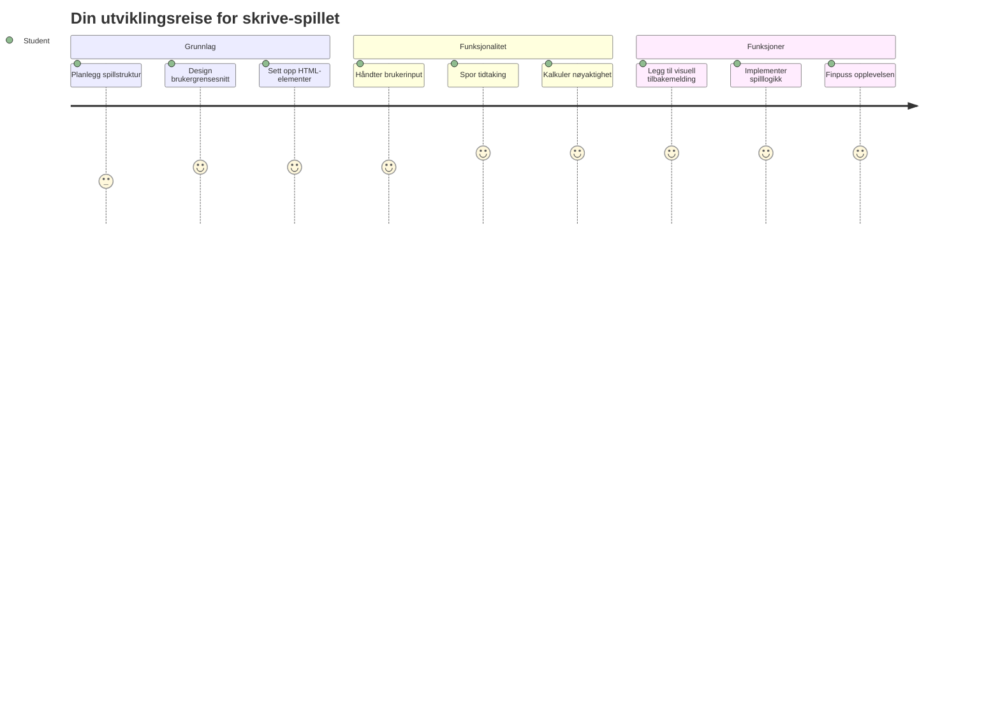
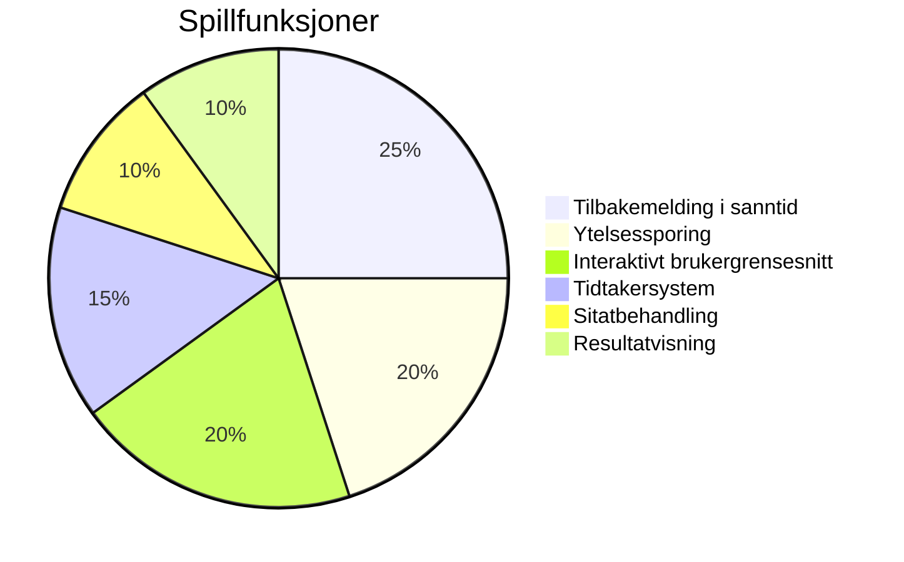
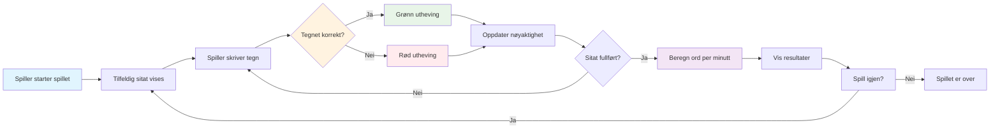
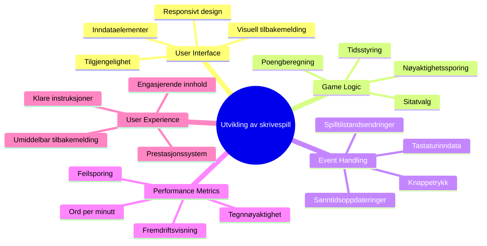
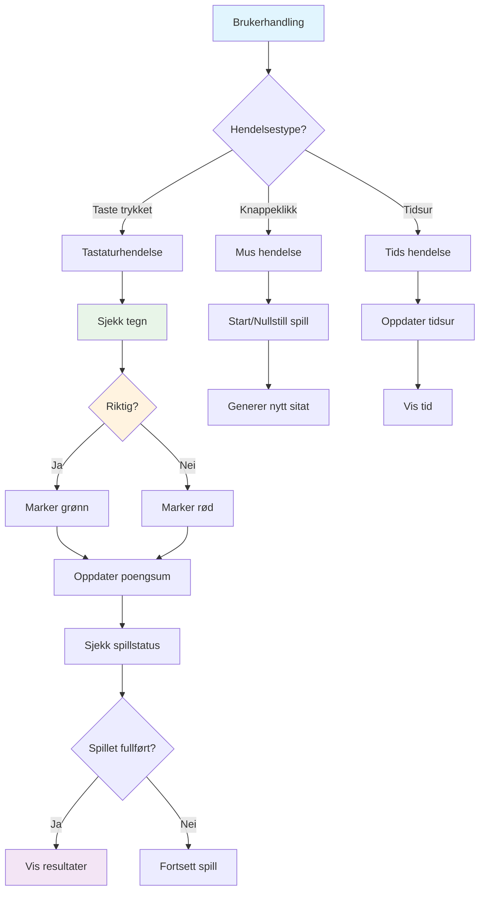
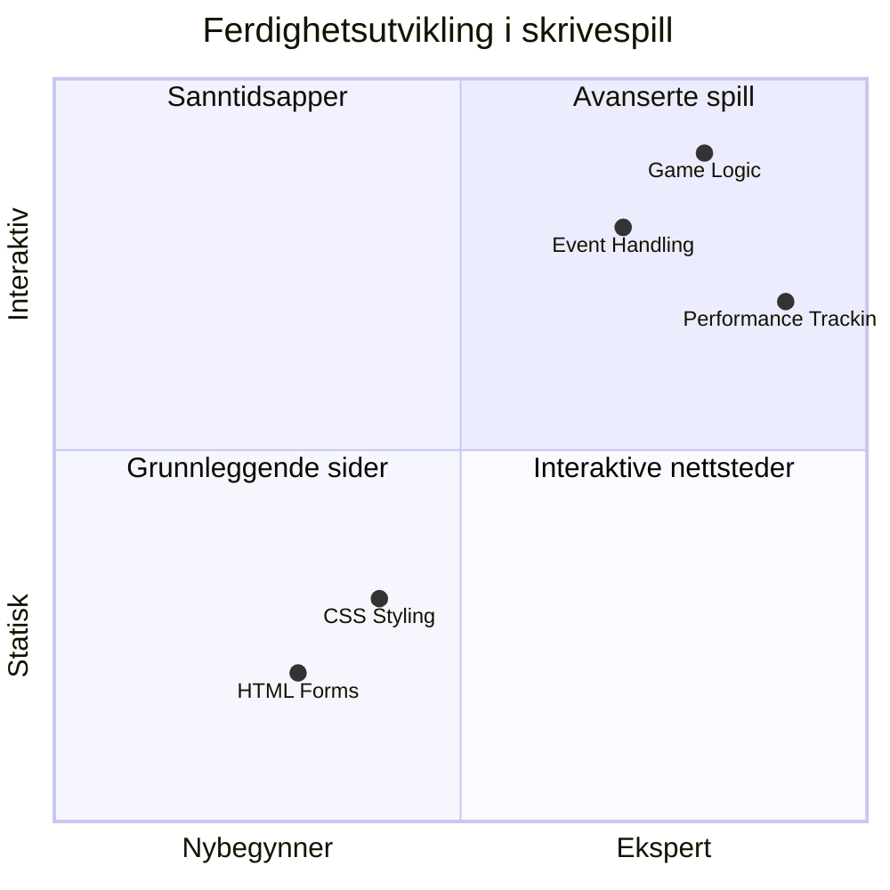
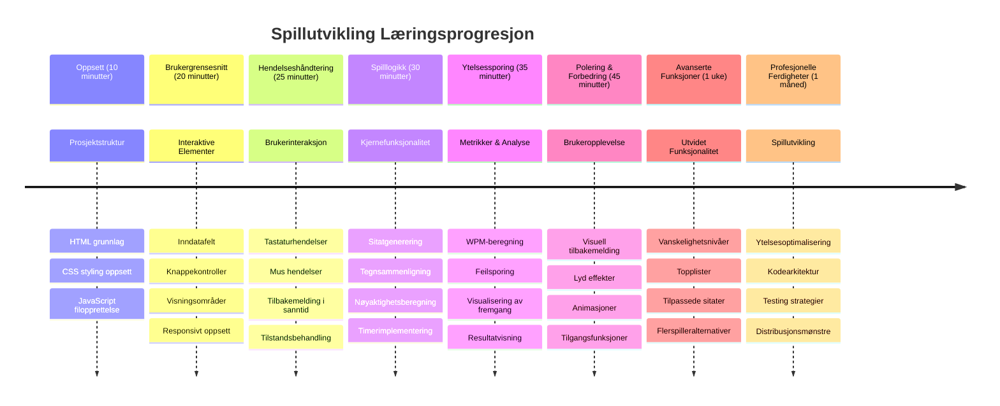

# Eventdrevet programmering - Lag et skrive-spill

## Introduksjon

Her er noe alle utviklere vet, men sjelden snakker om: å skrive raskt er en superkraft! 🚀 Tenk på det - jo raskere du kan få idéene dine fra hjernen til kodeditoren, desto mer kan kreativiteten flyte. Det er som å ha en direkte pipeline mellom tankene dine og skjermen.

Vil du vite en av de beste måtene å forbedre denne ferdigheten på? Du gjettet riktig - vi skal lage et spill!

> La oss lage et fantastisk skrive-spill sammen!

Klar til å jobbe med alle de JavaScript-, HTML- og CSS-ferdighetene du har lært? Vi skal lage et skrive-spill som vil utfordre deg med tilfeldige sitater fra den legendariske detektiven [Sherlock Holmes](https://en.wikipedia.org/wiki/Sherlock_Holmes). Spillet vil spore hvor raskt og nøyaktig du kan skrive - og tro meg, det er mer vanedannende enn du kanskje tror!

## Hva du trenger å kunne

Før vi begynner, sørg for at du er komfortabel med disse konseptene (ikke bekymre deg hvis du trenger en rask oppfriskning - vi har alle vært der!):

- Lage tekstinntak- og knappkontroller
- CSS og sette stiler ved hjelp av klasser  
- Grunnleggende JavaScript
  - Lage en array
  - Lage et tilfeldig tall
  - Hente nåværende tid

Hvis noen av disse føles litt rustne, er det helt fint! Noen ganger er den beste måten å styrke kunnskapen på å hoppe inn i et prosjekt og finne ut av ting underveis.

### 🔄 **Pedagogisk sjekk**
**Grunnvurdering**: Før du begynner utviklingen, sørg for at du forstår:
- ✅ Hvordan HTML-skjemaer og inntakselementer fungerer
- ✅ CSS-klasser og dynamisk styling
- ✅ JavaScript-hendelseslyttere og -håndterere
- ✅ Array-manipulering og tilfeldig utvalg
- ✅ Tidsmåling og beregninger

**Rask selvtest**: Kan du forklare hvordan disse konseptene fungerer sammen i et interaktivt spill?
- **Hendelser** utløses når brukere interagerer med elementer
- **Håndterere** prosesserer hendelsene og oppdaterer spilltilstand
- **CSS** gir visuell tilbakemelding på brukerhandlinger
- **Timing** gjør det mulig å måle ytelse og spillutvikling

## La oss lage dette!

[Opprette et skrive-spill ved å bruke eventdrevet programmering](./typing-game/README.md)

### ⚡ **Hva du kan gjøre på de neste 5 minuttene**
- [ ] Åpne nettleserkonsollen din og prøv å lytte etter tastaturhendelser med `addEventListener`
- [ ] Lag en enkel HTML-side med et inntaksfelt og test skrivegjenkjenning
- [ ] Øv på strengmanipulering ved å sammenligne skrevet tekst med måltekst
- [ ] Eksperimenter med `setTimeout` for å forstå tidsfunksjoner

### 🎯 **Hva du kan få til denne timen**
- [ ] Fullfør quiz etter leksjonen og forstå eventdrevet programmering
- [ ] Lag en grunnleggende versjon av skrive-spillet med ordvalidering
- [ ] Legg til visuell tilbakemelding for riktig og feil skriving
- [ ] Implementer et enkelt poengsystem basert på hastighet og nøyaktighet
- [ ] Style spillet ditt med CSS for å gjøre det visuelt tiltalende

### 📅 **Din ukelange spillutvikling**
- [ ] Fullfør det fullstendige skrive-spillet med alle funksjoner og finpuss
- [ ] Legg til vanskelighetsgrader med varierende ordkompleksitet
- [ ] Implementer statistikksporing for brukere (WPM, nøyaktighet over tid)
- [ ] Lag lydeffekter og animasjoner for bedre brukeropplevelse
- [ ] Gjør spillet ditt mobilvennlig for touch-enheter
- [ ] Del spillet ditt på nett og samle tilbakemeldinger fra brukere

### 🌟 **Din månedslange interaktive utvikling**
- [ ] Lag flere spill som utforsker ulike interaksjonsmønstre
- [ ] Lær om spill-løkker, tilstandshåndtering og ytelsesoptimalisering
- [ ] Bidra til open source prosjekter for spillutvikling
- [ ] Mestre avanserte tidskonsepter og jevne animasjoner
- [ ] Lag en portefølje som viser diverse interaktive applikasjoner
- [ ] Veiled andre som er interessert i spillutvikling og brukerinteraksjon

## 🎯 Din tidslinje for å mestre skrive-spillet

### 🛠️ Oppsummering av ditt spillutviklingsverktøy

Etter å ha fullført dette prosjektet, vil du ha mestret:
- **Eventdrevet programmering**: Responsive brukergrensesnitt som reagerer på input
- **Sanntidstilbakemelding**: Øyeblikkelige visuelle og ytelsesoppdateringer
- **Ytelsesmåling**: Nøyaktige tids- og poengsystemer
- **Spilltilstandshåndtering**: Kontroll på applikasjonsflyt og brukeropplevelse
- **Interaktiv design**: Å skape engasjerende og vanedannende brukeropplevelser
- **Moderne Web-APIer**: Utnytte nettleserfunksjoner for rike interaksjoner
- **Tilgjengelighetsmønstre**: Inkluderende design for alle brukere

**Virkelige bruksområder**: Disse ferdighetene gjelder direkte til:
- **Webapplikasjoner**: Alle interaktive grensesnitt eller dashbord
- **Utdanningsprogramvare**: Læringsplattformer og ferdighetstestverktøy
- **Produktivitetsverktøy**: Tekstredigerere, IDEer og samarbeidsprogramvare
- **Spillindustrien**: Nettleserspill og interaktiv underholdning
- **Mobilutvikling**: Touchbaserte grensesnitt og gesthåndtering

**Neste nivå**: Du er klar til å utforske avanserte spillrammeverk, sanntid flerspillersystemer eller komplekse interaktive applikasjoner!

## Credits

Skrevet med ♥️ av [Christopher Harrison](http://www.twitter.com/geektrainer)

---

<!-- CO-OP TRANSLATOR DISCLAIMER START -->
**Ansvarsfraskrivelse**:
Dette dokumentet er oversatt ved bruk av AI-oversettelsestjenesten [Co-op Translator](https://github.com/Azure/co-op-translator). Selv om vi streber etter nøyaktighet, vennligst merk at automatiserte oversettelser kan inneholde feil eller unøyaktigheter. Originaldokumentet på dets opprinnelige språk skal anses som den autoritative kilden. For kritisk informasjon anbefales profesjonell menneskelig oversettelse. Vi fraskriver oss ansvar for eventuelle misforståelser eller feiltolkninger som følge av bruk av denne oversettelsen.
<!-- CO-OP TRANSLATOR DISCLAIMER END -->