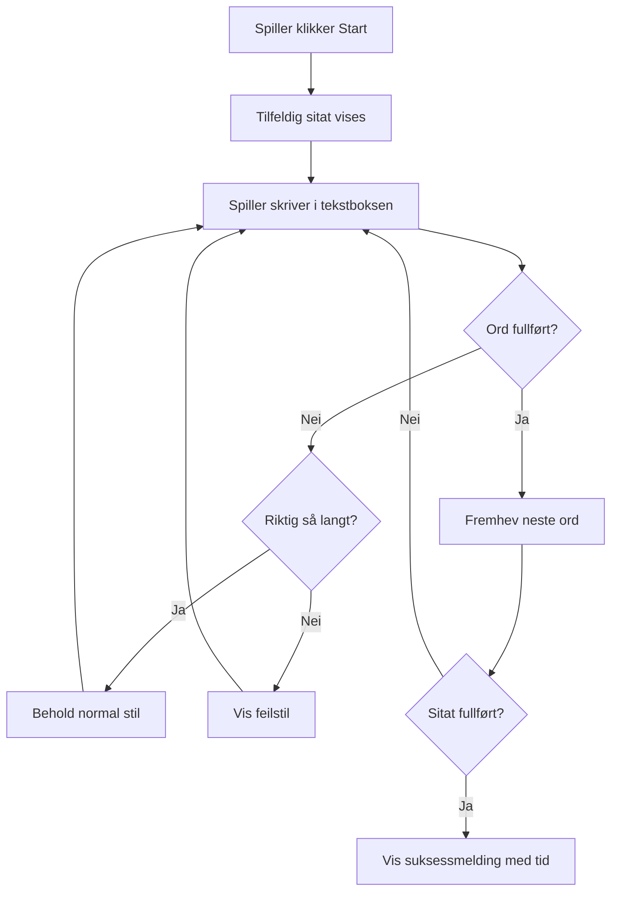
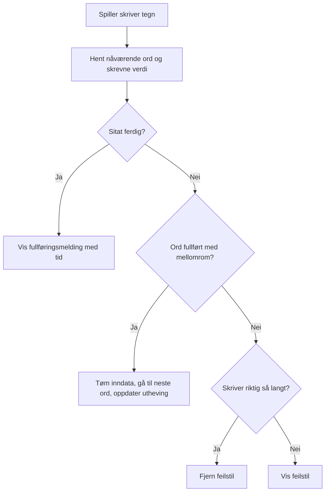
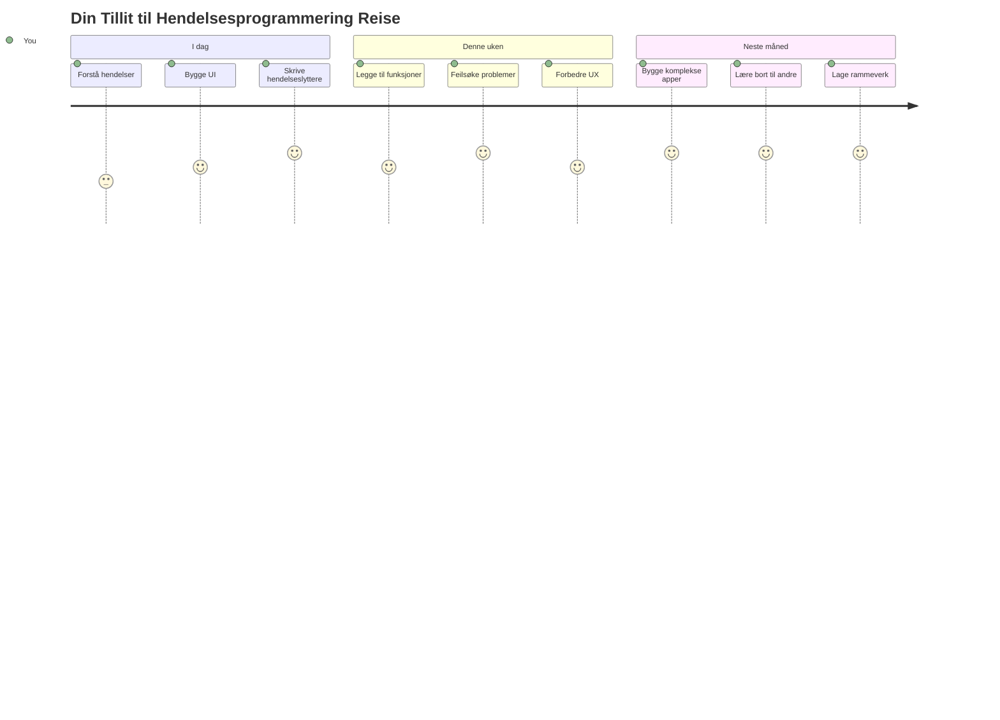

<!--
CO_OP_TRANSLATOR_METADATA:
{
  "original_hash": "da8bc72041a2bb3826a54654ee1a8844",
  "translation_date": "2026-01-07T00:47:41+00:00",
  "source_file": "4-typing-game/typing-game/README.md",
  "language_code": "no"
}
-->
# Lage et spill ved hjelp av hendelser

Har du noen gang lurt på hvordan nettsteder vet når du klikker på en knapp eller skriver i en tekstboks? Det er magien ved hendelsesdrevet programmering! Hva er vel en bedre måte å lære denne viktige ferdigheten på enn å bygge noe nyttig – et skrivhastighetsspill som reagerer på hvert tastetrykk du gjør.

Du skal få se på nært hold hvordan nettlesere "snakker" med JavaScript-koden din. Hver gang du klikker, skriver eller flytter musen, sender nettleseren små meldinger (vi kaller dem hendelser) til koden din, og du bestemmer hvordan du vil svare!

Når vi er ferdige her, har du laget et ekte skrivspill som følger med på hastigheten og nøyaktigheten din. Enda viktigere er at du vil forstå de grunnleggende konseptene som driver hvert interaktivt nettsted du noen gang har brukt. La oss sette i gang!

## Før-forelesnings-quiz

[Før-forelesnings-quiz](https://ff-quizzes.netlify.app/web/quiz/21)

## Hendelsesdrevet programmering

Tenk på din favorittapp eller favorittnettsted – hva gjør at det føles levende og responsivt? Det handler om hvordan det reagerer på det du gjør! Hvert trykk, klikk, sveip eller tastetrykk lager det vi kaller en "hendelse", og det er der den virkelige magien i webutvikling skjer.

Her er det som gjør programmering for nettet så interessant: vi vet aldri når noen vil klikke på knappen eller begynne å skrive i en tekstboks. De kan klikke med en gang, vente fem minutter, eller kanskje aldri klikke i det hele tatt! Denne uforutsigbarheten betyr at vi må tenke annerledes om hvordan vi skriver koden vår.

I stedet for å skrive kode som kjører ovenfra og ned som en oppskrift, skriver vi kode som tålmodig venter på at noe skal skje. Det er likt hvordan telegrafoperatører på 1800-tallet satt ved maskinene sine, klare til å svare i det øyeblikket en melding kom gjennom ledningen.

Men hva er egentlig en "hendelse"? Enkelt sagt, det er noe som skjer! Når du klikker på en knapp – det er en hendelse. Når du skriver en bokstav – det er en hendelse. Når du flytter på musa – det er en annen hendelse.

Hendelsesdrevet programmering lar oss sette opp koden vår til å lytte og svare. Vi lager spesielle funksjoner kalt **event listeners** som tålmodig venter på at bestemte ting skal skje, og så setter i gang når de gjør det.

Tenk på event listeners som en dørklokke for koden din. Du setter opp dørklokken (`addEventListener()`), forteller den hva slags lyd den skal lytte etter (som et 'click' eller 'keypress'), og spesifiserer hva som skal skje når noen ringer på (din egendefinerte funksjon).

**Slik fungerer event listeners:**
- **Lytter** etter spesifikke brukerhandlinger som klikk, tastetrykk eller musebevegelser
- **Utfører** din egendefinerte kode når den angitte hendelsen skjer
- **Reagerer** umiddelbart på brukerinteraksjoner, skaper en sømløs opplevelse
- **Håndterer** flere hendelser på samme element ved hjelp av ulike lyttere

> **MERK:** Det er verdt å nevne at det finnes mange måter å lage event listeners på. Du kan bruke anonyme funksjoner, eller lage navngitte funksjoner. Du kan bruke forskjellige snarveier, som å sette `click`-egenskapen, eller bruke `addEventListener()`. I øvelsen vår skal vi fokusere på `addEventListener()` og anonyme funksjoner, siden det sannsynligvis er den vanligste teknikken webutviklere bruker. Det er også den mest fleksible, da `addEventListener()` fungerer for alle hendelser, og hendelsesnavnet kan gis som en parameter.

### Vanlige hendelser

Selv om nettlesere tilbyr dusinvis av forskjellige hendelser du kan lytte etter, baserer de fleste interaktive apper seg på bare noen få essensielle hendelser. Å forstå disse kjernehendelsene gir deg fundamentet for å bygge sofistikerte brukerinteraksjoner.

Det finnes [dusiner av hendelser](https://developer.mozilla.org/docs/Web/Events) tilgjengelig som du kan lytte etter når du lager en applikasjon. I utgangspunktet løfter alt brukeren gjør på en side en hendelse, noe som gir deg stor kraft til å sikre at de får den opplevelsen du ønsker. Heldigvis trenger du vanligvis bare noen få hendelser. Her er noen vanlige (inkludert de to vi skal bruke i spillet vårt):

| Hendelse | Beskrivelse | Vanlige Bruksområder |
|----------|-------------|----------------------|
| `click` | Brukeren klikket på noe | Knapper, lenker, interaktive elementer |
| `contextmenu` | Brukeren klikket med høyre museknapp | Egne høyreklikk-menyvalg |
| `select` | Brukeren markerte noe tekst | Tekstredigering, kopiering |
| `input` | Brukeren skrev inn tekst | Skjemavalidering, sanntidssøk |

**Forstå disse hendelsestypene:**
- **Utløses** når brukere interagerer med bestemte elementer på siden din
- **Gir** detaljert informasjon om brukerens handling via hendelsesobjekter
- **Lar deg** lage responsive, interaktive nettapplikasjoner
- **Fungerer** konsekvent på tvers av forskjellige nettlesere og enheter

## Lage spillet

Nå som du forstår hvordan hendelser fungerer, la oss bruke kunnskapen i praksis ved å lage noe nyttig. Vi skal lage et skrivhastighetsspill som demonstrerer håndtering av hendelser samtidig som du utvikler en viktig utviklerferdighet.

Vi skal lage et spill for å utforske hvordan hendelser fungerer i JavaScript. Spillet vårt skal teste spillerens skrivingsevner, noe som er en av de mest undervurderte ferdighetene alle utviklere bør ha. Moro fakta: QWERTY-tastaturoppsettet vi bruker i dag, ble faktisk designet på 1870-tallet for skrivemaskiner – og gode skriveferdigheter er fortsatt like verdifulle for programmerere i dag! Spillflyten vår vil se slik ut:


**Slik fungerer spillet vårt:**
- **Starter** når spilleren klikker på startknappen og viser et tilfeldig sitat
- **Sporer** spillerens skriveprogresjon ord for ord i sanntid
- **Fremhever** det nåværende ordet for å lede spillerens fokus
- **Gir** umiddelbar visuell tilbakemelding ved skrivefeil
- **Beregner** og viser total tid når sitatet er fullført

La oss bygge spillet vårt og lære om hendelser!

### Filstruktur

Før vi begynner å kode, la oss få orden på ting! Å ha en ryddig filstruktur helt fra starten vil spare deg for mye trøbbel senere og gjøre prosjektet ditt mer profesjonelt. 😊

Vi skal holde det enkelt med bare tre filer: `index.html` for sidestrukturen, `script.js` for all spilllogikken, og `style.css` for å få alt til å se bra ut. Dette er den klassiske trioen som driver mesteparten av nettet!

**Lag en ny mappe til arbeidet ditt ved å åpne en konsoll- eller terminalvindu og skrive følgende kommando:**

```bash
# Linux eller macOS
mkdir typing-game && cd typing-game

# Windows
md typing-game && cd typing-game
```

**Dette gjør disse kommandoene:**
- **Oppretter** en ny mappe kalt `typing-game` for prosjektfilene dine
- **Går inn i** den nylig opprettede mappen automatisk
- **Setter opp** et rent arbeidsområde for spillutviklingen din

**Åpne Visual Studio Code:**

```bash
code .
```

**Denne kommandoen:**
- **Starter** Visual Studio Code i gjeldende mappe
- **Åpner** prosjektmappen i editoren
- **Gir** tilgang til alle utviklingsverktøyene du trenger

**Legg til tre filer i mappen i Visual Studio Code med følgende navn:**
- `index.html` - Inneholder strukturen og innholdet i spillet ditt
- `script.js` - Håndterer all spilllogikk og event listeners
- `style.css` - Definerer det visuelle uttrykket og stilen

## Lag brukergrensesnittet

Nå skal vi bygge scenen hvor all spillaktiviteten skjer! Tenk på det som å designe kontrollpanelet for et romskip – vi må sørge for at alt spillerne trenger er akkurat der de forventer det.

La oss finne ut hva spillet vårt faktisk trenger. Om du skulle spilt et skrivspill, hva ville du ønsket å se på skjermen? Her er hva vi trenger:

| UI-element | Formål | HTML-element |
|------------|--------|--------------|
| Sitatvisning | Viser teksten som skal skrives | `<p>` med `id="quote"` |
| Meldingområde | Viser status- og suksessmeldinger | `<p>` med `id="message"` |
| Tekstinnskriving | Hvor spilleren skriver sitatet | `<input>` med `id="typed-value"` |
| Startknapp | Starter spillet | `<button>` med `id="start"` |

**Forstå brukergrensesnittets struktur:**
- **Organiserer** innhold logisk fra topp til bunn
- **Tilordner** unike ID-er til elementer for JavaScript
- **Gir** klar visuell hierarki for bedre brukeropplevelse
- **Inkluderer** semantiske HTML-elementer for tilgjengelighet

Hvert av disse trenger ID-er slik at vi kan jobbe med dem i JavaScript. Vi legger også til referanser til CSS- og JavaScript-filene vi skal lage.

Lag en ny fil som heter `index.html`. Legg til følgende HTML:

```html
<!-- inside index.html -->
<html>
<head>
  <title>Typing game</title>
  <link rel="stylesheet" href="style.css">
</head>
<body>
  <h1>Typing game!</h1>
  <p>Practice your typing skills with a quote from Sherlock Holmes. Click **start** to begin!</p>
  <p id="quote"></p> <!-- This will display our quote -->
  <p id="message"></p> <!-- This will display any status messages -->
  <div>
    <input type="text" aria-label="current word" id="typed-value" /> <!-- The textbox for typing -->
    <button type="button" id="start">Start</button> <!-- To start the game -->
  </div>
  <script src="script.js"></script>
</body>
</html>
```

**Dette oppnår HTML-strukturen:**
- **Lenker** til CSS-stylesheet i `<head>` for styling
- **Oppretter** en tydelig overskrift og instruksjoner til brukeren
- **Etablerer** plassholderavsnitt med spesifikke ID-er for dynamisk innhold
- **Inkluderer** et inndatafelt med tilgjengelighetsattributter
- **Tilbyr** en startknapp for å starte spillet
- **Laster** JavaScript-filen til slutt for optimal ytelse

### Start applikasjonen

Det er lurt å teste applikasjonen ofte under utviklingen slik at du oppdager problemer tidlig og kan følge fremgangen i sanntid. Live Server er et uvurderlig verktøy som automatisk oppdaterer nettleseren hver gang du lagrer endringer, noe som gjør utviklingen mye mer effektiv.

Det er alltid best å utvikle trinnvis slik at du kan se hvordan ting ser ut. La oss starte applikasjonen vår. Det finnes en flott utvidelse til Visual Studio Code som heter [Live Server](https://marketplace.visualstudio.com/items?itemName=ritwickdey.LiveServer&WT.mc_id=academic-77807-sagibbon) som både kan være lokal vert for applikasjonen og oppdatere nettleseren hver gang du lagrer.

**Installer [Live Server](https://marketplace.visualstudio.com/items?itemName=ritwickdey.LiveServer&WT.mc_id=academic-77807-sagibbon) ved å følge lenken og klikke på Install:**

**Dette skjer under installasjonen:**
- **Ber** nettleseren din om å åpne Visual Studio Code
- **Veileder** deg gjennom utvidelsesinstallasjonsprosessen
- **Kan kreve** at du starter Visual Studio Code på nytt for å fullføre oppsettet

**Når den er installert, trykk Ctrl-Shift-P (eller Cmd-Shift-P) i Visual Studio Code for å åpne kommandopaletten:**

**Forstå kommandopaletten:**
- **Gir** rask tilgang til alle VS Code-kommandoer
- **Søker** etter kommandoer mens du skriver
- **Tilbyr** tastatursnarveier for raskere utvikling

**Skriv "Live Server: Open with Live Server":**

**Dette gjør Live Server:**
- **Starter** en lokal utviklingsserver for prosjektet ditt
- **Oppdaterer** nettleseren automatisk ved lagring av filer
- **Serverer** filene dine fra en lokal URL (vanligvis `localhost:5500`)

**Åpne en nettleser og gå til `https://localhost:5500`:**

Du skal nå se siden du laget! La oss legge til funksjonalitet.

## Legg til CSS

Nå skal vi få ting til å se bra ut! Visuell tilbakemelding har vært avgjørende for brukergrensesnitt siden datamaskintidenes begynnelse. På 1980-tallet oppdaget forskere at umiddelbar visuell tilbakemelding dramatisk forbedrer brukerens ytelse og reduserer feil. Det er nettopp det vi skal lage.

Spillet vårt må være krystallklart på hva som skjer. Spillere bør umiddelbart vite hvilket ord de skal skrive, og om de gjør en feil, skal de se det med en gang. La oss lage enkel, men effektiv styling:

Lag en ny fil som heter `style.css` og legg til følgende syntaks.

```css
/* inside style.css */
.highlight {
  background-color: yellow;
}

.error {
  background-color: lightcoral;
  border: red;
}
```

**Forstå disse CSS-klassene:**
- **Fremhever** det nåværende ordet med gul bakgrunn for tydelig visuell veiledning
- **Signaliserer** skrivefeil med en lys korallfarget bakgrunn
- **Gir** umiddelbar tilbakemelding uten å forstyrre skrivingen
- **Bruker** kontrasterende farger for tilgjengelighet og klar visuell kommunikasjon

✅ Når det kommer til CSS kan du legge opp siden din akkurat som du vil. Ta litt tid og gjør siden mer tiltalende:

- Velg et annet fontsett
- Farg overskriftene
- Endre størrelse på elementene

## JavaScript

Her begynner det å bli interessant! 🎉 Vi har HTML-strukturen vår og CSS-stylingen, men akkurat nå er spillet vårt som en vakker bil uten motor. JavaScript blir motoren – det som gjør at alt faktisk fungerer og reagerer på det spillerne gjør.

Her vil du se skapelsen din komme til liv. Vi tar det steg for steg så ingenting føles overveldende:

| Steg | Formål | Hva du lærer |
|-------|---------|--------------|
| [Lag konstantene](../../../../4-typing-game/typing-game) | Sett opp sitater og DOM-referanser | Variabelhåndtering og DOM-utvalg |
| [Event listener for å starte spillet](../../../../4-typing-game/typing-game) | Håndter spillinitiering | Hendelseshåndtering og UI-oppdateringer |
| [Event listener for skriving](../../../../4-typing-game/typing-game) | Prosesser brukerinput i sanntid | Inputvalidering og dynamisk tilbakemelding |

**Denne strukturerte tilnærmingen hjelper deg å:**
- **Organisere** koden i logiske og håndterbare seksjoner
- **Bygge** funksjonalitet trinnvis for enklere feilsøking
- **Forstå** hvordan ulike deler av applikasjonen jobber sammen
- **Skape** gjenbruksmønstre til fremtidige prosjekter

Men først, lag en ny fil som heter `script.js`.

### Lag konstantene

Før vi setter i gang, la oss samle alle ressursene våre! På samme måte som NASA sin kontrollrom setter opp alle overvåkingssystemene før oppskytning, er det mye enklere når du har alt klart og ferdig. Dette sparer oss fra å lete rundt senere og unngår skrivefeil.

Her er det vi må sette opp først:

| Datatype | Formål | Eksempel |
|-----------|---------|----------|
| Array of quotes | Lagre alle mulige sitater for spillet | `['Quote 1', 'Quote 2', ...]` |
| Word array | Del opp gjeldende sitat i individuelle ord | `['When', 'you', 'have', ...]` |
| Word index | Følg med på hvilket ord spilleren skriver | `0, 1, 2, 3...` |
| Start time | Beregn forløpt tid for poengberegning | `Date.now()` |

**Vi trenger også referanser til brukergrensesnitt-elementene våre:**
| Element | ID | Formål |
|---------|----|---------|
| Tekstinput | `typed-value` | Hvor spillerne skriver |
| Sitatvisning | `quote` | Viser sitatet som skal skrives |
| Meldingområde | `message` | Viser statusoppdateringer |

```javascript
// inne i script.js
// alle våre sitater
const quotes = [
    'When you have eliminated the impossible, whatever remains, however improbable, must be the truth.',
    'There is nothing more deceptive than an obvious fact.',
    'I ought to know by this time that when a fact appears to be opposed to a long train of deductions it invariably proves to be capable of bearing some other interpretation.',
    'I never make exceptions. An exception disproves the rule.',
    'What one man can invent another can discover.',
    'Nothing clears up a case so much as stating it to another person.',
    'Education never ends, Watson. It is a series of lessons, with the greatest for the last.',
];
// lagre listen over ord og indeksen til ordet spilleren skriver for øyeblikket
let words = [];
let wordIndex = 0;
// starttiden
let startTime = Date.now();
// sideelementer
const quoteElement = document.getElementById('quote');
const messageElement = document.getElementById('message');
const typedValueElement = document.getElementById('typed-value');
```

**Bryter ned hva denne oppsettkoden oppnår:**
- **Lagrer** en array med Sherlock Holmes-sitater ved bruk av `const` siden sitatene ikke endres
- **Initialiserer** sporingsvariabler med `let` fordi disse verdiene oppdateres under spill
- **Fanger opp** referanser til DOM-elementer ved bruk av `document.getElementById()` for effektiv tilgang
- **Setter opp** grunnlaget for all spillfunksjonalitet med klare, beskrivende variabelnavn
- **Organiserer** relaterte data og elementer logisk for enklere vedlikehold av kode

✅ Gå videre og legg til flere sitater i spillet ditt

> 💡 **Profftips**: Vi kan hente elementene når som helst i koden ved bruk av `document.getElementById()`. Fordi vi skal referere til disse elementene jevnlig, unngår vi skrivefeil ved å bruke konstanter. Rammeverk som [Vue.js](https://vuejs.org/) eller [React](https://reactjs.org/) kan hjelpe deg med bedre sentralisering av koden.
>
**Her er hvorfor denne tilnærmingen fungerer så godt:**
- **Forhindrer** stavefeil når elementer refereres flere ganger
- **Forbedrer** kode-lesbarhet med beskrivende konstantnavn
- **Muliggjør** bedre IDE-støtte med autoutfylling og feilsjekk
- **Gjør** refaktorering enklere om element-IDer endres senere

Ta et minutt og se en video om bruk av `const`, `let` og `var`

[](https://youtube.com/watch?v=JNIXfGiDWM8 "Typer variabler")

> 🎥 Klikk på bildet over for en video om variabler.

### Legg til startlogikk

Her kommer alt på plass! 🚀 Du er i ferd med å skrive din første virkelige eventlistener, og det er ganske tilfredsstillende å se koden din respondere på et knappetrykk.

Tenk på det: et sted der ute kommer en spiller til å trykke på "Start"-knappen, og koden din må være klar. Vi vet ikke når de klikker – det kan være med en gang, eller etter at de har tatt seg en kaffe – men når de gjør det, våkner spillet til liv.

Når brukeren klikker `start`, må vi velge et sitat, sette opp UI, og starte sporing for gjeldende ord og tidtaking. Nedenfor er JavaScripten du må legge til; vi forklarer det rett etter kodeblokken.

```javascript
// på slutten av script.js
document.getElementById('start').addEventListener('click', () => {
  // hent et sitat
  const quoteIndex = Math.floor(Math.random() * quotes.length);
  const quote = quotes[quoteIndex];
  // Sett sitatet inn i en matrise av ord
  words = quote.split(' ');
  // tilbakestill ordindeksen for sporing
  wordIndex = 0;

  // UI-oppdateringer
  // Lag en matrise av span-elementer slik at vi kan sette en klasse
  const spanWords = words.map(function(word) { return `<span>${word} </span>`});
  // Konverter til streng og sett som innerHTML på sitatvisning
  quoteElement.innerHTML = spanWords.join('');
  // Fremhev det første ordet
  quoteElement.childNodes[0].className = 'highlight';
  // Fjern eventuelle tidligere meldinger
  messageElement.innerText = '';

  // Sett opp tekstboksen
  // Tøm tekstboksen
  typedValueElement.value = '';
  // sett fokus
  typedValueElement.focus();
  // sett hendelsesbehandleren

  // Start timeren
  startTime = new Date().getTime();
});
```

**La oss dele opp koden i logiske seksjoner:**

**📊 Oppsett for ordsporing:**
- **Velger** et tilfeldig sitat med `Math.floor()` og `Math.random()` for variasjon
- **Konverterer** sitatet til en array med individuelle ord ved bruk av `split(' ')`
- **Nullstiller** `wordIndex` til 0 siden spillerne starter på første ord
- **Forbereder** spilltilstanden for en ny runde

**🎨 Oppsett og visning i UI:**
- **Lager** en array med `<span>`-elementer, pakker hvert ord inn for individuell styling
- **Slår sammen** span-elementene til en enkelt streng for effektiv DOM-oppdatering
- **Fremhever** det første ordet ved å legge til CSS-klassen `highlight`
- **Fjerner** tidligere meldinger for å gi et rent utgangspunkt

**⌨️ Forberedelse av tekstboks:**
- **Tømmer** eventuelt eksisterende tekst i inputfeltet
- **Setter fokus** på tekstboksen slik at spillerne kan begynne å skrive med en gang
- **Gjør klar** inputområdet for den nye spilløkten

**⏱️ Timer-innitialisering:**
- **Fanger** nåværende tidsstempel med `new Date().getTime()`
- **Muliggjør** nøyaktig beregning av skrivhastighet og fullføringstid
- **Starter** ytelsessporingen for spilløkten

### Legg til skrive-logikk

Her tar vi for oss kjernen i spillet vårt! Ikke bekymre deg hvis det virker mye i starten – vi går gjennom hver del, og til slutt ser du hvor logisk alt er.

Det vi bygger her er ganske avansert: hver gang noen skriver en bokstav, vil koden sjekke hva de skrev, gi tilbakemelding, og avgjøre hva som skal skje videre. Det er likt hvordan tidlige tekstbehandlere som WordStar på 1970-tallet ga sanntidstilbakemelding til skrivere.

```javascript
// på slutten av script.js
typedValueElement.addEventListener('input', () => {
  // Få det nåværende ordet
  const currentWord = words[wordIndex];
  // få den nåværende verdien
  const typedValue = typedValueElement.value;

  if (typedValue === currentWord && wordIndex === words.length - 1) {
    // slutten av setningen
    // Vis suksess
    const elapsedTime = new Date().getTime() - startTime;
    const message = `CONGRATULATIONS! You finished in ${elapsedTime / 1000} seconds.`;
    messageElement.innerText = message;
  } else if (typedValue.endsWith(' ') && typedValue.trim() === currentWord) {
    // slutten av ordet
    // tøm typedValueElement for det nye ordet
    typedValueElement.value = '';
    // gå til neste ord
    wordIndex++;
    // tilbakestill klassenavn for alle elementer i sitatet
    for (const wordElement of quoteElement.childNodes) {
      wordElement.className = '';
    }
    // marker det nye ordet
    quoteElement.childNodes[wordIndex].className = 'highlight';
  } else if (currentWord.startsWith(typedValue)) {
    // per i dag korrekt
    // marker neste ord
    typedValueElement.className = '';
  } else {
    // feiltillatelse
    typedValueElement.className = 'error';
  }
});
```

**Forståelse av skrive-logikkens flyt:**

Denne funksjonen bruker en fossefallstilnærming, hvor den sjekker betingelsene fra mest spesifikke til mest generelle. La oss bryte ned hvert scenario:


**🏁 Sitat ferdig (Scenario 1):**
- **Sjekker** om skrevet verdi matcher det gjeldende ordet OG vi er på siste ord
- **Beregner** forløpt tid ved å trekke starttiden fra nåværende tid
- **Konverterer** millisekunder til sekunder ved å dele på 1 000
- **Viser** en gratulasjonsmelding med fullføringstid

**✅ Ord ferdig (Scenario 2):**
- **Oppdager** når ord er ferdig ved at input ender med et mellomrom
- **Validerer** at trimmet input matcher det gjeldende ordet nøyaktig
- **Tømmer** inputfeltet for neste ord
- **Går videre** til neste ord ved å øke `wordIndex`
- **Oppdaterer** visuell fremheving ved å fjerne alle klasser og fremheve nytt ord

**📝 Skriving pågår (Scenario 3):**
- **Bekrefter** at gjeldende ord starter med det som er skrevet så langt
- **Fjerner** eventuell feil-styling for å vise at input er korrekt
- **Tillater** jevn skriving uten avbrudd

**❌ Feilstatus (Scenario 4):**
- **Utløses** når skrevet tekst ikke matcher forventet ordstart
- **Legger til** CSS-klassen for feil for å gi umiddelbar visuell tilbakemelding
- **Hjelper** spillerne med å raskt identifisere og rette feil

## Test applikasjonen din

Se hva du har fått til! 🎉 Du har nettopp laget et ekte, fungerende skrive-spill fra bunnen av med hendelsesstyrt programmering. Ta et øyeblikk for å sette pris på det – dette er ikke småtteri!

Nå kommer testfasen! Vil det fungere som forventet? Har vi glemt noe? Saken er at hvis noe ikke virker helt perfekt med en gang, er det helt normalt. Selv erfarne utviklere finner feil i koden jevnlig. Det er bare en del av utviklingsprosessen!

Klikk på `start` og begynn å skrive! Det skal se litt ut som animasjonen vi så tidligere.


**Hva du bør teste i applikasjonen din:**
- **Bekreft** at klikk på Start viser et tilfeldig sitat
- **Sjekk** at skriving fremhever gjeldende ord korrekt
- **Kontroller** at feil-styling dukker opp ved feil skriving
- **Sørg for** at fullførte ord flytter fremhevingen riktig
- **Test** at fullføring av sitatet viser fullføringsmeldingen med tid

**Vanlige feilsøkingsråd:**
- **Sjekk** nettleser-konsollen (F12) for JavaScript-feil
- **Bekreft** at alle filnavn stemmer helt (med store/små bokstaver)
- **Sørg for** at Live Server kjører og oppdaterer riktig
- **Test** ulike sitater for å kontrollere tilfeldig valg

---

## GitHub Copilot Agent Challenge 🎮

Bruk Agent-modus for å fullføre følgende utfordring:

**Beskrivelse:** Utvid skrive-spillet ved å implementere et vanskelighetsnivå-system som justerer spillet basert på spillerens prestasjon. Denne utfordringen hjelper deg med avansert hendelseshåndtering, dataanalyse og dynamiske UI-oppdateringer.

**Oppgave:** Lag et system for vanskelighetsjustering i skrive-spillet som:
1. Sporer spillerens skrivehastighet (ord per minutt) og nøyaktighetsprosent
2. Justerer automatisk mellom tre vanskelighetsnivåer: Lett (enkle sitater), Medium (nåværende sitater), Vanskelig (komplekse sitater med tegnsetting)
3. Viser nåværende vanskelighetsnivå og spillerstatistikk i UI
4. Implementerer en strekkteller som øker vanskelighetsgraden etter 3 påfølgende gode prestasjoner
5. Legger til visuell tilbakemelding (farger, animasjoner) for å indikere vanskelighetsendringer

Legg til nødvendige HTML-elementer, CSS-stiler og JavaScript-funksjoner for å implementere denne funksjonen. Inkluder god feilhåndtering og sørg for at spillet forblir tilgjengelig med passende ARIA-etiketter.

Lær mer om [agent mode](https://code.visualstudio.com/blogs/2025/02/24/introducing-copilot-agent-mode) her.

## 🚀 Utfordring

Klar til å ta skrive-spillet ditt til neste nivå? Prøv å implementere disse avanserte funksjonene for å fordype deg i hendelseshåndtering og DOM-manipulering:

**Legg til mer funksjonalitet:**

| Funksjon | Beskrivelse | Ferdigheter du vil øve på |
|---------|-------------|---------------------------|
| **Input-kontroll** | Deaktiver `input`-event listener ved fullføring, og aktiver på nytt når knappen klikkes | Hendelseshåndtering og tilstands-kontroll |
| **UI-tilstandsbehandling** | Deaktiver tekstboksen når spilleren fullfører sitatet | Manipulasjon av DOM-egenskaper |
| **Modaldialog** | Vis en modaldialogboks med suksessmelding | Avanserte UI-mønstre og tilgjengelighet |
| **High Score-system** | Lagre toppkarakterer ved bruk av `localStorage` | Nettleserlagring og datalagring |

**Implementeringstips:**
- **Undersøk** `localStorage.setItem()` og `localStorage.getItem()` for vedvarende lagring
- **Øv** på å legge til og fjerne event listeners dynamisk
- **Utforsk** HTML dialog-elementer eller CSS modal-mønstre
- **Vurder** tilgjengelighet når du deaktiverer og aktiverer skjema-kontroller

## Quiz etter forelesning

[Post-lecture quiz](https://ff-quizzes.netlify.app/web/quiz/22)

---

## 🚀 Din skrive-spill-mester-tidslinje

### ⚡ **Hva du kan gjøre de neste 5 minuttene**
- [ ] Test skrive-spillet med ulike sitater for å sikre at det fungerer smidig
- [ ] Eksperimenter med CSS-styling – prøv å endre farge på fremheving og feil
- [ ] Åpne nettleserens DevTools (F12) og se på Konsollen mens du spiller
- [ ] Gi deg selv en utfordring ved å prøve å fullføre et sitat så raskt som mulig

### ⏰ **Hva du kan oppnå denne timen**
- [ ] Legg til flere sitater i arrayen (kanskje fra dine favorittbøker eller filmer)
- [ ] Implementer localStorage high score-systemet fra utfordringsdelen
- [ ] Lag en ord-per-minutt-kalkulator som vises etter hver runde
- [ ] Legg til lydeffekter for korrekt skriving, feil og fullføring

### 📅 **Din ukeslange reise**
- [ ] Lag en flerspiller-versjon der venner kan konkurrere side om side
- [ ] Lag ulike vanskelighetsnivåer med varierende sitatkompleksitet
- [ ] Legg til en fremdriftsindikator som viser hvor mye av sitatet som er ferdig
- [ ] Implementer brukerkontoer med personlig statistikksporing
- [ ] Design egendefinerte temaer og la brukere velge sin foretrukne stil

### 🗓️ **Din månedslange transformasjon**
- [ ] Lag et skrivekurs med leksjoner som progresivt lærer riktig fingerplassering
- [ ] Bygg analyseverktøy som viser hvilke bokstaver eller ord som gir flest feil
- [ ] Legg til støtte for forskjellige språk og tastaturoppsett
- [ ] Integrer med utdannings-APIer for å hente sitater fra litteraturdatabaser
- [ ] Publiser ditt forbedrede skrive-spill for andre å bruke og glede seg over

### 🎯 **Siste refleksjons-sjekk**

**Før du går videre, ta et øyeblikk og feir:**
- Hva var det mest tilfredsstillende øyeblikket under byggingen av dette spillet?
- Hvordan føler du deg om hendelsesstyrt programmering nå sammenlignet med da du startet?
- Hva er en funksjon du gleder deg til å legge til for å gjøre spillet unikt ditt?
- Hvordan kan du bruke hendelseshåndteringskonsepter i andre prosjekter?


> 🌟 **Husk**: Du har nettopp mestret et av kjerneprinsippene som driver alle interaktive nettsider og applikasjoner. Hendelsesstyrt programmering er det som får nettet til å føles levende og responsivt. Hver gang du ser en nedtrekksmeny, et skjema som validerer mens du skriver, eller et spill som reagerer på klikk, forstår du magien bak det. Du lærer ikke bare å kode – du lærer å skape opplevelser som føles intuitive og engasjerende! 🎉

---

## Review & Selvstudium

Les mer om [alle hendelser tilgjengelig](https://developer.mozilla.org/docs/Web/Events) for utviklere via nettleseren, og vurder i hvilke situasjoner du vil bruke hver av dem.

## Oppgave

[Lag et nytt tastaturspill](assignment.md)

---

<!-- CO-OP TRANSLATOR DISCLAIMER START -->
**Ansvarsfraskrivelse**:
Dette dokumentet er oversatt ved hjelp av AI-oversettelsestjenesten [Co-op Translator](https://github.com/Azure/co-op-translator). Selv om vi streber etter nøyaktighet, vennligst vær oppmerksom på at automatiserte oversettelser kan inneholde feil eller unøyaktigheter. Det originale dokumentet på originalspråket bør anses som den autoritative kilden. For kritisk informasjon anbefales profesjonell menneskelig oversettelse. Vi er ikke ansvarlige for eventuelle misforståelser eller feiltolkninger som oppstår ved bruk av denne oversettelsen.
<!-- CO-OP TRANSLATOR DISCLAIMER END -->