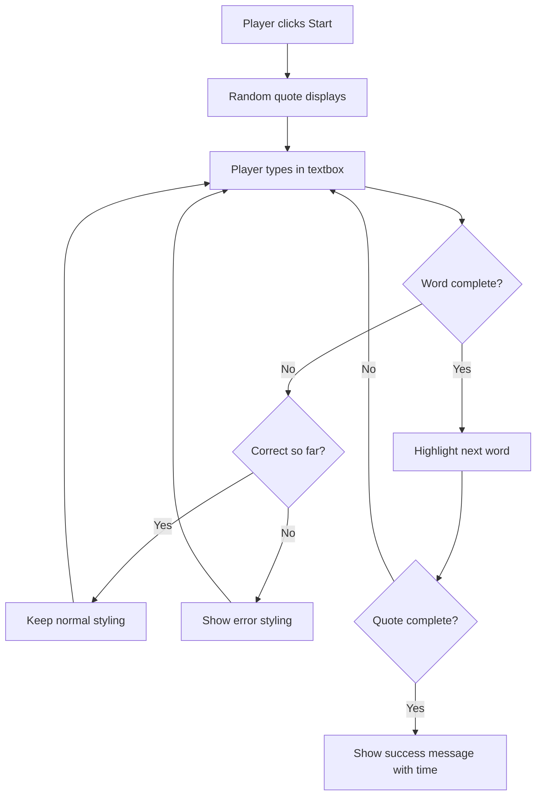
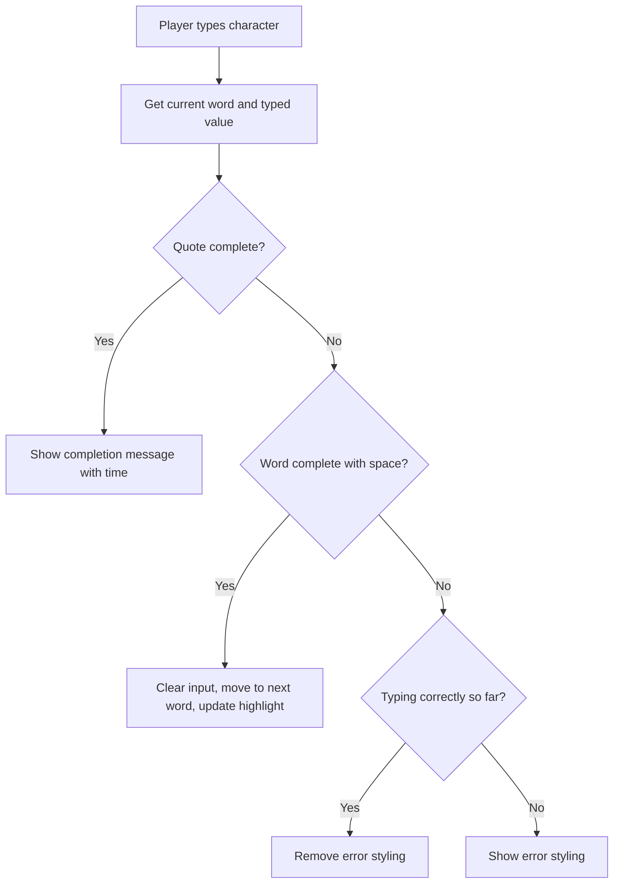

<!--
CO_OP_TRANSLATOR_METADATA:
{
  "original_hash": "e6b75e5b8caae906473a8a09d77b7121",
  "translation_date": "2025-10-23T22:34:20+00:00",
  "source_file": "4-typing-game/typing-game/README.md",
  "language_code": "no"
}
-->
# Lage et spill ved hjelp av hendelser

Har du noen gang lurt på hvordan nettsteder vet når du klikker på en knapp eller skriver i en tekstboks? Det er magien med hendelsesdrevet programmering! Hva er vel bedre måte å lære denne essensielle ferdigheten på enn å bygge noe nyttig – et skrivehastighetsspill som reagerer på hver tast du trykker.

Du kommer til å se med egne øyne hvordan nettlesere "snakker" med JavaScript-koden din. Hver gang du klikker, skriver eller beveger musen, sender nettleseren små meldinger (vi kaller dem hendelser) til koden din, og du får bestemme hvordan du skal reagere!

Når vi er ferdige her, vil du ha bygget et ekte skrivehastighetsspill som sporer hastigheten og nøyaktigheten din. Enda viktigere, du vil forstå de grunnleggende konseptene som driver hver interaktive nettside du noen gang har brukt. La oss sette i gang!

## Quiz før forelesning

[Quiz før forelesning](https://ff-quizzes.netlify.app/web/quiz/21)

## Hendelsesdrevet programmering

Tenk på din favorittapp eller nettside – hva gjør at den føles levende og responsiv? Det handler om hvordan den reagerer på det du gjør! Hver berøring, klikk, sveip eller tastetrykk skaper det vi kaller en "hendelse", og det er der den virkelige magien i webutvikling skjer.

Her er det som gjør programmering for nettet så interessant: vi vet aldri når noen vil klikke på den knappen eller begynne å skrive i en tekstboks. De kan klikke umiddelbart, vente fem minutter, eller kanskje aldri klikke i det hele tatt! Denne uforutsigbarheten betyr at vi må tenke annerledes om hvordan vi skriver koden vår.

I stedet for å skrive kode som kjører fra topp til bunn som en oppskrift, skriver vi kode som sitter tålmodig og venter på at noe skal skje. Det er litt som hvordan telegrafoperatører på 1800-tallet satt ved maskinene sine, klare til å svare i det øyeblikket en melding kom gjennom ledningen.

Så hva er egentlig en "hendelse"? Enkelt sagt, det er noe som skjer! Når du klikker på en knapp – det er en hendelse. Når du skriver en bokstav – det er en hendelse. Når du beveger musen – det er en annen hendelse.

Hendelsesdrevet programmering lar oss sette opp koden vår til å lytte og reagere. Vi lager spesielle funksjoner kalt **hendelseslyttere** som venter tålmodig på spesifikke ting som skal skje, og som deretter reagerer når de gjør det.

Tenk på hendelseslyttere som å ha en dørklokke for koden din. Du setter opp dørklokken (`addEventListener()`), forteller den hvilken lyd den skal lytte etter (som et 'klikk' eller 'tastetrykk'), og deretter spesifiserer hva som skal skje når noen ringer på (din tilpassede funksjon).

**Slik fungerer hendelseslyttere:**
- **Lytter** etter spesifikke brukerhandlinger som klikk, tastetrykk eller musebevegelser
- **Utfører** din tilpassede kode når den spesifiserte hendelsen oppstår
- **Reagerer** umiddelbart på brukerinteraksjoner, og skaper en sømløs opplevelse
- **Håndterer** flere hendelser på samme element ved hjelp av forskjellige lyttere

> **NOTE:** Det er verdt å fremheve at det finnes mange måter å lage hendelseslyttere på. Du kan bruke anonyme funksjoner eller lage navngitte. Du kan bruke ulike snarveier, som å sette `click`-egenskapen, eller bruke `addEventListener()`. I vår øvelse skal vi fokusere på `addEventListener()` og anonyme funksjoner, da det sannsynligvis er den mest vanlige teknikken webutviklere bruker. Det er også den mest fleksible, ettersom `addEventListener()` fungerer for alle hendelser, og hendelsesnavnet kan gis som en parameter.

### Vanlige hendelser

Selv om nettlesere tilbyr dusinvis av forskjellige hendelser du kan lytte etter, er det de mest grunnleggende hendelsene som de fleste interaktive applikasjoner er avhengige av. Å forstå disse kjernehendelsene vil gi deg grunnlaget for å bygge sofistikerte brukerinteraksjoner.

Det finnes [mange hendelser](https://developer.mozilla.org/docs/Web/Events) du kan lytte etter når du lager en applikasjon. I utgangspunktet vil alt en bruker gjør på en side utløse en hendelse, noe som gir deg mye makt til å sikre at de får den opplevelsen du ønsker. Heldigvis trenger du vanligvis bare et lite utvalg av hendelser. Her er noen vanlige (inkludert de to vi skal bruke når vi lager spillet vårt):

| Hendelse | Beskrivelse | Vanlige bruksområder |
|----------|-------------|-----------------------|
| `click` | Brukeren klikket på noe | Knapp, lenker, interaktive elementer |
| `contextmenu` | Brukeren høyreklikket | Tilpassede høyreklikkmenyer |
| `select` | Brukeren markerte tekst | Tekstredigering, kopieringsoperasjoner |
| `input` | Brukeren skrev inn tekst | Skjemavalidering, sanntidssøk |

**Forstå disse hendelsestypene:**
- **Utløses** når brukere interagerer med spesifikke elementer på siden din
- **Gir** detaljert informasjon om brukerens handling gjennom hendelsesobjekter
- **Muliggjør** at du kan lage responsive, interaktive webapplikasjoner
- **Fungerer** konsekvent på tvers av forskjellige nettlesere og enheter

## Lage spillet

Nå som du forstår hvordan hendelser fungerer, la oss sette den kunnskapen ut i praksis ved å lage noe nyttig. Vi skal lage et skrivehastighetsspill som demonstrerer hendelseshåndtering samtidig som det hjelper deg med å utvikle en viktig ferdighet som utvikler.

Vi skal lage et spill for å utforske hvordan hendelser fungerer i JavaScript. Spillet vårt vil teste en spillers skriveferdigheter, som er en av de mest undervurderte ferdighetene alle utviklere bør ha. Fun fact: QWERTY-tastaturoppsettet vi bruker i dag ble faktisk designet på 1870-tallet for skrivemaskiner – og gode skriveferdigheter er fortsatt like verdifulle for programmerere i dag! Den generelle flyten i spillet vil se slik ut:



**Slik fungerer spillet vårt:**
- **Starter** når spilleren klikker på startknappen og viser et tilfeldig sitat
- **Sporer** spillerens skriveprogresjon ord for ord i sanntid
- **Fremhever** det aktuelle ordet for å veilede spillerens fokus
- **Gir** umiddelbar visuell tilbakemelding for skrivefeil
- **Beregner** og viser total tid når sitatet er fullført

La oss bygge spillet vårt og lære om hendelser!

### Filstruktur

Før vi begynner å kode, la oss organisere oss! Å ha en ryddig filstruktur fra begynnelsen vil spare deg for hodebry senere og gjøre prosjektet ditt mer profesjonelt. 😊

Vi skal holde det enkelt med bare tre filer: `index.html` for strukturen på siden vår, `script.js` for all spilllogikken, og `style.css` for å få alt til å se bra ut. Dette er den klassiske trioen som driver mesteparten av nettet!

**Opprett en ny mappe for arbeidet ditt ved å åpne en konsoll eller terminalvindu og skrive følgende kommando:**

```bash
# Linux or macOS
mkdir typing-game && cd typing-game

# Windows
md typing-game && cd typing-game
```

**Dette gjør kommandoene:**
- **Oppretter** en ny katalog kalt `typing-game` for prosjektfilene dine
- **Navigerer** automatisk inn i den nyopprettede katalogen
- **Setter opp** et rent arbeidsområde for spillutviklingen din

**Åpne Visual Studio Code:**

```bash
code .
```

**Denne kommandoen:**
- **Starter** Visual Studio Code i den gjeldende katalogen
- **Åpner** prosjektmappen din i editoren
- **Gir** tilgang til alle utviklingsverktøyene du trenger

**Legg til tre filer i mappen i Visual Studio Code med følgende navn:**
- `index.html` - Inneholder strukturen og innholdet til spillet ditt
- `script.js` - Håndterer all spilllogikk og hendelseslyttere
- `style.css` - Definerer det visuelle utseendet og stilen

## Lag brukergrensesnittet

Nå skal vi bygge scenen der all spillaktiviteten vil skje! Tenk på dette som å designe kontrollpanelet for et romskip – vi må sørge for at alt spillerne våre trenger er akkurat der de forventer det.

La oss finne ut hva spillet vårt faktisk trenger. Hvis du spilte et skrivehastighetsspill, hva ville du ønsket å se på skjermen? Her er hva vi trenger:

| UI-element | Formål | HTML-element |
|------------|--------|--------------|
| Sitatvisning | Viser teksten som skal skrives | `<p>` med `id="quote"` |
| Meldingsområde | Viser status- og suksessmeldinger | `<p>` med `id="message"` |
| Tekstfelt | Der spillerne skriver inn sitatet | `<input>` med `id="typed-value"` |
| Startknapp | Starter spillet | `<button>` med `id="start"` |

**Forstå UI-strukturen:**
- **Organiserer** innhold logisk fra topp til bunn
- **Tildeler** unike ID-er til elementer for JavaScript-målretting
- **Gir** en klar visuell hierarki for bedre brukeropplevelse
- **Inkluderer** semantiske HTML-elementer for tilgjengelighet

Hvert av disse elementene trenger ID-er slik at vi kan jobbe med dem i JavaScript. Vi vil også legge til referanser til CSS- og JavaScript-filene vi skal lage.

Opprett en ny fil med navnet `index.html`. Legg til følgende HTML:

```html
<!-- inside index.html -->
<html>
<head>
  <title>Typing game</title>
  <link rel="stylesheet" href="style.css">
</head>
<body>
  <h1>Typing game!</h1>
  <p>Practice your typing skills with a quote from Sherlock Holmes. Click **start** to begin!</p>
  <p id="quote"></p> <!-- This will display our quote -->
  <p id="message"></p> <!-- This will display any status messages -->
  <div>
    <input type="text" aria-label="current word" id="typed-value" /> <!-- The textbox for typing -->
    <button type="button" id="start">Start</button> <!-- To start the game -->
  </div>
  <script src="script.js"></script>
</body>
</html>
```

**Hva denne HTML-strukturen oppnår:**
- **Lenker** CSS-stilarket i `<head>` for styling
- **Oppretter** en klar overskrift og instruksjoner for brukere
- **Etablerer** plassholderavsnitt med spesifikke ID-er for dynamisk innhold
- **Inkluderer** et inndatafelt med tilgjengelighetsattributter
- **Gir** en startknapp for å starte spillet
- **Laster** JavaScript-filen til slutt for optimal ytelse

### Start applikasjonen

Å teste applikasjonen din ofte under utvikling hjelper deg med å oppdage problemer tidlig og se fremgangen din i sanntid. Live Server er et uvurderlig verktøy som automatisk oppdaterer nettleseren din hver gang du lagrer endringer, noe som gjør utviklingen mye mer effektiv.

Det er alltid best å utvikle iterativt for å se hvordan ting ser ut. La oss starte applikasjonen. Det finnes en fantastisk utvidelse for Visual Studio Code kalt [Live Server](https://marketplace.visualstudio.com/items?itemName=ritwickdey.LiveServer&WT.mc_id=academic-77807-sagibbon) som både vil være vert for applikasjonen din lokalt og oppdatere nettleseren hver gang du lagrer.

**Installer [Live Server](https://marketplace.visualstudio.com/items?itemName=ritwickdey.LiveServer&WT.mc_id=academic-77807-sagibbon) ved å følge lenken og klikke på Installer:**

**Hva som skjer under installasjonen:**
- **Åpner** Visual Studio Code i nettleseren din
- **Veileder** deg gjennom installasjonsprosessen for utvidelsen
- **Kan kreve** at du starter Visual Studio Code på nytt for å fullføre oppsettet

**Når det er installert, i Visual Studio Code, trykk Ctrl-Shift-P (eller Cmd-Shift-P) for å åpne kommandopaletten:**

**Forstå kommandopaletten:**
- **Gir** rask tilgang til alle VS Code-kommandoer
- **Søker** etter kommandoer mens du skriver
- **Tilbyr** hurtigtaster for raskere utvikling

**Skriv "Live Server: Open with Live Server":**

**Hva Live Server gjør:**
- **Starter** en lokal utviklingsserver for prosjektet ditt
- **Oppdaterer** nettleseren automatisk når du lagrer filer
- **Serverer** filene dine fra en lokal URL (vanligvis `localhost:5500`)

**Åpne en nettleser og naviger til `https://localhost:5500`:**

Du skal nå se siden du har laget! La oss legge til litt funksjonalitet.

## Legg til CSS

Nå skal vi få ting til å se bra ut! Visuell tilbakemelding har vært avgjørende for brukergrensesnitt siden de tidlige dagene av databehandling. På 1980-tallet oppdaget forskere at umiddelbar visuell tilbakemelding dramatisk forbedrer brukerprestasjon og reduserer feil. Det er akkurat det vi skal lage.

Spillet vårt må være krystallklart om hva som skjer. Spillere skal umiddelbart vite hvilket ord de skal skrive, og hvis de gjør en feil, skal de se det med en gang. La oss lage en enkel, men effektiv styling:

Opprett en ny fil med navnet `style.css` og legg til følgende syntaks.

```css
/* inside style.css */
.highlight {
  background-color: yellow;
}

.error {
  background-color: lightcoral;
  border: red;
}
```

**Forstå disse CSS-klassene:**
- **Fremhever** det aktuelle ordet med en gul bakgrunn for klar visuell veiledning
- **Signalerer** skrivefeil med en lys korall bakgrunnsfarge
- **Gir** umiddelbar tilbakemelding uten å forstyrre brukerens skriveflyt
- **Bruker** kontrastfarger for tilgjengelighet og klar visuell kommunikasjon

✅ Når det gjelder CSS, kan du utforme siden din slik du ønsker. Ta litt tid og gjør siden mer tiltalende:

- Velg en annen font
- Fargelegg overskriftene
- Endre størrelsen på elementene

## JavaScript

Her blir det interessant! 🎉 Vi har HTML-strukturen og CSS-stylingen, men akkurat nå er spillet vårt som en vakker bil uten motor. JavaScript skal være den motoren – det er det som får alt til å fungere og reagere på det spillerne gjør.

Dette er hvor du vil se kreasjonen din komme til live. Vi skal takle dette steg for steg slik at ingenting føles overveldende:

| Steg | Formål | Hva du lærer |
|------|--------|--------------|
| [Lag konstantene](../../../../4-typing-game/typing-game) | Sett opp sitater og DOM-referanser | Variabelhåndtering og DOM-seleksjon |
| [Hendelseslytter for å starte spillet](../../../../4-typing-game/typing-game) | Håndter spillinitiering | Hendelseshåndtering og UI-oppdateringer |
| [Hendelseslytter for skriving](../../../../4-typing-game/typing-game) | Prosesser brukerinput i sanntid | Inputvalidering og dynamisk tilbakemelding |

**Denne strukturerte tilnærmingen hjelper deg:**
- **Organisere** koden din i logiske, håndterbare seksjoner
- **Bygge** funksjonalitet gradvis for enklere feilsøking
- **Forstå** hvordan forskjellige deler av applikasjonen din fungerer sammen
- **Skape** gjenbrukbare mønstre for fremtidige prosjekter

Men først, opprett en ny fil med navnet `script.js`.

### Legg til konstantene

Før vi dykker inn i handlingen, la oss samle alle ressursene våre! Akkurat som hvordan NASA sitt kontrollsenter setter opp alle overvåkingssystemene sine før oppskyting, er det mye enklere når du har alt forberedt og klart. Dette sparer oss fra å lete etter ting senere og hjelper med å unngå skrivefeil.

Her er hva vi trenger å sette opp først:

| Datatype | Formål | Eksempel |
| Array av sitater | Lagre alle mulige sitater for spillet | `['Sitat 1', 'Sitat 2', ...]` |
| Ord-array | Del opp det nåværende sitatet i individuelle ord | `['Når', 'du', 'har', ...]` |
| Ordindeks | Følg med på hvilket ord spilleren skriver | `0, 1, 2, 3...` |
| Starttid | Beregn forløpt tid for poengberegning | `Date.now()` |

**Vi trenger også referanser til våre UI-elementer:**
| Element | ID | Formål |
|---------|----|---------|
| Tekstfelt | `typed-value` | Hvor spillere skriver |
| Sitatvisning | `quote` | Viser sitatet som skal skrives |
| Meldingsområde | `message` | Viser statusoppdateringer |

```javascript
// inside script.js
// all of our quotes
const quotes = [
    'When you have eliminated the impossible, whatever remains, however improbable, must be the truth.',
    'There is nothing more deceptive than an obvious fact.',
    'I ought to know by this time that when a fact appears to be opposed to a long train of deductions it invariably proves to be capable of bearing some other interpretation.',
    'I never make exceptions. An exception disproves the rule.',
    'What one man can invent another can discover.',
    'Nothing clears up a case so much as stating it to another person.',
    'Education never ends, Watson. It is a series of lessons, with the greatest for the last.',
];
// store the list of words and the index of the word the player is currently typing
let words = [];
let wordIndex = 0;
// the starting time
let startTime = Date.now();
// page elements
const quoteElement = document.getElementById('quote');
const messageElement = document.getElementById('message');
const typedValueElement = document.getElementById('typed-value');
```

**Hva denne oppsett-koden oppnår:**
- **Lagrer** en liste med Sherlock Holmes-sitater ved hjelp av `const` siden sitatene ikke vil endres
- **Initialiserer** sporingsvariabler med `let` siden disse verdiene vil oppdateres under spillet
- **Henter** referanser til DOM-elementer ved hjelp av `document.getElementById()` for effektiv tilgang
- **Setter opp** grunnlaget for all spillfunksjonalitet med klare, beskrivende variabelnavn
- **Organiserer** relaterte data og elementer logisk for enklere vedlikehold av koden

✅ Gå videre og legg til flere sitater i spillet ditt

> 💡 **Profftips**: Vi kan hente elementene når som helst i koden ved å bruke `document.getElementById()`. Siden vi kommer til å referere til disse elementene regelmessig, kan vi unngå skrivefeil i strenglitteraler ved å bruke konstanter. Rammeverk som [Vue.js](https://vuejs.org/) eller [React](https://reactjs.org/) kan hjelpe deg med å bedre sentralisere koden din.
>
**Hvorfor denne tilnærmingen fungerer så bra:**
- **Forhindrer** skrivefeil når elementer refereres til flere ganger
- **Forbedrer** lesbarheten i koden med beskrivende konstantnavn
- **Muliggjør** bedre støtte fra IDE med autofullføring og feilsjekk
- **Gjør** refaktorering enklere hvis element-ID-er endres senere

Ta et øyeblikk til å se en video om bruk av `const`, `let` og `var`

[](https://youtube.com/watch?v=JNIXfGiDWM8 "Typer av variabler")

> 🎥 Klikk på bildet over for en video om variabler.

### Legg til startlogikk

Nå begynner det å skje! 🚀 Du er i ferd med å skrive din første ekte event listener, og det er noe ganske tilfredsstillende med å se koden din reagere på et knappetrykk.

Tenk på det: et sted der ute kommer en spiller til å klikke på "Start"-knappen, og koden din må være klar for dem. Vi har ingen anelse om når de vil klikke - det kan være med en gang, eller etter at de har hentet en kopp kaffe - men når de gjør det, våkner spillet ditt til liv.

Når brukeren klikker på `start`, må vi velge et sitat, sette opp brukergrensesnittet og sette opp sporing for det nåværende ordet og tiden. Nedenfor er JavaScript-koden du må legge til; vi diskuterer den rett etter skriptblokken.

```javascript
// at the end of script.js
document.getElementById('start').addEventListener('click', () => {
  // get a quote
  const quoteIndex = Math.floor(Math.random() * quotes.length);
  const quote = quotes[quoteIndex];
  // Put the quote into an array of words
  words = quote.split(' ');
  // reset the word index for tracking
  wordIndex = 0;

  // UI updates
  // Create an array of span elements so we can set a class
  const spanWords = words.map(function(word) { return `<span>${word} </span>`});
  // Convert into string and set as innerHTML on quote display
  quoteElement.innerHTML = spanWords.join('');
  // Highlight the first word
  quoteElement.childNodes[0].className = 'highlight';
  // Clear any prior messages
  messageElement.innerText = '';

  // Setup the textbox
  // Clear the textbox
  typedValueElement.value = '';
  // set focus
  typedValueElement.focus();
  // set the event handler

  // Start the timer
  startTime = new Date().getTime();
});
```

**La oss dele opp koden i logiske seksjoner:**

**📊 Oppsett for ordsporing:**
- **Velger** et tilfeldig sitat ved hjelp av `Math.floor()` og `Math.random()` for variasjon
- **Konverterer** sitatet til en liste med individuelle ord ved hjelp av `split(' ')`
- **Nullstiller** `wordIndex` til 0 siden spillere starter med det første ordet
- **Forbereder** spilltilstanden for en ny runde

**🎨 Oppsett og visning av brukergrensesnitt:**
- **Oppretter** en liste med `<span>`-elementer, som omslutter hvert ord for individuell styling
- **Slår sammen** span-elementene til en enkelt streng for effektiv DOM-oppdatering
- **Fremhever** det første ordet ved å legge til CSS-klassen `highlight`
- **Tømmer** eventuelle tidligere spillmeldinger for å gi en ren start

**⌨️ Forberedelse av tekstfelt:**
- **Tømmer** eksisterende tekst i inndatafeltet
- **Setter fokus** på tekstfeltet slik at spillere kan begynne å skrive umiddelbart
- **Forbereder** inndataområdet for den nye spilløkten

**⏱️ Initialisering av tidtaker:**
- **Fanger opp** det nåværende tidsstempelet ved hjelp av `new Date().getTime()`
- **Muliggjør** nøyaktig beregning av skrivehastighet og fullføringstid
- **Starter** ytelsessporing for spilløkten

### Legg til skrive-logikk

Her tar vi tak i hjertet av spillet vårt! Ikke bekymre deg hvis dette virker mye i starten - vi går gjennom hver del, og til slutt vil du se hvor logisk det hele er.

Det vi bygger her er ganske sofistikert: hver gang noen skriver en bokstav, vil koden vår sjekke hva de har skrevet, gi dem tilbakemelding og avgjøre hva som skal skje videre. Det ligner på hvordan tidlige tekstbehandlere som WordStar på 1970-tallet ga sanntidstilbakemelding til skrivere.

```javascript
// at the end of script.js
typedValueElement.addEventListener('input', () => {
  // Get the current word
  const currentWord = words[wordIndex];
  // get the current value
  const typedValue = typedValueElement.value;

  if (typedValue === currentWord && wordIndex === words.length - 1) {
    // end of sentence
    // Display success
    const elapsedTime = new Date().getTime() - startTime;
    const message = `CONGRATULATIONS! You finished in ${elapsedTime / 1000} seconds.`;
    messageElement.innerText = message;
  } else if (typedValue.endsWith(' ') && typedValue.trim() === currentWord) {
    // end of word
    // clear the typedValueElement for the new word
    typedValueElement.value = '';
    // move to the next word
    wordIndex++;
    // reset the class name for all elements in quote
    for (const wordElement of quoteElement.childNodes) {
      wordElement.className = '';
    }
    // highlight the new word
    quoteElement.childNodes[wordIndex].className = 'highlight';
  } else if (currentWord.startsWith(typedValue)) {
    // currently correct
    // highlight the next word
    typedValueElement.className = '';
  } else {
    // error state
    typedValueElement.className = 'error';
  }
});
```

**Forstå flyten i skrive-logikken:**

Denne funksjonen bruker en trinnvis tilnærming, der den sjekker betingelser fra de mest spesifikke til de mest generelle. La oss bryte ned hvert scenario:



**🏁 Sitat fullført (Scenario 1):**
- **Sjekker** om skrevet verdi samsvarer med nåværende ord OG om vi er på det siste ordet
- **Beregner** forløpt tid ved å trekke starttid fra nåværende tid
- **Konverterer** millisekunder til sekunder ved å dele på 1 000
- **Viser** gratulasjonsmelding med fullføringstid

**✅ Ord fullført (Scenario 2):**
- **Oppdager** at et ord er fullført når inndata slutter med et mellomrom
- **Validerer** at trimmet inndata samsvarer nøyaktig med det nåværende ordet
- **Tømmer** inndatafeltet for neste ord
- **Går videre** til neste ord ved å øke `wordIndex`
- **Oppdaterer** visuell fremheving ved å fjerne alle klasser og fremheve det nye ordet

**📝 Skriving pågår (Scenario 3):**
- **Bekrefter** at det nåværende ordet starter med det som er skrevet så langt
- **Fjerner** eventuelle feilstiler for å vise at inndataene er korrekte
- **Tillater** fortsatt skriving uten avbrudd

**❌ Feiltilstand (Scenario 4):**
- **Utløses** når skrevet tekst ikke samsvarer med begynnelsen av det forventede ordet
- **Legger til** en feil-CSS-klasse for å gi umiddelbar visuell tilbakemelding
- **Hjelper** spillere raskt med å identifisere og rette feil

## Test applikasjonen din

Se hva du har oppnådd! 🎉 Du har nettopp bygget et ekte, fungerende skrive-spill fra bunnen av ved hjelp av hendelsesdrevet programmering. Ta et øyeblikk til å sette pris på det - dette er ingen liten bragd!

Nå kommer testfasen! Vil det fungere som forventet? Har vi oversett noe? Her er tingen: hvis noe ikke fungerer perfekt med en gang, er det helt normalt. Selv erfarne utviklere finner feil i koden sin regelmessig. Det er en del av utviklingsprosessen!

Klikk på `start`, og begynn å skrive! Det skal se litt ut som animasjonen vi så tidligere.


**Hva du bør teste i applikasjonen din:**
- **Bekrefter** at klikk på Start viser et tilfeldig sitat
- **Sikrer** at skriving fremhever det nåværende ordet riktig
- **Sjekker** at feilstil vises for feil skriving
- **Sikrer** at fullføring av ord flytter fremhevingen riktig
- **Tester** at fullføring av sitatet viser fullføringsmeldingen med tidtaking

**Vanlige feilsøkingstips:**
- **Sjekk** nettleserkonsollen (F12) for JavaScript-feil
- **Bekreft** at alle filnavn stemmer nøyaktig (skiller mellom store og små bokstaver)
- **Sørg for** at Live Server kjører og oppdaterer riktig
- **Test** forskjellige sitater for å bekrefte at den tilfeldige utvelgelsen fungerer

---

## GitHub Copilot Agent Challenge 🎮

Bruk Agent-modus for å fullføre følgende utfordring:

**Beskrivelse:** Utvid skrive-spillet ved å implementere et vanskelighetssystem som justerer spillet basert på spillerens prestasjoner. Denne utfordringen vil hjelpe deg med å øve på avansert hendelseshåndtering, dataanalyse og dynamiske UI-oppdateringer.

**Oppgave:** Lag et vanskelighetssystem for skrive-spillet som:
1. Sporer spillerens skrivehastighet (ord per minutt) og nøyaktighetsprosent
2. Justerer automatisk til tre vanskelighetsnivåer: Lett (enkle sitater), Middels (nåværende sitater), Vanskelig (komplekse sitater med tegnsetting)
3. Viser det nåværende vanskelighetsnivået og spillerstatistikk i brukergrensesnittet
4. Implementerer en streak-teller som øker vanskelighetsgraden etter 3 påfølgende gode prestasjoner
5. Legger til visuell tilbakemelding (farger, animasjoner) for å indikere vanskelighetsendringer

Legg til nødvendige HTML-elementer, CSS-stiler og JavaScript-funksjoner for å implementere denne funksjonen. Inkluder riktig feilhåndtering og sørg for at spillet forblir tilgjengelig med passende ARIA-etiketter.

Lær mer om [agent mode](https://code.visualstudio.com/blogs/2025/02/24/introducing-copilot-agent-mode) her.

## 🚀 Utfordring

Klar til å ta skrive-spillet ditt til neste nivå? Prøv å implementere disse avanserte funksjonene for å utdype forståelsen din av hendelseshåndtering og DOM-manipulasjon:

**Legg til mer funksjonalitet:**

| Funksjon | Beskrivelse | Ferdigheter du vil øve på |
|----------|-------------|---------------------------|
| **Inndatakontroll** | Deaktiver `input` event listener ved fullføring, og aktiver den igjen når knappen klikkes | Hendelseshåndtering og tilstandskontroll |
| **UI-tilstandshåndtering** | Deaktiver tekstfeltet når spilleren fullfører sitatet | DOM-egenskapsmanipulasjon |
| **Modal dialog** | Vis en modal dialogboks med suksessmeldingen | Avanserte UI-mønstre og tilgjengelighet |
| **High Score System** | Lagre høyeste poengsum ved hjelp av `localStorage` | Nettleserens lagrings-API-er og datavedvarighet |

**Tips til implementering:**
- **Undersøk** `localStorage.setItem()` og `localStorage.getItem()` for vedvarende lagring
- **Øv** på å legge til og fjerne event listeners dynamisk
- **Utforsk** HTML-dialogelementer eller CSS-modal-mønstre
- **Tenk på** tilgjengelighet når du deaktiverer og aktiverer skjemakontroller

## Quiz etter forelesning

[Quiz etter forelesning](https://ff-quizzes.netlify.app/web/quiz/22)

## Gjennomgang og selvstudium

Les om [alle tilgjengelige hendelser](https://developer.mozilla.org/docs/Web/Events) for utviklere via nettleseren, og vurder scenariene der du vil bruke hver enkelt.

## Oppgave

[Lag et nytt tastaturspill](assignment.md)

---

**Ansvarsfraskrivelse**:  
Dette dokumentet er oversatt ved hjelp av AI-oversettelsestjenesten [Co-op Translator](https://github.com/Azure/co-op-translator). Selv om vi tilstreber nøyaktighet, vær oppmerksom på at automatiserte oversettelser kan inneholde feil eller unøyaktigheter. Det originale dokumentet på dets opprinnelige språk bør anses som den autoritative kilden. For kritisk informasjon anbefales profesjonell menneskelig oversettelse. Vi er ikke ansvarlige for eventuelle misforståelser eller feiltolkninger som oppstår ved bruk av denne oversettelsen.