<!--
CO_OP_TRANSLATOR_METADATA:
{
  "original_hash": "00aa85715e1efd4930c17a23e3012e69",
  "translation_date": "2026-01-07T00:37:29+00:00",
  "source_file": "5-browser-extension/1-about-browsers/README.md",
  "language_code": "no"
}
-->
# Nettleserutvidelsesprosjekt Del 1: Alt om Nettlesere

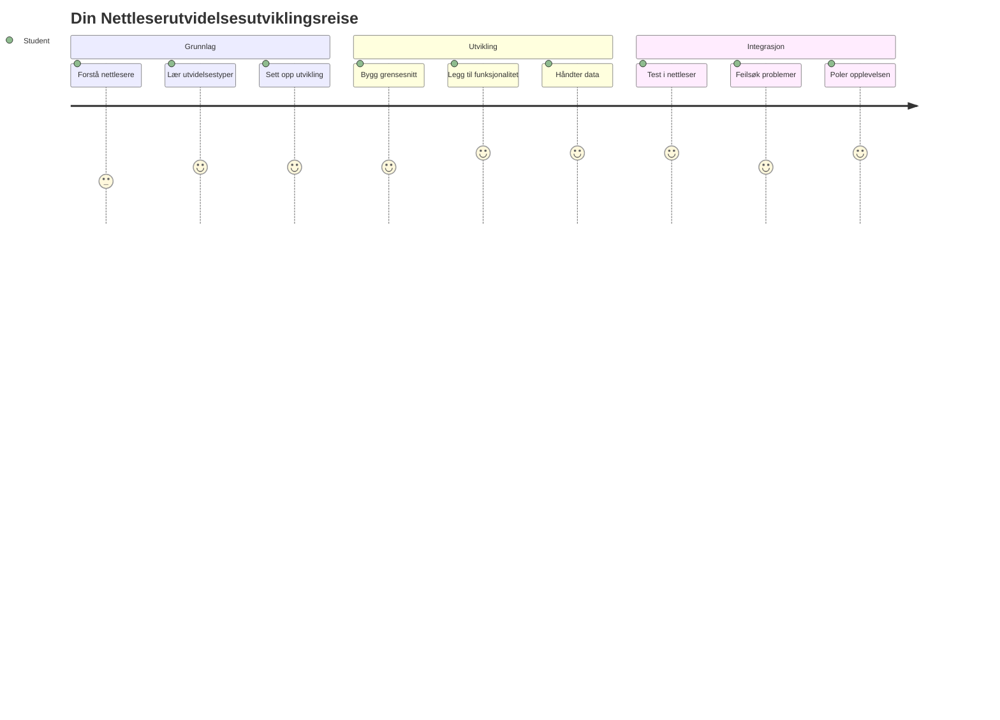
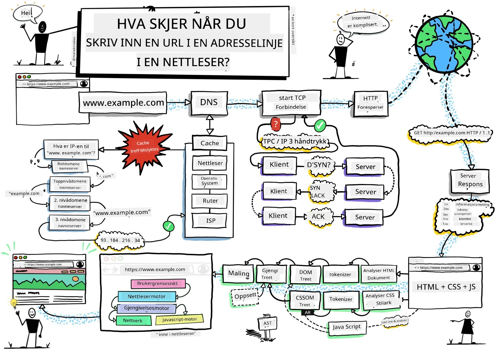
> Sketchnote av [Wassim Chegham](https://dev.to/wassimchegham/ever-wondered-what-happens-when-you-type-in-a-url-in-an-address-bar-in-a-browser-3dob)

## Quiz før forelesning

[Quiz før forelesning](https://ff-quizzes.netlify.app/web/quiz/23)

### Introduksjon

Nettleserutvidelser er mini-applikasjoner som forbedrer din nettleseropplevelse. Som Tim Berners-Lees opprinnelige visjon om et interaktivt nett, utvider utvidelser nettleserens evner utover enkel dokumentvisning. Fra passordbehandlere som sikrer kontoene dine, til fargeplukkere som hjelper designere å få perfekte nyanser, løser utvidelser hverdagslige nettleserutfordringer.

Før vi bygger din første utvidelse, la oss forstå hvordan nettlesere fungerer. På samme måte som Alexander Graham Bell måtte forstå lydoverføring før han oppfant telefonen, vil kunnskap om nettleserens grunnprinsipper hjelpe deg å lage utvidelser som integreres sømløst med eksisterende nettlesersystemer.

Ved slutten av denne leksjonen vil du forstå nettleserarkitektur og ha startet byggingen av din første utvidelse.

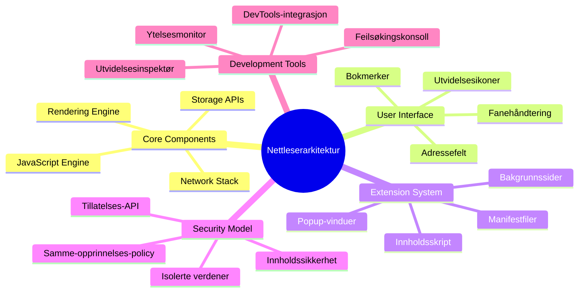
## Forstå Nettlesere

En nettleser er i hovedsak en sofistikert dokumenttolker. Når du skriver "google.com" i adressefeltet, utfører nettleseren en kompleks serie operasjoner - den forespør innhold fra servere verden over, deretter analyserer og viser den koden som interaktive nettsider du ser.

Denne prosessen speiler hvordan den første nettleseren, WorldWideWeb, ble designet av Tim Berners-Lee i 1990 for å gjøre hyperlenkede dokumenter tilgjengelige for alle.

✅ **Litt historie**: Den første nettleseren het 'WorldWideWeb' og ble laget av Sir Timothy Berners-Lee i 1990.

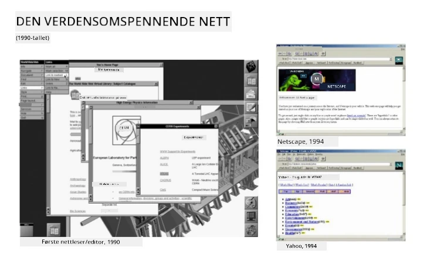
> Noen tidlige nettlesere, via [Karen McGrane](https://www.slideshare.net/KMcGrane/week-4-ixd-history-personal-computing)

### Hvordan Nettlesere Behandler Nettinnhold

Prosessen mellom å skrive inn en URL og å se en nettside inneholder flere koordinerte trinn som skjer i løpet av sekunder:

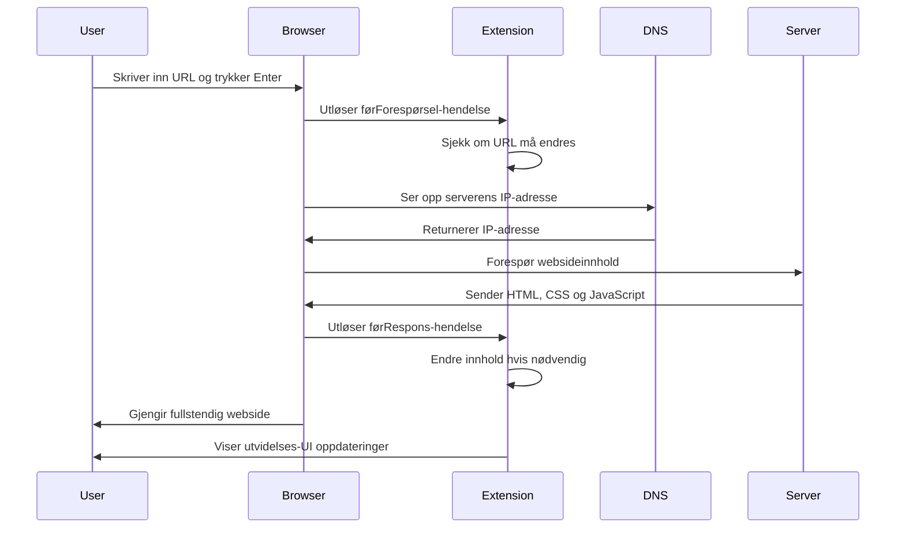
**Dette er hva prosessen oppnår:**
- **Oversetter** den menneskelesbare URL-en til en server-IP-adresse gjennom DNS-oppslag
- **Etablerer** en sikker tilkobling til webserveren ved bruk av HTTP eller HTTPS protokoller
- **Forespør** det spesifikke websideinnholdet fra serveren
- **Mottar** HTML-markup, CSS-stil og JavaScript-kode fra serveren
- **Renderer** alt innhold til den interaktive nettsiden du ser

### Nettleserens Kjernefunksjoner

Moderne nettlesere tilbyr mange funksjoner som utviklere av utvidelser kan bruke:

| Funksjon | Formål | Muligheter for utvidelser |
|---------|---------|------------------------|
| **Rendering Engine** | Viser HTML, CSS og JavaScript | Innholdsmodifisering, stiltilsetting |
| **JavaScript Engine** | Utfører JavaScript-kode | Egne skript, API-interaksjoner |
| **Lokal lagring** | Lagrer data lokalt | Brukerinnstillinger, bufret data |
| **Nettverksstakk** | Håndterer nettverksforespørsler | Overvåkning av forespørsler, dataanalyse |
| **Sikkerhetsmodell** | Beskytter brukere mot skadelig innhold | Innholdsfiltrering, sikkerhetsforbedringer |

**Å forstå disse funksjonene hjelper deg med å:**
- **Identifisere** hvor utvidelsen din kan tilføre mest verdi
- **Velge** riktige nettleser-API-er for utvidelsens funksjonalitet
- **Designe** utvidelser som fungerer effektivt med nettlesersystemer
- **Sikre** at utvidelsen følger nettleserens sikkerhetspraksis

### Vurderinger for Utvikling på Tvers av Nettlesere

Forskjellige nettlesere implementerer standarder med små variasjoner, på samme måte som forskjellige programmeringsspråk kan håndtere samme algoritme ulikt. Chrome, Firefox og Safari har alle unike egenskaper som utviklere må ta hensyn til under utvidelsesutvikling.

> 💡 **Proff tips**: Bruk [caniuse.com](https://www.caniuse.com) for å sjekke hvilke webteknologier som støttes i ulike nettlesere. Dette er uvurderlig når du planlegger funksjonene til utvidelsen din!

**Viktige hensyn ved utvidelsesutvikling:**
- **Test** utvidelsen din i Chrome, Firefox og Edge
- **Tilpass** deg ulike nettleserutvidelses-API-er og manifestformater
- **Håndter** ulike ytelseselementer og begrensninger
- **Gi** alternative løsninger for nettleserspesifikke funksjoner som kanskje ikke er tilgjengelige

✅ **Analyseinnsikt**: Du kan finne ut hvilke nettlesere brukerne dine foretrekker ved å installere analysepakker i webutviklingsprosjektene dine. Denne informasjonen hjelper deg å prioritere hvilke nettlesere du bør støtte først.

## Forstå Nettleserutvidelser

Nettleserutvidelser løser vanlige utfordringer ved nettlesing ved å legge til funksjonalitet direkte i nettlesergrensesnittet. I stedet for å kreve separate applikasjoner eller komplekse arbeidsflyter, gir utvidelser umiddelbar tilgang til verktøy og funksjoner.

Dette konseptet speiler hvordan pionerer som Douglas Engelbart så for seg å forsterke menneskelige evner med teknologi - utvidelser forsterker nettleserens grunnleggende funksjonalitet.

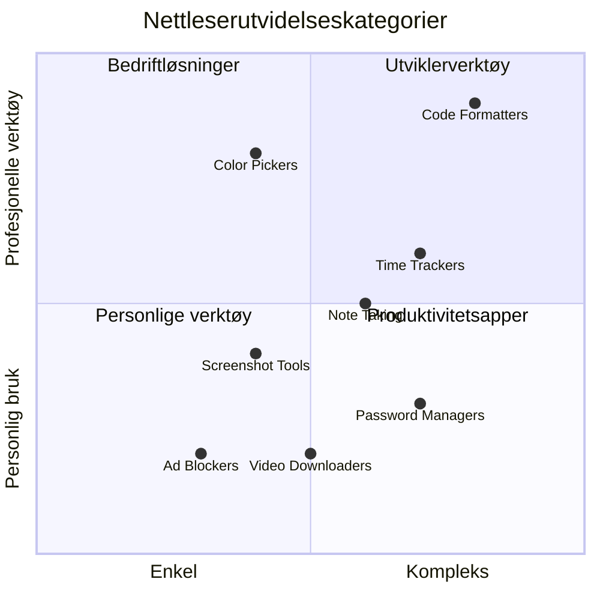
**Populære utvidelseskategorier og deres fordeler:**
- **Produktivitetsverktøy**: Oppgavebehandlere, notat-apper og tidsregistreringsverktøy som hjelper deg å holde orden
- **Sikkerhetsforbedringer**: Passordbehandlere, annonseblokkere og personvernverktøy som beskytter dine data
- **Utviklerverktøy**: Kodeformaterere, fargeplukkere og feilsøkingsverktøy som effektiviserer utviklingen
- **Innholdsforbedring**: Lesemodi, videonedlastere og skjermbildeverktøy som forbedrer nettleseropplevelsen

✅ **Refleksjonsspørsmål**: Hva er dine favorittutvidelser? Hvilke spesifikke oppgaver utfører de, og hvordan forbedrer de nettleseropplevelsen din?

### 🔄 **Pedagogisk sjekk**
**Forståelse av nettleserarkitektur**: Før du går videre til utvidelsesutvikling, sørg for at du kan:
- ✅ Forklare hvordan nettlesere behandler nettforespørsler og viser innhold
- ✅ Identifisere hovedkomponentene i nettleserarkitekturen
- ✅ Forstå hvordan utvidelser integreres med nettleserfunksjonalitet
- ✅ Gjenkjenne sikkerhetsmodellen som beskytter brukere

**Rask selvtest**: Kan du følge veien fra å skrive inn en URL til å se en nettside?
1. **DNS-oppslag** konverterer URL til IP-adresse
2. **HTTP-forespørsel** henter innhold fra serveren
3. **Parsing** bearbeider HTML, CSS og JavaScript
4. **Rendering** viser den endelige nettsiden
5. **Utvidelser** kan modifisere innhold på flere trinn

## Installere og Administrere Utvidelser

Å forstå installasjonsprosessen for utvidelser hjelper deg å forutse brukeropplevelsen når folk installerer din utvidelse. Installasjonsprosessen er standardisert på tvers av moderne nettlesere, med små variasjoner i brukergrensesnitt.

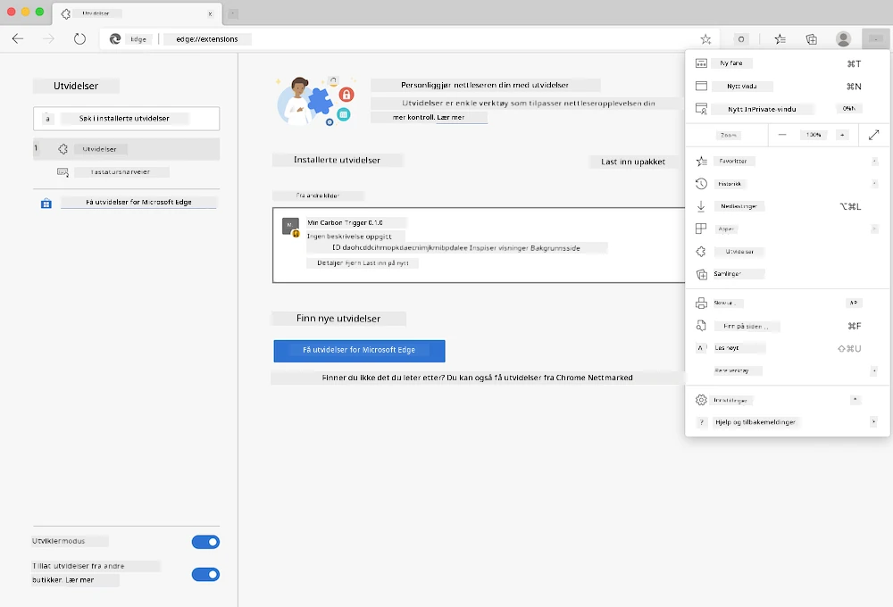

> **Viktig**: Husk å skru på utviklermodus og tillate utvidelser fra andre butikker når du tester dine egne utvidelser.

### Utviklingsinstallasjon av Utvidelser

Når du utvikler og tester egne utvidelser, følg denne arbeidsflyten:

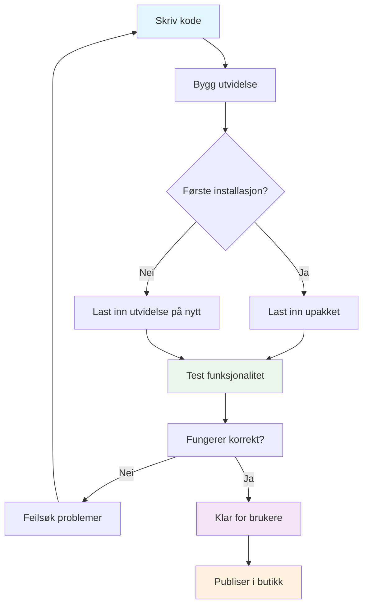
```bash
# Trinn 1: Bygg utvidelsen din
npm run build
```

**Dette kommandoen gjør:**
- **Kompilerer** koden din til nettleserklare filer
- **Pakker** JavaScript-moduler til optimaliserte pakker
- **Genererer** de endelige utvidelsesfilene i `/dist`-mappen
- **Forbereder** utvidelsen for installasjon og testing

**Steg 2: Naviger til Nettleserutvidelser**
1. **Åpne** nettleserens administrasjonsside for utvidelser
2. **Klikk** på "Innstillinger og mer"-knappen (`...`) øverst til høyre
3. **Velg** "Utvidelser" fra rullegardinmenyen

**Steg 3: Last inn Utvidelsen din**
- **For nye installasjoner**: Velg `load unpacked` og pek på `/dist`-mappen din
- **For oppdateringer**: Klikk `reload` ved siden av allerede installert utvidelse
- **For testing**: Aktiver "Utviklermodus" for tilgang til flere feilsøkingsfunksjoner

### Produksjonsinstallasjon av Utvidelser

> ✅ **Merk**: Disse utviklingsinstruksjonene gjelder spesielt for utvidelser du bygger selv. For å installere publiserte utvidelser, gå til de offisielle nettleserutvidelsesbutikkene som [Microsoft Edge Add-ons store](https://microsoftedge.microsoft.com/addons/Microsoft-Edge-Extensions-Home).

**Forskjellen forklart:**
- **Utviklingsinstallasjon** lar deg teste upubliserte utvidelser under utvikling
- **Butikkinstallasjoner** gir godkjente, publiserte utvidelser med automatiske oppdateringer
- **Sideloading** tillater installasjon av utvidelser utenfor offisielle butikker (krever utviklermodus)

## Bygge Din Karbonavtrykk-utvidelse

Vi skal lage en nettleserutvidelse som viser karbonavtrykket til energibruken i ditt område. Dette prosjektet demonstrerer grunnleggende konsepter i utvidelsesutvikling samtidig som det lager et praktisk verktøy for miljøbevissthet.

Denne tilnærmingen følger prinsippet om "læring ved å gjøre" som har vist seg effektivt siden John Deweys pedagogiske teorier - å kombinere tekniske ferdigheter med meningsfulle virkelige anvendelser.

### Prosjektkrav

Før vi begynner utviklingen, la oss samle nødvendige ressurser og avhengigheter:

**Påkrevd API-tilgang:**
- **[CO2 Signal API-nøkkel](https://www.co2signal.com/)**: Skriv inn e-postadressen din for å få en gratis API-nøkkel
- **[Regionkode](http://api.electricitymap.org/v3/zones)**: Finn regionkoden din med [Electricity Map](https://www.electricitymap.org/map) (for eksempel bruker Boston 'US-NEISO')

**Utviklingsverktøy:**
- **[Node.js og NPM](https://www.npmjs.com)**: Pakkehåndteringsverktøy for installasjon av prosjektavhengigheter
- **[Startkode](../../../../5-browser-extension/start)**: Last ned `start`-mappen for å begynne utviklingen

✅ **Lær mer**: Forbedre dine ferdigheter i pakkehåndtering med dette [omfattende Learn-modulet](https://docs.microsoft.com/learn/modules/create-nodejs-project-dependencies/?WT.mc_id=academic-77807-sagibbon)

### Forstå Prosjektstrukturen

Å forstå prosjektstrukturen hjelper deg å organisere utviklingsarbeidet effektivt. På samme måte som biblioteket i Alexandria var organisert for lett kunnskapsinnhenting, gjør en godt strukturert kodebase utviklingen smidigere:

```
project-root/
├── dist/                    # Built extension files
│   ├── manifest.json        # Extension configuration
│   ├── index.html           # User interface markup
│   ├── background.js        # Background script functionality
│   └── main.js              # Compiled JavaScript bundle
├── src/                     # Source development files
│   └── index.js             # Your main JavaScript code
├── package.json             # Project dependencies and scripts
└── webpack.config.js        # Build configuration
```

**Hva hver fil gjør:**
- **`manifest.json`**: **Definerer** utvidelsesmetadata, tillatelser og inngangspunkter
- **`index.html`**: **Lager** brukergrensesnittet som vises når brukere klikker på utvidelsen din
- **`background.js`**: **Håndterer** bakgrunnsoppgaver og nettleserhendelseslyttere
- **`main.js`**: **Inneholder** den endelige pakkede JavaScript-koden etter byggeprosessen
- **`src/index.js`**: **Huser** hovedutviklingskoden som kompileres til `main.js`

> 💡 **Organiseringstips**: Lagre API-nøkkelen og regionkoden i en sikker notat for enkel referanse under utviklingen. Du vil trenge disse verdiene for å teste utvidelsens funksjonalitet.

✅ **Sikkerhetsmerknad**: Aldri legg inn API-nøkler eller sensitive legitimasjoner i kodearkivet ditt. Vi viser deg hvordan du håndterer dette sikkert i neste steg.

## Lage Utvidelsens Grensesnitt

Nå skal vi bygge brukergrensesnittkomponentene. Utvidelsen bruker en to-skjerms tilnærming: en konfigurasjonsskjerm for oppsett og en resultatskjerm for datavisning.

Dette følger prinsippet om gradvis avsløring som har vært brukt i grensesnittdesign siden tidlige datadager - å vise informasjon og valgmuligheter i en logisk rekkefølge for å unngå å overvelde brukere.

### Oversikt over Utvidelsens Visninger

**Oppsettvisning** - Konfigurering for første gangs bruk:
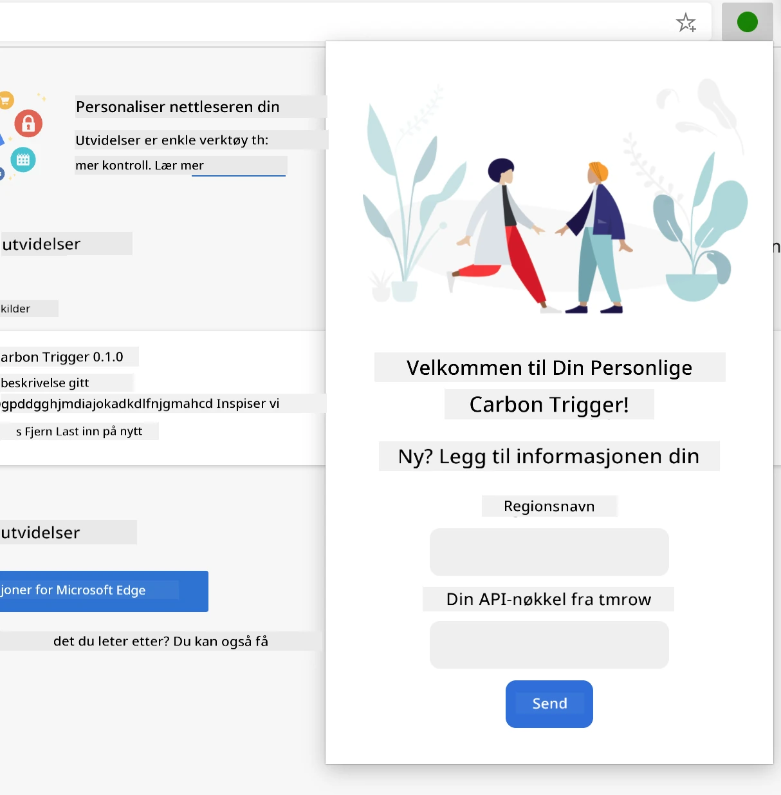

**Resultatvisning** - Visning av karbonavtrykkdata:
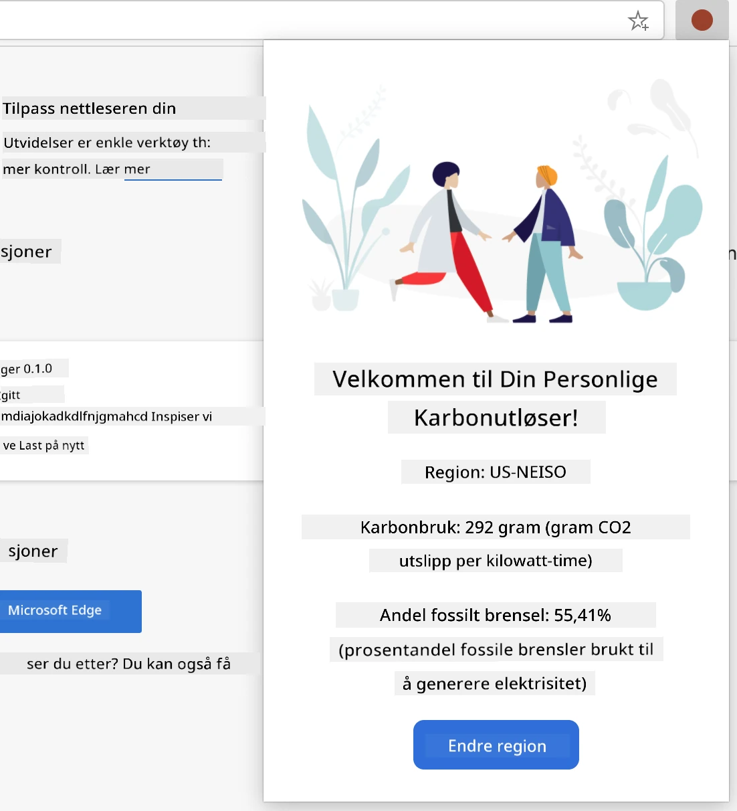

### Lage Konfigurasjonsskjemaet

Oppsettskjemaet samler konfigurasjonsdata fra brukeren ved første gangs bruk. Når det er satt opp, lagres denne informasjonen i nettleserlagring for fremtidige økter.

I filen `/dist/index.html`, legg til denne skjema-strukturen:

```html
<form class="form-data" autocomplete="on">
    <div>
        <h2>New? Add your Information</h2>
    </div>
    <div>
        <label for="region">Region Name</label>
        <input type="text" id="region" required class="region-name" />
    </div>
    <div>
        <label for="api">Your API Key from tmrow</label>
        <input type="text" id="api" required class="api-key" />
    </div>
    <button class="search-btn">Submit</button>
</form>
```

**Dette skjemaet gjør:**
- **Oppretter** en semantisk skjemastruktur med korrekte etiketter og inputassosiasjoner
- **Aktiverer** autofullføringsfunksjonalitet for bedre brukeropplevelse
- **Krever** at begge feltene fylles ut før innsendelse ved bruk av `required`-attributtet
- **Organiserer** inputfeltene med beskrivende klassenavn for enkel styling og JavaScript-målretting
- **Gir** klare instruksjoner til brukere som setter opp utvidelsen for første gang

### Lage Resultatvisningen

Deretter lager du resultatområdet som skal vise karbonavtrykkdata. Legg til denne HTML-en under skjemaet:

```html
<div class="result">
    <div class="loading">loading...</div>
    <div class="errors"></div>
    <div class="data"></div>
    <div class="result-container">
        <p><strong>Region: </strong><span class="my-region"></span></p>
        <p><strong>Carbon Usage: </strong><span class="carbon-usage"></span></p>
        <p><strong>Fossil Fuel Percentage: </strong><span class="fossil-fuel"></span></p>
    </div>
    <button class="clear-btn">Change region</button>
</div>
```

**Hva denne strukturen tilbyr:**
- **`loading`**: **Viser** en lastemelding mens API-data hentes
- **`errors`**: **Viser** feilmeldinger om API-kall feiler eller data er ugyldige
- **`data`**: **Holder** rådata for feilsøking under utvikling
- **`result-container`**: **Presenterer** formatert informasjon om karbonavtrykk til brukere
- **`clear-btn`**: **Lar** brukere endre region og konfigurere utvidelsen på nytt

### Sette opp Byggeprosessen

Nå skal vi installere prosjektavhengigheter og teste byggeprosessen:

```bash
npm install
```

**Dette installasjonssteget gjør:**
- **Laster ned** Webpack og andre utviklingsavhengigheter spesifisert i `package.json`
- **Konfigurerer** byggeverktøyet for å kompilere moderne JavaScript
- **Forbereder** utviklingsmiljø for bygging og testing av utvidelsen
- **Muliggjør** kodepakking, optimalisering og tverr-nettleserkompatibilitet

> 💡 **Innblikk i byggeprosessen**: Webpack pakker koden din fra `/src/index.js` til `/dist/main.js`. Denne prosessen optimaliserer koden for produksjon og sikrer nettleserkompatibilitet.

### Test din framgang

På dette punktet kan du teste utvidelsen din:
1. **Kjør** byggekommandoen for å kompilere koden din  
2. **Last** utvidelsen inn i nettleseren din ved å bruke utviklermodus  
3. **Bekreft** at skjemaet vises korrekt og ser profesjonelt ut  
4. **Sjekk** at alle skjemaelementene er riktig justert og fungerer  

**Hva du har oppnådd:**  
- **Bygget** grunnleggende HTML-struktur for utvidelsen din  
- **Opprettet** både konfigurasjons- og resultatgrensesnitt med riktig semantisk oppmerking  
- **Satt opp** en moderne utviklingsflyt med industristandard verktøy  
- **Forberedt** grunnlaget for å legge til interaktiv JavaScript-funksjonalitet  

### 🔄 **Pedagogisk Sjekk-inn**  
**Fremdrift i Utvidelsesutvikling**: Bekreft din forståelse før du fortsetter:  
- ✅ Kan du forklare formålet med hver fil i prosjektstrukturen?  
- ✅ Forstår du hvordan byggeprosessen transformerer kildekoden din?  
- ✅ Hvorfor skiller vi konfigurasjon og resultater i ulike UI-seksjoner?  
- ✅ Hvordan støtter skjemaets struktur både brukervennlighet og tilgjengelighet?  

**Forståelse av Utviklingsflyt**: Du bør nå kunne:  
1. **Modifisere** HTML og CSS for utvidelsens grensesnitt  
2. **Kjøre** byggekommandoen for å kompilere endringene dine  
3. **Laste inn** utvidelsen på nytt i nettleseren for å teste oppdateringer  
4. **Feilsøke** problemer ved hjelp av nettleserens utviklerverktøy  

Du har fullført den første fasen av utvikling av nettleserutvidelser. Akkurat som Wright-brødrene først måtte forstå aerodynamikk før de kunne fly, forbereder forståelsen av disse grunnleggende konseptene deg på å bygge mer komplekse interaktive funksjoner i neste leksjon.  

## GitHub Copilot Agent Challenge 🚀  

Bruk Agent-modus for å fullføre følgende utfordring:  

**Beskrivelse:** Forbedre nettleserutvidelsen ved å legge til validering av skjema og brukerfeedback for å forbedre brukeropplevelsen ved innlegging av API-nøkler og regionskoder.  

**Oppgave:** Lag JavaScript-valideringsfunksjoner som sjekker om API-nøkkelfeltet inneholder minst 20 tegn, og om regionskoden følger korrekt format (som 'US-NEISO'). Legg til visuell tilbakemelding ved å endre kantfargene på inputfeltet til grønt for gyldige data og rødt for ugyldige. Legg også til en bryter for å vise/skjule API-nøkkelen for sikkerhet.  

Lær mer om [agent mode](https://code.visualstudio.com/blogs/2025/02/24/introducing-copilot-agent-mode) her.  

## 🚀 Utfordring  

Ta en titt på en nettleserutvidelsesbutikk og installer en utvidelse i nettleseren din. Du kan undersøke filene på interessante måter. Hva oppdager du?  

## Quiz etter forelesning  

[Post-lecture quiz](https://ff-quizzes.netlify.app/web/quiz/24)  

## Gjennomgang & Selvstudium  

I denne leksjonen lærte du litt om historien til nettleseren; benytt denne muligheten til å lære hvordan oppfinnerne av World Wide Web forestilte seg bruken ved å lese mer om historien. Noen nyttige sider inkluderer:  

[The History of Web Browsers](https://www.mozilla.org/firefox/browsers/browser-history/)  

[History of the Web](https://webfoundation.org/about/vision/history-of-the-web/)  

[Et intervju med Tim Berners-Lee](https://www.theguardian.com/technology/2019/mar/12/tim-berners-lee-on-30-years-of-the-web-if-we-dream-a-little-we-can-get-the-web-we-want)  

### ⚡ **Hva du kan gjøre i løpet av de neste 5 minuttene**  
- [ ] Åpne Chrome/Edge-utvidelsessiden (chrome://extensions) og utforsk hva du har installert  
- [ ] Se på nettverksfanen i nettleserens DevTools mens du laster en nettside  
- [ ] Prøv å se på sidekilden (Ctrl+U) for å se HTML-strukturen  
- [ ] Inspiser elementer på en nettside og modifiser CSS i DevTools  

### 🎯 **Hva du kan oppnå i timen som kommer**  
- [ ] Fullføre quiz etter leksjonen og forstå nettleserens grunnprinsipper  
- [ ] Lage en grunnleggende manifest.json-fil for en nettleserutvidelse  
- [ ] Bygge en enkel "Hello World"-utvidelse som viser en popup  
- [ ] Teste lasting av utvidelsen din i utviklermodus  
- [ ] Utforske dokumentasjon for nettleserutvidelser for din mål-nettleser  

### 📅 **Din ukelange utvidelsesreise**  
- [ ] Fullføre en funksjonell nettleserutvidelse med reell nytteverdi  
- [ ] Lære om innholdsskript, bakgrunnsskript og popup-interaksjoner  
- [ ] Mestre nettleser-APIer som lagring, faner og meldinger  
- [ ] Designe brukervennlige grensesnitt for utvidelsen din  
- [ ] Teste utvidelsen på ulike nettsider og scenarier  
- [ ] Publisere utvidelsen i nettleserens utvidelsesbutikk  

### 🌟 **Din månedslange nettleserutvikling**  
- [ ] Lage flere utvidelser som løser ulike brukerbehov  
- [ ] Lære avanserte nettleser-APIer og sikker bestepraksis  
- [ ] Bidra til åpne kildekodeprosjekter for nettleserutvidelser  
- [ ] Mestre tverr-nettleserkompatibilitet og progressiv forbedring  
- [ ] Lage utviklingsverktøy og maler for andre utvidelsesutviklere  
- [ ] Bli en ekspert på nettleserutvidelser som hjelper andre utviklere  

## 🎯 Din tidslinje for ekspertise i nettleserutvidelser  

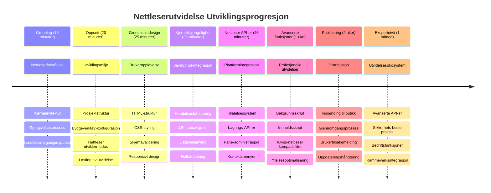
### 🛠️ Oppsummering av ditt verktøysett for utvidelsesutvikling  

Etter å ha fullført denne leksjonen har du nå:  
- **Kunnskap om nettleserarkitektur**: Forståelse av rendringsmotorer, sikkerhetsmodeller og integrasjon av utvidelser  
- **Utviklingsmiljø**: Moderne verktøykjede med Webpack, NPM og feilsøkingsmuligheter  
- **UI/UX-grunnlag**: Semantisk HTML-struktur med progresiv avdekkingsmønstre  
- **Sikkerhetsbevissthet**: Forståelse av nettlesertillatelser og sikre utviklingsrutiner  
- **Konsepter for tverr-nettleserbruk**: Kjennskap til kompatibilitetsvurderinger og testmetoder  
- **API-integrasjon**: Grunnlag for å jobbe med eksterne datakilder  
- **Profesjonell arbeidsflyt**: Industri-standard utviklings- og testprosedyrer  

**Reelle anvendelser:** Disse ferdighetene gjelder direkte for:  
- **Webutvikling**: Enkelsidige applikasjoner og progressive webapper  
- **Skrivebordsapplikasjoner**: Electron og webbasert skrivebordsprogramvare  
- **Mobilutvikling**: Hybride apper og webbaserte mobilløsninger  
- **Enterprise-verktøy**: Interne produktivitetsløsninger og arbeidsflytautomatisering  
- **Åpen kildekode**: Bidra til prosjekter for nettleserutvidelser og webstandarder  

**Neste nivå:** Du er klar til å legge til interaktiv funksjonalitet, jobbe med nettleser-APIer og lage utvidelser som løser ekte brukerutfordringer!  

## Oppgave  

[Restyle your extension](assignment.md)

---

<!-- CO-OP TRANSLATOR DISCLAIMER START -->
**Ansvarsfraskrivelse**:
Dette dokumentet er oversatt ved hjelp av AI-oversettelsestjenesten [Co-op Translator](https://github.com/Azure/co-op-translator). Selv om vi streber etter nøyaktighet, vennligst bemerk at automatiske oversettelser kan inneholde feil eller unøyaktigheter. Det originale dokumentet på originalspråket skal anses som den autoritative kilden. For kritisk informasjon anbefales profesjonell menneskelig oversettelse. Vi er ikke ansvarlige for eventuelle misforståelser eller feiltolkninger som oppstår ved bruk av denne oversettelsen.
<!-- CO-OP TRANSLATOR DISCLAIMER END -->