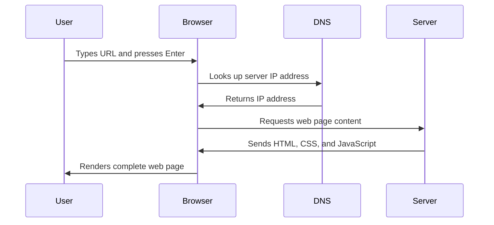
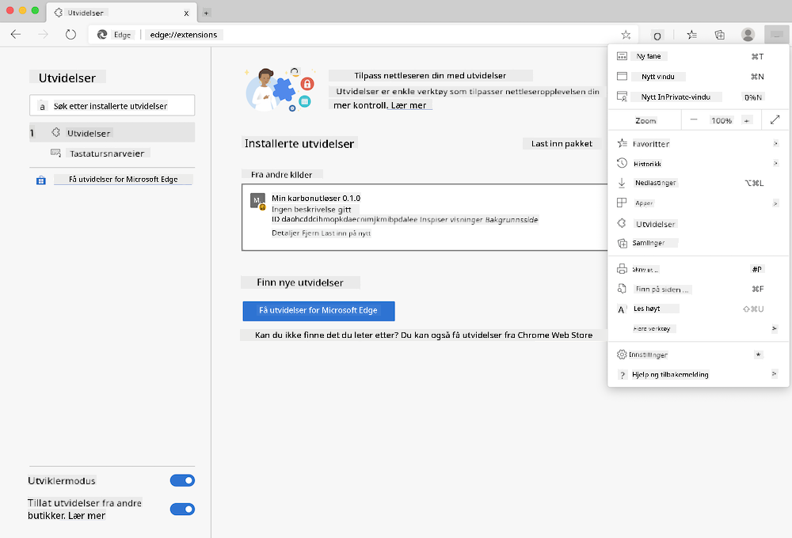
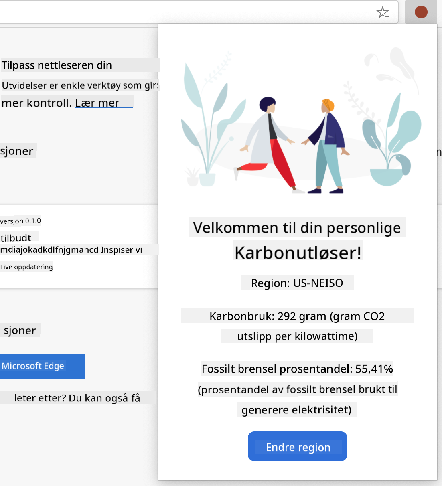

<!--
CO_OP_TRANSLATOR_METADATA:
{
  "original_hash": "33a875c522f237a2026e4653240dfc07",
  "translation_date": "2025-10-23T22:39:59+00:00",
  "source_file": "5-browser-extension/1-about-browsers/README.md",
  "language_code": "no"
}
-->
# Nettleserutvidelsesprosjekt Del 1: Alt om nettlesere


> Sketchnote av [Wassim Chegham](https://dev.to/wassimchegham/ever-wondered-what-happens-when-you-type-in-a-url-in-an-address-bar-in-a-browser-3dob)

## Quiz før forelesning

[Quiz før forelesning](https://ff-quizzes.netlify.app/web/quiz/23)

### Introduksjon

Nettleserutvidelser er små applikasjoner som forbedrer din opplevelse av å surfe på nettet. Akkurat som Tim Berners-Lees opprinnelige visjon om et interaktivt nett, utvider utvidelser nettleserens funksjonalitet utover enkel dokumentvisning. Fra passordhåndteringsverktøy som holder kontoene dine sikre til fargevelgere som hjelper designere med å finne perfekte nyanser, løser utvidelser daglige utfordringer ved nettlesing.

Før vi bygger din første utvidelse, la oss forstå hvordan nettlesere fungerer. Akkurat som Alexander Graham Bell måtte forstå lydoverføring før han oppfant telefonen, vil kunnskap om nettleserens grunnleggende funksjoner hjelpe deg med å lage utvidelser som integreres sømløst med eksisterende nettlesersystemer.

Ved slutten av denne leksjonen vil du forstå nettleserarkitektur og ha startet byggingen av din første utvidelse.

## Forstå nettlesere

En nettleser er i hovedsak en sofistikert dokumenttolker. Når du skriver "google.com" inn i adressefeltet, utfører nettleseren en kompleks serie operasjoner - den ber om innhold fra servere over hele verden, og deretter tolker og gjengir den koden til de interaktive nettsidene du ser.

Denne prosessen speiler hvordan den første nettleseren, WorldWideWeb, ble designet av Tim Berners-Lee i 1990 for å gjøre hyperlenkede dokumenter tilgjengelige for alle.

✅ **Litt historie**: Den første nettleseren het 'WorldWideWeb' og ble laget av Sir Timothy Berners-Lee i 1990.


> Noen tidlige nettlesere, via [Karen McGrane](https://www.slideshare.net/KMcGrane/week-4-ixd-history-personal-computing)

### Hvordan nettlesere behandler nettinnhold

Prosessen mellom å skrive inn en URL og se en nettside involverer flere koordinerte trinn som skjer i løpet av sekunder:



**Dette oppnår prosessen:**
- **Oversetter** den menneskeleselige URL-en til en server-IP-adresse gjennom DNS-oppslag
- **Etablerer** en sikker forbindelse med webserveren ved hjelp av HTTP- eller HTTPS-protokoller
- **Ber om** spesifikt nettinnhold fra serveren
- **Mottar** HTML-markup, CSS-styling og JavaScript-kode fra serveren
- **Gjengir** alt innhold til den interaktive nettsiden du ser

### Nettleserens kjernefunksjoner

Moderne nettlesere tilbyr en rekke funksjoner som utviklere av utvidelser kan dra nytte av:

| Funksjon | Formål | Muligheter for utvidelser |
|----------|--------|---------------------------|
| **Gjengivelsesmotor** | Viser HTML, CSS og JavaScript | Innholdsmodifikasjon, stylinginjeksjon |
| **JavaScript-motor** | Utfører JavaScript-kode | Egendefinerte skript, API-interaksjoner |
| **Lokal lagring** | Lagrer data lokalt | Brukerpreferanser, hurtiglagret data |
| **Nettverksstabel** | Håndterer webforespørsler | Forespørselsmonitorering, dataanalyse |
| **Sikkerhetsmodell** | Beskytter brukere mot skadelig innhold | Innholdsfiltrering, sikkerhetsforbedringer |

**Å forstå disse funksjonene hjelper deg med:**
- **Identifisere** hvor din utvidelse kan tilføre mest verdi
- **Velge** de riktige nettleser-API-ene for utvidelsens funksjonalitet
- **Designe** utvidelser som fungerer effektivt med nettlesersystemer
- **Sikre** at utvidelsen din følger beste praksis for nettlesersikkerhet

### Tverrnettleserutvikling

Ulike nettlesere implementerer standarder med små variasjoner, på samme måte som ulike programmeringsspråk kan håndtere den samme algoritmen forskjellig. Chrome, Firefox og Safari har hver sine unike egenskaper som utviklere må ta hensyn til under utvikling av utvidelser.

> 💡 **Tips**: Bruk [caniuse.com](https://www.caniuse.com) for å sjekke hvilke webteknologier som støttes på tvers av ulike nettlesere. Dette er uvurderlig når du planlegger funksjonene til utvidelsen din!

**Viktige hensyn for utvikling av utvidelser:**
- **Test** utvidelsen din på tvers av Chrome, Firefox og Edge-nettlesere
- **Tilpass** deg ulike nettleserutvidelses-API-er og manifestformater
- **Håndter** varierende ytelsesegenskaper og begrensninger
- **Tilby** alternativer for nettleserspesifikke funksjoner som kanskje ikke er tilgjengelige

✅ **Innsikt fra analyse**: Du kan finne ut hvilke nettlesere brukerne dine foretrekker ved å installere analysepakker i dine webutviklingsprosjekter. Disse dataene hjelper deg med å prioritere hvilke nettlesere du skal støtte først.

## Forstå nettleserutvidelser

Nettleserutvidelser løser vanlige utfordringer ved nettlesing ved å legge til funksjonalitet direkte i nettleserens grensesnitt. I stedet for å kreve separate applikasjoner eller komplekse arbeidsflyter, gir utvidelser umiddelbar tilgang til verktøy og funksjoner.

Dette konseptet speiler hvordan tidlige datapionerer som Douglas Engelbart forestilte seg å utvide menneskelige evner med teknologi - utvidelser utvider nettleserens grunnleggende funksjonalitet.

**Populære utvidelseskategorier og deres fordeler:**
- **Produktivitetsverktøy**: Oppgavehåndteringsverktøy, notatapper og tidssporere som hjelper deg med å holde deg organisert
- **Sikkerhetsforbedringer**: Passordhåndteringsverktøy, annonseblokkerere og personvernsverktøy som beskytter dataene dine
- **Utviklerverktøy**: Kodeformaterere, fargevelgere og feilsøkingsverktøy som effektiviserer utviklingen
- **Innholdsforbedring**: Lesemodus, videonedlastere og skjermbildeverktøy som forbedrer din nettopplevelse

✅ **Refleksjonsspørsmål**: Hva er dine favorittnettleserutvidelser? Hvilke spesifikke oppgaver utfører de, og hvordan forbedrer de din opplevelse av å surfe på nettet?

## Installere og administrere utvidelser

Å forstå prosessen med å installere utvidelser hjelper deg med å forutse brukeropplevelsen når folk installerer din utvidelse. Installasjonsprosessen er standardisert på tvers av moderne nettlesere, med små variasjoner i grensesnittdesign.



> **Viktig**: Sørg for å slå på utviklermodus og tillate utvidelser fra andre butikker når du tester dine egne utvidelser.

### Utviklingsutvidelsesinstallasjon

Når du utvikler og tester dine egne utvidelser, følg denne arbeidsflyten:

```bash
# Step 1: Build your extension
npm run build
```

**Hva denne kommandoen oppnår:**
- **Kompilerer** kildekoden din til filer som er klare for nettleseren
- **Pakker** JavaScript-moduler i optimaliserte pakker
- **Genererer** de endelige utvidelsesfilene i `/dist`-mappen
- **Forbereder** utvidelsen din for installasjon og testing

**Steg 2: Naviger til nettleserutvidelser**
1. **Åpne** nettleserens administrasjonsside for utvidelser
2. **Klikk** på "Innstillinger og mer"-knappen (ikonet `...`) øverst til høyre
3. **Velg** "Utvidelser" fra rullegardinmenyen

**Steg 3: Last inn din utvidelse**
- **For nye installasjoner**: Velg `load unpacked` og velg din `/dist`-mappe
- **For oppdateringer**: Klikk `reload` ved siden av din allerede installerte utvidelse
- **For testing**: Aktiver "Utviklermodus" for å få tilgang til flere feilsøkingsfunksjoner

### Produksjonsutvidelsesinstallasjon

> ✅ **Merk**: Disse utviklingsinstruksjonene er spesifikt for utvidelser du bygger selv. For å installere publiserte utvidelser, besøk de offisielle nettleserutvidelsesbutikkene som [Microsoft Edge Add-ons store](https://microsoftedge.microsoft.com/addons/Microsoft-Edge-Extensions-Home).

**Forstå forskjellen:**
- **Utviklingsinstallasjoner** lar deg teste upubliserte utvidelser under utvikling
- **Butikkinstallasjoner** gir verifiserte, publiserte utvidelser med automatiske oppdateringer
- **Sideloading** tillater installasjon av utvidelser fra utenfor offisielle butikker (krever utviklermodus)

## Bygge din karbonfotavtrykk-utvidelse

Vi skal lage en nettleserutvidelse som viser karbonfotavtrykket til energiforbruket i din region. Dette prosjektet demonstrerer essensielle konsepter for utvikling av utvidelser samtidig som det skaper et praktisk verktøy for miljøbevissthet.

Denne tilnærmingen følger prinsippet om "learning by doing" som har vist seg effektivt siden John Deweys pedagogiske teorier - en kombinasjon av tekniske ferdigheter med meningsfulle virkelige applikasjoner.

### Prosjektkrav

Før du begynner utviklingen, la oss samle de nødvendige ressursene og avhengighetene:

**Nødvendig API-tilgang:**
- **[CO2 Signal API-nøkkel](https://www.co2signal.com/)**: Skriv inn e-postadressen din for å motta din gratis API-nøkkel
- **[Regionkode](http://api.electricitymap.org/v3/zones)**: Finn din regionkode ved hjelp av [Electricity Map](https://www.electricitymap.org/map) (for eksempel bruker Boston 'US-NEISO')

**Utviklingsverktøy:**
- **[Node.js og NPM](https://www.npmjs.com)**: Pakkehåndteringsverktøy for å installere prosjektavhengigheter
- **[Startkode](../../../../5-browser-extension/start)**: Last ned `start`-mappen for å begynne utviklingen

✅ **Lær mer**: Forbedre dine ferdigheter innen pakkehåndtering med dette [omfattende Learn-modulet](https://docs.microsoft.com/learn/modules/create-nodejs-project-dependencies/?WT.mc_id=academic-77807-sagibbon)

### Forstå prosjektstrukturen

Å forstå prosjektstrukturen hjelper deg med å organisere utviklingsarbeidet effektivt. Akkurat som Biblioteket i Alexandria ble organisert for enkel kunnskapshenting, gjør en godt strukturert kodebase utviklingen mer effektiv:

```
project-root/
├── dist/                    # Built extension files
│   ├── manifest.json        # Extension configuration
│   ├── index.html           # User interface markup
│   ├── background.js        # Background script functionality
│   └── main.js              # Compiled JavaScript bundle
└── src/                     # Source development files
    └── index.js             # Your main JavaScript code
```

**Hva hver fil gjør:**
- **`manifest.json`**: **Definerer** metadata, tillatelser og inngangspunkter for utvidelsen
- **`index.html`**: **Oppretter** brukergrensesnittet som vises når brukere klikker på utvidelsen
- **`background.js`**: **Håndterer** bakgrunnsoppgaver og nettleserhendelser
- **`main.js`**: **Inneholder** den endelige bundlingen av JavaScript etter byggeprosessen
- **`src/index.js`**: **Huser** din hovedutviklingskode som blir kompilert til `main.js`

> 💡 **Organiseringstips**: Lagre API-nøkkelen og regionkoden din i et sikkert notat for enkel referanse under utviklingen. Du trenger disse verdiene for å teste utvidelsens funksjonalitet.

✅ **Sikkerhetsmerknad**: Aldri legg inn API-nøkler eller sensitive opplysninger i kodebasen din. Vi viser deg hvordan du håndterer dette sikkert i de neste stegene.

## Lage utvidelsens grensesnitt

Nå skal vi bygge brukergrensesnittkomponentene. Utvidelsen bruker en to-skjerms tilnærming: en konfigurasjonsskjerm for første oppsett og en resultatskjerm for datavisning.

Dette følger prinsippet om progressiv avsløring som brukes i grensesnittdesign siden datamaskinens tidlige dager - å avsløre informasjon og alternativer i en logisk rekkefølge for å unngå å overvelde brukere.

### Oversikt over utvidelsesvisninger

**Oppsettsvisning** - Førstegangsbruker konfigurasjon:


**Resultatvisning** - Visning av karbonfotavtrykkdata:


### Lage konfigurasjonsskjemaet

Oppsettskjemaet samler inn brukerens konfigurasjonsdata ved første bruk. Når det er konfigurert, lagres denne informasjonen i nettleserens lagring for fremtidige økter.

I `/dist/index.html`-filen, legg til denne skjema-strukturen:

```html
<form class="form-data" autocomplete="on">
    <div>
        <h2>New? Add your Information</h2>
    </div>
    <div>
        <label for="region">Region Name</label>
        <input type="text" id="region" required class="region-name" />
    </div>
    <div>
        <label for="api">Your API Key from tmrow</label>
        <input type="text" id="api" required class="api-key" />
    </div>
    <button class="search-btn">Submit</button>
</form>
```

**Hva dette skjemaet gjør:**
- **Oppretter** en semantisk skjema-struktur med riktige etiketter og input-assosiasjoner
- **Aktiverer** nettleserens autofullføringsfunksjonalitet for forbedret brukeropplevelse
- **Krever** at begge feltene fylles ut før innsending ved hjelp av attributtet `required`
- **Organiserer** input med beskrivende klassenavn for enkel styling og JavaScript-målretting
- **Gir** klare instruksjoner til brukere som setter opp utvidelsen for første gang

### Lage resultatvisningen

Deretter lager vi resultatområdet som skal vise karbonfotavtrykkdata. Legg til denne HTML-en under skjemaet:

```html
<div class="result">
    <div class="loading">loading...</div>
    <div class="errors"></div>
    <div class="data"></div>
    <div class="result-container">
        <p><strong>Region: </strong><span class="my-region"></span></p>
        <p><strong>Carbon Usage: </strong><span class="carbon-usage"></span></p>
        <p><strong>Fossil Fuel Percentage: </strong><span class="fossil-fuel"></span></p>
    </div>
    <button class="clear-btn">Change region</button>
</div>
```

**Hva denne strukturen gir:**
- **`loading`**: **Viser** en lastemelding mens API-data hentes
- **`errors`**: **Viser** feilmeldinger hvis API-kall mislykkes eller data er ugyldige
- **`data`**: **Holder** rådata for feilsøking under utvikling
- **`result-container`**: **Presenterer** formatert karbonfotavtrykkinformasjon til brukere
- **`clear-btn`**: **Lar** brukere endre sin region og rekonfigurere utvidelsen

### Sette opp byggeprosessen

La oss nå installere prosjektavhengighetene og teste byggeprosessen:

```bash
npm install
```

**Hva denne installasjonsprosessen oppnår:**
- **Laster ned** Webpack og andre utviklingsavhengigheter spesifisert i `package.json`
- **Konfigurerer** byggeverktøyet for å kompilere moderne JavaScript
- **Forbereder** utviklingsmiljøet for bygging og testing av utvidelsen
- **Aktiverer** kodebundling, optimalisering og tverrnettleserkompatibilitetsfunksjoner

> 💡 **Innsikt om byggeprosessen**: Webpack samler kildekoden din fra `/src/index.js` til `/dist/main.js`. Denne prosessen optimaliserer koden din for produksjon og sikrer nettleserkompatibilitet.

### Teste fremgangen din

På dette tidspunktet kan du teste utvidelsen din:

1. **Kjør** byggekommandoen for å kompilere koden din
2. **Last** utvidelsen inn i nettleseren din ved hjelp av utviklermodus
3. **Bekreft** at skjemaet vises korrekt og ser profesjonelt ut
4. **Sjekk** at alle skjemaelementer er riktig justert og funksjonelle

**Hva du har oppnådd:**
- **Bygget** den grunnleggende HTML-strukturen for utvidelsen din
- **Opprettet** både konfigurasjons- og resultatgrensesnitt med riktig semantisk markup
- **Satt opp** en moderne utviklingsarbeidsflyt med bransjestandardverktøy
- **Forberedt** grunnlaget for å legge til interaktiv JavaScript-funksjonalitet

Du har fullført den første fasen av utviklingen av nettleserutvidelsen. Akkurat som brødrene Wright først måtte forstå aerodynamikk før de oppnådde flyvning, forbereder forståelsen av disse grunnleggende konseptene deg på å bygge mer komplekse interaktive funksjoner i neste leksjon.

## GitHub Copilot Agent Challenge 🚀

Bruk Agent-modus for å fullføre følgende utfordring:
**Beskrivelse:** Forbedre nettleserutvidelsen ved å legge til validering av skjema og funksjoner for tilbakemelding til brukeren, for å forbedre brukeropplevelsen når API-nøkler og regionkoder legges inn.

**Oppgave:** Lag JavaScript-valideringsfunksjoner som sjekker om API-nøkkelfeltet inneholder minst 20 tegn, og om regionkoden følger riktig format (som 'US-NEISO'). Legg til visuell tilbakemelding ved å endre farge på inputfeltets kantlinjer til grønn for gyldige inndata og rød for ugyldige. Legg også til en funksjon for å vise/skjule API-nøkkelen av sikkerhetshensyn.

Lær mer om [agentmodus](https://code.visualstudio.com/blogs/2025/02/24/introducing-copilot-agent-mode) her.

## 🚀 Utfordring

Ta en titt på en nettleserutvidelsesbutikk og installer en utvidelse i nettleseren din. Du kan undersøke filene på interessante måter. Hva oppdager du?

## Quiz etter forelesning

[Quiz etter forelesning](https://ff-quizzes.netlify.app/web/quiz/24)

## Gjennomgang og selvstudium

I denne leksjonen lærte du litt om historien til nettleseren; bruk denne anledningen til å lære mer om hvordan oppfinnerne av World Wide Web forestilte seg bruken av det, ved å lese mer om historien. Noen nyttige nettsteder inkluderer:

[Historien til nettlesere](https://www.mozilla.org/firefox/browsers/browser-history/)

[Historien til nettet](https://webfoundation.org/about/vision/history-of-the-web/)

[Et intervju med Tim Berners-Lee](https://www.theguardian.com/technology/2019/mar/12/tim-berners-lee-on-30-years-of-the-web-if-we-dream-a-little-we-can-get-the-web-we-want)

## Oppgave 

[Restyle utvidelsen din](assignment.md)

---

**Ansvarsfraskrivelse**:  
Dette dokumentet er oversatt ved hjelp av AI-oversettelsestjenesten [Co-op Translator](https://github.com/Azure/co-op-translator). Selv om vi streber etter nøyaktighet, vær oppmerksom på at automatiske oversettelser kan inneholde feil eller unøyaktigheter. Det originale dokumentet på dets opprinnelige språk bør anses som den autoritative kilden. For kritisk informasjon anbefales profesjonell menneskelig oversettelse. Vi er ikke ansvarlige for misforståelser eller feiltolkninger som oppstår ved bruk av denne oversettelsen.