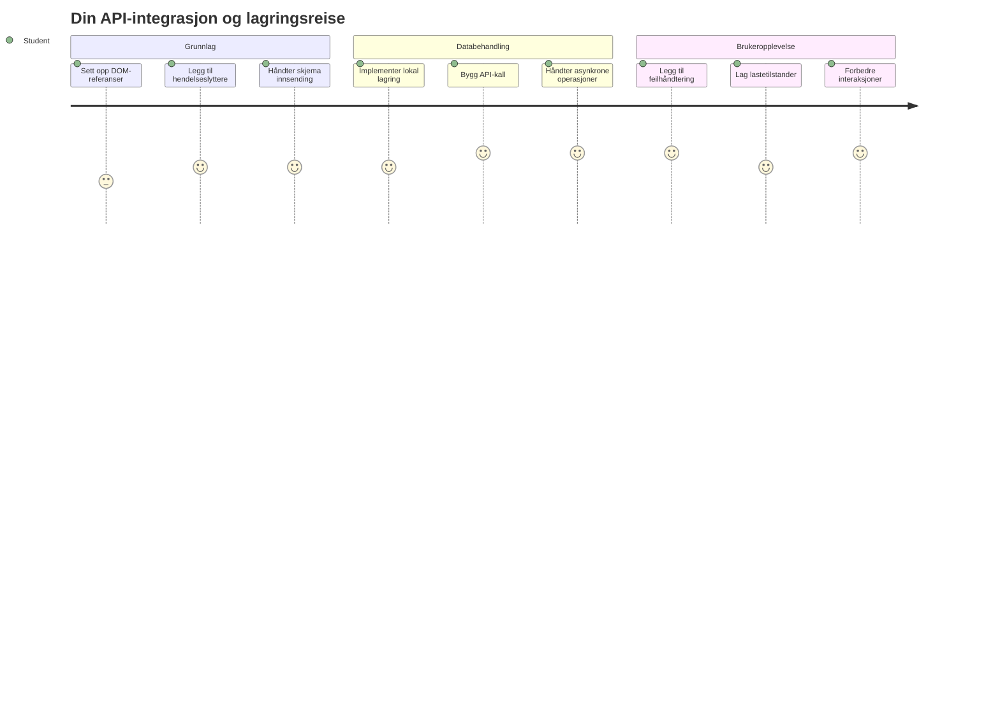
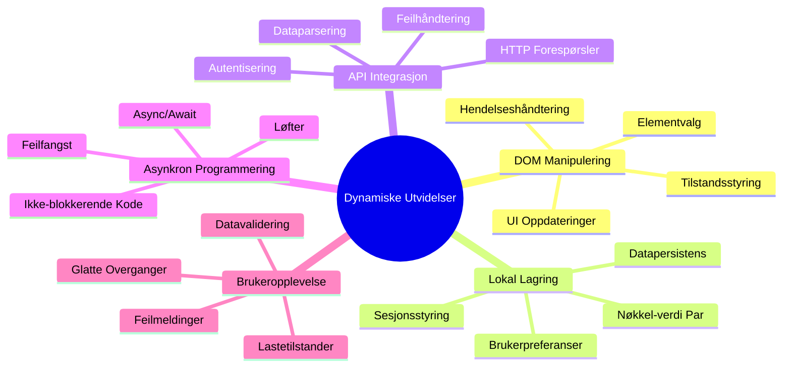
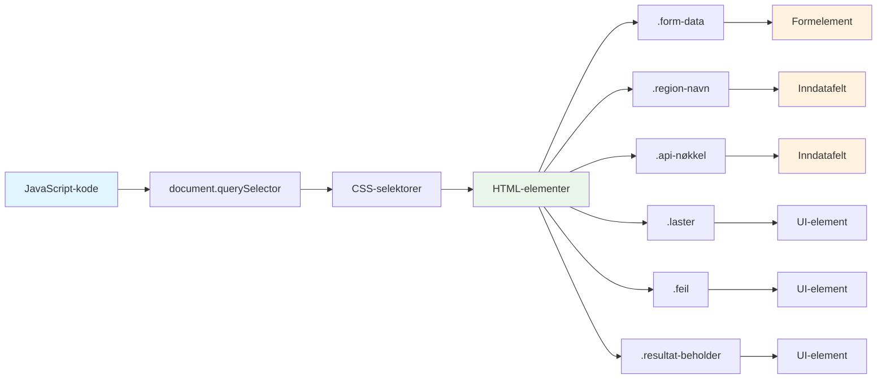
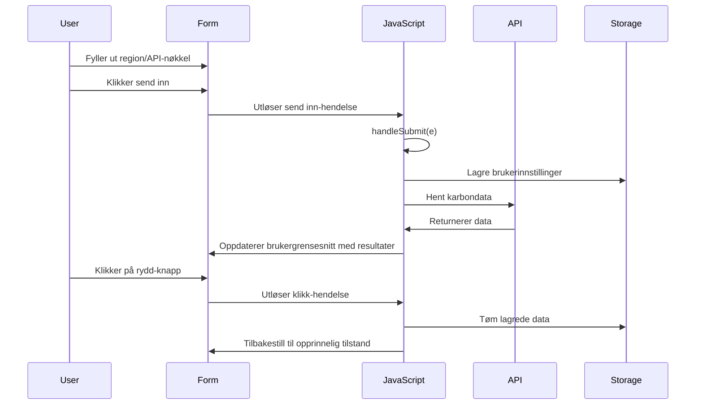
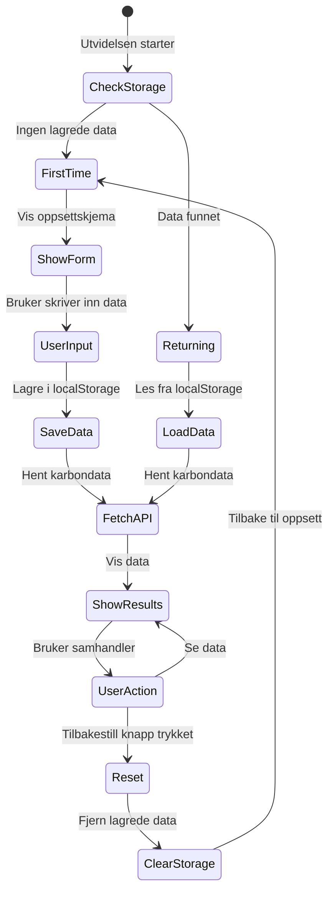
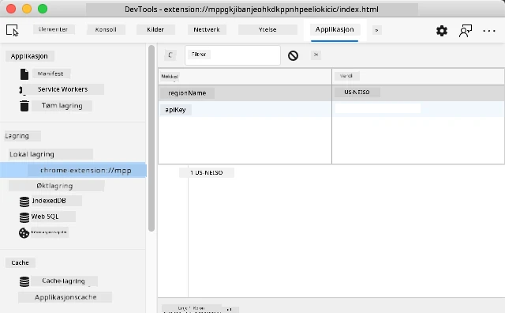
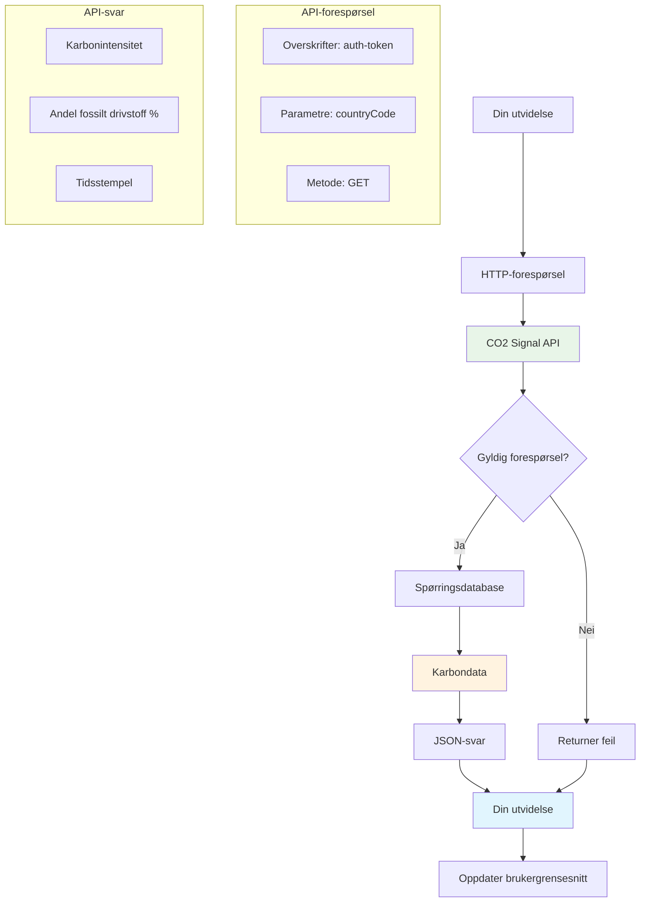
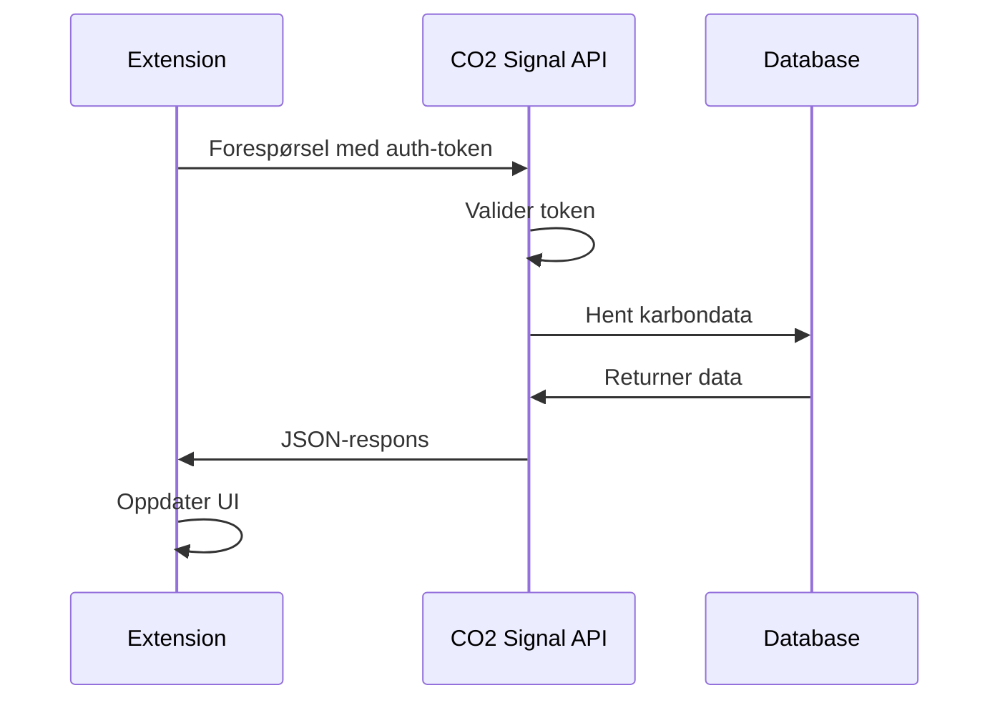
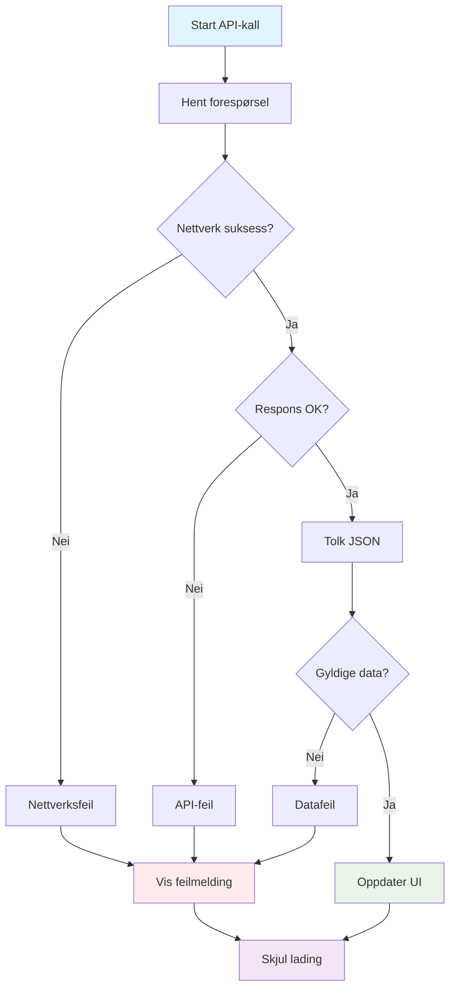
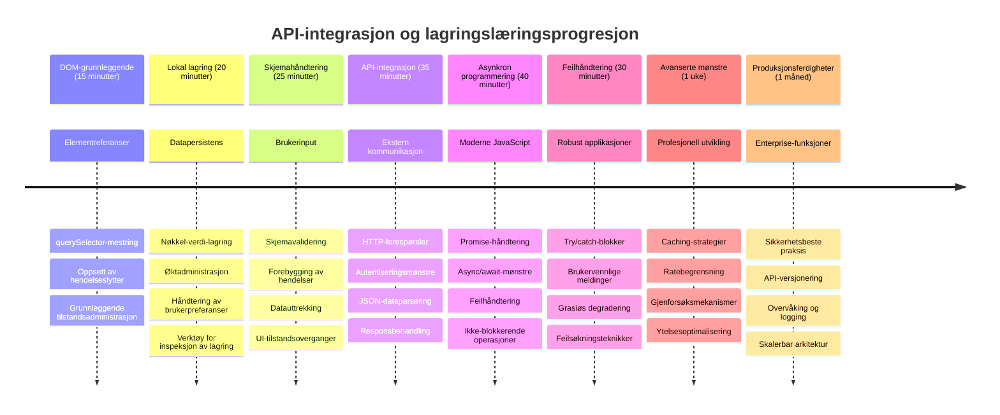

# Nettleserutvidelsesprosjekt Del 2: Kall et API, bruk Lokal Lagre


## Forberedende quiz

[Forberedende quiz](https://ff-quizzes.netlify.app/web/quiz/25)

## Introduksjon

Husker du den nettleserutvidelsen du begynte å lage? Akkurat nå har du et pent utseende skjema, men det er i praksis statisk. I dag skal vi gi det liv ved å koble det til ekte data og gi det hukommelse.

Tenk på Apollo oppskytingskontrollens datamaskiner - de viste ikke bare fast informasjon. De kommuniserte kontinuerlig med romfartøyene, oppdaterte med telemetridata, og husket viktige oppdragsparametere. Det er den typen dynamisk oppførsel vi bygger i dag. Utvidelsen din vil hente data fra internett, hente ekte miljødata og huske innstillingene dine til neste gang.

API-integrasjon kan høres komplisert ut, men det handler egentlig bare om å lære koden din å kommunisere med andre tjenester. Enten du henter værdata, sosiale medier-feed eller karbonavtrykksinformasjon som vi skal gjøre i dag, handler det om å etablere disse digitale forbindelsene. Vi skal også utforske hvordan nettlesere kan lagre informasjon - på samme måte som biblioteker har brukt kortkataloger for å huske hvor bøkene tilhører.

Ved slutten av denne leksjonen vil du ha en nettleserutvidelse som henter ekte data, lagrer brukerpreferanser og gir en jevn opplevelse. La oss komme i gang!


✅ Følg de nummererte segmentene i de aktuelle filene for å vite hvor du skal plassere koden din

## Sett opp elementene som skal manipuleres i utvidelsen

Før JavaScript-en din kan manipulere grensesnittet, trenger det referanser til spesifikke HTML-elementer. Tenk på det som et teleskop som må peke på bestemte stjerner - før Galileo kunne studere Jupiters måner, måtte han finne og fokusere på selve Jupiter.

I `index.js`-filen din skal vi lage `const`-variabler som fanger opp referanser til hvert viktige skjemafelt. Dette ligner på hvordan forskere merker utstyret sitt - i stedet for å lete gjennom hele laboratoriet hver gang, kan de direkte få tilgang til det de trenger.


```javascript
// skjema felt
const form = document.querySelector('.form-data');
const region = document.querySelector('.region-name');
const apiKey = document.querySelector('.api-key');

// resultater
const errors = document.querySelector('.errors');
const loading = document.querySelector('.loading');
const results = document.querySelector('.result-container');
const usage = document.querySelector('.carbon-usage');
const fossilfuel = document.querySelector('.fossil-fuel');
const myregion = document.querySelector('.my-region');
const clearBtn = document.querySelector('.clear-btn');
```

**Dette gjør koden:**
- **Fanger opp** skjemaelementer ved hjelp av `document.querySelector()` med CSS-klasseselektor
- **Oppretter** referanser til inputfelter for regionsnavn og API-nøkkel
- **Etablerer** koblinger til resultatvisningselementer for karbondatabruk
- **Setter opp** tilgang til UI-elementer som lastindikatorer og feilmeldinger
- **Lagrer** hver elementreferanse i en `const`-variabel for enkel gjenbruk i hele koden

## Legg til hendelseslyttere

Nå skal vi få utvidelsen til å reagere på brukerhandlinger. Hendelseslyttere er koden din sin måte å overvåke brukerinteraksjoner på. Tenk på dem som operatørene i tidlige telefonvekslinger - de lyttet etter innkommende anrop og koblet de riktige kretsene når noen ønsket å opprette forbindelse.


```javascript
form.addEventListener('submit', (e) => handleSubmit(e));
clearBtn.addEventListener('click', (e) => reset(e));
init();
```

**Forstå disse konseptene:**
- **Legger til** en submit-lytter på skjemaet som utløses når brukere trykker Enter eller klikker send inn
- **Kobler til** en klikk-lytter på tøm-knappen for å tilbakestille skjemaet
- **Sender med** hendelsesobjektet `(e)` til håndteringsfunksjonene for ekstra kontroll
- **Kaller** `init()`-funksjonen umiddelbart for å sette opp initial tilstand for utvidelsen

✅ Legg merke til den forkortede pilfunksjons-syntaksen som brukes her. Denne moderne JavaScript-tilnærmingen er renere enn tradisjonelle funksjonsuttrykk, men begge fungerer like bra!

### 🔄 **Pedagogisk sjekkpunkt**
**Forståelse av hendelseshåndtering**: Før du går videre til initialisering, sørg for at du kan:
- ✅ Forklare hvordan `addEventListener` kobler brukerhandlinger til JavaScript-funksjoner
- ✅ Forstå hvorfor vi sender med hendelsesobjektet `(e)` til håndteringsfunksjoner
- ✅ Gjenkjenne forskjellen mellom `submit` og `click` hendelser
- ✅ Beskrive når `init()`-funksjonen kjører og hvorfor

**Rask selvtest**: Hva skjer om du glemmer `e.preventDefault()` ved skjemainnsending?
*Svar: Siden vil lastes på nytt, alle JavaScript-tilstander går tapt, og brukeropplevelsen avbrytes*

## Bygg initialiserings- og tilbakestillingsfunksjonene

La oss lage initialiseringslogikken for utvidelsen din. `init()`-funksjonen er som et skips navigasjonssystem som sjekker instrumentene sine - den bestemmer gjeldende tilstand og justerer grensesnittet tilsvarende. Den sjekker om noen har brukt utvidelsen før og laster inn deres tidligere innstillinger.

`reset()`-funksjonen gir brukerne en frisk start - likt som forskere som tilbakestiller instrumentene mellom eksperimenter for å sikre rene data.

```javascript
function init() {
	// Sjekk om brukeren tidligere har lagret API-legitimasjon
	const storedApiKey = localStorage.getItem('apiKey');
	const storedRegion = localStorage.getItem('regionName');

	// Sett utvidelsesikon til generisk grønt (plassholder for neste leksjon)
	// TODO: Implementer oppdatering av ikon i neste leksjon

	if (storedApiKey === null || storedRegion === null) {
		// Førstegangsbruker: vis oppsettsskjemaet
		form.style.display = 'block';
		results.style.display = 'none';
		loading.style.display = 'none';
		clearBtn.style.display = 'none';
		errors.textContent = '';
	} else {
		// Tilbakevendende bruker: last inn deres lagrede data automatisk
		displayCarbonUsage(storedApiKey, storedRegion);
		results.style.display = 'none';
		form.style.display = 'none';
		clearBtn.style.display = 'block';
	}
}

function reset(e) {
	e.preventDefault();
	// Tøm lagret region for å la brukeren velge en ny plassering
	localStorage.removeItem('regionName');
	// Start initialiseringsprosessen på nytt
	init();
}
```

**Bryter ned hva som skjer her:**
- **Henter** lagret API-nøkkel og region fra nettleserens lokale lagring
- **Sjekker** om dette er en førstegangsbruker (ingen lagrede legitimasjoner) eller en som kommer tilbake
- **Viser** oppsett-skjemaet for nye brukere og skjuler andre grensesnitt-elementer
- **Laster** automatisk inn lagrede data for tilbakevendende brukere og viser tilbakestillingsvalget
- **Styrer** brukergrensesnittets tilstand basert på tilgjengelige data

**Nøkkelpunkter om Lokal lagring:**
- **Bevarer** data mellom nettleserøkter (i motsetning til session storage)
- **Lagrer** data som nøkkel-verdi-par via `getItem()` og `setItem()`
- **Returnerer** `null` når det ikke finnes data for en gitt nøkkel
- **Gir** en enkel måte å huske brukerpreferanser og innstillinger

> 💡 **Forståelse av Nettleserlager**: [LocalStorage](https://developer.mozilla.org/docs/Web/API/Window/localStorage) gir utvidelsen din vedvarende hukommelse. Tenk analogt på det gamle Alexandria-biblioteket der håndskrifter ble bevart - informasjon var tilgjengelig selv når lærde reiste bort og kom tilbake.
>
> **Nøkkelfunksjoner:**
> - **Bevarer** data selv når du lukker nettleseren
> - **Overlever** datamaskin-omstarter og nettleserkrasj
> - **Tilbyr** betydelig lagringsplass for brukerpreferanser
> - **Gir** umiddelbar tilgang uten nettverksforsinkelser

> **Viktig merknad**: Din nettleserutvidelse har sin egen isolerte lokale lagring som er adskilt fra vanlige nettsider. Dette gir sikkerhet og forhindrer konflikter med andre nettsteder.

Du kan se lagrede data ved å åpne nettleserens utviklerverktøy (F12), gå til **Application**-fanen, og utvide **Local Storage**-seksjonen.




> ⚠️ **Sikkerhetshensyn**: I produksjonsapplikasjoner utgjør lagring av API-nøkler i LocalStorage sikkerhetsrisiko siden JavaScript har tilgang til disse dataene. For læringsformål fungerer denne tilnærmingen greit, men ekte apper bør bruke sikker server-side lagring for sensitive legitimasjoner.

## Håndter skjemainnsending

Nå skal vi håndtere hva som skjer når noen sender inn skjemaet ditt. Som standard laster nettlesere siden på nytt ved innsending, men vi skal avbryte denne oppførselen for å gi en bedre opplevelse.

Denne tilnærmingen speiler hvordan oppskytingskontrollen håndterer kommunikasjon med romfartøy - i stedet for å tilbakestille hele systemet ved hver overføring, opprettholder de kontinuerlig drift mens nye data behandles.

Lag en funksjon som fanger opp skjemaets innsending og henter brukerens innspill:

```javascript
function handleSubmit(e) {
	e.preventDefault();
	setUpUser(apiKey.value, region.value);
}
```

**I koden ovenfor har vi:**
- **Forhindret** standard skjemainnsending som ville oppdatert siden
- **Hentet ut** brukerinndata fra API-nøkkel- og regionfeltene
- **Sendt** skjemadata til `setUpUser()`-funksjonen for behandling
- **Opprettholdt** single-page-applikasjonsatferd ved å unngå sidereferanser

✅ Husk at HTML-skjemaene dine har `required`-attributter, så nettleseren validerer automatisk at brukeren har oppgitt både API-nøkkel og region før denne funksjonen kjører.

## Sett opp brukerpreferanser

`setUpUser`-funksjonen er ansvarlig for å lagre brukerens legitimasjon og starte det første API-kallet. Dette gir en sømløs overgang fra oppsett til resultater.

```javascript
function setUpUser(apiKey, regionName) {
	// Lagre brukerlegitimasjon for fremtidige økter
	localStorage.setItem('apiKey', apiKey);
	localStorage.setItem('regionName', regionName);
	
	// Oppdater brukergrensesnittet for å vise lastetilstand
	loading.style.display = 'block';
	errors.textContent = '';
	clearBtn.style.display = 'block';
	
	// Hent data om karbonbruk med brukerens legitimasjon
	displayCarbonUsage(apiKey, regionName);
}
```

**Trinnvis oversikt over hva som skjer:**
- **Lagrer** API-nøkkel og regionsnavn til lokal lagring for senere bruk
- **Viser** en lastindikator for å informere brukeren om at data hentes
- **Fjerner** eventuelle tidligere feilmeldinger fra visningen
- **Avslører** tømmeknappen slik at brukeren kan tilbakestille innstillinger senere
- **Starter** API-kallet for å hente ekte karbondatakonsum

Denne funksjonen skaper en sømløs brukeropplevelse ved å styre både datalagring og brukergrensesnittoppdateringer i én koordinert handling.

## Vis karbondatabruk

Nå skal vi koble utvidelsen til eksterne datakilder via API-er. Dette forvandler utvidelsen fra et frittstående verktøy til noe som kan hente sanntidsinformasjon fra hele internett.

**Forstå API-er**

[API-er](https://www.webopedia.com/TERM/A/API.html) er hvordan forskjellige applikasjoner kommuniserer med hverandre. Tenk på det som telegrafsystemet som forbandt fjerne byer på 1800-tallet - operatører sendte forespørsler til fjerne stasjoner og mottok svar med etterspurt informasjon. Hver gang du sjekker sosiale medier, spør en taleassistent et spørsmål, eller bruker en leveringsapp, legger API-ene til rette for disse datautvekslingene.


**Nøkkelpunkter om REST API-er:**
- **REST** står for 'Representational State Transfer'
- **Bruker** standard HTTP-metoder (GET, POST, PUT, DELETE) for å samhandle med data
- **Returnerer** data i forutsigbare formater, vanligvis JSON
- **Tilbyr** konsistente URL-baserte endepunkter for ulike typer forespørsler

✅ [CO2 Signal API](https://www.co2signal.com/) vi bruker, gir sanntidsdata om karbonintensiteten i elektrisitetsnett verden over. Dette hjelper brukere å forstå miljøpåvirkningen av strømforbruket sitt!

> 💡 **Forstå Asynkron JavaScript**: [`async` nøkkelordet](https://developer.mozilla.org/docs/Web/JavaScript/Reference/Statements/async_function) gjør det mulig for koden å håndtere flere operasjoner samtidig. Når du ber om data fra en server, vil du ikke at hele utvidelsen skal fryse - det ville være som om flykontrollen stopper all drift mens den venter på ett fly.
>
> **Hovedfordeler:**
> - **Opprettholder** utvidelsens responsivitet mens data lastes
> - **Lar** annen kode fortsette å kjøre under nettverksforespørsler
> - **Forbedrer** kode-lesbarheten sammenlignet med tradisjonell callback-mønster
> - **Muliggjør** elegant håndtering av nettverksfeil

Her er en kort video om `async`:

[](https://youtube.com/watch?v=YwmlRkrxvkk "Async and Await for managing promises")

> 🎥 Klikk på bildet over for en video om async/await.

### 🔄 **Pedagogisk sjekkpunkt**
**Forståelse av asynkron programmering**: Før du går inn i API-funksjonen, forsikre deg om at du forstår:
- ✅ Hvorfor vi bruker `async/await` i stedet for å blokkere hele utvidelsen
- ✅ Hvordan `try/catch`-blokker elegant håndterer nettverksfeil
- ✅ Forskjellen mellom synkrone og asynkrone operasjoner
- ✅ Hvorfor API-kall kan feile og hvordan feilhåndtering gjøres

**Virkelige eksempler på async**:
- **Bestille mat**: Du venter ikke i kjøkkenet - du får kvittering og fortsetter med andre ting
- **Sende e-post**: E-postappen fryser ikke mens meldinger sendes - du kan begynne å skrive flere e-poster
- **Laste websider**: Bilder lastes inn gradvis mens du allerede kan lese teksten

**Flyt for API-autentisering**:

Lag funksjonen som henter og viser karbondatabruken:

```javascript
// Moderne fetch API-tilnærming (ingen eksterne avhengigheter nødvendig)
async function displayCarbonUsage(apiKey, region) {
	try {
		// Hent karbonintensitetsdata fra CO2 Signal API
		const response = await fetch('https://api.co2signal.com/v1/latest', {
			method: 'GET',
			headers: {
				'auth-token': apiKey,
				'Content-Type': 'application/json'
			},
			// Legg til spørringsparametere for den spesifikke regionen
			...new URLSearchParams({ countryCode: region }) && {
				url: `https://api.co2signal.com/v1/latest?countryCode=${region}`
			}
		});

		// Sjekk om API-forespørselen var vellykket
		if (!response.ok) {
			throw new Error(`API request failed: ${response.status}`);
		}

		const data = await response.json();
		const carbonData = data.data;

		// Beregn avrundet karbonintensitetsverdi
		const carbonIntensity = Math.round(carbonData.carbonIntensity);

		// Oppdater brukergrensesnittet med hentede data
		loading.style.display = 'none';
		form.style.display = 'none';
		myregion.textContent = region.toUpperCase();
		usage.textContent = `${carbonIntensity} grams (grams CO₂ emitted per kilowatt hour)`;
		fossilfuel.textContent = `${carbonData.fossilFuelPercentage.toFixed(2)}% (percentage of fossil fuels used to generate electricity)`;
		results.style.display = 'block';

		// TODO: calculateColor(carbonIntensity) - implementer i neste leksjon

	} catch (error) {
		console.error('Error fetching carbon data:', error);
		
		// Vis brukervennlig feilmelding
		loading.style.display = 'none';
		results.style.display = 'none';
		errors.textContent = 'Sorry, we couldn\'t fetch data for that region. Please check your API key and region code.';
	}
}
```

**Analyse av hva som skjer her:**
- **Bruker** den moderne `fetch()` API-en i stedet for eksterne biblioteker som Axios for en renere, avhengighetsfri kode
- **Implementerer** korrekt feilkontroll med `response.ok` for å fange opp API-feil tidlig
- **Håndterer** asynkrone operasjoner med `async/await` for mer lesbar kodestrøm
- **Autentiserer** med CO2 Signal API ved hjelp av `auth-token`-header
- **Parser** JSON-responsdata og henter ut karbonintensitetsinformasjonen
- **Oppdaterer** flere UI-elementer med formaterte miljødata
- **Gir** brukervennlige feilmeldinger når API-kall feiler

**Viktige moderne JavaScript-konsepter vist:**
- **Template literals** med `${}` syntaks for ren strengformatering
- **Feilhåndtering** med try/catch-blokker for robuste applikasjoner
- **Async/await** mønster for elegant nettverksforespørselshåndtering
- **Objektdestrukturering** for å hente spesifikke data fra API-responser
- **Metodekjedet calls** for flere DOM-manipulasjoner

✅ Denne funksjonen viser flere viktige webutviklingskonsepter - kommunikasjon med eksterne servere, håndtering av autentisering, databehandling, oppdatering av grensesnitt, og skånsom feilhåndtering. Dette er fundamentale ferdigheter profesjonelle utviklere bruker daglig.


### 🔄 **Pedagogisk sjekkpunkt**
**Fullstendig systemforståelse**: Bekreft mestring av hele flyten:
- ✅ Hvordan DOM-referanser gjør at JavaScript kan kontrollere grensesnittet
- ✅ Hvorfor lokal lagring gir persistens mellom nettleserøkter
- ✅ Hvordan async/await gjør API-kall uten å fryse utvidelsen
- ✅ Hva som skjer ved API-feil og hvordan feilmeldinger håndteres
- ✅ Hvorfor brukeropplevelsen inkluderer lastetilstander og feilmeldinger

🎉 **Det du har oppnådd:** Du har laget en nettleserutvidelse som:
- **Kobler** til internett og henter ekte miljødata
- **Bevarer** brukerinnstillinger mellom økter
- **Håndterer** feil på en elegant måte uten krasj
- **Tilbyr** en jevn, profesjonell brukeropplevelse

Test arbeidet ditt ved å kjøre `npm run build` og oppdatere utvidelsen din i nettleseren. Du har nå en funksjonell karbonavtrykksmåler. Neste leksjon vil legge til dynamisk ikonfunksjonalitet for å fullføre utvidelsen.

---

## GitHub Copilot Agent Challenge 🚀

Bruk Agent-modus for å fullføre følgende utfordring:
**Beskrivelse:** Forbedre nettleserutvidelsen ved å legge til forbedringer for feilhåndtering og brukeropplevelse. Denne utfordringen vil hjelpe deg å øve på å jobbe med APIer, lokal lagring og DOM-manipulering ved bruk av moderne JavaScript-mønstre.

**Oppgave:** Lag en forbedret versjon av displayCarbonUsage-funksjonen som inkluderer: 1) En retry-mekanisme for mislykkede API-kall med eksponentiell tilbakekobling, 2) Validering av input for regionkode før API-kallet utføres, 3) En lastingsanimasjon med fremdriftsindikatorer, 4) Caching av API-responser i localStorage med utløpstidspunkt (cache i 30 minutter), og 5) En funksjon for å vise historiske data fra tidligere API-kall. Legg også til korrekte JSDoc-kommentarer i TypeScript-stil for å dokumentere alle funksjonsparametere og returtyper.

Lær mer om [agent mode](https://code.visualstudio.com/blogs/2025/02/24/introducing-copilot-agent-mode) her.

## 🚀 Utfordring

Utvid din forståelse av APIer ved å utforske det brede utvalget av nettleserbaserte APIer tilgjengelig for webutvikling. Velg ett av disse nettleser-APIene og lag en liten demonstrasjon:

- [Geolocation API](https://developer.mozilla.org/docs/Web/API/Geolocation_API) - Få brukerens nåværende posisjon
- [Notification API](https://developer.mozilla.org/docs/Web/API/Notifications_API) - Send skrivebordsvarsler
- [HTML Drag and Drop API](https://developer.mozilla.org/docs/Web/API/HTML_Drag_and_Drop_API) - Lag interaktive dra-og-slipp-grensesnitt
- [Web Storage API](https://developer.mozilla.org/docs/Web/API/Web_Storage_API) - Avanserte teknikker for lokal lagring
- [Fetch API](https://developer.mozilla.org/docs/Web/API/Fetch_API) - Moderne alternativ til XMLHttpRequest

**Forskningsspørsmål å vurdere:**
- Hvilke reelle problemer løser dette APIet?
- Hvordan håndterer APIet feil og kanttilfeller?
- Hvilke sikkerhetsbetraktninger finnes ved bruk av dette APIet?
- Hvor bredt støttet er dette APIet i forskjellige nettlesere?

Etter forskningen, identifiser hvilke egenskaper som gjør et API utviklervennlig og pålitelig.

## Quiz etter forelesning

[Quiz etter forelesning](https://ff-quizzes.netlify.app/web/quiz/26)

## Gjennomgang og egenstudie

Du lærte om LocalStorage og APIer i denne leksjonen, begge svært nyttige for profesjonelle webutviklere. Kan du tenke på hvordan disse to tingene fungerer sammen? Tenk på hvordan du ville arkitektureret et nettsted som lagrer elementer for bruk av et API.

### ⚡ **Hva du kan gjøre de neste 5 minuttene**
- [ ] Åpne DevTools Application-fanen og utforsk localStorage på et hvilket som helst nettsted
- [ ] Lag et enkelt HTML-skjema og test validering av skjema i nettleseren
- [ ] Prøv å lagre og hente data ved bruk av localStorage i nettleserkonsollen
- [ ] Inspiser skjema-data som blir sendt inn ved bruk av Network-fanen

### 🎯 **Hva du kan oppnå denne timen**
- [ ] Fullfør quiz etter leksjonen og forstå konsepter for skjema-håndtering
- [ ] Lag et nettleserutvidelses-skjema som lagrer brukerpreferanser
- [ ] Implementer klient-side skjema-validering med hjelpsomme feilmeldinger
- [ ] Øv på bruk av chrome.storage API for lagring av utvidelsesdata
- [ ] Lag et brukergrensesnitt som reagerer på gitte brukersettinger

### 📅 **Din ukelange utvidelsesbygging**
- [ ] Fullfør en fullverdig nettleserutvidelse med skjema-funksjonalitet
- [ ] Bli ekspert på forskjellige lagringsalternativer: local, sync og session storage
- [ ] Implementer avanserte skjema-funksjoner som autofullføring og validering
- [ ] Legg til import-/eksportfunksjonalitet for brukerdata
- [ ] Test utvidelsen grundig på ulike nettlesere
- [ ] Poler brukeropplevelsen og feilhåndteringen i utvidelsen

### 🌟 **Din månedslange web API-mestring**
- [ ] Bygg komplekse applikasjoner med ulike nettleser-lagrings-APIer
- [ ] Lær om offline-first utviklingsmønstre
- [ ] Bidra til åpne kildeprosjekter knyttet til datalagring
- [ ] Mestre personvernfokusert utvikling og GDPR-samsvar
- [ ] Lag gjenbrukbare biblioteker for skjema-håndtering og datastyring
- [ ] Del kunnskap om web APIer og utvidelsesutvikling

## 🎯 Din tidslinje for mestring av utvidelsesutvikling


### 🛠️ Sammendrag av din full-stack utviklingsverktøykasse

Etter å ha fullført denne leksjonen, har du nå:
- **DOM-mestring**: Presis målretting og manipulering av elementer
- **Lagringsekspertise**: Vedvarende datastyring med localStorage
- **API-integrasjon**: Henting av sanntidsdata og autentisering
- **Asynkron programmering**: Ikke-blokkerende operasjoner med moderne JavaScript
- **Feilhåndtering**: Robust applikasjoner som håndterer feil elegant
- **Brukeropplevelse**: Lastetilstander, validering og smidige interaksjoner
- **Moderne mønstre**: fetch API, async/await og ES6+-funksjoner

**Profesjonelle ferdigheter oppnådd**: Du har implementert mønstre brukt i:
- **Webapplikasjoner**: Enkle SPAer med eksterne datakilder
- **Mobilutvikling**: API-drevne apper med offline-kapasiteter
- **Desktopprogramvare**: Electron-apper med vedvarende lagring
- **Enterprise-systemer**: Autentisering, caching og feilhåndtering
- **Moderne rammeverk**: React/Vue/Angular datastyringsmønstre

**Neste nivå**: Du er klar til å utforske avanserte temaer som cache-strategier, sanntid WebSocket-tilkoblinger eller kompleks tilstandshåndtering!

## Oppgave

[Ta i bruk et API](assignment.md)

---

<!-- CO-OP TRANSLATOR DISCLAIMER START -->
**Ansvarsfraskrivelse**:
Dette dokumentet er oversatt ved hjelp av AI-oversettelsestjenesten [Co-op Translator](https://github.com/Azure/co-op-translator). Selv om vi streber etter nøyaktighet, vennligst vær oppmerksom på at automatiske oversettelser kan inneholde feil eller unøyaktigheter. Det originale dokumentet på det opprinnelige språket skal anses som den autoritative kilden. For kritisk informasjon anbefales profesjonell menneskelig oversettelse. Vi er ikke ansvarlige for eventuelle misforståelser eller feiltolkninger som oppstår ved bruk av denne oversettelsen.
<!-- CO-OP TRANSLATOR DISCLAIMER END -->