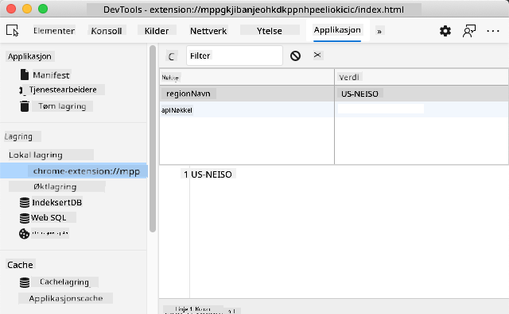

<!--
CO_OP_TRANSLATOR_METADATA:
{
  "original_hash": "a7587943d38d095de8613e1b508609f5",
  "translation_date": "2025-08-29T08:33:15+00:00",
  "source_file": "5-browser-extension/2-forms-browsers-local-storage/README.md",
  "language_code": "no"
}
-->
# Nettleserutvidelsesprosjekt Del 2: Kall en API, bruk Local Storage

## Quiz før forelesning

[Quiz før forelesning](https://ff-quizzes.netlify.app/web/quiz/25)

### Introduksjon

I denne leksjonen skal du kalle en API ved å sende inn skjemaet til nettleserutvidelsen din og vise resultatene i utvidelsen. I tillegg vil du lære hvordan du kan lagre data i nettleserens lokale lagring for fremtidig referanse og bruk.

✅ Følg de nummererte segmentene i de relevante filene for å vite hvor du skal plassere koden din.

### Sett opp elementene som skal manipuleres i utvidelsen:

På dette tidspunktet har du laget HTML-en for skjemaet og `<div>`-elementet for resultatene i nettleserutvidelsen din. Fra nå av må du jobbe i `/src/index.js`-filen og bygge utvidelsen din steg for steg. Se tilbake på [forrige leksjon](../1-about-browsers/README.md) for å sette opp prosjektet ditt og lære om byggeprosessen.

Jobb i `index.js`-filen din, og start med å opprette noen `const`-variabler for å holde verdiene knyttet til ulike felt:

```JavaScript
// form fields
const form = document.querySelector('.form-data');
const region = document.querySelector('.region-name');
const apiKey = document.querySelector('.api-key');

// results
const errors = document.querySelector('.errors');
const loading = document.querySelector('.loading');
const results = document.querySelector('.result-container');
const usage = document.querySelector('.carbon-usage');
const fossilfuel = document.querySelector('.fossil-fuel');
const myregion = document.querySelector('.my-region');
const clearBtn = document.querySelector('.clear-btn');
```

Alle disse feltene refereres til via deres CSS-klasser, slik du satte det opp i HTML-en i forrige leksjon.

### Legg til lyttere

Deretter legger du til event-lyttere for skjemaet og tilbakestillingsknappen som nullstiller skjemaet. Dette sikrer at noe skjer når en bruker sender inn skjemaet eller klikker på tilbakestillingsknappen. Legg også til kallet for å initialisere appen nederst i filen:

```JavaScript
form.addEventListener('submit', (e) => handleSubmit(e));
clearBtn.addEventListener('click', (e) => reset(e));
init();
```

✅ Legg merke til den forkortede måten å lytte etter en submit- eller klikkhendelse på, og hvordan hendelsen sendes til handleSubmit- eller reset-funksjonene. Kan du skrive en lengre versjon av denne forkortelsen? Hvilken foretrekker du?

### Bygg ut init()-funksjonen og reset()-funksjonen:

Nå skal du bygge funksjonen som initialiserer utvidelsen, kalt init():

```JavaScript
function init() {
	//if anything is in localStorage, pick it up
	const storedApiKey = localStorage.getItem('apiKey');
	const storedRegion = localStorage.getItem('regionName');

	//set icon to be generic green
	//todo

	if (storedApiKey === null || storedRegion === null) {
		//if we don't have the keys, show the form
		form.style.display = 'block';
		results.style.display = 'none';
		loading.style.display = 'none';
		clearBtn.style.display = 'none';
		errors.textContent = '';
	} else {
        //if we have saved keys/regions in localStorage, show results when they load
        displayCarbonUsage(storedApiKey, storedRegion);
		results.style.display = 'none';
		form.style.display = 'none';
		clearBtn.style.display = 'block';
	}
};

function reset(e) {
	e.preventDefault();
	//clear local storage for region only
	localStorage.removeItem('regionName');
	init();
}

```

I denne funksjonen er det noe interessant logikk. Når du leser gjennom den, kan du se hva som skjer?

- To `const` opprettes for å sjekke om brukeren har lagret en APIKey og regionkode i lokal lagring.
- Hvis en av disse er null, vis skjemaet ved å endre stilen til 'block'.
- Skjul resultatene, lasteskjermen og clearBtn, og sett eventuell feilmeldingstekst til en tom streng.
- Hvis det finnes en nøkkel og en region, start en rutine for å:
  - Kalle API-en for å hente data om karbonbruk.
  - Skjule resultatområdet.
  - Skjule skjemaet.
  - Vise tilbakestillingsknappen.

Før du går videre, er det nyttig å lære om et veldig viktig konsept som er tilgjengelig i nettlesere: [LocalStorage](https://developer.mozilla.org/docs/Web/API/Window/localStorage). LocalStorage er en nyttig måte å lagre strenger i nettleseren som et `key-value`-par. Denne typen nettlagring kan manipuleres med JavaScript for å håndtere data i nettleseren. LocalStorage utløper ikke, mens SessionStorage, en annen type nettlagring, tømmes når nettleseren lukkes. De ulike typene lagring har fordeler og ulemper.

> Merk - nettleserutvidelsen din har sin egen lokale lagring; hovednettleservinduet er en annen instans og oppfører seg separat.

Du setter APIKey til å ha en strengverdi, for eksempel, og du kan se at den er satt i Edge ved å "inspisere" en nettside (høyreklikk i nettleseren for å inspisere) og gå til Applikasjoner-fanen for å se lagringen.



✅ Tenk på situasjoner der du IKKE vil lagre noen data i LocalStorage. Generelt er det en dårlig idé å plassere API-nøkler i LocalStorage! Kan du se hvorfor? I vårt tilfelle, siden appen vår kun er for læring og ikke skal distribueres til en appbutikk, vil vi bruke denne metoden.

Legg merke til at du bruker Web API for å manipulere LocalStorage, enten ved å bruke `getItem()`, `setItem()` eller `removeItem()`. Det støttes bredt på tvers av nettlesere.

Før du bygger `displayCarbonUsage()`-funksjonen som kalles i `init()`, la oss bygge funksjonaliteten for å håndtere den første skjema-innsendingen.

### Håndter skjema-innsendingen

Lag en funksjon kalt `handleSubmit` som aksepterer et hendelsesargument `(e)`. Stopp hendelsen fra å propagere (i dette tilfellet vil vi stoppe nettleseren fra å oppdatere) og kall en ny funksjon, `setUpUser`, med argumentene `apiKey.value` og `region.value`. På denne måten bruker du de to verdiene som hentes inn via det første skjemaet når de relevante feltene er fylt ut.

```JavaScript
function handleSubmit(e) {
	e.preventDefault();
	setUpUser(apiKey.value, region.value);
}
```

✅ Frisk opp hukommelsen - HTML-en du satte opp i forrige leksjon har to input-felt hvis `values` fanges opp via `const`-variablene du satte opp øverst i filen, og de er begge `required`, slik at nettleseren hindrer brukere i å legge inn nullverdier.

### Sett opp brukeren

Gå videre til `setUpUser`-funksjonen. Her setter du verdier for apiKey og regionName i lokal lagring. Legg til en ny funksjon:

```JavaScript
function setUpUser(apiKey, regionName) {
	localStorage.setItem('apiKey', apiKey);
	localStorage.setItem('regionName', regionName);
	loading.style.display = 'block';
	errors.textContent = '';
	clearBtn.style.display = 'block';
	//make initial call
	displayCarbonUsage(apiKey, regionName);
}
```

Denne funksjonen viser en lastemelding mens API-en kalles. På dette tidspunktet har du kommet til å lage den viktigste funksjonen i denne nettleserutvidelsen!

### Vis karbonbruk

Endelig er det tid for å spørre API-en!

Før vi går videre, bør vi diskutere API-er. API-er, eller [Application Programming Interfaces](https://www.webopedia.com/TERM/A/API.html), er et kritisk element i verktøykassen til en webutvikler. De gir standardiserte måter for programmer å samhandle og grensesnitt med hverandre. For eksempel, hvis du bygger et nettsted som trenger å spørre en database, kan noen ha laget en API for deg å bruke. Selv om det finnes mange typer API-er, er en av de mest populære en [REST API](https://www.smashingmagazine.com/2018/01/understanding-using-rest-api/).

✅ Begrepet 'REST' står for 'Representational State Transfer' og innebærer bruk av ulike konfigurerte URL-er for å hente data. Gjør litt research på de ulike typene API-er som er tilgjengelige for utviklere. Hvilket format appellerer til deg?

Det er viktige ting å merke seg om denne funksjonen. Først, legg merke til [`async`-nøkkelordet](https://developer.mozilla.org/docs/Web/JavaScript/Reference/Statements/async_function). Å skrive funksjonene dine slik at de kjører asynkront betyr at de venter på at en handling, som at data returneres, skal fullføres før de fortsetter.

Her er en kort video om `async`:

[](https://youtube.com/watch?v=YwmlRkrxvkk "Async og Await for å håndtere løfter")

> 🎥 Klikk på bildet over for en video om async/await.

Lag en ny funksjon for å spørre C02Signal API-en:

```JavaScript
import axios from '../node_modules/axios';

async function displayCarbonUsage(apiKey, region) {
	try {
		await axios
			.get('https://api.co2signal.com/v1/latest', {
				params: {
					countryCode: region,
				},
				headers: {
					'auth-token': apiKey,
				},
			})
			.then((response) => {
				let CO2 = Math.floor(response.data.data.carbonIntensity);

				//calculateColor(CO2);

				loading.style.display = 'none';
				form.style.display = 'none';
				myregion.textContent = region;
				usage.textContent =
					Math.round(response.data.data.carbonIntensity) + ' grams (grams C02 emitted per kilowatt hour)';
				fossilfuel.textContent =
					response.data.data.fossilFuelPercentage.toFixed(2) +
					'% (percentage of fossil fuels used to generate electricity)';
				results.style.display = 'block';
			});
	} catch (error) {
		console.log(error);
		loading.style.display = 'none';
		results.style.display = 'none';
		errors.textContent = 'Sorry, we have no data for the region you have requested.';
	}
}
```

Dette er en stor funksjon. Hva skjer her?

- I tråd med beste praksis bruker du `async`-nøkkelordet for å få denne funksjonen til å oppføre seg asynkront. Funksjonen inneholder en `try/catch`-blokk, da den vil returnere et løfte når API-en returnerer data. Fordi du ikke har kontroll over hastigheten API-en svarer med (den kan hende ikke svarer i det hele tatt!), må du håndtere denne usikkerheten ved å kalle den asynkront.
- Du spør co2signal API-en for å hente data om regionen din, ved å bruke API-nøkkelen din. For å bruke den nøkkelen må du bruke en type autentisering i header-parametrene.
- Når API-en svarer, tilordner du ulike elementer av responsdataene til delene av skjermen du satte opp for å vise disse dataene.
- Hvis det oppstår en feil, eller hvis det ikke finnes noe resultat, viser du en feilmelding.

✅ Å bruke asynkrone programmeringsmønstre er et annet veldig nyttig verktøy i verktøykassen din. Les [om de ulike måtene](https://developer.mozilla.org/docs/Web/JavaScript/Reference/Statements/async_function) du kan konfigurere denne typen kode.

Gratulerer! Hvis du bygger utvidelsen din (`npm run build`) og oppdaterer den i utvidelsespanelet ditt, har du en fungerende utvidelse! Det eneste som ikke fungerer er ikonet, og det skal du fikse i neste leksjon.

---

## 🚀 Utfordring

Vi har diskutert flere typer API-er så langt i disse leksjonene. Velg en web-API og undersøk i dybden hva den tilbyr. For eksempel, ta en titt på API-er som er tilgjengelige i nettlesere, som [HTML Drag and Drop API](https://developer.mozilla.org/docs/Web/API/HTML_Drag_and_Drop_API). Hva mener du kjennetegner en god API?

## Quiz etter forelesning

[Quiz etter forelesning](https://ff-quizzes.netlify.app/web/quiz/26)

## Gjennomgang og selvstudium

Du lærte om LocalStorage og API-er i denne leksjonen, begge svært nyttige for profesjonelle webutviklere. Kan du tenke på hvordan disse to tingene fungerer sammen? Tenk på hvordan du ville arkitektet et nettsted som lagrer elementer som skal brukes av en API.

## Oppgave

[Adopter en API](assignment.md)

---

**Ansvarsfraskrivelse**:  
Dette dokumentet er oversatt ved hjelp av AI-oversettelsestjenesten [Co-op Translator](https://github.com/Azure/co-op-translator). Selv om vi tilstreber nøyaktighet, vennligst vær oppmerksom på at automatiske oversettelser kan inneholde feil eller unøyaktigheter. Det originale dokumentet på sitt opprinnelige språk bør anses som den autoritative kilden. For kritisk informasjon anbefales profesjonell menneskelig oversettelse. Vi er ikke ansvarlige for eventuelle misforståelser eller feiltolkninger som oppstår ved bruk av denne oversettelsen.