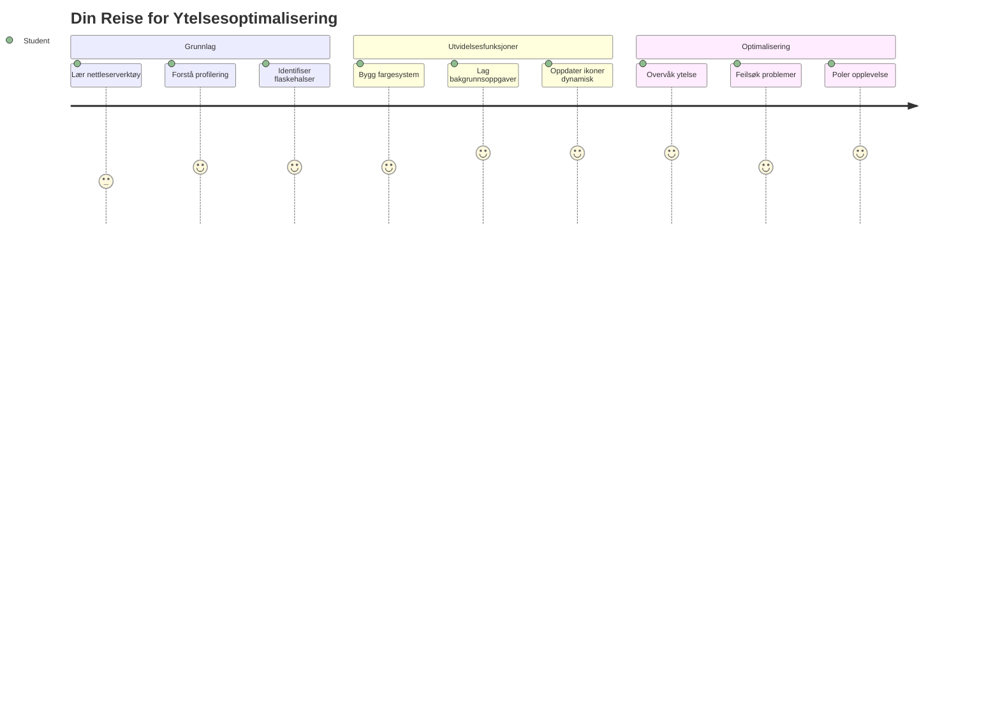
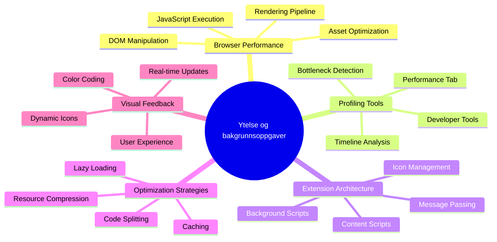
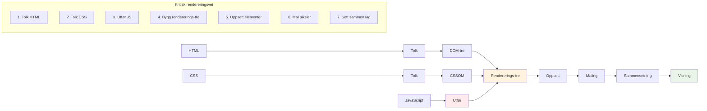
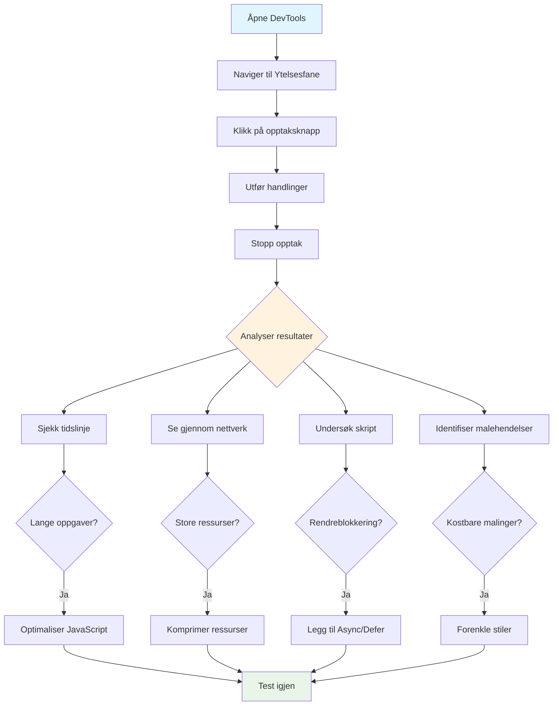
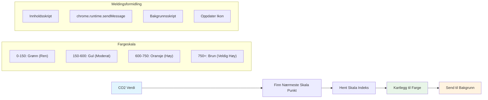
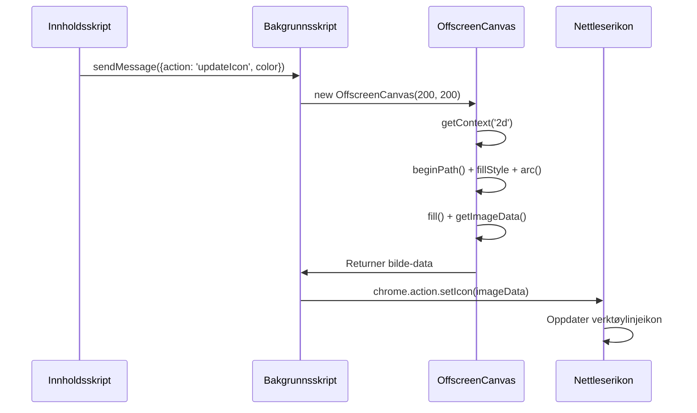
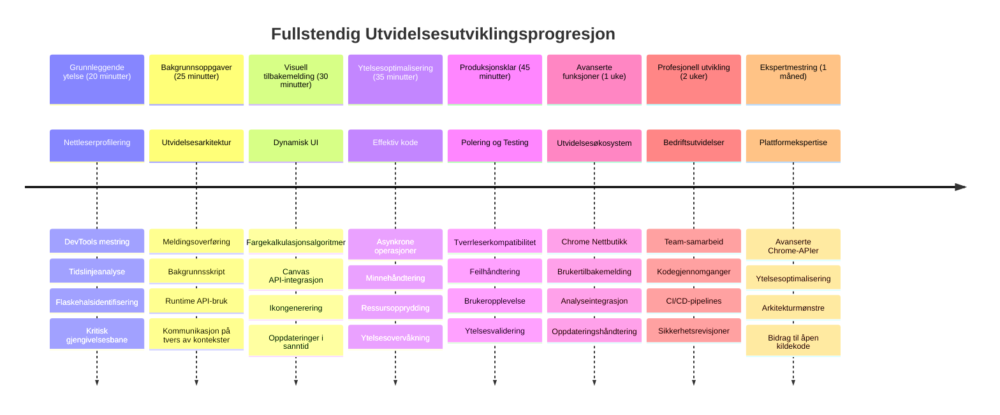

<!--
CO_OP_TRANSLATOR_METADATA:
{
  "original_hash": "b275fed2c6fc90d2b9b6661a3225faa2",
  "translation_date": "2026-01-07T00:35:58+00:00",
  "source_file": "5-browser-extension/3-background-tasks-and-performance/README.md",
  "language_code": "no"
}
-->
# Nettleserutvidelsesprosjekt Del 3: Lær om Bakgrunnsoppgaver og Ytelse


Har du noen gang lurt på hva som gjør at noen nettleserutvidelser føles raske og responsive, mens andre virker trege? Hemmeligheten ligger i hva som skjer bak kulissene. Mens brukere klikker rundt i utvidelsens grensesnitt, finnes det en hel verden av bakgrunnsprosesser som stille håndterer henting av data, ikonoppdateringer og systemressurser.

Dette er vår siste leksjon i nettleserutvidelsesserien, og vi skal få karbonavtrykksporeren din til å fungere smidig. Du vil legge til dynamiske ikonoppdateringer og lære hvordan du oppdager ytelsesproblemer før de blir alvorlige. Det er som å tune en racerbilen – små optimaliseringer kan gjøre en enorm forskjell i hvordan alt fungerer.

Når vi er ferdige, vil du ha en polert utvidelse og forstå ytelsesprinsippene som skiller gode nettapper fra de flotte. La oss dykke ned i nettleseroptimaliseringens verden.

## Forhåndsforelesnings-Quiz

[Forhåndsforelesnings-quiz](https://ff-quizzes.netlify.app/web/quiz/27)

### Introduksjon

I våre tidligere leksjoner har du laget et skjema, koblet det til en API, og håndtert asynkron datahenting. Utvidelsen din tar form på en fin måte.

Nå trenger vi å legge de siste detaljene – som å få ikonet til utvidelsen til å endre farge basert på karbondata. Dette minner meg om hvordan NASA måtte optimalisere hvert system på Apollo-romfartøyet. De hadde ikke råd til noen bortkastede sykluser eller minne fordi liv var avhengig av ytelsen. Selv om vår nettleserutvidelse ikke er like kritisk, gjelder de samme prinsippene – effektiv kode gir bedre brukeropplevelser.


## Grunnleggende om Nettleserytelse

Når koden din kjører effektivt, kan folk faktisk *føle* forskjellen. Du vet det øyeblikket når en side laster umiddelbart eller en animasjon flyter jevnt? Det er god ytelse på jobb.

Ytelse handler ikke bare om hastighet – det handler om å lage nettopplevelser som føles naturlige i stedet for klønete og frustrerende. Tidlig i databehandlingens dager hadde Grace Hopper berømt en nanosekund (et stykke ledning som var omtrent en fot langt) på skrivebordet for å vise hvor langt lys reiser i en milliarddel av et sekund. Det var hennes måte å forklare hvorfor hvert mikrosekund teller i databehandling. La oss utforske detektivverktøyene som hjelper deg å finne ut hva som sinker ting.

> "Nettstedets ytelse handler om to ting: hvor raskt siden lastes, og hvor raskt koden på den kjører." -- [Zack Grossbart](https://www.smashingmagazine.com/2012/06/javascript-profiling-chrome-developer-tools/)

Temaet om hvordan du får nettsidene dine lynraske på alle slags enheter, for alle slags brukere, i alle slags situasjoner, er selvsagt omfattende. Her er noen punkter å ha i bakhodet når du bygger enten et standard nettoprojekt eller en nettleserutvidelse.

Det første steget i å optimalisere nettstedet ditt er å forstå hva som faktisk skjer under panseret. Heldigvis har nettleseren din kraftige detektivverktøy innebygd.


For å åpne Utviklerverktøy i Edge, klikk på de tre prikkene øverst til høyre, gå deretter til Flere verktøy > Utviklerverktøy. Eller bruk hurtigtasten: `Ctrl` + `Shift` + `I` på Windows eller `Option` + `Command` + `I` på Mac. Når du er der, klikker du på Ytelsestabben – her skal du gjøre undersøkelsen din.

**Her er din detektivverktøykasse for ytelse:**
- **Åpne** Utviklerverktøy (du kommer til å bruke disse konstant som utvikler!)
- **Gå** til Ytelsestabben – tenk på det som nettappens aktivitetsmåler
- **Trykk** på Spill inn-knappen og se siden i aksjon
- **Studer** resultatene for å oppdage hva som sinker ting

La oss prøve dette. Åpne et nettsted (Microsoft.com fungerer bra for dette) og trykk på 'Spill inn'-knappen. Last deretter siden på nytt og se profilereren fange alt som skjer. Når du stopper opptaket, vil du se en detaljert oversikt over hvordan nettleseren 'skriver skript', 'renderer' og 'maler' siden. Det minner meg om hvordan oppdragskontrollen overvåker hvert system under en rakettoppskyting – du får sanntidsdata på eksakt hva som skjer og når.


✅ [Microsoft-dokumentasjonen](https://docs.microsoft.com/microsoft-edge/devtools-guide/performance/?WT.mc_id=academic-77807-sagibbon) har mange flere detaljer hvis du vil dykke dypere.

> Proftips: Tøm nettleserens hurtigbuffer før du tester for å se hvordan siden din oppfører seg for førstegangsbesøkende – det er vanligvis ganske annerledes enn ved gjentatte besøk!

Velg elementer på profiltidslinjen for å zoome inn på hendelser som skjer mens siden laster.

Få et øyeblikksbilde av sidens ytelse ved å velge deler av tidslinjen og se på oppsummeringspanelet:


Sjekk hendelsesloggen for å se om noen hendelser tok lengre tid enn 15 ms:


✅ Bli kjent med profilereren din! Åpne utviklerverktøyene på dette nettstedet og se om det finnes noen flaskehalser. Hva er den tregest lastende ressursen? Den raskeste?


## Hva du bør se etter når du profilerer

Å kjøre profilereren er bare begynnelsen – den virkelige ferdigheten ligger i å vite hva de fargerike grafene faktisk forteller deg. Ikke bekymre deg, du vil lære deg å lese dem. Erfarne utviklere har lært å oppdage varselsignaler før de utvikler seg til fullverdige problemer.

La oss snakke om vanlige syndere – ytelsesproblemene som ofte sniker seg inn i nettprosjekter. Som Marie Curie måtte overvåke strålingsnivåer nøye i laboratoriet sitt, må vi følge med på visse mønstre som indikerer trøbbel på vei. Å fange disse tidlig sparer deg (og brukerne dine) mye frustrasjon.

**Ressursstørrelser**: Nettsteder har blitt "tyngre" over årene, og mye av denne ekstra vekten kommer fra bilder. Det er som om vi har pakket mer og mer i våre digitale kofferter.

✅ Sjekk ut [Internet Archive](https://httparchive.org/reports/page-weight) for å se hvordan sidestørrelser har vokst over tid – det er ganske avslørende.

**Slik holder du ressursene dine optimalisert:**
- **Komprimer** bildene! Moderne formater som WebP kan redusere filstørrelser dramatisk
- **Server** riktig bildestørrelse for hver enhet – ingen grunn til å sende enorme desktop-bilder til telefoner
- **Minifiser** CSS og JavaScript – hvert byte teller
- **Bruk** lazy loading slik at bilder bare lastes når brukeren faktisk blar til dem

**DOM-gjennomganger**: Nettleseren må bygge sin Document Object Model basert på koden du skriver, så for god sidens ytelse lønner det seg å holde taggene minimale og bare bruke og style det siden trenger. I denne sammenheng kan overflødig CSS knyttet til en side optimaliseres; stiler som kun skal brukes på én side, trenger for eksempel ikke å inkluderes i hovedstilarket.

**Nøkkelstrategier for DOM-optimalisering:**
- **Minimerer** antall HTML-elementer og nestingsnivåer
- **Fjerner** ubrukt CSS og samler stilark effektivt
- **Organiserer** CSS slik at bare nødvendig lastes for hver side
- **Strukturerer** HTML semantisk for bedre nettlesertolkning

**JavaScript**: Alle JavaScript-utviklere bør se opp for 'render-blocking'-skript som må lastes før resten av DOM kan gjennomgås og gjengis i nettleseren. Vurder å bruke `defer` med inline-skriptene dine (som i Terrarium-modulen).

**Moderne JavaScript-optimaliseringsteknikker:**
- **Bruker** `defer`-attributtet for å laste skripter etter DOM-parsing
- **Implementerer** kodedeling for å laste kun nødvendig JavaScript
- **Benytter** lazy loading for ikke-kritisk funksjonalitet
- **Minimerer** bruken av tunge biblioteker og rammeverk når det er mulig

✅ Prøv noen nettsteder på en [Test for nettstedshastighet](https://www.webpagetest.org/) for å lære mer om vanlige sjekker som gjøres for å fastslå nettstedsytelse.

### 🔄 **Pedagogisk Sjekk-inn**  
**Ytelsesforståelse**: Før du bygger funksjoner i utvidelsen, sørg for at du kan:  
- ✅ Forklare den kritiske rendering-stien fra HTML til piksler  
- ✅ Identifisere vanlige ytelsesflaskehalser i nettapplikasjoner  
- ✅ Bruke nettleserens utviklerverktøy for å profilere sidens ytelse  
- ✅ Forstå hvordan ressursstørrelse og DOM-kompleksitet påvirker hastighet

**Rask Selvtest**: Hva skjer når du har render-blocking JavaScript?  
*Svar: Nettleseren må laste ned og kjøre skriptet før den kan fortsette å analysere HTML og gjengi siden*

**Reell verdens ytelseseffekt**:  
- **100 ms forsinkelse**: Brukere merker tregheten  
- **1 sekunds forsinkelse**: Brukere begynner å miste fokus  
- **3+ sekunder**: 40 % av brukerne forlater siden  
- **Mobilt nettverk**: Ytelse er enda viktigere

Nå som du har en idé om hvordan nettleseren renderer ressursene du sender til den, la oss se på de siste tingene du må gjøre for å fullføre utvidelsen din:

### Lag en funksjon for å beregne farge

Nå skal vi lage en funksjon som gjør numeriske data om til meningsfulle farger. Tenk på det som et trafikksignalsystem – grønt for ren energi, rødt for høy karbonintensitet.

Denne funksjonen tar CO2-data fra APIen vår og bestemmer hvilken farge som best representerer miljøpåvirkningen. Det er likt hvordan vitenskapsfolk bruker fargekoding i varmekart for å visualisere komplekse datapattern – fra havtemperaturer til stjernedannelse. La oss legge dette til i `/src/index.js`, rett etter de `const`-variablene vi definerte tidligere:


```javascript
function calculateColor(value) {
	// Definer CO2-intensitetsskala (gram per kWh)
	const co2Scale = [0, 150, 600, 750, 800];
	// Tilsvarende farger fra grønn (ren) til mørk brun (høyt karbon)
	const colors = ['#2AA364', '#F5EB4D', '#9E4229', '#381D02', '#381D02'];

	// Finn nærmeste skala-verdi til vår input
	const closestNum = co2Scale.sort((a, b) => {
		return Math.abs(a - value) - Math.abs(b - value);
	})[0];
	
	console.log(`${value} is closest to ${closestNum}`);
	
	// Finn indeksen for fargekartlegging
	const num = (element) => element > closestNum;
	const scaleIndex = co2Scale.findIndex(num);

	const closestColor = colors[scaleIndex];
	console.log(scaleIndex, closestColor);

	// Send fargeoppdateringsmelding til bakgrunnsskript
	chrome.runtime.sendMessage({ action: 'updateIcon', value: { color: closestColor } });
}
```

**La oss bryte ned denne smarte lille funksjonen:**  
- **Setter opp** to arrayer - en for CO2-nivåer, en annen for farger (grønn = ren, brun = skitten!)  
- **Finner** nærmeste match til vår faktiske CO2-verdi ved hjelp av smart array-sortering  
- **Henter** den matchende fargen ved å bruke findIndex()-metoden  
- **Sender** en melding til Chromes bakgrunnsskript med den valgte fargen  
- **Bruker** template literals (de backtick-tegnene) for ryddigere strengformatering  
- **Holder** alt organisert med const-deklarasjoner

`chrome.runtime` [API](https://developer.chrome.com/extensions/runtime) er som nervessystemet til utvidelsen din – det håndterer all kommunikasjon og oppgaver bak kulissene:

> "Bruk chrome.runtime API for å hente bakgrunnssiden, returnere detaljer om manifest, og lytte til og svare på hendelser i appens eller utvidelsens livssyklus. Du kan også bruke dette API til å konvertere relative URL-stier til fullstendige URLer."

**Hvorfor Chrome Runtime API er så nyttig:**  
- **Lar** forskjellige deler av utvidelsen snakke med hverandre  
- **Håndterer** bakgrunnsarbeid uten å fryse brukergrensesnittet  
- **Administrerer** livssyklus-hendelser i utvidelsen  
- **Gjør** meldingsoverføring mellom skript superenkelt

✅ Hvis du utvikler denne nettleserutvidelsen for Edge, kan det overraske deg at du bruker en chrome API. De nyere Edge-nettleserversjonene kjører på Chromium-nettlesermotoren, så du kan benytte disse verktøyene.

```mermaid
architecture-beta
    group browser(logos:chrome)[Nettleser]
    
    service popup(logos:html5)[Popup UI] in browser
    service content(logos:javascript)[Innholdsskript] in browser
    service background(database)[Bakgrunnsskript] in browser
    service api(logos:api)[Ekstern API] in browser
    
    popup:R -- L:content
    content:R -- L:background
    background:T -- B:api
    content:T -- B:api
    
    junction junctionCenter in browser
    popup:R -- L:junctionCenter
    junctionCenter:R -- L:background
```


> **Proftips**: Hvis du vil profilere en nettleserutvidelse, start utviklerverktøyene fra selve utvidelsen, siden det er en egen egen nettleserinstans. Dette gir deg tilgang til ytelsesmetrikker spesifikke for utvidelsen.

### Sett en standard ikonfarge

Før vi begynner å hente ekte data, la oss gi utvidelsen et utgangspunkt. Ingen liker å se på et tomt eller ødelagt ikon. Vi starter med en grønn farge slik at brukerne vet utvidelsen virker fra det øyeblikket de installerer den.

I `init()`-funksjonen din setter vi opp det grønne standardikonet:

```javascript
chrome.runtime.sendMessage({
	action: 'updateIcon',
	value: {
		color: 'green',
	},
});
```

**Dette oppsettet oppnår:**  
- **Setter** en nøytral grønn farge som standardtilstand  
- **Gir** umiddelbar visuell tilbakemelding når utvidelsen lastes  
- **Etablerer** kommunikasjonsmønsteret med bakgrunnsskriptet  
- **Sikrer** at brukerne ser en fungerende utvidelse før data hentes

### Kall funksjonen, utfør kall

Nå skal vi koble alt sammen slik at når ferske CO2-data kommer inn, oppdateres ikonet automatisk med riktig farge. Det er som å koble den siste kretsen i en elektronisk enhet – plutselig fungerer alle delene som ett system.

Legg til denne linjen rett etter du har hentet CO2-dataene fra APIen:

```javascript
// Etter å ha hentet CO2-data fra API-en
// la CO2 = data.data[0].intensity.actual;
calculateColor(CO2);
```

**Denne integrasjonen oppnår:**  
- **Kobler** API-datatilførselen med det visuelle indikatorystemet  
- **Trigger** ikonoppdateringer automatisk når nye data kommer  
- **Sikrer** sanntids visuell tilbakemelding basert på nåværende karbonintensitet  
- **Opprettholder** separasjonen mellom datainnhenting og visningslogikk

Og til slutt, i `/dist/background.js`, legg til lytteren for disse bakgrunnsaksjonskallene:

```javascript
// Lytt etter meldinger fra innholdsskriptet
chrome.runtime.onMessage.addListener(function (msg, sender, sendResponse) {
	if (msg.action === 'updateIcon') {
		chrome.action.setIcon({ imageData: drawIcon(msg.value) });
	}
});

// Tegn dynamisk ikon ved bruk av Canvas API
// Lånt fra energy lollipop-utvidelsen - fint trekk!
function drawIcon(value) {
	// Lag et offscreen-canvas for bedre ytelse
	const canvas = new OffscreenCanvas(200, 200);
	const context = canvas.getContext('2d');

	// Tegn en farget sirkel som representerer karbonintensitet
	context.beginPath();
	context.fillStyle = value.color;
	context.arc(100, 100, 50, 0, 2 * Math.PI);
	context.fill();

	// Returner billeddataene for nettleserikonet
	return context.getImageData(50, 50, 100, 100);
}
```

**Dette bakgrunnsskriptet gjør følgende:**  
- **Lytter** etter meldinger fra hovedskriptet ditt (som en resepsjonist som tar imot anrop)  
- **Behandler** disse 'updateIcon'-forespørslene for å endre ikon i verktøylinjen  
- **Lager** nye ikoner på sparket ved hjelp av Canvas API  
- **Tegner** en enkel farget sirkel som viser gjeldende karbonintensitet  
- **Oppdaterer** nettleserens verktøylinje med det nye ikonet  
- **Bruker** OffscreenCanvas for jevn ytelse (unngår UI-blokkering)

✅ Du vil lære mer om Canvas API i [Space Game-leksjonene](../../6-space-game/2-drawing-to-canvas/README.md).


### 🔄 **Pedagogisk Sjekk-inn**  
**Full Forståelse av Utvidelsen**: Verifiser at du mestrer hele systemet:  
- ✅ Hvordan fungerer meldingsoverføring mellom forskjellige utvidelsesskript?  
- ✅ Hvorfor bruker vi OffscreenCanvas i stedet for vanlig Canvas for ytelse?
- ✅ Hvilken rolle spiller Chrome Runtime API i utvidelsesarkitekturen?
- ✅ Hvordan kartlegger fargeberegningsalgoritmen data til visuell tilbakemelding?

**Ytelsesbetraktninger**: Utvidelsen din demonstrerer nå:
- **Effektiv meldingshåndtering**: Ryddig kommunikasjon mellom skriptkontekster
- **Optimalisert gjengivelse**: OffscreenCanvas forhindrer blokkering av brukergrensesnittet
- **Sanntidsoppdateringer**: Dynamiske ikonendringer basert på live data
- **Minnehåndtering**: Korrekt opprydding og ressursbehandling

**Tid for å teste utvidelsen din:**
- **Bygg** alt med `npm run build`
- **Last inn utvidelsen på nytt i nettleseren** (ikke glem dette trinnet)
- **Åpne** utvidelsen din og se at ikonet endrer farger
- **Sjekk** hvordan den reagerer på ekte karbondata fra hele verden

Nå vil du på et øyeblikk vite om det er et godt tidspunkt å kjøre den vaskemaskinen eller om du bør vente på renere energi. Du har nettopp bygget noe virkelig nyttig og lært om nettleserens ytelse underveis.

## GitHub Copilot Agent Challenge 🚀

Bruk Agent-modus til å fullføre følgende utfordring:

**Beskrivelse:** Forbedre nettleserutvidelsens ytelsesovervåkingsmuligheter ved å legge til en funksjon som sporer og viser lastetider for forskjellige komponenter i utvidelsen.

**Oppgave:** Lag et ytelsesovervåkingssystem for nettleserutvidelsen som måler og logger tiden det tar å hente CO2-data fra API-et, beregne farger og oppdatere ikonet. Legg til en funksjon kalt `performanceTracker` som bruker Performance API for å måle disse operasjonene og viser resultatene i nettleserkonsollen med tidsstempler og varighetsmålinger.

Lær mer om [agent-mode](https://code.visualstudio.com/blogs/2025/02/24/introducing-copilot-agent-mode) her.

## 🚀 Utfordring

Her er en spennende detektivoppgave: Velg noen få åpne kilder-nettsteder som har eksistert i mange år (tenk Wikipedia, GitHub eller Stack Overflow) og gransk deres commit-historikk. Kan du se hvor de gjorde ytelsesforbedringer? Hvilke problemer dukket stadig opp?

**Din undersøkelsesmetode:**
- **Søk** commit-meldinger etter ord som "optimize", "performance" eller "faster"
- **Se** etter mønstre - reparerer de de samme problemtypene?
- **Identifiser** de vanlige syndebukkene som bremser ned nettsteder
- **Del** hva du oppdager - andre utviklere lærer av ekte eksempler

## Post-forelesningsquiz

[Post-forelesningsquiz](https://ff-quizzes.netlify.app/web/quiz/28)

## Oppsummering & Selvstudium

Vurder å melde deg på et [ytelsesnyhetsbrev](https://perf.email/)

Undersøk noen av måtene nettlesere måler webytelse på ved å se gjennom ytelsesfanene i deres nettverktøy. Finnes det store forskjeller?

### ⚡ **Hva du kan gjøre de neste 5 minuttene**
- [ ] Åpne nettleserens Oppgavebehandling (Shift+Esc i Chrome) for å se ressursbruk for utvidelser
- [ ] Bruk DevTools Ytelses-fanen for å ta opp og analysere nettsideytelse
- [ ] Sjekk nettleserens Utvidelsesside for å se hvilke utvidelser som påvirker oppstartstid
- [ ] Prøv å deaktivere utvidelser midlertidig for å se ytelsesforskjeller

### 🎯 **Hva du kan oppnå denne timen**
- [ ] Fullfør post-lesson-quiz og forstå ytelseskonsepter
- [ ] Implementer et bakgrunnsskript for nettleserutvidelsen din
- [ ] Lær å bruke browser.alarms for effektive bakgrunnsoppgaver
- [ ] Øv på meldingsutveksling mellom innholdsskript og bakgrunnsskript
- [ ] Mål og optimaliser utvidelsens ressursbruk

### 📅 **Din ukelange ytelsesreise**
- [ ] Utvikle en høyytelses nettleserutvidelse med bakgrunnsfunksjonalitet
- [ ] Mestre service workers og moderne utvidelsesarkitektur
- [ ] Implementer effektive datasynkronisering- og bufferstrategier
- [ ] Lær avanserte feilsøkingsteknikker for ytelse i utvidelser
- [ ] Optimaliser utvidelsen for både funksjonalitet og ressurseffektivitet
- [ ] Lag omfattende tester for ytelsesscenarier i utvidelsen

### 🌟 **Din månedslange optimaliseringsmestring**
- [ ] Bygg bedriftsnivå nettleserutvidelser med optimal ytelse
- [ ] Lær om Web Workers, Service Workers og moderne webytelse
- [ ] Bidra til åpen kilde-prosjekter fokusert på ytelsesoptimalisering
- [ ] Mestre nettleserens interne mekanismer og avansert feilsøking
- [ ] Lag verktøy for ytelsesovervåkning og beste praksis-guider
- [ ] Bli en ytelseseekspert som hjelper med å optimalisere webapplikasjoner

## 🎯 Din tidslinje for studier av nettleserutvidelser


### 🛠️ Ditt komplette verktøykasse for utvidelsesutvikling

Etter å ha fullført denne trilogien har du mestret:
- **Nettleserarkitektur**: Dyp forståelse av hvordan utvidelser integreres med nettlesersystemer
- **Ytelsesprofilering**: Evne til å identifisere og fikse flaskehalser med utviklerverktøy
- **Asynkron programmering**: Moderne JavaScript-mønstre for responsiv, ikke-blokkerende drift
- **API-integrasjon**: Henting av eksterne data med autentisering og feilbehandling
- **Visuell design**: Dynamiske UI-oppdateringer og grafikkgenerering basert på Canvas
- **Meldingsoverføring**: Kommunikasjon mellom skript i utvidelsesarkitekturer
- **Brukeropplevelse**: Lastetilstander, feilhåndtering og intuitive interaksjoner
- **Produksjonsferdigheter**: Testing, feilsøking og optimalisering for ekte distribusjon

**Reelle brukstilfeller:** Ferdighetene dine innen utvidelsesutvikling gjelder direkte for:
- **Progressive Web Apps**: Liknende arkitektur og ytelsesmønstre
- **Electron desktop-apper**: Tverrplattform-applikasjoner med webteknologier
- **Mobile hybrid-apper**: Cordova/PhoneGap-utvikling som bruker web-API-er
- **Bedriftswebapplikasjoner**: Komplekse dashbord og produktivitetsverktøy
- **Chrome DevTools-utvidelser**: Avanserte utviklerverktøy og feilsøking
- **Web API-integrasjon**: Enhver app som kommuniserer med eksterne tjenester

**Profesjonell effekt:** Du kan nå:
- **Bygge** produksjonsklare nettleserutvidelser fra idé til lansering
- **Optimalisere** webapplikasjoners ytelse med bransjestandard profileringsverktøy
- **Arkitektere** skalerbare systemer med riktig bekymringsseparasjon
- **Feilsøke** komplekse asynkrone operasjoner og kommunikasjon på tvers av kontekster
- **Bidra** til åpen kilde-utvidelsesprosjekter og nettleserstandarder

**Muligheter på neste nivå:**
- **Chrome Web Store-utvikler**: Publiser utvidelser til millioner av brukere
- **Web Performance Engineer**: Spesialiser deg på optimalisering og brukeropplevelse
- **Nettleserplattformutvikler**: Bidra til utvikling av nettlesermotorer
- **Utviklerverktøy-skaper**: Lag verktøy som hjelper andre utviklere
- **Utviklerrelasjoner**: Del kunnskap via undervisning og innholdsproduksjon

🌟 **Utmerkelse oppnådd**: Du har bygd en komplett, funksjonell nettleserutvidelse som demonstrerer profesjonell utviklingspraksis og moderne webstandarder!

## Oppgave

[Analyser et nettsted for ytelse](assignment.md)

---

<!-- CO-OP TRANSLATOR DISCLAIMER START -->
**Ansvarsfraskrivelse**:
Dette dokumentet er oversatt ved hjelp av AI-oversettelsestjenesten [Co-op Translator](https://github.com/Azure/co-op-translator). Selv om vi streber etter nøyaktighet, vennligst merk at automatiske oversettelser kan inneholde feil eller unøyaktigheter. Det originale dokumentet på det opprinnelige språket skal anses som den autoritative kilden. For kritisk informasjon anbefales profesjonell menneskelig oversettelse. Vi påtar oss ikke ansvar for eventuelle misforståelser eller feiltolkninger som oppstår ved bruk av denne oversettelsen.
<!-- CO-OP TRANSLATOR DISCLAIMER END -->