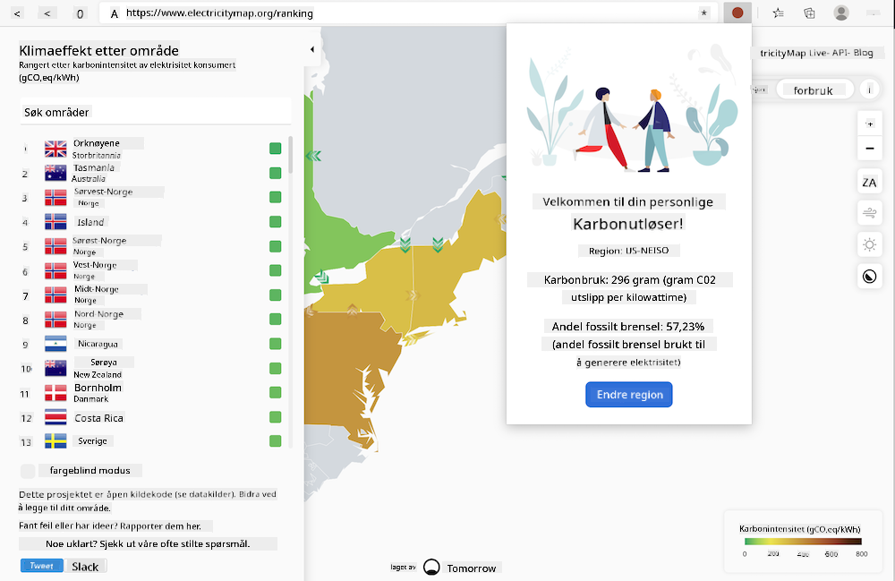

<!--
CO_OP_TRANSLATOR_METADATA:
{
  "original_hash": "b121a279a6ab39878491f3e572673515",
  "translation_date": "2025-08-26T22:31:25+00:00",
  "source_file": "5-browser-extension/README.md",
  "language_code": "no"
}
-->
# Bygge en nettleserutvidelse

Å bygge nettleserutvidelser er en morsom og interessant måte å tenke på ytelsen til appene dine samtidig som du lager en annen type nettressurs. Denne modulen inkluderer leksjoner om hvordan nettlesere fungerer, hvordan du distribuerer en nettleserutvidelse, hvordan du bygger et skjema, kaller en API, bruker lokal lagring, og hvordan du vurderer ytelsen til nettstedet ditt og forbedrer det.

Du vil bygge en nettleserutvidelse som fungerer på Edge, Chrome og Firefox. Denne utvidelsen, som er som et mini-nettsted tilpasset en veldig spesifikk oppgave, sjekker [C02 Signal API](https://www.co2signal.com) for elektrisitetsbruk og karbonintensitet i en gitt region, og gir en avlesning av regionens karbonavtrykk.

Denne utvidelsen kan kalles ad hoc av en bruker når en API-nøkkel og regionkode er lagt inn i et skjema for å bestemme lokal elektrisitetsbruk, og dermed tilby data som kan påvirke brukerens elektrisitetsbeslutninger. For eksempel kan det være bedre å utsette bruk av en tørketrommel (en karbonintensiv aktivitet) i en periode med høy elektrisitetsbruk i din region.

### Emner

1. [Om nettleseren](1-about-browsers/README.md)
2. [Skjemaer og lokal lagring](2-forms-browsers-local-storage/README.md)
3. [Bakgrunnsoppgaver og ytelse](3-background-tasks-and-performance/README.md)

### Krediteringer

## Krediteringer

Ideen til denne karbonutløseren for nettet ble foreslått av Asim Hussain, leder i Microsofts Green Cloud Advocacy-team og forfatter av [Green Principles](https://principles.green/). Det var opprinnelig et [nettstedsprosjekt](https://github.com/jlooper/green).

Strukturen til nettleserutvidelsen ble påvirket av [Adebola Adenirans COVID-utvidelse](https://github.com/onedebos/covtension).

Konseptet bak 'prikk'-ikon-systemet ble foreslått av ikonstrukturen til [Energy Lollipop](https://energylollipop.com/) nettleserutvidelsen for utslipp i California.

Disse leksjonene ble skrevet med ♥️ av [Jen Looper](https://www.twitter.com/jenlooper)

---

**Ansvarsfraskrivelse**:  
Dette dokumentet er oversatt ved hjelp av AI-oversettelsestjenesten [Co-op Translator](https://github.com/Azure/co-op-translator). Selv om vi streber etter nøyaktighet, vær oppmerksom på at automatiserte oversettelser kan inneholde feil eller unøyaktigheter. Det originale dokumentet på sitt opprinnelige språk bør anses som den autoritative kilden. For kritisk informasjon anbefales profesjonell menneskelig oversettelse. Vi er ikke ansvarlige for misforståelser eller feiltolkninger som oppstår ved bruk av denne oversettelsen.