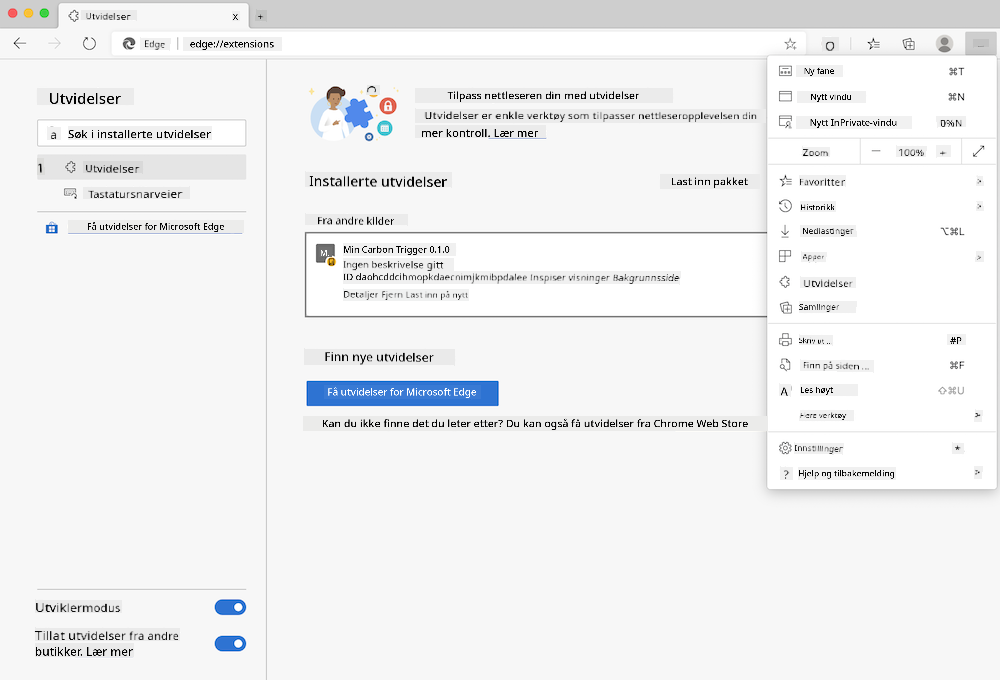

<!--
CO_OP_TRANSLATOR_METADATA:
{
  "original_hash": "9a6b22a2eff0f499b66236be973b24ad",
  "translation_date": "2025-08-26T22:50:40+00:00",
  "source_file": "5-browser-extension/solution/translation/README.it.md",
  "language_code": "no"
}
-->
# Carbon Trigger-nettleserutvidelse: kode for å komme i gang

Vi skal bruke tmrow sin Signal CO2-API for å overvåke strømforbruket og lage en nettleserutvidelse som gir deg en påminnelse direkte i nettleseren om hvor belastende strømforbruket er i ditt område. Bruken av denne spesialutviklede utvidelsen vil hjelpe deg med å vurdere aktivitetene dine basert på denne informasjonen.


## Kom i gang

Du må ha [npm](https://npmjs.com) installert. Last ned en kopi av denne koden til en mappe på datamaskinen din.

Installer alle nødvendige pakker:

```
npm install
```

Bygg utvidelsen med webpack:

```
npm run build
```

For å installere på Edge, bruk "tre prikker"-menyen øverst til høyre i nettleseren for å finne utvidelsespanelet. Hvis det ikke allerede er aktivert, slå på Utviklermodus (nederst til venstre). Velg "Last inn pakket utvidelse" for å laste opp en ny utvidelse. Åpne "dist"-mappen når du blir bedt om det, og utvidelsen vil bli lastet inn. For å bruke den trenger du en API-nøkkel for CO2 Signal-API-en (du kan [få en her via e-post](https://www.co2signal.com/) – skriv inn e-posten din i feltet på denne siden) og [koden for din region](http://api.electricitymap.org/v3/zones) som tilsvarer [elektrisitetskartet](https://www.electricitymap.org/map) (for eksempel er koden for Boston "US-NEISO").



Når API-nøkkelen og regionen er lagt inn i utvidelsens grensesnitt, skal den fargede prikken i nettleserens utvidelseslinje endre seg for å gjenspeile energiforbruket i regionen din og gi en indikasjon på hvilke aktiviteter med høyt energiforbruk som kan være passende å utføre. Konseptet bak dette "prikk"-systemet er inspirert av [Energy Lollipop-utvidelsen](https://energylollipop.com/) for utslipp i California.

---

**Ansvarsfraskrivelse**:  
Dette dokumentet er oversatt ved hjelp av AI-oversettelsestjenesten [Co-op Translator](https://github.com/Azure/co-op-translator). Selv om vi streber etter nøyaktighet, vær oppmerksom på at automatiserte oversettelser kan inneholde feil eller unøyaktigheter. Det originale dokumentet på sitt opprinnelige språk bør anses som den autoritative kilden. For kritisk informasjon anbefales profesjonell menneskelig oversettelse. Vi er ikke ansvarlige for misforståelser eller feiltolkninger som oppstår ved bruk av denne oversettelsen.