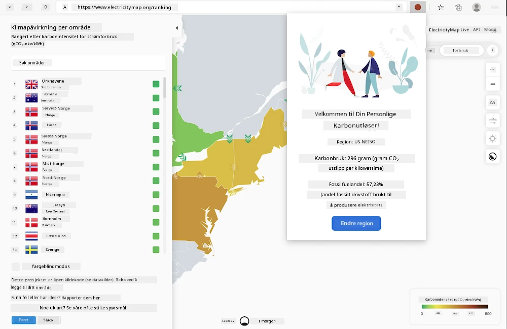

<!--
CO_OP_TRANSLATOR_METADATA:
{
  "original_hash": "26fd39046d264ba185dcb086d3a8cf3e",
  "translation_date": "2025-08-26T22:37:47+00:00",
  "source_file": "5-browser-extension/start/README.md",
  "language_code": "no"
}
-->
# Carbon Trigger Nettleserutvidelse: Startkode

Ved å bruke tmrow's CO2 Signal API for å spore strømforbruk, kan du lage en nettleserutvidelse som gir deg en påminnelse direkte i nettleseren om hvor tungt strømforbruket er i din region. Å bruke denne utvidelsen ad hoc vil hjelpe deg med å ta vurderinger om aktivitetene dine basert på denne informasjonen.



## Komme i gang

Du må ha [npm](https://npmjs.com) installert. Last ned en kopi av denne koden til en mappe på datamaskinen din.

Installer alle nødvendige pakker:

```
npm install
```

Bygg utvidelsen med webpack:

```
npm run build
```

For å installere på Edge, bruk menyen med 'tre prikker' øverst til høyre i nettleseren for å finne utvidelsespanelet. Derfra velger du 'Last inn pakket utvidelse' for å laste inn en ny utvidelse. Åpne 'dist'-mappen når du blir bedt om det, og utvidelsen vil lastes inn. For å bruke den, trenger du en API-nøkkel for CO2 Signal's API ([få en her via e-post](https://www.co2signal.com/) - skriv inn e-posten din i boksen på denne siden) og koden for din region ([finn den her](http://api.electricitymap.org/v3/zones)) som tilsvarer [Electricity Map](https://www.electricitymap.org/map) (for eksempel bruker jeg 'US-NEISO' i Boston).


Når API-nøkkelen og regionen er lagt inn i utvidelsesgrensesnittet, bør den fargede prikken i nettleserens utvidelseslinje endres for å gjenspeile energiforbruket i din region og gi deg en pekepinn på hvilke energikrevende aktiviteter som kan være passende å utføre. Konseptet bak dette 'prikk'-systemet ble gitt til meg av [Energy Lollipop-utvidelsen](https://energylollipop.com/) for utslipp i California.

---

**Ansvarsfraskrivelse**:  
Dette dokumentet er oversatt ved hjelp av AI-oversettelsestjenesten [Co-op Translator](https://github.com/Azure/co-op-translator). Selv om vi streber etter nøyaktighet, vær oppmerksom på at automatiserte oversettelser kan inneholde feil eller unøyaktigheter. Det originale dokumentet på sitt opprinnelige språk bør anses som den autoritative kilden. For kritisk informasjon anbefales profesjonell menneskelig oversettelse. Vi er ikke ansvarlige for eventuelle misforståelser eller feiltolkninger som oppstår ved bruk av denne oversettelsen.