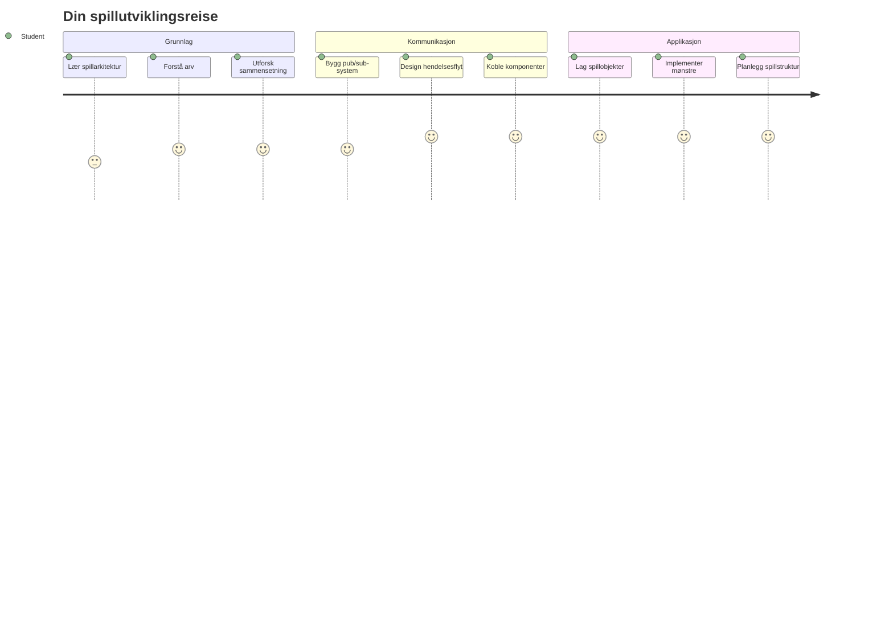
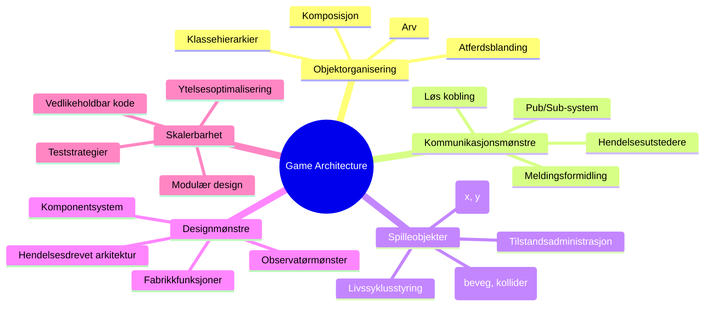
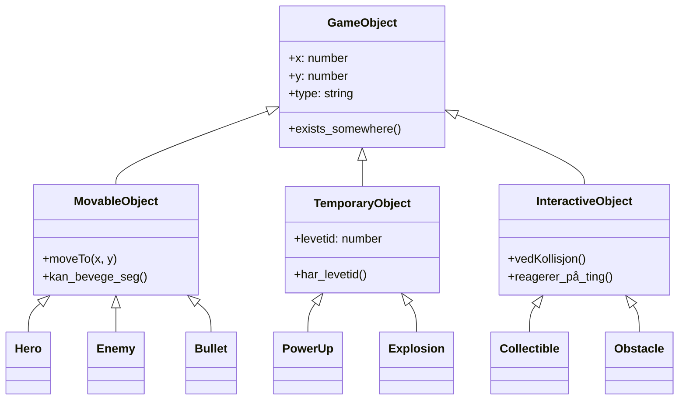
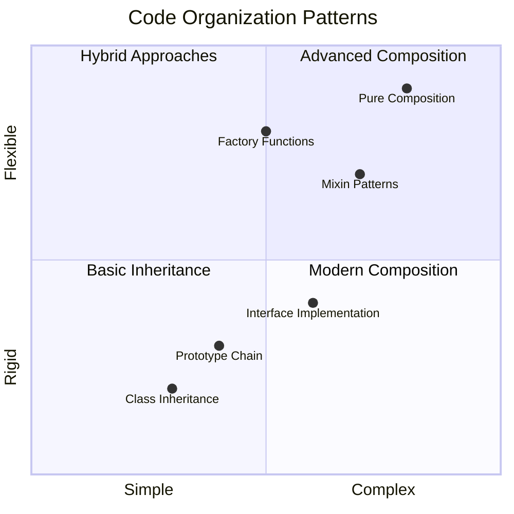
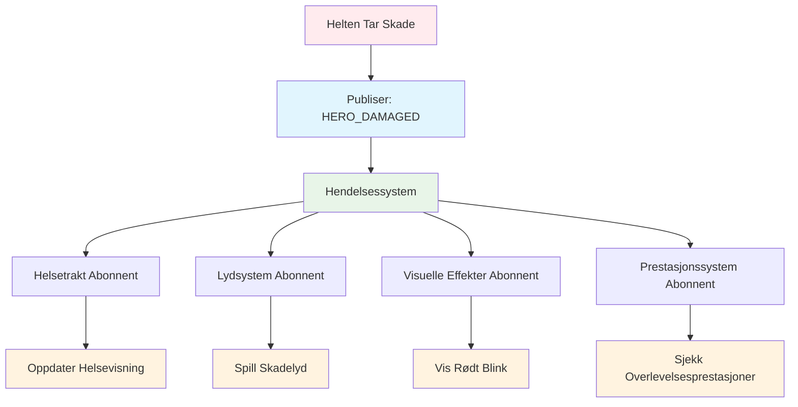
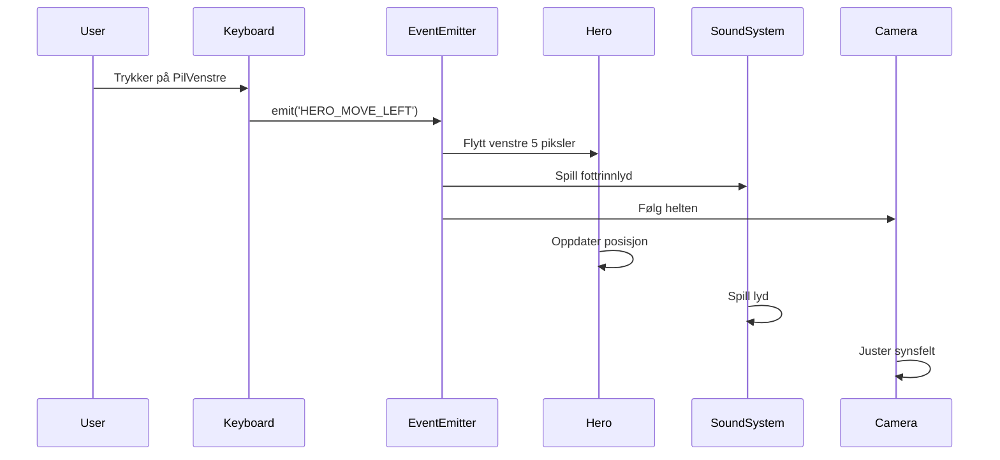
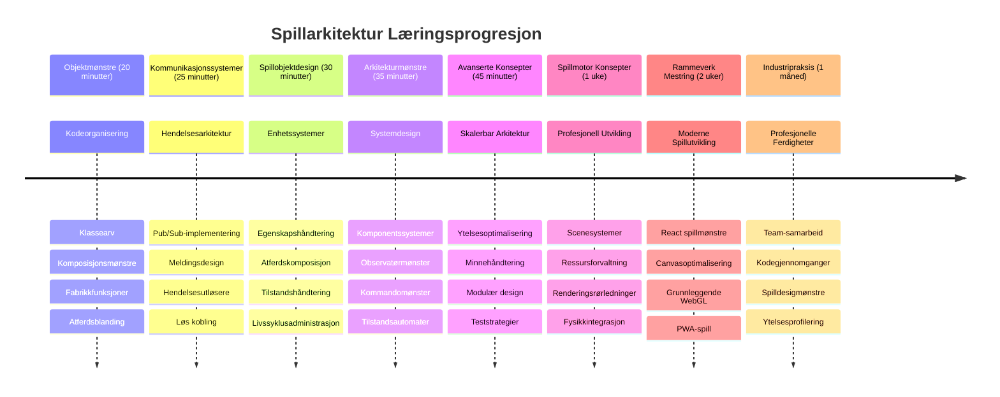

# Bygg et romspill Del 1: Introduksjon




Akkurat som NASAs kontrollsenter koordinerer flere systemer under en romoppskyting, skal vi bygge et romspill som demonstrerer hvordan forskjellige deler av et program kan samarbeide sømløst. Mens du lager noe du faktisk kan spille, vil du lære essensielle programmeringskonsepter som gjelder for ethvert programvareprosjekt.

Vi skal utforske to grunnleggende tilnærminger for å organisere kode: arv og komposisjon. Dette er ikke bare akademiske konsepter – de er de samme mønstrene som driver alt fra videospill til banksystemer. Vi skal også implementere et kommunikasjonssystem kalt pub/sub som fungerer som kommunikasjonsnettverkene brukt i romfartøy, og lar forskjellige komponenter dele informasjon uten å skape avhengigheter.

Ved slutten av denne serien vil du forstå hvordan du bygger applikasjoner som kan skaleres og utvikles – enten du utvikler spill, nettapplikasjoner eller andre programvaresystemer.


## Quiz før forelesning

[Quiz før forelesning](https://ff-quizzes.netlify.app/web/quiz/29)

## Arv og komposisjon i spillutvikling

Etterhvert som prosjekter vokser i kompleksitet, blir kodeorganisering kritisk. Det som starter som et enkelt skript kan bli vanskelig å vedlikeholde uten riktig struktur – akkurat som Apollo-oppdragene krevde nøye koordinering mellom tusenvis av komponenter.

Vi skal utforske to grunnleggende tilnærminger for å organisere kode: arv og komposisjon. Hver har tydelige fordeler, og det å forstå begge hjelper deg å velge riktig tilnærming for ulike situasjoner. Vi skal demonstrere disse konseptene gjennom vårt romspill, hvor helter, fiender, power-ups og andre objekter må samhandle effektivt.

✅ En av de mest berømte programmeringsbøkene som noensinne er skrevet handler om [designmønstre](https://en.wikipedia.org/wiki/Design_Patterns).

I ethvert spill har du `spillobjekter` – de interaktive elementene som fyller spillverdenen din. Helter, fiender, power-ups og visuelle effekter er alle spillobjekter. Hvert eksisterer på spesifikke skjermkoordinater ved bruk av `x` og `y` verdier, lik plotting av punkter i et koordinatsystem.

Til tross for deres visuelle forskjeller, deler disse objektene ofte grunnleggende atferder:

- **De eksisterer et sted** – Hvert objekt har x- og y-koordinater slik at spillet vet hvor det skal tegnes
- **Mange kan bevege seg** – Helter løper, fiender jager, kuler flyr over skjermen
- **De har en levetid** – Noen er der for alltid, andre (som eksplosjoner) vises kortvarig og forsvinner
- **De reagerer på hendelser** – Når ting kolliderer, samles power-ups inn, helsebarer oppdateres

✅ Tenk på et spill som Pac-Man. Kan du identifisere de fire objekttypene nevnt over i dette spillet?


### Å uttrykke atferd gjennom kode

Nå som du forstår de vanlige atferdene spillobjekter deler, la oss utforske hvordan vi kan implementere disse atferdene i JavaScript. Du kan uttrykke objektatferd gjennom metoder knyttet enten til klasser eller individuelle objekter, og det finnes flere tilnærminger å velge mellom.

**Den klassebaserte tilnærmingen**

Klasser og arv gir en strukturert måte å organisere spillobjekter på. Akkurat som taksonomisk klassifiseringssystem utviklet av Carl Linnaeus, starter du med en basis-klasse som inneholder felles egenskaper, deretter lager du spesialiserte klasser som arver disse grunnleggende egenskapene samtidig som de legger til spesifikke funksjoner.

✅ Arv er et viktig konsept å forstå. Lær mer i [MDNs artikkel om arv](https://developer.mozilla.org/docs/Web/JavaScript/Inheritance_and_the_prototype_chain).

Slik kan du implementere spillobjekter ved bruk av klasser og arv:

```javascript
// Trinn 1: Lag den grunnleggende GameObject-klassen
class GameObject {
  constructor(x, y, type) {
    this.x = x;
    this.y = y;
    this.type = type;
  }
}
```

**La oss bryte det ned steg for steg:**
- Vi lager en grunnmal som alle spillobjekter kan bruke
- Konstruktøren lagrer hvor objektet er (`x`, `y`) og hva slags type det er
- Dette blir grunnlaget som alle spillobjektene dine vil bygge videre på

```javascript
// Steg 2: Legg til bevegelsesevne gjennom arv
class Movable extends GameObject {
  constructor(x, y, type) {
    super(x, y, type); // Kall forelderens konstruktør
  }

  // Legg til muligheten til å bevege seg til en ny posisjon
  moveTo(x, y) {
    this.x = x;
    this.y = y;
  }
}
```

**I koden over har vi:**
- **Utvidet** GameObject-klassen for å legge til bevegelsesfunksjonalitet
- **Kalt** foreldrekonstruktøren med `super()` for å initialisere arvede egenskaper
- **Lagt til** en `moveTo()` metode som oppdaterer objektets posisjon

```javascript
// Trinn 3: Lag spesifikke spillobjekttyper
class Hero extends Movable {
  constructor(x, y) {
    super(x, y, 'Hero'); // Sett type automatisk
  }
}

class Tree extends GameObject {
  constructor(x, y) {
    super(x, y, 'Tree'); // Trær trenger ikke bevegelse
  }
}

// Trinn 4: Bruk spillobjektene dine
const hero = new Hero(0, 0);
hero.moveTo(5, 5); // Helten kan bevege seg!

const tree = new Tree(10, 15);
// tree.moveTo() ville forårsake en feil - trær kan ikke bevege seg
```

**Forstå disse konseptene:**
- **Oppretter** spesialiserte objekttyper som arver riktige atferder
- **Demonstrerer** hvordan arv tillater selektiv innsnevring av funksjoner
- **Viser** at helter kan bevege seg mens trær står stille
- **Illustrerer** hvordan klassehierarkiet forhindrer upassende handlinger

✅ Ta noen minutter til å forestille deg en Pac-Man helt (f.eks. Inky, Pinky eller Blinky) og hvordan den ville blitt skrevet i JavaScript.

**Den komposisjonelle tilnærmingen**

Komposisjon følger en modulær designfilosofi, lik hvordan ingeniører designer romfartøy med utskiftbare komponenter. I stedet for å arve fra en foreldreklasse, kombinerer du spesifikke atferder for å lage objekter med akkurat den funksjonaliteten de trenger. Denne tilnærmingen gir fleksibilitet uten rigide hierarkiske begrensninger.

```javascript
// Trinn 1: Opprett grunnleggende atferdsobjekter
const gameObject = {
  x: 0,
  y: 0,
  type: ''
};

const movable = {
  moveTo(x, y) {
    this.x = x;
    this.y = y;
  }
};
```

**Dette gjør denne koden:**
- **Definerer** et basis `gameObject` med posisjon- og typeegenskaper
- **Lager** et separat `movable` atferdsobjekt med bevegelsesfunksjonalitet
- **Separerer** ansvar ved å holde posisjonsdata og bevegelseslogikk uavhengige

```javascript
// Steg 2: Sett sammen objekter ved å kombinere atferd
const movableObject = { ...gameObject, ...movable };

// Steg 3: Lag fabrikkfunksjoner for forskjellige objekttyper
function createHero(x, y) {
  return {
    ...movableObject,
    x,
    y,
    type: 'Hero'
  };
}

function createStatic(x, y, type) {
  return {
    ...gameObject,
    x,
    y,
    type
  };
}
```

**I koden over har vi:**
- **Kombinert** basisobjektets egenskaper med bevegelsesatferd ved bruk av spread-syntaks
- **Opprettet** fabrikkfunksjoner som returnerer tilpassede objekter
- **Muliggjort** fleksibel objektopprettelse uten rigide klassehierarkier
- **Tillatt** at objekter har akkurat de atferdene de trenger

```javascript
// Trinn 4: Opprett og bruk dine sammensatte objekter
const hero = createHero(10, 10);
hero.moveTo(5, 5); // Fungerer perfekt!

const tree = createStatic(0, 0, 'Tree');
// tree.moveTo() er udefinert - ingen bevegelsesatferd ble satt sammen
```

**Viktige punkter å huske:**
- **Setter sammen** objekter ved å blande atferder i stedet for å arve dem
- **Gir** mer fleksibilitet enn rigide arvshierarkier
- **Lar** objekter ha akkurat de funksjonene de trenger
- **Bruker** moderne JavaScript spread-syntaks for ren objektkombinasjon 

```

**Which Pattern Should You Choose?**

**Which Pattern Should You Choose?**



> 💡 **Tips:** Begge mønstrene har sin plass i moderne JavaScript-utvikling. Klasser fungerer godt for klart definerte hierarkier, mens komposisjon lyser når du trenger maksimal fleksibilitet.
> 
**Her er når du bør bruke hver tilnærming:**
- **Velg** arv når du har klare "er-en" relasjoner (en Helt *er en* Bevegelig objekt)
- **Velg** komposisjon når du har "har-en" relasjoner (en Helt *har* bevegelsesegenskaper)
- **Ta hensyn til** teamets preferanser og prosjektkrav
- **Husk** at du kan blande begge tilnærminger i samme applikasjon

### 🔄 **Pedagogisk sjekk**
**Forståelse av objektorganisering**: Før du går videre til kommunikasjonsmønstre, sørg for at du kan:
- ✅ Forklare forskjellen mellom arv og komposisjon
- ✅ Identifisere når man skal bruke klasser vs fabrikkfunksjoner
- ✅ Forstå hvordan `super()` nøkkelordet fungerer i arv
- ✅ Anerkjenne fordelene med hver tilnærming for spillutvikling

**Raske spørsmål:** Hvordan ville du laget en Flyvende Fiende som både kan flytte seg og fly?
- **Arvstilnærming**: `class FlyingEnemy extends Movable`
- **Komposisjonstilnærming**: `{ ...movable, ...flyable, ...gameObject }`

**Virkelighetsforbindelse:** Disse mønstrene finnes overalt:
- **React-komponenter**: Props (komposisjon) vs klassearv
- **Spillmotorer**: Entitet-komponent-systemer bruker komposisjon
- **Mobilapper**: UI-rammeverk bruker ofte arvehierarkier

## Kommunikasjonsmønstre: Pub/Sub-systemet

Etterhvert som applikasjoner vokser i kompleksitet, blir det utfordrende å håndtere kommunikasjon mellom komponenter. Publish-subscribe-mønsteret (pub/sub) løser dette problemet ved å bruke prinsipper som ligner på radioutsending – én sender kan nå flere mottakere uten å vite hvem som lytter.

Tenk på hva som skjer når en helt tar skade: helsebaren oppdateres, lydeffekter spilles av, visuell feedback vises. I stedet for å koble helt-objektet direkte til disse systemene, lar pub/sub helten sende ut en melding om "skade tatt". Ethvert system som må reagere, kan abonnere på denne meldingstypen og svare deretter.

✅ **Pub/Sub** står for 'publish-subscribe'


### Forståelse av Pub/Sub-arkitekturen

Pub/sub-mønsteret holder forskjellige deler av applikasjonen løst koblet, noe som betyr at de kan samarbeide uten å være direkte avhengige av hverandre. Denne separasjonen gjør koden din mer vedlikeholdbar, testbar og fleksibel for endringer.

**Hovedaktørene i pub/sub:**
- **Meldinger** – Enkle tekstetiketter som `'PLAYER_SCORED'` som beskriver hva som skjedde (pluss ekstra info)
- **Utgivere** – Objektene som roper ut "Noe skjedde!" til alle som lytter
- **Abonnenter** – Objektene som sier "Jeg bryr meg om denne hendelsen" og reagerer når den skjer
- **Hendelsessystemet** – Mellommannen som sørger for at meldinger når rett mottakere

### Bygge et hendelsessystem

La oss lage et enkelt men kraftig hendelsessystem som demonstrerer disse konseptene:

```javascript
// Trinn 1: Opprett EventEmitter-klassen
class EventEmitter {
  constructor() {
    this.listeners = {}; // Lagre alle hendelseslyttere
  }
  
  // Registrer en lytter for en bestemt meldingstype
  on(message, listener) {
    if (!this.listeners[message]) {
      this.listeners[message] = [];
    }
    this.listeners[message].push(listener);
  }
  
  // Send en melding til alle registrerte lyttere
  emit(message, payload = null) {
    if (this.listeners[message]) {
      this.listeners[message].forEach(listener => {
        listener(message, payload);
      });
    }
  }
}
```

**Forklarer hva som skjer her:**
- **Lager** et sentralt hendelseshåndteringssystem med en enkel klasse
- **Lagrer** lyttere i et objekt organisert etter meldingstype
- **Registrerer** nye lyttere med `on()`-metoden
- **Sender ut** meldinger til alle interesserte lyttere med `emit()`
- **Støtter** valgfrie dataparametere for å overføre relevant info

### Sette det hele sammen: Et praktisk eksempel

La oss se dette i praksis! Vi skal bygge et enkelt bevegelsessystem som viser hvor rent og fleksibelt pub/sub kan være:

```javascript
// Trinn 1: Definer meldingstypene dine
const Messages = {
  HERO_MOVE_LEFT: 'HERO_MOVE_LEFT',
  HERO_MOVE_RIGHT: 'HERO_MOVE_RIGHT',
  ENEMY_SPOTTED: 'ENEMY_SPOTTED'
};

// Trinn 2: Lag ditt hendelsessystem og spillobjekter
const eventEmitter = new EventEmitter();
const hero = createHero(0, 0);
```

**Dette gjør denne koden:**
- **Definerer** et konstantobjekt for å forhindre skrivefeil i meldingsnavn
- **Oppretter** en event emitter-instans for all kommunikasjon
- **Initialiserer** en helt med startposisjon

```javascript
// Trinn 3: Sett opp hendelseslyttere (abonnenter)
eventEmitter.on(Messages.HERO_MOVE_LEFT, () => {
  hero.moveTo(hero.x - 5, hero.y);
  console.log(`Hero moved to position: ${hero.x}, ${hero.y}`);
});

eventEmitter.on(Messages.HERO_MOVE_RIGHT, () => {
  hero.moveTo(hero.x + 5, hero.y);
  console.log(`Hero moved to position: ${hero.x}, ${hero.y}`);
});
```

**I koden over har vi:**
- **Registrert** hendelseslyttere som reagerer på bevegelsesmeldinger
- **Oppdatert** heltens posisjon basert på bevegelsesretning
- **Lagt til** logging i konsollen for å spore heltens posisjonsendringer
- **Separert** bevegelseslogikk fra input-håndtering

```javascript
// Trinn 4: Koble tastaturinngang til hendelser (utgivere)
window.addEventListener('keydown', (event) => {
  switch(event.key) {
    case 'ArrowLeft':
      eventEmitter.emit(Messages.HERO_MOVE_LEFT);
      break;
    case 'ArrowRight':
      eventEmitter.emit(Messages.HERO_MOVE_RIGHT);
      break;
  }
});
```

**Forstå disse konseptene:**
- **Kobler** tastaturinput til spillets hendelser uten tett kobling
- **Muliggjør** at inputsystemet kommuniserer indirekte med spillobjekter
- **Lar** flere systemer svare på de samme tastaturhendelsene
- **Gjør** det enkelt å endre tastebindinger eller legge til nye inputmetoder


> 💡 **Tips:** Det fine med dette mønsteret er fleksibiliteten! Du kan enkelt legge til lydeffekter, skjermrystelser eller partikkeffekter ved å bare legge til flere hendelseslyttere – uten å endre eksisterende tastatur- eller bevegelseskode.
> 
**Derfor vil du like denne tilnærmingen:**
- Å legge til nye funksjoner blir superenkelt – bare hør på hendelser du bryr deg om
- Flere ting kan reagere på samme hendelse uten å forstyrre hverandre
- Testing blir mye enklere fordi hver del fungerer uavhengig
- Når noe går galt, vet du nøyaktig hvor du skal lete

### Hvorfor Pub/Sub skalerer effektivt

Pub/sub-mønsteret holder ting enkelt selv når applikasjoner vokser i kompleksitet. Enten det handler om å styre dusinvis av fiender, dynamiske UI-oppdateringer eller lydsystemer, håndterer mønsteret økt skala uten arkitektoniske endringer. Nye funksjoner integreres i eksisterende hendelsessystem uten å påvirke etablert funksjonalitet.

> ⚠️ **Vanlig feil:** Ikke lag for mange spesifikke meldingstyper tidlig. Start med brede kategorier og gjør dem mer detaljerte etter hvert som spillets behov blir tydeligere.
> 
**Beste praksis å følge:**
- **Grupperer** relaterte meldinger i logiske kategorier
- **Bruker** beskrivende navn som tydelig indikerer hva som skjedde
- **Holder** meldingsdata enkle og fokuserte
- **Dokumenterer** meldingstypene for team-samarbeid

### 🔄 **Pedagogisk sjekk**
**Forståelse av hendelsesdrevet arkitektur**: Sjekk forståelsen din av hele systemet:
- ✅ Hvordan hindrer pub/sub tett kobling mellom komponenter?
- ✅ Hvorfor er det enklere å legge til nye funksjoner med hendelsesdrevet arkitektur?
- ✅ Hvilken rolle spiller EventEmitter i kommunikasjonsflyten?
- ✅ Hvordan hjelper meldingkonstanter med å unngå feil og forbedre vedlikehold?

**Designutfordring:** Hvordan ville du håndtert disse spillscenariene med pub/sub?
1. **Fiende dør**: Oppdatere poengsum, spille lyd, spawn power-up, fjerne fra skjerm
2. **Nivå fullført**: Stoppe musikk, vise UI, lagre fremdrift, laste neste nivå
3. **Power-up samlet**: Forbedre evner, oppdatere UI, spille effekt, starte timer

**Profesjonell forbindelse:** Dette mønsteret finnes i:
- **Frontend-rammeverk**: React/Vue hendelsessystemer
- **Backend-tjenester**: Mikrotjenestekommunikasjon
- **Spillmotorer**: Unitys hendelsessystem
- **Mobilutvikling**: iOS/Android notifikasjonssystemer

---

## GitHub Copilot Agent-utfordring 🚀

Bruk Agent-modus til å fullføre følgende utfordring:

**Beskrivelse:** Lag et enkelt system for spillobjekter ved bruk av både arv og pub/sub-mønsteret. Du skal implementere et grunnleggende spill hvor forskjellige objekter kan kommunisere gjennom hendelser uten å vite direkte om hverandre.

**Oppgave:** Lag et JavaScript-spillsystem med disse kravene: 1) Lag en basis GameObject-klasse med x, y-koordinater og en type-egenskap. 2) Lag en Hero-klasse som arver fra GameObject og kan bevege seg. 3) Lag en Enemy-klasse som arver fra GameObject og kan jage helten. 4) Implementer en EventEmitter-klasse for pub/sub-mønsteret. 5) Sett opp hendelseslyttere slik at når helten beveger seg, mottar nærliggende fiender en 'HERO_MOVED'-hendelse og oppdaterer posisjonen sin for å bevege seg mot helten. Inkluder console.log-statementer for å vise kommunikasjonen mellom objektene.

Lær mer om [agent-modus](https://code.visualstudio.com/blogs/2025/02/24/introducing-copilot-agent-mode) her.

## 🚀 Utfordring
Vurder hvordan pub-sub-mønsteret kan forbedre spillarkitektur. Identifiser hvilke komponenter som bør sende ut hendelser og hvordan systemet bør reagere. Design et spillkonsept og kartlegg kommunikasjonsmønstrene mellom komponentene.

## Post-forelesningsquiz

[Post-forelesningsquiz](https://ff-quizzes.netlify.app/web/quiz/30)

## Gjennomgang & Selvstudium

Lær mer om Pub/Sub ved å [lese om det](https://docs.microsoft.com/azure/architecture/patterns/publisher-subscriber/?WT.mc_id=academic-77807-sagibbon).

### ⚡ **Hva du kan gjøre de neste 5 minuttene**
- [ ] Åpne et hvilket som helst HTML5-spill på nettet og inspiser koden med DevTools
- [ ] Lag et enkelt HTML5 Canvas-element og tegn en grunnleggende form
- [ ] Prøv å bruke `setInterval` for å lage en enkel animasjonsloop
- [ ] Utforsk Canvas API-dokumentasjonen og prøv en tegnemetode

### 🎯 **Hva du kan oppnå denne timen**
- [ ] Fullfør post-leksjonsquizen og forstå spillutviklingskonsepter
- [ ] Sett opp spillprosjektstrukturen med HTML, CSS og JavaScript-filer
- [ ] Lag en grunnleggende spill-løkke som oppdaterer og tegner kontinuerlig
- [ ] Tegn dine første spillsprites på canvasen
- [ ] Implementer grunnleggende lasting av ressurser for bilder og lyder

### 📅 **Din ukelange spillutvikling**
- [ ] Fullfør hele romspillet med alle planlagte funksjoner
- [ ] Legg til polert grafikk, lydeffekter og jevne animasjoner
- [ ] Implementer spilltilstander (startskjerm, spilling, spill over)
- [ ] Lag et scoringssystem og spor spillerens fremgang
- [ ] Gjør spillet ditt responsivt og tilgjengelig på tvers av enheter
- [ ] Del spillet ditt på nettet og samle tilbakemeldinger fra spillere

### 🌟 **Din månedslange spillutvikling**
- [ ] Bygg flere spill som utforsker forskjellige sjangere og mekanikker
- [ ] Lær et spillutviklingsrammeverk som Phaser eller Three.js
- [ ] Bidra til open source spillutviklingsprosjekter
- [ ] Mestre avanserte spillprogrammeringsmønstre og optimalisering
- [ ] Lag en portefølje som viser frem dine ferdigheter innen spillutvikling
- [ ] Veilede andre som er interessert i spillutvikling og interaktive medier

## 🎯 Din tidslinje for mestring av spillutvikling


### 🛠️ Sammendrag av ditt spillarkitekturverktøy

Etter å ha fullført denne leksjonen har du nå:
- **Mestring av designmønstre**: Forståelse av arv vs. komposisjon og deres kompromisser
- **Hendelsesdrevet arkitektur**: Pub/sub-implementasjon for skalerbar kommunikasjon
- **Objektorientert design**: Klassehierarkier og atferdskomposisjon
- **Moderne JavaScript**: Fabrikkfunksjoner, spread-syntaks og ES6+-mønstre
- **Skalerbar arkitektur**: Løst koblede og modulære designprinsipper
- **Grunnlag for spillutvikling**: Enhetssystemer og komponentmønstre
- **Profesjonelle mønstre**: Industristandarder for kodeorganisering

**Virkelige bruksområder**: Disse mønstrene anvendes direkte på:
- **Frontend-rammeverk**: React/Vue-komponentarkitektur og tilstandsadministrasjon
- **Backend-tjenester**: Mikrotjenestekommunikasjon og hendelsesdrevne systemer
- **Mobilutvikling**: iOS/Android-apparkitektur og varslingssystemer
- **Spillmotorer**: Unity, Unreal og nettbasert spillutvikling
- **Enterprise-programvare**: Hendelseskildring og distribuert systemdesign
- **API-design**: RESTful tjenester og sanntidskommunikasjon

**Profesjonelle ferdigheter oppnådd**: Du kan nå:
- **Designe** skalerbare programvarearkitekturer med beprøvde mønstre
- **Implementere** hendelsesdrevne systemer som håndterer komplekse interaksjoner
- **Velge** passende kodeorganiseringsstrategier for ulike scenarioer
- **Feilsøke** og vedlikeholde løst koblede systemer effektivt
- **Kommunisere** tekniske beslutninger ved bruk av industristandard terminologi

**Neste nivå**: Du er klar til å implementere disse mønstrene i et ekte spill, utforske avanserte temaer innen spillutvikling, eller anvende disse arkitekturkonseptene på nettapplikasjoner!

🌟 **Prestasjon oppnådd**: Du har mestret grunnleggende programvarearkitektur-mønstre som driver alt fra enkle spill til komplekse bedriftsystemer!

## Oppgave

[Skissér et spill](assignment.md)

---

<!-- CO-OP TRANSLATOR DISCLAIMER START -->
**Ansvarsfraskrivelse**:
Dette dokumentet er oversatt ved hjelp av AI-oversettelsestjenesten [Co-op Translator](https://github.com/Azure/co-op-translator). Selv om vi streber etter nøyaktighet, vennligst vær oppmerksom på at automatiserte oversettelser kan inneholde feil eller unøyaktigheter. Det originale dokumentet på dets opprinnelige språk bør anses som den autoritative kilden. For kritisk informasjon anbefales profesjonell menneskelig oversettelse. Vi er ikke ansvarlige for eventuelle misforståelser eller feiltolkninger som oppstår fra bruken av denne oversettelsen.
<!-- CO-OP TRANSLATOR DISCLAIMER END -->